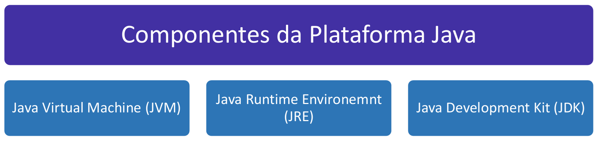
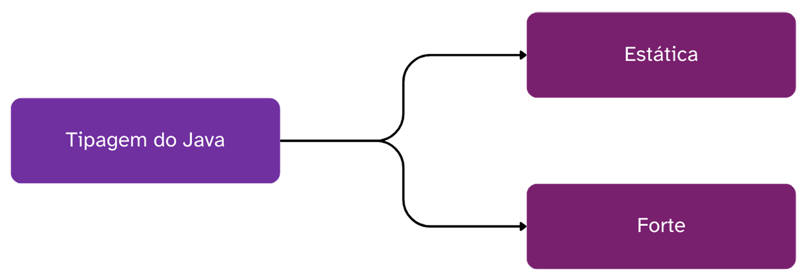

# Capítulo 1 – Conceitos Gerais e a Plataforma Java

Antes de mergulharmos nas profundezas da sintaxe e dos recursos avançados, é fundamental construir uma base sólida sobre o que é o Java, sua história e, mais importante, sua arquitetura fundamental. Compreender os conceitos que definem o Java não é apenas um requisito acadêmico; é o que diferencia um desenvolvedor que apenas "escreve código" de um profissional que entende como e por que suas aplicações funcionam da maneira que o fazem.

## O Que é Java? A Promessa do "Escreva Uma Vez, Rode em Qualquer Lugar"

Java é uma linguagem de programação de alto nível, robusta e orientada a objetos, concebida pela Sun Microsystems no início da década de 1990 e lançada oficialmente ao mundo em 1995. Em uma era dominada por linguagens como C e C++, que exigiam recompilação de código para cada sistema operacional diferente, a equipe da Sun, liderada por James Gosling, tinha uma visão revolucionária. O objetivo era criar uma linguagem que pudesse ser executada em uma vasta gama de dispositivos — de computadores de mesa a eletrodomésticos e sistemas embarcados — sem a necessidade de qualquer modificação no código-fonte.

Essa filosofia foi imortalizada no mantra **“Write Once, Run Anywhere” (WORA)**, ou "Escreva uma vez, rode em qualquer lugar". Essa promessa de portabilidade foi, e continua sendo, um dos pilares do sucesso massivo do Java. A peça-chave que tornou essa portabilidade uma realidade é a **Java Virtual Machine (JVM)**, ou Máquina Virtual Java, um conceito que exploraremos em detalhe mais adiante.

Em 2010, um novo capítulo na história do Java foi escrito quando a Oracle Corporation adquiriu a Sun Microsystems. Desde então, a Oracle tornou-se a principal mantenedora e impulsionadora da plataforma, garantindo sua evolução contínua e sua relevância no cenário tecnológico. Hoje, o ecossistema Java é vasto, com estimativas de que mais de 3 bilhões de dispositivos em todo o mundo rodam código Java.

Sua versatilidade permite que seja aplicado em uma multiplicidade de domínios, incluindo:

- **Aplicações para Desktops:** Softwares robustos com interfaces gráficas ricas, utilizando bibliotecas como Swing e JavaFX.
- **Aplicações para Dispositivos Móveis:** É a linguagem oficial para o desenvolvimento de aplicativos nativos para o sistema operacional Android.
- **Aplicações Web e Servidores:** O Java é uma força dominante no desenvolvimento de back-end de aplicações web complexas e de grande escala, com frameworks como Spring e Jakarta EE (anteriormente Java EE) sendo amplamente utilizados em ambientes corporativos.
- **Jogos:** Embora não seja a escolha predominante para jogos de ponta (AAA), o Java foi a base para fenômenos como _Minecraft_ e é amplamente utilizado em jogos independentes e para dispositivos móveis.
- **Sistemas Embarcados e Big Data:** Sua robustez e ecossistema de bibliotecas o tornam uma escolha viável para sistemas embarcados, dispositivos de IoT (Internet das Coisas) e para ferramentas de processamento de grandes volumes de dados, como Hadoop e Spark.

## Java como Plataforma: O Ecossistema JDK, JRE e JVM

É um erro comum pensar no Java apenas como uma linguagem de programação. Na realidade, Java é uma **plataforma de desenvolvimento completa**. Essa plataforma é um ecossistema coeso composto por três componentes fundamentais que trabalham em conjunto para permitir o desenvolvimento e a execução de aplicações. São eles: o Java Development Kit (JDK), o Java Runtime Environment (JRE) e a Java Virtual Machine (JVM).

<div align="center">

</div>

A imagem acima ilustra a relação hierárquica entre esses três componentes. O JDK contém o JRE, que por sua vez contém a JVM. Vamos desmembrar o papel de cada um.

### JVM (Java Virtual Machine)

A JVM é o coração da plataforma Java e a tecnologia que habilita o princípio WORA. Ela funciona como um "computador abstrato" ou um "processador virtual" que reside sobre o sistema operacional real da máquina (Windows, Linux, macOS, etc.).

O processo funciona da seguinte maneira:

1. O desenvolvedor escreve o código-fonte em um arquivo com a extensão `.java`.
2. Esse arquivo é passado para o compilador Java (`javac`), que não o traduz para código de máquina nativo (como um compilador de C++ faria). Em vez disso, ele o compila para um formato intermediário chamado **bytecode**. O bytecode é um conjunto de instruções altamente otimizado e independente de plataforma, armazenado em arquivos com a extensão `.class`.
3. Quando um usuário executa a aplicação, é a JVM que entra em ação. Ela carrega o arquivo `.class`, interpreta o bytecode e o traduz para instruções de máquina nativas que o sistema operacional hospedeiro pode entender e executar.

Como cada sistema operacional possui sua própria implementação da JVM, desenvolvida especificamente para ele, o mesmo arquivo de bytecode pode ser executado em qualquer lugar que tenha uma JVM instalada. É a JVM que lida com as particularidades de cada sistema, abstraindo essa complexidade do desenvolvedor.

### JRE (Java Runtime Environment)

O JRE é o ambiente de tempo de execução do Java. Ele é o pacote que um usuário final precisa ter instalado em sua máquina para **rodar** uma aplicação Java. O JRE inclui dois componentes principais:

1. A **JVM**, conforme descrito acima.
2. As **Bibliotecas Padrão da Linguagem (Java Class Library)**: um vasto conjunto de classes e APIs pré-construídas que oferecem funcionalidades essenciais, como manipulação de texto, estruturas de dados (listas, mapas), operações de rede, acesso a arquivos, e muito mais.

Em resumo, o JRE fornece tudo o que é necessário para a execução de um programa Java, mas não inclui as ferramentas necessárias para o desenvolvimento, como o compilador.

### JDK (Java Development Kit)

O JDK é o kit de desenvolvimento Java. Como o nome sugere, este é o pacote completo destinado aos **desenvolvedores de software**. Ele é um superconjunto que engloba tudo o que está no JRE (incluindo a JVM e as bibliotecas) e adiciona um conjunto de ferramentas essenciais para o desenvolvimento, depuração e monitoramento de aplicações Java. As ferramentas mais importantes incluem:

- **`javac`**: O compilador, que transforma código-fonte `.java` em bytecode `.class`.
- **`java`**: O lançador de aplicações, responsável por iniciar a JVM para executar o bytecode.
- **`jar`**: O arquivador, que agrupa múltiplos arquivos `.class` e recursos (como imagens e configurações) em um único arquivo `.jar` distribuível.
- **`javadoc`**: O gerador de documentação, que extrai comentários do código-fonte para criar uma documentação HTML da API.
- **Depurador e Profilers**: Ferramentas para encontrar erros (bugs) e analisar a performance da aplicação.

Portanto, para desenvolver em Java, você precisa do JDK. Para apenas executar uma aplicação Java, o JRE é suficiente.

## Anatomia de um Programa Básico: "Olá, Mundo!"

A sintaxe do Java, especialmente para quem vem de linguagens com menos "cerimônia" como Python ou JavaScript, pode parecer um pouco verbosa e complexa em um primeiro contato. No entanto, cada parte dessa estrutura tem um propósito claro. Vamos analisar o programa mais fundamental, o "Olá, Mundo!":

```java
public class OlaMundo {
    public static void main(String[] args) {
        System.out.println("Olá, mundo!");
    }
}
```

Este pequeno bloco de código, que deve ser salvo em um arquivo chamado `OlaMundo.java`, contém vários conceitos centrais da linguagem. Vamos dissecá-lo linha por linha:

- `public class OlaMundo`: Esta linha define uma **classe** pública chamada `OlaMundo`. Em Java, todo código executável deve residir dentro de uma classe. A classe é o projeto fundamental para a criação de objetos. A palavra-chave `public` é um modificador de acesso, indicando que esta classe pode ser acessada por qualquer outra classe. Uma regra fundamental é que o nome da classe pública deve corresponder exatamente ao nome do arquivo (neste caso, `OlaMundo.java`).
- `public static void main(String[] args)`: Este é o **método principal**. Pense nele como o portão de entrada da sua aplicação. Quando a JVM inicia a execução do seu programa, ela procura especificamente por este método com esta assinatura exata.
    - `public`: Novamente, indica que o método é acessível de qualquer lugar.
    - `static`: Significa que o método pertence à classe `OlaMundo` em si, e não a uma instância (objeto) específica dela. Isso permite que a JVM chame o método sem precisar primeiro criar um objeto `OlaMundo`.
    - `void`: Indica que este método não retorna nenhum valor ao final de sua execução.
    - `main`: É o nome que a JVM procura por padrão.
    - `(String[] args)`: Define um parâmetro chamado `args`, que é um array de Strings. Ele serve para receber argumentos passados pela linha de comando quando o programa é executado.
- `System.out.println("Olá, mundo!");`: Esta é a instrução que realiza a ação de imprimir uma mensagem no console.
    - `System`: É uma classe final que faz parte das bibliotecas padrão do Java. Ela nos dá acesso a recursos do sistema.
    - `out`: É um campo estático dentro da classe `System`. Este campo é um objeto do tipo `PrintStream`, que representa o fluxo de saída padrão (geralmente, o console).
    - `println()`: É um método do objeto `out`. O nome é uma abreviação de "print line" (imprimir linha). Ele exibe o texto passado como argumento e, em seguida, move o cursor para a próxima linha.

## Características Fundamentais: Tipagem Estática e Forte

Conforme o exemplo de código sugere, Java é uma linguagem que leva a sério a forma como os dados são definidos e manipulados. Isso se manifesta em duas características cruciais: a tipagem estática e a tipagem forte.

<div align="center">

</div>

### Tipagem Estática (Static Typing)

Java é uma linguagem de **tipagem estática**. Isso significa que os tipos de todas as variáveis, parâmetros e retornos de métodos devem ser declarados explicitamente no código-fonte, e essa checagem de tipos é realizada em **tempo de compilação**.

Por exemplo, para declarar uma variável que armazenará um número inteiro, você deve escrever:

```java
int idade = 30;
```

Se, em algum outro ponto do código, você tentar atribuir um valor incompatível a essa variável, o compilador irá gerar um erro antes mesmo de o programa ser executado:

```java
int idade = 30;
// A linha abaixo causará um ERRO DE COMPILAÇÃO
// idade = "trinta"; // Erro: tipos incompatíveis: String não pode ser convertida para int
```

A principal vantagem da tipagem estática é a **segurança** e a **detecção precoce de erros**. Muitos bugs que em linguagens de tipagem dinâmica só apareceriam durante a execução (potencialmente em produção) são capturados pelo compilador Java, tornando o código mais robusto e confiável.

### Tipagem Forte (Strong Typing)

Além de estática, a tipagem em Java é **forte**. Isso significa que a linguagem impõe regras estritas sobre como os tipos de dados podem interagir. Não são permitidas conversões implícitas (automáticas) entre tipos de dados que possam resultar em perda de informação ou comportamento inesperado.

Por exemplo, você não pode simplesmente atribuir um número de ponto flutuante (que pode ter casas decimais) a uma variável do tipo inteiro (que não pode) sem realizar uma conversão explícita, chamada de _cast_.

```java
double preco = 99.99;
// A linha abaixo causará um ERRO DE COMPILAÇÃO
// int precoInteiro = preco; // Erro: tipos incompatíveis: possível perda de conversão de double para int

// Para funcionar, é preciso fazer uma conversão explícita (cast):
int precoInteiro = (int) preco; // Agora, precoInteiro valerá 99 (a parte decimal é truncada)
```

Essa característica evita ambiguidades e garante que o desenvolvedor esteja ciente das consequências de misturar diferentes tipos de dados, contribuindo para a previsibilidade e a robustez do programa.

