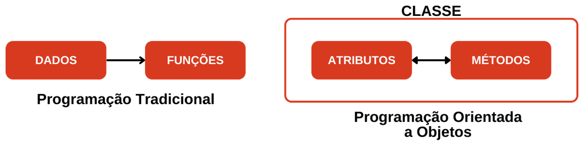

# Capítulo 9 – Programação Orientada a Objetos: Modelando o Mundo Real

Nos capítulos anteriores, construímos um arsenal sólido de ferramentas da linguagem Java. Aprendemos a declarar dados com tipos, a manipulá-los com operadores, a controlar o fluxo de execução com condicionais e laços, a organizar informações em estruturas de dados e a tratar situações inesperadas com exceções. Dominamos a **mecânica** da programação.

Agora, estamos prontos para um salto conceitual. Este capítulo introduz uma nova forma de pensar e de estruturar nosso código, uma filosofia que está no coração da linguagem Java: a **Programação Orientada a Objetos (POO)**.

## O Que é um Paradigma de Programação?

Antes de mergulharmos na Orientação a Objetos, é crucial entender o que é um **paradigma de programação**. Um paradigma é um modelo, um estilo ou uma filosofia que guia a forma como organizamos e escrevemos nosso código. Ele estabelece os princípios e as técnicas para resolver problemas, influenciando como pensamos sobre os dados e as operações.

Pense nos paradigmas como diferentes escolas de pensamento na arquitetura. Um arquiteto modernista seguirá princípios de minimalismo e funcionalidade, enquanto um arquiteto clássico seguirá princípios de simetria e ornamentação. Ambos constroem edifícios, mas suas abordagens, ferramentas e resultados são fundamentalmente diferentes. Na programação, o paradigma que adotamos define a arquitetura do nosso software.

## A Mudança de Perspectiva: Procedural vs. Orientado a Objetos

Até agora, o estilo de programação que utilizamos, de forma implícita, se assemelha ao **paradigma procedural**. Nesse modelo, o foco está em uma sequência de passos, em um conjunto de procedimentos (funções ou métodos) que atuam sobre blocos de dados. Os dados e as operações que os manipulam são, em grande parte, entidades separadas.

A **Programação Orientada a Objetos (POO)** propõe uma mudança radical nessa perspectiva. Em vez de focar nos procedimentos, o paradigma de OO se concentra em **objetos**. Um objeto é uma entidade de software que agrupa, de forma coesa, **dados** e as **operações** que podem ser realizadas sobre esses dados.

O objetivo da POO é modelar entidades do mundo real ou conceitual (um `Cliente`, uma `NotaFiscal`, uma `ConexaoDeBancoDeDados`) como objetos autônomos e autossuficientes.

<div align="center">



</div>

A imagem acima ilustra perfeitamente essa transição. Na programação tradicional (à esquerda), temos os dados de um lado e um conjunto de funções separadas que operam sobre esses dados. Na Programação Orientada a Objetos (à direita), os dados e as operações são unificados dentro de classes e objetos. Um objeto `Cliente`, por exemplo, não é apenas um conjunto de dados (como nome, CPF); ele também contém os comportamentos (métodos) relacionados a ele, como `validarCPF()` ou `calcularLimiteDeCredito()`.

Essa unificação traz enormes vantagens, especialmente em sistemas complexos:

- **Organização**: O código relacionado a um mesmo conceito fica agrupado em um único lugar, tornando o sistema mais fácil de entender.
- **Manutenibilidade**: Se a regra para validar um CPF mudar, a alteração é feita em um único local: o método `validarCPF()` dentro da representação do `Cliente`.
- **Reusabilidade**: Um objeto bem construído, como uma classe para manipular datas, pode ser facilmente reutilizado em múltiplos projetos.
- **Escalabilidade**: Sistemas grandes se tornam mais fáceis de gerenciar, pois são construídos pela composição e interação desses blocos de construção autônomos.

## Os Componentes Fundamentais da POO

Para começar a pensar de forma orientada a objetos, precisamos nos familiarizar com seu vocabulário fundamental. A POO se baseia em alguns conceitos-chave que trabalharemos em detalhe:

- **Classe**: É o "projeto", o "molde" ou a "planta baixa" de um objeto. Ela define quais dados e quais comportamentos um objeto daquele tipo terá. Por exemplo, a classe `Carro` definiria que todo carro tem uma `cor` e uma `velocidadeAtual`, e que ele pode `acelerar()` e `frear()`.
- **Objeto**: É a "instância" concreta de uma classe. Se `Carro` é a classe, um carro específico — "um Fiat Uno, cor prata, ano 2010" — é um objeto. Podemos criar múltiplos objetos a partir da mesma classe.
- **Atributos** (ou Campos): São as variáveis dentro de uma classe que armazenam os dados do objeto, suas características. A `cor` e a `velocidadeAtual` são atributos da classe `Carro`.
- **Métodos**: São as funções definidas dentro de uma classe que representam os comportamentos ou as ações que um objeto pode realizar. `acelerar()` e `frear()` são métodos da classe `Carro`.

O Java é uma linguagem estritamente orientada a objetos, e sua sintaxe e estrutura são projetadas em torno desses conceitos. Nos próximos tópicos, vamos explorar como o Java implementa os quatro pilares que sustentam este paradigma — **encapsulamento**, **herança**, **polimorfismo** e **abstração** — e como eles nos permitem construir software de forma modular, reutilizável e robusta.

## Classes

No coração da Programação Orientada a Objetos está o conceito de **Classe**. Uma classe é a estrutura fundamental que serve como um **molde**, uma **planta baixa** ou um **projeto** para a criação de objetos. Ela não é o objeto em si, mas a descrição abstrata do que um objeto daquele tipo será e o que ele será capaz de fazer.

Pense em uma classe como a planta de um carro projetada por uma montadora. A planta (`classe Carro`) define que todo carro terá atributos como `cor`, `marca` e `modelo`, e comportamentos como `acelerar()` e `frear()`. Com base nessa única planta, a fábrica pode produzir milhares de **objetos** carro, cada um com suas próprias características (um Corsa vermelho, um Onix preto, etc.), mas todos compartilhando a mesma estrutura e as mesmas funcionalidades definidas pela classe.

### A Anatomia de uma Classe

Uma classe em Java é um contêiner que agrupa três tipos principais de membros:

1. **Atributos (ou Campos)**: São as variáveis declaradas dentro da classe. Elas representam o **estado**, as características ou os dados que cada objeto daquela classe irá possuir.
2. **Métodos**: São as funções declaradas dentro da classe. Eles representam o **comportamento**, as ações ou as operações que um objeto daquela classe pode realizar.
3. **Construtores**: São blocos de código especiais, com o mesmo nome da classe, responsáveis por **inicializar** um novo objeto quando ele é criado.

### Modificadores de Acesso: Controlando a Visibilidade

Antes de explorarmos os diferentes tipos de classes, é essencial entender como o Java controla a visibilidade de suas estruturas. Os **modificadores de acesso** são palavras-chave que definem de onde uma classe ou seus membros podem ser acessados.

#### Visibilidade de Classes (Nível Superior)

Uma classe declarada diretamente dentro de um arquivo `.java` (uma classe de nível superior) só pode ter dois níveis de acesso:

- **`public`**: A classe é visível e pode ser utilizada por qualquer outra classe em qualquer pacote do projeto. É o nível mais aberto de acesso.
- **(padrão/package-private)**: Se nenhum modificador for usado (ex: `class MinhaClasse { ... }`), a classe só é visível para outras classes que estejam **dentro do mesmo pacote**.

#### Visibilidade de Membros (Atributos, Métodos e Construtores)

Para os membros de uma classe, temos um controle mais granular:

- **`public`**: O membro é acessível de qualquer lugar, por qualquer classe.
- **`protected`**: O membro é acessível para classes dentro do mesmo pacote e para **subclasses** (classes que herdam dela), mesmo que estejam em pacotes diferentes.
- **(padrão/package-private)**: O membro é acessível apenas por classes que estão no mesmo pacote.
- **`private`**: O membro é acessível **apenas** de dentro da própria classe em que foi declarado. Este é o nível mais restritivo e é a base do pilar do **encapsulamento**.

### Tipos de Classes

As classes podem ser categorizadas com base em sua capacidade de serem instanciadas e em seu propósito.

#### Classes Concretas

Uma classe concreta é a classe "padrão". Ela é completa e pode ser **instanciada diretamente** para criar objetos. Todas as classes que vimos até agora, como `Scanner` ou `ArrayList`, são exemplos de classes concretas.

#### Classes Abstratas

Uma classe abstrata, declarada com a palavra-chave `abstract`, é uma classe que **não pode ser instanciada diretamente**. Ela serve como um modelo base para outras classes (suas subclasses). Seu propósito é definir uma estrutura e um comportamento comuns que serão compartilhados por todas as suas descendentes.

Uma classe abstrata pode conter **métodos abstratos** — métodos que são declarados, mas não possuem implementação (corpo). Ao fazer isso, a classe abstrata estabelece um "contrato", forçando qualquer subclasse concreta a fornecer uma implementação para aqueles métodos.

#### O Conceito de `static`

A palavra-chave `static` em Java, quando aplicada a **membros** de uma classe (atributos ou métodos), significa que aquele membro pertence à **classe em si**, e não a uma instância (objeto) individual. Métodos estáticos são frequentemente usados para criar funções utilitárias que não dependem do estado de um objeto específico, como `Math.sqrt()` (raiz quadrada) ou o próprio método `main` que usamos para iniciar nossos programas.

### Exemplo Prático

Vamos agora solidificar esses conceitos com um exemplo prático. Criaremos uma hierarquia de classes para representar veículos.

Primeiro, definimos uma classe abstrata `Veiculo`. Ela representa o conceito geral de um veículo, com características comuns a todos, mas sem ser um tipo específico.

```java
// Classe Abstrata - define um conceito, não pode ser instanciada.
abstract class Veiculo {
    // Atributos protegidos - acessíveis pela própria classe e por suas subclasses.
    protected String marca;
    protected String modelo;
    protected int ano;
    protected String cor;

    // Construtor - responsável por inicializar o estado de um objeto Veiculo.
    public Veiculo(String marca, String modelo, int ano, String cor) {
        this.marca = marca;
        this.modelo = modelo;
        this.ano = ano;
        this.cor = cor;
    }

    // Métodos abstratos - definem um contrato, mas não uma implementação.
    // Toda subclasse CONCRETA de Veiculo será OBRIGADA a implementar esses métodos.
    public abstract void ligar();
    public abstract void desligar();
}
```

Agora, vamos criar uma classe **concreta** `Carro`, que herda as características da sua classe "pai", `Veiculo`.

```java
// Classe Concreta - herda de Veiculo e pode ser instanciada.
class Carro extends Veiculo {
    // Construtor da classe Carro.
    public Carro(String marca, String modelo, int ano, String cor) {
        // A palavra 'super' chama o construtor da classe pai (Veiculo)
        // para inicializar os atributos herdados.
        super(marca, modelo, ano, cor);
    }

    // Implementação OBRIGATÓRIA dos métodos abstratos herdados.
    @Override // Anotação que indica a sobrescrita de um método
    public void ligar() {
        System.out.println("Carro ligado.");
    }

    @Override
    public void desligar() {
        System.out.println("Carro desligado.");
    }
}
```

Analisando o código:

- **`extends Veiculo`**: A palavra-chave `extends` estabelece a relação de **herança**. Dizemos que `Carro` _é um_ `Veiculo`. `Carro` (subclasse) herda todos os atributos e métodos (não privados) de `Veiculo` (superclasse).
- **`super(...)`**: Dentro do construtor de `Carro`, a chamada `super()` é usada para invocar o construtor da classe pai (`Veiculo`), passando os parâmetros necessários para inicializar os atributos que foram definidos lá.
- **`@Override`**: Esta é uma anotação que informa ao compilador (e a outros desenvolvedores) que os métodos `ligar()` e `desligar()` estão sobrescrevendo e implementando os métodos abstratos definidos na superclasse. É uma boa prática que ajuda a evitar erros de digitação nos nomes dos métodos.

Com essas classes definidas, estamos prontos para o próximo passo: criar e utilizar os objetos.

## Objetos:

Com o conceito de `Classe` estabelecido como o nosso projeto ou molde, podemos agora passar para a parte central da Programação Orientada a Objetos: a criação e o uso de **Objetos**.

Se a classe é a planta baixa, o **objeto é a casa construída**. É uma instância específica e concreta de uma classe, que existe na memória do computador e com a qual podemos interagir. Ao criar um objeto, estamos utilizando o modelo definido pela classe para dar vida a uma entidade com valores específicos para seus atributos.

Cada objeto possui:

- **Estado (State)**: O conjunto de valores de seus atributos em um dado momento. Dois objetos da mesma classe `Carro` podem ter estados completamente diferentes (um pode ser azul e estar a 100 km/h, enquanto o outro é preto e está parado).
- **Comportamento (Behavior)**: O conjunto de ações (métodos) que o objeto pode realizar. Todos os objetos da classe `Carro` compartilham os mesmos comportamentos, como `ligar()` e `desligar()`.
- **Identidade (Identity)**: Cada objeto é único. Mesmo que criemos dois objetos `Carro` com exatamente os mesmos atributos (mesma marca, modelo, ano e cor), eles ainda serão duas entidades distintas ocupando espaços diferentes na memória.

### Instanciação de Objetos

O ato de criar um objeto a partir de uma classe é chamado de **instanciação**. Esse processo é realizado em Java utilizando a palavra-chave `new`, seguida por uma chamada ao construtor da classe.

Vamos analisar a linha de código que cria um objeto:

```java
Carro carro1 = new Carro("Toyota", "Corolla", 2022, "Prata");
```

Esta única instrução realiza quatro ações fundamentais:

1. **Declaração**: `Carro carro1;` — Declara uma variável de referência chamada `carro1` que será capaz de "apontar" para um objeto do tipo `Carro`.
2. **Alocação**: `new` — A palavra-chave `new` instrui a JVM a alocar (reservar) um espaço na memória (especificamente, na área conhecida como _Heap_) grande o suficiente para armazenar um objeto da classe `Carro`.
3. **Inicialização**: `Carro(...)` — Esta é a chamada ao **construtor** da classe. O construtor é executado para inicializar o objeto recém-alocado, utilizando os argumentos fornecidos ("Toyota", "Corolla", etc.) para definir os valores iniciais de seus atributos.
4. **Atribuição**: `=` — O operador de atribuição armazena o endereço de memória do objeto recém-criado na variável de referência `carro1`. A partir deste momento, `carro1` passa a referenciar o objeto.

### Criando e Utilizando Objetos

Para que nosso programa possa ser executado e para que possamos ver nossos objetos em ação, precisamos de um ponto de entrada. Como vimos em capítulos anteriores, este ponto de entrada é sempre o método `public static void main(String[] args)`.

Uma forma de testar nossas classes é incluir um método `main` dentro da própria classe que queremos instanciar. Vamos usar essa abordagem para criar os dois objetos `Carro` que planejamos:

- **OBJETO 1**: Um Toyota Corolla, ano 2022, na cor Prata.
- **OBJETO 2**: Uma Ford F-150, ano 2023, na cor Cinza.

```java
// Código adicionado dentro da classe Carro para fins de teste
public class Carro extends Veiculo {
    // ... (construtor e métodos ligar/desligar como definidos anteriormente) ...

    public Carro(String marca, String modelo, int ano, String cor) {
        super(marca, modelo, ano, cor);
    }

    @Override
    public void ligar() {
        // Usamos os atributos do objeto para uma mensagem mais completa
        System.out.println("O " + this.modelo + " está ligado.");
    }

    @Override
    public void desligar() {
        System.out.println("O " + this.modelo + " está desligado.");
    }

    // Ponto de entrada para execução e teste
    public static void main(String[] args) {
        // Criando (instanciando) o primeiro objeto Carro
        Carro carro1 = new Carro("Toyota", "Corolla", 2022, "Prata");

        // Criando (instanciando) o segundo objeto Carro
        Carro carro2 = new Carro("Ford", "F-150", 2023, "Cinza");

        // Agora, podemos interagir com os objetos
        System.out.println("Objeto 1: " + carro1.marca + " " + carro1.modelo);
        System.out.println("Objeto 2: " + carro2.marca + " " + carro2.modelo);

        // Chamando os métodos de cada objeto
        carro1.ligar();
        carro2.ligar();
        carro1.desligar();
    }
}
```

**Esclarecimento Importante sobre o `main`**: É crucial entender que o método `main` **não é um construtor** e não faz parte da definição de um objeto `Carro`. Por ser `static`, ele pertence à classe `Carro` como um todo e serve como um ponto de partida independente para a execução do programa. É um local onde podemos criar e manipular os objetos que nossa classe define.

#### Boa Prática: Separando a Execução da Definição

Embora seja possível colocar o método `main` dentro de uma classe de modelo (como `Carro`) para testes rápidos, a prática recomendada em projetos maiores é a **separação de responsabilidades**. Criamos nossas classes de modelo (`Veiculo`, `Carro`) em seus próprios arquivos e, em seguida, criamos uma classe separada, dedicada apenas a iniciar e orquestrar a aplicação.

Veja como o código ficaria mais organizado:

**Arquivo `Carro.java` (apenas o modelo, sem `main`)**

```java
class Carro extends Veiculo {
    public Carro(String marca, String modelo, int ano, String cor) {
        super(marca, modelo, ano, cor);
    }
    // ... métodos ligar() e desligar() ...
}
```

**Arquivo `Garagem.java` (classe com o ponto de entrada)**

```java
public class Garagem {
    public static void main(String[] args) {
        // A lógica de criação e uso dos objetos fica aqui
        Carro carro1 = new Carro("Toyota", "Corolla", 2022, "Prata");
        Carro carro2 = new Carro("Ford", "F-150", 2023, "Cinza");

        System.out.println("Carro na vaga 1: " + carro1.modelo);
        System.out.println("Carro na vaga 2: " + carro2.modelo);

        carro1.ligar();
        carro2.desligar();
    }
}
```

Essa separação torna o código mais limpo, mais organizado e mais fácil de manter à medida que o sistema cresce.

