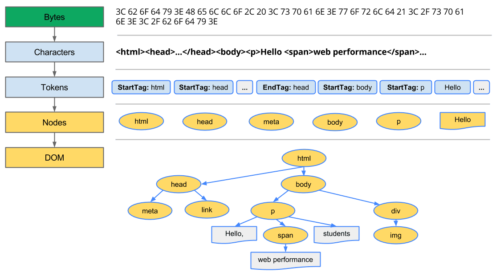

# Capítulo 32 – JavaScript Interativo: Manipulando o Documento

Até este ponto, nossa jornada tem se concentrado em dominar a linguagem JavaScript em seu núcleo. Aprendemos a declarar variáveis, a estruturar dados com objetos e arrays, a controlar o fluxo com laços e condicionais, a criar lógica reutilizável com funções e classes, e a gerenciar operações assíncronas com Promises e `async/await`. Construímos um conhecimento profundo sobre a **linguagem**. Agora, é hora de aplicar esse conhecimento em seu ambiente primário e mais poderoso: a página web. É o momento de transformar nossos scripts, que até então viviam em um plano abstrato, em agentes ativos capazes de modificar, criar e interagir com o conteúdo que o usuário vê e com o qual interage.

A web é construída sobre uma trindade de tecnologias: **HTML**, para definir a estrutura e o significado do conteúdo; **CSS**, para descrever sua aparência e estilo; e **JavaScript**, para ditar seu comportamento e interatividade. Se o HTML é o esqueleto e o CSS é a pele, o JavaScript é o sistema nervoso que dá vida à criação. Mas como exatamente o nosso código JavaScript, que é um arquivo de texto lógico, consegue "tocar" e "manipular" os elementos de uma página HTML, que é um arquivo de marcação estrutural? A ponte que conecta esses dois mundos é uma das APIs mais importantes da plataforma web: o **DOM (Document Object Model)**.

Neste capítulo, vamos desvendar a arte de fazer o JavaScript interagir com a página. Começaremos por entender a relação simbiótica entre HTML, CSS e JavaScript e como o navegador os une. Faremos um mergulho profundo no DOM, compreendendo-o como uma representação viva e orientada a objetos do nosso documento. Dominaremos as técnicas para selecionar elementos específicos na página, desde os métodos clássicos até os modernos e poderosos seletores de CSS. Uma vez que tenhamos um elemento em mãos, exploraremos as inúmeras maneiras de manipular seu conteúdo, seus atributos e seu estilo. Ao final deste capítulo (que não abordará eventos, um tópico reservado para o próximo), você terá a base fundamental para transformar qualquer página estática em uma experiência dinâmica e responsiva.

## A Trindade da Web: HTML, CSS e JavaScript

Para manipular uma página, primeiro precisamos entender como o navegador a enxerga. Quando você acessa uma URL, o navegador realiza um processo em etapas:

1. **Carregamento e Parsing do HTML:** O navegador baixa o arquivo HTML e o analisa, linha por linha, para entender sua estrutura. Ele não o vê como um simples texto, mas o converte em uma estrutura de dados em árvore. Essa árvore é o **DOM**. Cada tag HTML (`<div>`, `<p>`, `<h1>`, etc.) se torna um **nó** (ou mais especificamente, um **elemento**) nessa árvore.
2. **Carregamento e Parsing do CSS:** Ao encontrar tags `<link>` que apontam para folhas de estilo ou tags `<style>`, o navegador baixa e analisa o CSS. Ele constrói outra estrutura em árvore, o **CSSOM (CSS Object Model)**, que mapeia os seletores e suas respectivas regras de estilo.
3. **Construção da Árvore de Renderização:** O navegador combina o DOM e o CSSOM para criar a Árvore de Renderização, que contém apenas os nós visíveis e seus estilos computados. É isso que será desenhado na tela.

<div align="center">
  
</div>

4. **Execução do JavaScript:** Ao encontrar uma tag `<script>`, o navegador (geralmente) pausa a renderização e executa o código JavaScript. É neste ponto que nosso código entra em ação. Crucialmente, o nosso JavaScript não interage com o arquivo `.html` original, mas sim com a representação viva e em memória que o navegador já construiu: o DOM.

<div align="center">
  
</div>

## A API do DOM: O Documento como um Objeto

O **Document Object Model (DOM)** é a representação orientada a objetos do documento HTML carregado na janela do navegador. Ele é a API (Application Programming Interface) que nos permite, através do JavaScript, interagir com a página.

Pense no DOM como uma árvore genealógica. O `<html>` é o ancestral mais antigo. Dentro dele, temos filhos como `<head>` e `<body>`. O `<body>`, por sua vez, pode ter filhos como `<h1>` e `<div>`, e assim por diante. Cada um desses "membros da família" é um objeto que podemos acessar e manipular.

O ponto de entrada para toda a API do DOM é um objeto global que está sempre disponível em nosso script: o objeto `document`.

### O Objeto `document`

O objeto `document` representa a página inteira. Ele nos dá acesso a informações globais e é o ponto de partida para encontrar qualquer elemento na página.

**Exemplos de propriedades úteis:**

- **`document.title`:** Permite ler ou definir o título da página (o que aparece na aba do navegador).
    
    ```js
    console.log(`O título atual é: ${document.title}`); // Lê o título
    document.title = "Nova Página Interativa!"; // Define um novo título
    ```
    
- **`document.body`:** Uma referência direta ao elemento `<body>` da página.
- **`document.head`:** Uma referência direta ao elemento `<head>`.
- **`document.URL`:** Retorna a URL completa da página.

## Encontrando Elementos na Página

Para manipular um elemento (mudar seu texto, seu estilo, etc.), primeiro precisamos encontrá-lo e obter uma referência a ele em uma variável. O DOM nos fornece vários métodos para isso.

### O Método Clássico: `document.getElementById()`

Este método seleciona um único elemento com base em seu atributo `id`, que deve ser único na página. É o método de seleção mais rápido e direto.

**HTML:** `<h1 id="titulo-principal">Minha Página</h1>`

**JavaScript:**

```js
const titulo = document.getElementById('titulo-principal');
// 'titulo' agora é um objeto que representa o elemento <h1>
console.log(titulo);
```

### O Poder dos Seletores CSS: `querySelector` e `querySelectorAll`

Embora `getElementById` seja útil, a abordagem moderna e muito mais flexível é usar métodos que encontram elementos com base em **seletores CSS**, a mesma sintaxe que você usa para estilizar elementos em seus arquivos `.css`.

#### Uma Rápida Revisão de Seletores CSS

- **Por Tag:** `p` (seleciona todos os `<p>`)
- **Por Classe:** `.minha-classe` (seleciona todos os elementos com `class="minha-classe"`)
- **Por ID:** `#meu-id` (seleciona o elemento com `id="meu-id"`)
- **Por Atributo:** `[href]` (seleciona todos os elementos com um atributo `href`)
- **Descendente:** `div p` (seleciona todos os `<p>` dentro de uma `<div>`)
- **Filho Direto:** `ul > li` (seleciona apenas os `<li>` que são filhos diretos de uma `<ul>`)

#### `document.querySelector(seletor)`

Este método retorna o **primeiro** elemento no documento que corresponde ao seletor CSS especificado. Se nenhum elemento for encontrado, ele retorna `null`.

**HTML:**

```html
<div class="container">
  <p>Primeiro parágrafo.</p>
  <p class="destaque">Parágrafo em destaque.</p>
</div>
```

**JavaScript:**

```js
// Seleciona o primeiro <p> encontrado
const primeiroP = document.querySelector('p');

// Seleciona o elemento com a classe 'destaque'
const pDestaque = document.querySelector('.destaque');

// Seleciona um <p> que está dentro de um .container
const pAninhado = document.querySelector('.container p');
```

#### `document.querySelectorAll(seletor)`

Este método retorna uma **`NodeList`** contendo **todos** os elementos que correspondem ao seletor CSS. Uma `NodeList` é uma coleção de nós semelhante a um array. Você pode iterar sobre ela com `forEach` ou convertê-la em um array real para usar outros métodos como `map` e `filter`.

**HTML:**

```html
<ul>
  <li>Item 1</li>
  <li class="ativo">Item 2</li>
  <li>Item 3</li>
  <li class="ativo">Item 4</li>
</ul>
```

**JavaScript:**

```js
// Seleciona todos os <li> com a classe 'ativo'
const itensAtivos = document.querySelectorAll('li.ativo');

console.log(itensAtivos.length); // 2

// Iterando sobre a NodeList
itensAtivos.forEach(item => {
  console.log(item.textContent);
});

// Convertendo para um array para usar .map
const textosDosItens = Array.from(itensAtivos).map(item => item.textContent);
```

## Manipulando o Conteúdo dos Elementos

Uma vez que temos uma referência a um elemento, podemos alterar o que é exibido dentro dele.

### `textContent` vs. `innerText` vs. `innerHTML`

Essas três propriedades permitem ler e definir o conteúdo de um elemento, mas com diferenças cruciais.

- **`textContent`:** Obtém ou define o conteúdo de texto puro de um elemento e de todos os seus descendentes. É rápido e seguro, pois ignora qualquer tag HTML e renderiza apenas o texto. **Esta é a propriedade recomendada para manipular texto.**
- **`innerText`:** Similar ao `textContent`, mas é "consciente do CSS". Ele não retorna o texto de elementos que estão ocultos por CSS (com `display: none`, por exemplo). Seu cálculo pode ser mais lento.
- **`innerHTML`:** Obtém ou define a **marcação HTML completa** dentro de um elemento. É poderoso, mas perigoso. Se você definir o `innerHTML` com uma string que veio de uma fonte não confiável (como a entrada de um usuário), você pode acidentalmente introduzir scripts maliciosos na sua página, uma vulnerabilidade conhecida como **Cross-Site Scripting (XSS)**.

**Exemplo Comparativo:** **HTML:** `<p id="paragrafo">Este é um <strong>texto</strong> importante.</p>` **JavaScript:**

```js
const p = document.getElementById('paragrafo');

console.log(p.textContent); // "Este é um texto importante." (retorna apenas o texto)
console.log(p.innerHTML);   // "Este é um <strong>texto</strong> importante." (retorna o HTML)

// Usando textContent para alterar o conteúdo de forma segura
p.textContent = "Novo conteúdo de texto. Tags como <b> não são interpretadas.";

// Usando innerHTML para inserir HTML (use com extremo cuidado!)
p.innerHTML = "Novo conteúdo com <em>ênfase</em>.";
```

**Regra de ouro:** Use `textContent` sempre que estiver lidando com texto. Use `innerHTML` apenas quando você precisar inserir HTML e tiver controle total sobre a string que está sendo inserida.

## Manipulando Estilos e Atributos

### Modificando Estilos com a Propriedade `style`

Cada elemento possui uma propriedade `style` que corresponde aos seus estilos _inline_. Você pode usá-la para alterar dinamicamente a aparência de um elemento. As propriedades CSS que contêm hífen (como `background-color`) são convertidas para camelCase (como `backgroundColor`).

```js
const titulo = document.getElementById('titulo-principal');

titulo.style.color = 'blue';
titulo.style.backgroundColor = '#f0f0f0';
titulo.style.padding = '10px';
titulo.style.borderBottom = '3px solid blue';
```

Embora útil para pequenas alterações dinâmicas, modificar muitos estilos inline pode ser ineficiente e mistura as responsabilidades do CSS e do JavaScript.

### A Melhor Prática: Manipulando Classes com `classList`

A abordagem recomendada para alterar a aparência de um elemento é definir os estilos em classes no seu arquivo CSS e, em seguida, usar JavaScript apenas para adicionar ou remover essas classes do elemento. O objeto `element.classList` torna isso fácil.

**CSS:**

```css
.destacado {
  background-color: yellow;
  font-weight: bold;
  border: 1px solid red;
}
```

**JavaScript:**

```js
const elemento = document.querySelector('.meu-elemento');

// Adiciona uma classe
elemento.classList.add('destacado');

// Remove uma classe
elemento.classList.remove('outra-classe');

// Alterna uma classe: se ela existe, remove; se não existe, adiciona.
elemento.classList.toggle('ativo');

// Verifica se uma classe existe
if (elemento.classList.contains('destacado')) {
  console.log("O elemento está destacado!");
}
```

Esta abordagem mantém seu CSS e seu JavaScript separados e organizados.

### Manipulando Elementos `<script>` e `<link>`

JavaScript pode até mesmo manipular os elementos que o controlam. É possível criar e adicionar dinamicamente novas tags `<script>` ou `<link>` ao documento, o que é a base para o carregamento assíncrono de recursos.

**Exemplo: Carregando um Script Dinamicamente**

```js
function carregarScript(url) {
  const script = document.createElement('script');
  script.src = url;
  document.head.appendChild(script); // Adiciona o script ao <head>
}

// Carrega a biblioteca lodash apenas quando necessário
// carregarScript('https://cdn.jsdelivr.net/npm/lodash@4.17.21/lodash.min.js');
```

## Considerações Finais

Neste capítulo, abrimos as portas para a interatividade na web, construindo a ponte entre o nosso código JavaScript e a página HTML. Desvendamos o **DOM**, entendendo-o não como um arquivo de texto, mas como um modelo de objetos vivo e manipulável, com o qual nosso código pode conversar.

Dominamos as ferramentas essenciais para essa conversa: aprendemos a selecionar elementos de forma precisa com `getElementById` e, mais importante, com os poderosos e flexíveis `querySelector` e `querySelectorAll`. Uma vez que tínhamos um elemento em nosso poder, exploramos como alterar seu conteúdo textual de forma segura com `textContent` e como modificar sua aparência, priorizando a manipulação de classes CSS com `classList` em vez de estilos inline.

Compreender o DOM é a base para qualquer desenvolvimento front-end. É o que nos permite validar formulários, criar animações, atualizar dados em tempo real e, em última instância, construir experiências de usuário ricas e dinâmicas. Com esta base sólida, estamos agora prontos para o próximo passo lógico: aprender a **ouvir** as ações do usuário e **reagir** a elas. No próximo capítulo, mergulharemos no mundo dos **Eventos**.