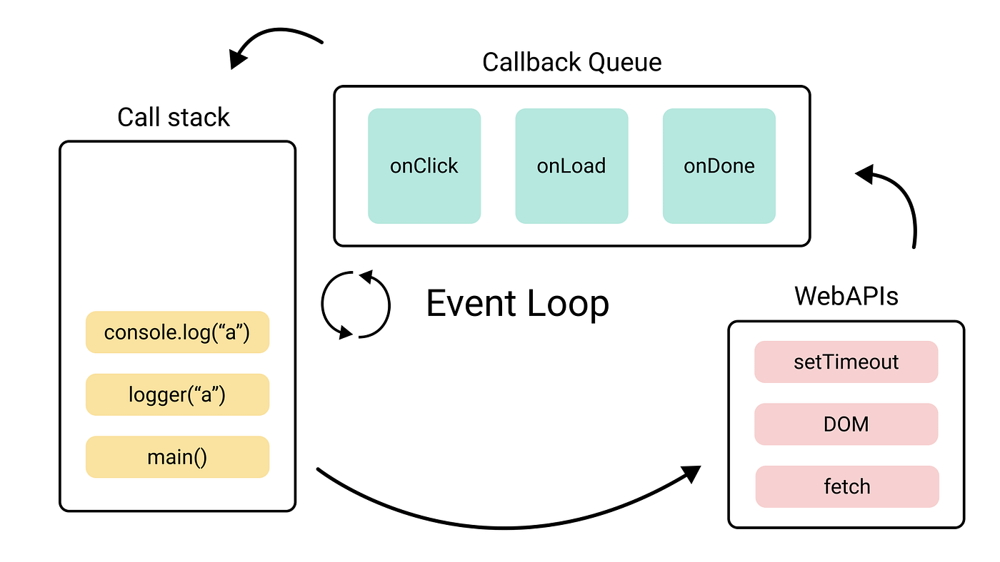

# Capítulo 33 – Eventos: Reagindo às Ações do Usuário

No capítulo anterior, abrimos a porta para a interatividade ao aprender como o JavaScript pode "ver" e "manipular" a estrutura de uma página através do DOM. Agora, temos o poder de alterar textos, modificar estilos e reorganizar elementos dinamicamente. No entanto, uma aplicação verdadeiramente interativa não apenas **muda** o conteúdo; ela **reage** ao que o usuário faz. Ela ouve um clique de mouse, responde a uma tecla pressionada, reage quando o usuário rola a página ou envia um formulário. Essa capacidade de ouvir e reagir a ocorrências é o coração da programação para a web.

O modelo que torna isso possível é a **Programação Orientada a Eventos (Event-Driven Programming)**. Em vez de um fluxo linear de cima para baixo, grande parte do nosso código JavaScript em uma aplicação front-end é passivo: ele é escrito, carregado e depois fica "ouvindo" à espera de que algo aconteça. Esses "acontecimentos" — sejam eles ações do usuário ou eventos do próprio navegador, como o término do carregamento da página — são chamados de **eventos**. Nosso trabalho como desenvolvedores é registrar "ouvintes" (event listeners), que são funções de callback prontas para serem executadas no exato momento em que um evento específico ocorre.

Neste capítulo, vamos dominar este modelo fundamental. Começaremos por entender o que é um evento e as diferentes maneiras de se registrar um "ouvinte" para ele, focando na abordagem moderna e mais poderosa com `addEventListener`. Dissecaremos o objeto `event`, uma fonte rica de informações que é passada para cada função de tratamento. Faremos um mergulho profundo no fluxo de um evento através do DOM, desvendando os conceitos cruciais de **Event Bubbling** e **Event Capturing**, o que nos levará diretamente a um dos padrões de design mais importantes e eficientes do JavaScript front-end: a **Delegação de Eventos (Event Delegation)**. Finalmente, exploraremos os tipos de eventos mais comuns — de mouse, de teclado, de formulário e de ciclo de vida da página — e solidificaremos nossa compreensão de como tudo isso é orquestrado pelo Event Loop.

## O Modelo de Eventos: Ouvir e Reagir

A interatividade na web é baseada em um ciclo simples:

1. Um **evento** ocorre (ex: o usuário clica em um botão).
2. Um **ouvinte de evento (event listener)**, que estava previamente registrado para aquele tipo de evento naquele elemento, é ativado.
3. A **função de tratamento de evento (event handler)**, associada ao ouvinte, é executada, realizando a lógica desejada (ex: exibir uma mensagem, enviar dados, etc.).

### Como Registrar um "Ouvinte" de Evento (Event Handler)

Existem três maneiras de se atribuir um handler a um evento.

**1. Atributos HTML `on...` (Abordagem Legada e Desaconselhada)**

```html
<button onclick="console.log('Botão clicado!')">Clique em mim</button>
```

Esta forma mistura JavaScript diretamente no HTML, o que viola o princípio da separação de preocupações, e tem problemas relacionados ao escopo. **Deve ser evitada em código moderno.**

**2. Propriedades `on...` do DOM (Funcional, mas Limitada)** Podemos atribuir uma função diretamente a uma propriedade do objeto do elemento, como `onclick`, `onmouseover`, etc.

```js
const botao = document.getElementById('meu-botao');
botao.onclick = function() {
  console.log("O botão foi clicado!");
};
```

Esta abordagem é melhor, pois mantém o JavaScript separado. No entanto, sua principal limitação é que você só pode atribuir **um único handler** por evento. Uma nova atribuição sobrescreve a anterior.

**3. `addEventListener()` (Abordagem Moderna e Recomendada)** Este método do elemento é a forma mais poderosa e flexível de se registrar um ouvinte de evento.

**Sintaxe:** `elemento.addEventListener(tipoDeEvento, listener, [opcoes]);`

- `tipoDeEvento`: Uma string com o nome do evento, sem o prefixo "on" (ex: `'click'`, `'keydown'`).
- `listener`: A função (callback) a ser executada quando o evento ocorrer.
- `opcoes` (opcional): Um objeto de configuração (ou um booleano para a opção `useCapture`).

**Vantagens:**

- Permite registrar **múltiplos listeners** para o mesmo evento no mesmo elemento.
- Oferece um controle fino sobre a fase de propagação do evento (bubbling vs. capturing).
- Permite remover listeners de forma precisa com `removeEventListener()`.

```js
const botao = document.getElementById('meu-botao');

function handler1() {
  console.log("Primeiro handler executado!");
}
function handler2() {
  console.log("Segundo handler executado! (Ambos rodam)");
}

botao.addEventListener('click', handler1);
botao.addEventListener('click', handler2);

// Para remover, é preciso ter uma referência à função original
// botao.removeEventListener('click', handler1);
```

## O Objeto `Event`

Quando um evento é disparado e nosso handler é chamado, o navegador automaticamente passa um argumento para essa função: o objeto `Event`. Este objeto contém uma riqueza de informações sobre o evento que acabou de ocorrer.

```js
botao.addEventListener('click', function(event) {
  // 'event' é o objeto Event
  console.log(event);
});
```

**Propriedades e Métodos Cruciais:**

- **`event.target`:** O elemento que **originou** o evento. Se você tem um ouvinte em um `<ul>`, mas o usuário clicou em um `<li>` específico, `event.target` será o `<li>`.
- **`event.currentTarget`:** O elemento ao qual o ouvinte de evento foi **atribuído**. No exemplo acima, `event.currentTarget` seria sempre o `<ul>`.
- **`event.type`:** O tipo de evento que foi disparado (ex: `'click'`).
- **`event.preventDefault()`:** Um método fundamental. Ele impede a ação padrão do navegador para aquele evento. Por exemplo, impede que um link navegue para outra página ou que um formulário seja enviado, permitindo que você lide com a ação via JavaScript.
- **`event.stopPropagation()`:** Interrompe a propagação do evento através da árvore do DOM (veremos isso em Bubbling).

## O Fluxo de Eventos: Bubbling e Capturing

Quando um evento ocorre em um elemento, ele não acontece isoladamente. O navegador dispara o evento em um fluxo que atravessa a árvore do DOM. Este fluxo tem três fases:

1. **Fase de Captura (Capturing):** O evento viaja do ancestral mais antigo (`window`) **para baixo** na árvore do DOM até chegar ao elemento alvo.
2. **Fase Alvo (Target):** O evento chega ao `event.target`, o elemento que o originou.
3. **Fase de Borbulhamento (Bubbling):** O evento viaja do elemento alvo **de volta para cima** na árvore do DOM até o `window`.

**Por padrão, todos os event handlers registrados com `addEventListener` operam na fase de Bubbling.** Isso significa que se você clicar em um link dentro de um parágrafo, dentro de uma `div`, o evento de clique ocorrerá primeiro no link, depois "borbulhará" para o parágrafo, depois para a `div`, e assim por diante.

**Exemplo de Bubbling:**

**HTML:**

```html
<div id="div-pai">
  <button id="btn-filho">Clique</button>
</div>
```

**JavaScript:**

```js
const divPai = document.getElementById('div-pai');
const btnFilho = document.getElementById('btn-filho');

divPai.addEventListener('click', () => {
  console.log("Handler da DIV (Pai) disparado.");
});
btnFilho.addEventListener('click', () => {
  console.log("Handler do BOTÃO (Filho) disparado.");
});
// Ao clicar no botão, a saída será:
// "Handler do BOTÃO (Filho) disparado."
// "Handler da DIV (Pai) disparado."
```

## Delegação de Eventos: O Padrão de Alta Performance

O borbulhamento de eventos nos permite usar um padrão de design extremamente poderoso e eficiente: a **Delegação de Eventos**.

**O Problema:** Imagine uma lista com 1000 itens (`<li>`), e cada item precisa ser clicável. Anexar 1000 event listeners individuais é ineficiente, consome memória e não funciona para itens que são adicionados à lista dinamicamente no futuro.

**A Solução (Delegação):** Em vez de anexar um ouvinte a cada filho, anexamos **um único ouvinte ao elemento pai**. Dentro do handler, usamos `event.target` para identificar qual elemento filho foi realmente clicado.

**Exemplo:** **HTML:**

```html
<ul id="lista-de-tarefas">
  <li>Comprar pão</li>
  <li>Estudar JavaScript</li>
  <li>Pagar contas</li>
</ul>
```

**JavaScript:**

```js
const lista = document.getElementById('lista-de-tarefas');

lista.addEventListener('click', function(event) {
  // Verifica se o elemento que originou o evento (event.target)
  // é um <li>.
  if (event.target && event.target.tagName === 'LI') {
    const tarefaClicada = event.target;
    console.log("Você clicou na tarefa:", tarefaClicada.textContent);
    tarefaClicada.style.textDecoration = 'line-through';
  }
});
```

Com um único event listener na `<ul>`, podemos gerenciar cliques em um número ilimitado de `<li>`, incluindo aqueles que podem ser adicionados à lista posteriormente pelo nosso código.

## Eventos de Ciclo de Vida da Página

Existem eventos cruciais que nos informam sobre o estado do carregamento da página, garantindo que nosso código DOM só seja executado quando a página estiver pronta.

- **`DOMContentLoaded`:** Disparado no objeto `document`. Este é o evento **preferido** para a maioria dos casos. Ele é acionado assim que o documento HTML inicial foi completamente carregado e analisado, sem esperar pelo término do carregamento de folhas de estilo, imagens e subframes. É o momento ideal para começar a manipular o DOM.
    
    ```js
    document.addEventListener('DOMContentLoaded', function() {
      console.log("O DOM está pronto! Podemos manipular os elementos.");
    });
    ```
    
- **`load`:** Disparado no objeto `window`. Este evento só é acionado depois que a página inteira e **todos os seus recursos dependentes** (imagens, CSS, scripts, iframes, etc.) foram completamente carregados. Use este evento apenas quando precisar de algo que depende desses recursos, como obter as dimensões de uma imagem.

## Tipos de Eventos Comuns

### Eventos de Mouse

- `click`, `dblclick` (clique duplo)
- `mousedown`, `mouseup`: Disparados quando o botão do mouse é pressionado e solto, respectivamente.
- `mouseover`, `mouseout`: Disparados quando o cursor entra ou sai de um elemento ou de um de seus filhos.
- `mouseenter`, `mouseleave`: Semelhantes aos anteriores, mas mais simples. São disparados apenas quando o cursor entra ou sai dos limites do elemento em si, sem se importar com os filhos. São geralmente a melhor escolha.
- `mousemove`: Disparado continuamente sempre que o mouse se move sobre um elemento. O objeto de evento contém as coordenadas `clientX` e `clientY`.

### Eventos de Teclado

- `keydown`: Disparado quando uma tecla é pressionada.
- `keyup`: Disparado quando uma tecla é solta.
- O objeto de evento do teclado possui propriedades importantes para identificar a tecla:
    - **`event.key`:** A forma moderna. Retorna o valor da tecla (ex: `'a'`, `'Enter'`, `'Escape'`).
    - **`event.code`:** Representa a tecla física no teclado (ex: `'KeyA'`, `'Enter'`). Útil para jogos.
    
    ```js
    const input = document.querySelector('input');
    input.addEventListener('keydown', function(event) {
      if (event.key === 'Enter') {
        console.log("Enter foi pressionado!");
      }
    });
    ```

## O Event Loop e a Programação Orientada a Eventos

Como tudo isso funciona sem travar? Voltamos ao **Event Loop**.

<div align="center">
  
</div>

1. Nosso código chama `addEventListener`, registrando um handler no navegador (uma Web API).
2. O script principal termina sua execução, deixando a Call Stack vazia.
3. O usuário clica no botão. O navegador, que estava "ouvindo", percebe o evento.
4. Ele cria o objeto `event` e coloca a função handler correspondente na **Callback Queue**.
5. O **Event Loop**, vendo que a Call Stack está vazia, pega o handler da fila e o empurra para a Call Stack.
6. O handler é executado.

Este modelo é o que torna o JavaScript no navegador tão poderoso e responsivo, permitindo que ele lide com inúmeras interações do usuário de forma assíncrona.

## Considerações Finais

Neste capítulo, desvendamos o coração da interatividade na web: o **sistema de eventos**. Vimos que a programação front-end é, em sua essência, uma programação orientada a eventos, onde nosso código "ouve" e reage a ações.

Dominamos a forma moderna e robusta de registrar ouvintes com **`addEventListener`** e aprendemos a extrair informações cruciais do **objeto `event`**. Aprofundamos nossa compreensão sobre o fluxo de um evento através do DOM, entendendo o **bubbling** não como um problema, mas como um mecanismo que habilita o poderoso padrão de **Delegação de Eventos**, permitindo-nos escrever aplicações mais eficientes e escaláveis.

Exploramos os eventos de ciclo de vida da página, garantindo que nosso código só seja executado no momento certo, e cobrimos os tipos de eventos mais comuns que encontraremos no dia a dia. Tudo isso, como vimos, é orquestrado de forma elegante e assíncrona pelo **Event Loop**. Com o domínio sobre a manipulação do DOM (Capítulo 32) e o sistema de eventos (este capítulo), você agora possui os dois pilares fundamentais para construir qualquer interface web dinâmica e interativa.