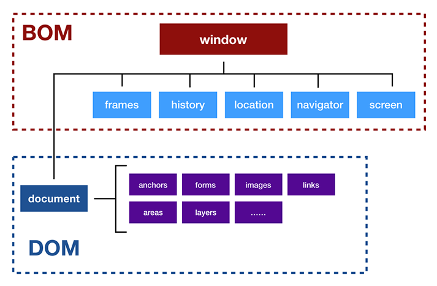

# Capítulo 34 – BOM: A Interface do JavaScript com o Navegador

Nos capítulos anteriores, focamos intensamente em como o JavaScript interage com o **conteúdo** de uma página web através do **DOM (Document Object Model)**. Aprendemos a selecionar, manipular, criar e remover elementos, efetivamente controlando tudo o que acontece **dentro** da área de visualização do documento. No entanto, uma aplicação web não existe no vácuo; ela vive dentro de um ambiente maior: a janela do navegador. Além do documento em si, existem a barra de endereço, os botões de avançar e voltar, o histórico de navegação, as abas e informações sobre a tela do usuário. Como nosso código pode interagir com essa "moldura" que envolve nossa página?

A resposta está em um conjunto de APIs que, embora menos padronizadas formalmente que o DOM, são universalmente implementadas pelos navegadores: o **Browser Object Model (BOM)**. Se o DOM é o modelo do **documento**, o BOM é o modelo do **navegador**. Ele fornece ao JavaScript uma interface para "conversar" com as funcionalidades do próprio navegador, nos dando acesso a informações e controles que vão além do conteúdo HTML.

Neste capítulo, vamos explorar essa poderosa camada de APIs. Começaremos por entender o papel central do objeto `window`, o objeto global que serve como o ponto de entrada para todas as funcionalidades do BOM e do DOM. Dissecaremos seus filhos mais importantes: o objeto `navigator`, para obter informações sobre o navegador do usuário; o objeto `screen`, para entender as características da tela; o objeto `location`, para controlar a URL da página; e o objeto `history`, para manipular o histórico de navegação — uma peça chave para o funcionamento das modernas Single Page Applications (SPAs). Ao final, você terá uma visão completa de como o JavaScript pode criar experiências verdadeiramente integradas ao ambiente do navegador.

## Distinguindo BOM e DOM

É crucial entender a relação entre o BOM e o DOM. Eles não são mutuamente exclusivos; na verdade, o DOM é, conceitualmente, uma parte do BOM.

- **BOM (Browser Object Model):** É a hierarquia de objetos que representa a janela do navegador e suas funcionalidades. Não há um padrão oficial, mas uma implementação consistente entre os navegadores. Seu objeto raiz é `window`.
- **DOM (Document Object Model):** É a hierarquia de objetos que representa a estrutura do documento HTML/XML carregado. É padronizado pelo W3C. Seu objeto raiz é `document`, que é uma propriedade do objeto `window`.

A imagem abaixo ilustra essa relação:

<div align="center">
  
</div>

Como podemos ver, `window` está no topo. Tudo o que fazemos no navegador, seja manipular o `document` (DOM) ou o `history` (BOM), acontece dentro do contexto do objeto `window`.

## O Objeto `window`: O Contexto Global

O objeto `window` representa a janela ou aba do navegador que contém a página. Em um script rodando no navegador, `window` é também o **objeto global**. Isso tem duas implicações importantes:

1. Qualquer variável declarada no escopo global com `var` (ou sem `let`/`const`/`var` em modo não-estrito) se torna uma propriedade do objeto `window`.
2. Podemos omitir `window.` ao chamar suas propriedades e métodos. `alert()` é simplesmente um atalho para `window.alert()`.

### Propriedades Notáveis do `window`

O objeto `window` nos dá informações sobre o tamanho e a posição da janela do navegador.

- **`window.innerHeight` e `window.innerWidth`:** Retornam a altura e a largura da **área de visualização (viewport)** da página, em pixels. Isso exclui barras de rolagem, menus e bordas. É o espaço onde seu conteúdo é efetivamente renderizado.
- **`window.pageXOffset` e `window.pageYOffset`:** Retornam o número de pixels que o documento foi rolado horizontalmente e verticalmente. Esta é a maneira moderna e padrão de se obter a posição da rolagem.
- **`window.screenX` e `window.screenY`:** Retornam as coordenadas X e Y, em pixels, do canto superior esquerdo da janela do navegador em relação ao canto superior esquerdo da tela física do usuário.
- **`window.name`:** Permite definir ou obter um nome para a janela. Útil para comunicação entre janelas.
- **`window.closed`:** Uma propriedade booleana que retorna `true` se a janela foi fechada.

### Métodos Notáveis do `window`

- **`alert(mensagem)`**, **`confirm(pergunta)`**, **`prompt(texto, [padrão])`**: Os três métodos clássicos para exibir diálogos modais para o usuário.
- **`open(url, nome, features)`**: Abre uma nova janela ou aba do navegador. Retorna uma referência à nova janela, que pode ser usada para controlá-la. Sujeito a bloqueadores de pop-up.
- **`close()`**: Fecha a janela atual. Por razões de segurança, um script geralmente só pode fechar janelas que ele mesmo abriu com `window.open()`.
- **`scrollTo(x, y)`** e **`scrollBy(x, y)`**: Permitem rolar a página programaticamente. `scrollTo` rola para coordenadas absolutas, enquanto `scrollBy` rola uma quantidade relativa à posição atual.
- **`print()`**: Abre o diálogo de impressão do navegador para a página atual.
- **`getComputedStyle(elemento)`**: Um método extremamente poderoso. Ele retorna um objeto contendo os valores finais e computados de todas as propriedades CSS de um elemento, depois que todas as folhas de estilo foram aplicadas.
- **`setTimeout()`**, **`setInterval()`**, **`clearTimeout()`**, **`clearInterval()`**: Os timers que já estudamos são, na verdade, métodos do objeto `window`.

## O Objeto `navigator`: Informações sobre o Navegador

O objeto `navigator` contém informações sobre o navegador (o user agent) e o sistema em que ele está rodando.

Uma prática antiga era o "browser sniffing", onde o código verificava a string do `navigator.userAgent` para decidir qual lógica executar. **Esta prática é fortemente desaconselhada hoje**. A string do `userAgent` é pouco confiável e pode ser falsificada. A abordagem moderna é a **detecção de funcionalidades (feature detection)**, onde você testa se a funcionalidade que deseja usar existe, em vez de adivinhar com base no nome do navegador.

**Propriedades Úteis:**

- **`navigator.userAgent`:** A famosa string de user agent, que identifica o navegador, sua versão, o sistema operacional, etc.
- **`navigator.language`:** Retorna a string do idioma preferido do usuário (ex: `"pt-BR"`). Útil para internacionalização.
- **`navigator.onLine`:** Um booleano que indica se o navegador tem uma conexão com a internet.
- **`navigator.geolocation`:** Fornece acesso à API de Geolocalização, permitindo obter a posição do usuário (com sua permissão explícita).

## O Objeto `screen`: Informações sobre a Tela

O objeto `screen` fornece informações sobre a tela física do usuário. É útil para tomar decisões de layout ou para aplicações que precisam de informações sobre o display.

- **`screen.width` e `screen.height`:** Retornam a largura e a altura totais da tela do usuário, em pixels. Esta é a resolução total do monitor.
- **`screen.availWidth` e `screen.availHeight`:** Mais úteis na prática, retornam a largura e a altura da tela, **excluindo** componentes da interface do sistema operacional, como a Barra de Tarefas do Windows ou o Dock do macOS.
- **`screen.colorDepth` e `screen.pixelDepth`:** Fornecem informações sobre a profundidade de cor da tela do usuário em bits por pixel.

**Exemplo:**

```js
console.log(`Resolução total da tela: ${screen.width}x${screen.height}`);
console.log(`Área de tela disponível: ${screen.availWidth}x${screen.availHeight}`);
```

## O Objeto `location`: A URL da Página

O objeto `location` é uma interface poderosa para interagir com a URL da página atual. Ele permite tanto ler as diferentes partes da URL quanto navegar para novas páginas.

**Propriedades (leitura):** Usando a URL `https://meusite.com:8080/produtos/item?id=123#descricao` como exemplo:

- `location.href`: A URL completa (`'https://meusite.com:8080/...'`)
- `location.protocol`: O protocolo (`'https:'`)
- `location.hostname`: O nome do host (`'meusite.com'`)
- `location.port`: A porta (`'8080'`)
- `location.pathname`: O caminho após o host (`'/produtos/item'`)
- `location.search`: A query string, incluindo o `?` (`'?id=123'`)
- `location.hash`: A âncora (fragmento), incluindo o `#` (`'#descricao'`)

**Métodos (navegação):**

- `location.assign('https://novosite.com')`: Carrega uma nova página.
- `location.replace('https://outrosite.com')`: Substitui a página atual pela nova no histórico de navegação. O usuário não poderá usar o botão "voltar" para retornar à página original.
- `location.reload()`: Recarrega a página atual.

## O Objeto `history`: Manipulando o Histórico de Sessão

O objeto `history` permite que o JavaScript interaja com o histórico de navegação da sessão atual (as páginas visitadas naquela aba).

**Métodos de Navegação Simples:**

- `history.back()`: Vai para a página anterior, como o botão "Voltar" do navegador.
- `history.forward()`: Vai para a página seguinte, como o botão "Avançar".
- `history.go(numero)`: Navega para uma entrada específica no histórico. `history.go(-1)` é o mesmo que `back()`. `history.go(2)` avança duas páginas.

### A History API: `pushState()` e `replaceState()`

Os métodos acima sempre causam um recarregamento completo da página. A verdadeira revolução veio com a **History API**, que permite manipular a URL da barra de endereço e o histórico de sessão **sem recarregar a página**. Esta é a tecnologia que torna possível a navegação em **Single Page Applications (SPAs)** como React, Angular e Vue.

- **`history.pushState(state, title, url)`:**
    - Adiciona uma nova entrada ao histórico de navegação.
    - `state`: Um objeto JavaScript associado à nova entrada. Quando o usuário navegar de volta para este estado, o objeto será passado para o evento `popstate`.
    - `title`: Uma string de título (atualmente ignorada pela maioria dos navegadores).
    - `url`: A nova URL a ser exibida na barra de endereço. O navegador não tenta carregar esta URL; ele apenas a exibe.
- **`history.replaceState(state, title, url)`:**
    - Funciona da mesma forma, mas em vez de criar uma nova entrada, **modifica a entrada atual** no histórico.

**Como Funciona em uma SPA:**

1. O usuário clica em um link interno (ex: "/perfil").
2. Um event listener de JavaScript captura o clique e chama `event.preventDefault()` para impedir a navegação normal.
3. O JavaScript chama `history.pushState({ pagina: 'perfil' }, 'Perfil', '/perfil')`. A URL na barra de endereço muda magicamente para `.../perfil`.
4. O código JavaScript então carrega os dados do perfil (via `fetch`, por exemplo) e atualiza o DOM para exibir a nova "página", tudo sem recarregamento.
5. Se o usuário clicar no botão "Voltar" do navegador, um evento **`popstate`** é disparado. A aplicação ouve esse evento, lê o `event.state` para saber para qual página deve voltar (`{ pagina: 'home' }`, por exemplo) e atualiza o DOM novamente.

## Considerações Finais

Neste capítulo, expandimos nossa visão para além do documento e exploramos o **Browser Object Model (BOM)**, a API que conecta nosso código JavaScript ao ambiente que o hospeda: o navegador. Vimos que o objeto global **`window`** é o epicentro de tudo, fornecendo acesso tanto ao DOM quanto às funcionalidades do próprio navegador.

Aprendemos a obter informações cruciais sobre o ambiente do usuário através dos objetos **`navigator`** e **`screen`**, e a ler e manipular a URL da página com o objeto **`location`**. O ponto alto foi a exploração do objeto **`history`**, onde desvendamos não apenas a navegação simples, mas também a poderosa **History API** (`pushState` e `replaceState`), o mecanismo que está no coração de todas as modernas Single Page Applications.

Compreender o BOM é o que nos permite criar aplicações que são verdadeiramente conscientes de seu contexto. Elas podem se adaptar ao tamanho da tela, à linguagem do usuário, ao seu histórico de navegação e muito mais. Ao combinar o poder de manipulação do DOM com o controle contextual do BOM, você está agora equipado com o conhecimento completo para construir experiências web ricas, responsivas e totalmente integradas.