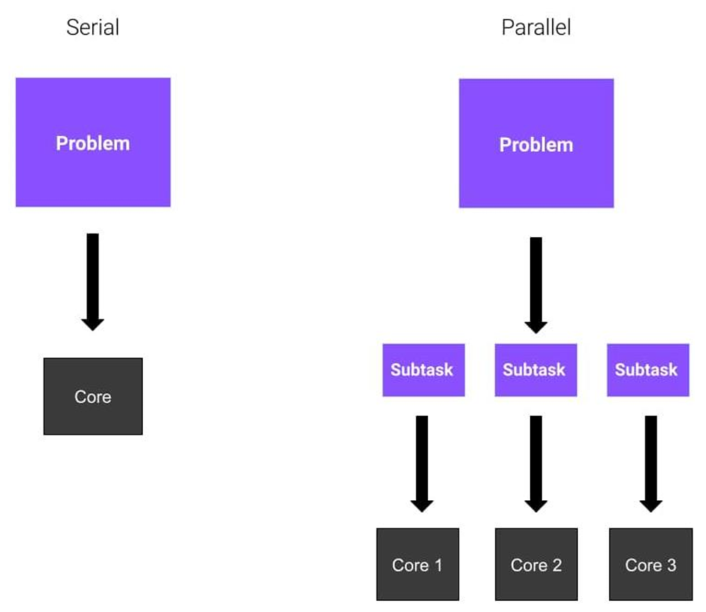

# Capítulo 11 – Execução Concorrente e Paralela

Nos capítulos anteriores, construímos programas que, em sua essência, executam de forma **serial**. Isso significa que o interpretador Python executa uma instrução de cada vez, em uma sequência linear e previsível. Uma linha de código só começa a ser executada após a anterior ter sido completamente finalizada. Este modelo é simples e eficaz para a grande maioria das tarefas, mas pode se tornar um gargalo de desempenho em um mundo onde até os computadores mais simples possuem processadores com múltiplos núcleos.

A realidade do hardware moderno é que nossos processadores são capazes de realizar várias tarefas simultaneamente. Surge, então, a questão: como podemos projetar nossos programas para quebrar a barreira da execução linear e aproveitar todo esse poder de processamento? A resposta está nos conceitos de **concorrência** e **paralelismo**.

Neste capítulo, faremos uma imersão nas ferramentas que o Python nos oferece para gerenciar a execução de múltiplas tarefas, visando otimizar o tempo de resposta e a performance de nossas aplicações. Começaremos distinguindo os conceitos fundamentais de execução serial e paralela e, em seguida, exploraremos as duas principais abordagens do Python para este desafio: os módulos `threading` e `multiprocessing`.

## Execução Serial vs. Paralela: Uma Mudança de Paradigma

Via de regra, a execução de código em Python segue o modelo serial. Uma única tarefa é enviada para um único núcleo do processador, que a executa do início ao fim. Somente após sua conclusão é que a próxima tarefa pode ser iniciada.

Com o advento dos processadores _multi-core_, tornou-se possível adotar um modelo de **execução paralela**. Neste paradigma, um problema maior pode ser dividido em subtarefas independentes, e cada uma dessas subtarefas pode ser atribuída a um núcleo de processamento diferente para ser executada **ao mesmo tempo**.

A imagem a seguir ilustra perfeitamente essa diferença conceitual:

- **À esquerda (Serial):** Temos um problema único sendo processado em sua totalidade por um único núcleo (_Core_). A execução é sequencial, uma etapa após a outra, dentro de uma única fila.
- **À direita (Parallel):** O mesmo problema é quebrado em múltiplas subtarefas (_Subtask_). Cada subtarefa é então processada simultaneamente por um núcleo diferente (_Core 1, Core 2, Core 3_). O tempo total para resolver o problema pode ser drasticamente reduzido, pois o trabalho é distribuído.

A capacidade de paralelizar rotinas é especialmente importante em domínios onde o Python brilha, como a ciência de dados e o aprendizado de máquina, nos quais operações matemáticas pesadas podem ser distribuídas entre vários núcleos para acelerar a análise e o treinamento de modelos.

## As Ferramentas do Python: `threading` e `multiprocessing`

Para explorar essas capacidades, o Python oferece duas abordagens principais em sua biblioteca padrão, cada uma adequada para um tipo diferente de problema:

- **`threading`:** Este módulo permite a criação de múltiplas _threads_ (ou linhas de execução) dentro de um mesmo processo. As threads compartilham o mesmo espaço de memória, o que facilita a comunicação entre elas. É a ferramenta ideal para gerenciar tarefas que envolvem muita espera, como fazer requisições de rede, acessar um banco de dados ou ler e escrever em arquivos.
- **`multiprocessing`:** Este módulo contorna algumas limitações do `threading` ao criar processos completamente novos e independentes, cada um com seu próprio interpretador Python e seu próprio espaço de memória. Esta é a ferramenta para se alcançar o **verdadeiro paralelismo** em Python, ideal para tarefas computacionalmente intensivas (que usam muita CPU).

Antes de mergulharmos nos exemplos práticos de cada um, é crucial entender uma distinção teórica fundamental que guiará a escolha entre `threading` e `multiprocessing`: a diferença entre concorrência e paralelismo.

