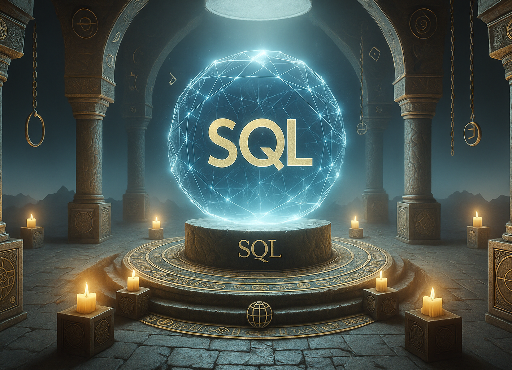

  

 

# SQL

**SQL**, sigla para **Structured Query Language**, é uma **linguagem de programação voltada para o gerenciamento e manipulação de bancos de dados relacionais**. Criada nos anos 1970 pela IBM, sua principal função é permitir que usuários interajam com bases de dados de forma simples e eficiente, executando operações como **consulta, inserção, atualização e exclusão de dados** — tudo por meio de comandos textuais estruturados.

Enquanto linguagens como HTML, CSS e JavaScript são utilizadas na construção de interfaces e comportamentos em páginas web, o SQL atua nos bastidores, sendo responsável por **armazenar, organizar, recuperar e manipular grandes volumes de informações** de forma segura e consistente. Com SQL, é possível buscar dados específicos com filtros e ordenações, cruzar informações de diferentes tabelas, calcular estatísticas em tempo real e garantir a integridade dos dados armazenados.

O SQL é uma linguagem **declarativa**, o que significa que o programador descreve **o que deseja obter** e não necessariamente **como** o sistema deve realizar a operação. Isso torna o SQL especialmente poderoso para lidar com **operações complexas de dados** com poucas linhas de código. Seus principais comandos são divididos em categorias como:

- **DDL (Data Definition Language)**: para criar, alterar e excluir estruturas de dados (ex: `CREATE`, `ALTER`, `DROP`);
- **DML (Data Manipulation Language)**: para manipular os dados dentro das tabelas (ex: `SELECT`, `INSERT`, `UPDATE`, `DELETE`);
- **DCL (Data Control Language)**: para controlar permissões de acesso (ex: `GRANT`, `REVOKE`);
- **TCL (Transaction Control Language)**: para controlar transações (ex: `COMMIT`, `ROLLBACK`).

Por ser **padrão internacional** e amplamente adotado por sistemas de bancos de dados como **MySQL, PostgreSQL, Oracle, SQL Server e SQLite**, o conhecimento de SQL é essencial para qualquer profissional que trabalhe com dados — incluindo **analistas de dados, engenheiros de dados, cientistas de dados e desenvolvedores backend**.

O domínio do SQL é um dos **fundamentos mais importantes na área de tecnologia**, sendo indispensável para criar aplicações baseadas em dados, gerar relatórios, construir dashboards e tomar decisões informadas. Mesmo com o surgimento de tecnologias modernas, o SQL continua sendo uma linguagem insubstituível na **era da informação**.

## Índice de Conteúdos

Abaixo segue o índice com diversos conteúdos sobre a linguagem SQL. Pode-se considerar esta como uma mini documentação de referência. Vale ressaltar que este material foi elaborado com base na versão ISO/IEC 9075:2023 (SQL2023) da linguagem.

- 
