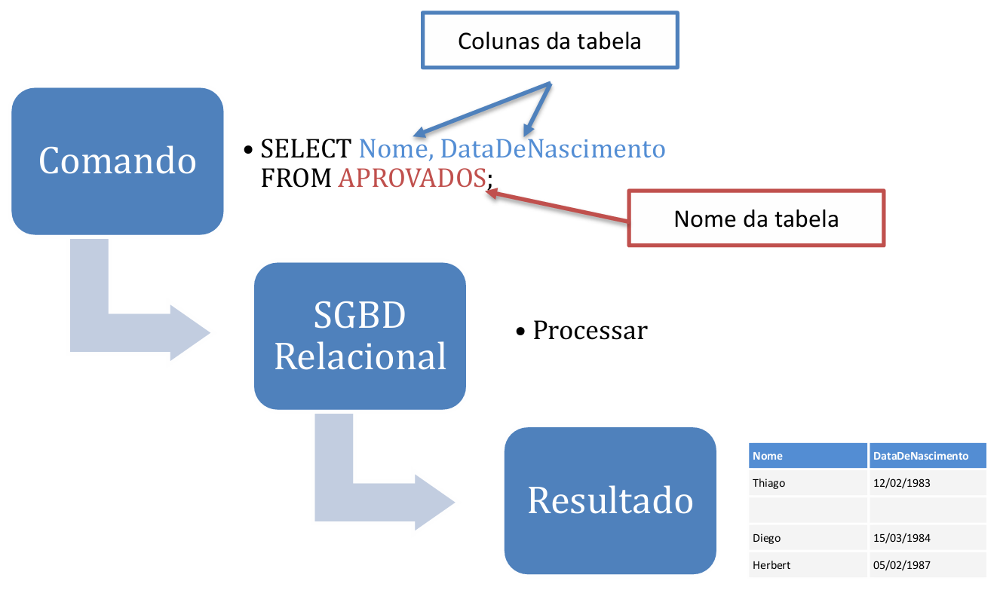
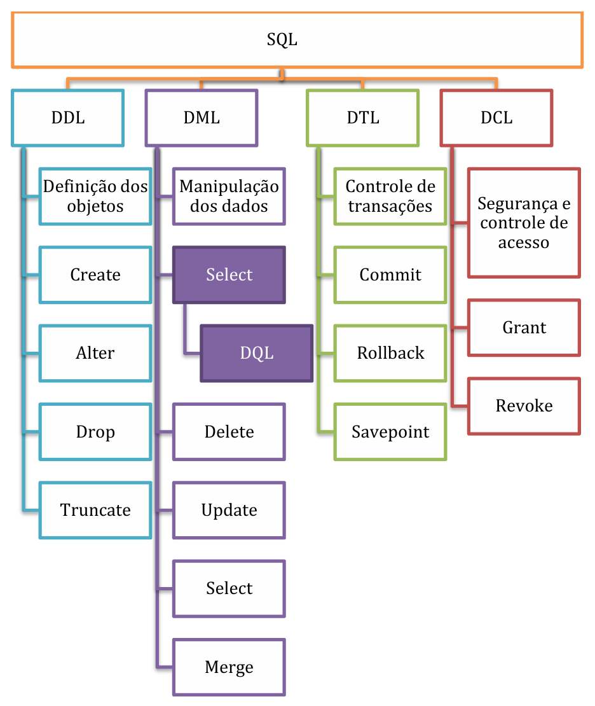

# Capítulo 1 – Fundamentos da Linguagem SQL

No mundo contemporâneo, os dados são um dos ativos mais valiosos para qualquer organização. A capacidade de armazenar, gerenciar, consultar e proteger essas informações de forma eficiente é um pilar fundamental da tecnologia da informação. No coração da vasta maioria dos sistemas que lidam com dados estruturados, encontramos os bancos de dados relacionais e, como sua interface universal, a linguagem SQL. Dominar o SQL não é apenas uma habilidade técnica, mas a chave para desbloquear o potencial contido nos dados.

Este capítulo serve como o ponto de partida para essa jornada. O objetivo é construir uma base sólida, explorando os conceitos essenciais que sustentam a linguagem SQL. Iniciaremos nossa exploração com uma viagem às suas origens, entendendo o contexto de sua criação e sua evolução até se tornar um padrão internacional. Em seguida, desvendaremos sua característica mais marcante — a natureza declarativa — e a dividiremos em suas sublinguagens funcionais, preparando o terreno para o aprendizado prático de seus comandos.

## A Origem e a Evolução do SQL

A história da linguagem que se tornaria o padrão global para manipulação de bancos de dados relacionais começa na década de 1970, um período de intensa inovação em ciência da computação. Em meio a pesquisas sobre como armazenar e recuperar grandes volumes de dados de forma eficiente, o modelo relacional, proposto por Edgar F. Codd, também da IBM, surgia como uma abordagem elegante e matematicamente fundamentada. Contudo, faltava uma linguagem acessível para que os usuários pudessem interagir com esse novo modelo.

A resposta a essa necessidade veio do laboratório de pesquisas da IBM em San Jose, Califórnia. Em 1974, os pesquisadores Donald D. Chamberlin e Raymond F. Boyce publicaram um artigo seminal intitulado “SEQUEL: A Structured English Query Language”. O nome, um acrônimo para Linguagem de Consulta Estruturada em Inglês, refletia seu principal objetivo: criar uma linguagem com uma sintaxe declarativa, próxima à da linguagem natural, que permitisse aos usuários especificar _o que_ queriam recuperar, sem a necessidade de detalhar _como_ o sistema deveria obter os dados.

A IBM implementou o SEQUEL como a interface principal para seu protótipo de sistema de gerenciamento de banco de dados relacional (SGBDR), o System R. O projeto foi um sucesso e demonstrou a viabilidade e o poder tanto do modelo relacional quanto da linguagem de consulta. Pouco tempo depois, por conta de uma disputa de marca registrada com uma empresa de aviação inglesa, o nome SEQUEL foi abreviado para **SQL (Structured Query Language)**, o nome pelo qual é conhecido até hoje.

O sucesso do SQL foi tão grande que ele se tornou um dos principais catalisadores para a adoção em massa dos bancos de dados relacionais em todo o mundo, superando modelos anteriores como o hierárquico e o de redes.

## A Padronização: SQL como Norma ANSI/ISO

Com a rápida popularização do SQL e o surgimento de diversos SGBDs comerciais que o implementavam (como Oracle, Ingres e DB2), tornou-se evidente a necessidade de uma padronização para garantir a portabilidade e a interoperabilidade entre os sistemas.

O trabalho de padronização foi liderado pelo **ANSI (American National Standards Institute)** e pela **ISO (International Organization for Standardization)**. A primeira versão oficial do padrão foi publicada em 1986, conhecida como SQL-86. Desde então, a norma tem sido revisada e expandida continuamente para incorporar novas funcionalidades e se adaptar às novas demandas da tecnologia. As principais revisões do padrão, conhecido formalmente como **ISO/IEC 9075**, foram:

- **SQL-86:** A primeira versão do padrão.
- **SQL-89:** Uma revisão menor.
- **SQL-92 (SQL2):** Uma revisão maior que introduziu muitas funcionalidades que são consideradas parte do núcleo do SQL moderno.
- **SQL:1999 (SQL3):** Adicionou expressões regulares, consultas recursivas e gatilhos. Também incorporou conceitos de orientação a objetos.
- **SQL:2003:** Introduziu funcionalidades relacionadas a XML, funções de janela e sequências.
- **SQL:2008:** Legitimou o uso de `ORDER BY` fora de definições de cursor e adicionou o gatilho `INSTEAD OF`.
- **SQL:2011:** Adicionou dados temporais e outras melhorias.
- **SQL:2016:** Adicionou funcionalidades para manipulação de JSON e funções de tabela polimórficas.
- **SQL:2023:** Introduz inovações como consultas de grafo de propriedades e melhorias no suporte a JSON, além de refinamentos em funcionalidades existentes.

O estudo de SQL geralmente se baseia na parte fundamental da norma, a **ISO/IEC 9075-2 (SQL/Foundation)**. A norma é dividida em várias partes, cada uma abordando um aspecto específico. A parte 1, por exemplo, (**ISO/IEC 9075-1: Framework**), define a estrutura conceitual, os termos e a notação usados em toda a série de documentos.

É dentro dessa norma que encontramos a definição formal de um dos objetos centrais do modelo relacional: a **tabela**.

> “Uma tabela possui uma coleção ordenada de uma ou mais colunas e uma coleção não ordenada de zero ou mais linhas. Cada coluna tem um nome e um tipo de dados. Cada linha tem, para cada coluna, exatamente um valor no tipo de dados dessa coluna.” (tradução da norma ISO/IEC 9075-1).

Essa definição estabelece a estrutura bidimensional (linhas e colunas) que caracteriza os bancos de dados relacionais. Considere a tabela `APROVADOS` abaixo como um exemplo prático dessa estrutura.

**APROVADOS**

| Identificador | Nome | Data de Nascimento | Local de Trabalho |
| --- | --- | --- | --- |
| 1 | Thiago | 12/02/1983 | Banco Central |
| 2 | Diego | 15/03/1984 | STN |
| 3 | Herbert | 05/02/1987 | SEFAZ |

Para criar, popular e, principalmente, consultar dados em estruturas como esta, utiliza-se a linguagem SQL.

## A Natureza Declarativa do SQL

A principal característica que define a linguagem SQL e a distingue de muitas outras linguagens de programação (como C++, Java ou Python) é sua natureza **declarativa**. Em uma linguagem declarativa, o foco está em **descrever o resultado desejado**, e não em detalhar o passo a passo para alcançá-lo. A responsabilidade de determinar o algoritmo mais eficiente para executar a solicitação e recuperar os dados é delegada ao SGBD, mais especificamente ao seu componente chamado **otimizador de consultas**.

Para ilustrar a diferença entre uma abordagem declarativa e uma procedural (ou imperativa), pode-se usar uma analogia do cotidiano. Imagine que alguém, posicionado ao lado do supermercado Pão de Açúcar em Brasília, pergunte como chegar a um determinado endereço no Sudoeste.

- **Uma resposta procedural (imperativa)** seria um conjunto de instruções passo a passo: "Vire à direita na próxima rua, entre na rotatória, pegue a segunda saída, siga em frente por 500 metros, vire à esquerda na Avenida das Jaqueiras, procure pelo Bloco C da quadra 101...". Essa abordagem descreve **como** realizar a tarefa.
- **Uma resposta declarativa** seria simplesmente fornecer o resultado final esperado: "O endereço é Quadra 101, Bloco C, Apto 304, Sudoeste, Brasília-DF". Essa abordagem descreve **o que** se quer encontrar, deixando que a pessoa (ou um aplicativo de GPS) descubra a melhor rota.

O SQL opera de maneira análoga à resposta declarativa. O usuário declara quais dados deseja, de quais tabelas e sob quais condições, e o SGBD se encarrega de encontrar a maneira mais eficiente de acessar o disco, juntar as informações e apresentar o resultado.

Outro aspecto fundamental é que o SQL é inseparável do modelo relacional. Sua sintaxe e suas operações são fundamentadas na teoria matemática da **álgebra relacional** e do **cálculo relacional**, que fornecem as bases formais para a manipulação de conjuntos de dados. Felizmente, a sintaxe do SQL foi projetada para ser muito mais intuitiva e fácil de usar do que as linguagens formais que a fundamentam.

## Uma Primeira Consulta

Vamos revisitar a tabela `APROVADOS` e executar uma operação de consulta simples. O objetivo é extrair apenas as colunas `Nome` e `Data de Nascimento` de todos os registros da tabela. Em SQL, essa operação é realizada com o comando `SELECT`.

```sql
SELECT Nome, "Data de Nascimento"
FROM APROVADOS;
```

<div align="center">
  
</div>

O resultado da execução deste comando seria uma nova tabela, contendo apenas as colunas solicitadas e todas as linhas da tabela original:

|Nome|Data de Nascimento|
|---|---|
|Thiago|12/02/1983|
|Diego|15/03/1984|
|Herbert|05/02/1987|

A simplicidade da sintaxe é evidente. A cláusula `SELECT` especifica as colunas que devem ser retornadas, e a cláusula `FROM` indica a tabela de origem dos dados. O SGBD interpreta essa declaração e retorna o conjunto de resultados solicitado. Note que o nome da coluna "Data de Nascimento" foi colocado entre aspas duplas porque contém espaços, uma regra de sintaxe importante em SQL para identificadores não padrão.

O comando `SELECT` é, sem dúvida, o mais utilizado da linguagem, mas é apenas uma parte de um conjunto maior de comandos, organizados em sublinguagens.

## As Sublinguagens do SQL

O SQL é uma linguagem de banco de dados abrangente, projetada para cobrir todo o ciclo de vida dos dados e dos objetos que os armazenam. Suas instruções são tradicionalmente categorizadas em grupos, ou **sublinguagens**, com base na funcionalidade que executam. Embora as divisões possam variar ligeiramente entre autores, a classificação mais comum inclui cinco categorias.

<div align="center">
  
</div>

- **DDL (Data Definition Language):** A Linguagem de Definição de Dados contém os comandos usados para criar, modificar e excluir a estrutura dos objetos do banco de dados, como tabelas, índices, visões e usuários.
    - **Exemplos:** `CREATE`, `ALTER`, `DROP`, `TRUNCATE`.
- **DML (Data Manipulation Language):** A Linguagem de Manipulação de Dados fornece as instruções para interagir com os dados armazenados dentro dos objetos.
    - **Exemplos:** `INSERT`, `UPDATE`, `DELETE`, `MERGE`.
- **DQL (Data Query Language):** A Linguagem de Consulta de Dados é tecnicamente um subconjunto da DML, mas frequentemente tratada como uma categoria separada devido à sua importância e complexidade. Seu único comando é o `SELECT`, usado para recuperar dados.
- **DCL (Data Control Language):** A Linguagem de Controle de Dados contém os comandos relacionados à segurança e ao gerenciamento de permissões de acesso. Ela garante que apenas usuários autorizados possam acessar e manipular os objetos do banco.
    - **Exemplos:** `GRANT` (concede permissões), `REVOKE` (revoga permissões).
- **TCL (Transaction Control Language):** A Linguagem de Controle de Transação gerencia as transações no banco de dados, garantindo a consistência e a integridade dos dados durante operações complexas. Alguns autores utilizam a sigla DTL (Data Transaction Language).
    - **Exemplos:** `COMMIT` (confirma uma transação), `ROLLBACK` (desfaz uma transação), `SAVEPOINT` (cria um ponto de retorno dentro de uma transação).

## Além do Padrão: Dialetos e Extensões Procedurais

Embora o SQL padrão ANSI/ISO forneça uma base sólida e portável, os principais fornecedores de SGBDs (como Oracle, Microsoft, IBM e a comunidade PostgreSQL) desenvolveram suas próprias extensões para a linguagem ao longo do tempo. Essas extensões, frequentemente chamadas de **dialetos**, foram criadas por duas razões principais: a necessidade de funcionalidades mais complexas que não estavam (ou ainda não estão) no padrão e a busca por melhor desempenho.

Uma das extensões mais significativas foi a introdução de **capacidades procedurais** diretamente no banco de dados. O SQL padrão é puramente declarativo. As extensões procedurais adicionam construções típicas de linguagens de programação imperativas, como:

- Controle de fluxo (laços `FOR`, `WHILE`).
- Lógica condicional (`IF-THEN-ELSE`).
- Declaração e manipulação de variáveis.
- Tratamento de erros e exceções.

Essa fusão permite que desenvolvedores criem lógicas de negócio complexas na forma de **stored procedures (procedimentos armazenados)**, **functions (funções)** e **triggers (gatilhos)** que são executados diretamente no servidor de banco de dados, o que pode resultar em um desempenho significativamente melhor, pois reduz o tráfego de dados pela rede entre a aplicação e o banco.

A ANSI/ISO eventualmente padronizou uma extensão procedural chamada **SQL/PSM (Persistent Stored Modules)**, mas muitos dialetos já haviam sido criados e consolidados no mercado.

|Fonte/SGBDR|Nome Comum|Nome Completo|
|---|---|---|
|ANSI/ISO|SQL/PSM|SQL/Persistent Stored Modules|
|Interbase/Firebird|PSQL|Procedural SQL|
|IBM DB2|SQL PL|SQL Procedural Language|
|MySQL|SQL/PSM|SQL/Persistent Stored Modules|
|Oracle|PL/SQL|Procedural Language/SQL|
|PostgreSQL|PL/pgSQL|Procedural Language/PostgreSQL|
|Microsoft SQL Server / Sybase|T-SQL|Transact-SQL|

É importante notar que, nos últimos anos, os SGBDs também se integraram fortemente com outras linguagens populares para análise de dados, como **Python** e **R**, permitindo que códigos nessas linguagens sejam executados dentro do banco de dados.

A tabela a seguir resume as diferenças conceituais entre o SQL padrão e uma extensão procedural como o PL/SQL da Oracle.

|PL/SQL (Procedural)|SQL (Declarativo)|
|---|---|
|Código organizado em blocos que podem formar programas completos.|Comandos individuais (statements) para operações DDL e DML.|
|Descreve **COMO** as coisas devem ser feitas (passo a passo).|Descreve **O QUE** deve ser feito (o resultado final).|
|Executado como um bloco de código inteiro.|Cada comando é executado individualmente.|
|Usado para criar lógica de aplicação no banco de dados.|Usado para definir e manipular dados.|
|É uma extensão do SQL; pode conter comandos SQL em seu corpo.|Não pode conter blocos de código PL/SQL.|

Para ilustrar, um bloco de código em PL/SQL possui uma estrutura bem definida, geralmente com uma seção de declaração de variáveis (`DECLARE`), um corpo principal de execução (`BEGIN...END`) e uma seção para tratamento de exceções (`EXCEPTION`).

```sql
-- Exemplo de um bloco anônimo em PL/SQL (Oracle)
DECLARE
  -- Seção de declaração de variáveis
  soma NUMBER;
BEGIN
  -- Corpo principal com a lógica procedural
  soma := 45 + 55;
  
  -- Exibindo o resultado no console do servidor
  dbms_output.put_line('Soma: ' || soma);
EXCEPTION
  -- Seção de tratamento de erros
  WHEN OTHERS THEN
    raise_application_error(-20001, 'Erro ao somar valores!');
END;
```

Compreender os fundamentos do SQL padrão é a habilidade essencial, pois ela é transferível para praticamente qualquer SGBD relacional. O conhecimento dos dialetos e extensões procedurais torna-se importante ao se especializar em uma plataforma específica.

## Considerações Finais

Neste capítulo, estabelecemos os alicerces para o estudo da linguagem SQL. Percorremos sua trajetória histórica, desde a concepção como SEQUEL até sua consolidação como um padrão internacional ANSI/ISO, um testemunho de sua robustez e relevância duradouras. O conceito mais crucial apresentado foi a natureza **declarativa** do SQL, que permite aos usuários focar no "o quê" em vez do "como", delegando a otimização da recuperação de dados ao SGBD.

Analisamos a estrutura da linguagem, dividindo-a em suas sublinguagens funcionais — DDL, DML, DQL, DCL e TCL — que organizam os comandos de acordo com seus propósitos, desde a definição da estrutura dos dados até sua manipulação, consulta, controle de acesso e gerenciamento de transações. Também reconhecemos que, embora o padrão SQL seja a base, o mundo real dos bancos de dados é rico em **dialetos** e **extensões procedurais**, como PL/SQL e T-SQL, que agregam poder e flexibilidade para a construção de lógicas complexas diretamente no banco de dados.

Compreender esses fundamentos é o primeiro e mais importante passo para qualquer profissional que deseje trabalhar com bancos de dados relacionais. Essa base conceitual não apenas facilita o aprendizado dos comandos específicos, mas também fornece o contexto necessário para escrever consultas eficientes e projetar sistemas de dados sólidos. O próximo passo nesta jornada é aprofundar o conhecimento sobre a primeira das sublinguagens: a DDL, que nos permitirá criar e gerenciar a estrutura das tabelas onde os dados residirão.