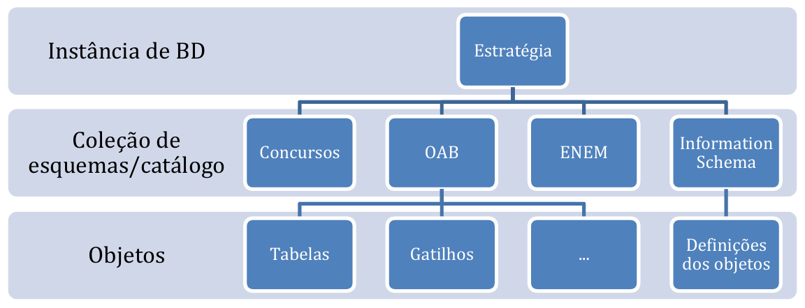
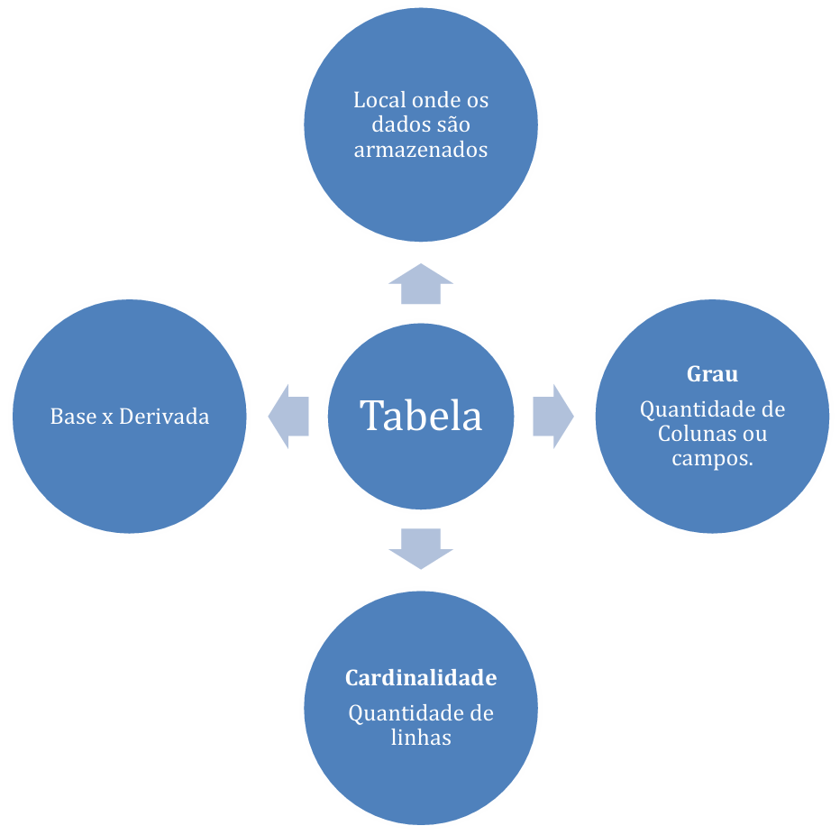
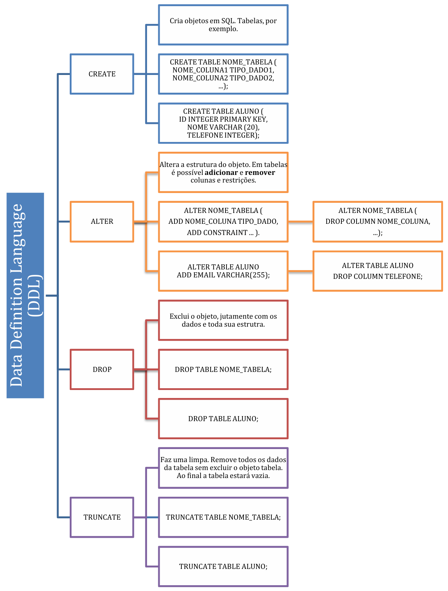
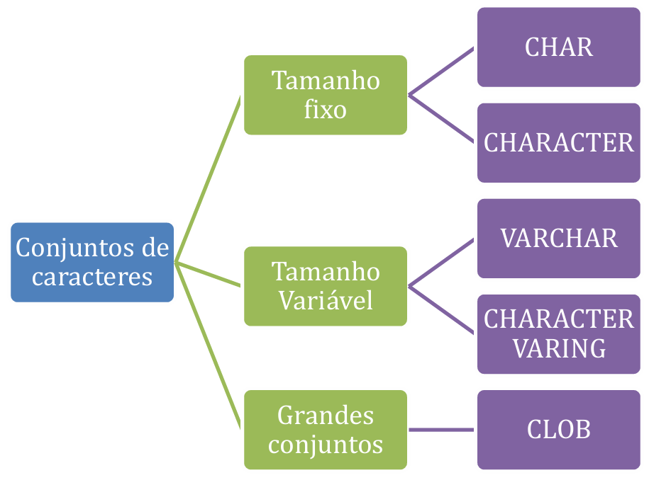
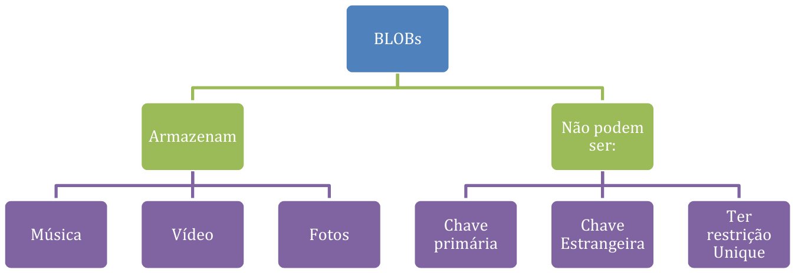

# Capítulo 2 – Linguagem de Definição de Dados (DDL)

Após estabelecermos os fundamentos conceituais e históricos da linguagem SQL, é hora de mergulhar na prática de construir a infraestrutura que armazenará nossos dados. Antes de manipular ou consultar qualquer informação, é preciso definir sua estrutura. Essa é a responsabilidade da **Linguagem de Definição de Dados (DDL)**, o conjunto de comandos SQL que nos permite criar, alterar e remover os objetos que compõem um banco de dados. Este capítulo se dedica a explorar esses comandos, detalhando como dar vida a um modelo de dados, desde a criação do contêiner principal do banco até a definição minuciosa de cada tabela e suas colunas.

## A Arquitetura Lógica: Instâncias, Catálogos e Esquemas

Quando um modelo de dados conceitual é projetado, ele eventualmente precisa ser traduzido para uma implementação física em um SGBD. Essa implementação ocorre dentro de uma hierarquia lógica bem definida. No topo dessa hierarquia, temos a **instância do SGBD**, que é o software do sistema de banco de dados em execução. Uma única instância pode gerenciar múltiplos **bancos de dados** (ou **catálogos**). Cada catálogo, por sua vez, contém uma coleção de **esquemas (schemas)**.

Um esquema pode ser visto como um contêiner ou um espaço de nomes que agrupa objetos de banco de dados relacionados, como tabelas, visões, índices e outros construtores que pertencem a uma mesma aplicação ou a um mesmo domínio de negócio. Essa organização lógica é fundamental para a gestão de ambientes complexos, permitindo separar, por exemplo, os objetos do setor de Recursos Humanos dos objetos do setor Financeiro. Cada esquema é identificado por um nome e geralmente está associado a um usuário ou conta de autorização.

<div align="center">
  
</div>

Dentro de cada catálogo, existe um esquema especial e fundamental, definido pelo padrão SQL: o **INFORMATION_SCHEMA**. Este esquema não armazena dados de negócio, mas sim **metadados**, ou seja, dados sobre os próprios dados. Ele funciona como o **dicionário de dados** do sistema, fornecendo uma descrição detalhada de todos os outros esquemas, tabelas, colunas, restrições e demais objetos definidos no catálogo.

A grande vantagem do `INFORMATION_SCHEMA` é que ele expõe esses metadados através de um conjunto de **visões (views)** somente leitura. Uma visão é uma tabela virtual cujo conteúdo é derivado de uma consulta. Isso significa que é possível usar o próprio comando `SELECT` do SQL para consultar a estrutura do banco de dados. Por exemplo, para descobrir todas as colunas de uma tabela específica, basta fazer uma consulta à visão `COLUMNS` dentro do `INFORMATION_SCHEMA`, filtrando pelo nome da tabela desejada. Essa abordagem padronizada oferece uma maneira poderosa e consistente de inspecionar a arquitetura do banco de dados de forma programática.

Para criar essa estrutura, utiliza-se os comandos DDL. Embora o comando `CREATE DATABASE` não faça parte do padrão SQL ANSI/ISO (que delega a criação do ambiente ao SGBD), ele é uma extensão quase universalmente adotada.

```sql
-- Cria um novo banco de dados (ou catálogo)
CREATE DATABASE nome_do_banco_de_dados;

-- Remove um banco de dados e todos os seus objetos
DROP DATABASE nome_do_banco_de_dados;
```

Uma vez dentro de um banco de dados, podemos criar esquemas para organizar nossos objetos. A criação de esquemas é uma operação privilegiada, normalmente restrita a administradores (DBAs).

```sql
-- Cria um novo esquema
CREATE SCHEMA nome_do_esquema;

-- Remove um esquema e, opcionalmente, todos os objetos contidos nele
DROP SCHEMA nome_do_esquema [ CASCADE | RESTRICT ];
```

A opção `RESTRICT` (padrão) impede a exclusão se o esquema contiver objetos, enquanto `CASCADE` remove o esquema e todos os seus conteúdos.

## Trabalhando com Tabelas: A Estrutura Fundamental

A tabela é o objeto central do modelo relacional, a estrutura onde os dados são efetivamente armazenados. Conforme a definição padrão, uma tabela é uma coleção de linhas, onde cada linha representa uma ocorrência ou uma entidade do mundo real, e todas as linhas seguem a mesma estrutura de colunas. Dois conceitos importantes definem suas dimensões:

- **Grau (Degree):** É o número de colunas (ou atributos) que a tabela possui. O grau define a estrutura da tabela.
- **Cardinalidade (Cardinality):** É o número de linhas (ou tuplas) presentes na tabela em um determinado momento. Uma tabela com cardinalidade zero é chamada de tabela vazia.

<div align="center">
  
</div>

As tabelas em SQL podem ser classificadas em dois tipos principais: **tabelas base** e **tabelas derivadas**.

- **Tabelas Base (Base Tables):** São as tabelas "reais", cujos dados são fisicamente armazenados no banco de dados. Elas podem ser persistentes (o tipo mais comum) ou temporárias (existindo apenas durante uma sessão ou transação).
- **Tabelas Derivadas (Derived Tables):** São tabelas virtuais, cujo conteúdo não é armazenado diretamente, mas sim calculado ou derivado a partir de uma ou mais tabelas base no momento da consulta. O exemplo mais proeminente de uma tabela derivada é uma **visão (view)**, criada com o comando `CREATE VIEW`. Uma visão pode ser atualizável (permitindo operações de `INSERT`, `UPDATE`, `DELETE` que afetam a tabela base subjacente) ou não atualizável. Geralmente, uma visão é atualizável apenas se for baseada em uma única tabela e incluir a chave primária e todas as colunas que não permitem valores nulos e não possuem um valor padrão. Visões que envolvem junções, agrupamentos ou funções de agregação não são atualizáveis.

### Definindo, Modificando e Removendo Tabelas

O ciclo de vida de uma tabela é gerenciado por um conjunto central de comandos DDL.

#### O Comando `CREATE TABLE`

Este é o principal comando da DDL, usado para definir uma nova tabela, especificando seu nome, suas colunas e as restrições de integridade associadas.

**Sintaxe Geral:**

```sql
CREATE TABLE nome_da_tabela (
    nome_coluna1 tipo_de_dado [restrições_da_coluna],
    nome_coluna2 tipo_de_dado [restrições_da_coluna],
    ...
    [restrições_da_tabela]
);
```

**Exemplo Prático:** Vamos criar uma tabela `ALUNO` para armazenar informações de estudantes.

```sql
CREATE TABLE ALUNO (
    NOME VARCHAR(20) NOT NULL,
    CPF INT PRIMARY KEY,
    SEXO CHAR(1) NOT NULL,
    DATA_NASCIMENTO DATE NOT NULL,
    CIDADE VARCHAR(50) NOT NULL,
    VALOR_PAGO INT NOT NULL
);
```

Após a execução deste comando, a estrutura da tabela `ALUNO` existirá no banco de dados, pronta para receber dados.

**Resultado da Criação:**

| NOME | CPF | SEXO | DATA_NASCIMENTO | CIDADE | VALOR_PAGO |
| --- | --- | --- | --- | --- | --- |
| - | - | - | - | - | - |

#### O Comando `ALTER TABLE`

Frequentemente, é necessário modificar a estrutura de uma tabela existente. O comando `ALTER TABLE` permite adicionar, remover ou modificar colunas.

**Sintaxe (Resumida):**

```sql
-- Adicionar uma nova coluna
ALTER TABLE nome_da_tabela ADD COLUMN nome_nova_coluna tipo_de_dado;

-- Remover uma coluna existente
ALTER TABLE nome_da_tabela DROP COLUMN nome_coluna_existente;

-- Modificar o tipo de dado de uma coluna
ALTER TABLE nome_da_tabela ALTER COLUMN nome_coluna_existente SET DATA TYPE novo_tipo_de_dado;
```

A sintaxe exata para modificar colunas pode variar entre os SGBDs (por exemplo, usando `MODIFY COLUMN` em vez de `ALTER COLUMN`).

**Exemplo de Alterações na Tabela `ALUNO`:**

```sql
ALTER TABLE ALUNO ADD COLUMN EMAIL VARCHAR(40);
ALTER TABLE ALUNO DROP COLUMN SEXO;
ALTER TABLE ALUNO ALTER COLUMN VALOR_PAGO TYPE FLOAT; -- Sintaxe do PostgreSQL, pode variar
```

**Estrutura Resultante:**

| NOME | CPF | DATA_NASCIMENTO | CIDADE | VALOR_PAGO | EMAIL |
| --- | --- | --- | --- | --- | --- |
| - | - | - | - | - | - |

#### O Comando `DROP TABLE`

Para remover completamente uma tabela e todos os seus dados, utiliza-se o comando `DROP TABLE`. É uma ação irreversível que apaga a definição da tabela e todo o seu conteúdo.

**Sintaxe:**

```sql
DROP TABLE nome_da_tabela;
```

**Exemplo:**

```sql
DROP TABLE ALUNO;
```

### Resumo dos Principais Comandos DDL

Os comandos da Linguagem de Definição de Dados são a base para a criação e manutenção da arquitetura de um banco de dados relacional.

|Comando|Descrição|
|---|---|
|**`CREATE`**|Utilizado para criar novos objetos de banco de dados, como `DATABASE`, `SCHEMA`, `TABLE`, `VIEW`, `INDEX`.|
|**`DROP`**|Utilizado para excluir permanentemente um objeto do banco de dados e todos os dados associados a ele.|
|**`ALTER`**|Utilizado para modificar a estrutura de um objeto existente, como adicionar, remover ou alterar colunas de uma tabela.|
|**`TRUNCATE`**|Utilizado para remover rapidamente todas as linhas de uma tabela, mantendo sua estrutura. Geralmente é mais rápido que um `DELETE` sem cláusula `WHERE`, pois não registra as exclusões linha a linha.|
|**`RENAME`**|Utilizado para renomear um objeto, como uma tabela. É uma extensão comum, não presente em todas as versões do padrão SQL.|

<div align="center">
  
</div>

Com o conhecimento de como criar e gerenciar a estrutura das tabelas, o próximo passo crucial é entender os diferentes tipos de dados que podemos atribuir a cada coluna, garantindo que as informações sejam armazenadas de forma correta e eficiente. Para entendermos melhor como escolher os tipos de dados das nossas colunas, passaremos, a seguir, a analisar os principais tipos de dados de SQL e suas peculiaridades.

## Tipos de Dados em SQL

A escolha correta do tipo de dado para cada coluna de uma tabela é uma decisão fundamental no projeto de um banco de dados. Essa escolha não apenas garante a integridade dos dados, forçando que apenas valores válidos sejam armazenados, mas também impacta diretamente o desempenho e o uso de espaço em disco. O padrão SQL define um rico conjunto de tipos de dados pré-definidos, que podem ser agrupados em categorias como texto, numéricos, binários, data/hora e outros tipos mais especializados.

### Tipos de Dados de Caracteres (Texto)

Os tipos de dados para armazenar texto, ou cadeias de caracteres, são talvez os mais comuns em qualquer banco de dados. O padrão SQL os divide principalmente com base no tamanho ser fixo ou variável.

- **`CHARACTER(n)` ou `CHAR(n)`:** Define uma cadeia de caracteres de **tamanho fixo**. O `n` especifica o número exato de caracteres que a coluna armazenará. Se um valor inserido for menor que `n`, o SGBD completará o restante com espaços em branco até atingir o tamanho definido. `CHAR` é ideal para dados que sempre têm o mesmo tamanho, como siglas de estados (`UF CHAR(2)`), códigos de produtos ou números de CPF formatados. O uso de `CHAR` pode oferecer um leve ganho de desempenho em algumas operações, pois o SGBD sabe exatamente onde cada registro termina e o próximo começa. Por exemplo, em uma coluna `CODIGO_PRODUTO CHAR(10)`, o valor `'PROD-01'` (7 caracteres) seria armazenado como `'PROD-01 '` (com 3 espaços adicionais).
- **`CHARACTER VARYING(n)` ou `VARCHAR(n)`:** Define uma cadeia de caracteres de **tamanho variável**, com um comprimento máximo de `n`. Diferente do `CHAR`, o `VARCHAR` armazena apenas os caracteres inseridos, sem adicionar espaços. Isso resulta em um uso de armazenamento mais eficiente para dados cujo comprimento varia significativamente, como nomes de pessoas, endereços ou descrições. Essa flexibilidade, no entanto, pode implicar uma pequena sobrecarga de processamento, pois o SGBD precisa armazenar o comprimento de cada valor. Por exemplo, em uma coluna `NOME VARCHAR(60)`, o valor `'Ana'` ocuparia o espaço de 3 caracteres, enquanto `'Alexandrina'` ocuparia o espaço de 11 caracteres.
- **`CHARACTER LARGE OBJECT` ou `CLOB`:** Introduzido no padrão SQL:1999, o tipo `CLOB` é projetado para armazenar objetos de caracteres muito grandes, como o conteúdo de um livro, um artigo de blog ou um documento de texto longo, que excederiam o limite máximo de um `VARCHAR` (que varia entre SGBDs, mas é tipicamente de milhares de caracteres). Devido ao seu tamanho potencial, os `CLOB`s possuem algumas restrições; por exemplo, não podem ser usados como chaves primárias ou em restrições `UNIQUE`.

<div align="center">
  
</div>

Para lidar com a internacionalização e a necessidade de armazenar texto em diferentes idiomas, o SQL oferece variantes "nacionais" desses tipos: `NATIONAL CHARACTER` (`NCHAR`), `NATIONAL CHARACTER VARYING` (`NVARCHAR`) e `NATIONAL CHARACTER LARGE OBJECT` (`NCLOB`). A principal diferença é que esses tipos utilizam um conjunto de caracteres (character set) pré-definido no sistema como "nacional" (frequentemente um padrão Unicode como UTF-8 ou UTF-16), permitindo o armazenamento de caracteres de múltiplos idiomas. É possível, inclusive, especificar um conjunto de caracteres diferente para cada coluna.

```sql
CREATE TABLE IDIOMAS (
    IDIOMA_PADRAO CHARACTER(40),
    IDIOMA_GREGO CHARACTER VARYING(40) CHARACTER SET GREEK,
    IDIOMA_NACIONAL NATIONAL CHARACTER(40),
    IDIOMA_JAPONES CHARACTER(40) CHARACTER SET KANJI
);
```

### Tipos de Dados de Strings Binárias

Enquanto os tipos de caracteres são feitos para armazenar texto legível, as strings binárias são sequências de bytes usadas para armazenar dados não-textuais, como imagens, arquivos de áudio, vídeos, PDFs ou executáveis de programas. Até o SQL:2003, esses tipos eram representados por `BIT` e `BIT VARYING`, que ainda são mantidos em alguns SGBDs como o PostgreSQL. O padrão mais moderno, a partir do SQL:2008, formalizou os seguintes tipos:

- **`BINARY(n)`:** Semelhante ao `CHAR`, define uma sequência de bytes de **tamanho fixo** de `n` bytes (ou octetos). Se uma coluna for `FOTO_PERFIL BINARY(16)`, ela sempre ocupará 16 bytes.
- **`BINARY VARYING(n)` ou `VARBINARY(n)`:** Semelhante ao `VARCHAR`, define uma sequência de bytes de **tamanho variável**, com um máximo de `n` bytes. Uma coluna `DOCUMENTO VARBINARY(20)` pode armazenar um arquivo de 5 bytes ou de 20 bytes.
- **`BINARY LARGE OBJECT` ou `BLOB`:** O análogo binário do `CLOB`, usado para armazenar objetos binários muito grandes. Assim como os `CLOB`s, os `BLOB`s não podem ser usados em chaves ou na maioria das comparações, exceto igualdade/desigualdade.

<div align="center">
  
</div>

### Tipos de Dados Numéricos

Os tipos numéricos em SQL são divididos em duas grandes categorias: números exatos e números aproximados.

#### Números Exatos

Estes tipos são usados para armazenar valores onde a precisão absoluta é necessária, como em contagens, identificadores e, principalmente, valores monetários.

- **`NUMERIC(p, s)` e `DECIMAL(p, s)`:** São os tipos padrão para números de ponto fixo. O parâmetro **precisão (`p`)** define o número total de dígitos que o número pode ter, e a **escala (`s`)** define quantos desses dígitos vêm após a vírgula decimal. Por exemplo, `NUMERIC(7, 2)` pode armazenar um número como `12345.67`. A diferença entre `NUMERIC` e `DECIMAL` é sutil e depende da implementação do SGBD, mas em geral, `NUMERIC` exige a precisão exata definida, enquanto `DECIMAL` pode permitir uma precisão maior.
- **`INTEGER` (ou `INT`), `SMALLINT` e `BIGINT`:** Usados para armazenar números inteiros (sem parte fracionária). A diferença entre eles é o espaço de armazenamento e, consequentemente, a faixa de valores que podem representar. `SMALLINT` ocupa menos espaço para números pequenos, `INTEGER` é o tipo mais comum, e `BIGINT` é usado para números inteiros muito grandes.

A tabela a seguir ilustra como o valor `235.89` seria armazenado sob diferentes especificações `NUMERIC`:

|Especificação|Valor Armazenado|
|---|---|
|`NUMERIC(5, 2)`|`235.89`|
|`NUMERIC(5, 1)`|`235.9` (arredondado)|
|`NUMERIC(5)` ou `NUMERIC(5, 0)`|`236` (arredondado)|
|`NUMERIC(4, 1)`|`235.9` (arredondado)|
|`NUMERIC(4, 2)`|Erro (excede a precisão)|

#### Números Aproximados

Estes tipos, também conhecidos como números de ponto flutuante, são usados para dados científicos ou medições onde uma aproximação é aceitável. Eles podem representar uma faixa muito maior de valores (tanto muito grandes quanto muito pequenos) do que os tipos exatos, mas com uma perda potencial de precisão.

- **`FLOAT(p)`:** Define um número de ponto flutuante com uma precisão binária mínima de `p` bits. A precisão determina quantos bits são usados para armazenar o número, o que afeta diretamente sua exatidão. Por exemplo, ao armazenar um número como `116.456,23` em uma coluna `FLOAT(20)`, o SGBD tem 20 bits para representar o número. Se a parte inteira (`116456` em decimal é `11100011011101000` em binário, que usa 17 bits) consumir 17 bits, sobrarão apenas 3 bits para a parte fracionária (`0,23`). Como `0,23` (`.0011101...` em binário) precisa de mais de 3 bits para ser representado com exatidão, o valor será arredondado (ou truncado), e o que será armazenado no banco será uma aproximação, como `116.456,2`.
- **`REAL`:** Um tipo de ponto flutuante de precisão simples.
- **`DOUBLE PRECISION`:** Um tipo de ponto flutuante de precisão dupla, oferecendo mais precisão que o `REAL`.

É crucial evitar o uso de tipos de ponto flutuante para valores monetários, pois erros de arredondamento podem se acumular e levar a inconsistências financeiras. Para esses casos, `NUMERIC` ou `DECIMAL` são sempre a escolha correta.

Esses tipos de dados numéricos estão disponíveis em todos os SGBDs relacionais, por exemplo, no SGBD Oracle. É mostra, abaixo, a relação entre os tipos SQL padrão, os do ORACLE e do MYSQL, bem como alguns comentários importantes sobre os aspectos numéricos do Oracle.

|ANSI SQL DATA TYPE|ORACLE DATA TYPE|MYSQL DATA TYPE|
|---|---|---|
|`NUMERIC(p,s)`, `DECIMAL(p,s)`|`NUMBER(p,s)`|`DECIMAL(p,d)`, `DEC(p,d)`|
|`INTEGER`, `INT`, `SMALLINT`, `BIGINT`|`NUMBER(p,0)`, `NUMBER(p)`|`TINYINT`, `SMALLINT`, `MEDIUMINT`, `INT`, `BIGINT`|
|`FLOAT`, `REAL`, `DOUBLE PRECISION`|`FLOAT(p)`, `NUMBER`|`FLOAT(p)`, `DOUBLE`|

|Tipo de Dado|Tamanho Típico (Bytes)|Faixa (com sinal)|
|---|---|---|
|`SMALLINT`|2|-32.768 a 32.767|
|`INTEGER`|4|-2.147.483.648 a 2.147.483.647|
|`BIGINT`|8|-9.223.372.036.854.775.808 a 9.223.372.036.854.775.807|
|`REAL`|4|±1.18E-38 a ±3.40E+38|
|`DOUBLE PRECISION`|8|±2.23E-308 a ±1.79E+308|

### Tipos de Dados Temporais (Data e Hora)

Armazenar e manipular informações de data e hora é um requisito comum. O SQL oferece tipos específicos para isso.

- **`DATE`:** Armazena uma data, contendo os componentes ano (quatro dígitos), mês (01-12) e dia (01-31). Exemplo: `2025-07-04`.
    
- **`TIME`:** Armazena uma hora do dia, contendo os componentes hora (00-23), minuto (00-59) e segundo (00-59), podendo incluir frações de segundo. Exemplo: `23:59:59.999`.
    
- **`TIMESTAMP`:** Combina `DATE` e `TIME` em um único tipo, armazenando um ponto exato no tempo, com precisão de frações de segundo. Pode opcionalmente incluir informações de fuso horário com a cláusula `WITH TIME ZONE`, o que é essencial para aplicações globais.
    
- **`INTERVAL`:** Representa uma duração de tempo, em vez de um ponto no tempo. É usado para realizar cálculos com datas, como `CURRENT_DATE + INTERVAL '1' MONTH`.
    

```
CREATE TABLE LOG_EVENTOS (
    ID_EVENTO INTEGER PRIMARY KEY,
    DATA_OCORRENCIA DATE,
    HORA_OCORRENCIA TIME,
    TIMESTAMP_REGISTRO TIMESTAMP WITH TIME ZONE
);
```

### Outros Tipos de Dados Padrão

- **`BOOLEAN`:** Um tipo de dado lógico que pode conter os valores `TRUE`, `FALSE` ou `UNKNOWN` (que é o tratamento do SQL para o valor `NULL` em contextos lógicos).
    
- **`XML`:** Introduzido para suportar o armazenamento e a consulta de dados no formato XML diretamente no banco de dados. O SGBD pode validar os documentos XML armazenados contra um `XMLSchema` definido, garantindo a estrutura dos dados. O tipo XML possui uma estrutura de árvore hierárquica, permitindo a representação de dados complexos e semiestruturados.
    

<div align="center">  <p><em>O tipo de dado XML possui uma estrutura de árvore hierárquica.</em></p> </div>

### Tipos de Dados Avançados e Estruturados

As revisões mais recentes do padrão SQL, a partir do SQL:1999, introduziram tipos de dados complexos que estendem o modelo relacional, aproximando-o de paradigmas orientados a objetos.

- **`ROW`:** Este tipo permite que uma única coluna contenha uma estrutura de linha inteira, ou seja, um conjunto de campos nomeados. Isso viola a Primeira Forma Normal (1NF) da teoria relacional, que exige que todos os valores de coluna sejam atômicos. A vantagem é a capacidade de agrupar dados relacionados, como um endereço completo (`rua`, `cidade`, `estado`, `cep`), em um único tipo reutilizável. Por exemplo, pode-se criar um tipo `addr_typ` e usá-lo como o tipo da coluna `Endereco` na tabela `CLIENTE`.
    
    ```
    CREATE ROW TYPE addr_typ (
        Rua CHARACTER VARYING(25),
        Cidade CHARACTER VARYING(20),
        Estado CHARACTER(2),
        CEP CHARACTER VARYING(9)
    );
    
    CREATE TABLE CLIENTE (
        ClienteID INTEGER PRIMARY KEY,
        PrimeiroNome CHARACTER VARYING(25),
        Endereco addr_typ
    );
    ```
    
- **Tipos de Coleção (`ARRAY`, `MULTISET`):** Esses tipos permitem que uma única coluna armazene uma coleção de valores. `ARRAY` é uma coleção ordenada de elementos, enquanto `MULTISET` é uma coleção não ordenada que permite duplicatas. Assim como o tipo `ROW`, eles também violam a 1NF, mas oferecem flexibilidade para modelar atributos multivalorados diretamente.
    
- **Tipos Definidos pelo Usuário (UDT - User-Defined Types):** O UDT é o recurso mais poderoso para estender o sistema de tipos do SQL. Ele permite que os desenvolvedores criem seus próprios tipos de dados complexos, encapsulando atributos e métodos (comportamento), de forma semelhante a uma classe em programação orientada a objetos. O principal benefício é a redução da "diferença de impedância" entre a linguagem da aplicação (como Java ou C#) e o banco de dados, permitindo um mapeamento mais direto entre os objetos da aplicação e os dados armazenados.
    
    ```
    CREATE TYPE livro_udt AS (
        titulo CHAR(40),
        precodecompra DECIMAL(9,2),
        ISBN varchar(40)
    );
    ```
    

<div align="center">  <p><em>Esquema simplificado dos tipos de dados em SQL.</em></p> </div>

A escolha correta de um tipo de dado é a primeira linha de defesa para garantir a qualidade e a integridade da informação. É importante notar que o valor especial `NULL` é um membro de todos os domínios de tipo de dados, representando a ausência de um valor. Se um valor nulo não for permitido para uma coluna, a restrição `NOT NULL` deve ser declarada.

Agora que compreendemos como definir a estrutura das tabelas e os tipos de dados de suas colunas, o próximo passo é explorar as restrições de integridade, que impõem regras de negócio ainda mais específicas sobre os dados.

## Restrições de Integridade: Garantindo a Qualidade dos Dados

Definir a estrutura de uma tabela com suas colunas e tipos de dados é apenas o primeiro passo. Para que um banco de dados seja confiável, é preciso garantir que os dados armazenados nele sejam válidos, consistentes e sigam as regras de negócio da aplicação. Essa é a função das **restrições de integridade (constraints)**. Elas são regras declaradas no esquema do banco de dados que o SGBD impõe automaticamente, prevenindo a inserção de dados inválidos.

As restrições de integridade em SQL podem ser agrupadas em três categorias principais, com base em onde e como são definidas:

- **Restrições de Tabela (e de Coluna):** São definidas diretamente dentro do comando `CREATE TABLE` ou adicionadas posteriormente com `ALTER TABLE`. Podem ser aplicadas a uma única coluna (restrição de coluna) ou a um conjunto de colunas (restrição de tabela).
    
- **Assertions (Afirmações):** São restrições mais gerais, definidas como objetos de esquema independentes com `CREATE ASSERTION`. Elas podem envolver múltiplas tabelas e impor regras complexas que não se limitam a uma única tabela.
    
- **Restrições de Domínio:** São definidas com `CREATE DOMAIN`, criando um tipo de dado personalizado que já embute uma restrição. Qualquer coluna que utilize esse domínio herdará automaticamente a restrição.
    

<div align="center">  <p><em>Classificação e aplicação das restrições de integridade em SQL.</em></p> </div>

### Restrições Fundamentais em Tabelas

Vamos explorar as restrições mais comuns, que são declaradas no nível da tabela.

- **`PRIMARY KEY` (Chave Primária):** Esta é a restrição mais importante. Ela designa uma ou mais colunas cujo valor deve identificar unicamente cada linha da tabela. Uma chave primária impõe duas regras implicitamente: os valores na(s) coluna(s) não podem ser nulos (`NOT NULL`) e não podem ter duplicatas (`UNIQUE`). Uma tabela pode ter apenas uma chave primária.
    
    - **Chave Primária Simples:** Quando a chave é composta por uma única coluna, a restrição pode ser declarada na própria linha da coluna.
        
        ```
        CREATE TABLE DEPARTAMENTO (
            DNumero INT PRIMARY KEY,
            DNome VARCHAR(50) NOT NULL UNIQUE
        );
        ```
        
    - **Chave Primária Composta:** Quando a chave é formada por duas ou mais colunas, ela deve ser declarada no final da definição da tabela.
        
        ```
        CREATE TABLE PROJETO_EMPREGADO (
            CPF_Empregado CHAR(11),
            Num_Projeto INT,
            Horas_Trabalhadas DECIMAL(5,1),
            PRIMARY KEY (CPF_Empregado, Num_Projeto)
        );
        ```
        
- **`FOREIGN KEY` (Chave Estrangeira):** Esta restrição cria um vínculo entre duas tabelas, garantindo a **integridade referencial**. Ela especifica que os valores em uma coluna (ou conjunto de colunas) de uma tabela (a tabela "filha") devem corresponder a valores existentes na chave primária de outra tabela (a tabela "pai"). Isso impede a criação de registros "órfãos". Ao definir uma chave estrangeira, é possível especificar **ações referenciais** (`ON DELETE` e `ON UPDATE`) que determinam o que o SGBD deve fazer na tabela filha quando um registro correspondente na tabela pai é excluído ou atualizado.
    
    - `CASCADE`: A mesma ação (exclusão ou atualização) é propagada para os registros filhos.
        
    - `SET NULL`: As colunas da chave estrangeira nos registros filhos são definidas como `NULL`.
        
    - `SET DEFAULT`: As colunas da chave estrangeira nos registros filhos são definidas com seu valor padrão (`DEFAULT`).
        
    - `RESTRICT` / `NO ACTION` (comportamento padrão): A operação na tabela pai é rejeitada se houver registros filhos correspondentes.
        
    
    ```
    CREATE TABLE EMPREGADO (
        SSN CHAR(11) PRIMARY KEY,
        Nome VARCHAR(100),
        Super_SSN CHAR(11),
        DNumero INT,
        CONSTRAINT EMPSUPERFK
            FOREIGN KEY (Super_SSN) REFERENCES EMPREGADO(SSN)
            ON DELETE SET NULL
            ON UPDATE CASCADE,
        CONSTRAINT EMPDEPTFK
            FOREIGN KEY (DNumero) REFERENCES DEPARTAMENTO(DNumero)
            ON DELETE SET DEFAULT
            ON UPDATE CASCADE
    );
    ```
    
- **`NOT NULL`:** A restrição mais simples. Garante que uma coluna não pode conter valores `NULL`. É essencial para campos obrigatórios.
    
- **`UNIQUE`:** Garante que todos os valores em uma coluna (ou conjunto de colunas) sejam únicos. Diferente da `PRIMARY KEY`, uma tabela pode ter múltiplas restrições `UNIQUE`, e elas permitem valores `NULL` (geralmente, apenas um valor nulo é permitido, mas isso pode variar entre SGBDs).
    
- **`DEFAULT`:** Especifica um valor padrão para uma coluna. Se uma nova linha for inserida sem um valor para essa coluna, o SGBD usará o valor `DEFAULT` automaticamente.
    
    ```
    CREATE TABLE PEDIDO (
        ID_Pedido INT PRIMARY KEY,
        Data_Pedido DATE DEFAULT CURRENT_DATE, -- Usa a data atual como padrão
        Status VARCHAR(20) DEFAULT 'Pendente'
    );
    ```
    
- **`CHECK`:** A restrição mais flexível. Permite definir uma condição de busca (uma expressão booleana) que deve ser verdadeira para qualquer valor inserido ou atualizado na coluna. É usada para impor regras de negócio complexas que não são cobertas pelas outras restrições.
    
    - **Sintaxe de Coluna:** `nome_coluna tipo_dado CHECK (condição)`
        
    - **Sintaxe de Tabela:** `CONSTRAINT nome_restricao CHECK (condição)`
        
    
    ```
    CREATE TABLE PRODUTO (
        ID_Produto INT PRIMARY KEY,
        Nome VARCHAR(100),
        Preco DECIMAL(10, 2) CHECK (Preco > 0),
        Estoque INT DEFAULT 0,
        Categoria VARCHAR(30) CHECK (Categoria IN ('Eletrônicos', 'Vestuário', 'Alimentos')),
        CONSTRAINT chk_estoque_positivo CHECK (Estoque >= 0)
    );
    ```
    

<div align="center">  <p><em>Exemplos de sintaxe para as diversas restrições de integridade em SQL.</em></p> </div>

## Considerações Finais

Neste capítulo, exploramos em profundidade a **Linguagem de Definição de Dados (DDL)**, o alicerce sobre o qual todos os bancos de dados relacionais são construídos. Vimos como a arquitetura lógica de um SGBD é organizada em uma hierarquia de catálogos e esquemas, fornecendo um ambiente estruturado para a criação de objetos de banco de dados.

Dominamos os comandos essenciais da DDL: `CREATE`, `ALTER` e `DROP`, que nos dão o poder de definir, modificar e remover a estrutura das tabelas. Aprofundamos o conhecimento sobre a importância crucial da seleção dos **tipos de dados** corretos para cada coluna, uma decisão que afeta diretamente a integridade, o desempenho e o armazenamento. Analisamos desde os tipos básicos, como `VARCHAR` e `INTEGER`, até tipos mais complexos e especializados, como `BLOB`, `TIMESTAMP WITH TIME ZONE` e os tipos estruturados como `ROW` e `UDT`.

Finalmente, aprendemos a ir além da simples definição estrutural, aplicando **restrições de integridade**. Vimos como `PRIMARY KEY`, `FOREIGN KEY`, `UNIQUE`, `NOT NULL` e `CHECK` não são apenas opções, mas mecanismos essenciais para impor as regras de negócio diretamente no banco de dados, garantindo que os dados permaneçam válidos, consistentes e confiáveis. Com a estrutura devidamente definida e protegida, estamos prontos para o próximo passo: popular e interagir com os dados usando a Linguagem de Manipulação de Dados (DML).