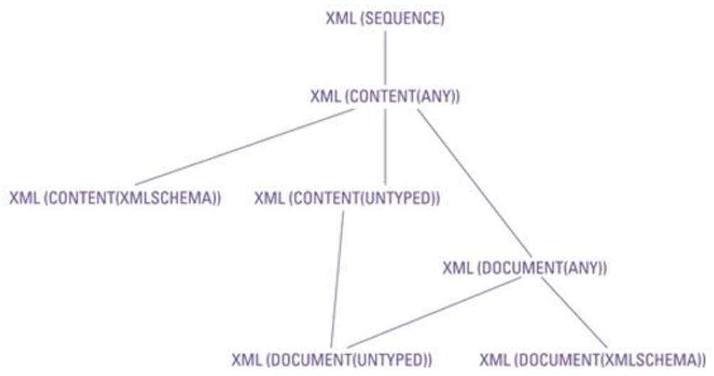
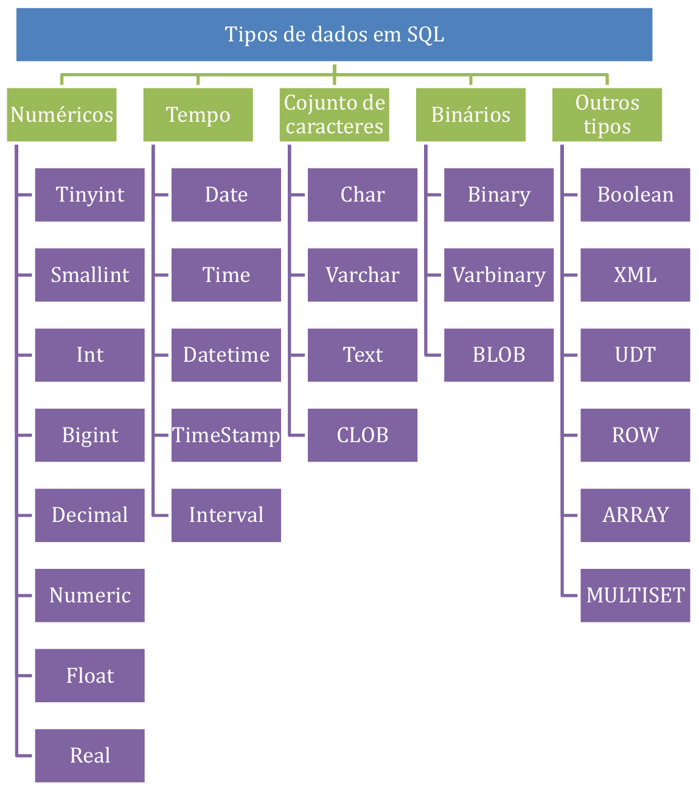
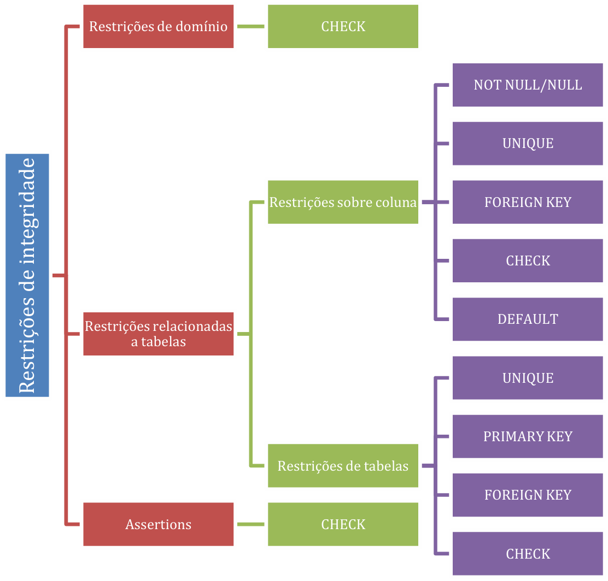
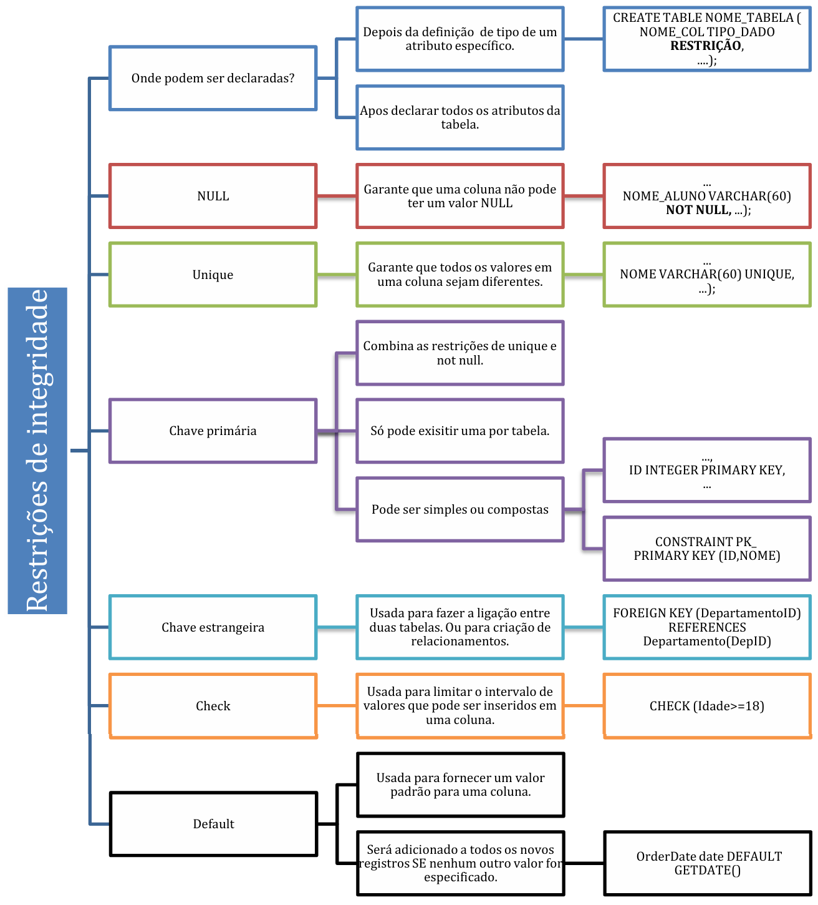

# Capítulo 2 – Linguagem de Definição de Dados (DDL)

Após estabelecermos os fundamentos conceituais e históricos da linguagem SQL, é hora de mergulhar na prática de construir a infraestrutura que armazenará nossos dados. Antes de manipular ou consultar qualquer informação, é preciso definir sua estrutura. Essa é a responsabilidade da **Linguagem de Definição de Dados (DDL)**, o conjunto de comandos SQL que nos permite criar, alterar e remover os objetos que compõem um banco de dados. Este capítulo se dedica a explorar esses comandos, detalhando como dar vida a um modelo de dados, desde a criação do contêiner principal do banco até a definição minuciosa de cada tabela e suas colunas.

## A Arquitetura Lógica: Instâncias, Catálogos e Esquemas

Quando um modelo de dados conceitual é projetado, ele eventualmente precisa ser traduzido para uma implementação física em um SGBD. Essa implementação ocorre dentro de uma hierarquia lógica bem definida. No topo dessa hierarquia, temos a **instância do SGBD**, que é o software do sistema de banco de dados em execução. Uma única instância pode gerenciar múltiplos **bancos de dados** (ou **catálogos**). Cada catálogo, por sua vez, contém uma coleção de **esquemas (schemas)**.

Um esquema pode ser visto como um contêiner ou um espaço de nomes que agrupa objetos de banco de dados relacionados, como tabelas, visões, índices e outros construtores que pertencem a uma mesma aplicação ou a um mesmo domínio de negócio. Essa organização lógica é fundamental para a gestão de ambientes complexos, permitindo separar, por exemplo, os objetos do setor de Recursos Humanos dos objetos do setor Financeiro. Cada esquema é identificado por um nome e geralmente está associado a um usuário ou conta de autorização.

<div align="center">
  
</div>

Dentro de cada catálogo, existe um esquema especial e fundamental, definido pelo padrão SQL: o **INFORMATION_SCHEMA**. Este esquema não armazena dados de negócio, mas sim **metadados**, ou seja, dados sobre os próprios dados. Ele funciona como o **dicionário de dados** do sistema, fornecendo uma descrição detalhada de todos os outros esquemas, tabelas, colunas, restrições e demais objetos definidos no catálogo.

A grande vantagem do `INFORMATION_SCHEMA` é que ele expõe esses metadados através de um conjunto de **visões (views)** somente leitura. Uma visão é uma tabela virtual cujo conteúdo é derivado de uma consulta. Isso significa que é possível usar o próprio comando `SELECT` do SQL para consultar a estrutura do banco de dados. Por exemplo, para descobrir todas as colunas de uma tabela específica, basta fazer uma consulta à visão `COLUMNS` dentro do `INFORMATION_SCHEMA`, filtrando pelo nome da tabela desejada. Essa abordagem padronizada oferece uma maneira poderosa e consistente de inspecionar a arquitetura do banco de dados de forma programática.

Para criar essa estrutura, utiliza-se os comandos DDL. Embora o comando `CREATE DATABASE` não faça parte do padrão SQL ANSI/ISO (que delega a criação do ambiente ao SGBD), ele é uma extensão quase universalmente adotada.

```sql
-- Cria um novo banco de dados (ou catálogo)
CREATE DATABASE nome_do_banco_de_dados;

-- Remove um banco de dados e todos os seus objetos
DROP DATABASE nome_do_banco_de_dados;
```

Uma vez dentro de um banco de dados, podemos criar esquemas para organizar nossos objetos. A criação de esquemas é uma operação privilegiada, normalmente restrita a administradores (DBAs).

```sql
-- Cria um novo esquema
CREATE SCHEMA nome_do_esquema;

-- Remove um esquema e, opcionalmente, todos os objetos contidos nele
DROP SCHEMA nome_do_esquema [ CASCADE | RESTRICT ];
```

A opção `RESTRICT` (padrão) impede a exclusão se o esquema contiver objetos, enquanto `CASCADE` remove o esquema e todos os seus conteúdos.

## Trabalhando com Tabelas: A Estrutura Fundamental

A tabela é o objeto central do modelo relacional, a estrutura onde os dados são efetivamente armazenados. Conforme a definição padrão, uma tabela é uma coleção de linhas, onde cada linha representa uma ocorrência ou uma entidade do mundo real, e todas as linhas seguem a mesma estrutura de colunas. Dois conceitos importantes definem suas dimensões:

- **Grau (Degree):** É o número de colunas (ou atributos) que a tabela possui. O grau define a estrutura da tabela.
- **Cardinalidade (Cardinality):** É o número de linhas (ou tuplas) presentes na tabela em um determinado momento. Uma tabela com cardinalidade zero é chamada de tabela vazia.

<div align="center">
  
</div>

As tabelas em SQL podem ser classificadas em dois tipos principais: **tabelas base** e **tabelas derivadas**.

- **Tabelas Base (Base Tables):** São as tabelas "reais", cujos dados são fisicamente armazenados no banco de dados. Elas podem ser persistentes (o tipo mais comum) ou temporárias (existindo apenas durante uma sessão ou transação).
- **Tabelas Derivadas (Derived Tables):** São tabelas virtuais, cujo conteúdo não é armazenado diretamente, mas sim calculado ou derivado a partir de uma ou mais tabelas base no momento da consulta. O exemplo mais proeminente de uma tabela derivada é uma **visão (view)**, criada com o comando `CREATE VIEW`. Uma visão pode ser atualizável (permitindo operações de `INSERT`, `UPDATE`, `DELETE` que afetam a tabela base subjacente) ou não atualizável. Geralmente, uma visão é atualizável apenas se for baseada em uma única tabela e incluir a chave primária e todas as colunas que não permitem valores nulos e não possuem um valor padrão. Visões que envolvem junções, agrupamentos ou funções de agregação não são atualizáveis.

### Definindo, Modificando e Removendo Tabelas

O ciclo de vida de uma tabela é gerenciado por um conjunto central de comandos DDL.

#### O Comando `CREATE TABLE`

Este é o principal comando da DDL, usado para definir uma nova tabela, especificando seu nome, suas colunas e as restrições de integridade associadas.

**Sintaxe Geral:**

```sql
CREATE TABLE nome_da_tabela (
    nome_coluna1 tipo_de_dado [restrições_da_coluna],
    nome_coluna2 tipo_de_dado [restrições_da_coluna],
    ...
    [restrições_da_tabela]
);
```

**Exemplo Prático:** Vamos criar uma tabela `ALUNO` para armazenar informações de estudantes.

```sql
CREATE TABLE ALUNO (
    NOME VARCHAR(20) NOT NULL,
    CPF INT PRIMARY KEY,
    SEXO CHAR(1) NOT NULL,
    DATA_NASCIMENTO DATE NOT NULL,
    CIDADE VARCHAR(50) NOT NULL,
    VALOR_PAGO INT NOT NULL
);
```

Após a execução deste comando, a estrutura da tabela `ALUNO` existirá no banco de dados, pronta para receber dados.

**Resultado da Criação:**

| NOME | CPF | SEXO | DATA_NASCIMENTO | CIDADE | VALOR_PAGO |
| --- | --- | --- | --- | --- | --- |
| - | - | - | - | - | - |

#### O Comando `ALTER TABLE`

Frequentemente, é necessário modificar a estrutura de uma tabela existente. O comando `ALTER TABLE` permite adicionar, remover ou modificar colunas.

**Sintaxe (Resumida):**

```sql
-- Adicionar uma nova coluna
ALTER TABLE nome_da_tabela ADD COLUMN nome_nova_coluna tipo_de_dado;

-- Remover uma coluna existente
ALTER TABLE nome_da_tabela DROP COLUMN nome_coluna_existente;

-- Modificar o tipo de dado de uma coluna
ALTER TABLE nome_da_tabela ALTER COLUMN nome_coluna_existente SET DATA TYPE novo_tipo_de_dado;
```

A sintaxe exata para modificar colunas pode variar entre os SGBDs (por exemplo, usando `MODIFY COLUMN` em vez de `ALTER COLUMN`).

**Exemplo de Alterações na Tabela `ALUNO`:**

```sql
ALTER TABLE ALUNO ADD COLUMN EMAIL VARCHAR(40);
ALTER TABLE ALUNO DROP COLUMN SEXO;
ALTER TABLE ALUNO ALTER COLUMN VALOR_PAGO TYPE FLOAT; -- Sintaxe do PostgreSQL, pode variar
```

**Estrutura Resultante:**

| NOME | CPF | DATA_NASCIMENTO | CIDADE | VALOR_PAGO | EMAIL |
| --- | --- | --- | --- | --- | --- |
| - | - | - | - | - | - |

#### O Comando `DROP TABLE`

Para remover completamente uma tabela e todos os seus dados, utiliza-se o comando `DROP TABLE`. É uma ação irreversível que apaga a definição da tabela e todo o seu conteúdo.

**Sintaxe:**

```sql
DROP TABLE nome_da_tabela;
```

**Exemplo:**

```sql
DROP TABLE ALUNO;
```

### Resumo dos Principais Comandos DDL

Os comandos da Linguagem de Definição de Dados são a base para a criação e manutenção da arquitetura de um banco de dados relacional.

|Comando|Descrição|
|---|---|
|**`CREATE`**|Utilizado para criar novos objetos de banco de dados, como `DATABASE`, `SCHEMA`, `TABLE`, `VIEW`, `INDEX`.|
|**`DROP`**|Utilizado para excluir permanentemente um objeto do banco de dados e todos os dados associados a ele.|
|**`ALTER`**|Utilizado para modificar a estrutura de um objeto existente, como adicionar, remover ou alterar colunas de uma tabela.|
|**`TRUNCATE`**|Utilizado para remover rapidamente todas as linhas de uma tabela, mantendo sua estrutura. Geralmente é mais rápido que um `DELETE` sem cláusula `WHERE`, pois não registra as exclusões linha a linha.|
|**`RENAME`**|Utilizado para renomear um objeto, como uma tabela. É uma extensão comum, não presente em todas as versões do padrão SQL.|

<div align="center">
  
</div>

Com o conhecimento de como criar e gerenciar a estrutura das tabelas, o próximo passo crucial é entender os diferentes tipos de dados que podemos atribuir a cada coluna, garantindo que as informações sejam armazenadas de forma correta e eficiente. Para entendermos melhor como escolher os tipos de dados das nossas colunas, passaremos, a seguir, a analisar os principais tipos de dados de SQL e suas peculiaridades.

## Tipos de Dados em SQL

A escolha correta do tipo de dado para cada coluna de uma tabela é uma decisão fundamental no projeto de um banco de dados. Essa escolha não apenas garante a integridade dos dados, forçando que apenas valores válidos sejam armazenados, mas também impacta diretamente o desempenho e o uso de espaço em disco. O padrão SQL define um rico conjunto de tipos de dados pré-definidos, que podem ser agrupados em categorias como texto, numéricos, binários, data/hora e outros tipos mais especializados.

### Tipos de Dados de Caracteres (Texto)

Os tipos de dados para armazenar texto, ou cadeias de caracteres, são talvez os mais comuns em qualquer banco de dados. O padrão SQL os divide principalmente com base no tamanho ser fixo ou variável.

- **`CHARACTER(n)` ou `CHAR(n)`:** Define uma cadeia de caracteres de **tamanho fixo**. O `n` especifica o número exato de caracteres que a coluna armazenará. Se um valor inserido for menor que `n`, o SGBD completará o restante com espaços em branco até atingir o tamanho definido. `CHAR` é ideal para dados que sempre têm o mesmo tamanho, como siglas de estados (`UF CHAR(2)`), códigos de produtos ou números de CPF formatados. O uso de `CHAR` pode oferecer um leve ganho de desempenho em algumas operações, pois o SGBD sabe exatamente onde cada registro termina e o próximo começa. Por exemplo, em uma coluna `CODIGO_PRODUTO CHAR(10)`, o valor `'PROD-01'` (7 caracteres) seria armazenado como `'PROD-01 '` (com 3 espaços adicionais).
- **`CHARACTER VARYING(n)` ou `VARCHAR(n)`:** Define uma cadeia de caracteres de **tamanho variável**, com um comprimento máximo de `n`. Diferente do `CHAR`, o `VARCHAR` armazena apenas os caracteres inseridos, sem adicionar espaços. Isso resulta em um uso de armazenamento mais eficiente para dados cujo comprimento varia significativamente, como nomes de pessoas, endereços ou descrições. Essa flexibilidade, no entanto, pode implicar uma pequena sobrecarga de processamento, pois o SGBD precisa armazenar o comprimento de cada valor. Por exemplo, em uma coluna `NOME VARCHAR(60)`, o valor `'Ana'` ocuparia o espaço de 3 caracteres, enquanto `'Alexandrina'` ocuparia o espaço de 11 caracteres.
- **`CHARACTER LARGE OBJECT` ou `CLOB`:** Introduzido no padrão SQL:1999, o tipo `CLOB` é projetado para armazenar objetos de caracteres muito grandes, como o conteúdo de um livro, um artigo de blog ou um documento de texto longo, que excederiam o limite máximo de um `VARCHAR` (que varia entre SGBDs, mas é tipicamente de milhares de caracteres). Devido ao seu tamanho potencial, os `CLOB`s possuem algumas restrições; por exemplo, não podem ser usados como chaves primárias ou em restrições `UNIQUE`.

<div align="center">
  
</div>

Para lidar com a internacionalização e a necessidade de armazenar texto em diferentes idiomas, o SQL oferece variantes "nacionais" desses tipos: `NATIONAL CHARACTER` (`NCHAR`), `NATIONAL CHARACTER VARYING` (`NVARCHAR`) e `NATIONAL CHARACTER LARGE OBJECT` (`NCLOB`). A principal diferença é que esses tipos utilizam um conjunto de caracteres (character set) pré-definido no sistema como "nacional" (frequentemente um padrão Unicode como UTF-8 ou UTF-16), permitindo o armazenamento de caracteres de múltiplos idiomas. É possível, inclusive, especificar um conjunto de caracteres diferente para cada coluna.

```sql
CREATE TABLE IDIOMAS (
    IDIOMA_PADRAO CHARACTER(40),
    IDIOMA_GREGO CHARACTER VARYING(40) CHARACTER SET GREEK,
    IDIOMA_NACIONAL NATIONAL CHARACTER(40),
    IDIOMA_JAPONES CHARACTER(40) CHARACTER SET KANJI
);
```

### Tipos de Dados de Strings Binárias

Enquanto os tipos de caracteres são feitos para armazenar texto legível, as strings binárias são sequências de bytes usadas para armazenar dados não-textuais, como imagens, arquivos de áudio, vídeos, PDFs ou executáveis de programas. Até o SQL:2003, esses tipos eram representados por `BIT` e `BIT VARYING`, que ainda são mantidos em alguns SGBDs como o PostgreSQL. O padrão mais moderno, a partir do SQL:2008, formalizou os seguintes tipos:

- **`BINARY(n)`:** Semelhante ao `CHAR`, define uma sequência de bytes de **tamanho fixo** de `n` bytes (ou octetos). Se uma coluna for `FOTO_PERFIL BINARY(16)`, ela sempre ocupará 16 bytes.
- **`BINARY VARYING(n)` ou `VARBINARY(n)`:** Semelhante ao `VARCHAR`, define uma sequência de bytes de **tamanho variável**, com um máximo de `n` bytes. Uma coluna `DOCUMENTO VARBINARY(20)` pode armazenar um arquivo de 5 bytes ou de 20 bytes.
- **`BINARY LARGE OBJECT` ou `BLOB`:** O análogo binário do `CLOB`, usado para armazenar objetos binários muito grandes. Assim como os `CLOB`s, os `BLOB`s não podem ser usados em chaves ou na maioria das comparações, exceto igualdade/desigualdade.

<div align="center">
  
</div>

### Tipos de Dados Numéricos

Vamos, agora, tratar dos tipos de dados numéricos. A escolha correta do tipo numérico é vital para garantir a precisão dos cálculos e a eficiência do armazenamento. Eles são divididos em duas grandes categorias: **números exatos (exact numbers)**, para valores que não podem ter nenhuma variação, e **números aproximados (approximate numbers)**, para medições onde um certo grau de imprecisão é aceitável.

#### Números Exatos (Ponto Fixo e Inteiros)

Os números exatos são utilizados quando cada dígito tem importância fundamental. Eles podem ser números inteiros, usados para contagens de itens indivisíveis (lápis, pessoas ou planetas), ou números de ponto fixo, que possuem casas decimais e são ideais para valores monetários (preços, salários), medidas precisas (pesos) ou percentuais.

Os tipos padrão para números exatos com casas decimais são `NUMERIC` e `DECIMAL`. Ao definir uma coluna com um desses tipos, especificamos sua **precisão** e **escala**:

- **Precisão (p):** Determina o número total máximo de dígitos decimais que podem ser armazenados (tanto à esquerda quanto à direita do ponto decimal).
- **Escala (s):** Especifica o número máximo de casas decimais permitidas (os dígitos à direita do ponto decimal).

A sintaxe é `NUMERIC(p, s)` ou `DECIMAL(p, s)`. Por exemplo, `DECIMAL(10, 2)` é uma escolha comum para valores monetários, permitindo até `99.999.999,99`. Se a escala for omitida, ela é considerada zero, transformando o tipo em um inteiro.

Vejamos o exemplo do número `235,89` para entender como diferentes especificações afetam o valor armazenado. Note que o SGBD arredonda o valor quando a escala especificada é menor que a do valor inserido.

|Especificação|Valor Armazenado|Explicação|
|---|---|---|
|`NUMERIC(5, 2)`|`235.89`|A precisão e a escala são exatas para o valor.|
|`NUMERIC(5, 1)`|`235.9`|A escala é 1, então o valor é arredondado para uma casa decimal.|
|`NUMERIC(5)` ou `NUMERIC(5, 0)`|`236`|A escala é 0, então o valor é arredondado para o inteiro mais próximo.|
|`NUMERIC(4, 1)`|`235.9`|A precisão de 4 dígitos é suficiente para `235.9`.|
|`NUMERIC(4, 2)`|Erro|O valor `235.89` requer 5 dígitos de precisão, mas apenas 4 foram permitidos.|
|`NUMERIC(2, 0)`|Erro|O valor `236` (após arredondamento) requer 3 dígitos, excedendo a precisão de 2.|

Para números inteiros, o SQL oferece tipos otimizados que consomem diferentes quantidades de espaço de armazenamento, impactando a faixa de valores que podem representar:

- **`SMALLINT`**: Ideal para números pequenos, como a idade de uma pessoa, o número de itens em um pedido ou a quantidade de portas em um carro. Ocupa apenas 2 bytes.
- **`INTEGER`** ou **`INT`**: O tipo de inteiro de uso geral, adequado para a maioria das necessidades, como identificadores de registros (IDs) em tabelas de médio porte ou contagens de visualizações. Ocupa 4 bytes.
- **`BIGINT`**: Usado para números inteiros muito grandes, como o ID de uma transação em um sistema financeiro global, o número de milissegundos desde a época Unix, ou o ID de um post em uma rede social com bilhões de usuários. Ocupa 8 bytes.

#### Números Aproximados (Ponto Flutuante)

Os números de pontos flutuantes ou aproximados são usados para representar valores que não podem, ou não precisam, ser representados com precisão absoluta, como medições científicas ou dados estatísticos. Eles são armazenados em um formato binário que pode representar uma gama muito maior de valores (números muito grandes ou muito próximos de zero) do que os tipos exatos, mas ao custo de uma pequena perda de precisão.

O tipo de dado principal é o `FLOAT(p)`, onde `p` indica a **precisão binária** (o número de bits usados para armazenar a mantissa do número). Os tipos `REAL` e `DOUBLE PRECISION` são atalhos para implementações de `FLOAT` com precisão simples e dupla, respectivamente.

Vamos analisar o exemplo do saldo em uma conta, no valor de R$ 116.456,23, em uma coluna `FLOAT(20)`.

1. **Parte Inteira**: O número `116456` em decimal equivale a `11100011011101000` em binário, que utiliza **17 bits**.
2. **Bits Restantes**: A coluna foi definida com `FLOAT(20)`. Após usar 17 bits para a parte inteira, restam apenas **3 bits** para a parte fracionária.
3. **Parte Fracionária**: O valor `0,23` em decimal equivale a `0.0011101...` em binário. Para representar `23`, precisaríamos de 5 bits (`10111`).
4. **Arredondamento**: Como não há espaço para `10111` (5 bits) nos 3 bits restantes, o SGBD arredonda o valor para o que pode ser representado. Ele pode, por exemplo, armazenar o valor `0,2`, que em binário pode ser representado com menos bits. O valor final armazenado seria uma aproximação, como `116.456,2`.

Essa imprecisão, embora pequena, torna os tipos de ponto flutuante inadequados para cálculos financeiros, onde cada centavo conta. Para esses casos, **sempre** use `DECIMAL` ou `NUMERIC`.

#### Comparativo entre SGBDs

Os tipos de dados numéricos estão disponíveis em todos os SGBDs relacionais, mas podem ter nomes diferentes. A tabela abaixo relaciona os tipos padrão do SQL ANSI com as implementações dos populares Oracle e MySQL.

|ANSI SQL DATA TYPE|ORACLE DATA TYPE|MYSQL DATA TYPE|Comentários|
|---|---|---|---|
|`NUMERIC(p,s)`<br>`DECIMAL(p,s)`<br>`DECFLOAT`|`NUMBER(p,s)`|`DECIMAL(p,d)`<br>`DEC(p,d)`|`NUMBER` no Oracle é um tipo extremamente versátil, usado para ponto fixo e flutuante.|
|`INTEGER`<br>`INT`<br>`SMALLINT`<br>`BIGINT`|`NUMBER(p,0)`<br>`NUMBER(p)`|`TINYINT`<br>`SMALLINT`<br>`MEDIUMINT`<br>`INTEGER`<br>`INT`<br>`BIGINT`|MySQL oferece mais granularidade para inteiros, como `TINYINT` e `MEDIUMINT`.|
|`FLOAT(p)`<br>`REAL`<br>`DOUBLE PRECISION`|`FLOAT(p)`<br>`BINARY_FLOAT`<br>`BINARY_DOUBLE`|`FLOAT(p)`<br>`FLOAT(size,d)`<br>`DOUBLE`|Oracle possui tipos específicos (`BINARY_FLOAT`/`DOUBLE`) que seguem o padrão IEEE 754 para ponto flutuante.|

Para concluir, a tabela abaixo resume o espaço de armazenamento e a faixa de valores para os tipos numéricos mais comuns.

|Tipo de dado|Tamanho em Bytes|Range (Faixa de Valores)|
|---|---|---|
|`SMALLINT`|2|-32.768 a 32.767|
|`INTEGER`|4|-2.147.483.648 a +2.147.483.647|
|`BIGINT`|8|-9.223.372.036.854.775.808 a +9.223.372.036.854.775.807|
|`REAL`|4|-3,40E+38 a -1,18E-38, 0 e 1,18E-38 a 3,40E+38|
|`FLOAT` / `DOUBLE PRECISION`|8|-1,79E+308 a -2,23E-308, 0 e 2,23E-308 a 1,79E+308|

### Tipos de Dados Temporais (DATETIME E INTERVAL)

As horas e a data são informações cruciais e precisam ser armazenadas com frequência nos bancos de dados. O padrão SQL fornece um conjunto robusto de tipos para lidar com informações temporais.

- **`DATE`**: Armazena uma data, consistindo em três elementos: ano, mês e dia (ex: `2025-12-31`). O ano é um número de quatro dígitos que permite valores de `0001` a `9999`. O mês vai de `01` a `12`, e o dia de `01` a `31`, respeitando as regras do calendário gregoriano.
- **`TIME`**: Armazena uma hora do dia, consistindo das partes hora (`00` a `23`), minuto (`00` a `59`) e segundo (`00` a `59`). Pode incluir frações de segundo com uma precisão definida (ex: `14:30:55.123`).
- **`TIMESTAMP`**: É a combinação de `DATE` e `TIME` em um único tipo, representando um ponto exato no tempo. É extremamente útil para registrar quando um evento ocorreu (ex: `2025-12-31 23:59:59.999`).
    - **`TIMESTAMP WITH TIME ZONE`**: Uma variante essencial para aplicações globais. Além da data e hora, armazena a informação do fuso horário (o deslocamento em relação ao Tempo Universal Coordenado - UTC). Isso garante que o ponto no tempo seja inequívoco, não importa onde o usuário ou o servidor esteja localizado.
- **`INTERVAL`**: Diferente dos outros, não representa um ponto no tempo, mas sim uma **duração** ou um período. É usado para realizar cálculos com datas e horas. Por exemplo, para encontrar todos os clientes que fizeram uma compra nos últimos 30 dias, poderíamos usar `CURRENT_DATE - INTERVAL '30' DAY`.

Vejamos um exemplo de criação de uma tabela cujas colunas são dos tipos temporais.

```sql
CREATE TABLE tempo (
  id DECIMAL PRIMARY KEY,
  col1 DATE,                      -- Armazena ano, mês e dia (ex: '2024-07-10')
  col2 TIME,                      -- Armazena hora, minuto e segundos (ex: '15:45:00')
  col3 TIMESTAMP(9),              -- Armazena um timestamp com precisão de nanossegundos
  col4 TIMESTAMP WITH TIME ZONE   -- Exemplo de timestamp com fuso horário (ex: '2024-07-10 12:00:00-03:00')
);
```

### Tipos de Dados BOOLEAN E XML

O tipo de dados `BOOLEAN` consiste na verdade dos valores distintos, verdadeiro e falso, assim como o valor desconhecido. **XML** é um acrônimo para **eXtensible Markup Language**, que define um conjunto de regras para a adição de marcação aos dados. Em detalhes:

- **`BOOLEAN`**: Um tipo de dado lógico que, no padrão SQL, pode ter três valores: `TRUE`, `FALSE` e `UNKNOWN`. O valor `UNKNOWN` é o resultado de qualquer operação lógica envolvendo `NULL`, refletindo a ideia de que "se um valor é desconhecido, o resultado da comparação também é desconhecido".
- **`XML`**: Um tipo de dados `XML` que permite armazenar documentos ou fragmentos XML diretamente em uma coluna do banco de dados. Isso é poderoso para integrar aplicações que se comunicam via XML ou para armazenar dados semiestruturados que não se encaixam bem no modelo relacional rígido.
    - O tipo `XML` tem uma estrutura de árvore, com um nó raiz, nós filhos, e assim por diante.
    - Pode-se associar um **`XMLSchema`** a uma coluna `XML`. Um `XMLSchema` é um arquivo que define a estrutura e as regras de um documento XML válido (quais tags são permitidas, sua ordem, tipos de dados, etc.). Quando um `XMLSchema` é associado, o SGBD valida cada documento XML inserido ou atualizado, garantindo a integridade dos dados.
    - Os modificadores primários `SEQUENCE`, `CONTENT` e `DOCUMENT` e os secundários `UNTYPED`, `ANY` e `XMLSCHEMA` ajudam a refinar como o conteúdo XML é tratado e validado.

Vejamos exemplos de criação de tabelas com colunas do tipo `XML`:

```sql
-- Criação simples de uma coluna XML
CREATE TABLE T1 (
  Col1 int primary key,
  Col2 xml
);

-- Criação com validação por um XMLSCHEMA
CREATE TABLE XMLEXEMPLO (
  ID INT NOT NULL,
  CONTENT XML(XMLSCHEMA ID 'meu_schema' LOCATION 'http://www.example.com/Example.xsd')
);
```

A figura abaixo ilustra a estrutura hierárquica dos subtipos XML, onde uma sequência pode conter vários itens, que podem ser documentos ou valores atômicos.

<div align="center">
  
</div>

Por fim, é importante lembrar que o valor **`NULL`** é membro de todos os tipos de domínios. Ele representa a ausência de um valor. Se você declarar o domínio de um atributo como `NOT NULL`, o SGBD vai proibir a inserção de valores nulos para essa coluna.

### Tipos de Dados Estruturados

Além dos tipos predefinidos, o padrão SQL moderno (a partir do SQL:1999) introduziu tipos que permitem criar estruturas de dados mais complexas, aproximando o banco de dados dos paradigmas de programação orientada a objetos.

#### Tipos `ROW`

O tipo de dados de linha (`ROW`) permite que uma única coluna de uma tabela contenha uma estrutura de linha inteira, ou seja, um conjunto de campos nomeados. Isso viola a Primeira Forma Normal (1FN) da teoria relacional, que afirma que todos os valores de coluna devem ser atômicos (indivisíveis). No entanto, o tipo `ROW` oferece uma maneira pragmática de agrupar dados fortemente relacionados.

Considere a seguinte instrução SQL, que define um tipo `ROW` para informações sobre o endereço de uma pessoa:

```sql
CREATE ROW TYPE addr_typ AS (
  Rua CHARACTER VARYING(25),
  Cidade CHARACTER VARYING(20),
  Estado CHARACTER(2),
  CEP CHARACTER VARYING(9)
);
```

Depois que ele é definido, o novo tipo de linha pode ser usado em uma definição de tabela:

```sql
CREATE TABLE CLIENTE (
  ClienteID INTEGER PRIMARY KEY,
  PrimeiroNome CHARACTER VARYING(25),
  UltimoNome CHARACTER VARYING(20),
  Endereco addr_typ,
  Telefone CHARACTER VARYING(15)
);
```

A vantagem aqui é a **reutilização**. Se você precisa armazenar informações de endereço para clientes, fornecedores e colaboradores, você define a estrutura `addr_typ` apenas uma vez e a reutiliza em várias tabelas, garantindo consistência.

#### Tipos de Coleção (`ARRAY` e `MULTISET`)

Seguindo a tendência de flexibilizar o modelo relacional, os tipos de coleção permitem que um único campo armazene múltiplos valores.

- **`ARRAY`**: Uma coleção **ordenada** de elementos de um mesmo tipo. Útil para armazenar uma lista de valores onde a ordem importa, como os números de telefone de um cliente em ordem de preferência.
- **`MULTISET`**: Uma coleção **não ordenada** de elementos que permite duplicatas. Poderia ser usado para armazenar as tags associadas a um post de blog, onde a ordem não é relevante.

Esses tipos também violam a 1FN, mas oferecem flexibilidade para modelar atributos multivalorados sem a necessidade de criar uma tabela de junção separada, o que pode simplificar certas consultas.

#### Tipos Definidos pelo Usuário (UDT – User-Defined Types)

Os Tipos Definidos pelo Usuário (UDTs) representam a maior aproximação do SQL ao mundo da programação orientada a objetos. Com UDTs, você pode definir seus próprios tipos de dados, encapsulando **atributos** (dados) e **métodos** (comportamento).

Um dos benefícios mais importantes dos UDTs é a capacidade de diminuir a **"diferença de impedância" (impedance mismatch)** entre o banco de dados e a linguagem da aplicação (como Java, C#, Python). Frequentemente, os tipos de dados da linguagem de programação (objetos complexos) não correspondem diretamente aos tipos do SQL (tabelas planas). UDTs permitem criar tipos no banco que espelham os objetos da aplicação, facilitando o mapeamento entre os dois mundos.

Um UDT encapsula seus dados. O mundo exterior pode ver as definições dos atributos e os resultados dos métodos, mas a implementação interna fica escondida. O acesso pode ser controlado como `PUBLIC`, `PRIVATE` ou `PROTECTED`.

Vejamos um exemplo de um UDT simples:

```sql
CREATE TYPE livro_udt AS (
  titulo CHAR(40),
  precodecompra DECIMAL(9,2),
  ISBN VARCHAR(40)
);
```

Este UDT `livro_udt` agrupa as informações de um livro e pode agora ser usado como o tipo de uma coluna em uma tabela.

Abaixo está um esquema simplificado que resume a hierarquia dos tipos de dados em SQL.

<div align="center">
  
</div>

Agora que vimos os tipos de dados, vamos passar rapidamente pelas possíveis restrições de integridade que compõem o padrão SQL e vão fazer parte dos comandos de criação de tabelas.

## Restrições de Integridade: Garantindo a Qualidade dos Dados

Definir a estrutura de uma tabela com suas colunas e tipos de dados é apenas o primeiro passo. Para que um banco de dados seja confiável, é preciso garantir que os dados armazenados nele sejam válidos, consistentes e sigam as regras de negócio da aplicação. Essa é a função das **restrições de integridade (constraints)**. Elas são regras declaradas no esquema do banco de dados que o SGBD impõe automaticamente, prevenindo a inserção de dados inválidos.

As restrições de integridade em SQL podem ser agrupadas em três categorias principais, com base em onde e como são definidas:

- **Restrições de Tabela (e de Coluna):** São definidas diretamente dentro do comando `CREATE TABLE` ou adicionadas posteriormente com `ALTER TABLE`. Podem ser aplicadas a uma única coluna (restrição de coluna) ou a um conjunto de colunas (restrição de tabela).
- **Assertions (Afirmações):** São restrições mais gerais, definidas como objetos de esquema independentes com `CREATE ASSERTION`. Elas podem envolver múltiplas tabelas e impor regras complexas que não se limitam a uma única tabela.
- **Restrições de Domínio:** São definidas com `CREATE DOMAIN`, criando um tipo de dado personalizado que já embute uma restrição. Qualquer coluna que utilize esse domínio herdará automaticamente a restrição.

<div align="center">
  
</div>

### Restrições Fundamentais em Tabelas

Vamos explorar as restrições mais comuns, que são declaradas no nível da tabela.

- **`PRIMARY KEY` (Chave Primária):** Esta é a restrição mais importante. Ela designa uma ou mais colunas cujo valor deve identificar unicamente cada linha da tabela. Uma chave primária impõe duas regras implicitamente: os valores na(s) coluna(s) não podem ser nulos (`NOT NULL`) e não podem ter duplicatas (`UNIQUE`). Uma tabela pode ter apenas uma chave primária.
    - **Chave Primária Simples:** Quando a chave é composta por uma única coluna, a restrição pode ser declarada na própria linha da coluna.
        
        ```sql
        CREATE TABLE DEPARTAMENTO (
            DNumero INT PRIMARY KEY,
            DNome VARCHAR(50) NOT NULL UNIQUE
        );
        ```
        
    - **Chave Primária Composta:** Quando a chave é formada por duas ou mais colunas, ela deve ser declarada no final da definição da tabela.
        
        ```sql
        CREATE TABLE PROJETO_EMPREGADO (
            CPF_Empregado CHAR(11),
            Num_Projeto INT,
            Horas_Trabalhadas DECIMAL(5,1),
            PRIMARY KEY (CPF_Empregado, Num_Projeto)
        );
        ```
        
- **`FOREIGN KEY` (Chave Estrangeira):** Esta restrição cria um vínculo entre duas tabelas, garantindo a **integridade referencial**. Ela especifica que os valores em uma coluna (ou conjunto de colunas) de uma tabela (a tabela "filha") devem corresponder a valores existentes na chave primária de outra tabela (a tabela "pai"). Isso impede a criação de registros "órfãos". Ao definir uma chave estrangeira, é possível especificar **ações referenciais** (`ON DELETE` e `ON UPDATE`) que determinam o que o SGBD deve fazer na tabela filha quando um registro correspondente na tabela pai é excluído ou atualizado.
    
    - `CASCADE`: A mesma ação (exclusão ou atualização) é propagada para os registros filhos.
    - `SET NULL`: As colunas da chave estrangeira nos registros filhos são definidas como `NULL`.
    - `SET DEFAULT`: As colunas da chave estrangeira nos registros filhos são definidas com seu valor padrão (`DEFAULT`).
    - `RESTRICT` / `NO ACTION` (comportamento padrão): A operação na tabela pai é rejeitada se houver registros filhos correspondentes.
    
    ```sql
    CREATE TABLE EMPREGADO (
        SSN CHAR(11) PRIMARY KEY,
        Nome VARCHAR(100),
        Super_SSN CHAR(11),
        DNumero INT,
        CONSTRAINT EMPSUPERFK
            FOREIGN KEY (Super_SSN) REFERENCES EMPREGADO(SSN)
            ON DELETE SET NULL
            ON UPDATE CASCADE,
        CONSTRAINT EMPDEPTFK
            FOREIGN KEY (DNumero) REFERENCES DEPARTAMENTO(DNumero)
            ON DELETE SET DEFAULT
            ON UPDATE CASCADE
    );
    ```
    
- **`NOT NULL`:** A restrição mais simples. Garante que uma coluna não pode conter valores `NULL`. É essencial para campos obrigatórios.
- **`UNIQUE`:** Garante que todos os valores em uma coluna (ou conjunto de colunas) sejam únicos. Diferente da `PRIMARY KEY`, uma tabela pode ter múltiplas restrições `UNIQUE`, e elas permitem valores `NULL` (geralmente, apenas um valor nulo é permitido, mas isso pode variar entre SGBDs).
- **`DEFAULT`:** Especifica um valor padrão para uma coluna. Se uma nova linha for inserida sem um valor para essa coluna, o SGBD usará o valor `DEFAULT` automaticamente.
    
    ```sql
    CREATE TABLE PEDIDO (
        ID_Pedido INT PRIMARY KEY,
        Data_Pedido DATE DEFAULT CURRENT_DATE, -- Usa a data atual como padrão
        Status VARCHAR(20) DEFAULT 'Pendente'
    );
    ```
    
- **`CHECK`:** A restrição mais flexível. Permite definir uma condição de busca (uma expressão booleana) que deve ser verdadeira para qualquer valor inserido ou atualizado na coluna. É usada para impor regras de negócio complexas que não são cobertas pelas outras restrições.
    - **Sintaxe de Coluna:** `nome_coluna tipo_dado CHECK (condição)`
    - **Sintaxe de Tabela:** `CONSTRAINT nome_restricao CHECK (condição)`
    
    ```sql
    CREATE TABLE PRODUTO (
        ID_Produto INT PRIMARY KEY,
        Nome VARCHAR(100),
        Preco DECIMAL(10, 2) CHECK (Preco > 0),
        Estoque INT DEFAULT 0,
        Categoria VARCHAR(30) CHECK (Categoria IN ('Eletrônicos', 'Vestuário', 'Alimentos')),
        CONSTRAINT chk_estoque_positivo CHECK (Estoque >= 0)
    );
    ```

<div align="center">
  
</div>

## Considerações Finais

Neste capítulo, exploramos em profundidade a **Linguagem de Definição de Dados (DDL)**, o alicerce sobre o qual todos os bancos de dados relacionais são construídos. Vimos como a arquitetura lógica de um SGBD é organizada em uma hierarquia de catálogos e esquemas, fornecendo um ambiente estruturado para a criação de objetos de banco de dados.

Dominamos os comandos essenciais da DDL: `CREATE`, `ALTER` e `DROP`, que nos dão o poder de definir, modificar e remover a estrutura das tabelas. Aprofundamos o conhecimento sobre a importância crucial da seleção dos **tipos de dados** corretos para cada coluna, uma decisão que afeta diretamente a integridade, o desempenho e o armazenamento. Analisamos desde os tipos básicos, como `VARCHAR` e `INTEGER`, até tipos mais complexos e especializados, como `BLOB`, `TIMESTAMP WITH TIME ZONE` e os tipos estruturados como `ROW` e `UDT`.

Finalmente, aprendemos a ir além da simples definição estrutural, aplicando **restrições de integridade**. Vimos como `PRIMARY KEY`, `FOREIGN KEY`, `UNIQUE`, `NOT NULL` e `CHECK` não são apenas opções, mas mecanismos essenciais para impor as regras de negócio diretamente no banco de dados, garantindo que os dados permaneçam válidos, consistentes e confiáveis. Com a estrutura devidamente definida e protegida, estamos prontos para o próximo passo: popular e interagir com os dados usando a Linguagem de Manipulação de Dados (DML).