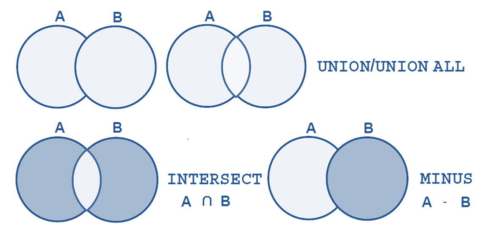

# Capítulo 3 – Linguagem de Manipulação de Dados (DML)

Após a dedicação à construção da arquitetura do banco de dados no capítulo anterior, onde exploramos a Linguagem de Definição de Dados (DDL) para criar e gerenciar tabelas e suas estruturas, a jornada nos leva ao próximo passo lógico: a interação com os dados que residem nessas estruturas. De nada adianta ter um esquema bem projetado e robusto se não for possível popular, consultar, modificar e remover as informações armazenadas. Essa é precisamente a esfera de atuação da **Linguagem de Manipulação de Dados (DML)**, o coração funcional de qualquer sistema de banco de dados.

A DML compreende o conjunto de comandos SQL projetados para interagir diretamente com os registros (as linhas) das tabelas. Enquanto a DDL se ocupa com os "contêineres" dos dados, a DML se concentra no "conteúdo". É por meio desses comandos que as aplicações realizam suas operações fundamentais, desde registrar um novo cliente e atualizar o estoque de um produto, até consultar o histórico de vendas de um determinado período. O domínio da DML é, portanto, a habilidade mais frequentemente utilizada por desenvolvedores, analistas de dados e administradores no dia a dia.

Existem quatro comandos que formam o núcleo da DML, e sua implementação é um pilar fundamental em todos os SGBDs relacionais. O comando `SELECT`, devido à sua vasta gama de funcionalidades e complexidade, é frequentemente tratado em uma subcategoria própria, a DQL (Data Query Language), mas sua origem e função o inserem conceitualmente na DML. Os outros três comandos (`INSERT`, `UPDATE` e `DELETE`) são responsáveis pela modificação dos dados.

|COMANDO|DESCRIÇÃO|
|---|---|
|**`SELECT`**|Comando utilizado para realizar consultas a dados de uma ou mais tabelas do banco de dados.|
|**`INSERT`**|Comando utilizado para inserir um ou mais registros em uma tabela do banco de dados.|
|**`UPDATE`**|Comando utilizado para modificar valores de dados em registros existentes de uma tabela.|
|**`DELETE`**|Comando utilizado para remover registros (linhas) existentes de uma tabela do banco de dados.|

Este capítulo se dedicará a explorar cada um desses comandos em detalhe, com foco especial na imensa capacidade do comando `SELECT` para extrair inteligência dos dados brutos.

## O Comando SELECT: A Base da Consulta de Dados

A instrução `SELECT` é, sem dúvida, o comando mais poderoso e flexível da linguagem SQL. Ela permite construir consultas que variam de uma simples extração de todos os dados de uma tabela a operações extremamente complexas, envolvendo múltiplas tabelas, filtros, agregações e ordenações para retornar precisamente o conjunto de dados desejado. A sintaxe básica do comando `SELECT` é composta por diversas cláusulas, sendo que apenas `SELECT` e `FROM` são mandatórias.

**Sintaxe Geral:**

```sql
SELECT [ DISTINCT | ALL ] { * | <lista_de_selecao> }
FROM <referencia_de_tabela> [{, <referencia_de_tabela>}...]
[ WHERE <condicao_de_busca> ]
[ GROUP BY <especificacao_de_agrupamento> ]
[ HAVING <condicao_de_busca_de_grupo> ]
[ ORDER BY <condicao_de_ordenacao> ];
```

É fundamental compreender que o comando `SELECT` possui uma forte correspondência com as operações da **álgebra relacional**, a base teórica para o modelo relacional:

- A lista de colunas especificada na cláusula `SELECT` corresponde à operação de **Projeção (π)**, que seleciona um subconjunto de atributos (colunas) da relação.
- A condição de busca na cláusula `WHERE` corresponde à operação de **Seleção (σ)**, que filtra as tuplas (linhas) que satisfazem a um determinado predicado.
- A listagem de múltiplas tabelas na cláusula `FROM` (ex: `FROM TabelaA, TabelaB`) resulta em uma operação de **Produto Cartesiano (×)**, que combina cada linha da primeira tabela com cada linha da segunda.

Uma das primeiras decisões em uma consulta é definir quais colunas retornar. O asterisco (`*`) é um atalho para selecionar **todas as colunas** das tabelas listadas na cláusula `FROM`. Para retornar todas as linhas, basta omitir a cláusula `WHERE`. A combinação de `SELECT *` com a ausência de `WHERE` resulta na extração de todo o conteúdo da tabela.

**Exemplo:** Consultar todas as colunas e todas as linhas da tabela `EMPREGADOS`.

```sql
SELECT *
FROM EMPREGADOS;
```

### Ordem Lógica de Processamento das Cláusulas

Embora as cláusulas sejam escritas em uma ordem específica (`SELECT`, `FROM`, `WHERE`...), o SGBD as processa em uma sequência lógica diferente. Compreender essa ordem é crucial para escrever consultas complexas e evitar erros comuns.

1. **`FROM`**: O primeiro passo do SGBD é identificar as tabelas de origem e processar as junções entre elas. Nesta fase, ele constrói um conjunto de dados intermediário, que pode ser um produto cartesiano se as junções não forem bem especificadas.
2. **`WHERE`**: Em seguida, o SGBD aplica as condições de filtro da cláusula `WHERE` ao conjunto de dados intermediário. Linhas que não satisfazem à condição são descartadas.
3. **`GROUP BY`**: Se presente, o SGBD agrupa as linhas restantes com base nos valores das colunas especificadas na cláusula `GROUP BY`. O resultado é um conjunto de grupos de linhas.
4. **`HAVING`**: Após o agrupamento, a cláusula `HAVING` é aplicada para filtrar os próprios **grupos**. Apenas os grupos que satisfazem à condição do `HAVING` permanecem.
5. **`SELECT`**: Só então o SGBD processa a lista de seleção, calculando as expressões, funções de agregação (como `SUM`, `COUNT`) e determinando as colunas finais que farão parte do resultado. 
6. **`ORDER BY`**: Por último, se a cláusula `ORDER BY` for especificada, o conjunto de resultados final é ordenado de acordo com as colunas ou expressões indicadas.

A tabela abaixo resume a função de cada cláusula principal na ordem em que são escritas.

|CLÁUSULA|DESCRIÇÃO|
|---|---|
|**`SELECT`**|Especifica as colunas que devem ser retornadas pela consulta.|
|**`FROM`**|Indica a(s) tabela(s) de onde os dados devem ser recuperados.|
|**`WHERE`**|Filtra os registros com base em uma condição de busca, atuando sobre as linhas individuais.|
|**`GROUP BY`**|Agrupa linhas que têm os mesmos valores em colunas especificadas em um conjunto de linhas de resumo.|
|**`HAVING`**|Filtra os resultados do agrupamento, atuando sobre os grupos criados pelo `GROUP BY`.|
|**`ORDER BY`**|Ordena o conjunto de resultados final com base em uma ou mais colunas.|

### Extensões Específicas: Variáveis de Substituição no Oracle

Alguns SGBDs, como o Oracle, oferecem extensões à sintaxe padrão para facilitar a criação de scripts interativos. Uma dessas extensões é o uso de **variáveis de substituição**, que permitem criar consultas dinâmicas onde os valores são fornecidos no momento da execução. Elas são prefixadas com `&` (e `&&`).

Quando o SGBD encontra uma variável com um único `&`, ele pausa a execução e solicita ao usuário que digite um valor para aquela variável.

**Exemplo:** Buscar um empregado por um `ID` informado dinamicamente.

```sql
SELECT employee_id, last_name, salary, department_id
FROM   employees
WHERE  employee_id = &employee_num;
```

Ao executar este script em uma ferramenta como o SQL Developer ou SQL\*Plus, uma janela de diálogo aparecerá solicitando o valor para `employee_num`.

Se o valor a ser substituído for uma string de caracteres ou uma data, ele deve ser envolvido por aspas simples na própria consulta.

```sql
SELECT last_name, department_id, salary*12
FROM   employees
WHERE  job_id = '&job_title';
```

Para reutilizar o mesmo valor de uma variável várias vezes em um script sem que o SGBD solicite a entrada novamente, utiliza-se o duplo `&` (`&&`). A variável é definida na primeira vez que aparece e seu valor é mantido para todas as ocorrências subsequentes na mesma sessão.

**Exemplo:** Usar o mesmo nome de coluna para seleção e ordenação.

```sql
SELECT    employee_id, last_name, job_id, &&column_name
FROM      employees
ORDER BY  &column_name;
```

Neste caso, o Oracle pedirá o valor de `column_name` apenas uma vez.

Para auxiliar no desenvolvimento e depuração, o comando `SET VERIFY ON` pode ser utilizado. Ele instrui o ambiente a exibir a linha de código antes e depois da substituição da variável, tornando claro qual valor foi efetivamente utilizado na consulta.

```sql
SET VERIFY ON
SELECT employee_id, last_name, salary
FROM   employees
WHERE  employee_id = &employee_num;
```

**Saída de Exemplo com `SET VERIFY ON`:**

```sql
old   3: WHERE  employee_id = &employee_num
new   3: WHERE  employee_id = 101
```

## Refinando Consultas: Alias, Distinct, Operadores e Ordenação

Uma vez compreendida a estrutura fundamental do comando `SELECT`, o passo seguinte é dominar as ferramentas que permitem refinar e customizar o resultado de uma consulta. A linguagem SQL oferece um rico conjunto de palavras-chave e operadores que modificam o comportamento padrão do `SELECT`, permitindo desde a simples renomeação de colunas para maior clareza até a construção de lógicas de filtragem complexas e a ordenação do conjunto de dados final.

### Renomeando Colunas e Tabelas com Alias

Frequentemente, os nomes das colunas ou tabelas no esquema do banco de dados não são ideais para a apresentação em um relatório final, ou as consultas envolvem colunas calculadas que não possuem um nome inerente. Para resolver isso, a SQL fornece um mecanismo para criar um **alias**, um nome temporário e mais descritivo para uma coluna ou tabela no contexto de uma consulta específica. A sintaxe utiliza a palavra-chave `AS`.

**Alias de Coluna:** É usado na lista da cláusula `SELECT` para tornar o resultado mais legível.

**Exemplo:** Consultar o salário anual dos empregados e apresentar a coluna calculada com um nome claro.

```sql
SELECT
    last_name,
    salary AS "Salário Mensal",
    salary * 12 AS "Salário Anual"
FROM
    employees;
```

Neste caso, o resultado exibirá as colunas com os títulos "Salário Mensal" e "Salário Anual" em vez de `salary` e `salary * 12`. Note que o uso de aspas duplas é necessário quando o alias contém espaços ou caracteres especiais. Em muitos SGBDs, a palavra-chave `AS` é opcional para alias de colunas, mas seu uso é uma boa prática que melhora a clareza do código.

**Alias de Tabela:** É usado na cláusula `FROM` para atribuir um nome curto a uma tabela. Embora seu principal benefício seja revelado em operações de junção complexas (abordadas posteriormente), ele já pode ser usado para simplificar a escrita. No contexto da cláusula `FROM`, esses aliases também são conhecidos como **variáveis de tupla**.

**Exemplo:** Usar um alias para a tabela `employees`.

```sql
SELECT
    e.last_name,
    e.department_id
FROM
    employees AS e;
```

Aqui, `e` se torna um sinônimo para `employees` dentro desta consulta, permitindo prefixar as colunas com `e.` em vez do nome completo da tabela.

### Eliminando Duplicatas com DISTINCT

Por padrão, uma consulta `SELECT` retorna todas as linhas que satisfazem às condições especificadas, incluindo linhas duplicadas. Para obter uma lista de valores únicos, a palavra-chave `DISTINCT` deve ser inserida imediatamente após `SELECT`.

`DISTINCT` atua sobre a combinação de todas as colunas listadas na cláusula `SELECT`. Ele não remove duplicatas de uma única coluna isoladamente, mas sim de linhas inteiras que são idênticas no conjunto de resultados.

**Exemplo:** Obter a lista de todos os departamentos que possuem empregados, sem repetição.

Consulta sem `DISTINCT` (pode retornar o mesmo ID de departamento várias vezes):

```sql
SELECT department_id FROM employees;
```

|department_id|
|---|
|90|
|90|
|60|
|100|
|60|
|...|

Consulta com `DISTINCT`:

```sql
SELECT DISTINCT department_id FROM employees;
```

|department_id|
|---|
|90|
|60|
|100|
|...|

Se mais de uma coluna for especificada, `DISTINCT` retornará as combinações únicas de valores dessas colunas.

### Utilizando Operadores para Construir Expressões

A verdadeira força do SQL reside na capacidade de construir expressões lógicas e aritméticas, principalmente nas cláusulas `SELECT` e `WHERE`.

#### Operadores Aritméticos

A cláusula `SELECT` não se limita a retornar valores existentes; ela pode realizar cálculos usando operadores aritméticos (`+`, `-`, `*`, `/`).

**Exemplo:** Calcular o salário após um reajuste de 15%.

```sql
SELECT
    last_name,
    salary,
    salary * 1.15 AS "Salário Reajustado"
FROM
    employees;
```

Esses operadores também podem ser usados na cláusula `WHERE` para filtrar dados com base em um cálculo.

#### Operadores de Comparação e Lógicos

A cláusula `WHERE` utiliza operadores de comparação (`=`, `>`, `<`, `>=`, `<=`, `<>` ou `!=`) e operadores lógicos (`AND`, `OR`, `NOT`) para construir condições de filtro.

- `AND`: Requer que **ambas** as condições sejam verdadeiras.
- `OR`: Requer que **pelo menos uma** das condições seja verdadeira.
- `NOT`: Inverte o resultado de uma condição.

**Exemplo:** Encontrar empregados do departamento 60 que ganham mais de 10.000.

```sql
SELECT last_name, salary, department_id
FROM employees
WHERE department_id = 60 AND salary > 10000;
```

#### Operadores de Padrões de Texto (LIKE)

Para comparar strings de caracteres, o operador `LIKE` é utilizado para buscar padrões, em vez de correspondências exatas. Ele funciona em conjunto com dois caracteres curinga:

- `%` (percentual): Representa qualquer sequência de zero ou mais caracteres.
- `_` (underscore): Representa exatamente um único caractere.

**Exemplo:** Encontrar todos os clientes cujo endereço contenha a substring ‘Professor’.

```sql
SELECT nome_cliente, rua_cliente
FROM cliente
WHERE rua_cliente LIKE '%Professor%';
```

Outros exemplos de uso do `LIKE`:

- `WHERE nome LIKE 'A%'`: Encontra nomes que começam com a letra 'A'.
- `WHERE nome LIKE '%s'`: Encontra nomes que terminam com a letra 's'.
- `WHERE nome LIKE '_oão'`: Encontra nomes de 4 letras onde a segunda é 'o' e as duas últimas são 'ão' (ex: 'João').

O operador `NOT LIKE` pode ser usado para encontrar strings que **não** correspondem ao padrão.

#### Precedência de Operadores

Quando uma expressão contém múltiplos operadores, o SGBD os avalia em uma ordem de precedência predefinida. É crucial conhecer essa ordem para garantir que as condições sejam avaliadas como o esperado. Parênteses `()` podem ser usados para sobrescrever a ordem padrão e forçar a avaliação de uma parte da expressão primeiro.

|Ordem|Operador|Significado|
|---|---|---|
|1|`*`, `/`|Operadores aritméticos (Multiplicação, Divisão)|
|2|`+`, `-`|Operadores aritméticos (Adição, Subtração)|
|3|`||
|4|`<`, `<=`, `>`, `>=`, `=`, `<>`|Operadores de comparação|
|5|`IS [NOT] NULL`, `LIKE`, `[NOT] IN`, `[NOT] BETWEEN`|Condições especiais|
|6|`NOT`|Operador lógico NOT|
|7|`AND`|Operador lógico AND|
|8|`OR`|Operador lógico OR|

**Exemplo de Precedência:** Considere a consulta para encontrar empregados dos departamentos 50 ou 80 que tenham salário acima de 12.000.

```sql
-- Consulta INCORRETA para o objetivo proposto
SELECT last_name, department_id, salary
FROM employees
WHERE department_id = 50 OR department_id = 80 AND salary > 12000;
```

Devido à precedência, o `AND` é avaliado antes do `OR`. A consulta acima retorna: (todos os empregados do departamento 50) **OU** (os empregados do departamento 80 que ganham mais de 12.000). Para obter o resultado correto, os parênteses são necessários:

```sql
-- Consulta CORRETA com parênteses
SELECT last_name, department_id, salary
FROM employees
WHERE (department_id = 50 OR department_id = 80) AND salary > 12000;
```

### Ordenando o Resultado com ORDER BY

A cláusula `ORDER BY` é a última a ser processada e é usada para ordenar as linhas do resultado final. A ordenação pode ser **ascendente (`ASC`)**, que é o padrão, ou **descendente (`DESC`)**.

É possível ordenar por múltiplas colunas. A ordenação ocorrerá na sequência em que as colunas são listadas.

**Exemplo:** Ordenar os empregados por departamento (em ordem ascendente) e, dentro de cada departamento, por salário (em ordem descendente).

```sql
SELECT last_name, department_id, salary
FROM employees
ORDER BY department_id ASC, salary DESC;
```

Alguns SGBDs também permitem a ordenação pela posição numérica da coluna na lista do `SELECT`.

**Exemplo:** Ordenar pela terceira coluna da lista (`department_id`).

```sql
SELECT    last_name, job_id, department_id, hire_date
FROM      employees
ORDER BY 3;
```

Embora funcional, esta sintaxe não é recomendada em ambientes de produção. Ela torna o código menos legível e mais frágil a mudanças, pois se a ordem das colunas no `SELECT` for alterada, a ordenação produzirá um resultado inesperado sem gerar um erro.

## Subconsultas: Aninhando Consultas para Lógicas Complexas

Em muitas situações, a resposta para uma pergunta de negócio depende da resposta de uma pergunta anterior. Por exemplo, para encontrar "quais empregados ganham mais que a média salarial da empresa?", é preciso primeiro descobrir "qual é a média salarial da empresa?". A linguagem SQL resolve essa necessidade de forma elegante através de um mecanismo poderoso conhecido como **subconsulta** (ou subquery). Uma subconsulta é uma instrução `SELECT` completa, aninhada dentro de outra instrução SQL principal (a consulta externa).

Essas consultas aninhadas permitem construir lógicas de filtragem e comparação extremamente sofisticadas, utilizando o resultado de uma consulta como critério para outra. Elas são mais comumente encontradas na cláusula `WHERE`, mas também podem ser usadas nas cláusulas `FROM`, `HAVING` e até mesmo na lista de colunas da cláusula `SELECT`.

### Tipos de Subconsultas: Escalares, de Múltiplas Linhas e Correlacionadas

Para utilizar subconsultas de forma eficaz, é crucial entender como elas são classificadas com base no resultado que produzem e em sua relação com a consulta externa.

- **Subconsultas Escalares (Single-Row Subqueries):** São subconsultas que retornam exatamente **uma única linha e uma única coluna**. Por retornarem um único valor, podem ser usadas com operadores de comparação padrão de linha única, como `=`, `>`, `<`, `>=` e `<=`. Tentar usar uma subconsulta que retorna múltiplas linhas com um operador escalar resultará em um erro.
    
    **Exemplo:** Encontrar todos os empregados cujo salário é maior que o salário do empregado com `ID` 141.
    
    ```sql
    SELECT last_name, salary
    FROM employees
    WHERE salary > (SELECT salary
                    FROM employees
                    WHERE employee_id = 141);
    ```
    
- **Subconsultas de Múltiplas Linhas (Multi-Row Subqueries):** São subconsultas que retornam **múltiplas linhas** (geralmente de uma única coluna). Como elas retornam um conjunto de valores, não é possível usar operadores escalares. Em vez disso, elas devem ser usadas com operadores específicos para múltiplas linhas, como `IN`, `ANY` e `ALL`.
    
    **Exemplo:** Encontrar todos os empregados que não são gerentes.
    
    ```sql
    SELECT last_name
    FROM employees
    WHERE employee_id NOT IN (SELECT manager_id
                              FROM employees
                              WHERE manager_id IS NOT NULL);
    ```
    
- **Subconsultas Correlacionadas:** Uma subconsulta é dita **correlacionada** quando sua execução depende de um valor da linha que está sendo processada pela consulta externa. Enquanto uma subconsulta não correlacionada é executada uma única vez, uma subconsulta correlacionada é, conceitualmente, executada repetidamente, uma vez para cada linha da consulta externa. Isso as torna muito poderosas, mas também potencialmente mais lentas.
    
    **Exemplo:** Encontrar todos os empregados que ganham mais que a média salarial de seu próprio departamento.
    
    ```sql
    SELECT e1.last_name, e1.salary, e1.department_id
    FROM employees e1
    WHERE e1.salary > (SELECT AVG(e2.salary)
                       FROM employees e2
                       WHERE e2.department_id = e1.department_id); -- A correlação ocorre aqui
    ```
    
    Neste caso, para cada linha `e1` da consulta externa, a subconsulta interna é reavaliada para calcular a média salarial especificamente para o `department_id` daquela linha `e1`.

### Testes de Pertinência a Conjuntos com IN e NOT IN

O operador `IN` é um dos mais comuns para subconsultas de múltiplas linhas. Ele verifica se um valor da consulta externa existe no conjunto de resultados retornado pela subconsulta.

**Exemplo:** Encontrar o nome de todos os clientes que são tanto devedores quanto depositantes.

```sql
SELECT DISTINCT nome_cliente
FROM devedor
WHERE nome_cliente IN (SELECT nome_cliente
                       FROM depositante);
```

O operador `NOT IN` faz o oposto, selecionando as linhas cujo valor não está presente no conjunto de resultados da subconsulta.

**Atenção com `NULL` e `NOT IN`:** Um cuidado fundamental deve ser tomado ao usar `NOT IN`. Se o conjunto de resultados da subconsulta contiver qualquer valor `NULL`, a condição `NOT IN` nunca será satisfeita (ela não retornará nem `TRUE` nem `FALSE`, mas `UNKNOWN`), fazendo com que a consulta externa não retorne nenhuma linha.

### Testes de Existência com EXISTS e NOT EXISTS

O operador `EXISTS` é usado para verificar se uma subconsulta retorna qualquer linha. Ele não se importa com os **valores** retornados, apenas com a **existência** de pelo menos uma linha no resultado. Retorna `TRUE` se a subconsulta retornar uma ou mais linhas, e `FALSE` caso contrário. `EXISTS` é quase sempre utilizado em subconsultas correlacionadas.

**Exemplo:** Encontrar todos os departamentos que possuem pelo menos um empregado.

```sql
SELECT department_name
FROM departments d
WHERE EXISTS (SELECT 1 -- '1' é uma convenção, qualquer valor serviria
              FROM employees e
              WHERE e.department_id = d.department_id);
```

O operador `NOT EXISTS`, por sua vez, é ideal para encontrar linhas na tabela externa que **não** têm uma correspondência na subconsulta.

**Exemplo:** Encontrar todos os departamentos que não possuem nenhum empregado.

```sql
SELECT department_name
FROM departments d
WHERE NOT EXISTS (SELECT 1
                  FROM employees e
                  WHERE e.department_id = d.department_id);
```

### Comparações Quantificadas com ALL, ANY e SOME

Os operadores `ANY` e `ALL` são usados para comparar um valor escalar com cada valor em um conjunto retornado por uma subconsulta de múltiplas linhas. A palavra-chave `SOME` é um sinônimo para `ANY` e funciona da mesma forma.

- `operador ANY`: A condição é `TRUE` se a comparação do valor escalar com **qualquer um** dos valores no conjunto for verdadeira.
    
    - `> ANY`: Maior que o valor mínimo do conjunto.
    - `< ANY`: Menor que o valor máximo do conjunto.
    - `= ANY`: Equivalente a `IN`.

- `operador ALL`: A condição é `TRUE` se a comparação do valor escalar com **todos** os valores no conjunto for verdadeira.
    
    - `> ALL`: Maior que o valor máximo do conjunto.
    - `< ALL`: Menor que o valor mínimo do conjunto.

**Exemplo:** Encontrar os produtos cujo preço de lista (`ListPrice`) é maior ou igual ao preço mais alto de qualquer subcategoria de produto.

```sql
SELECT Name, ListPrice
FROM Product
WHERE ListPrice >= ALL
      (SELECT MAX(ListPrice)
       FROM Product
       GROUP BY ProductSubcategoryID);
```

Esta consulta primeiro encontra o preço máximo dentro de cada `ProductSubcategoryID` e, em seguida, a consulta externa retorna apenas os produtos cujo preço é maior ou igual a **todos** esses máximos (ou seja, maior ou igual ao maior dos máximos).

### Boas Práticas e Diretrizes

Ao construir consultas com subconsultas, algumas diretrizes ajudam a garantir clareza, correção e manutenibilidade:

- **Sempre coloque subconsultas entre parênteses.** Esta é uma exigência da sintaxe SQL.
- **Posicione a subconsulta no lado direito da condição de comparação.** Isso melhora a legibilidade, tornando a consulta principal mais fácil de entender.
- **Utilize operadores apropriados ao tipo de subconsulta.** Use operadores de linha única (`=`, `>`, etc.) com subconsultas escalares e operadores de múltiplas linhas (`IN`, `ALL`, `ANY`) com subconsultas que podem retornar mais de uma linha. O uso de um operador escalar com uma subconsulta de múltiplas linhas resultará em um erro em tempo de execução.

## Agregando Dados: Funções, Agrupamentos e Filtros de Grupo

As consultas SQL não se limitam a retornar dados brutos. Uma de suas capacidades mais importantes é a de realizar cálculos sobre conjuntos de dados para extrair informações resumidas e significativas, como totais, médias, contagens ou valores extremos. Essa funcionalidade é realizada através das **funções de agregação**, que operam sobre um conjunto de valores de uma coluna e retornam um único valor como resultado.

### As Funções de Agregação Essenciais

O padrão SQL define cinco funções de agregação principais que são universalmente implementadas pelos SGBDs.

- **`COUNT()`**: Realiza a contagem de linhas. Sua versatilidade permite diferentes formas de uso:
    - `COUNT(*)`: Conta o número total de linhas no grupo ou na tabela, incluindo `NULL`s e duplicatas.
    - `COUNT(nome_da_coluna)`: Conta o número de linhas onde `nome_da_coluna` **não** é `NULL`.
    - `COUNT(DISTINCT nome_da_coluna)`: Conta o número de valores **únicos e não nulos** em `nome_da_coluna`.
    
    **Exemplo:** Contar o total de empregados e o número de departamentos distintos que eles ocupam.
    
    ```sql
    SELECT
        COUNT(*) AS "Total de Empregados",
        COUNT(DISTINCT department_id) AS "Total de Departamentos"
    FROM
        employees;
    ```
    
- **`SUM()`**: Calcula a soma total dos valores em uma coluna numérica. Valores `NULL` são ignorados no cálculo.
- **`AVG()`**: Calcula o valor médio dos valores em uma coluna numérica. Valores `NULL` também são ignorados.
- **`MAX()`**: Retorna o maior valor em um conjunto de valores. Pode ser usada com colunas numéricas, de texto (ordem alfabética) ou de data.
- **`MIN()`**: Retorna o menor valor em um conjunto de valores, com o mesmo comportamento do `MAX()` para diferentes tipos de dados.

Quando usadas sem uma cláusula de agrupamento, essas funções operam sobre todas as linhas retornadas pela consulta e produzem um único resultado, sendo muito úteis em subconsultas escalares.

**Exemplo:** Encontrar os dados do empregado que possui o menor salário da empresa.

```sql
SELECT last_name, job_id, salary
FROM   employees
WHERE  salary = (SELECT MIN(salary)
                 FROM employees);
```

Neste caso, a subconsulta `(SELECT MIN(salary) FROM employees)` é executada primeiro, retorna um único valor (o menor salário), e a consulta externa usa esse valor para filtrar o resultado.

### Agrupando Resultados com a Cláusula GROUP BY

O verdadeiro poder das funções de agregação é liberado quando elas são combinadas com a cláusula `GROUP BY`. Sozinhas, as funções agregam dados da tabela inteira. Com o `GROUP BY`, é possível dividir a tabela em múltiplos grupos de linhas e aplicar a função de agregação a cada grupo independentemente.

Uma regra fundamental do SQL governa essa interação: **qualquer coluna na lista do `SELECT` que não esteja encapsulada em uma função de agregação deve obrigatoriamente aparecer na cláusula `GROUP BY`**. Isso é necessário porque, para cada grupo, as funções de agregação retornam um único valor, e o SGBD precisa garantir que as colunas não agregadas também tenham um valor único e consistente para aquele grupo.

**Exemplo:** Calcular o número de empregados e o salário médio para cada departamento.

```sql
SELECT
    department_id,
    COUNT(*) AS "Numero de Empregados",
    ROUND(AVG(salary), 2) AS "Salario Medio" -- ROUND é uma função de linha única para arredondar
FROM
    employees
GROUP BY
    department_id
ORDER BY
    department_id;
```

Nesta consulta, o SGBD primeiro particiona todas as linhas da tabela `employees` em grupos, onde cada grupo contém as linhas de um mesmo `department_id`. Em seguida, as funções `COUNT(*)` e `AVG(salary)` são calculadas para cada um desses grupos, resultando em uma linha de resumo por departamento.

É possível agrupar por múltiplas colunas, criando subgrupos mais granulares.

**Exemplo:** Contar o número de pessoas em cada cargo, dentro de cada departamento.

```sql
SELECT
    department_id,
    job_id,
    COUNT(*) AS "Total"
FROM
    employees
GROUP BY
    department_id, job_id
ORDER BY
    department_id, job_id;
```

### Filtrando Grupos com a Cláusula HAVING

Frequentemente, o interesse não está em todos os grupos, mas apenas naqueles que atendem a um determinado critério (por exemplo, "departamentos com mais de 5 empregados"). A cláusula `WHERE` não pode ser usada para isso, pois ela atua sobre as linhas **antes** do agrupamento ocorrer e não tem conhecimento dos resultados das funções de agregação.

Para filtrar os resultados **após** o agrupamento, utiliza-se a cláusula `HAVING`. A cláusula `HAVING` funciona de maneira semelhante à `WHERE`, mas seus predicados são aplicados aos grupos criados pelo `GROUP BY` e podem conter funções de agregação.

**A principal diferença entre `WHERE` e `HAVING`:**

- **`WHERE`**: Filtra **linhas** antes da agregação.
- **`HAVING`**: Filtra **grupos** depois da agregação.

**Exemplo:** Listar apenas os departamentos cujo maior salário seja superior a 10.000.

```sql
SELECT
    department_id,
    MAX(salary) AS "Maior Salario"
FROM
    employees
GROUP BY
    department_id
HAVING
    MAX(salary) > 10000;
```

É possível combinar `WHERE`, `GROUP BY` e `HAVING` em uma única consulta para uma lógica de filtragem em múltiplos estágios.

**Exemplo:** Considerando apenas os "Programmers" (`IT_PROG`), listar os departamentos onde o número de programadores é maior que 2.

```sql
SELECT
    department_id,
    COUNT(*) AS "Qtd_Programadores"
FROM
    employees
WHERE
    job_id = 'IT_PROG'  -- 1. Filtra as linhas para incluir apenas programadores
GROUP BY
    department_id       -- 2. Agrupa os programadores restantes por departamento
HAVING
    COUNT(*) > 2;       -- 3. Filtra os grupos, mantendo apenas os com mais de 2 membros
```

Este exemplo ilustra perfeitamente a ordem de processamento lógico: as linhas são filtradas primeiro pela cláusula `WHERE`, os grupos são formados a partir das linhas restantes com `GROUP BY`, e finalmente os grupos são filtrados pela cláusula `HAVING`.

## Combinando Resultados: As Operações de Conjuntos

Além de filtrar e agregar dados de uma ou mais tabelas através de junções, a linguagem SQL oferece um mecanismo poderoso para combinar os conjuntos de resultados de duas ou mais consultas `SELECT` independentes em uma única tabela de resultados. Essas são as **operações de conjuntos**. Enquanto as junções combinam colunas de tabelas diferentes para criar linhas mais largas, os operadores de conjunto combinam linhas de consultas diferentes para criar tabelas de resultados mais longas.

As operações de conjuntos padrão do SQL (`UNION`, `INTERSECT` e `EXCEPT`) correspondem diretamente às operações fundamentais da teoria de conjuntos da matemática: a união (∪), a interseção (∩) e a diferença (-). Elas são uma ferramenta essencial para consolidar ou comparar dados de fontes semelhantes, mas separadas.

<div align="center">
  
</div>

### Regras Fundamentais para Operações de Conjuntos

Para que duas ou more consultas `SELECT` possam ser combinadas por um operador de conjunto, elas devem seguir regras estritas de compatibilidade, garantindo que os resultados possam ser alinhados verticalmente de forma coerente.

1. **Mesmo Número de Colunas:** Todas as consultas `SELECT` envolvidas na operação devem ter exatamente o mesmo número de colunas em suas listas de seleção.
2. **Compatibilidade de Tipos de Dados:** Os tipos de dados das colunas correspondentes em cada consulta `SELECT` devem ser compatíveis. Isso não significa que precisam ser idênticos, mas o SGBD deve ser capaz de convertê-los implicitamente para um tipo de dado comum. Por exemplo, é possível unir uma coluna `INTEGER` com uma `NUMERIC(10,0)`, mas não uma `DATE` com uma `VARCHAR`.
3. **Nomes das Colunas:** O conjunto de resultados final utilizará os nomes (ou aliases) das colunas da **primeira** consulta `SELECT` da sequência.
4. **Ordenação:** A cláusula `ORDER BY` só pode ser aplicada uma vez, no final de toda a instrução composta, e deve referenciar as colunas pelos nomes (ou aliases) da primeira consulta ou por sua posição numérica.

### A Operação de União com UNION e UNION ALL

A operação `UNION` combina os resultados de duas ou mais consultas em um único conjunto, **eliminando todas as linhas duplicadas** do resultado final.

**Exemplo:** Suponha que uma empresa queira criar uma lista única de todos os seus contatos, incluindo clientes e fornecedores, que estão em tabelas separadas.

```sql
SELECT nome_contato, telefone FROM clientes
UNION
SELECT nome_contato, telefone FROM fornecedores;
```

Se um contato existir em ambas as tabelas com o mesmo nome e telefone, ele aparecerá apenas uma vez na lista final.

A variante `UNION ALL` realiza a mesma combinação, mas é significativamente mais rápida porque **não verifica nem remove as duplicatas**. Ela simplesmente anexa o resultado da segunda consulta ao final da primeira.

**Exemplo:** Criar uma lista completa de todas as transações de vendas de 2024 e 2025, mantendo todas as ocorrências.

```sql
SELECT id_produto, quantidade, data_venda FROM vendas_2024
UNION ALL
SELECT id_produto, quantidade, data_venda FROM vendas_2025;
```

`UNION ALL` é a escolha ideal quando se sabe que não há duplicatas entre os conjuntos ou quando as duplicatas são desejadas no resultado, pois evita a sobrecarga de processamento da ordenação e comparação necessárias para eliminá-las.

### A Operação de Interseção com INTERSECT

A operação `INTERSECT` retorna apenas as linhas que estão **presentes em ambos** os conjuntos de resultados das consultas. Assim como `UNION`, `INTERSECT` remove duplicatas do resultado final.

**Exemplo:** Encontrar todos os empregados que também são gerentes de algum projeto.

```sql
SELECT id_empregado FROM empregados
INTERSECT
SELECT id_gerente FROM projetos;
```

O resultado conterá apenas os `id_empregado` que aparecem nas duas listas.

A variante `INTERSECT ALL` também retorna as linhas comuns, mas leva em conta as repetições. Se uma linha aparece **m** vezes no primeiro conjunto e **n** vezes no segundo, ela aparecerá `min(m, n)` vezes no resultado. Seu uso é menos comum. É importante notar que alguns SGBDs, como o MySQL em versões mais antigas, não suportam o operador `INTERSECT`.

### A Operação de Diferença com EXCEPT (ou MINUS)

A operação `EXCEPT` retorna todas as linhas distintas da **primeira** consulta que **não** estão presentes no resultado da **segunda** consulta. A ordem das consultas é crucial para o resultado.

**Exemplo:** Encontrar todos os produtos em catálogo que nunca foram vendidos.

```sql
SELECT id_produto FROM catalogo_produtos
EXCEPT
SELECT DISTINCT id_produto FROM vendas;
```

Esta consulta retornará uma lista de `id_produto` que existem na tabela `catalogo_produtos`, mas não aparecem em nenhuma transação na tabela `vendas`.

O SGBD Oracle utiliza a palavra-chave `MINUS` em vez de `EXCEPT` para realizar a mesma operação, um detalhe importante para a portabilidade de código. A variante `EXCEPT ALL` também considera as duplicatas, subtraindo as ocorrências. Se uma linha aparece **m** vezes no primeiro conjunto e **n** vezes no segundo, ela aparecerá `max(0, m - n)` vezes no resultado.

## A Operação de Junção (JOIN): Conectando Dados de Múltiplas Tabelas

Nos bancos de dados relacionais, a informação é estrategicamente distribuída em múltiplas tabelas para evitar redundância e garantir a integridade, um princípio conhecido como normalização. Consequentemente, para gerar relatórios e respostas úteis, raramente os dados de uma única tabela são suficientes. É aqui que a operação de **junção (JOIN)** se torna a ferramenta mais fundamental e poderosa da DML. A junção é o mecanismo que permite combinar linhas de duas ou mais tabelas com base em uma coluna relacionada entre elas, criando um conjunto de resultados temporário e unificado.

As operações de junção, utilizadas na cláusula `FROM`, são definidas por dois componentes principais:

- **Tipo de Junção:** Define como tratar as linhas de cada tabela, especialmente aquelas que não possuem uma correspondência na outra tabela. Os tipos principais são `INNER` e `OUTER` (que se subdivide em `LEFT`, `RIGHT` e `FULL`).
- **Condição de Junção:** Especifica a regra lógica para associar as linhas. A condição define quais tuplas das duas relações apresentam correspondência, geralmente comparando o valor da chave primária de uma tabela com a chave estrangeira da outra. As sintaxes para definir essa condição são `ON`, `USING` e `NATURAL`.

### O Problema do Produto Cartesiano

Antes de detalhar os tipos de junção, é crucial entender o que acontece quando se listam tabelas na cláusula `FROM` sem uma condição de junção explícita. Nesse cenário, o SGBD realiza uma operação chamada **Produto Cartesiano**. O resultado é uma tabela que combina **cada linha** da primeira tabela com **cada linha** da segunda. Se a tabela `employees` tem 100 linhas e a tabela `departments` tem 10, o produto cartesiano resultará em 100 x 10 = 1.000 linhas, a maioria das quais representa associações incorretas e sem sentido. A junção é, em essência, a forma correta de filtrar esse produto cartesiano massivo para manter apenas as combinações válidas.

### A Junção Interna (INNER JOIN)

O `INNER JOIN` é o tipo de junção mais comum e intuitivo. Ele retorna exclusivamente as linhas para as quais a condição de junção é verdadeira em **ambas as tabelas**. Se uma linha na tabela A não tem uma correspondência na tabela B (e vice-versa), ela é completamente descartada do resultado final.

A condição de junção é mais frequentemente especificada com a cláusula `ON`, que permite definir um predicado de comparação explícito.

**Exemplo:** Listar o nome de cada empregado junto com o nome de seu respectivo departamento.

```sql
SELECT
    e.last_name,
    d.department_name
FROM
    employees e
INNER JOIN
    departments d ON e.department_id = d.department_id;
```

Neste exemplo, apenas os empregados que estão associados a um departamento existente e apenas os departamentos que possuem pelo menos um empregado serão retornados. A palavra-chave `INNER` é opcional na maioria dos SGBDs, sendo `JOIN` por si só interpretado como `INNER JOIN`.

### As Junções Externas (OUTER JOIN)

E se o objetivo for listar **todos** os empregados, mesmo aqueles que ainda não foram alocados a um departamento? Para isso, o `INNER JOIN` não serve. As junções externas (`OUTER JOIN`) foram criadas para essa finalidade: elas permitem incluir no resultado as linhas que não encontraram correspondência na outra tabela.

#### LEFT OUTER JOIN

O `LEFT JOIN` (ou `LEFT OUTER JOIN`) retorna **todas as linhas da tabela à esquerda** (a primeira tabela listada) e as linhas correspondentes da tabela à direita. Se uma linha da tabela esquerda não encontrar uma correspondência na direita, as colunas da tabela direita serão preenchidas com valores `NULL`.

**Exemplo:** Listar todos os empregados e seus departamentos, incluindo um empregado cujo `department_id` seja nulo.

```sql
SELECT
    e.last_name,
    d.department_name
FROM
    employees e
LEFT JOIN
    departments d ON e.department_id = d.department_id;
```

#### RIGHT OUTER JOIN

O `RIGHT JOIN` é o espelho do `LEFT JOIN`. Ele retorna **todas as linhas da tabela à direita** e as linhas correspondentes da tabela à esquerda. Se uma linha da tabela direita não encontrar uma correspondência, as colunas da tabela esquerda serão preenchidas com `NULL`.

**Exemplo:** Listar todos os departamentos e seus empregados, incluindo os departamentos que não têm nenhum empregado no momento.

```sql
SELECT
    e.last_name,
    d.department_name
FROM
    employees e
RIGHT JOIN
    departments d ON e.department_id = d.department_id;
```

#### FULL OUTER JOIN

O `FULL JOIN` combina o comportamento do `LEFT` e do `RIGHT JOIN`. Ele retorna **todas as linhas de ambas as tabelas**. As linhas são combinadas quando a condição de junção é satisfeita. Para linhas de qualquer uma das tabelas que não tenham correspondência, as colunas da outra tabela são preenchidas com `NULL`.

### Sintaxes Alternativas de Condição de Junção

Além da cláusula `ON`, o padrão SQL oferece duas sintaxes mais concisas para especificar a condição de junção, baseadas nos nomes das colunas.

|Tipos de Junção|Condição de Junção|
|---|---|
|`INNER JOIN`|`NATURAL`|
|`LEFT OUTER JOIN`|`ON <PREDICADO>`|
|`RIGHT OUTER JOIN`|`USING (A1, A2, ..., AN)`|
|`FULL OUTER JOIN`|-|

#### A Junção Natural (NATURAL JOIN)

A `NATURAL JOIN` é uma sintaxe que instrui o SGBD a realizar a junção utilizando todas as colunas que possuem nomes idênticos nas duas tabelas. Não é necessário especificar a condição.

**Exemplo:** Juntar as tabelas `departments` e `locations` usando a coluna `location_id`, que tem o mesmo nome em ambas.

```sql
SELECT department_id, department_name, location_id, city
FROM   departments
NATURAL JOIN locations;
```

**Advertência:** O uso de `NATURAL JOIN` é frequentemente desaconselhado em ambientes de produção. Por ser implícita, a lógica da junção pode ser alterada acidentalmente se uma nova coluna com nome idêntico for adicionada a ambas as tabelas no futuro, gerando resultados inesperados.

#### A Cláusula USING

A cláusula `USING` oferece um meio-termo. Ela permite especificar quais das colunas de mesmo nome devem ser usadas na condição de junção, sendo mais explícita que `NATURAL JOIN`, mas mais concisa que `ON`.

**Exemplo:** Juntar `employees` e `departments` usando apenas a coluna `department_id`.

```sql
SELECT employee_id, last_name, location_id, department_id
FROM   employees JOIN departments
USING  (department_id);
```

**Importante:** As colunas listadas na cláusula `USING` não devem ser qualificadas com o nome da tabela (ex: `e.department_id`). Tentar fazê-lo resultará em um erro (como o `ORA-25154` no Oracle), pois a sintaxe assume que a coluna existe em ambas as tabelas e pertence à junção em si, não a uma tabela específica.

