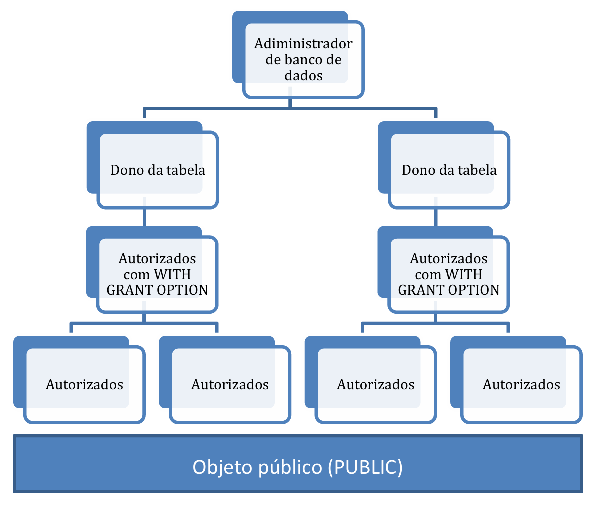

# Capítulo 9 – Linguagem de Controle de Dados (DCL): Segurança e Controle de Acesso

Ao longo dos capítulos anteriores, construímos um conhecimento robusto sobre como definir a estrutura de um banco de dados (DDL), manipular e consultar seus dados (DML), e garantir a integridade das operações através de transações (TCL). Contudo, um banco de dados é um ativo valioso e, na maioria dos cenários, multiusuário. Isso levanta uma questão essencial: como controlar quem pode acessar os dados e quais ações cada usuário tem permissão para executar? A resposta para essa questão fundamental reside na **Linguagem de Controle de Dados (DCL - Data Control Language)**.

A DCL é a sublinguagem do SQL focada exclusivamente em segurança. Seu propósito é proteger o banco de dados contra acessos não autorizados e garantir que os usuários possam interagir com os dados apenas dentro dos limites de suas responsabilidades e funções. Sem um esquema de controle de acesso bem definido, informações confidenciais poderiam ser expostas, dados críticos poderiam ser corrompidos ou apagados indevidamente, e a integridade do sistema como um todo estaria comprometida.

Este capítulo explora os mecanismos que a DCL oferece para construir uma estratégia de segurança sólida. Vamos desvendar os conceitos de privilégios, usuários e papéis, e aprender a utilizar os comandos `GRANT` e `REVOKE` para gerenciar permissões de forma precisa e eficaz. Ao final, teremos o conhecimento necessário para proteger o banco de dados, garantindo que os dados certos estejam acessíveis apenas para as pessoas certas.

## Os Pilares da Segurança: Usuários, Objetos e Privilégios

A segurança em SQL é baseada na interação entre três conceitos:

1. **Usuários (ou Principais):** As entidades, sejam pessoas ou aplicações, que tentam acessar o banco de dados.
2. **Objetos:** Os elementos do banco de dados que precisam ser protegidos, como tabelas, visões, sequências ou procedimentos.
3. **Privilégios:** As permissões específicas que um usuário pode ter sobre um objeto.

### A Hierarquia de Acesso

Na maioria dos sistemas de banco de dados, existe uma hierarquia clara de privilégios, que determina a autoridade de cada usuário.

<div align="center">
  
</div>

- **DBA (Database Administrator):** O superusuário, posicionado no topo da hierarquia. O DBA possui todos os privilégios sobre todos os objetos e pode conceder ou revogar qualquer permissão a qualquer usuário.
- **Proprietário do Objeto (Object Owner):** O usuário que cria um objeto (como uma tabela ou visão) torna-se seu proprietário e, por padrão, detém todos os privilégios sobre ele, incluindo o direito de conceder acesso a outros.
- **Usuário Comum:** Um usuário que, inicialmente, não possui nenhum privilégio, a menos que eles sejam explicitamente concedidos por um DBA ou pelo proprietário de um objeto.
- **`PUBLIC`:** Um grupo especial que representa todos os usuários do sistema. Conceder um privilégio ao `PUBLIC` significa que qualquer pessoa com acesso ao banco de dados terá essa permissão, o que deve ser feito com extrema cautela.

### Tipos de Privilégios

O padrão SQL define um conjunto granular de privilégios que podem ser concedidos. Os mais comuns são:

- **`SELECT`**: Permite ler dados de uma tabela ou visão.
- **`INSERT`**: Permite adicionar novas linhas a uma tabela.
- **`UPDATE`**: Permite modificar dados em linhas existentes de uma tabela.
- **`DELETE`**: Permite remover linhas de uma tabela.
- **`REFERENCES`**: Permite que um usuário crie uma restrição de chave estrangeira em sua própria tabela que referencie a tabela de outro usuário. É um privilégio sobre a tabela "pai" na relação.
- **`USAGE`**: Permite o uso de objetos de esquema que não contêm dados, como domínios, sequências e tipos definidos pelo usuário.
- **`TRIGGER`**: Permite criar um gatilho em uma tabela.
- **`EXECUTE`**: Permite executar um procedimento armazenado ou uma função.

## Concedendo Permissões com `GRANT`

O comando `GRANT` é a ferramenta utilizada para conceder privilégios. Sua sintaxe permite especificar quais privilégios, sobre qual objeto e para quais usuários a permissão será dada.

**Sintaxe Geral:**

```sql
GRANT <lista_de_privilégios | ALL PRIVILEGES>
ON <nome_do_objeto>
TO <lista_de_usuários | PUBLIC | nome_do_role>
[WITH GRANT OPTION];
```

- **`ALL PRIVILEGES`** é um atalho para conceder todos os privilégios aplicáveis ao objeto.

**Exemplos Práticos:**

```sql
-- Conceder permissão de apenas leitura na tabela de clientes para a usuária 'ana.analista'
GRANT SELECT ON clientes TO 'ana.analista';

-- Conceder permissão para inserir e atualizar pedidos para o usuário 'carlos.vendedor'
GRANT INSERT, UPDATE ON pedidos TO 'carlos.vendedor';

-- Conceder permissão de execução em um procedimento para todos os usuários
GRANT EXECUTE ON PROCEDURE sp_gerar_relatorio TO PUBLIC;
```

## Simplificando a Gestão com Papéis (Roles)

Em organizações com muitos usuários, gerenciar permissões individualmente é impraticável. Para resolver isso, o SQL utiliza o conceito de **Papel (Role)**. Um papel é uma entidade nomeada que funciona como um "contêiner" de privilégios. Em vez de conceder permissões a cada usuário, o administrador concede as permissões ao papel e, em seguida, atribui o papel aos usuários.

**Fluxo de Trabalho com Papéis:**

1. **Criar o Papel:** `CREATE ROLE papel_gerente_vendas;`
2. **Conceder Privilégios ao Papel:**

    ```sql
    GRANT SELECT, UPDATE ON metas_vendas TO papel_gerente_vendas;
    GRANT EXECUTE ON PROCEDURE sp_calcular_comissoes TO papel_gerente_vendas;
    ```
    
3. **Atribuir o Papel aos Usuários:**
    
    ```sql
    GRANT papel_gerente_vendas TO 'joao.supervisor', 'maria.lider';
    ```

Agora, se for necessário alterar as permissões dos gerentes de vendas, a mudança só precisa ser feita no papel, e todos os usuários atribuídos a ele herdarão automaticamente a nova configuração.

## Delegando Permissões com `WITH GRANT OPTION`

Por padrão, um usuário que recebe um privilégio não pode repassá-lo para outros. Isso mantém o controle centralizado. No entanto, em algumas situações, é necessário delegar essa autoridade. A cláusula `WITH GRANT OPTION` permite isso. Ao conceder um privilégio com esta opção, o beneficiário ganha não apenas o privilégio em si, mas também o direito de concedê-lo a outros usuários.

**Exemplo:** O DBA confia no gerente de vendas para gerenciar o acesso de sua própria equipe.

```sql
GRANT UPDATE (BonusPct)
ON BONUSRATE
TO SalesMgr
WITH GRANT OPTION;
```

Agora, o usuário `SalesMgr` pode delegar essa permissão para seu assistente:

```sql
GRANT UPDATE (BonusPct) ON BONUSRATE TO AsstSalesMgr;
```

O uso de `WITH GRANT OPTION` representa uma troca entre conveniência e controle de segurança, e deve ser usado com critério.

## Removendo Permissões com `REVOKE`

O comando `REVOKE` é a operação inversa do `GRANT`, utilizado para remover privilégios.

**Sintaxe Geral:**

```sql
REVOKE [GRANT OPTION FOR] <lista_de_privilégios>
ON <nome_do_objeto>
FROM <lista_de_usuários> [RESTRICT | CASCADE];
```

### O Desafio da Delegação: `RESTRICT` vs. `CASCADE`

A remoção de privilégios se torna complexa quando o usuário em questão usou uma `GRANT OPTION` para repassar a permissão. `REVOKE` oferece duas estratégias para lidar com essa "cadeia" de permissões:

- **`RESTRICT` (comportamento padrão em muitos sistemas):** A operação `REVOKE` falhará com um erro se o usuário de quem se está tentando revogar o privilégio já o tiver concedido a outros. Isso funciona como uma medida de segurança, forçando o administrador a investigar e lidar manualmente com a cadeia de delegação.
- **`CASCADE`:** A operação `REVOKE` é propagada em cascata. Ela não apenas remove o privilégio do usuário alvo, mas também remove o mesmo privilégio de todos os outros usuários que o receberam indiretamente através da cadeia de delegação iniciada pelo usuário alvo.

### Revogando Apenas a Opção de Concessão

É possível remover apenas a capacidade de um usuário delegar um privilégio, sem remover o privilégio em si. Isso é feito com a cláusula `GRANT OPTION FOR`.

**Exemplo:** O gerente de vendas (`SalesMgr`) não poderá mais delegar a permissão de `UPDATE`, mas ainda poderá ele mesmo realizar a operação.

```sql
REVOKE GRANT OPTION FOR UPDATE(BonusPct)
ON BONUSRATE
FROM SalesMgr;
```

## Considerações Finais

Ao dominar a Linguagem de Controle de Dados, concluímos nossa jornada através dos pilares fundamentais que compõem a linguagem SQL e a gestão de bancos de dados relacionais. Iniciamos definindo a estrutura com a DDL, aprendemos a interagir com os dados através da DML, garantimos a integridade e a concorrência com a TCL e, finalmente, neste capítulo, aprendemos a proteger o acesso aos dados com a DCL. Exploramos também conceitos essenciais como visões para abstração, índices para performance e extensões procedurais para lógica de negócio.

Recapitulamos a importância de uma hierarquia de acesso, os diferentes tipos de privilégios e os comandos `GRANT` e `REVOKE` como ferramentas centrais para a administração da segurança. Vimos como o uso de `Roles` simplifica a gestão de permissões em ambientes complexos e como a cláusula `WITH GRANT OPTION` permite uma delegação controlada de autoridade, com suas próprias implicações de segurança gerenciadas pelas opções `RESTRICT` e `CASCADE`.

Com este arsenal de conhecimento, que cobre todo o espectro da linguagem, o leitor está agora equipado não apenas para "falar" a linguagem dos dados, mas para construir, gerenciar, otimizar e proteger sistemas de informação complexos e robustos. Esta base completa é o ponto de partida para enfrentar os desafios práticos do desenvolvimento e da administração de dados no mundo real.