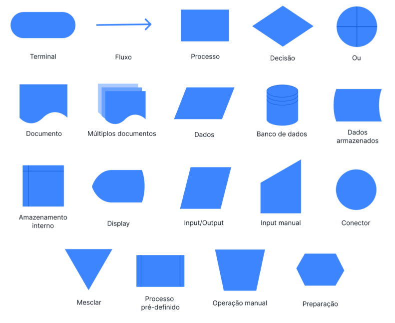
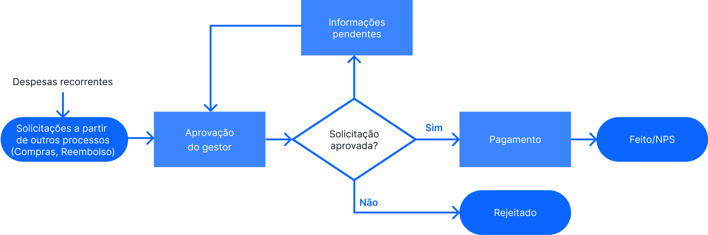

# Capítulo 1 – Fundamentos da Lógica de Programação

## O que é Lógica de Programação?

Antes de aprender a programar, é essencial desenvolver o raciocínio necessário para resolver problemas por meio de computadores. Esse raciocínio é baseado na **Lógica de Programação**, uma disciplina fundamental que ensina como pensar de forma estruturada e sistemática, como um computador "pensaria", para criar soluções eficientes e eficazes para problemas computacionais.

**Lógica de Programação** pode ser entendida como o conjunto de regras e princípios utilizados para desenvolver algoritmos — ou seja, uma sequência lógica e ordenada de instruções que resolve uma determinada tarefa ou problema.

Mais do que escrever códigos em uma linguagem de programação, a lógica de programação é sobre **pensar**. É sobre decompor problemas em partes menores, organizá-las em uma sequência racional e prever o comportamento da solução passo a passo. Essa habilidade é valiosa mesmo fora da programação, pois desenvolve o pensamento lógico, analítico e estruturado.

## Algoritmos: O Coração da Lógica

Um **algoritmo** é um conjunto finito de instruções bem definidas que, quando seguidas, levam à resolução de um problema ou à execução de uma tarefa. Ele precisa ser:

- **Bem definido:** cada passo deve ser claro, sem ambiguidade.
- **Ordenado:** os passos devem estar em uma sequência lógica.
- **Finito:** o algoritmo precisa terminar em algum ponto.
- **Efetivo:** cada etapa precisa ser executável.

Imagine a receita de um bolo. Trata-se de um algoritmo da vida real: você tem uma sequência ordenada de etapas (bater ovos, misturar ingredientes, levar ao forno etc.) com começo, meio e fim. A lógica de programação segue o mesmo princípio.

Um exemplo de algoritmo para uma tarefa do cotidiano, no caso trocar uma lâmpada queimada, poderia ser o seguinte:

1. Verificar se a lâmpada está realmente queimada.
2. Desligar o interruptor.
3. Subir numa escada.
4. Retirar a lâmpada queimada.
5. Colocar uma nova lâmpada.
6. Descer da escada.
7. Ligar o interruptor.
8. Verificar se a nova lâmpada funciona.

Este exemplo mostra como algoritmos estão presentes no dia a dia, mesmo sem percebermos.

## Instruções e Blocos de Construção da Lógica

Todo algoritmo é composto por **instruções**, que são ordens ou comandos que devem ser executados em sequência. Essas instruções podem ser de diferentes tipos:

- **Instruções de entrada:** recebem dados do usuário ou de uma fonte externa. Exemplo: `ler a idade`.
- **Instruções de processamento:** realizam cálculos, comparações ou transformações. Exemplo: `idade <- idade + 1`.
- **Instruções de saída:** exibem resultados para o usuário. Exemplo: `escrever a idade`.

Além disso, algoritmos podem conter **estruturas de controle**, como:

- **Sequência:** execução de instruções em ordem linear.
- **Decisão (condicional):** escolha entre caminhos, dependendo de uma condição.
- **Repetição (laços):** execução de um bloco de código várias vezes, enquanto uma condição for verdadeira.

Esses blocos formam a base da lógica computacional.

## Representando Algoritmos: Fluxogramas

Um **fluxograma** é uma representação gráfica de um algoritmo, onde usamos símbolos padronizados para mostrar o fluxo de execução das instruções. Ele é útil para visualizar a lógica de forma clara antes da codificação. Os principais símbolos incluem:

<div align="center">
  </a>
</div>

Uma breve explicação de cada símbolo:

- **Terminal**: Indica o início (gatilho) ou fim (resultado) de um fluxograma.
- **Fluxo (linha de fluxo)**: Mostra a direção e a ordem de cada fluxo do processo.
- **Processo**: Designa cada ação ou tarefa específica dentro do fluxograma.
- **Decisão**: Indica uma escolha que deve ser feita ou uma pergunta que precisa ser respondida. Seu resultado determina a próxima etapa do fluxo.
- **Ou**: Trata-se de um ponto no fluxo onde há mais de uma próxima etapa possível e uma escolha deve ser feita.
- **Documento**: Mostra que é necessária a criação ou uso de um documento. Os documentos incluem arquivos, emails, relatórios, pedidos ou formulários.
- **Múltiplos documentos**: Sentido parecido com o símbolo de documento, embora indique que é necessário mais de um documento em determinada etapa.
- **Dados**: Trata da entrada ou saída de informações. Por exemplo, de dados que devem ser inseridos em um formulário, ou quando um relatório é exibido.
- **Banco de dados**: Indica um armazenamento estruturado de dados pesquisáveis. Às vezes, refere-se a um arquivo de dados.
- **Dados armazenados**: Um ponto no fluxograma durante o qual os dados são copiados, armazenados ou submetidos a backup.
- **Armazenamento interno**: Símbolo do fluxograma para dados armazenados em um servidor local ou em algum outro local.
- **Display (exibição)**: Um ponto no fluxograma onde os dados são exibidos visualmente para um usuário. Por exemplo, quando um relatório é gerado ou informações são apresentadas em um monitor.
- **Input/Output (Entrada/Saída)**: Idêntico ao símbolo do fluxograma para dados. Indica que informações são necessárias neste ponto do fluxo.
- **Input manual (Entrada manual)**: Indica uma tarefa ou etapa no fluxo de trabalho que requer entrada manual de dados, ou outra atividade a ser feita manualmente.
- **Conector**: Indica que o fluxograma continua em outro ponto ou em outro documento. Os símbolos de conexão são numerados para que possam ser combinados, e isso é especialmente importante para fluxos complexos.
- **Mesclar**: Sinaliza a interseção entre vários caminhos no fluxo, onde dois ou mais fluxos de trabalho ou fluxos de dados se encontram.
- **Processo pré-definido**: Indica um processo ou fluxo de trabalho que requer um alto nível de detalhamento. Informações adicionais para processos predefinidos são fornecidas em outro lugar, ou então trata-se de um processo comumente compreendido.
- **Operação manual**: Trabalho ou atividade que não pode ser automatizada. A entrada manual é necessária para cada instância deste fluxo de trabalho.
- **Preparação**: Uma etapa no fluxo de trabalho que oferece suporte ou habilita a uma etapa seguinte.

Abaixo está o exemplo de um fluxograma de aprovação de solicitações em uma empresa:

<div align="center">
  </a>
</div>
<br>

## Representando Algoritmos com Pseudocódigo

O **pseudocódigo** é uma forma intermediária entre a linguagem natural e uma linguagem de programação. Ele permite escrever algoritmos de maneira estruturada, clara e próxima da programação real, mas sem a rigidez sintática das linguagens de programação formais.

Embora não exista uma padronização oficial para pseudocódigo, é comum usar comandos semelhantes aos de uma linguagem formal, mas com maior flexibilidade na escrita.

O **Português Estruturado** é uma variação do pseudocódigo que usa uma linguagem próxima do português formal, mas com estrutura lógica clara, como se fosse uma programação "em português". Ele é muito usado em ambientes educacionais por facilitar o aprendizado de lógica.

A seguir tem-se um exemplo de algoritmo em **Português Estruturado**, cujo objetivo é ler dois números dados pelo usuário e exibir o maior entre eles.

```plaintext
Início
    Escreva "Digite o primeiro número:"
    Leia numero1
    Escreva "Digite o segundo número:"
    Leia numero2

    Se numero1 > numero2 então
        Escreva "O maior número é: ", numero1
    Senão
        Escreva "O maior número é: ", numero2
Fim
```

Neste exemplo, o uso de estruturas como `Se... então... Senão...` deixa claro o fluxo de decisão, facilitando a compreensão da lógica.

## Considerações Finais

Dominar a lógica de programação é o primeiro passo para se tornar um bom programador. Ela é a base sobre a qual todas as linguagens de programação são construídas. Compreender como estruturar um algoritmo, representar soluções por meio de fluxogramas ou pseudocódigo e descrever passos lógicos usando o Português Estruturado são habilidades essenciais para qualquer iniciante.
