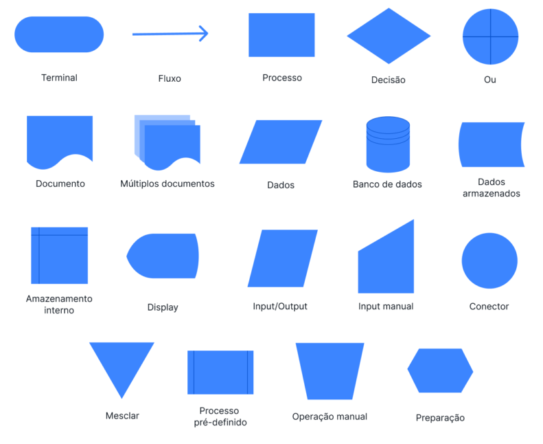

<div align="center">
  <a href="https://github.com/joseferreira-dev/my-study-notes/tree/main/logica-de-programacao"></a>
</div>
<br>

# Conceitos Básicos

- [Introdução](#introdução)
- [Algoritmos](#algoritmos)
  - [Fluxograma](#fluxograma)
  - [Pseudocódigo](#pseudocódigo)
  - [Linguagem de Programação](#linguagem-de-programação)

## Introdução

Programação é o processo de escrever instruções que um computador pode seguir para realizar tarefas específicas. Essas instruções são escritas em uma linguagem de programação, que é uma linguagem formal projetada para comunicar comandos ao computador. Programadores criam softwares para resolver problemas, automatizar tarefas e proporcionar novas funcionalidades.

## Algoritmos

Um algoritmo é uma sequência finita de instruções bem definidas e não ambíguas que resolvem um problema ou realizam uma tarefa específica. Em outras palavras, um algoritmo é um passo a passo para alcançar um objetivo. Os algoritmos são fundamentais na programação, pois definem como uma tarefa deve ser realizada.

Os algoritmos podem ser representados de várias formas, sendo as mais comuns:

- Fluxograma
- Pseudocódigo
- Linguagem de Programação

### Fluxograma

Um fluxograma é uma representação gráfica de um algoritmo. Ele utiliza símbolos para representar diferentes tipos de ações ou etapas em um processo. Os principais símbolos incluem:

<div align="center">
  </a>
</div>

Uma breve explicação de cada símbolo:

- **Terminal**: Indica o início (gatilho) ou fim (resultado) de um fluxograma.
- **Fluxo (linha de fluxo)**: Mostra a direção e a ordem de cada fluxo do processo.
- **Processo**: Designa cada ação ou tarefa específica dentro do fluxograma.
- **Decisão**: Indica uma escolha que deve ser feita ou uma pergunta que precisa ser respondida. Seu resultado determina a próxima etapa do fluxo.
- **Ou**: Trata-se de um ponto no fluxo onde há mais de uma próxima etapa possível e uma escolha deve ser feita.
- **Documento**: Mostra que é necessária a criação ou uso de um documento. Os documentos incluem arquivos, emails, relatórios, pedidos ou formulários.
- **Múltiplos documentos**: Sentido parecido com o símbolo de documento, embora indique que é necessário mais de um documento em determinada etapa.
- **Dados**: Trata da entrada ou saída de informações. Por exemplo, de dados que devem ser inseridos em um formulário, ou quando um relatório é exibido.
- **Banco de dados**: Indica um armazenamento estruturado de dados pesquisáveis. Às vezes, refere-se a um arquivo de dados.
- **Dados armazenados**: Um ponto no fluxograma durante o qual os dados são copiados, armazenados ou submetidos a backup.
- **Armazenamento interno**: Símbolo do fluxograma para dados armazenados em um servidor local ou em algum outro local.
- **Display (exibição)**: Um ponto no fluxograma onde os dados são exibidos visualmente para um usuário. Por exemplo, quando um relatório é gerado ou informações são apresentadas em um monitor.
- **Input/Output (Entrada/Saída)**: Idêntico ao símbolo do fluxograma para dados. Indica que informações são necessárias neste ponto do fluxo.
- **Input manual (Entrada manual)**: Indica uma tarefa ou etapa no fluxo de trabalho que requer entrada manual de dados, ou outra atividade a ser feita manualmente.
- **Conector**: Indica que o fluxograma continua em outro ponto ou em outro documento. Os símbolos de conexão são numerados para que possam ser combinados, e isso é especialmente importante para fluxos complexos.
- **Mesclar**: Sinaliza a interseção entre vários caminhos no fluxo, onde dois ou mais fluxos de trabalho ou fluxos de dados se encontram.
- **Processo pré-definido**: Indica um processo ou fluxo de trabalho que requer um alto nível de detalhamento. Informações adicionais para processos predefinidos são fornecidas em outro lugar, ou então trata-se de um processo comumente compreendido.
- **Operação manual**: Trabalho ou atividade que não pode ser automatizada. A entrada manual é necessária para cada instância deste fluxo de trabalho.
- **Preparação**: Uma etapa no fluxo de trabalho que oferece suporte ou habilita a uma etapa seguinte.

Abaixo está o exemplo de um fluxograma de aprovação de solicitações em uma empresa:

<div align="center">
  </a>
</div>

### Pseudocódigo

O pseudocódigo é uma descrição textual de um algoritmo que utiliza uma linguagem simples e clara, semelhante ao português estruturado, mas que não é uma linguagem de programação real. Ele é usado para planejar e comunicar ideias de algoritmos antes de implementá-los em uma linguagem de programação.

```
Início
  Leia N
  Se N % 2 == 0 Então
    Imprima "Par"
  Senão
    Imprima "Ímpar"
Fim
```

### Linguagem de Programação

Um algoritmo pode ser implementado em uma linguagem de programação, que é um conjunto de regras sintáticas e semânticas que permitem a escrita de programas que podem ser executados por um computador.

```python
# Início
N = int(input("Digite um número: "))

# Verifica se o número é par ou ímpar
if N % 2 == 0:
  print("Par")
else:
  print("Ímpar")
# Fim
```
