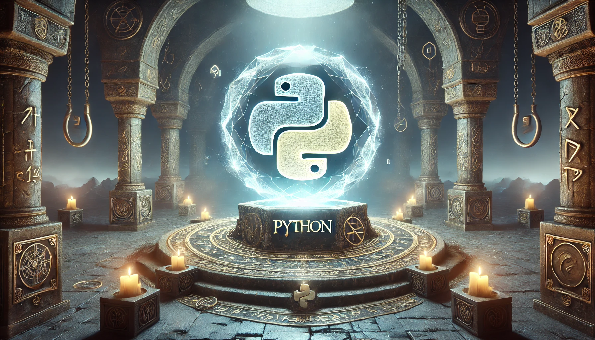

  

 

# Linguagem Python

Python é uma linguagem de programação de alto nível, poderosa e versátil, criada por Guido van Rossum e lançada em 1991. Ela foi projetada para ser **fácil de ler, escrever e manter**, combinando simplicidade com eficiência. Python é amplamente utilizado em diversas áreas, como desenvolvimento web, automação, ciência de dados, inteligência artificial e muito mais. Sua filosofia de "legibilidade conta" e sua sintaxe clara fazem dela uma das linguagens mais populares e acessíveis para iniciantes e especialistas. As principais características do Python são:

- **Sintaxe limpa e intuitiva**: Python possui uma sintaxe simples e próxima da linguagem humana, reduzindo a complexidade e facilitando o aprendizado. O uso de indentação para definir blocos de código torna-o naturalmente organizado.  
- **Multiplataforma e interpretada**: Python é uma linguagem interpretada, o que significa que o código é executado linha a linha, facilitando a depuração. Além disso, é multiplataforma, rodando em Windows, Linux, macOS e outros sistemas sem modificações.  
- **Tipagem dinâmica e forte**: Python é dinamicamente tipado (não é necessário declarar tipos explicitamente), mas fortemente tipado (operações entre tipos incompatíveis geram erros), equilibrando flexibilidade e segurança.  
- **Orientação a objetos e multiparadigma**: Python suporta programação orientada a objetos (classes, herança, polimorfismo), mas também permite programação procedural e funcional, adaptando-se a diferentes estilos de desenvolvimento.  
- **Ecossistema robusto (bibliotecas e frameworks)**: Python possui uma vasta coleção de bibliotecas padrão e pacotes de terceiros (via **PyPI** – *Python Package Index*), como NumPy (ciência de dados), Django (web), TensorFlow (machine learning) e muitas outras, acelerando o desenvolvimento.  
- **Suporte a concorrência e assincronismo**: Com recursos como `async/await`, *threads* e *multiprocessing*, Python permite o desenvolvimento de aplicações eficientes que lidam com operações paralelas e assíncronas.  
- **Comunidade ativa e grande adoção**: Python tem uma das maiores comunidades de desenvolvedores do mundo, garantindo suporte constante, atualizações frequentes e abundância de recursos de aprendizagem.  

## Índice de Conteúdos

Abaixo segue o índice com diversos conteúdos sobre a linguagem. Pode-se considerar esta como uma mini documentação de referência. Vale ressaltar que este material foi elaborado com base na versão 3.12.0 da linguagem.

- [Introdução à Linguagem Python](./contents/01-introducao.md)
- [Variáveis e Tipos de Dados Simples](./contents/02-variaveis.md)
- 