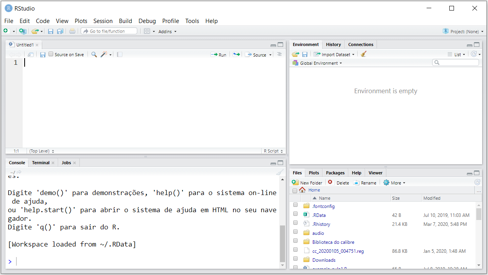

# Capítulo 1 — Instalação e Introdução ao R

## Introdução à Linguagem R

O R é uma linguagem de programação e um ambiente de software voltado especialmente para cálculos estatísticos, análise de dados e criação de gráficos. Criado inicialmente por Ross Ihaka e Robert Gentleman na Universidade de Auckland, na Nova Zelândia, o R se tornou uma das ferramentas mais populares no mundo da estatística, ciência de dados, machine learning e bioinformática.

O diferencial do R em relação a outras linguagens de programação é seu ecossistema vasto e focado em análise de dados. Ele oferece uma infinidade de pacotes que facilitam desde operações simples de manipulação de dados até análises estatísticas complexas e visualizações gráficas interativas. Além disso, a linguagem R é de código aberto e possui uma comunidade muito ativa, o que impulsiona o constante desenvolvimento de novos pacotes e funcionalidades.

Mesmo sendo uma linguagem poderosa para especialistas, o R é também acessível para iniciantes, principalmente devido às suas construções intuitivas, grande volume de material de apoio, e ambientes de desenvolvimento integrados como o **RStudio**, que simplificam a sua utilização.

Ao longo desta apostila, exploraremos não apenas as bases do R, mas também recursos avançados, de forma clara e detalhada, garantindo um domínio sólido e prático da linguagem.

## Instalação do R e do RStudio

Antes de começarmos a escrever nossos primeiros comandos, precisamos preparar o ambiente de trabalho instalando o R e o RStudio.

O **R** é o motor de cálculo, onde todas as operações são executadas. Já o **RStudio** é um ambiente de desenvolvimento integrado (IDE — Integrated Development Environment), que facilita o uso do R ao oferecer uma interface gráfica amigável, com recursos como organização de scripts, visualização de variáveis e gráficos, execução de códigos em seções e muito mais.

Para instalar o R, basta acessar o site oficial do projeto [https://cran.r-project.org](https://cran.r-project.org) e selecionar o seu sistema operacional (Windows, macOS ou Linux). O processo de instalação é semelhante ao de qualquer outro software: basta seguir as instruções apresentadas pelo instalador.

Após instalar o R, o próximo passo é instalar o RStudio, que pode ser baixado gratuitamente na versão Desktop Community no site [https://www.rstudio.com/products/rstudio/download/](https://www.rstudio.com/products/rstudio/download/). Note que o RStudio depende do R já instalado para funcionar, pois ele apenas fornece a interface gráfica para interação.

Feitas as instalações, ao abrir o RStudio pela primeira vez, você estará pronto para iniciar seu trabalho com R de maneira prática e organizada.

### Explicação do Ambiente RStudio

Ao abrir o RStudio, nos deparamos com uma janela dividida em vários painéis, cada qual com funções específicas que tornam o trabalho no R mais eficiente.

<div align="center">
  
</div>
<br>

No canto superior esquerdo, temos o **Editor de Scripts**, onde podemos escrever, salvar e executar códigos de forma estruturada. Este painel permite a criação de arquivos `.R`, que contêm seus códigos e podem ser reutilizados sempre que necessário.

O painel inferior esquerdo é o **Console**, onde os comandos são executados de maneira interativa. Podemos digitar instruções diretamente no console e obter respostas imediatas.

O painel superior direito é conhecido como o **Ambiente/Histórico**. Nele, podemos visualizar todos os objetos criados durante a sessão atual de trabalho, como variáveis, funções e datasets. Além disso, é possível consultar o histórico de comandos digitados.

Por fim, no painel inferior direito encontramos múltiplas abas, entre elas **Files** (arquivos presentes no diretório de trabalho), **Plots** (gráficos gerados), **Packages** (gerenciamento de pacotes), **Help** (acesso à documentação) e **Viewer** (visualização de documentos como relatórios HTML).

Essa organização facilita o fluxo de trabalho no R, pois permite escrever código de maneira estruturada, acompanhar a criação de objetos, visualizar gráficos e acessar documentação em um único local.

## Organização de Arquivos e Diretórios

Em qualquer projeto, é fundamental manter uma boa organização dos arquivos. O RStudio trabalha com o conceito de **diretório de trabalho** (working directory), que é a pasta onde o R procura ou salva arquivos automaticamente.

Para descobrir qual é o diretório de trabalho atual, usamos a função `getwd()`:

```r
getwd()
```

Suponha que a saída seja:

```
[1] "C:/Users/SeuNome/Documents"
```

Isso significa que qualquer arquivo que você tentar abrir ou salvar sem especificar um caminho completo será buscado ou salvo nesta pasta.

Para alterar o diretório de trabalho, utilizamos a função `setwd()`. Por exemplo, se quisermos mudar para uma pasta chamada "ProjetosR" na área de trabalho, usamos:

```r
setwd("C:/Users/SeuNome/Desktop/ProjetosR")
```

Após essa alteração, o novo diretório será onde o R buscará arquivos e salvará saídas. Recomenda-se criar pastas específicas para seus projetos, organizando scripts, dados e resultados de forma lógica e prática.

## Instalação de Pacotes

Grande parte do poder do R está em sua extensa coleção de pacotes, que são bibliotecas contendo funções, dados e documentação adicionais.

Para instalar pacotes, utilizamos a função `install.packages()`. Por exemplo, para instalar o pacote `ggplot2`, amplamente usado para criação de gráficos, executamos:

```r
install.packages("ggplot2")
```

A primeira vez que instalamos um pacote, ele é baixado da internet e armazenado localmente. Posteriormente, para usá-lo em uma sessão de trabalho, é necessário carregá-lo com a função `library()`:

```r
library(ggplot2)
```

Caso você tente utilizar uma função de um pacote sem carregá-lo antes, o R gerará um erro informando que o objeto não foi encontrado.

Vale mencionar que pacotes instalados em uma sessão de R ficam disponíveis para qualquer projeto, a menos que sejam removidos manualmente.

## Objetos

A linguagem R é fundamentalmente orientada a objetos, o que significa que tudo em R é tratado como um objeto: números, vetores, funções, listas, data frames e até mesmo as funções definidas pelo usuário são, internamente, objetos. Entender a manipulação e o comportamento dos objetos é essencial para quem deseja dominar o R.

No R, ao atribuirmos um valor a um nome utilizando o operador `<-`, criamos um objeto:

```r
x <- 42
```

Neste exemplo, `x` é um objeto que contém o valor numérico `42`. Objetos no R podem armazenar não apenas valores simples, mas também estruturas de dados complexas, como vetores, matrizes, listas e data frames, que exploraremos em capítulos futuros.

Os objetos possuem atributos que podem incluir o tipo de dado, o comprimento, nomes, dimensões, entre outros. Por exemplo, podemos verificar o tipo de dado armazenado em um objeto com a função `class()`:

```r
class(x)  # Resultado: "numeric"
```

Podemos também explorar as propriedades de um objeto utilizando a função `attributes()`.

Criar e manipular objetos é a base de qualquer script em R. Portanto, é importante adotar boas práticas, como nomes de objetos descritivos e consistentes, e manter o ambiente de trabalho organizado, utilizando funções como `ls()` para listar os objetos existentes e `rm()` para removê-los quando necessário.

### Listando e Removendo Objetos

Durante a execução de análises no R, criamos diversos objetos como vetores, matrizes, data frames, modelos estatísticos, entre outros. Para manter o ambiente limpo e organizado, é importante saber como listar e remover objetos.

Para listar todos os objetos presentes no ambiente atual, usamos a função `ls()`:

```r
ls()
```

Suponha que a saída seja:

```
[1] "dados" "modelo" "resultado"
```

Isso indica que temos três objetos carregados: `dados`, `modelo` e `resultado`.

Se quisermos remover um objeto específico, utilizamos `rm()`. Por exemplo, para deletar o objeto `resultado`, fazemos:

```r
rm(resultado)
```

Podemos também remover mais de um objeto listando-os separados por vírgula:

```r
rm(resultado, dados)
```

Se desejarmos apagar todos os objetos da memória de uma vez, podemos combinar `rm()` com `ls()`:

```r
rm(list = ls())
```

Esse comando é especialmente útil ao iniciar uma nova análise, garantindo que nenhum objeto antigo interfira no novo trabalho.

## Solicitando Ajuda

Por mais experiente que seja o programador, em algum momento será necessário consultar a documentação do R. Felizmente, o R possui sistemas de ajuda bastante completos.

Se quisermos obter ajuda sobre uma função específica, podemos usar `help()` ou simplesmente `?`. Por exemplo, para obter informações sobre a função `mean()`, podemos fazer:

```r
help(mean)
```
ou

```r
?mean
```

Isso abrirá a documentação da função, explicando o que ela faz, quais argumentos aceita e exemplos de uso.

Para visualizar exemplos práticos de como utilizar uma função, usamos a função `example()`. Continuando com o `mean()`:

```r
example(mean)
```

O R irá executar alguns exemplos diretamente no console, o que pode ser bastante elucidativo.

Se não soubermos exatamente qual função usar para determinada tarefa, podemos utilizar `help.search()`, que procura termos na documentação dos pacotes instalados. Por exemplo:

```r
help.search("regression")
```

O resultado será uma lista de funções e pacotes relacionados ao termo "regression".

Finalmente, se quisermos uma visão geral e gráfica da documentação, podemos usar `help.start()`, que abrirá uma página no navegador com acesso organizado a manuais, pacotes instalados e outros recursos:

```r
help.start()
```

Essa ferramenta é particularmente útil para iniciantes que preferem navegar por tópicos em vez de procurar apenas por nomes de funções.
