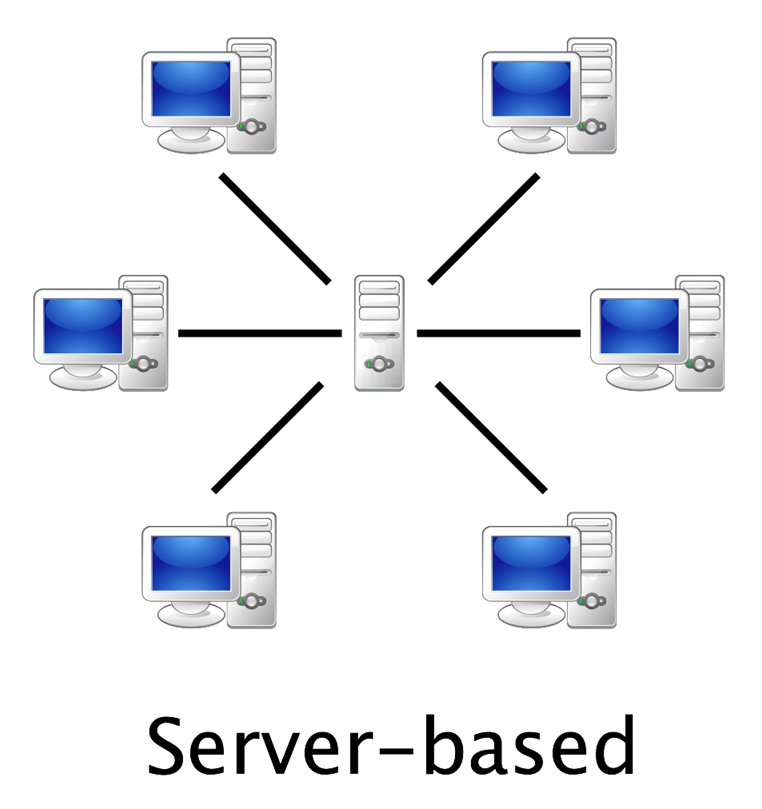
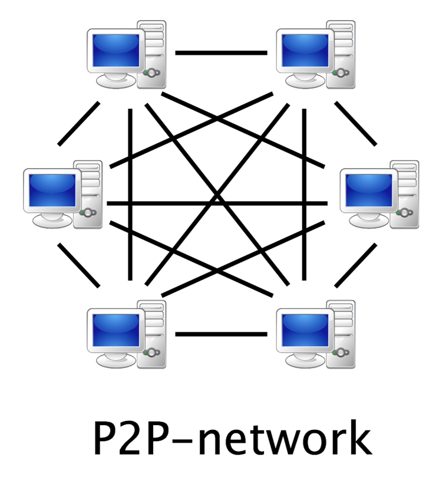
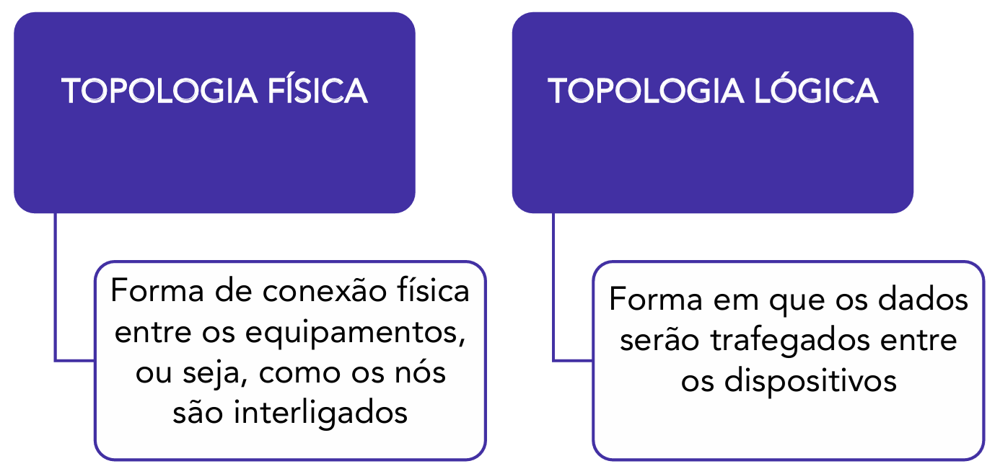
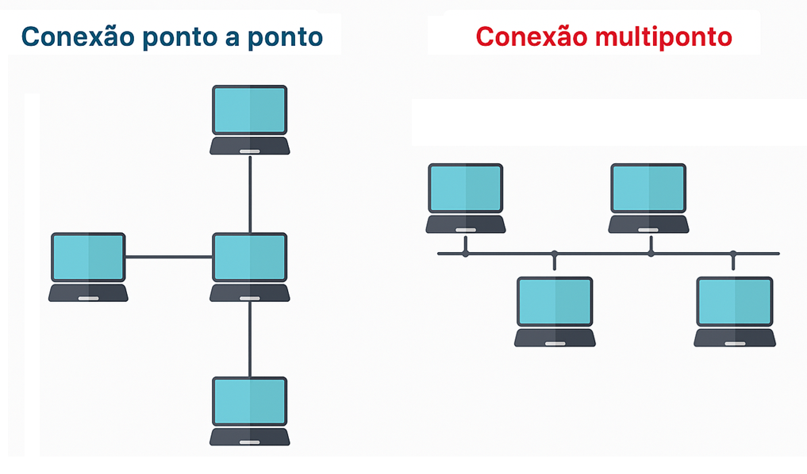
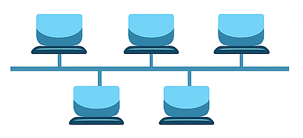
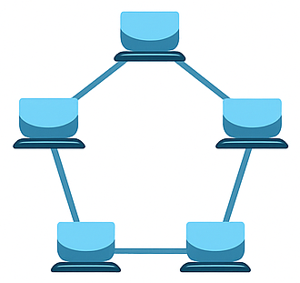
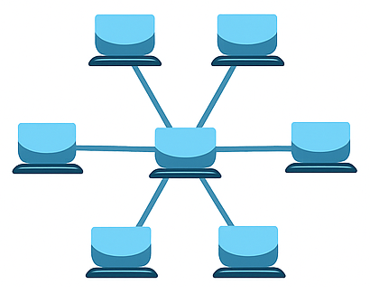
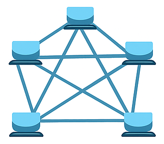
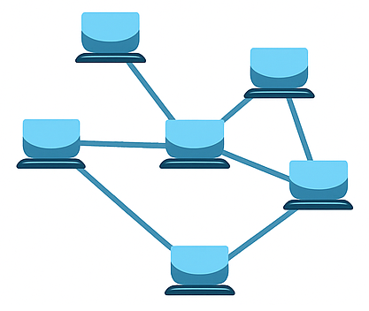
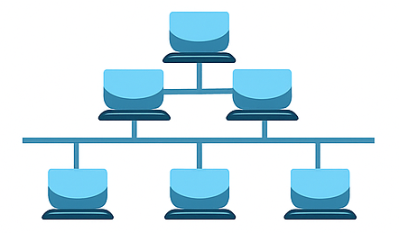

# Capítulo 1 – Conceitos Básicos de Redes de Computadores

No mundo contemporâneo, estamos imersos em um oceano de conectividade digital. Desde o simples ato de enviar uma mensagem em um aplicativo, assistir a um filme em um serviço de streaming, realizar uma transação bancária pelo celular ou participar de uma reunião de trabalho à distância, nossas atividades diárias são profundamente dependentes de sistemas que operam silenciosamente nos bastidores. Esses sistemas, que permitem que dados viajem o mundo em frações de segundo, são as redes de computadores. Mas o que, de fato, constitui uma rede de computadores e quais são os seus componentes e propósitos essenciais?

De maneira direta, uma rede de computadores emerge quando dispositivos distintos precisam trocar informações entre si. O especialista William Stallings oferece uma definição concisa, afirmando que uma rede de computadores surge “quando dois ou mais computadores estão interconectados via uma rede de comunicação”. Embora simples, essa definição captura a essência da questão: a interconexão para comunicação. De forma mais abrangente e formal, a norma ISO/IEC 7498-1 define uma rede como:

> “Um conjunto de um ou mais computadores, ou software associado, periféricos, terminais, operadores humanos, processos físicos, meios de transferência de informação, entre outros componentes, formando um conjunto autônomo capaz de executar o processamento e a transferência de informações”.

Analisando essa definição mais completa, percebemos que uma rede é um ecossistema complexo. Ela não se limita apenas aos computadores, mas engloba todos os elementos necessários para que a informação seja não apenas transportada, mas também processada de forma útil. Em suma, sempre que houver um conjunto de entidades autônomas (os dispositivos) se comunicando através de um meio e seguindo um conjunto de regras (protocolos), temos uma rede de computadores em funcionamento.

## Os Pilares de uma Rede de Computadores

Para que a mágica da comunicação aconteça, uma rede precisa de uma estrutura fundamental, composta por diferentes categorias de componentes que trabalham em harmonia. Podemos dividir essa estrutura em três pilares essenciais.

### Dispositivos Finais (Hosts ou Endpoints)

Os dispositivos finais, tecnicamente conhecidos como **hosts** ou **endpoints**, são a razão de ser de qualquer rede. São eles que atuam como o ponto de origem e de destino da informação que trafega. Estes são os equipamentos com os quais os usuários interagem diretamente. A categoria de estações de trabalho ou dispositivos finais é vasta e está em constante expansão, incluindo:

- **Computadores Pessoais:** Desktops e laptops, as clássicas estações de trabalho.
- **Dispositivos Móveis:** Smartphones e tablets, que se tornaram os principais pontos de acesso à internet para muitas pessoas.
- **Servidores:** Computadores robustos e de alto desempenho projetados para fornecer serviços a outros dispositivos na rede, como hospedar sites, armazenar arquivos ou gerenciar e-mails.
- **Periféricos de Rede:** Dispositivos como impressoras, scanners e sistemas de armazenamento que são conectados diretamente à rede para serem compartilhados por múltiplos usuários.
- **Dispositivos de IoT (Internet of Things):** Uma categoria crescente que inclui uma miríade de "coisas" conectadas à rede, como Smart TVs, assistentes virtuais (Amazon Echo, Google Nest), câmeras de segurança, lâmpadas inteligentes, geladeiras, sensores industriais e até mesmo carros.

### Meios de Comunicação

O meio de comunicação é o caminho físico ou lógico pelo qual os dados viajam de um ponto a outro na rede. É a "estrada" que conecta os dispositivos. A escolha do meio impacta diretamente a velocidade, o custo, a distância e a confiabilidade da comunicação. Os meios podem ser categorizados em dois grandes grupos:

- **Meios Guiados:** Utilizam um caminho físico sólido para guiar o sinal.
    - **Cabos de Par Trançado:** O tipo de cabo mais comum em redes locais (LANs). Consiste em pares de fios de cobre trançados para reduzir a interferência eletromagnética. Exemplos incluem os cabos Ethernet (com categorias como Cat5e, Cat6, Cat7), que conectam computadores a switches e roteadores.
    - **Cabos Coaxiais:** Formados por um condutor central de cobre, um isolante, uma malha metálica e uma capa externa. Embora mais antigos e menos comuns em redes locais modernas, ainda são amplamente utilizados para distribuir sinais de TV a cabo e acesso à internet de banda larga por operadoras.
    - **Fibra Óptica:** Utiliza finíssimos filamentos de vidro ou plástico para transmitir dados na forma de pulsos de luz. Oferece velocidades altíssimas, maior alcance e imunidade total a interferências eletromagnéticas, sendo a espinha dorsal (backbone) da internet global e de redes de alta performance.

- **Meios Não Guiados:** Transmitem os dados através do espaço, sem um condutor físico.
    - **Ondas de Rádio:** A base para toda a comunicação sem fio. A informação é modulada em ondas de rádio que se propagam pelo ar. É a tecnologia por trás do **Wi-Fi**, que cria redes locais sem fio (WLANs), do **Bluetooth**, para comunicação de curta distância entre dispositivos, e das **redes celulares** (4G, 5G), que oferecem conectividade móvel em larga escala.
    - **Sinais de Satélite:** Utilizados para cobrir grandes distâncias geográficas, áreas remotas onde a infraestrutura terrestre é inviável, e para serviços de transmissão de TV e GPS.
    - **Infravermelho:** Usado para comunicação de curtíssimo alcance e que exige uma "linha de visada" direta, como em controles remotos de televisores.

### Dispositivos Intermediários (Infraestrutura de Rede)

Enquanto os dispositivos finais criam e consomem os dados, os dispositivos intermediários são os responsáveis por gerenciar e direcionar esse fluxo de informação através da rede. Eles conectam os hosts entre si e podem conectar múltiplas redes para formar uma inter-rede, como a própria Internet. Os principais equipamentos de infraestrutura são:

- **Hub (Concentrador):** Um dispositivo mais antigo e simples. Quando um hub recebe um sinal em uma de suas portas, ele simplesmente o replica e o retransmite para **todas** as outras portas, sem qualquer inteligência. Isso gera tráfego desnecessário e pode levar a "colisões" de dados, sendo um equipamento obsoleto na maioria das aplicações modernas.
- **Switch (Comutador):** É um dispositivo muito mais inteligente que o hub. Um switch opera analisando o endereço físico (endereço MAC) de cada pacote de dados que recebe. Ele aprende quais dispositivos estão conectados a cada uma de suas portas e, com isso, encaminha os dados **apenas** para a porta de destino correta. Isso cria caminhos de comunicação dedicados, reduz o congestionamento e aumenta drasticamente a eficiência da rede local.
- **Roteador:** O roteador é o dispositivo que conecta redes diferentes. Enquanto um switch opera dentro de uma mesma rede local (ex: a rede da sua casa), um roteador é capaz de "rotear" ou encaminhar pacotes de dados **entre** redes distintas (ex: conectar a rede da sua casa com a rede mundial, a Internet). Ele toma decisões de encaminhamento com base em endereços lógicos (endereços IP) e é o portal de saída (`gateway`) de uma rede local para o mundo exterior.
- **Access Point (Ponto de Acesso):** É o dispositivo que permite que equipamentos sem fio (com Wi-Fi) se conectem a uma rede cabeada. Ele atua como uma ponte entre o mundo dos meios guiados (cabos) e o dos meios não guiados (ondas de rádio).

## A Finalidade das Redes: Por que as Construímos?

A construção e manutenção de redes, desde as mais simples até a complexa malha global da Internet, são motivadas por necessidades fundamentais de compartilhamento e comunicação. Os objetivos primordiais de uma rede de computadores podem ser agrupados em três grandes áreas.

### Compartilhamento de Informações e Serviços

Esta é, talvez, a finalidade mais visível de uma rede. As redes permitem que dados e serviços hospedados em um local (geralmente em servidores) sejam acessados por usuários em qualquer outro ponto da rede.

- **Exemplos Clássicos:** O **correio eletrônico (e-mail)** permite a troca de mensagens de forma assíncrona; a **World Wide Web (WWW)** provê acesso a um universo de documentos, sites e informações interligadas; e o **comércio eletrônico** e o **Internet Banking** transformaram a maneira como compramos e gerenciamos nossas finanças, disponibilizando serviços complexos de forma remota e segura.

### Comunicação Humana

As redes são uma poderosa ferramenta para a interação entre pessoas, eliminando barreiras geográficas e permitindo a comunicação em tempo real ou assíncrona.

- **Exemplos de Interação:** Serviços de **Chat e mensagens instantâneas** (como WhatsApp e Telegram), **Voz sobre IP (VoIP)** (que digitaliza a voz para ser transmitida pela internet, como em ligações via aplicativos), e **Videoconferências** (que demandam grande capacidade da rede para transmitir áudio e vídeo simultaneamente) são exemplos de como as redes aproximam as pessoas. A **troca de arquivos** entre usuários, seja diretamente ou por meio de plataformas, também é uma forma de comunicação e colaboração.

### Compartilhamento de Recursos de Hardware e Software

Além de informações, as redes permitem o compartilhamento de recursos físicos (hardware) e de capacidade de processamento (software), otimizando custos e aumentando a eficiência.

- **Exemplos de Compartilhamento:**
    - Uma **impressora de rede** pode ser utilizada por dezenas de funcionários em um escritório, eliminando a necessidade de uma impressora para cada mesa.
    - O **armazenamento remoto** permite que arquivos sejam guardados em um local centralizado (um servidor de arquivos local, chamado de NAS - Network Attached Storage, ou na nuvem, como Google Drive e Dropbox), facilitando o acesso, o backup e a colaboração.
    - O **processamento remoto**, em cenários mais avançados como os **grids computacionais**, permite que a capacidade ociosa de milhares de computadores conectados em rede seja utilizada para resolver problemas computacionais complexos, como pesquisas científicas, modelagem climática ou renderização de filmes de animação.

## Modelos de Interação em Redes

Além de classificar as redes por seus componentes e finalidades, é crucial entender a arquitetura lógica que dita como os dispositivos interagem entre si para trocar informações e serviços. Essa dinâmica de relacionamento define o modelo operacional da rede. Nesse contexto, dois modelos predominam e servem de base para quase todas as aplicações que utilizamos: o modelo **cliente-servidor** e o modelo **par-a-par**.

### Modelo Cliente-Servidor (Client-Server)

A arquitetura cliente-servidor é o modelo de interação mais comum no mundo das redes e na internet. Sua principal característica é a **clara separação de papéis** e a **centralização de recursos**. Nesse modelo, os dispositivos na rede assumem uma de duas funções distintas e bem definidas: a de cliente ou a de servidor.

O **servidor** é um computador (ou um conjunto de computadores) robusto, geralmente com alto poder de processamento, armazenamento e disponibilidade, cuja função primordial é **oferecer recursos e serviços**. Ele permanece passivamente à escuta, aguardando que algum cliente solicite seus serviços. Os servidores podem ser classificados de duas formas:

- **Servidor Dedicado:** É uma máquina configurada para executar uma única função ou um conjunto muito específico de serviços correlatos, otimizando seu desempenho para aquela tarefa. Essa especialização garante eficiência e segurança. Exemplos clássicos incluem:
    - **Servidor Web:** Sua única tarefa é hospedar sites e responder a requisições de navegadores (clientes) pelo protocolo HTTP/HTTPS.
    - **Servidor de Correio Eletrônico:** Gerencia o envio, recebimento e armazenamento de e-mails para os usuários de um domínio.
    - **Servidor de Banco de Dados:** Centraliza o armazenamento e o gerenciamento de grandes volumes de dados, atendendo a consultas de aplicações clientes.
    - **Servidor de Arquivos e Impressão:** Em um ambiente corporativo, centraliza o armazenamento de arquivos e gerencia o acesso a impressoras compartilhadas.

- **Servidor Compartilhado:** Ocorre quando um único hardware executa múltiplos serviços distintos. É uma abordagem comum em ambientes menores ou em serviços de hospedagem de sites de baixo custo, onde uma mesma máquina pode rodar um servidor web, um servidor de e-mail e um servidor de FTP simultaneamente para otimizar o uso de recursos.

O **cliente**, por sua vez, é qualquer dispositivo (como um desktop, smartphone ou outro programa) que **solicita e consome os serviços** providos pelo servidor. O cliente inicia a comunicação, enviando uma requisição ao servidor e aguardando a resposta. É importante notar que, neste modelo, os clientes não fornecem serviços a outros clientes; seu papel é exclusivamente o de consumidor de recursos. Um navegador web requisitando uma página, um aplicativo de e-mail baixando novas mensagens ou um software de gestão consultando um banco de dados são todos exemplos de clientes em ação.

A figura acima ilustra a hierarquia clara do modelo: múltiplos clientes se conectam a um servidor central, que é o detentor e provedor dos recursos. Essa centralização traz vantagens como gerenciamento simplificado, maior segurança (pois o controle de acesso é centralizado) e escalabilidade (para melhorar o serviço, basta aprimorar o servidor). Contudo, também apresenta desvantagens, como o custo elevado de um servidor dedicado e a existência de um **ponto único de falha** – se o servidor parar de funcionar, o serviço se torna indisponível para todos os clientes.

### O Modelo Par-a-Par (Peer-to-Peer - P2P)

Em oposição direta à estrutura hierárquica do modelo cliente-servidor, a arquitetura par-a-par (P2P) é fundamentada na **descentralização e na igualdade**. Nesse tipo de rede, não existe a figura de um servidor central dedicado. Todos os computadores conectados, chamados de **pares** (ou _peers_, em inglês), possuem status e capacidades equivalentes.

A característica que define uma rede P2P é que **cada par atua simultaneamente como cliente e como servidor**. De forma dinâmica, um mesmo computador pode estar requisitando um arquivo de outro par (atuando como cliente) e, ao mesmo tempo, fornecendo partes de um outro arquivo para um terceiro par (atuando como servidor). Essa dualidade significa que todos os membros da rede contribuem com seus próprios recursos – seja capacidade de processamento, espaço de armazenamento ou largura de banda – para o funcionamento coletivo do sistema.

Essa abordagem distribui a carga de trabalho entre todos os participantes. Quando um usuário decide compartilhar um conteúdo, seu computador passa a disponibilizar recursos para atender às requisições de outros. Quando esse mesmo usuário busca um conteúdo, ele consome os recursos que outros pares estão oferecendo.

Atualmente, o termo **ponto-a-ponto** é frequentemente utilizado como sinônimo de par-a-par ou peer-to-peer (P2P) quando se refere a este modelo de interação, em oposição direta ao modelo cliente-servidor. É importante ter atenção a essa nomenclatura, pois "ponto-a-ponto" também pode descrever uma topologia física simples que conecta apenas dois nós.

As redes P2P se popularizaram e evoluíram em diversas aplicações, principalmente onde a distribuição massiva de dados é necessária:

- **Sistemas de Compartilhamento de Arquivos:** O exemplo mais famoso é o protocolo **BitTorrent**. Ao baixar um arquivo grande, em vez de sobrecarregar um único servidor, o usuário baixa pequenos pedaços desse arquivo de dezenas ou centenas de outros usuários (pares) que já possuem aqueles pedaços. Simultaneamente, o seu computador envia os pedaços que já baixou para outros que estão requisitando. Isso distribui a carga de banda e, paradoxalmente, torna o download mais rápido quanto mais popular ele for.
- **Criptomoedas:** Moedas digitais como o Bitcoin operam sobre uma rede P2P. Não existe um banco central; o registro de todas as transações (a _blockchain_) é um livro-caixa distribuído e validado por todos os pares da rede, garantindo segurança e transparência de forma descentralizada.
- **Comunicações:** Algumas aplicações de VoIP e mensagens instantâneas utilizaram arquiteturas P2P para rotear chamadas e dados diretamente entre os usuários, sem depender exclusivamente de servidores centrais, o que pode reduzir a latência e os custos de infraestrutura.

Como ilustrado na figura acima, a rede P2P forma uma teia de conexões sem um núcleo central. A principal vantagem desse modelo é sua **resiliência** (não há um ponto único de falha) e sua **escalabilidade natural** (a capacidade total da rede aumenta à medida que mais pares se juntam, pois cada novo par também adiciona recursos). As desvantagens, no entanto, residem na dificuldade de gerenciamento, na complexidade de garantir a segurança (pois é difícil verificar a identidade dos pares ou a integridade dos dados) e no desempenho inconstante, que depende da quantidade e da qualidade dos pares conectados em um dado momento.

## Topologia de Redes

Uma vez que entendemos os modelos de interação (cliente-servidor e par-a-par), precisamos analisar como os dispositivos são fisicamente e logicamente arranjados. A **topologia** de uma rede é, essencialmente, o seu mapa. Ela descreve a estrutura, o layout, a forma como os nós (dispositivos como computadores, servidores, switches) e os links (os meios de comunicação) estão interconectados.

A escolha de uma topologia não é uma decisão meramente estética; ela tem implicações profundas no custo de implementação e manutenção, na velocidade e no desempenho da rede, na sua capacidade de expansão (escalabilidade) e, crucialmente, na sua robustez e tolerância a falhas (redundância).

### Topologia Física vs. Topologia Lógica

Antes de explorarmos os desenhos específicos, é fundamental compreender uma distinção conceitual muito importante. A topologia de uma rede existe em duas camadas:

- **Topologia Física:** Refere-se ao layout físico e tangível da rede. É a forma como os cabos são passados, como os equipamentos estão dispostos e conectados. É o "mapa das ruas" da rede, aquilo que se pode ver e tocar.
- **Topologia Lógica:** Descreve o caminho que os dados efetivamente percorrem entre os nós da rede. É a "rota do ônibus" ou o "fluxo do tráfego", que nem sempre segue o caminho físico mais óbvio. A topologia lógica é definida pelos dispositivos de rede e pelos protocolos que eles utilizam.

A parte mais interessante é que a topologia física e a lógica **não precisam ser iguais**. Uma rede pode ter um arranjo físico, mas os dados podem se comportar como se estivessem em um arranjo completamente diferente.

- **Exemplo 1: Física em Estrela, Lógica em Barramento.** Este era um cenário muito comum com o uso de **Hubs**. Fisicamente, todos os computadores eram conectados a um ponto central (o hub), formando uma estrela. No entanto, como o hub simplesmente retransmite todo sinal que recebe para todas as suas portas, na prática, todos os computadores compartilhavam o mesmo meio de comunicação. Logicamente, a rede se comportava como um único barramento, onde todos "ouviam" a comunicação de todos.
- **Exemplo 2: Física em Estrela, Lógica em Anel.** As redes que utilizavam o protocolo **Token Ring** são outro exemplo clássico. Fisicamente, os dispositivos também eram ligados a um equipamento central (chamado MAU - _Multistation Access Unit_). Contudo, este equipamento criava internamente um circuito lógico em anel, passando um "bastão" digital (_token_) de uma porta para a outra em sequência. O fluxo de dados seguia uma rota circular lógica, embora o cabeamento físico fosse em estrela.

### Topologias Físicas

Agora, vamos detalhar os principais desenhos de topologias físicas. Para isso, precisamos primeiro entender que toda a complexidade dos arranjos de rede é construída a partir de dois tipos elementares de ligação, que definem como um link de comunicação é compartilhado.

- **Ligação Ponto-a-Ponto (Point-to-Point):** Esta é a forma mais simples e direta de conexão. Uma ligação ponto-a-ponto estabelece um caminho de comunicação **dedicado e exclusivo entre exatamente dois dispositivos**. Imagine uma linha telefônica privada que só pode ser usada para ligar para um único número, ou uma estrada particular construída para conectar apenas a cidade A à cidade B. Toda a capacidade (largura de banda) do meio de comunicação é reservada para a interação entre esses dois pontos. Essa dedicação garante que não haverá conflitos ou "disputas" pelo uso do meio com outros dispositivos. As topologias em **Anel** e em **Malha**, por exemplo, são inteiramente construídas a partir de uma série de conexões ponto-a-ponto. Na topologia em **Estrela**, cada computador individual possui uma conexão ponto-a-ponto com o dispositivo central (o switch ou hub).
- **Ligação Multiponto (Multipoint):** Também conhecida como uma conexão de **difusão** (_broadcast_), a ligação multiponto ocorre quando **três ou mais dispositivos compartilham um único e mesmo meio de comunicação**. Retornando à nossa analogia, isso seria como uma "party line" telefônica, onde várias pessoas estão na mesma linha e podem ouvir umas às outras, ou um único salão de festas onde, quando alguém fala alto, todos escutam. Qualquer informação enviada por um dispositivo neste tipo de ligação se propaga por todo o meio e é recebida por todos os outros dispositivos conectados. A topologia em **Barramento** é o exemplo clássico de uma ligação multiponto. Embora essa abordagem economize cabeamento e simplifique a instalação inicial, ela introduz dois desafios significativos:
    1. **Gerenciamento de Acesso:** Como vários dispositivos compartilham o mesmo "palco", é preciso haver regras para decidir quem pode "falar" (transmitir) e quando, para evitar que todos falem ao mesmo tempo (colisões). É aqui que entram os métodos de acesso ao meio, como o CSMA/CD.
    2. **Privacidade:** Como toda mensagem é ouvida por todos, cada dispositivo precisa de um endereço para poder identificar e processar apenas as mensagens que lhe são destinadas, ignorando as demais.

É a combinação e o arranjo desses dois tipos de ligação que dão origem às diferentes topologias físicas que conhecemos.

#### Topologia em Barramento

Esta é uma das topologias mais simples, baseada em uma conexão **multiponto**. Todos os dispositivos da rede são conectados a um único cabo central, chamado de _backbone_ ou barramento. A comunicação ocorre por **difusão** (_broadcast_): quando um computador envia uma mensagem, o sinal elétrico se propaga por todo o cabo, sendo recebido por todos os outros dispositivos.

Para que o sinal não "bata" no final do cabo e retorne, causando interferência (reflexão de sinal), as extremidades do barramento precisam ser terminadas com um componente chamado **terminador**. Como todos compartilham o mesmo meio, se dois computadores tentarem transmitir ao mesmo tempo, ocorrerá uma **colisão**, e os dados serão corrompidos. Para gerenciar isso, são necessários protocolos de acesso ao meio (que veremos a seguir).

- **Vantagens:** Baixo custo de implementação (usa menos cabo) e simplicidade.
- **Desvantagens:** Baixa tolerância a falhas (uma falha no cabo principal derruba toda a rede), desempenho degrada com o aumento de dispositivos, e a identificação de problemas é complexa. É uma topologia largamente obsoleta para redes locais modernas.

#### Topologia em Anel

Nesta topologia, os dispositivos são conectados em uma cadeia circular fechada, utilizando uma série de conexões **ponto-a-ponto**. Cada dispositivo está ligado diretamente a outros dois: o que vem antes e o que vem depois. A transmissão de dados geralmente ocorre de forma **unidirecional**: a mensagem passa de nó em nó, sendo regenerada em cada um, até chegar ao seu destino.

O grande problema desta topologia é sua baixa tolerância a falhas. Em um anel unidirecional, a falha de um único nó ou de um único cabo interrompe o funcionamento de toda a rede. Para mitigar isso, foram criadas soluções com **anéis duplos**, onde os dados podem trafegar em direções opostas. Se um anel falhar, o outro pode ser usado como rota de contingência. O protocolo **Token Ring**, que evita colisões passando um "bastão" (_token_) que autoriza a transmissão, é a implementação lógica mais famosa associada a esta topologia.

#### Topologia em Estrela

Esta é a topologia física dominante nas redes locais (LANs) atuais. Todas as conexões são do tipo **ponto-a-ponto**, mas em vez de se conectarem entre si, todos os dispositivos se conectam a um **nó central**, que pode ser um hub, switch ou roteador. Este nó central atua como um comutador, gerenciando o tráfego da rede.

A grande vantagem é a robustez: se um cabo ou um computador falhar, apenas aquele ponto da rede é afetado; os demais continuam operando normalmente. A gerência da rede também é centralizada, facilitando a configuração e o monitoramento. A principal desvantagem é que o nó central se torna um ponto único de falha: se ele parar de funcionar, toda a rede fica inoperante. A escalabilidade da rede é limitada pela capacidade (número de portas e poder de processamento) do dispositivo central.

#### Topologia em Malha (Mesh)

A topologia em malha é caracterizada por um alto nível de interconexão, utilizando múltiplas ligações **ponto-a-ponto**. O objetivo é criar redundância e múltiplos caminhos para os dados. Existem duas variações:

- **Malha Totalmente Conectada (Full Mesh):** Cada nó da rede está conectado diretamente a todos os outros nós. Esta é a topologia mais tolerante a falhas possível, pois a falha de um link não impede a comunicação entre dois nós, que podem usar rotas alternativas. O problema é sua inviabilidade prática em redes com muitos nós, devido ao número exponencial de conexões necessárias. A quantidade de conexões (C) para 'n' computadores segue a fórmula:

    $$C = \frac{n \cdot (n-1)}{2}$$Por exemplo, para apenas **10** computadores, seriam necessárias$$C = \frac{10 \cdot 9}{2} = 45$$
    conexões. Para **100** computadores, o número salta para **4.950**.

- **Malha Parcialmente Conectada (Mesh/Partial Mesh):** Uma abordagem mais realista, onde apenas os nós mais importantes ou críticos são conectados a múltiplos outros nós, enquanto dispositivos periféricos podem ter apenas uma conexão. É o modelo utilizado na espinha dorsal da Internet, onde grandes roteadores são interligados de forma redundante para garantir a continuidade do serviço.

#### Topologia em Árvore (Tree)

Também conhecida como topologia hierárquica, a topologia em árvore é essencialmente uma **combinação de múltiplas topologias em estrela**. Ela conecta os nós centrais de diferentes redes em estrela, criando uma estrutura hierárquica. É um modelo altamente escalável e organizado, muito utilizado em grandes redes corporativas. Por exemplo, um switch principal (core) pode se conectar a switches de distribuição em diferentes andares de um prédio, e cada switch de distribuição se conecta a switches de acesso que atendem os computadores dos usuários.

### Métodos de Acesso ao Meio

Em topologias que utilizam um meio de transmissão compartilhado (como barramento ou estrela com hub), surge um problema: o que acontece se dois ou mais dispositivos tentarem transmitir dados exatamente ao mesmo tempo? A resposta é uma **colisão**, que corrompe os dados. Para gerenciar esse acesso e organizar o tráfego, foram criados protocolos específicos.

#### CSMA/CD (Carrier Sense Multiple Access with Collision Detection)

Este nome complexo descreve um processo bastante intuitivo, análogo a uma conversa educada:

1. **_Carrier Sense_ (Sensoriamento de Portadora):** "Ouça antes de falar". Um nó que deseja transmitir primeiro verifica se o meio está livre (se ninguém está transmitindo).
2. **_Multiple Access_ (Acesso Múltiplo):** Vários nós compartilham o mesmo meio e têm a chance de usá-lo.
3. **_Collision Detection_ (Detecção de Colisão):** "Ouça enquanto fala". Enquanto transmite, o nó continua monitorando o meio. Se ele detectar um sinal diferente do que está enviando, ele sabe que uma colisão ocorreu.
4. **Ação pós-colisão:** Ao detectar uma colisão, o nó para a transmissão e envia um sinal de "congestionamento" (_JAM signal_) para garantir que todos os outros nós saibam da colisão. Em seguida, cada nó envolvido na colisão aguarda um tempo aleatório (_backoff_) antes de tentar transmitir novamente.

O CSMA/CD, portanto, **não evita** colisões, mas as **detecta e gerencia**, garantindo que a informação seja retransmitida. É o método clássico associado ao padrão Ethernet em meios compartilhados.

#### CSMA/CA (Carrier Sense Multiple Access with Collision Avoidance)

Este é um método mais proativo, cujo objetivo é **evitar** a colisão antes que ela aconteça. É fundamental em redes sem fio (Wi-Fi), onde a detecção de colisão é impraticável (problema do "nó oculto").

O processo básico do CSMA/CA envolve um passo adicional. Após verificar que o meio está livre, o nó pode enviar um pequeno quadro de aviso, chamado **RTS (_Request to Send_)**, informando sua intenção de transmitir e por quanto tempo. O ponto de acesso responde com um quadro **CTS (_Clear to Send_)**, que é ouvido por todos os outros nós na área. Este quadro CTS funciona como um sinal de "silêncio, por favor", instruindo os outros nós a não transmitirem durante aquele período, evitando assim a colisão. Após o término da transmissão, o receptor envia um quadro de confirmação **ACK (_Acknowledgement_)**. Somente após o ACK (ou a expiração do tempo reservado) é que outros nós tentarão usar o meio.

