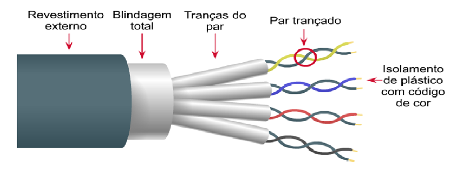

# Capítulo 2 – Transmissão de Sinais e Meios de Transmissão

No capítulo anterior, estabelecemos uma visão panorâmica sobre o que são as redes de computadores, seus componentes e as diferentes formas como podem ser organizadas. Agora, vamos mergulhar em um nível mais fundamental para responder a uma pergunta essencial: como a informação, que existe de forma abstrata em nossos dispositivos, consegue de fato viajar de um ponto a outro? A resposta está no processo de **transmissão de sinais**.

Para que a comunicação ocorra, os dados precisam ser convertidos em uma forma de energia que possa se propagar através de um meio físico, seja ele um cabo de cobre, uma fibra óptica ou o ar. Pense nisso como traduzir um pensamento em palavras faladas: a ideia (informação) é convertida em ondas sonoras (um sinal) que viajam pelo ar (o meio) até serem captadas e interpretadas por um ouvinte. Em redes de computadores, o princípio é o mesmo: a informação é **codificada** em um sinal elétrico, luminoso ou eletromagnético, que é então transmitido. No destino, o receptor, que conhece as regras da codificação, realiza o processo inverso, a **decodificação**, para recuperar a informação original.

Este capítulo explorará os dois tipos fundamentais de sinais, a forma como são representados por ondas e, posteriormente, os meios pelos quais eles viajam.

## Transmissão de Sinais Analógicos e Digitais

Toda informação a ser transmitida precisa ser representada por um sinal. Um **sinal** é a representação física e quantificável da informação, variando ao longo do tempo para carregar os dados. A forma como essa variação ocorre define as duas categorias primordiais de sinais.

### Sinais Analógicos: O Contínuo Fluir da Informação

Um sinal analógico é caracterizado por sua natureza **contínua**. Isso significa que, ao longo de um intervalo de tempo, o sinal pode assumir uma infinidade de valores dentro de sua faixa de variação. Não há "saltos" ou interrupções; a transição entre um valor e outro é suave e fluida.

Muitos fenômenos do mundo real são intrinsecamente analógicos. A nossa voz, por exemplo, é uma onda de pressão sonora que varia continuamente em amplitude e frequência. Outros exemplos clássicos incluem:

- **Termômetro de Mercúrio:** A altura da coluna de mercúrio sobe e desce de forma contínua com a variação da temperatura, podendo ocupar qualquer ponto intermediário na escala.
- **Velocímetro com Ponteiro:** O ponteiro de um velocímetro analógico se move suavemente pelo mostrador, representando todas as velocidades possíveis dentro de sua faixa de operação.
- **Música em um Disco de Vinil:** Os sulcos de um disco são uma gravação física e contínua da forma de onda do som original.

A principal desvantagem dos sinais analógicos é sua vulnerabilidade ao **ruído**. Como qualquer variação de intensidade é considerada parte da informação, qualquer interferência (eletromagnética, por exemplo) que se some ao sinal durante a transmissão é difícil de ser removida e degrada a qualidade da informação original.

### Sinais Digitais: A Precisão dos Passos Discretos

Em contraste, um sinal digital é **descontínuo** ou **discreto**. Em vez de variar suavemente, ele opera com um conjunto finito e predefinido de valores. A transição entre um valor e outro ocorre em "saltos" ou "degraus".

A forma mais comum de sinal digital é a binária, que utiliza apenas dois níveis para representar os bits 0 e 1. Por exemplo, um sistema pode definir que +5 volts representa o bit '1' e 0 volts representa o bit '0'. O sinal só pode existir nesses dois estados, e não nos valores intermediários como 2,5 volts ou 4 volts.

Toda a informação processada por computadores é, em sua essência, digital. Para ser transmitida, essa sequência de bits precisa ser codificada em um sinal digital.

- **Vantagem Principal:** A grande força dos sinais digitais é sua robustez e imunidade ao ruído. Se um sinal de +5 volts (representando '1') sofre uma pequena interferência e chega ao receptor como +4,5 volts, o receptor ainda pode facilmente discernir que o valor pretendido era '1'. Ele pode então regenerar o sinal original perfeitamente, eliminando o ruído acumulado no caminho. Essa capacidade de regeneração sem perdas é o que permite a transmissão de dados digitais por longas distâncias com altíssima fidelidade.

## Representando Sinais: O Mundo das Ondas

Seja um sinal analógico ou digital, uma forma poderosa de representá-lo e analisá-lo é através de **ondas**. Uma onda é uma perturbação que se propaga no tempo e no espaço. Para entender como as informações são codificadas em um sinal, precisamos conhecer os parâmetros fundamentais de uma onda periódica (uma onda que se repete em ciclos regulares).

- **Amplitude:** É a "altura" ou intensidade máxima da onda, medida a partir de seu ponto de repouso (o eixo central). Em um sinal, a amplitude geralmente carrega a "força" do sinal.
- **Frequência (f):** Representa o número de ciclos completos que uma onda realiza em um determinado período de tempo. A unidade padrão para frequência é o **Hertz (Hz)**, onde 1 Hz equivale a um ciclo por segundo. Frequências mais altas significam que a onda oscila mais rapidamente. Este conceito é familiar em nosso dia a dia, como nas frequências das estações de rádio (em Megahertz, MHz) ou na velocidade dos processadores (em Gigahertz, GHz).
- **Comprimento de Onda/Período (T):** É a distância física que um ciclo completo da onda ocupa no espaço. Existe uma relação inversa entre frequência e comprimento de onda: quanto maior a frequência, menor o comprimento de onda.
- **Fase (φ):** Descreve a posição da onda em relação ao seu ponto inicial (tempo zero). Mudanças na fase são uma técnica importante para codificar informações em um sinal (modulação de fase).

A velocidade com que um sinal se propaga em um meio é determinada pela relação entre sua frequência e seu comprimento de onda.

### Tipos de Ondas

Embora existam infinitas formas de onda, algumas são fundamentais para o estudo da transmissão de sinais.

- **Ondas Senoidais:** A onda senoidal é a forma de onda periódica mais básica e pura. Ela descreve uma oscilação suave e regular. É fundamental porque, de acordo com a teoria de Fourier, **qualquer outra forma de onda complexa pode ser decomposta em uma soma de múltiplas ondas senoidais** com diferentes amplitudes, frequências e fases. Por isso, a onda senoidal é o bloco de construção de todos os outros sinais.
- **Ondas Quadradas:** Caracterizadas por suas transições instantâneas entre dois níveis de amplitude (um valor mínimo e um máximo), as ondas quadradas são a representação visual ideal de um **sinal digital binário**. O nível alto pode representar um '1', e o nível baixo, um '0'. Na prática, para se transmitir uma onda que se aproxime de uma onda quadrada perfeita, o meio de transmissão precisa ser capaz de transportar uma gama muito ampla de frequências (ou seja, ter uma grande largura de banda), pois uma onda quadrada é, na verdade, a soma de uma onda senoidal fundamental e infinitas outras de frequência mais alta (harmônicos).
- **Ondas Triangulares e Dente de Serra:** Essas ondas, com suas subidas e descidas lineares, são menos comuns na transmissão de dados, mas são amplamente utilizadas em outras áreas da eletrônica, como na geração de sons em sintetizadores ou em circuitos de varredura de telas.

De posse desses conceitos básicos sobre a natureza dos sinais e sua representação em ondas, podemos agora avaliar as possíveis formas de degradação que um sinal pode sofrer ao viajar por um meio de transmissão.

## A Realidade da Transmissão: Degradação e Perda de Sinal

Em um mundo ideal, o sinal enviado pelo transmissor chegaria ao receptor de forma idêntica, perfeita e instantânea. No entanto, na prática, todo sinal que viaja por um meio de transmissão, seja ele um cabo de cobre, uma fibra de vidro ou o próprio ar, está sujeito a imperfeições que o degradam e distorcem. Pense em gritar para um amigo do outro lado de um salão lotado: sua voz chegará mais fraca (atenuação), será misturada com o barulho das outras conversas (ruído) e poderá ecoar nas paredes (reflexão).

Compreender essas formas de degradação é fundamental para o projeto de sistemas de comunicação robustos e confiáveis. Os três principais vilões que devemos combater na transmissão de sinais são a atenuação, o ruído e a reflexão.

### Atenuação: A Perda de Força do Sinal

A **atenuação** é a redução gradativa da força, ou amplitude, de um sinal à medida que ele se propaga pelo meio. Essa perda de energia é um fenômeno natural e inevitável, causado principalmente pela resistência do próprio meio, que absorve parte da energia do sinal e a converte em calor. A atenuação aumenta com a distância: quanto mais longe o sinal precisa viajar, mais fraco ele se torna.

Se um sinal for atenuado a ponto de sua amplitude se tornar muito próxima à do ruído de fundo, o receptor não conseguirá mais distingui-lo e interpretar a informação corretamente. Para combater a atenuação em transmissões de longa distância, são utilizados dispositivos para restaurar a força do sinal:

- **Em sinais analógicos, usam-se amplificadores.** Eles aumentam a amplitude do sinal, mas possuem uma desvantagem: amplificam também todo o ruído que o sinal acumulou até aquele ponto.
- **Em sinais digitais, usam-se repetidores.** Estes dispositivos são mais inteligentes. Eles recebem o sinal digital atenuado e distorcido, o decodificam para a sequência original de 1s e 0s, e então geram um sinal completamente novo, limpo e com a força original, para retransmiti-lo. Essa capacidade de regeneração é uma das principais vantagens da comunicação digital.

A atenuação não é uniforme para todas as frequências; alguns meios atenuam certas frequências mais do que outras, um fator crucial no projeto de sistemas de comunicação.

### Ruído: A Intervenção de Sinais Indesejados

O **ruído** consiste em qualquer energia elétrica, luminosa ou eletromagnética indesejada que se soma ao sinal original, deformando-o. Enquanto a atenuação enfraquece o sinal, o ruído o "suja". Existem diversas fontes de ruído, tanto internas quanto externas ao sistema:

- **Ruído Térmico:** Gerado pelo movimento aleatório dos elétrons em qualquer componente eletrônico que esteja acima do zero absoluto. É um ruído de fundo inevitável, presente em todos os sistemas de comunicação.
- **Ruído de Intermodulação:** Ocorre quando sinais de diferentes frequências compartilham o mesmo meio, podendo se misturar e criar novas frequências espúrias que interferem com os sinais originais.
- **Diafonia (Crosstalk):** Também conhecido como "linha cruzada", é um tipo de interferência causado pelo acoplamento de um sinal de um cabo para um cabo adjacente. É o que acontece quando se ouve uma conversa fantasma de outra linha em uma ligação telefônica antiga. É uma grande preocupação em cabos de rede com múltiplos pares de fios.
- **Ruído de Impulso:** São picos de energia irregulares e de curta duração, geralmente causados por fontes externas como raios, motores elétricos ou chaves de alta potência. É uma causa significativa de erros em transmissões digitais.

### Reflexão ou Eco: O Sinal que Bate e Volta

A **reflexão** é um fenômeno que ocorre quando um sinal, ao viajar pelo meio, encontra uma mudança abrupta em suas características, fazendo com que parte da energia do sinal seja "rebatida" de volta na direção da origem. Esse sinal refletido, também chamado de **eco**, viaja na contramão e pode interferir com os sinais que vêm logo atrás dele, causando distorção.

A principal causa da reflexão é a falta de "casamento de impedância" entre os componentes da rede. Impedância é, de forma simplificada, a oposição que um meio oferece à passagem de um sinal. Se um sinal viajando por um cabo de uma certa impedância encontra um conector ou outro cabo com uma impedância diferente, ocorrerá uma reflexão. A solução é garantir que todos os componentes de um link de comunicação — cabos, conectores e os próprios dispositivos — possuam a mesma impedância característica.

### O Estudo do Meio: Minimizando a Degradação na Prática

Para projetar sistemas de comunicação eficientes, os engenheiros estudam exaustivamente as propriedades dos meios de transmissão para entender como minimizar os efeitos da degradação. O objetivo é encontrar as "janelas" de operação ideais — faixas de frequência ou comprimentos de onda onde a atenuação e o ruído são menores.

Um exemplo clássico desse estudo é visto na tecnologia de fibra óptica. O gráfico abaixo ilustra a perda de sinal (atenuação) em uma fibra óptica em função do comprimento de onda da luz utilizada.

Analisando o gráfico, percebe-se que a atenuação não é constante. Existem "vales" onde a perda de sinal é significativamente menor. As faixas de operação para sistemas de fibra óptica, conhecidas como **janelas de transmissão**, não são escolhidas ao acaso; elas são posicionadas exatamente nesses vales de baixa atenuação. O gráfico destaca três janelas principais:

- A **1ª janela**, em torno de 0,85 µm (ou 850 nm).
- A **2ª janela**, em torno de 1,31 µm (ou 1310 nm).
- A **3ª janela**, em torno de 1,55 µm (ou 1550 nm).

Nota-se que a terceira janela é a que apresenta o menor nível de atenuação de todas, tornando-a a faixa preferencial para sistemas de comunicação óptica de longa distância, pois permite que o sinal viaje por muito mais quilômetros antes de precisar de um repetidor.

## Da Voz ao Bit, do Bit à Onda: Digitalização e Codificação de Linha

Já estabelecemos que os computadores operam em um mundo digital, baseado em bits (0s e 1s), enquanto muitos fenômenos do mundo real, como a voz humana, são analógicos. Para que um sinal analógico possa ser processado, armazenado e transmitido com a robustez de um sistema digital, ele precisa primeiro ser convertido em uma sequência de bits. Esse processo é chamado de **digitalização**.

Contudo, ter uma sequência de bits é apenas metade da batalha. Para transmitir essa sequência por um cabo, precisamos de um método para representar esses 0s e 1s como sinais elétricos ou luminosos. Essa segunda etapa é a **codificação de linha**. Vamos explorar os dois processos.

### Digitalização de Sinais Analógicos

Converter a infinita variação de um sinal analógico em uma representação digital finita é um processo de aproximação realizado em três etapas fundamentais.

#### Amostragem (Sampling)

O primeiro passo é a **amostragem**. Nela, o sinal analógico contínuo é medido em intervalos de tempo regulares e discretos, como se estivéssemos tirando "fotografias" do sinal em instantes específicos. O resultado é uma série de "amostras", cada uma com um valor de amplitude correspondente à intensidade do sinal naquele exato momento.

Para que a digitalização seja fiel ao original, a frequência com que essas amostras são coletadas (a **taxa de amostragem**) é crucial. O **Teorema de Nyquist-Shannon**, um princípio fundamental da teoria da informação, estabelece que a taxa de amostragem deve ser, no mínimo, o dobro da maior frequência contida no sinal analógico original. É por isso que, para digitalizar a voz humana (cujas frequências mais importantes vão até cerca de 4.000 Hz), o padrão da telefonia utiliza uma taxa de amostragem de 8.000 amostras por segundo.

#### Quantização (Quantization)

Após a amostragem, temos uma coleção de amostras com valores de amplitude que ainda podem ser infinitos (ex: 2,1756 V, 3,4891 V, etc.). A **quantização** é o processo de "arredondar" esses valores para um número finito de níveis predefinidos. O sinal é sobreposto a uma régua com um número limitado de degraus, e cada amostra é forçada a assumir o valor do degrau mais próximo.

O número de degraus disponíveis determina a precisão da representação. Se usarmos mais degraus (mais níveis), a aproximação será mais fiel ao sinal original, resultando em maior qualidade. A diferença entre o valor real da amostra e o valor quantizado é chamada de **erro de quantização**.

#### Codificação (Coding)

A etapa final é a **codificação**. Nela, um código binário único é atribuído a cada um dos níveis de quantização. Por exemplo, se tivermos 8 níveis de quantização, precisaremos de 3 bits para representar todos eles (pois 23=8). O nível 0 poderia ser codificado como "000", o nível 1 como "001", e assim por diante, até o nível 7 como "111".

O resultado final deste processo de três passos é uma sequência de bits — um fluxo de dados digitais que representa, de forma aproximada, o sinal analógico original.

### Codificação de Linha: Representando Bits no Meio Físico

Com o fluxo de bits em mãos, o desafio agora é transmiti-lo fisicamente. A **codificação de linha** (ou _line coding_) é o conjunto de regras usado para converter essa sequência de 0s e 1s em um sinal elétrico real que viajará pelo cabo. A escolha do esquema de codificação é importante para resolver vários desafios práticos, como a sincronização entre transmissor e receptor e a eficiência no uso do meio.

A seguir, alguns esquemas de codificação importantes.

|Tipo de Codificação|Identificação do bit 0|Identificação do bit 1|
|---|---|---|
|**NRZI (Non-Return-to-Zero Inverted)**|Sem transição de voltagem no início do intervalo do bit.|Ocorre uma transição de voltagem (de alto para baixo ou de baixo para alto) no início do intervalo do bit.|
|**Manchester**|Transição do nível alto para o baixo no _meio_ do intervalo do bit.|Transição do nível baixo para o alto no _meio_ do intervalo do bit.|
|**Manchester Diferencial**|Ocorre uma transição de voltagem no _início_ do intervalo do bit.|Sem transição de voltagem no _início_ do intervalo do bit. (Ambos ainda possuem uma transição no meio para sincronismo).|

Vamos detalhar os mais relevantes:

- **NRZI (Non-Return-to-Zero Inverted):** Neste esquema, a informação não está no nível de voltagem em si, mas na _mudança_ ou _transição_ de nível. Um bit '1' é sinalizado por uma transição de voltagem no início do seu tempo de duração, enquanto um bit '0' é sinalizado pela ausência de transição. O problema do NRZI é que uma longa sequência de 0s não geraria transições, o que poderia fazer com que o receptor perdesse o sincronismo de seu relógio.
- **Manchester:** Este esquema resolve o problema da sincronização de forma engenhosa. Cada bit, seja 0 ou 1, possui uma transição de voltagem exatamente no meio de seu intervalo de tempo. Para um bit '0', a transição é de um nível de voltagem alto para um baixo; para um bit '1', a transição é de baixo para alto. Essa transição constante no meio de cada bit permite que o receptor ajuste continuamente seu relógio, garantindo um sincronismo perfeito. A desvantagem é a baixa eficiência, pois exige o dobro da largura de banda de esquemas mais simples para transmitir a mesma quantidade de dados. É um esquema de codificação clássico e de grande importância histórica, tendo sido utilizado no padrão original da Ethernet.
- **Manchester Diferencial:** Uma variação do Manchester que combina a transição no meio do bit (para sincronismo) com a codificação na transição do início do bit (típica de esquemas diferenciais). Um '0' é representado pela presença de uma transição no início do intervalo, enquanto um '1' é representado pela ausência dessa transição inicial. Todos os bits continuam tendo a transição no meio do caminho para manter o relógio sincronizado.

## O Espectro da Comunicação: Banda, Capacidade e Multiplexação

Todo meio de transmissão, seja ele um cabo ou o ar, possui características físicas que limitam a quantidade de informação que pode ser transportada. Assim como um cano possui um diâmetro que restringe o fluxo de água, um meio de comunicação possui uma "largura" que limita o fluxo de dados. Nesta seção, vamos explorar o que é essa largura (a banda), como calcular a capacidade máxima de um canal e como as redes utilizam técnicas inteligentes para "alargar a estrada" e permitir que múltiplos sinais viajem simultaneamente.

### Banda Base vs. Banda Passante: A Forma Original e a Adaptada

A forma como um sinal ocupa o espectro de frequências de um meio dá origem a duas modalidades de transmissão:

- **Transmissão em Banda Base (Baseband):** Refere-se à transmissão de um sinal em sua faixa de frequência original, sem alterá-la. Em sistemas digitais, isso geralmente significa que o sinal ocupa todo o espectro de frequência do meio, começando perto de 0 Hz. É como um trem que usa toda a linha férrea para si durante sua passagem; nenhum outro trem pode usar a linha naquele momento. A maioria das redes locais cabeadas, como as baseadas em Ethernet, opera em banda base.
- **Transmissão em Banda Passante (Passband ou Broadband):** Esta abordagem utiliza uma técnica chamada **modulação**. O sinal original (em banda base) é usado para modificar as características de uma onda de frequência mais alta, chamada de onda portadora. Esse processo "transporta" o sinal original para uma faixa de frequência específica e mais elevada dentro do meio. O grande benefício é que podemos fazer isso com vários sinais diferentes, colocando cada um em sua própria "faixa" de frequência, permitindo que todos trafeguem simultaneamente pelo mesmo meio. É como uma rodovia com múltiplas pistas, onde cada pista (faixa de frequência) pode ser usada por um carro (sinal) diferente ao mesmo tempo. O equipamento que realiza esse processo de modulação (na transmissão) e demodulação (na recepção) é o **MODEM** (MOdulador-DEModulador). Exemplos clássicos de transmissão em banda passante são o rádio, a TV a cabo e os serviços de internet ADSL.

### Largura de Banda e a Capacidade do Canal

O conceito de **largura de banda** (_bandwidth_) é fundamental para entender o potencial de um meio. Formalmente, é a diferença entre a maior e a menor frequência que um canal de comunicação pode transportar, medida em Hertz (Hz). Essa limitação pode ser uma característica intrínseca do meio físico ou pode ser definida artificialmente por filtros.

É comum haver uma confusão entre largura de banda e taxa de transmissão, mas são conceitos distintos:

- **Largura de Banda:** É o potencial teórico do meio, a "largura da estrada" (em Hz).
- **Taxa de Transmissão (ou Vazão):** É a quantidade real de bits que são transmitidos com sucesso por segundo (em bps, Mbps, Gbps), a "quantidade de carros que passam pela estrada".

Embora distintos, os conceitos estão diretamente relacionados: uma maior largura de banda geralmente permite uma maior taxa de transmissão. A capacidade máxima de um canal, ou seja, sua taxa de transmissão teórica mais alta, depende não apenas da largura de banda, mas também do nível de ruído e da complexidade da codificação do sinal.

Dois teoremas importantes nos ajudam a calcular essa capacidade:

**Teorema de Nyquist (para um canal sem ruído):** Harry Nyquist estabeleceu que a capacidade máxima de um canal ideal (sem ruído) é diretamente proporcional à sua largura de banda e ao número de níveis de sinal utilizados. Para um sinal binário (dois níveis), a fórmula é simplificada para:

$C=2⋅B$

Onde C é a capacidade em bits por segundo (bps) e B é a largura de banda em Hertz (Hz). Isso mostra que, em um canal perfeito, a cada 1 Hz de largura de banda, podemos transmitir no máximo 2 bps.

**Teorema de Shannon (para um canal com ruído):** Claude Shannon desenvolveu uma fórmula mais realista, que leva em conta o ruído, um fator sempre presente. A **Capacidade de Shannon** estabelece um limite superior absoluto e intransponível para a taxa de dados em um canal ruidoso:

$C=B⋅log_2​(1+\frac{S}{N})$

Onde C é a capacidade do canal (bps), B é a largura de banda (Hz), e S/N é a **relação sinal-ruído** (_Signal-to-Noise Ratio_ - SNR), que compara a potência do sinal (S) com a potência do ruído (N) no canal. Este teorema nos diz que, não importa quão sofisticada seja a tecnologia, a presença de ruído impõe um limite de velocidade fundamental a qualquer canal de comunicação.

### Modos de Propagação de Ondas Sem Fio

A frequência de operação de um sinal de rádio também determina a forma como ele se propaga através do espaço, o que é crucial para o projeto de sistemas de comunicação sem fio:

- **Ondas de Superfície (Ground Waves):** Aplicam-se a sinais de baixa frequência (geralmente abaixo de 2 MHz). Essas ondas tendem a seguir a curvatura da Terra, propagando-se rente à superfície e podendo alcançar longas distâncias. São utilizadas, por exemplo, em transmissões de rádio AM.
- **Ondas Celestes ou Ionosféricas (Sky Waves):** Na faixa de 2 a 30 MHz, as ondas de rádio podem ser refletidas pela ionosfera (uma camada eletricamente carregada na alta atmosfera) de volta para a Terra. Esse fenômeno de "ricochete" permite a comunicação de rádio de ondas curtas entre pontos muito distantes no globo, superando o horizonte.
- **Ondas Diretas (Line-of-Sight Waves):** Para frequências acima de 30 MHz, as ondas se comportam de forma muito parecida com a luz, viajando em linhas retas. Para que a comunicação ocorra, as antenas do transmissor e do receptor precisam ter visibilidade direta uma da outra, sem grandes obstáculos no caminho. Enlaces de micro-ondas, rádio FM, TV e comunicação via satélite são exemplos que utilizam a propagação por linha de visada.

### Multiplexação: Otimizando o Meio de Transmissão

A **multiplexação** é a técnica que permite a transmissão de múltiplos sinais de diferentes fontes por um único meio de comunicação, de forma simultânea e sem interferência. Ela otimiza o uso do meio, aumentando drasticamente a sua eficiência. As principais formas de multiplexação são:

- **FDM (Frequency-Division Multiplexing - Multiplexação por Divisão de Frequência):** Neste método, a largura de banda total do meio é dividida em várias faixas de frequência menores (canais), e cada sinal a ser transmitido é alocado em um desses canais exclusivos. É a técnica usada na radiodifusão (cada estação de rádio tem sua própria frequência) e nos sistemas de TV a cabo.
- **TDM (Time-Division Multiplexing - Multiplexação por Divisão no Tempo):** Aqui, os usuários compartilham o meio revezando-se no tempo. A cada usuário é atribuído um pequeno intervalo de tempo (_time slot_), e eles transmitem seus dados em sequência, um após o outro. O TDM e o FDM podem ser usados em conjunto.
- **CDMA (Code-Division Multiple Access - Acesso Múltiplo por Divisão de Código):** Uma técnica mais complexa onde todos os usuários transmitem simultaneamente na mesma faixa de frequência. A separação dos sinais é feita através da atribuição de um código matemático único para cada usuário, permitindo que o receptor "filtre" e reconheça apenas o sinal destinado a ele.
- **WDM (Wavelength-Division Multiplexing - Multiplexação por Divisão de Comprimento de Onda):** É a versão da FDM para o mundo da fibra óptica. Diferentes sinais são transmitidos através da mesma fibra usando diferentes comprimentos de onda (ou "cores") de luz.
    - **DWDM (Dense WDM):** Uma forma otimizada que consegue "empacotar" os comprimentos de onda de forma muito mais próxima, permitindo a criação de uma quantidade massiva de canais (centenas) em uma única fibra, o que possibilita as altíssimas taxas de transmissão da internet moderna.

## Meios de Transmissão Guiados e Não Guiados

A transmissão de um sinal requer um caminho, uma "estrada" que o leve do ponto A ao ponto B. Esse caminho é o que chamamos de **meio de transmissão** ou, como utiliza o autor Tanenbaum, meio de comunicação. Ele representa o canal físico pelo qual o fluxo de bits, já convertido em um sinal, efetivamente trafega.

A escolha de um meio de transmissão para uma rede é uma das decisões de engenharia mais importantes, pois cada um possui características distintas que afetam diretamente o desempenho e o custo do projeto. Fatores como o alcance máximo do sinal, a faixa de frequência que suporta (largura de banda), o atraso na propagação (retardo), o custo por metro e a facilidade de instalação e manutenção devem ser cuidadosamente ponderados.

Os meios de transmissão são categorizados em dois grandes grupos:

- **Meios Guiados:** Nestes, o sinal é confinado e guiado ao longo de um caminho físico sólido. A energia do sinal (seja elétrica ou luminosa) é direcionada por este conduto. Exemplos incluem os cabos metálicos, como o cabo coaxial e o cabo par trançado, e a fibra óptica.
- **Meios Não Guiados:** Aqui, não existe um caminho físico para confinar o sinal. Ele se propaga livremente pelo espaço. As ondas de rádio e outras formas de radiação eletromagnética que viajam pelo ar ou pelo vácuo são os exemplos clássicos de meios não guiados.

A seguir, vamos explorar em detalhe os principais tipos de meios, começando pelos guiados.

### Meios de Transmissão Guiados

Os meios de transmissão são os caminhos físicos através dos quais os sinais de dados viajam de um ponto a outro em uma rede. Eles podem ser divididos em duas grandes famílias: meios guiados e meios não guiados. Os meios guiados, como o nome sugere, utilizam um cabo físico para confinar e guiar a energia eletromagnética do sinal. Nesta seção, abordaremos os principais tipos de cabos utilizados em redes de computadores.

#### Cabo Coaxial

O cabo coaxial é um meio guiado metálico que, por muitos anos, foi a espinha dorsal de diversas redes, incluindo as primeiras implementações da Ethernet. Embora seu uso em redes locais modernas tenha diminuído, ele ainda é fundamental na infraestrutura de serviços como TV a cabo e internet banda larga fornecida por essas operadoras, e seu conhecimento é importante para entender a evolução das redes.

Sua estrutura física é a chave para seu desempenho. Um cabo coaxial é composto por quatro camadas concêntricas:

1. **Núcleo Condutor:** Um fio sólido ou trançado de cobre que transporta o sinal principal.
2. **Isolante Dielétrico:** Uma camada de plástico espessa que envolve o núcleo, mantendo-o eletricamente isolado da camada seguinte.
3. **Malha Condutora (Blindagem):** Uma malha de cobre ou alumínio trançada que envolve o isolante. Ela atua como o segundo condutor do circuito e, crucialmente, como uma blindagem que protege o sinal do núcleo contra interferências eletromagnéticas externas (EMI).
4. **Capa Externa:** Uma cobertura de plástico (geralmente PVC) que protege o cabo contra danos físicos e ambientais.

Essa construção coaxial faz com que o campo eletromagnético fique confinado no espaço entre o núcleo e a malha, o que torna o cabo bastante robusto contra ruídos externos e também impede que o próprio sinal irradie e cause interferência em cabos próximos.

##### Características e Aplicações

Em comparação com o cabo de par trançado, o cabo coaxial geralmente permite transmissões por **distâncias superiores** sem a necessidade de um repetidor. No entanto, ele é **mais caro e significativamente menos flexível**, tornando sua instalação em dutos e paredes mais trabalhosa.

O cabo coaxial suporta uma **largura de banda maior** que os cabos de par trançado mais simples, o que o torna ideal para aplicações de banda passante (broadband), como a transmissão simultânea de centenas de canais de TV. Contudo, o sinal sofre com a **atenuação** em distâncias longas, especialmente em altas frequências.

##### Tipos de Cabo Coaxial em Redes

No contexto de redes Ethernet, dois padrões históricos são importantes:

- **10BASE5 (Thicknet):** Também conhecido como "cabo coaxial grosso", foi o padrão original da Ethernet. Era um cabo rígido e caro que permitia uma taxa de 10 Mbps em segmentos de até 500 metros.
- **10BASE2 (Thinnet):** Uma alternativa mais barata e flexível, o "cabo coaxial fino" também suportava 10 Mbps, mas com uma distância máxima por segmento de 185 metros.

Os conectores mais comuns associados ao cabo coaxial são o **conector BNC** (usado em redes Thinnet) e o **conector do tipo F**, que é o conector rosqueável padrão para instalações de TV a cabo e internet.

#### Cabo de Par Trançado (Twisted Pair)

O cabo de par trançado é, sem dúvida, o meio guiado mais utilizado nas redes locais (LANs) em todo o mundo. Sua popularidade massiva se deve a um excelente **custo-benefício**, à **facilidade de instalação** devido à sua alta maleabilidade e à sua capacidade de suportar taxas de transmissão muito elevadas, superando em muitas vezes as dos padrões de cabo coaxial para redes.

Como o nome indica, o cabo é constituído por múltiplos pares de fios de cobre, geralmente quatro pares, que são trançados entre si ao longo de toda a extensão do cabo.

##### O Segredo da Torção

A característica mais engenhosa deste cabo é justamente a torção dos pares. Quando uma corrente elétrica passa por um fio, ela gera um campo eletromagnético ao seu redor. Em um ambiente com vários cabos próximos, esses campos podem induzir sinais indesejados (ruído) nos fios vizinhos, um fenômeno conhecido como interferência ou diafonia (_crosstalk_).

Ao trançar os dois fios de um mesmo par, os campos eletromagnéticos gerados por eles tendem a se cancelar mutuamente. Da mesma forma, qualquer interferência externa que atinja o par de fios tende a afetar ambos os fios de maneira quase idêntica. O receptor, ao medir a _diferença_ de sinal entre os dois fios do par (transmissão diferencial), consegue anular grande parte desse ruído comum, recuperando o sinal original com muito mais clareza. Portanto, a torção é um método simples, mas extremamente eficaz, para reduzir o ruído e a interferência externa.

##### Categorias de Desempenho

Nem todos os cabos de par trançado são iguais. Para padronizar o desempenho e garantir a interoperabilidade, organizações como a TIA/EIA (Telecommunications Industry Association/Electronic Industries Alliance) definem diferentes **categorias** (abreviadas como "CAT").

Cada categoria especifica a frequência máxima (medida em Megahertz, MHz) que o cabo suporta com integridade, o que se traduz diretamente na taxa de transmissão de dados (medida em Megabits ou Gigabits por segundo, Mbps ou Gbps) que ele pode alcançar. De modo geral, para todas as categorias destinadas a redes de dados Ethernet, aplica-se uma distância máxima de 100 metros por segmento de cabo para garantir a qualidade do sinal.

A evolução das categorias reflete a crescente demanda por velocidade nas redes:

A tabela abaixo apresenta uma comparação entre as principais categorias, suas capacidades e aplicações típicas.

|Categoria|Taxa Máxima de Transmissão|Frequência Máxima|Aplicação Típica|
|---|---|---|---|
|**CAT 1**|Até 1 Mbps|1 MHz|Voz analógica (telefonia antiga).|
|**CAT 2**|4 Mbps||Redes IBM Token Ring.|
|**CAT 3**|10/16 Mbps|16 MHz|Padrão para redes Ethernet 10BASE-T.|
|**CAT 4**|16/20 Mbps|20 MHz|Redes Token Ring de 16 Mbps.|
|**CAT 5**|100 Mbps (1 Gbps com 4 pares)|Até 100 MHz|Largamente substituído pelo CAT 5e; usado em Fast Ethernet (100BASE-TX) e no início do Gigabit Ethernet (1000BASE-T).|
|**CAT 5e**|1 Gbps (suporta até 10 Gbps em protótipos)|Até 125 MHz|Padrão dominante por muitos anos para Gigabit Ethernet (1000BASE-T).|
|**CAT 6**|10 Gbps (até 55 metros)|Até 250 MHz|Padrão comum para novas instalações, suporta 10 Gigabit Ethernet em distâncias menores (10GBASE-T).|
|**CAT 6A**|10 Gbps (até 100 metros)|Até 500 MHz|Padrão recomendado para novas instalações que exigem 10 Gigabit Ethernet (10GBASE-T) na distância máxima.|
|**CAT 7**|10 Gbps (e superior)|600-700 MHz|Utilizado para 10 Gigabit Ethernet e futuras aplicações, como vídeo de alta definição. Requer blindagem individual dos pares.|
|**CAT 8**|25 a 40 Gbps|Até 2 GHz|Uso específico em datacenters para interconexões de alta velocidade entre servidores e switches, com distância limitada a 30 metros.|

##### Tipos de Blindagem

Além da categoria de desempenho, os cabos de par trançado são classificados quanto à presença e ao tipo de blindagem utilizada para proteção adicional contra interferências.

O tipo mais comum e de menor custo é o **UTP, ou U/UTP, (Unshielded Twisted Pair)**, ou Par Trançado Sem Blindagem. Ele não possui nenhuma camada de proteção extra além da capa plástica externa, confiando unicamente no efeito de cancelamento do trançamento dos pares. É o cabo utilizado na grande maioria das instalações de escritório e residenciais.

Para ambientes com maior nível de interferência eletromagnética, como chão de fábrica, hospitais (próximo a equipamentos de imagem) ou locais com muitos cabos de energia passando em paralelo, são utilizados os cabos blindados. Existem diferentes níveis de blindagem:

- **FTP (Foiled Twisted Pair):** Este cabo possui uma blindagem mais simples, composta por uma única folha de alumínio ou aço que envolve todos os quatro pares de uma vez. O objetivo dessa folha é proteger o cabo como um todo contra a interferência eletromagnética externa (EMI). No entanto, ela não oferece proteção contra a interferência gerada entre os próprios pares de fios dentro do cabo, um fenômeno conhecido como _Crosstalk_ ou diafonia.
- **STP (Shielded Twisted Pair):** Este termo é frequentemente usado para descrever cabos onde cada par de fios é individualmente blindado com uma malha ou folha metálica. Essa blindagem individual é extremamente eficaz em reduzir o "Crosstalk" entre os pares, melhorando a integridade do sinal. Isso permite que o cabo opere com maior confiabilidade em distâncias próximas ao limite de 100 metros ou em ambientes com alta interferência. Uma de suas principais aplicações é em datacenters, para interligações de curto alcance entre servidores e switches. Um exemplo é o padrão 1000BASE-CX, que utiliza cabo STP para conexões de 1 Gbps em distâncias de até 25 metros.
- **SSTP ou SFTP (Screened Shielded/Foiled Twisted Pair):** Considerado o tipo mais robusto, ele combina as duas abordagens: possui uma blindagem individual para cada par e uma blindagem global (geralmente uma malha) que envolve todo o conjunto. Oferece a máxima proteção tanto contra interferências externas quanto contra o _crosstalk_, sendo indicado para os ambientes mais hostis eletromagneticamente.

É possível notar pela imagem acima que existe uma nomenclatura mais específica para cada tipo de cabo, que é mais precisa do que os termos genéricos como FTP e STP. Essa nomenclatura segue o formato **X/YTP**, que ajuda a descrever exatamente como o cabo é construído.

A lógica é a seguinte:

- **X**: Descreve a blindagem **geral** ou externa do cabo.
- **Y**: Descreve a blindagem **individual** dos pares de fios.
- **TP**: Significa Twisted Pair (Par Trançado).

As letras utilizadas para **X** e **Y** são:

- **U** = Unshielded (Sem blindagem)
- **F** = Foil (Blindagem com folha ou lâmina de alumínio)
- **S** = Screened (Blindagem com malha de fios metálicos, geralmente cobre ou alumínio)
- **SF** = Screened + Foil (Possui tanto a blindagem de malha quanto a de folha)

Descrevendo cada tipo da imagem conforme a tabela:

| Tipo                                             | Estrutura                                                                                                                                               | Descrição                                                                                                                                                                                                                                       |
| ------------------------------------------------ | ------------------------------------------------------------------------------------------------------------------------------------------------------- | ----------------------------------------------------------------------------------------------------------------------------------------------------------------------------------------------------------------------------------------------- |
| U/UTP (Unshielded/Unshielded Twisted Pair)       | Não possui nenhuma blindagem, nem uma geral envolvendo todos os pares (primeiro U), nem individual em cada par (segundo UTP).                           | Este é o cabo de par trançado comum, o mais flexível e de menor custo. Sua proteção contra interferência depende exclusivamente do trançamento dos fios.                                                                                        |
| F/UTP (Foiled/Unshielded Twisted Pair)           | Possui uma blindagem geral feita com uma folha de alumínio (**F**) que envolve os pares, mas os pares em si não possuem blindagem individual (**UTP**). | Este é o cabo comumente chamado de **FTP**. Ele oferece boa proteção contra interferências eletromagnéticas externas (EMI), mas não melhora a proteção contra a diafonia (crosstalk) entre os pares internos.                                   |
| S/UTP (Screened/Unshielded Twisted Pair)         | Possui uma blindagem geral feita com uma malha metálica (**S**) envolvendo os pares, que por sua vez não são blindados individualmente (**UTP**).       | A malha oferece uma proteção mais robusta que a folha, especialmente contra interferências de baixa frequência, além de maior resistência mecânica.                                                                                             |
| SF/UTP (Screened+Foiled/Unshielded Twisted Pair) | Possui uma dupla blindagem geral, com uma malha e uma folha de alumínio (**SF**) envolvendo os pares, que não são blindados individualmente (**UTP**).  | Oferece excelente proteção contra interferência externa em uma vasta gama de frequências, combinando os benefícios da blindagem de malha e de folha.                                                                                            |
| U/FTP (Unshielded/Foiled Twisted Pair)           | Não possui uma blindagem geral (U), mas cada par de fios é individualmente envolto em sua própria folha de alumínio (**FTP**).                          | Este projeto é extremamente eficaz na prevenção de crosstalk entre os pares, melhorando significativamente a qualidade do sinal. É tecnicamente um tipo de **STP** (Shielded Twisted Pair), focado na proteção interna.                         |
| F/FTP (Foiled/Foiled Twisted Pair)               | Cada par é blindado individualmente com uma folha de alumínio (**FTP**), e o conjunto todo ainda é envolvido por uma blindagem geral de folha (**F**).  | Oferece proteção tanto contra a interferência externa (blindagem geral) quanto contra o crosstalk interno (blindagem individual).                                                                                                               |
| S/FTP (Screened/Foiled Twisted Pair)             | Cada par é blindado individualmente com folha de alumínio (**FTP**), e o conjunto é envolto por uma blindagem geral de malha (**S**).                   | Este é o cabo frequentemente chamado de **SSTP** ou **SFTP** na documentação anterior. É um dos cabos mais robustos, oferecendo excelente proteção contra todos os tipos de ruído e alta durabilidade mecânica.                                 |
| SF/FTP (Screened+Foiled/Foiled Twisted Pair)     | A proteção máxima. Cada par é blindado com folha (**FTP**), e o cabo todo possui uma dupla blindagem externa de malha e folha (**SF**).                 | Este é o cabo com o maior nível de blindagem disponível, projetado para os ambientes mais hostis em termos de interferência eletromagnética, garantindo a máxima integridade do sinal para aplicações de altíssima velocidade e missão crítica. |

#### Cabo de Fibra Óptica

A fibra óptica representa um salto tecnológico em relação aos meios baseados em cobre. Em vez de transmitir dados como sinais elétricos, ela os transmite como **pulsos de luz** através de finíssimos filamentos de vidro ou plástico de altíssima pureza. Esta abordagem confere à fibra óptica suas características mais marcantes: uma capacidade de transmissão (largura de banda) imensa, a capacidade de alcançar distâncias muito longas com baixa atenuação e, por utilizar luz, uma **imunidade completa a interferências eletromagnéticas (EMI)** e radiofrequências (RFI), tornando-a o meio de transmissão mais seguro e confiável disponível.

Sua composição, baseada em sílica (vidro) e plástico, também a torna altamente durável e resistente à corrosão, um fator importante para cabos instalados no subsolo ou em ambientes hostis.

Um cabo de fibra óptica é composto, em sua essência, por três camadas:

1. **Núcleo (Core):** É o centro da fibra, o filamento de vidro por onde a luz efetivamente viaja.
2. **Cobertura/Casca (Cladding):** Uma camada de vidro ou plástico que envolve o núcleo. A casca possui um índice de refração ligeiramente inferior ao do núcleo.
3. **Revestimento (Coating/Jacket):** Uma ou mais camadas de plástico que protegem a fibra contra umidade, choques e danos físicos.

O funcionamento da fibra se baseia em um fenômeno da física chamado **Reflexão Interna Total**. Devido à diferença no índice de refração entre o núcleo e a casca, quando um pulso de luz é injetado no núcleo em um determinado ângulo, ele atinge a fronteira entre o núcleo e a casca e é completamente refletido de volta para o interior do núcleo, como se estivesse ricocheteando em um espelho perfeito. Esse processo se repete milhões de vezes, aprisionando a luz e guiando-a por toda a extensão da fibra com perdas mínimas.

##### Fontes de Luz: LED vs. Laser

Para gerar os pulsos de luz, dois tipos de fontes são comumente utilizados:

- **LED (Light Emitting Diode):** São fontes de luz mais baratas, com maior vida útil e mais resistentes a variações de temperatura. No entanto, a luz que produzem é menos focada e mais dispersa, o que limita sua eficiência, a taxa de transmissão e a distância alcançável. São utilizados exclusivamente em fibras do tipo multimodo.
- **Laser (Light Amplification by Stimulated Emission of Radiation):** Lasers semicondutores geram um feixe de luz coerente, monocromático e altamente focado. São muito mais eficientes, permitindo taxas de transmissão altíssimas e a cobertura de longas distâncias. Contudo, são mais caros e sensíveis a variações de temperatura. Com o advento das redes de alta velocidade, os lasers se tornaram a fonte de luz padrão, podendo ser usados tanto em fibras multimodo quanto monomodo.

##### Tipos de Fibra: Multimodo vs. Monomodo

A principal distinção entre os tipos de fibra óptica reside no diâmetro de seus núcleos, o que determina como os raios de luz se propagam internamente.

###### Fibra Multimodo (Multimode Fiber - MMF)

A fibra multimodo possui um núcleo relativamente grande (tipicamente de 50 a 62,5 mícrons de diâmetro). Esse diâmetro maior permite que os pulsos de luz viajem através do núcleo em múltiplos caminhos ou "modos" simultaneamente, como ilustrado na figura abaixo.

Essa propagação em múltiplos modos causa um problema chamado **dispersão modal**. Como cada modo percorre uma distância ligeiramente diferente para chegar ao final da fibra, os raios de um mesmo pulso de luz chegam em momentos ligeiramente diferentes. Esse "espalhamento" do sinal limita a taxa de transmissão e a distância máxima que a fibra pode alcançar. Para combater esse efeito, existem dois perfis de índice de refração para fibras multimodo:

- **Índice em Degrau (Step-Index):** O tipo mais simples, onde o núcleo tem um índice de refração uniforme. Sofre bastante com a dispersão modal.
- **Índice Gradual (Graded-Index):** O índice de refração do núcleo diminui gradualmente do centro para as bordas. Isso faz com que os raios que percorrem caminhos mais longos (pelas bordas) viajem mais rápido, e os que percorrem o caminho mais curto (pelo centro) viajem mais devagar. O efeito é que todos os modos tendem a chegar ao destino quase ao mesmo tempo, reduzindo drasticamente a dispersão e permitindo maior largura de banda.

As fibras multimodo são mais baratas e fáceis de instalar, sendo ideais para redes locais (LANs) e interconexões de curta distância, como em datacenters. Geralmente, alcançam até 550 metros para Gigabit Ethernet e 300 metros para 10 Gigabit Ethernet.

###### Fibra Monomodo (Singlemode Fiber - SMF)

A fibra monomodo, como seu nome indica, possui um núcleo extremamente fino (tipicamente de 8 a 10 mícrons). Ele é tão estreito que só permite a passagem de um único modo de luz, forçando o feixe a se propagar em uma trajetória praticamente reta, sem reflexões laterais.

Ao eliminar a dispersão modal, a fibra monomodo permite que o sinal mantenha sua integridade por distâncias muito maiores e em taxas de transmissão vastamente superiores. É o tipo de fibra utilizado nos backbones da internet, em cabos submarinos e em todas as aplicações de telecomunicações de longa distância. Embora seja mais cara e exija mais precisão na instalação e no manuseio, sua performance é incomparável, podendo atingir distâncias de até 80 km em 10 Gigabit Ethernet e até 40 km em 100 Gigabit Ethernet, ou muito mais com o uso de amplificadores ópticos.

##### Causas de Atenuação e Dispersão em Fibras Ópticas

Como vimos, a atenuação é a perda de força do sinal. Na fibra óptica, este fenômeno é extremamente baixo, mas ele ocorre e é causado por fatores específicos do meio. Além da atenuação, a dispersão é o principal fator que limita o desempenho da fibra.

1. **Absorção:** É a dissipação da energia da luz na forma de calor pelo material da fibra. Isso ocorre por fatores intrínsecos (propriedades naturais do vidro de sílica, que absorve luz em certas faixas do ultravioleta e infravermelho) e extrínsecos (impurezas no material, como íons metálicos ou moléculas de água, que absorvem a luz em comprimentos de onda específicos). As "janelas de transmissão" que discutimos anteriormente são justamente as faixas de comprimento de onda que ficam _entre_ esses picos de absorção.
2. **Espalhamento (Scattering):** É a principal causa de atenuação nas fibras modernas. Ocorre quando a luz colide com imperfeições microscópicas na densidade do vidro, fazendo com que ela se espalhe em múltiplas direções. A maior parte da luz continua em frente, mas uma pequena fração é perdida. Esse fenômeno (chamado de Espalhamento Rayleigh) é mais intenso em comprimentos de onda mais curtos, o que explica cientificamente por que a 3ª janela (1550 nm) tem a menor atenuação.
3. **Deformações Mecânicas:** Perdas de sinal podem ser causadas por deformações físicas na fibra. As **microcurvaturas** são pequenas imperfeições ao longo do cabo, enquanto as **macrocurvaturas** são dobras com raio muito pequeno, geralmente causadas durante a instalação. Se a fibra for dobrada de forma muito acentuada, a luz atinge a borda do núcleo em um ângulo que não permite a reflexão interna total, vazando para a casca e sendo perdida.
4. **Dispersão:** Diferente da atenuação (perda de força), a dispersão é o **alargamento do pulso de luz** à medida que ele viaja. Se os pulsos se alargarem demais, eles começam a se sobrepor, e o receptor não consegue mais distinguir onde um bit termina e o outro começa. Isso limita a taxa de transmissão máxima (a largura de banda efetiva) da fibra. Os principais tipos são a **dispersão modal** (já discutida, que afeta apenas fibras multimodo) e a **dispersão cromática** (que afeta ambos os tipos, causada por diferentes "cores" de luz viajando em velocidades ligeiramente diferentes).

##### Padrões Ethernet para Fibra Óptica

Para garantir a interoperabilidade entre equipamentos de rede de diferentes fabricantes, a IEEE define padrões específicos para a transmissão de dados via fibra óptica. A nomenclatura do padrão geralmente informa a velocidade, o tipo de transmissão e a tecnologia óptica. Por exemplo, em "1000BASE-LX", "1000" indica 1000 Mbps, "BASE" indica transmissão em banda base e "LX" indica um tipo de laser para longo alcance.

A tabela abaixo resume alguns dos padrões mais comuns:

|Padrão|Comprimento de Onda|Distância Máxima|Tipo de Fibra|
|---|---|---|---|
|**100BASE-SX**|850 nm|550 m|Multimodo|
|**100BASE-FX**|1310 nm|400 m ou 2 km|Multimodo|
|**1000BASE-SX**|850 nm|550 m|Multimodo|
|**1000BASE-LX**|1310 nm|5 km|Monomodo|
|**1000BASE-LX10**|1310 nm|10 km|Monomodo|
|**1000BASE-BX**|1310 e 1550 nm|10 km|Monomodo|
|**1000BASE-EX**|1310 nm|40 km|Monomodo|
|**1000BASE-ZX**|1550 nm|70 km|Monomodo|

##### Conectores de Fibra Óptica

A conexão física das fibras é feita por meio de conectores de alta precisão, projetados para alinhar perfeitamente os núcleos das fibras e minimizar a perda de sinal na junção. Alguns dos tipos mais conhecidos são:

- **ST (Straight Tip):** Um conector mais antigo, com um característico encaixe de baioneta (gira-e-trava), semelhante ao conector BNC. Foi muito popular em redes multimodo, mas hoje é menos comum.
- **SC (Subscriber/Standard Connector):** Um conector de perfil quadrado que utiliza um mecanismo simples de encaixe (push-pull). Foi um padrão de mercado por muitos anos para redes Gigabit, tanto multimodo quanto monomodo, devido à sua simplicidade e bom desempenho.
- **LC (Lucent Connector):** Atualmente um dos conectores mais populares, especialmente para fibras monomodo e aplicações de alta velocidade. É um conector miniaturizado, com um formato que lembra o SC, mas com a metade do tamanho. Seu pequeno porte permite uma maior densidade de portas em equipamentos como switches e transceivers.
- **MT-RJ (Mechanical Transfer Registered Jack):** Um conector projetado para combinar duas fibras (transmissão e recepção) em um único conector, com um formato pouco maior que um conector de telefone (RJ-11). Ganhou popularidade para aplicações em fibra multimodo pela conveniência.

### Meios de Transmissão Não Guiados

Em contraste com os meios guiados que confinam o sinal em um conduto físico, os **meios não guiados** transmitem dados através do espaço livre, utilizando o ar (ou o vácuo) como meio. Nesse modelo, antenas são usadas para converter os sinais elétricos em **ondas eletromagnéticas** (como ondas de rádio ou micro-ondas) que são irradiadas. Uma antena receptora, por sua vez, captura essas ondas e as converte de volta em sinais elétricos.

#### Redes Sem Fio (Wireless Networks)

A aplicação mais comum e familiar dos meios não guiados hoje são as redes sem fio, tecnicamente conhecidas pela terminologia **WLAN (Wireless Local Area Network)** quando aplicadas a um ambiente local. Elas se tornaram onipresentes em residências, escritórios, aeroportos e espaços públicos, oferecendo uma série de vantagens que impulsionaram sua adoção em massa.

- **Praticidade na Instalação e Flexibilidade:** A vantagem mais óbvia é a dispensa de cabos. Isso elimina a necessidade de obras de infraestrutura complexas, como a passagem de dutos em paredes ou forros, tornando a instalação mais rápida e limpa. É uma solução ideal para edifícios históricos, espaços alugados ou ambientes que mudam de layout com frequência.
- **Mobilidade:** As redes sem fio oferecem a liberdade de locomoção. Os usuários podem se deslocar dentro da área de cobertura com seus laptops, tablets e smartphones sem perder a conexão com a rede, uma característica essencial para o modo de trabalho e de vida moderno.
- **Escalabilidade:** Expandir a cobertura de uma rede sem fio é relativamente simples. A adição de novos pontos de acesso ou repetidores de sinal pode aumentar a área de alcance de forma prática, sem a necessidade de reestruturar todo um cabeamento físico.

No entanto, para uma visão completa, é importante também considerar os desafios inerentes à comunicação sem fio:

- **Segurança:** Como o sinal é irradiado pelo ar, ele pode ser interceptado por qualquer pessoa dentro do raio de alcance. Isso torna a segurança uma preocupação primordial, exigindo o uso de protocolos de criptografia robustos (como WPA3) para proteger a confidencialidade dos dados.
- **Interferência:** Sinais sem fio são suscetíveis à interferência de uma vasta gama de fontes, como outras redes Wi-Fi vizinhas, fornos de micro-ondas, telefones sem fio e dispositivos Bluetooth, que podem operar na mesma faixa de frequência.
- **Desempenho e Estabilidade:** A qualidade do sinal sem fio degrada com a distância e é obstruída por barreiras físicas como paredes, lajes e grandes objetos. Isso pode levar a uma variação no desempenho e a uma estabilidade menor em comparação com uma conexão cabeada.

##### Integração com a Rede Cabeada

É importante notar que, na maioria dos ambientes corporativos e até mesmo em residências maiores, a rede sem fio não substitui completamente a rede cabeada, mas sim a complementa. O modelo mais tradicional e eficiente é uma arquitetura híbrida.

Nesse modelo, uma infraestrutura de **cabeamento estruturado** de alta velocidade (usando cabos de par trançado) forma o backbone da rede, conectando servidores, switches e outros pontos críticos. Os **Pontos de Acesso** (_Access Points_ - APs), que são os dispositivos que geram o sinal Wi-Fi, são então conectados a essa rede cabeada em pontos estratégicos, geralmente seguindo uma topologia física em estrela. O AP atua como uma ponte, permitindo que os dispositivos sem fio (clientes) se comuniquem com a rede cabeada e, através dela, com a internet ou outros recursos.

## Cabos UTP e Cabeamento Estruturado

Até agora, exploramos os diversos meios de transmissão de uma forma geral. Por ser um tópico de extrema importância prática e o alicerce da grande maioria das redes locais, vamos dedicar esta seção a um estudo mais aprofundado dos cabos de par trançado do tipo **UTP (Unshielded Twisted Pair)**, detalhando a evolução de suas categorias. Posteriormente, abordaremos como esses cabos são organizados em um sistema coeso através das práticas de **cabeamento estruturado**.

É importante destacar que os conceitos associados aos padrões de cabeamento estruturado são universais e visam suportar tráfegos de voz e de dados de forma padronizada, não sendo restritos a especificações de fabricantes específicos. O que se tem é um conjunto de melhores práticas e normas para a implantação de uma infraestrutura de rede robusta e flexível, que pode ser implementada com produtos de qualquer fabricante que siga esses padrões.

### Análise Detalhada das Categorias de Cabos UTP

Como vimos brevemente na seção anterior, os cabos UTP são classificados em categorias que determinam seu desempenho. Vamos agora analisar a evolução e as características das categorias mais significativas.

#### Cabo UTP CAT3

Desenvolvido para as primeiras redes Ethernet que utilizavam cabos de par trançado, o padrão **10BASE-T**, o cabo CAT3 foi projetado para suportar taxas de transmissão de até 10 Mbps em faixas de frequência de até 16 MHz. A principal inovação em relação aos cabos mais antigos (CAT1 e CAT2, usados para telefonia) foi a padronização do número de torções por metro nos pares de fios. Esse entrelaçamento controlado foi o que permitiu uma maior resistência a interferências, viabilizando a transmissão de dados de forma confiável.

#### Cabo UTP CAT5

Com a chegada do padrão Fast Ethernet (100 Mbps), foi necessário um cabo com desempenho superior. O CAT5 foi desenvolvido para essa finalidade, suportando frequências de operação de até 100 MHz, um salto significativo em relação aos 16 MHz do CAT3. Isso foi possível através do uso de cobre de maior pureza e um número maior e mais consistente de torções por par.

O cabo CAT5 também foi o primeiro a ser utilizado para o padrão Gigabit Ethernet (1000 Mbps ou 1 Gbps), embora isso o levasse ao seu limite técnico e exigisse o uso de todos os quatro pares de fios. Por essa razão, ele foi rapidamente sucedido por uma versão melhorada. É crucial notar que o CAT5 foi o primeiro cabo de par trançado capaz de suportar taxas na ordem de 1 Gbps.

#### Cabo UTP CAT5e (“e” de _enhanced_ ou melhorado)

O CAT5e se tornou o padrão de fato para redes Gigabit Ethernet devido ao seu excelente custo-benefício. A melhoria ("enhanced") não foi apenas um ligeiro aumento na frequência máxima suportada (até 125 MHz), mas sim a implementação de especificações muito mais rigorosas para o controle de ruído, especialmente o _crosstalk_ (diafonia) entre os pares. Essa robustez aprimorada permitiu que as redes Gigabit operassem de forma confiável na distância máxima padrão de 100 metros.

#### Cabo UTP CAT6

Desenvolvido com o padrão Gigabit Ethernet em mente e projetado para o futuro, o cabo CAT6 opera em frequências de até 250 MHz. Ele introduziu uma inovação física importante: um separador interno de plástico (conhecido como "spline" ou "cross-filler") que mantém os quatro pares fisicamente afastados ao longo do cabo. Isso diminui drasticamente o _crosstalk_ e garante um desempenho mais estável em altas frequências. O CAT6 foi o primeiro padrão de cabo UTP a suportar de forma viável taxas de 10 Gbps, embora com uma limitação de distância de até 55 metros.

#### Cabo UTP CAT6a (“a” de _augmented_ ou ampliado)

Para resolver a limitação de distância do CAT6 em redes de 10 Gbps, foi desenvolvido o CAT6a. Este cabo é projetado para operar em frequências de até 500 MHz e possui uma construção mais robusta, geralmente com mais isolamento e torções mais justas para combater não apenas o _crosstalk_ interno, mas também o "crosstalk exógeno" (_alien crosstalk_), que é a interferência vinda de cabos adjacentes. Com essas melhorias, o CAT6a suporta transmissões de 10 Gbps na distância padrão completa de 100 metros.

#### Cabo UTP Cat. 7/7a

As categorias 7 e 7a representam um avanço significativo, criadas para aplicações de altíssima velocidade em ambientes que exigem proteção máxima contra interferência. Uma característica fundamental é que os cabos CAT7/7a **exigem blindagem**, sendo tipicamente do tipo S/FTP (cada par é blindado com fita metálica, e há uma blindagem de malha geral em torno de todos os pares).

O cabo CAT7 opera em frequências de até 600 MHz, enquanto o CAT7a atinge 1000 MHz (1 GHz). Eles são projetados para suportar taxas de 10 Gbps, 40 Gbps e até 100 Gbps em distâncias curtas. Devido às altas frequências e aos requisitos de blindagem, estes cabos não utilizam o conector padrão RJ-45, mas sim conectores especializados como o TERA ou o GG45.

Para consolidar as especificações de frequência, a tabela a seguir resume as capacidades das categorias mais modernas e é de fundamental importância para o entendimento prático.

| Cabo      | Faixa de Frequência |
| --------- | ------------------- |
| **CAT5**  | 100MHz              |
| **CAT5e** | 125MHz              |
| **CAT6**  | 250MHz              |
| **CAT6a** | 500MHz              |
| **CAT7**  | 600MHz              |
| **CAT7a** | 1000MHz             |

### Conector RJ-45 e os Padrões de Montagem (Pinagem)

A conexão física de um cabo de par trançado a um dispositivo de rede, como um computador ou switch, é feita através de um conector padronizado conhecido como **RJ-45 (Registered Jack 45)**. Este conector de plástico transparente possui oito posições para acomodar os oito condutores (os quatro pares trançados) do cabo.

A forma como esses oito fios coloridos são organizados dentro do conector não é aleatória; ela segue padrões rigorosos definidos pela norma TIA/EIA para garantir o funcionamento correto e a interoperabilidade. Existem dois padrões de pinagem (sequência de fios) principais: o **T568A** e o **T568B**.

Como a imagem ilustra, a única diferença entre os dois padrões é a inversão das posições dos pares laranja e verde.

- **Padrão T568A:** A sequência de cores, do pino 1 ao 8, é: Verde/Branco, Verde, Laranja/Branco, Azul, Azul/Branco, Laranja, Marrom/Branco, Marrom.
- **Padrão T568B:** A sequência de cores, do pino 1 ao 8, é: Laranja/Branco, Laranja, Verde/Branco, Azul, Azul/Branco, Verde, Marrom/Branco, Marrom.

Embora ambos os padrões sejam tecnicamente válidos, o T568B é o mais comumente utilizado em instalações comerciais e residenciais em muitas partes do mundo, incluindo o Brasil. A escolha de qual padrão usar deve ser mantida de forma consistente em toda a infraestrutura de uma rede. A norma que rege o projeto dita que, em novas instalações, o padrão T568A deve ser o preferencial, mas permite o uso do T568B caso ele já seja o padrão existente no local.

#### Tipos de Cabos: Direto vs. Crossover

A combinação desses padrões de pinagem nas duas extremidades de um cabo define seu tipo e sua finalidade.

- **Cabo Direto (Straight-Through):** É um cabo cujas duas pontas são montadas (crimpadas) com o **mesmo padrão**. Por exemplo, ambas as pontas usam o T568B. Este é o tipo de cabo mais comum, utilizado para conectar um dispositivo final a um dispositivo de rede, como **ligar um computador a um switch ou hub**. Isso funciona porque o computador (um equipamento DTE) transmite dados nos pinos 1 e 2 e recebe nos pinos 3 e 6, enquanto o switch (um equipamento DCE) faz o oposto: recebe nos pinos 1 e 2 e transmite nos pinos 3 e 6. O cabo direto conecta os pinos de transmissão de um lado aos de recepção do outro.
- **Cabo Cruzado (Crossover):** É um cabo que possui **uma ponta em um padrão e a outra ponta no outro padrão** (uma ponta T568A e a outra T568B). Ele é utilizado para conectar equipamentos do mesmo tipo diretamente, como **ligar um computador a outro computador** ou um switch a outro switch. Como ambos os equipamentos transmitem e recebem nos mesmos pinos, o cabo "cruza" os pares para que os pinos de transmissão de um lado se conectem aos de recepção do outro.

> **Nota sobre a Prática Moderna (Auto MDI/MDI-X)**
> 
> Vale ressaltar que, atualmente, a necessidade de se preocupar com cabos crossover foi praticamente eliminada. A grande maioria dos equipamentos de rede modernos possui uma funcionalidade chamada Auto MDI/MDI-X, que detecta automaticamente o tipo de cabo conectado e ajusta eletronicamente sua pinagem interna para estabelecer a comunicação. Por essa razão, hoje em dia, pode-se usar um cabo direto para quase todas as conexões.

#### Qualidade dos Conectores

Assim como os cabos, os conectores RJ-45 também possuem categorias de desempenho. Utilizar um conector de baixa qualidade (ex: CAT5) em um cabo de alta performance (ex: CAT6a) pode comprometer toda a conexão, criando um gargalo e impedindo que a rede atinja sua velocidade máxima. Conectores de categorias superiores são fabricados com materiais melhores e possuem um design interno que ajuda a manter a separação dos fios e o alinhamento, minimizando a perda de sinal e o ruído no ponto mais crítico da conexão: a terminação do cabo.

### Cabeamento Estruturado

Após compreendermos os detalhes técnicos dos cabos, precisamos entender como eles são organizados de forma lógica e padronizada em uma edificação. O **Cabeamento Estruturado** é a disciplina que estuda e define a disposição de cabos, conectores, e outros elementos de infraestrutura de rede de uma forma padronizada e modular. Em vez de uma instalação caótica e improvisada, o cabeamento estruturado propõe um sistema planejado, que pode ser comparado ao sistema elétrico ou hidráulico de um prédio: organizado, embutido, com pontos de conexão bem definidos e projetado para suportar futuras tecnologias.

O objetivo é criar uma infraestrutura de cabeamento única que suporte diversas aplicações, como tráfego de dados, voz (telefonia), sistemas de segurança e automação predial. Essa padronização, regida por normas como a brasileira **NBR 14565/2019** e as internacionais TIA/EIA, é independente de fornecedores, garantindo que a infraestrutura seja flexível e interoperável.

#### Subsistemas de Cabeamento

Um sistema de cabeamento estruturado é dividido em subsistemas funcionais, cada um com um papel específico. Vamos conhecer os sete principais. 

A figura a seguir ilustra de forma integrada como os principais subsistemas se relacionam dentro de um edifício.

##### Cabeamento Horizontal (Horizontal Cabling)

Este é o subsistema responsável por levar a conectividade da rede até perto do usuário final. Ele abrange todo o cabeamento que se estende desde a Sala de Telecomunicações (TR) de um andar até as tomadas de rede (pontos de telecomunicações) localizadas nas áreas de trabalho daquele mesmo andar. O nome "horizontal" vem do fato de que, tipicamente, essa fiação corre horizontalmente pelo piso, forro ou canaletas de um mesmo pavimento.

Os componentes do cabeamento horizontal incluem os cabos UTP ou de fibra que passam pela infraestrutura do prédio, os painéis de conexão (_Patch Panels_) na Sala de Telecomunicações onde esses cabos são terminados, e as tomadas de rede nas paredes das salas. A norma estabelece uma regra de distância crucial para o cabeamento horizontal: o **link permanente** (o cabo que fica fixo na infraestrutura) não deve exceder **90 metros**. Os 10 metros restantes, para completar o limite total de 100 metros de um canal, são uma reserva para os cabos de manobra (_patch cords_) em ambas as extremidades.

##### Cabeamento de Backbone (Backbone Cabling)

Também chamado de **cabeamento vertical**, o backbone é a "espinha dorsal" da rede do edifício. Sua função é interligar as diversas Salas de Telecomunicações (geralmente uma por andar) à Sala de Equipamentos principal. Ele também conecta a Entrada do Prédio à Sala de Equipamentos. Como o backbone precisa agregar o tráfego de múltiplos andares, ele é projetado para altíssima velocidade, utilizando geralmente cabos de fibra óptica ou cabos de par trançado de categoria superior (CAT6a ou superior).

##### Sala de Equipamentos (Equipment Room - ER)

Esta é a sala que abriga os principais "cérebros" da rede. É um ambiente centralizado, seguro e com controle de temperatura, onde ficam os equipamentos ativos mais importantes que servem todo o edifício, como:

- Servidores de aplicação, arquivos e e-mail.
- Switches centrais (core switches) e roteadores principais.
- Sistemas de armazenamento de dados (Storage).
- Centrais telefônicas (PABX).

##### Sala de Telecomunicações (Telecommunications Room - TR)

Também conhecida como Armário de Telecomunicações, a TR é um ponto de distribuição intermediário. Geralmente, existe pelo menos uma por andar. É nesta sala que o cabeamento horizontal de um determinado andar converge e é terminado. É o ponto de transição onde o cabeamento horizontal se conecta ao cabeamento de backbone. Dentro da TR, encontramos os _Patch Panels_ que organizam os cabos vindos das áreas de trabalho e os switches de acesso que fornecem a conexão para esses pontos.

##### Área de Trabalho (Work Area - WA)

A Área de Trabalho é o espaço final onde os usuários interagem com a rede. Ela compreende os equipamentos dos usuários (computadores, telefones IP, impressoras) e os componentes de conexão, como as tomadas de telecomunicações na parede e os cabos (_patch cords_) que ligam os equipamentos a essas tomadas.

##### Entrada do Prédio (Building Entrance - EF)

Este é o ponto de interface entre a infraestrutura de cabeamento interna do edifício e o mundo exterior. É aqui que os cabos das operadoras de telecomunicações e provedores de internet chegam ao prédio. Neste local, os cabos externos são conectados a equipamentos de proteção (contra surtos elétricos, por exemplo) e terminados, antes de serem interligados ao backbone do edifício. Este ponto também é conhecido como ponto de demarcação.

##### Interligação Externa (Campus Backbone)

Este subsistema, é responsável por interligar edifícios distintos dentro de um mesmo campus ou complexo. Ele conecta a Entrada do Prédio de uma edificação à Sala de Equipamentos de outra, por exemplo. Devido às distâncias e à necessidade de alta velocidade, a interligação externa é quase sempre implementada com cabos de fibra óptica de alta capacidade, geralmente passados por dutos subterrâneos.

Com certeza. Este é um excelente ponto para aprofundar, pois a hierarquia dos distribuidores é o que dá a lógica organizacional ao sistema de cabeamento estruturado. Vamos detalhar essa estrutura.

#### Distribuidores e Interligações

Para que o sistema de cabeamento estruturado seja organizado e gerenciável, ele é montado sobre uma **arquitetura hierárquica** de pontos de conexão. Esses pontos são chamados de **distribuidores**. Um distribuidor é uma área física, geralmente um rack ou gabinete, onde os cabos de uma determinada seção da rede são terminados, organizados e interconectados (geralmente através de patch panels e switches).

Essa hierarquia permite que a complexidade da rede seja dividida em blocos gerenciáveis, facilitando a administração, a manutenção e a expansão do sistema. O modelo padrão define três níveis principais de distribuidores.

##### Distribuidor de Piso (Floor Distributor - FD)

O Distribuidor de Piso é o primeiro nível de agregação da rede. Ele está fisicamente localizado na **Sala de Telecomunicações (TR)** de um determinado andar e tem como principal função servir como o ponto central de conexão para todo o **Cabeamento Horizontal** daquele pavimento.

- **Função:** Centralizar as conexões de todas as tomadas de rede das Áreas de Trabalho de um andar.
- **Conexões:**
    - **Conexão "para baixo" (downstream):** Conecta-se diretamente aos pontos de telecomunicações (tomadas RJ-45) nas mesas dos usuários através do Cabeamento Horizontal.
    - **Conexão "para cima" (upstream):** Conecta-se ao próximo nível da hierarquia, o Distribuidor do Edifício, através do Cabeamento de Backbone.
- **Componentes Típicos:** Racks contendo **Patch Panels**, onde os cabos horizontais são terminados, e **Switches de Acesso**, que fornecem a conectividade lógica para os dispositivos dos usuários.

##### Distribuidor do Edifício (Building Distributor - BD)

O Distribuidor do Edifício é o ponto de distribuição principal para um edifício inteiro. Ele está localizado na **Sala de Equipamentos (ER)** principal e serve como o ponto de convergência para todos os Distribuidores de Piso do prédio.

- **Função:** Atuar como o núcleo da rede do edifício, interligando todos os andares e conectando o prédio ao mundo exterior.
- **Conexões:**
    - **Conexão "para baixo" (downstream):** Conecta-se a todos os Distribuidores de Piso (FDs) através do Cabeamento de Backbone vertical.
    - **Conexão "para cima" (upstream):** Conecta-se à **Entrada do Prédio** para interagir com os serviços das operadoras (internet, telefonia) e, em um ambiente de campus, conecta-se ao Distribuidor de Campus.
- **Componentes Típicos:** Equipamentos de maior capacidade, como **Switches Core** (ou de distribuição), **roteadores**, **firewalls** e os principais **servidores** do edifício.

##### Distribuidor de Campus (Campus Distributor - CD)

O Distribuidor de Campus é o nível mais alto da hierarquia e só existe em ambientes que compreendem múltiplos edifícios, como uma universidade, um complexo industrial ou um grande centro empresarial. Ele geralmente está localizado no data center principal do campus.

- **Função:** Servir como o ponto central de interconexão para todos os edifícios do campus.
- **Conexões:**
    - **Conexão "para baixo" (downstream):** Conecta-se ao Distribuidor de Edifício (BD) de cada prédio através do subsistema de **Interligação Externa** (geralmente com fibra óptica).
    - **Conexão "para cima" (upstream):** É o ponto final de conexão com as redes externas, como múltiplos provedores de internet, garantindo redundância e alta disponibilidade para todo o campus.
- **Componentes Típicos:** Os equipamentos mais potentes e de maior capacidade de toda a rede, como roteadores de borda de alta performance e switches de backbone de altíssima capacidade.

Essa estrutura hierárquica pode ser visualizada como uma árvore: as tomadas nas mesas são as folhas, o cabeamento horizontal são os pequenos galhos, os Distribuidores de Piso são os galhos maiores, o Distribuidor do Edifício é o tronco principal da árvore, e o Distribuidor de Campus (quando existe) representa as raízes que conectam a árvore à "terra" da internet.

#### Premissas e Componentes do Cabeamento Estruturado

Para que um sistema de cabeamento estruturado atinja seus objetivos de organização, flexibilidade e performance, as normas técnicas, como a NBR 14565, estabelecem uma série de princípios de design e boas práticas que devem ser seguidos durante o projeto e a instalação.

##### Princípios e Boas Práticas da Norma

As premissas a seguir são fundamentais para garantir uma infraestrutura de rede robusta e confiável:

a) **Topologia em Estrela:** A norma preconiza a utilização da topologia em estrela hierárquica. Cada ponto de rede na área de trabalho é conectado individualmente a um distribuidor central (o Distribuidor de Piso), e estes, por sua vez, conectam-se a distribuidores de nível superior. Este design centralizado facilita enormemente a identificação de falhas, o gerenciamento da rede e a realização de mudanças, adições ou remoções de pontos, pois uma falha em um "raio" da estrela não afeta os demais.

b) **Limitação de Níveis de Cross-Connect:** Para evitar uma complexidade excessiva e a degradação do sinal, a norma recomenda que não existam mais de dois níveis hierárquicos de conectores de cruzamento (_cross-connect_) em um canal. Um cross-connect é a área de manobra, tipicamente entre patch panels, onde se fazem as conexões lógicas. Limitar esses pontos de cruzamento (por exemplo, um no Distribuidor do Edifício e um no Distribuidor de Piso) mantém a rede organizada e o caminho do sinal mais direto.

c) **Limite de Comprimento para Cross-Connect:** Os cabos utilizados para realizar as manobras nos distribuidores (_cross-connects_) não devem ultrapassar 20 metros de comprimento.

d) **Precauções Contra Interferência:** As instalações de cabeamento de dados devem evitar áreas com potencial de alta interferência eletromagnética (EMI) ou de radiofrequência (RFI). Isso significa manter uma distância segura de fontes de ruído como grandes motores elétricos, reatores de lâmpadas fluorescentes e, principalmente, evitar passar cabos de dados nos mesmos conduítes ou calhas que os cabos de energia elétrica.

e) **Aterramento Adequado:** Todo o sistema de cabeamento, incluindo racks, patch panels e blindagens de cabos (quando existentes), deve ser devidamente aterrado. O aterramento, seguindo normas como a EIA/TIA 607, é crucial tanto para a segurança dos operadores e equipamentos quanto para o desempenho da rede, pois oferece um caminho para dissipar ruídos elétricos e estáticos.

##### Meios de Transmissão Reconhecidos e Suas Distâncias

A norma de cabeamento estruturado reconhece e especifica o uso de diferentes tipos de cabos para atender a diversas necessidades de distância e aplicação:

1. **Cabo UTP de 100 Ohms (22 ou 24 AWG):**
    - Para aplicações de voz, pode alcançar até 800 metros.
    - Para transmissão de dados (CAT3, 4 e 5), a distância é limitada a 90 metros para o link permanente.

2. **Cabo STP (Par Trançado Blindado) de 150 Ohms:**
    - Para dados, a distância máxima recomendada é de 90 metros.

3. **Fibra Óptica Multimodo de 62,5/125 µm:**
    - Para dados, pode alcançar até 2.000 metros (2 km).

4. **Fibra Óptica Monomodo de 8,5/125 µm:**
    - Para dados, alcança as maiores distâncias, com recomendação de até 3.000 metros (3 km) dentro deste contexto normativo.

#### O Papel Central do Patch Panel

O **Patch Panel** é um componente passivo (não interfere eletricamente no sinal) de extrema importância no cabeamento estruturado. Ele funciona como um grande painel de conexões que atua como um intermediário entre o cabeamento fixo da infraestrutura e os equipamentos ativos da rede (switches).

Sua função é organizar e centralizar os cabos que vêm das tomadas de parede das áreas de trabalho. Esses cabos permanentes são terminados na parte traseira do patch panel. Na parte frontal, temos portas RJ-45 que são, então, conectadas aos switches por meio de cabos de manobra curtos (_patch cords_). Essa configuração oferece uma enorme flexibilidade: para mudar um ponto de rede de uma porta de switch para outra, basta mover o _patch cord_ na frente do painel, sem nunca precisar mexer no cabo permanente que está dentro da parede. Isso protege a infraestrutura principal e facilita enormemente a administração da rede.

#### A Anatomia do Canal de Cabeamento Horizontal

A norma define com precisão o "canal horizontal", que é o caminho completo do sinal desde o switch na Sala de Telecomunicações até o computador do usuário na Área de Trabalho. Este canal, cuja distância total não deve exceder 100 metros, é estruturado em três segmentos principais:

1. **Cabo de Manobra do Equipamento:** É o cabo (_patch cord_) que conecta a porta do switch à porta correspondente no patch panel, ambos geralmente localizados no mesmo rack. Este segmento não deve exceder 6 metros.
2. **Link Permanente:** É o cabo principal que fica fixo na infraestrutura (dentro de paredes, forros ou canaletas), conectando a parte traseira do patch panel na Sala de Telecomunicações à parte traseira da tomada de rede na Área de Trabalho. Sua extensão máxima é de **90 metros**.
3. **Cabo de Manobra da Área de Trabalho:** É o cabo que conecta o computador (ou outro dispositivo) do usuário à tomada de rede na parede. Este segmento não deve ser maior que 3 metros.

Além disso, a norma estabelece diretrizes para a densidade de pontos de rede, recomendando pelo menos uma tomada de telecomunicações para cada área de trabalho de 10 m² e que cada tomada ofereça, no mínimo, dois pontos de acesso (historicamente, um para voz e um para dados).

#### Glossário e Conceitos Adicionais em Cabeamento Estruturado

Para finalizar nosso estudo sobre cabeamento, é útil definir formalmente alguns termos e conceitos técnicos, muitos dos quais são encontrados nas normas e na literatura especializada.

##### Componentes e Sistemas Suportados

- **PABX (Private Automatic Branch Exchange):** Originalmente, as centrais telefônicas de empresas eram manuais (PBX - _Private Branch Exchange_), exigindo um operador para conectar as chamadas. O PABX representa a evolução para um sistema automático, uma central telefônica privada que gerencia as linhas e ramais internos de uma organização de forma automatizada, permitindo, por exemplo, a discagem direta para um ramal. A relevância para o cabeamento estruturado é que as modernas centrais PABX, especialmente as baseadas em IP (IP-PBX), utilizam a mesma infraestrutura de cabos UTP que a rede de dados, exemplificando a convergência de serviços.
- **Par:** Uma linha de transmissão composta por dois condutores isolados e balanceados. Em redes de dados, o uso de pares balanceados é fundamental para o cancelamento de ruído.
- **Par Trançado:** É o elemento básico de um cabo de rede, consistindo em dois condutores de um par que são trançados juntos com um passo (número de torções por metro) regular e consistente. Essa torção, como já vimos, é o que cria o balanceamento da linha e cancela a maior parte da interferência eletromagnética.
- **Patch Cord:** Um cabo flexível com conectores (geralmente RJ-45) em ambas as extremidades. É usado para as conexões de manobra, como ligar a porta de um computador à tomada na parede ou ligar a porta de um patch panel à porta de um switch. São feitos com fios de múltiplos filamentos para suportar o manuseio constante, em oposição aos cabos de link permanente, que usam um fio sólido.
- **Patch Panel:** Um painel, geralmente montado em um rack, que contém múltiplas tomadas de conexão. Sua função é servir como um ponto de terminação centralizado para os cabos permanentes da rede, permitindo uma distribuição e gerenciamento organizados.

##### Arquitetura e Espaços Físicos

- **Planta Interna e Planta Externa:** Esta distinção se refere a onde o cabeamento está instalado. A **planta interna** compreende todo o cabeamento instalado dentro de um edifício. A **planta externa** se refere a todo o cabeamento instalado do lado de fora, como o cabeamento de backbone que interliga diferentes prédios em um campus. Essa diferenciação é crucial para a escolha do tipo de cabo, pois os cabos externos precisam de proteção adicional contra umidade, raios UV e variações de temperatura.
- **Plenum (espaço):** Refere-se a qualquer compartimento ou câmara que faça parte do sistema de circulação de ar de um edifício, como o espaço entre o forro suspenso e a laje ou sob um piso elevado.
- **Ponto de Consolidação (CP):** É um ponto de conexão opcional permitido no cabeamento horizontal. Ele cria uma interconexão entre os cabos que vêm da Sala de Telecomunicações e um conjunto de cabos mais curtos que vão para as tomadas das áreas de trabalho. É muito útil em escritórios de planta aberta, pois permite reconfigurar grupos de estações de trabalho sem a necessidade de passar novos cabos desde a sala principal.
- **Ponto de Transição (TP):** É um local no cabeamento horizontal onde ocorre uma mudança no tipo de cabo. O exemplo mais comum é a transição de um cabo UTP de seção circular padrão para um cabo chato (_flat_) projetado para passar sob o carpete.

##### Segurança e Materiais

- **Plenum (cabos):** Esta é uma classificação de cabo quanto à sua inflamabilidade. As normas de segurança predial são rigorosas quanto ao tipo de material em espaços de circulação de ar (plenums). Cabos com revestimento de PVC comum, ao queimarem, liberam fumaça densa e gases tóxicos. Os cabos classificados como **plenum** são construídos com polímeros especiais que retardam a propagação de chamas e emitem baixa quantidade de fumaça, sendo obrigatórios para instalação nesses espaços em muitas jurisdições.

##### Parâmetros Técnicos e Medições de Desempenho

Estes são alguns dos parâmetros avançados utilizados para certificar a qualidade de uma instalação de cabeamento com equipamentos de teste especializados.

- **Perda de Inserção (Insertion Loss):** É simplesmente outro termo para atenuação. Mede a perda de força do sinal causada pela inserção de um cabo ou componente no canal de comunicação. O valor, medido em decibéis (dB), deve ser o menor possível.
- **Perda de Conversão Longitudinal (LCL) e Perda de Conversão Transversal (TCL):** São medições que quantificam o quão "balanceado" é um par de fios. Elas medem a capacidade do par de rejeitar ruídos de modo comum (ruídos que afetam ambos os fios do par igualmente). Valores mais altos indicam um cabo de melhor qualidade e mais resistente a ruídos.
- **Perda de Transferência de Conversão Longitudinal (LCTL):** Relacionado aos anteriores, este parâmetro mede o ruído de modo comum que é acoplado entre pares de fios adjacentes, sendo uma medida da eficácia contra o _crosstalk_.
- **Preenchimento Total de Núcleo (OFL - Overfilled Launch):** É um método de teste específico para medir a largura de banda de fibras ópticas multimodo. O equipamento de teste simula uma fonte de luz LED, que "preenche" o núcleo da fibra excitando todos os seus possíveis modos de propagação. Isso cria uma condição de teste rigorosa para garantir uma medição de largura de banda mínima confiável.

#### Regras de Projeto e Topologia Lógica

Além das normas de instalação física do cabeamento, existem regras de projeto que governam a topologia lógica e elétrica da rede para garantir que o sinal mantenha sua integridade e que os protocolos de comunicação funcionem corretamente. Uma das regras mais conhecidas, originária da era das redes Ethernet baseadas em hubs e repetidores, é a **Regra 5-4-3**.

##### Regra 5-4-3 para Redes Ethernet

É crucial entender que esta regra **se aplica especificamente a redes 10 Mbps que utilizam repetidores (ou hubs)** para estender a distância. Tais redes operam como um **domínio de colisão** único e compartilhado. Um repetidor é um dispositivo de Camada 1 que simplesmente regenera e retransmite um sinal elétrico, estendendo o alcance do cabo, mas também propagando todos os sinais, inclusive as colisões, para toda a rede.

A Regra 5-4-3 foi criada para garantir que o mecanismo de detecção de colisão (CSMA/CD) funcionasse de forma confiável em uma rede estendida. Ela limita o diâmetro máximo da rede para que o tempo de propagação do sinal de um extremo ao outro (e de volta, em caso de colisão) não exceda o tempo máximo permitido pelo protocolo.

A regra estabelece os seguintes limites para um único domínio de colisão:

- **5 Segmentos de Rede no Total:** O caminho entre os dois computadores mais distantes na rede não pode atravessar mais do que cinco segmentos de cabo. Um segmento é um comprimento contínuo de cabo (ex: 185 metros de Thinnet ou 500 metros de Thicknet).
- **4 Repetidores:** Esses cinco segmentos podem ser interligados por um máximo de quatro repetidores em série.
- **3 Segmentos Populados:** Dos cinco segmentos totais no caminho, no máximo três podem ter dispositivos de usuário (computadores, servidores) conectados a eles. Os outros dois segmentos devem ser usados apenas como "links de extensão" não populados, cuja única finalidade é conectar os repetidores e aumentar a distância da rede.

###### Por que essa regra existe?

O objetivo é controlar a **latência** da rede. Cada repetidor e cada metro de cabo adiciona um pequeno atraso (latência) à propagação do sinal. Em uma rede CSMA/CD, uma estação precisa ser capaz de detectar uma colisão antes que ela termine de enviar o menor quadro de dados possível (64 bytes). Se a rede for muito grande (com muitos repetidores e segmentos), o tempo que um sinal leva para ir de uma ponta, colidir na outra e o sinal da colisão voltar (o _round-trip delay time_) pode ser tão longo que a estação original já teria terminado de transmitir, resultando em uma "colisão tardia" não detectada e na corrupção dos dados. A Regra 5-4-3 garante que, mesmo no pior cenário, o domínio de colisão seja pequeno o suficiente para que o CSMA/CD funcione corretamente.

###### Relevância Atual

É fundamental destacar que a Regra 5-4-3 é, hoje, um **conceito histórico**. Ela é intrinsecamente ligada a redes baseadas em repetidores/hubs. As redes modernas são construídas com **switches**, que são dispositivos de Camada 2. Um switch não propaga colisões; pelo contrário, ele quebra a rede em múltiplos e pequenos domínios de colisão (cada porta de um switch é seu próprio domínio). Portanto, em uma rede moderna totalmente comutada, a Regra 5-4-3 não se aplica.

## Considerações Finais

Neste capítulo, realizamos uma jornada profunda através da camada mais fundamental de qualquer rede de computadores: a camada física. Partimos do conceito abstrato de informação e investigamos como ela é transformada em sinais tangíveis, capazes de viajar por diferentes meios para alcançar seu destino.

Iniciamos nossa exploração diferenciando os **sinais analógicos**, de natureza contínua, dos **sinais digitais**, representados por valores discretos. Entendemos como ambos podem ser descritos pela linguagem das **ondas**, com seus parâmetros de amplitude, frequência e comprimento de onda, e como a integridade desses sinais é constantemente desafiada por fenômenos como a **atenuação**, o **ruído** e a **reflexão**. Discutimos os limites teóricos de um canal de comunicação, apresentando os teoremas de Nyquist e Shannon, que relacionam a **largura de banda** e a relação sinal-ruído com a capacidade máxima de transmissão. Vimos também como a **multiplexação** permite otimizar o uso do meio, transmitindo múltiplos sinais simultaneamente.

Em seguida, analisamos as "estradas" por onde esses sinais viajam, os **meios de transmissão**, dividindo-os em **guiados** e **não guiados**. Percorremos a evolução dos meios guiados: desde o histórico **cabo coaxial**, passando pelo onipresente e versátil **cabo de par trançado** — com suas diversas categorias de desempenho e tipos de blindagem —, até chegarmos à **fibra óptica**, o auge da tecnologia de transmissão, que utiliza pulsos de luz para oferecer velocidades e distâncias imensas com imunidade a interferências. Finalizamos com uma visão geral sobre os meios não guiados, que nos proporcionam a flexibilidade e a mobilidade das **redes sem fio**.

Por fim, mergulhamos na aplicação prática desses componentes através do **cabeamento estruturado**. Aprendemos que, em vez de uma instalação caótica, uma infraestrutura de rede moderna segue um projeto padronizado e hierárquico, dividido em **subsistemas** — como o cabeamento horizontal e o de backbone — e organizado por uma **hierarquia de distribuidores**. Detalhamos os componentes essenciais desse sistema, como os conectores **RJ-45** e os **patch panels**, e as regras de projeto que garantem uma rede organizada, confiável e preparada para o futuro.

Com o entendimento sólido da camada física — dos elétrons e fótons que formam os sinais aos cabos e regras que os organizam —, estamos agora prontos para subir um nível na abstração e explorar, no próximo capítulo, como as redes organizam o acesso ao meio e endereçam os dispositivos em um nível lógico, adentrando o domínio da Camada de Enlace.