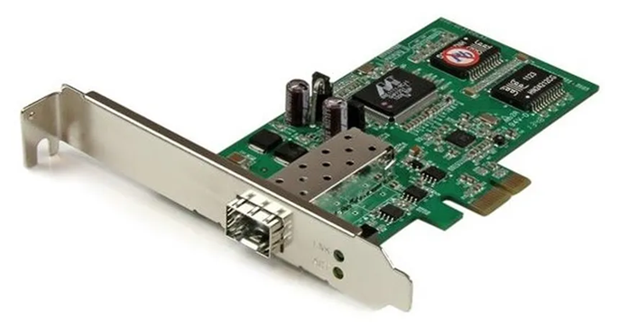
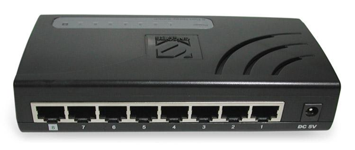
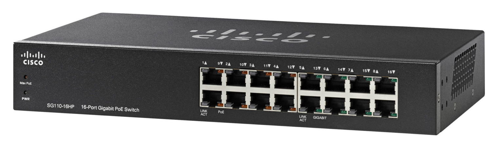
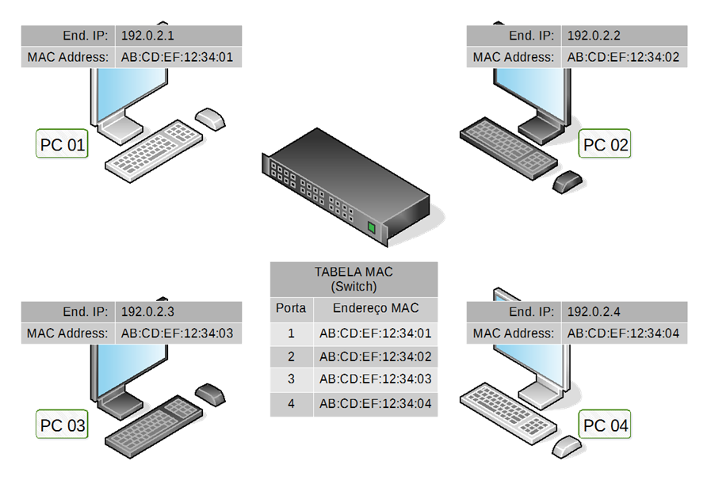
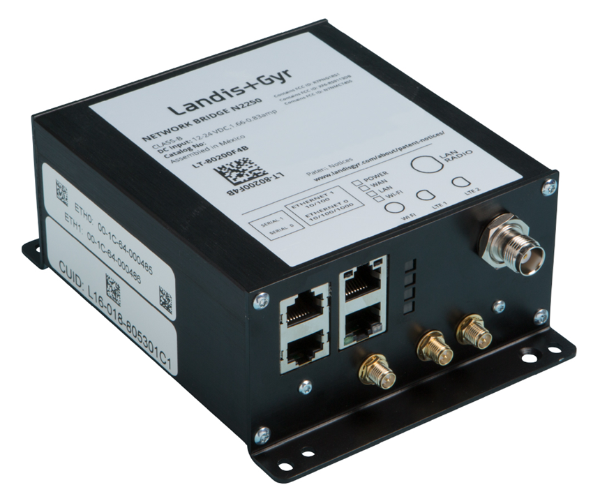
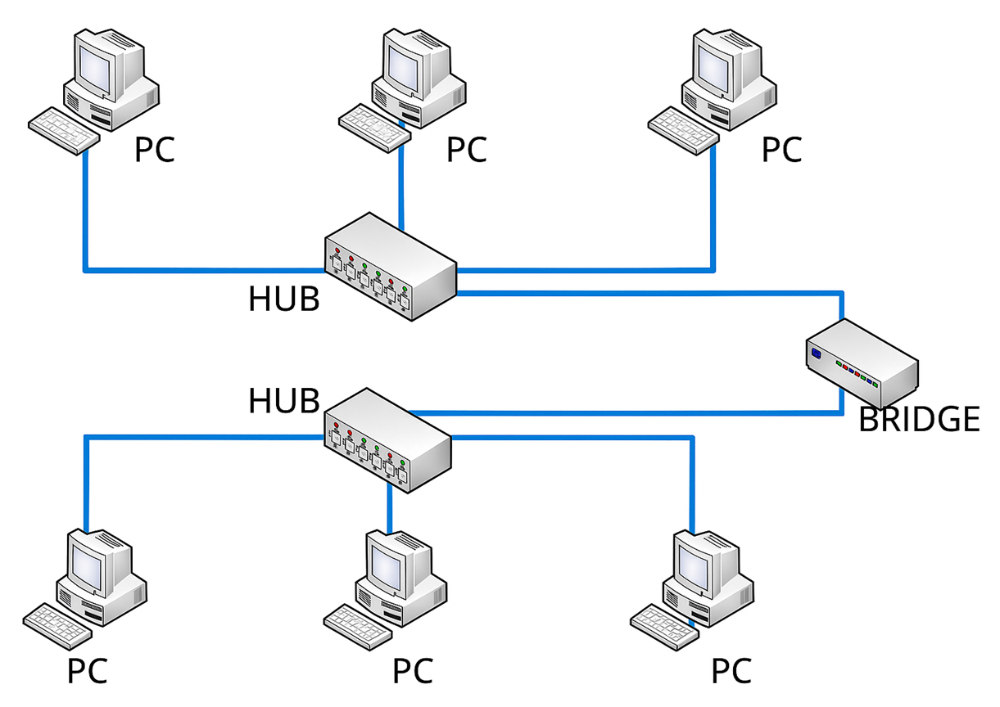
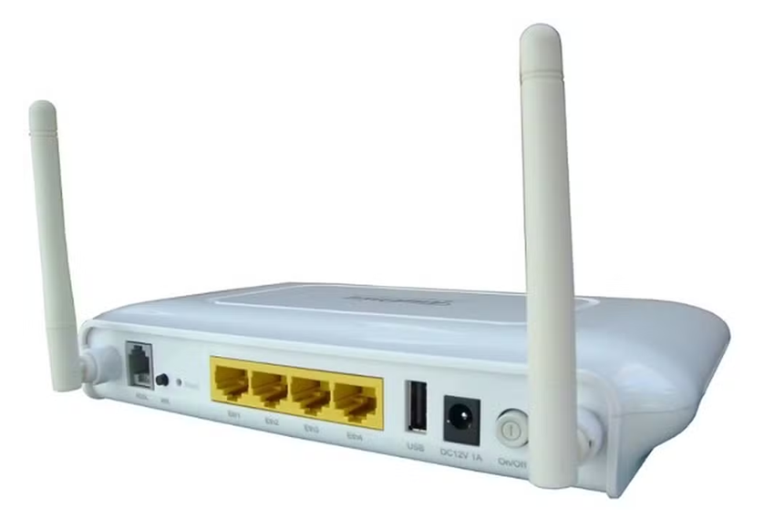
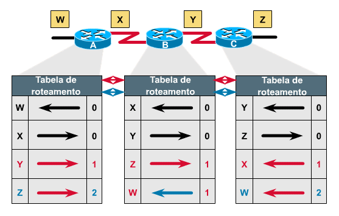
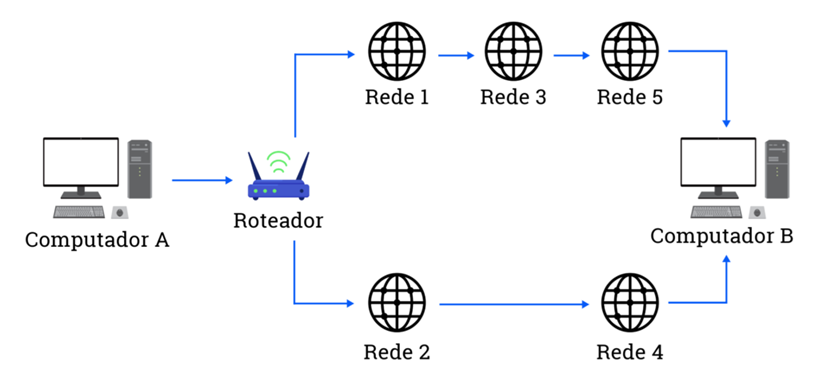

# Capítulo 3 – Equipamentos de Rede

Nos capítulos anteriores, exploramos a natureza dos sinais e os caminhos físicos — os meios de transmissão — pelos quais a informação viaja. Estabelecemos as "estradas" da nossa rede. Agora, vamos direcionar nossa atenção para os "veículos" e os "centros de controle de tráfego": os equipamentos de rede. São esses dispositivos que criam, enviam, recebem, direcionam e gerenciam os sinais que carregam nossos dados.

Neste capítulo, vamos analisar os principais equipamentos que compõem uma infraestrutura de rede típica. À medida que avançamos, começaremos a associar cada dispositivo a uma ou mais camadas do **Modelo OSI (Open Systems Interconnection)**, um conceito que aprofundaremos mais adiante, mas que já nos ajuda a entender que os equipamentos possuem diferentes níveis de "inteligência" e operam em diferentes planos da comunicação.

## Placa de Rede (NIC)

O componente mais fundamental para que um dispositivo final — como um computador, servidor ou impressora — possa se comunicar em uma rede é a **placa de rede**, também conhecida como **NIC (Network Interface Card)** ou adaptador de rede. Trata-se de um hardware que funciona como a interface, o tradutor, entre o mundo interno e digital do computador e o mundo externo da rede, seja ela cabeada ou sem fio.

Sua função essencial é dupla:

- **Na Transmissão:** A NIC recebe os dados do processador do computador (em formato paralelo), os organiza em pacotes ou quadros (_frames_) de acordo com os protocolos da rede, e os converte em sinais (elétricos, luminosos ou de rádio) adequados para serem enviados através do meio de transmissão.
- **Na Recepção:** Ela realiza o processo inverso, capturando os sinais do meio, decodificando-os de volta para um fluxo de bits, verificando a integridade dos dados recebidos e entregando-os ao sistema operacional do computador para processamento.

Fisicamente, uma placa de rede pode se apresentar de várias formas: como uma placa de expansão conectada a um slot na placa-mãe de um desktop, como um chip integrado diretamente na própria placa-mãe (a forma mais comum hoje em dia em notebooks e desktops) ou como um adaptador externo, conectado via porta USB.

### Endereço MAC

Cada placa de rede fabricada no mundo possui um identificador único, gravado em seu hardware de forma permanente. Esse identificador é chamado de **Endereço MAC (Media Access Control)**, também conhecido como endereço físico ou endereço de hardware.

Este endereço é a "impressão digital" do dispositivo na rede, garantindo que cada equipamento tenha uma identidade exclusiva em um nível local. Suas características são:

- **Formato:** O endereço MAC é composto por 48 bits, que são universalmente representados como 12 dígitos hexadecimais, geralmente agrupados em seis duplas separadas por dois-pontos ou hífens. Por exemplo: **24:6E:2A:91:41:D1**.
- **Estrutura:** O endereço é dividido em duas metades de 24 bits cada:
    1. **OUI (Organizationally Unique Identifier):** A primeira metade (no exemplo, `24:6E:2A`) identifica o fabricante da placa. Esse bloco é atribuído a cada empresa pelo IEEE (Institute of Electrical and Electronics Engineers), o que permite identificar quem fabricou o dispositivo a partir do seu endereço MAC.
    2. **Identificador Único:** A segunda metade (no exemplo, `91:41:D1`) é um número de série único atribuído pela própria fabricante, garantindo que não existam duas placas de sua fabricação com o mesmo endereço completo.

O endereço MAC é fundamental para a comunicação na **Camada 2 (Camada de Enlace)** do Modelo OSI. Ele é o endereço utilizado pelos switches para encaminhar os quadros de dados para o dispositivo correto dentro de uma mesma rede local (LAN). Se o endereço IP (que veremos adiante) é como o endereço de uma casa em uma cidade, o endereço MAC é como o número de chassi de um carro ou o CPF de uma pessoa: uma identidade única e local.

## Repetidores e Hubs

Ao subirmos do meio físico (Camada 1 do Modelo OSI), encontramos os primeiros equipamentos de rede, cuja função é lidar diretamente com os sinais elétricos que representam os bits. Esses dispositivos não possuem nenhuma inteligência sobre endereços ou caminhos; seu trabalho é puramente elétrico: receber um sinal e retransmiti-lo. Os dois principais exemplos são os repetidores e os hubs.

### Repetidor

Um **repetidor** é o dispositivo de interconexão mais simples que existe. Sua única função é combater a atenuação do sinal. Conforme um sinal viaja por um cabo, ele perde força. Um repetidor, posicionado no meio do caminho, recebe esse sinal enfraquecido, o "limpa" e o **regenera** de volta à sua força e temporização originais, e o envia adiante.

Trata-se de um dispositivo com apenas duas portas (uma de entrada e uma de saída), projetado para um único propósito: estender a distância máxima de um segmento de rede, conectando dois cabos. É importante notar que um repetidor é "cego" ao conteúdo dos dados; ele simplesmente copia e regenera cada bit que recebe.

### Hub (Concentrador)

O **hub**, também chamado de concentrador, pode ser entendido como uma evolução do repetidor. Em vez de apenas duas portas, um hub possui múltiplas portas, permitindo que vários dispositivos sejam interconectados em um ponto central. Ele foi o dispositivo central nas primeiras redes com topologia física em estrela.

No entanto, a lógica de funcionamento de um hub é a mesma de um repetidor: quando um sinal de dados chega em uma de suas portas, o hub o regenera e o **retransmite para todas as outras portas simultaneamente**, sem exceção. Ele não tem a capacidade de identificar para qual dispositivo a mensagem se destina; ele simplesmente a envia para todos.

Esse comportamento de "gritar para todos" tem consequências profundas no desempenho da rede, o que nos leva a definir alguns conceitos cruciais: **Domínios de Colisão, Broadcast e Modo de Half-Duplex**.

- **Domínio de Colisão:** É uma área lógica de uma rede onde os pacotes de dados podem colidir uns com os outros ao serem transmitidos. Em um domínio de colisão, **apenas um dispositivo pode transmitir por vez**. Se dois ou mais tentarem enviar dados simultaneamente, ocorre uma colisão, os dados são corrompidos e precisam ser retransmitidos. Como um hub retransmite tudo para todos, **toda a rede conectada a um hub (ou a múltiplos hubs interligados) forma um único e grande domínio de colisão**. Isso significa que a largura de banda total da rede é compartilhada entre todos os dispositivos, e o desempenho degrada rapidamente à medida que mais equipamentos são adicionados.
- **Domínio de Broadcast:** É a área lógica de uma rede onde uma mensagem de broadcast (uma mensagem destinada a todos os dispositivos) se propaga. Como um hub, por sua natureza, já envia todas as mensagens para todos os dispositivos, ele também cria um **único domínio de broadcast**.
- **Modo Half-Duplex:** Como consequência direta de estarem em um mesmo domínio de colisão, os dispositivos conectados a um hub devem operar em modo **half-duplex**. Isso significa que eles podem enviar e receber dados, mas **nunca ao mesmo tempo**, assim como em um walkie-talkie. Um dispositivo precisa esperar o meio ficar livre para poder transmitir.

#### Topologia Física em Estrela, Lógica em Barramento

Ao observar a forma como os cabos são conectados a um hub, vemos uma clara **topologia física em estrela**. No entanto, devido ao seu comportamento elétrico de retransmitir tudo para todos, a rede se comporta, logicamente, como uma **topologia em barramento**. É como se todos os dispositivos estivessem conectados a um único cabo compartilhado, onde todos ouvem a comunicação de todos. Esta é uma distinção fundamental e um exemplo clássico da diferença entre topologia física e lógica.

#### Classificação dos Hubs

Os hubs podem ser classificados em três tipos:

- **Passivos:** Dispositivos simples que não regeneram o sinal, apenas o distribuem eletricamente. Não necessitam de fonte de energia e são muito raros.
- **Ativos:** O tipo mais comum. Eles utilizam uma fonte de energia para regenerar ativamente o sinal (restaurando sua amplitude, forma e sincronismo) antes de retransmiti-lo, funcionando exatamente como o repetidor multiportas que descrevemos.
- **Inteligentes (Smart Hubs):** Uma variação dos hubs ativos que inclui algumas funcionalidades básicas de gerenciamento, como a capacidade de um administrador de rede habilitar ou desabilitar portas remotamente.

Devido à ineficiência causada pela criação de um único domínio de colisão, os hubs são considerados **tecnologia obsoleta** e foram amplamente substituídos por switches. Contudo, seu estudo é vital para compreender os problemas que os equipamentos mais modernos foram projetados para resolver.

## Switch (Comutador)

O **switch**, ou comutador, é o sucessor direto do hub. Fisicamente, ele pode parecer semelhante, atuando como um ponto de conexão central para os dispositivos de uma rede em uma topologia em estrela. No entanto, sua forma de operar é radicalmente diferente e muito mais inteligente, resolvendo o principal problema do hub: o domínio de colisão único.

Enquanto o hub opera na Camada 1 (Física), o switch é um dispositivo de **Camada 2 (Enlace)** do Modelo OSI. Isso significa que ele tem a capacidade de "ler" e interpretar o endereço físico, ou **endereço MAC**, contido em cada quadro de dados que trafega pela rede. Essa habilidade é a chave para sua eficiência.

### O Fim das Colisões: A Comutação de Quadros

A grande inovação do switch é sua capacidade de criar um caminho de comunicação temporário e exclusivo entre a porta de origem e a porta de destino para cada quadro transmitido. Ele não retransmite os dados para todas as portas como um hub; em vez disso, ele **comuta** (encaminha) o quadro apenas para a porta específica onde o dispositivo de destino está conectado.

Para conseguir isso, o switch constrói e mantém dinamicamente uma tabela em sua memória, conhecida como **Tabela CAM (Content Addressable Memory)** ou, mais comumente, tabela de endereços MAC.

Esta tabela associa cada porta do switch ao endereço MAC do dispositivo que está conectado a ela. O switch aprende e utiliza essa tabela através de três operações fundamentais:

1. **Aprendizagem (Learning):** Quando um quadro chega a uma porta do switch, ele analisa o **endereço MAC de origem** e associa esse endereço à porta pela qual o quadro chegou, armazenando essa informação em sua tabela CAM.
2. **Encaminhamento/Filtragem (Forwarding/Filtering):** Em seguida, o switch analisa o **endereço MAC de destino** do quadro. Ele procura por este endereço em sua tabela CAM. Se encontrar uma correspondência, ele encaminha o quadro **unicamente** para a porta associada, filtrando-o de todas as outras.
3. **Inundação (Flooding):** Se o endereço MAC de destino não for encontrado na tabela CAM (o que acontece quando um dispositivo é novo na rede ou se a entrada na tabela expirou), o switch age com cautela: ele encaminha o quadro para **todas as portas**, exceto aquela pela qual o quadro foi recebido, em um comportamento semelhante ao de um hub. Quando o dispositivo de destino responder, o switch aprenderá sua localização e adicionará a entrada à tabela CAM para futuras comunicações.

### Domínios de Colisão vs. Domínio de Broadcast

O resultado direto desse funcionamento inteligente é uma segmentação drástica da rede:

- **Domínios de Colisão:** O switch **isola o domínio de colisão em cada uma de suas portas**. Isso significa que cada porta individualmente é um domínio de colisão separado. Um switch de 24 portas, portanto, cria 24 domínios de colisão. Como as colisões são isoladas, os dispositivos podem se comunicar em modo **Full-Duplex**, enviando e recebendo dados simultaneamente, o que aumenta drasticamente a eficiência da rede.
- **Domínio de Broadcast:** No entanto, por padrão, um switch de Camada 2 não segmenta o domínio de broadcast. Uma mensagem de broadcast (destinada a todos os dispositivos) que chega a uma porta será encaminhada para todas as outras portas. Portanto, um switch cria um **único domínio de broadcast** (assumindo que não há configurações avançadas como VLANs).

### Tipos de Tráfego Gerenciados

O switch é capaz de gerenciar os três tipos básicos de tráfego em uma rede:

- **Unicast:** Uma comunicação de um para um. O switch utiliza sua tabela CAM para encaminhar o quadro apenas para a porta do destinatário específico.
- **Broadcast:** Uma comunicação de um para todos. O switch encaminha o quadro para todas as portas, exceto a de origem.
- **Multicast:** Uma comunicação de um para um grupo. O switch encaminha o quadro para um subconjunto de portas que fazem parte de um grupo multicast específico.

### Além da Camada 2: Switches Multicamada

A tecnologia dos switches evoluiu para incorporar funcionalidades de camadas superiores, criando dispositivos híbridos de alta performance:

- **Switch L3 (Layer 3 Switch):** É um switch que, além de todas as funcionalidades de Camada 2, também possui a capacidade de realizar **roteamento**, uma função da Camada 3 (Rede). Ele pode tomar decisões de encaminhamento com base não apenas em endereços MAC, mas também em **endereços IP**. A grande vantagem de um Switch L3 é que ele realiza o roteamento em hardware, através de circuitos integrados específicos chamados **ASICs**, o que o torna muito mais rápido que um roteador tradicional (que geralmente toma decisões em software). Eles são ideais para roteamento em alta velocidade dentro de uma rede local (entre VLANs, por exemplo), mas geralmente não possuem os recursos avançados de um roteador para conexões WAN.
- **Switch L4-L7:** Switches ainda mais avançados podem inspecionar informações das camadas de Transporte (L4 - portas TCP/UDP) até a de Aplicação (L7). São frequentemente usados em datacenters para funções como balanceamento de carga (_load balancing_), distribuindo requisições de forma inteligente entre múltiplos servidores.

## Bridge (Ponte)

Antes da popularização massiva dos switches, existia um dispositivo intermediário chamado **bridge** (ponte). Para entender seu papel, podemos usar a seguinte analogia: **a bridge está para o switch assim como o repetidor está para o hub**. Ou seja, enquanto um switch é essencialmente uma "bridge multiportas", a bridge tradicional é um dispositivo mais simples, geralmente com apenas duas portas, projetado para conectar dois segmentos de rede.

Assim como o switch, a bridge é um dispositivo de **Camada 2 (Enlace)**, o que significa que ela tem a capacidade de ler os endereços MAC de origem e destino dos quadros que a atravessam. Essa inteligência permitiu que ela realizasse sua função principal: a **segregação de tráfego**.

Hoje, o dispositivo "bridge" autônomo é considerado obsoleto. Sua funcionalidade principal de aprendizado e filtragem baseada em endereços MAC foi expandida, implementada em hardware de alta velocidade (ASICs) e miniaturizada em um formato multiportas, dando origem ao **switch** moderno. Portanto, a melhor forma de entender um switch é imaginá-lo como uma "ponte multiportas" de alta performance. O estudo da bridge é, portanto, fundamental para compreender a base sobre a qual os switches foram construídos.

### Funcionamento e Segregação de Tráfego

A bridge analisa o tráfego e toma uma decisão inteligente:

1. Ela "aprende" quais dispositivos (endereços MAC) estão em cada um dos seus segmentos conectados, construindo uma pequena tabela de endereçamento.
2. Quando um quadro chega, a bridge verifica o endereço MAC de destino.
3. Se o MAC de destino estiver no **mesmo segmento** que o MAC de origem, a bridge entende que a comunicação é local e **descarta (filtra) o quadro**, impedindo que ele cruze para o outro segmento desnecessariamente.
4. Se o MAC de destino estiver no **segmento oposto**, a bridge **encaminha o quadro** para sua outra porta.

Essa filtragem inteligente era sua grande vantagem sobre os hubs e repetidores. Ao conter o tráfego local dentro de cada segmento, a bridge reduzia drasticamente o congestionamento geral na rede e melhorava o desempenho. É crucial notar, como destacado nas anotações, que a bridge segrega o tráfego entre **enlaces** ou segmentos de uma mesma rede, e não entre redes distintas (o que exigiria roteamento, uma função de Camada 3).

### Domínios de Colisão e Broadcast

Assim como um switch, a bridge segmenta domínios de colisão, mas não domínios de broadcast:

- **Domínios de Colisão:** A bridge **divide o domínio de colisão**. Cada uma de suas portas representa um domínio de colisão separado. Isso significa que, na figura acima, uma colisão no segmento de A e B não afetaria o segmento de C e D.
- **Domínios de Broadcast:** A bridge **não divide o domínio de broadcast**. Se o computador A enviar uma mensagem de broadcast, a bridge a encaminhará para o outro segmento, garantindo que ela chegue a todos os dispositivos (B, C e D).

### O Desafio da Heterogeneidade

Originalmente, uma das grandes promessas da bridge era a capacidade de interligar tipos diferentes de redes locais, como conectar uma rede Ethernet a uma rede Token Ring. No entanto, como aponta o autor Andrew S. Tanenbaum, isso se provou problemático na prática. As diferenças intrínsecas entre os padrões de rede — como o tamanho máximo dos quadros, as taxas de transmissão e os formatos de cabeçalho — tornavam a "tradução" entre eles complexa e ineficiente.

Por essa razão, as bridges (e, por extensão, os switches) se tornaram eficazes para conectar redes do **mesmo tipo** (Ethernet com Ethernet, por exemplo), enquanto a tarefa de conectar redes de tipos diferentes foi deixada para os roteadores.

## Roteador

Enquanto os switches são os mestres da comunicação _dentro_ de uma rede local, os **roteadores** são os dispositivos responsáveis por conectar redes distintas, permitindo a comunicação _entre_ elas. O roteador é um equipamento nativo da **Camada 3 (Camada de Rede)** do Modelo OSI e é a peça fundamental que possibilita a existência da própria Internet, que nada mais é do que uma imensa interconexão de redes autônomas.

Se um switch utiliza o endereço físico (MAC) para encaminhar quadros dentro de uma LAN, o roteador opera com base no **endereçamento lógico (endereço IP)**. Cada dispositivo em uma rede TCP/IP possui um endereço IP, que funciona como seu endereço postal, identificando não apenas o dispositivo, mas também a rede à qual ele pertence.

#### A Tomada de Decisão: A Tabela de Roteamento

A principal função de um roteador é tomar decisões de encaminhamento. Ele faz isso consultando sua **tabela de roteamento**, uma espécie de mapa que contém informações sobre as redes conhecidas e os melhores caminhos para alcançá-las. Quando um pacote de dados chega a uma porta do roteador, ele analisa o endereço IP de destino do pacote, consulta sua tabela de roteamento e determina por qual de suas portas o pacote deve ser enviado para continuar sua jornada.

Essa tabela pode ser construída de duas maneiras:

- **Roteamento Estático:** O administrador da rede insere manualmente as rotas na tabela. É um método seguro e previsível, mas inflexível e impraticável para redes grandes e dinâmicas.
- **Roteamento Dinâmico:** Os roteadores se comunicam entre si utilizando **protocolos de roteamento**. Através desses protocolos, eles trocam informações sobre as redes que conseguem alcançar, permitindo que construam e atualizem suas tabelas de roteamento automaticamente. Essa troca de informações permite que os roteadores descubram o melhor caminho (geralmente o mais rápido ou com menor custo) para um destino e se adaptem a falhas na rede, recalculando rotas alternativas. Exemplos de protocolos de roteamento incluem RIP, OSPF, EIGRP e BGP.

#### Segmentação de Domínios

O roteador é o dispositivo definitivo para a segmentação de redes. Diferente do switch, que por padrão não divide domínios de broadcast, o roteador cria uma barreira tanto para colisões quanto para broadcasts:

- **Segmentação de Domínios de Colisão e Broadcast:** Cada porta (interface) de um roteador está conectada a uma rede diferente. Por design, um roteador **não encaminha mensagens de broadcast** de uma interface para outra. Isso significa que **cada porta de um roteador representa um domínio de broadcast separado**, assim como um domínio de colisão isolado. Essa capacidade é crucial para o desempenho e a segurança de redes grandes, pois impede que "tempestades de broadcast" (_broadcast storms_) em uma rede afetem as demais.

#### Interconectando Tecnologias Distintas

Outra capacidade fundamental do roteador é sua habilidade de interconectar redes que utilizam tecnologias de Camada 2 diferentes. Como ele opera na Camada 3, ele é agnóstico à tecnologia de enlace subjacente. Um roteador pode receber um pacote de dados encapsulado em um quadro Ethernet em uma de suas portas, desencapsular o pacote IP, e então reencapsulá-lo em um outro tipo de quadro (como de uma tecnologia WAN) para enviá-lo por outra porta.

#### Arquitetura Interna de um Roteador

Um roteador, em sua essência, é um computador especializado. Sua arquitetura interna é composta por quatro componentes principais:

1. **Portas de Entrada:** Recebem os pacotes do meio físico, verificam sua integridade e os preparam para o processamento, iniciando a consulta na tabela de roteamento.
2. **Processador de Roteamento:** É a CPU do roteador. Executa os protocolos de roteamento, mantém a tabela de roteamento e gerencia o dispositivo. Corresponde ao "plano de controle".
3. **Matriz de Comutação (Switching Fabric):** É o coração do encaminhamento. Uma vez que o caminho é decidido, a matriz de comutação é a responsável por transferir o pacote da porta de entrada para a porta de saída correta em altíssima velocidade. Corresponde ao "plano de dados".
4. **Portas de Saída:** Recebem o pacote da matriz de comutação, o encapsulam no quadro apropriado para o enlace de saída e o transmitem pelo meio físico.

Geralmente, os roteadores possuem uma quantidade de portas menor que os switches, pois cada porta exige um processamento de roteamento mais complexo e custoso.

