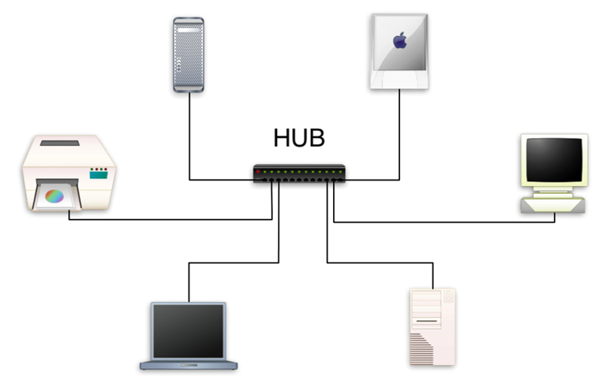

# Capítulo 3 – Equipamentos de Rede

Nos capítulos anteriores, exploramos a natureza dos sinais e os caminhos físicos — os meios de transmissão — pelos quais a informação viaja. Estabelecemos as "estradas" da nossa rede. Agora, vamos direcionar nossa atenção para os "veículos" e os "centros de controle de tráfego": os equipamentos de rede. São esses dispositivos que criam, enviam, recebem, direcionam e gerenciam os sinais que carregam nossos dados.

Neste capítulo, vamos analisar os principais equipamentos que compõem uma infraestrutura de rede típica. À medida que avançamos, começaremos a associar cada dispositivo a uma ou mais camadas do **Modelo OSI (Open Systems Interconnection)**, um conceito que aprofundaremos mais adiante, mas que já nos ajuda a entender que os equipamentos possuem diferentes níveis de "inteligência" e operam em diferentes planos da comunicação.

## Placa de Rede (NIC)

O componente mais fundamental para que um dispositivo final — como um computador, servidor ou impressora — possa se comunicar em uma rede é a **placa de rede**, também conhecida como **NIC (Network Interface Card)** ou adaptador de rede. Trata-se de um hardware que funciona como a interface, o tradutor, entre o mundo interno e digital do computador e o mundo externo da rede, seja ela cabeada ou sem fio.

Sua função essencial é dupla:

- **Na Transmissão:** A NIC recebe os dados do processador do computador (em formato paralelo), os organiza em pacotes ou quadros (_frames_) de acordo com os protocolos da rede, e os converte em sinais (elétricos, luminosos ou de rádio) adequados para serem enviados através do meio de transmissão.
- **Na Recepção:** Ela realiza o processo inverso, capturando os sinais do meio, decodificando-os de volta para um fluxo de bits, verificando a integridade dos dados recebidos e entregando-os ao sistema operacional do computador para processamento.

Fisicamente, uma placa de rede pode se apresentar de várias formas: como uma placa de expansão conectada a um slot na placa-mãe de um desktop, como um chip integrado diretamente na própria placa-mãe (a forma mais comum hoje em dia em notebooks e desktops) ou como um adaptador externo, conectado via porta USB.

### Endereço MAC

Cada placa de rede fabricada no mundo possui um identificador único, gravado em seu hardware de forma permanente. Esse identificador é chamado de **Endereço MAC (Media Access Control)**, também conhecido como endereço físico ou endereço de hardware.

Este endereço é a "impressão digital" do dispositivo na rede, garantindo que cada equipamento tenha uma identidade exclusiva em um nível local. Suas características são:

- **Formato:** O endereço MAC é composto por 48 bits, que são universalmente representados como 12 dígitos hexadecimais, geralmente agrupados em seis duplas separadas por dois-pontos ou hífens. Por exemplo: **24:6E:2A:91:41:D1**.
- **Estrutura:** O endereço é dividido em duas metades de 24 bits cada:
    1. **OUI (Organizationally Unique Identifier):** A primeira metade (no exemplo, `24:6E:2A`) identifica o fabricante da placa. Esse bloco é atribuído a cada empresa pelo IEEE (Institute of Electrical and Electronics Engineers), o que permite identificar quem fabricou o dispositivo a partir do seu endereço MAC.
    2. **Identificador Único:** A segunda metade (no exemplo, `91:41:D1`) é um número de série único atribuído pela própria fabricante, garantindo que não existam duas placas de sua fabricação com o mesmo endereço completo.

O endereço MAC é fundamental para a comunicação na **Camada 2 (Camada de Enlace)** do Modelo OSI. Ele é o endereço utilizado pelos switches para encaminhar os quadros de dados para o dispositivo correto dentro de uma mesma rede local (LAN). Se o endereço IP (que veremos adiante) é como o endereço de uma casa em uma cidade, o endereço MAC é como o número de chassi de um carro ou o CPF de uma pessoa: uma identidade única e local.

## Repetidores e Hubs

Ao subirmos do meio físico (Camada 1 do Modelo OSI), encontramos os primeiros equipamentos de rede, cuja função é lidar diretamente com os sinais elétricos que representam os bits. Esses dispositivos não possuem nenhuma inteligência sobre endereços ou caminhos; seu trabalho é puramente elétrico: receber um sinal e retransmiti-lo. Os dois principais exemplos são os repetidores e os hubs.

### Repetidor: Estendendo o Alcance da Rede

Um **repetidor** é o dispositivo de interconexão mais simples que existe. Sua única função é combater a atenuação do sinal. Conforme um sinal viaja por um cabo, ele perde força. Um repetidor, posicionado no meio do caminho, recebe esse sinal enfraquecido, o "limpa" e o **regenera** de volta à sua força e temporização originais, e o envia adiante.

Trata-se de um dispositivo com apenas duas portas (uma de entrada e uma de saída), projetado para um único propósito: estender a distância máxima de um segmento de rede, conectando dois cabos. É importante notar que um repetidor é "cego" ao conteúdo dos dados; ele simplesmente copia e regenera cada bit que recebe.

### O Hub (Concentrador): Um Repetidor Multiportas

O **hub**, também chamado de concentrador, pode ser entendido como uma evolução do repetidor. Em vez de apenas duas portas, um hub possui múltiplas portas, permitindo que vários dispositivos sejam interconectados em um ponto central. Ele foi o dispositivo central nas primeiras redes com topologia física em estrela.

No entanto, a lógica de funcionamento de um hub é a mesma de um repetidor: quando um sinal de dados chega em uma de suas portas, o hub o regenera e o **retransmite para todas as outras portas simultaneamente**, sem exceção. Ele não tem a capacidade de identificar para qual dispositivo a mensagem se destina; ele simplesmente a envia para todos.

Esse comportamento de "gritar para todos" tem consequências profundas no desempenho da rede, o que nos leva a definir alguns conceitos cruciais: **Domínios de Colisão, Broadcast e Modo de Half-Duplex**.

- **Domínio de Colisão:** É uma área lógica de uma rede onde os pacotes de dados podem colidir uns com os outros ao serem transmitidos. Em um domínio de colisão, **apenas um dispositivo pode transmitir por vez**. Se dois ou mais tentarem enviar dados simultaneamente, ocorre uma colisão, os dados são corrompidos e precisam ser retransmitidos. Como um hub retransmite tudo para todos, **toda a rede conectada a um hub (ou a múltiplos hubs interligados) forma um único e grande domínio de colisão**. Isso significa que a largura de banda total da rede é compartilhada entre todos os dispositivos, e o desempenho degrada rapidamente à medida que mais equipamentos são adicionados.
- **Domínio de Broadcast:** É a área lógica de uma rede onde uma mensagem de broadcast (uma mensagem destinada a todos os dispositivos) se propaga. Como um hub, por sua natureza, já envia todas as mensagens para todos os dispositivos, ele também cria um **único domínio de broadcast**.
- **Modo Half-Duplex:** Como consequência direta de estarem em um mesmo domínio de colisão, os dispositivos conectados a um hub devem operar em modo **half-duplex**. Isso significa que eles podem enviar e receber dados, mas **nunca ao mesmo tempo**, assim como em um walkie-talkie. Um dispositivo precisa esperar o meio ficar livre para poder transmitir.

#### Topologia Física em Estrela, Lógica em Barramento

Ao observar a forma como os cabos são conectados a um hub, vemos uma clara **topologia física em estrela**. No entanto, devido ao seu comportamento elétrico de retransmitir tudo para todos, a rede se comporta, logicamente, como uma **topologia em barramento**. É como se todos os dispositivos estivessem conectados a um único cabo compartilhado, onde todos ouvem a comunicação de todos. Esta é uma distinção fundamental e um exemplo clássico da diferença entre topologia física e lógica.

#### Classificação dos Hubs

Os hubs podem ser classificados em três tipos:

- **Passivos:** Dispositivos simples que não regeneram o sinal, apenas o distribuem eletricamente. Não necessitam de fonte de energia e são muito raros.
- **Ativos:** O tipo mais comum. Eles utilizam uma fonte de energia para regenerar ativamente o sinal (restaurando sua amplitude, forma e sincronismo) antes de retransmiti-lo, funcionando exatamente como o repetidor multiportas que descrevemos.
- **Inteligentes (Smart Hubs):** Uma variação dos hubs ativos que inclui algumas funcionalidades básicas de gerenciamento, como a capacidade de um administrador de rede habilitar ou desabilitar portas remotamente.

Devido à ineficiência causada pela criação de um único domínio de colisão, os hubs são considerados **tecnologia obsoleta** e foram amplamente substituídos por switches. Contudo, seu estudo é vital para compreender os problemas que os equipamentos mais modernos foram projetados para resolver.

