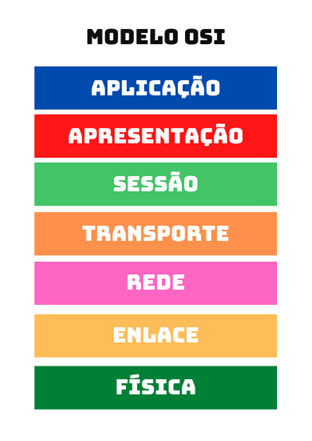
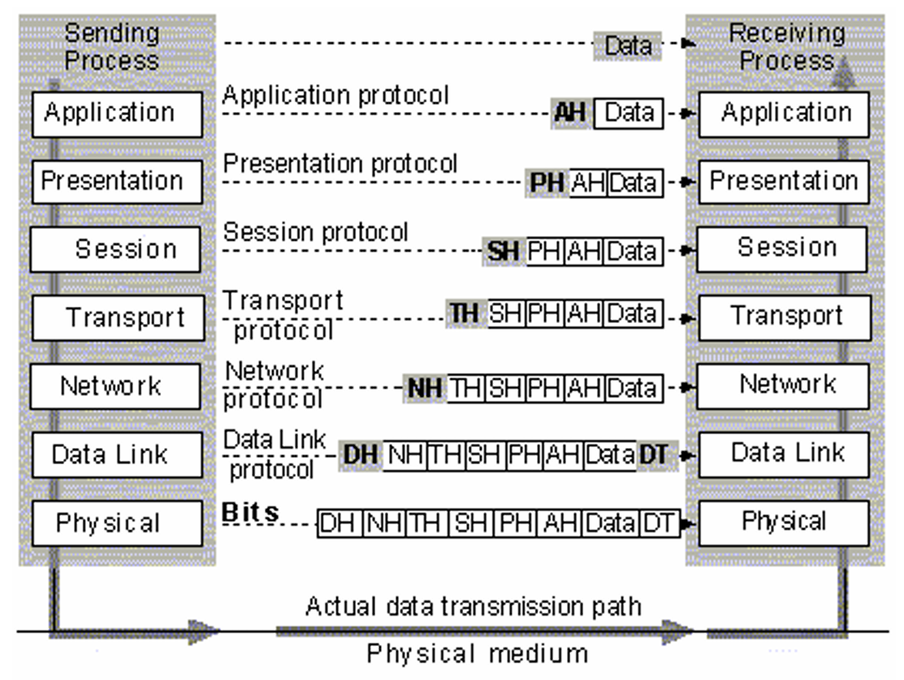
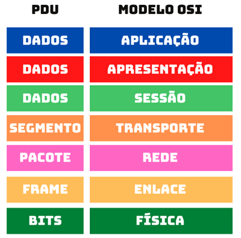
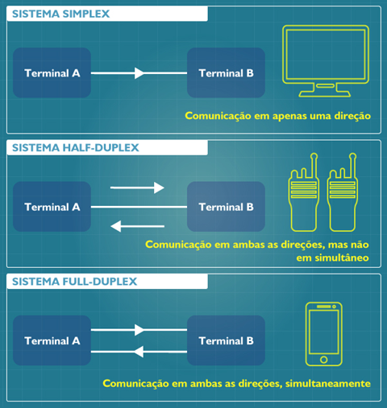
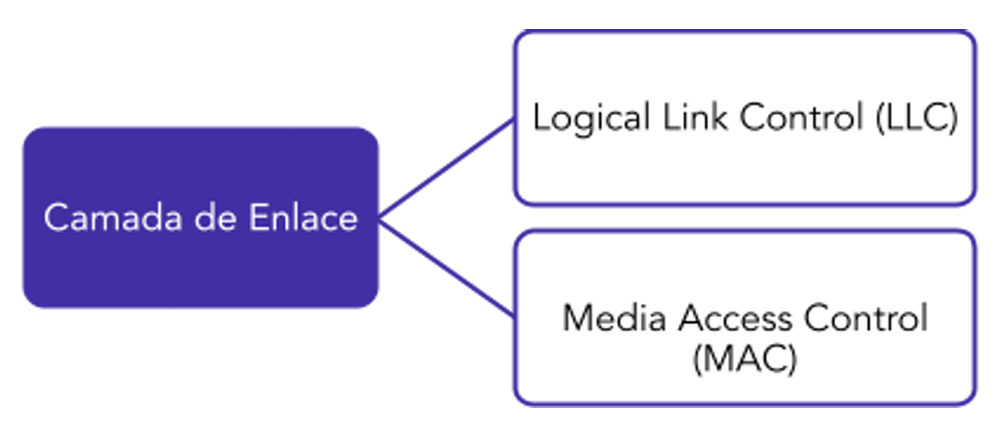

# Capítulo 4 – Modelo de Referência OSI

Nos capítulos anteriores, exploramos os componentes físicos da comunicação: os sinais que carregam os dados, os meios que os transportam e os equipamentos que os gerenciam. Vimos um ecossistema de hardware complexo, com dispositivos de diferentes fabricantes e com variados níveis de inteligência. A pergunta fundamental que surge é: como garantir que todos esses elementos distintos consigam cooperar de forma harmoniosa para que uma comunicação, do início ao fim, seja bem-sucedida? A resposta está em um conjunto de regras e em um projeto arquitetônico comum.

Este capítulo é dedicado ao modelo de referência que serve como a base conceitual para o funcionamento da grande maioria das redes que conhecemos hoje: o **Modelo OSI (Open Systems Interconnection)**, desenvolvido pela **ISO (International Organization for Standardization)**. Mas antes de detalharmos as sete camadas deste modelo, é crucial entendermos os problemas que ele foi projetado para resolver.

### A Necessidade de um Padrão: O Problema da Incompatibilidade

Uma comunicação, para ser bem-sucedida, exige que ambas as partes concordem com um conjunto de regras. Sem um entendimento mútuo, a troca de informações falha. Podemos ilustrar isso com uma analogia cultural:

> Imaginemos um cidadão brasileiro que viaja para uma antiga vila no Japão. No Brasil, o protocolo de cumprimento padrão é o aperto de mão. Ao encontrar o líder da vila, o brasileiro, educadamente, estende a mão para cumprimentá-lo. O líder, por sua vez, seguindo seu próprio protocolo, realiza uma reverência, curvando-se. Ambos têm o mesmo objetivo — o ato de se cumprimentar —, mas utilizam métodos incompatíveis. A comunicação inicial falha porque não há um protocolo de saudação em comum.

No início das redes de computadores, o cenário era muito parecido. Cada grande fabricante (como IBM, DEC, HP) criava sua própria arquitetura de rede, com seus próprios protocolos. Um computador da IBM se comunicava perfeitamente com outro da IBM, mas não conseguia se comunicar com um da DEC. Isso criava "ilhas" de comunicação, dificultando a interconexão e o crescimento das redes.

Para resolver isso, a indústria percebeu a necessidade de **protocolos de rede**: um conjunto formal de regras, procedimentos e formatos que definem como a comunicação deve ocorrer entre dois ou mais sistemas computacionais, garantindo que eles "falem a mesma língua".

### A Necessidade de Organização: O Problema da Complexidade

A simples criação de protocolos, no entanto, não resolvia todo o problema. A tarefa de conectar dois computadores é imensamente complexa e envolve desafios em muitos níveis: desde a representação dos bits como sinais elétricos até a formatação dos dados para uma aplicação específica.

Se um único e massivo protocolo tentasse lidar com todas essas tarefas, teríamos um design monolítico e problemático.

> Imaginemos dois protocolos de fabricantes diferentes. O primeiro é responsável por questões físicas e lógicas da transmissão. O segundo trata da parte visual da informação, mas também define algumas regras lógicas de transmissão. Se tentássemos integrar esses dois protocolos, teríamos uma sobreposição de funcionalidades: ambos estariam tentando realizar a mesma tarefa de controle lógico, gerando conflito e interdependência desnecessária.

Um sistema monolítico é extremamente difícil de gerenciar, atualizar e solucionar. Uma pequena mudança em uma função de baixo nível (como alterar o tipo de cabo) poderia exigir a reescrita de todo o software de rede. Era necessária uma forma de dividir essa complexidade em partes menores e independentes.

### A Solução: Um Modelo em Camadas

Para resolver tanto o problema da incompatibilidade quanto o da complexidade, a ISO desenvolveu o Modelo de Referência OSI. Proposto em 1983, ele oferece um modelo conceitual que estrutura a comunicação de rede em **sete camadas** de abstração.

A ideia central da arquitetura em camadas é **"dividir para conquistar"**. A tarefa complexa da comunicação é decomposta em sete problemas menores, onde cada camada é responsável por um conjunto específico e bem definido de funções.

Os princípios de um modelo em camadas são:

1. **Funções Específicas:** Cada camada tem um propósito claro e executa um grupo de tarefas relacionadas.
2. **Serviços e Interfaces:** Cada camada provê serviços para a camada imediatamente superior e requisita serviços da camada imediatamente inferior, ocultando os detalhes de como esses serviços são implementados. A comunicação entre camadas adjacentes ocorre através de interfaces bem definidas.
3. **Comunicação Par-a-Par:** A comunicação real ocorre entre camadas correspondentes em sistemas diferentes (por exemplo, a Camada 4 de um computador se comunica com a Camada 4 de outro), utilizando um protocolo específico daquela camada.

Dessa forma, os protocolos podem ser desenvolvidos para atuar em uma camada específica, sem se preocupar com as funções das outras. Isso promove a modularidade, facilita a evolução tecnológica (pode-se trocar a tecnologia da Camada 1 sem afetar a Camada 3, por exemplo) e simplifica o aprendizado e o desenvolvimento de redes.

### Os Princípios e a Mecânica do Modelo OSI

O Modelo OSI não é apenas uma lista de camadas; ele é fundamentado em uma filosofia de design que visa a organização, a flexibilidade e, acima de tudo, a interoperabilidade. Para entendê-lo, precisamos primeiro conhecer seus três conceitos principais.

#### Os Três Pilares: Serviços, Interfaces e Protocolos

O funcionamento da arquitetura em camadas do OSI é definido por três conceitos fundamentais:

- **Serviços:** Cada camada existe para prestar **serviços** à camada imediatamente superior. O serviço define _o que_ a camada faz, mas oculta os detalhes de _como_ ela faz. Por exemplo, a Camada de Rede oferece o serviço de entregar um pacote a um destino em outra rede, mas a Camada de Transporte não precisa saber qual rota o pacote tomou.
- **Interfaces:** Uma interface define _como_ a camada superior acessa os serviços da camada inferior. É um conjunto de operações e parâmetros bem definidos que funcionam como um "portal" entre as camadas adjacentes.
- **Protocolos:** São as regras e convenções que governam a comunicação. O protocolo é a **implementação** do serviço. Enquanto o serviço é uma definição abstrata, o protocolo é o conjunto de regras concretas que as entidades correspondentes (as "camadas pares") em diferentes máquinas usam para se comunicar. A Camada de Transporte em uma máquina, por exemplo, não se importa com o protocolo que a Camada de Rede está usando, contanto que o serviço de entrega de pacotes seja realizado.

Essa separação é crucial: ela permite que o protocolo de uma camada seja alterado ou atualizado sem que as outras camadas sejam afetadas, contanto que os serviços prestados à camada superior permaneçam os mesmos.

#### As Sete Camadas: Uma Visão Geral

O Modelo OSI organiza a comunicação em sete camadas empilhadas, onde cada uma tem uma função específica e bem definida.

É comum agrupar as camadas em dois conjuntos:

- **Camadas de Host (ou Camadas Superiores):** As quatro camadas superiores (Aplicação, Apresentação, Sessão e Transporte) são geralmente chamadas de camadas de host. Elas lidam com questões relacionadas à aplicação e aos dados do usuário, sendo normalmente implementadas em software no sistema operacional do dispositivo final.
- **Camadas de Meio (ou Camadas Inferiores):** As três camadas inferiores (Rede, Enlace e Física) são as camadas de meio. Elas são responsáveis por gerenciar a transmissão dos dados através da rede. Sua implementação envolve uma combinação de software (no sistema operacional e firmware dos dispositivos) e hardware (placas de rede, switches, roteadores).

#### Processo de Comunicação: Encapsulamento e PDUs

A comunicação entre as camadas segue um processo fundamental chamado **encapsulamento**. Quando um usuário envia dados (como um e-mail), a informação começa na Camada de Aplicação e desce pela pilha de camadas. Em cada camada, a informação recebida da camada superior é tratada como um bloco de dados, e a camada atual adiciona seu próprio cabeçalho (_header_) de controle.

Esse processo é como colocar uma carta em envelopes sucessivos. A carta original (dados) é colocada em um envelope (cabeçalho da Camada 4). Esse envelope é colocado em um envelope maior (cabeçalho da Camada 3), e assim por diante. Na máquina de destino, ocorre o processo inverso, o **desencapsulamento**, onde cada camada remove seu respectivo cabeçalho e passa os dados para a camada superior.

O bloco de dados de cada camada, composto pelo cabeçalho da camada e pelos dados da camada superior, é chamado de **Unidade de Dados de Protocolo (PDU - Protocol Data Unit)**. As PDUs recebem nomes específicos nas camadas inferiores, que são termos essenciais no vocabulário de redes:

- **Camada 4 (Transporte):** A PDU é chamada de **Segmento** (para o protocolo TCP) ou **Datagrama** (para o protocolo UDP).
- **Camada 3 (Rede):** A PDU é chamada de **Pacote**.
- **Camada 2 (Enlace):** A PDU é chamada de **Quadro** (_Frame_).
- **Camada 1 (Física):** A PDU é convertida em **Bits** para transmissão.

#### Os Princípios por Trás das Camadas

A escolha de sete camadas e a definição das funções de cada uma não foram decisões arbitrárias. O processo de design do Modelo OSI foi guiado por um conjunto de treze princípios de engenharia, que visavam criar uma arquitetura que fosse ao mesmo tempo robusta, flexível e lógica. Compreender esses princípios ajuda a entender o porquê de o modelo ser estruturado da forma que é.

Os princípios são os seguintes:

1. Não criar um número excessivo de camadas, para que a tarefa de descrevê-las e integrá-las não se torne desnecessariamente complexa. O objetivo é o equilíbrio entre a modularidade e o excesso de overhead.
2. Criar fronteiras entre as camadas em pontos onde a descrição dos serviços seja pequena e o número de interações através da fronteira seja minimizado. Essencialmente, busca-se criar interfaces "limpas" e eficientes.
3. Criar camadas separadas para manipular funções que são manifestamente diferentes no processo ou na tecnologia envolvida. Por exemplo, o problema de transmitir bits por um cabo (Camada Física) é tecnologicamente distinto de encontrar a melhor rota entre várias redes (Camada de Rede).
4. Agrupar funções similares em uma mesma camada. Este é o princípio da coesão: cada camada deve ter um propósito claro e focado.
5. Criar uma fronteira onde a experiência passada demonstrou ser necessária uma separação. O modelo se baseou em lições aprendidas com redes anteriores, como a ARPANET.
6. Criar uma camada com funções que possam ser facilmente redesenhadas e ter seus protocolos alterados para tirar vantagem de novas tecnologias, sem alterar os serviços oferecidos às camadas adjacentes. Este é o pilar da flexibilidade e da evolução tecnológica.
7. Criar uma fronteira onde possa ser útil, no futuro, ter a interface correspondente padronizada.
8. Criar uma camada onde seja necessário um nível de abstração diferente na manipulação dos dados. Por exemplo, a Camada de Aplicação lida com a semântica dos dados do usuário, enquanto a Camada de Enlace lida com a sintaxe de um quadro de bits.
9. Permitir que alterações de funções ou protocolos dentro de uma camada não afetem as outras camadas. Isso reforça a modularidade do sistema.
10. Criar, para cada camada, fronteiras de comunicação apenas com sua camada imediatamente superior e inferior. Isso impede uma arquitetura caótica e garante um fluxo de dados organizado.
11. Permitir a criação posterior de subgrupos e funções organizadas para formar **subcamadas** dentro de uma camada, caso serviços distintos sejam necessários. Um exemplo clássico é a divisão da Camada de Enlace nas subcamadas MAC e LLC.
12. Permitir, quando necessário, a criação de duas ou mais subcamadas com funcionalidades mínimas em comum para viabilizar a operação entre as camadas.
13. Permitir o "by-pass", ou seja, transpassar subcamadas cujas funções não sejam necessárias em uma determinada comunicação.

## As Sete Camadas em Detalhe

Agora que compreendemos a filosofia e a mecânica geral do Modelo OSI, vamos dissecar cada uma de suas sete camadas, começando pela mais fundamental, a Camada 1, e subindo progressivamente na pilha. Para cada camada, exploraremos suas funções, responsabilidades e a forma como ela contribui para o processo de comunicação.

### Camada Física

A **Camada Física (Physical Layer)** é a primeira e mais baixa camada do Modelo OSI. Ela é a base sobre a qual todas as outras camadas são construídas. Sua principal responsabilidade é lidar com a transmissão e a recepção de um fluxo de **bits brutos** e não estruturados através de um meio de transmissão físico.

Pense nesta camada como a engenharia da comunicação: ela não se preocupa com o significado dos bits (se eles formam um e-mail ou um vídeo), mas sim com os aspectos físicos e elétricos necessários para mover esses bits de um ponto a outro. É a camada que define as interfaces mecânicas, elétricas e ópticas com o meio, especificando, por exemplo, o tipo de conector a ser usado, a pinagem dos cabos, os níveis de voltagem para representar um 0 e um 1, e a impedância dos cabos.

As principais responsabilidades da Camada Física incluem:

- **Representação dos Bits:** Converter o fluxo de bits (0s e 1s) em sinais elétricos, pulsos de luz ou ondas de rádio adequados para o meio de transmissão.
- **Taxa de Dados:** Definir a velocidade da transmissão, ou seja, quantos bits por segundo serão enviados.
- **Sincronização de Bits:** Garantir que o "relógio" do receptor esteja sincronizado com o do transmissor para que os bits sejam interpretados corretamente.
- **Interface com o Meio:** Especificar as características físicas dos componentes, como o formato dos conectores e a função de cada pino.
- **Topologia Física:** Definir como os dispositivos estão fisicamente conectados (barramento, estrela, etc.).

#### Modos de Transmissão

Uma das funções mais importantes definidas na Camada Física é o modo de transmissão, que determina a direcionalidade do fluxo de dados entre dois dispositivos.

- **Simplex:** A comunicação ocorre em **apenas uma direção**, de forma unidirecional. Um dispositivo atua apenas como transmissor, e o outro apenas como receptor. Não há canal de retorno. Exemplos clássicos são as transmissões de rádio e TV comerciais, onde o sinal vai da emissora para o receptor, mas não o contrário.
- **Half-duplex (Semiduplex):** A comunicação pode ocorrer nos **dois sentidos, porém, não simultaneamente**. Os dispositivos podem transmitir e receber, mas precisam se revezar. É como uma conversa por walkie-talkie, onde uma pessoa fala e a outra escuta, e então os papéis se invertem. As primeiras versões da Ethernet (10BASE-T com hubs) operavam em modo half-duplex, pois o meio era compartilhado e uma transmissão simultânea por dois dispositivos causaria uma colisão.
- **Full-duplex (Duplex Completo):** A comunicação ocorre nos **dois sentidos de forma simultânea**. Isso é possível porque existem canais separados para transmissão e recepção. Em um cabo de par trançado, por exemplo, um par de fios pode ser usado para enviar dados enquanto outro par é usado para receber dados ao mesmo tempo. As redes Ethernet modernas (Fast Ethernet, Gigabit Ethernet), baseadas em switches, operam em modo full-duplex, o que dobra a largura de banda efetiva da conexão.

### Camada de Enlace de Dados

A **Camada de Enlace de Dados (Data Link Layer)**, ou simplesmente Camada de Enlace, é a segunda camada do Modelo OSI. Sua missão principal é transformar o serviço de transmissão de bits brutos e propenso a erros, oferecido pela Camada Física, em um link de comunicação que pareça confiável e bem definido para a Camada de Rede (a camada superior). Sua PDU (Unidade de Dados de Protocolo) é o **quadro** (_frame_).

Para alcançar esse objetivo, a Camada de Enlace assume duas responsabilidades cruciais: organizar o fluxo de bits em unidades lógicas (os quadros) e implementar mecanismos de controle para lidar com os erros que inevitavelmente ocorrem no meio físico.

É fundamental entender a distinção mencionada em suas anotações: a camada **não torna o meio físico livre de erros**, o que é impossível. Em vez disso, ela implementa técnicas para **detectar** e, em alguns casos, **corrigir** os erros, de modo que, da perspectiva da Camada de Rede, a comunicação aparenta ser confiável. Ela atua como um gerente de qualidade, inspecionando a "linha de montagem" de bits para garantir a integridade do produto final.

#### Enquadramento (Framing)

A Camada Física entrega ao Enlace um fluxo contínuo de bits. O primeiro desafio é saber onde um conjunto de dados termina e o próximo começa. O processo de dividir esse fluxo de bits em unidades discretas, os quadros, é chamado de **enquadramento** (_framing_). Um quadro é, essencialmente, um "envelope" para os pacotes da Camada de Rede. Para que o receptor consiga identificar o início e o fim de cada quadro, diversas técnicas foram desenvolvidas:

1. **Contagem de Caracteres:** Um método antigo onde o cabeçalho do quadro continha um campo que indicava o número de caracteres (bytes) no quadro. Sua grande fragilidade era que um único erro de bit no campo de contagem faria o receptor perder a sincronia, tornando impossível localizar o início do próximo quadro. Por este motivo, não é mais utilizado.
2. **Bytes de Flag, com Inserção de Bytes (Byte Stuffing):** Nesta técnica, cada quadro começa e termina com um byte especial, chamado de _flag_ (bandeira). O problema surge se o padrão do byte de flag aparecer acidentalmente no meio dos dados. A solução é a "inserção de bytes": o remetente insere um byte de "escape" especial antes de qualquer byte de flag acidental nos dados. O receptor, ao ver o byte de escape, o remove e sabe que o byte de flag seguinte é parte dos dados, e não o fim do quadro.
3. **Flags Iniciais e Finais, com Inserção de Bits (Bit Stuffing):** Uma solução mais robusta e comum, utilizada por protocolos que influenciaram o Ethernet. Também usa um padrão de bits específico como flag (por exemplo, `01111110`). Para evitar que esse padrão surja acidentalmente nos dados, o hardware do remetente, sempre que detecta uma sequência de cinco '1's consecutivos nos dados, insere ("stuffed") um '0' no fluxo de bits. O hardware do receptor faz o inverso: ao ver cinco '1's seguidos por um '0', ele remove o '0', restaurando os dados originais. Isso garante que a única sequência de seis '1's seja a do flag.
4. **Violações de Codificação da Camada Física:** Este método se aplica apenas a redes onde a codificação da Camada 1 possui redundância. Por exemplo, em uma codificação Manchester, todo bit válido tem uma transição de voltagem no meio do intervalo. Uma ausência de transição pode ser usada como um símbolo que não representa dados, marcando o início ou o fim de um quadro.

#### Garantindo uma Transmissão Confiável

Além de estruturar os bits em quadros, a Camada de Enlace introduz mecanismos para tornar a comunicação confiável:

- **Controle de Erros:** Para detectar se um quadro foi corrompido durante a transmissão por ruído ou outras interferências, a camada de enlace adiciona uma "cauda" (_trailer_) ao quadro, contendo uma **Sequência de Verificação de Quadro (FCS - Frame Check Sequence)**. O valor do FCS é calculado pelo remetente com base no conteúdo do quadro. O receptor realiza o mesmo cálculo sobre os dados recebidos. Se os valores não baterem, o receptor sabe que o quadro contém erros e o descarta.
- **Controle de Fluxo:** A camada também pode implementar mecanismos para evitar que um remetente rápido sobrecarregue um receptor lento com dados. O receptor pode enviar sinais de controle para "pausar" e "retomar" a transmissão, garantindo um fluxo de dados gerenciável.
- **Sequenciamento:** Os quadros são numerados para garantir que sejam processados na ordem correta no destino e para permitir a identificação de quadros perdidos.

#### Comutação: As Estratégias para Encaminhar Dados

Um conceito fundamental, intimamente ligado à operação dos dispositivos da Camada de Enlace e superiores, é o de **comutação** (_switching_). Em seu sentido mais amplo, comutação é o processo pelo qual um equipamento intermediário recebe dados em uma porta de entrada e os encaminha para uma ou mais portas de saída, de modo a levá-los para mais perto de seu destino final. A estratégia utilizada para realizar essa comutação define a natureza da rede. Existem duas abordagens principais: a comutação de circuitos e a comutação por pacotes.

##### Comutação de Circuitos

Na comutação de circuitos, um **caminho de comunicação dedicado e exclusivo** é estabelecido entre a origem e o destino _antes_ que qualquer dado seja transmitido. Esse caminho, ou "circuito", uma vez estabelecido, é reservado para aquela comunicação específica durante toda a sua duração.

O exemplo clássico é a rede de telefonia convencional. Quando se faz uma ligação, uma série de comutadores nos postos telefônicos estabelece uma conexão física fim a fim entre os dois aparelhos. Durante a chamada, todo o recurso daquele circuito (largura de banda) fica inteiramente à disposição dos interlocutores, e ninguém mais pode usá-lo.

O processo ocorre em três fases distintas:

1. **Estabelecimento do Circuito:** A conexão é solicitada e o caminho é montado através dos nós intermediários. Se algum trecho do caminho não estiver disponível, a conexão é bloqueada.
2. **Transferência de Dados:** Os dados (ou a voz) fluem de forma contínua pelo circuito dedicado.
3. **Desconexão do Circuito:** Ao final da comunicação, o circuito é desfeito, liberando os recursos para outras chamadas.

**Vantagens:**

- **Garantia de Recursos:** Como o caminho é dedicado, a largura de banda é garantida e constante durante toda a comunicação, sem concorrência.
- **Baixa Latência:** Uma vez que o circuito está estabelecido, não há atrasos de processamento nos nós intermediários; os dados fluem diretamente.

**Desvantagens:**

- **Desperdício de Recursos:** O circuito permanece alocado mesmo durante os períodos de silêncio ou inatividade na comunicação, desperdiçando largura de banda.
- **Bloqueio de Conexão:** Se não for possível alocar um circuito completo de ponta a ponta no momento da solicitação, a comunicação simplesmente não pode ser iniciada.

##### Comutação por Pacotes

A comutação por pacotes é a base da internet e da maioria das redes de dados modernas. Diferente da abordagem anterior, ela **não estabelece um caminho dedicado**. Em vez disso, a informação a ser enviada é quebrada em pequenos blocos de tamanho definido, chamados de **pacotes**. Cada pacote contém, além dos dados, um cabeçalho com informações de controle, como os endereços de origem e destino.

Esses pacotes são então injetados na rede e viajam de forma independente. Os recursos da rede (os links de comunicação) são compartilhados entre múltiplos usuários. Cada dispositivo intermediário (como um switch ou roteador) recebe um pacote, o armazena temporariamente em um buffer (técnica de _store-and-forward_), analisa seu endereço de destino e o encaminha para o próximo nó na rota. Os pacotes de uma mesma mensagem podem, inclusive, seguir caminhos diferentes pela rede e chegar fora de ordem ao destino.

**Vantagens:**

- **Eficiência:** A utilização do meio é muito mais eficiente, pois os links só são ocupados quando há pacotes para transmitir, permitindo que múltiplos usuários compartilhem os recursos da rede de forma dinâmica.
- **Robustez:** Em caso de falha em um nó ou link, os pacotes podem ser desviados por rotas alternativas, tornando a rede mais resiliente.

**Desvantagens:**

- **Atraso e Jitter:** O processo de armazenar e encaminhar em cada nó introduz atrasos (latência) que podem variar para cada pacote (_jitter_), o que pode ser um problema para aplicações de tempo real, como voz e vídeo.
- **Sem Garantia de Banda:** Como os recursos são compartilhados, não há uma garantia nativa de taxa de transmissão. Em momentos de congestionamento, o desempenho pode degradar.

Uma variação mais antiga é a **comutação por mensagens**, que funciona de forma semelhante, mas envia a mensagem inteira como um único bloco de tamanho ilimitado. Isso exigia que os nós intermediários tivessem uma grande capacidade de armazenamento (discos) e gerava atrasos muito altos, sendo substituída pela comutação por pacotes, que é muito mais ágil.

A tabela a seguir resume as principais diferenças entre as duas técnicas:

|Característica|Comutação por Circuitos|Comutação por Pacotes|
|---|---|---|
|**Circuito Físico Dedicado**|Sim|Não|
|**Largura de Banda**|Fixo|Variável|
|**Desperdício de Banda**|Sim, em períodos ociosos|Não|
|**Armazenamento nos Nós**|Não|Sim (buffers)|
|**Requer Conexão Prévia**|Sim|Não|
|**Congestionamento**|Apenas no início da chamada (bloqueio)|Ocorre em cada pacote (filas nos nós)|
|**Ocorrência de Atrasos**|Mínimo após conexão|Sim, em cada nó|
|**Principais Aplicações**|Telefonia Convencional|Internet, Videoconferência, VoIP|

#### Subdivisões da Camada de Enlace: LLC e MAC

A Camada de Enlace, na prática, lida com duas classes de problemas distintas: as questões lógicas da comunicação (como o controle de erros e fluxo) e as questões de acesso ao meio físico (como o endereçamento físico e as regras para transmitir em um meio compartilhado). Para organizar melhor essas responsabilidades, o comitê IEEE 802, que padroniza as redes locais (LANs), dividiu a Camada de Enlace em duas subcamadas: a **LLC** na parte superior e a **MAC** na parte inferior.

Essa divisão é engenhosa porque permite que a subcamada superior (LLC), que lida com a lógica, seja independente da tecnologia física. Assim, a mesma lógica da LLC pode operar sobre diferentes tecnologias de acesso ao meio, como Ethernet, Wi-Fi ou outras.

##### A Subcamada de Controle do Enlace Lógico (LLC - Logical Link Control)

A subcamada LLC atua como a **interface entre a Camada de Rede e a Camada de Enlace**. Sua principal função é estabelecer e controlar as relações lógicas entre os dispositivos em uma rede. Ela recebe os pacotes da Camada de Rede e se encarrega de adicionar informações de controle para garantir uma transmissão ordenada. Suas responsabilidades incluem:

- **Controle de Erros e Fluxo:** A LLC é responsável por implementar os mecanismos de checagem de erros e, opcionalmente, de confirmação de entrega e controle de fluxo, garantindo que os quadros cheguem de forma confiável ao destino.
- **Multiplexação:** A LLC permite que múltiplos protocolos da Camada de Rede (como IPv4, IPv6, etc.) utilizem a mesma interface de rede. Ela utiliza pontos de acesso de serviço (SAPs) para identificar para qual protocolo da camada superior o pacote recebido deve ser entregue.

O serviço oferecido pela LLC pode ser de três tipos:

1. **Tipo 1:** Serviço **não orientado à conexão e sem confirmação de entrega**. Este é o serviço mais comum, utilizado pelo protocolo IP sobre Ethernet. É um modelo "best-effort" (melhor esforço), onde os quadros são enviados sem que se estabeleça uma conexão prévia e sem que se espere uma confirmação de recebimento. A responsabilidade pela recuperação de erros é deixada para as camadas superiores (como o TCP).
2. **Tipo 2:** Serviço **orientado à conexão e com confirmação de entrega**. Neste modelo, uma conexão lógica é estabelecida entre os dispositivos antes da troca de dados, e cada quadro é numerado e confirmado. Garante a entrega ordenada e sem erros dos quadros.
3. **Tipo 3:** Serviço **não orientado à conexão, mas com confirmação de entrega**. Um modelo híbrido, onde cada quadro é confirmado individualmente, mas sem o estabelecimento de uma conexão formal.

##### A Subcamada de Controle de Acesso ao Meio (MAC - Media Access Control)

A subcamada MAC é a parte inferior da Camada de Enlace e atua como a **interface com a Camada Física**. Ela é responsável por todas as tarefas que dependem diretamente do meio de transmissão e da topologia da rede. Suas principais responsabilidades são:

- **Endereçamento Físico:** A função mais conhecida da subcamada MAC é a de adicionar os endereços de origem e destino ao quadro. É aqui que o **endereço MAC** da placa de rede é utilizado para identificar unicamente os dispositivos na rede local.
- **Controle de Acesso ao Meio:** Esta subcamada implementa as "regras de trânsito" que determinam quando um dispositivo pode transmitir em um meio compartilhado. É aqui que as tecnologias para evitar ou detectar colisões, como o **CSMA/CD** (usado no Ethernet clássico) e o **CSMA/CA** (usado em redes Wi-Fi), são aplicadas.
- **Enquadramento (Framing):** A subcamada MAC é responsável por montar o quadro final, encapsulando os dados da LLC, adicionando os endereços MAC e o trailer com a verificação de erros (FCS), e delimitando o início e o fim do quadro para a Camada Física.

### Camada de Rede

A **Camada de Rede (Network Layer)**, ou Camada 3 do Modelo OSI, tem uma missão fundamental e expansiva: realizar a entrega de pacotes de dados desde um host de origem até um host de destino, que podem estar localizados em redes geograficamente distintas e distantes. Enquanto a Camada de Enlace se preocupa com a entrega de quadros entre nós adjacentes na _mesma_ rede, a Camada de Rede se preocupa com a jornada completa, de ponta a ponta, através de múltiplas redes interconectadas. Sua PDU (Unidade de Dados de Protocolo) é o **pacote**, que no contexto do protocolo IP, é frequentemente chamado de **datagrama**.

Para cumprir sua missão, esta camada introduz o conceito de **endereçamento lógico** (como o endereço IP), que permite identificar de forma única não apenas um dispositivo, mas também a rede à qual ele pertence. São os roteadores, os dispositivos nativos da Camada 3, que utilizam esses endereços lógicos para tomar decisões inteligentes e encaminhar os pacotes pelo melhor caminho possível.

#### Funções Principais da Camada de Rede

As responsabilidades da Camada de Rede são diversas e cruciais para a comunicação em larga escala:

- **Roteamento e Encaminhamento:** Esta é sua função mais célebre. O **roteamento** é o processo de determinar o melhor caminho ou rota que um pacote deve seguir através de uma inter-rede. O **encaminhamento** é a ação de mover o pacote de uma interface de entrada para a interface de saída apropriada de um roteador, baseando-se nas decisões do roteamento.
- **Endereçamento Lógico:** A camada define um esquema de endereçamento que funciona em toda a inter-rede, permitindo que qualquer dispositivo seja unicamente identificado, independentemente da rede local em que se encontre.
- **Fragmentação e Remontagem:** As diferentes tecnologias da Camada de Enlace podem ter limites diferentes para o tamanho máximo de um quadro que podem transportar, um valor conhecido como **MTU (Maximum Transmission Unit)**. Se um roteador precisa encaminhar um pacote grande para uma rede cujo MTU é menor que o tamanho do pacote, a Camada de Rede é responsável por **fragmentar** (quebrar) o pacote em pedaços menores. Esses fragmentos viajam de forma independente e são **remontados** apenas no host de destino final.
- **Controle de Congestionamento:** A camada pode implementar mecanismos para controlar o congestionamento na rede, evitando que os roteadores fiquem sobrecarregados com mais pacotes do que conseguem processar.

#### Roteamento

O coração da Camada de Rede é o processo de roteamento. Cada roteador constrói e mantém uma **tabela de roteamento**, um mapa que lista as redes de destino conhecidas e a melhor interface de saída ou o "próximo salto" (o próximo roteador no caminho) para alcançá-las. Quando um pacote chega, o roteador examina o endereço IP de destino, consulta sua tabela e toma uma decisão de encaminhamento.

A construção dessas tabelas pode ser feita de forma estática (configurada manualmente pelo administrador) ou, mais comumente, de forma dinâmica, através de **protocolos de roteamento**. Esses protocolos permitem que os roteadores troquem informações entre si, aprendendo sobre a topologia da rede e calculando os melhores caminhos com base em diversas métricas, como a distância (número de saltos), a largura de banda do link, o atraso e o nível de congestionamento.

#### Da Rede Privada à Rede Global: Intranet, Extranet e Internet

A capacidade da Camada de Rede de interconectar redes distintas é o que permite a criação de diferentes escopos de rede:

- **Internet:** É a "rede das redes", um sistema global e público de redes de computadores interligadas que utilizam o conjunto de protocolos TCP/IP para se comunicar.
- **Intranet:** É uma rede privada, pertencente a uma organização, e acessível apenas aos seus membros. Ela utiliza as mesmas tecnologias da Internet (navegadores, servidores web, TCP/IP), mas para compartilhar informações e serviços internos de forma segura.
- **Extranet:** É uma extensão da intranet de uma organização, que permite o acesso seguro a parceiros externos autorizados (como fornecedores, clientes ou colaboradores). A comunicação da extranet geralmente ocorre através de uma **VPN (Virtual Private Network)**, que cria um "túnel" criptografado sobre a internet pública para garantir a confidencialidade e a integridade dos dados.

### Camada de Transporte

A **Camada de Transporte (Transport Layer)**, ou Camada 4, é a primeira camada verdadeiramente fim a fim. Enquanto as camadas inferiores se preocupam em mover pacotes entre máquinas, a Camada de Transporte tem como missão fornecer uma comunicação lógica entre **processos ou aplicações** específicas que estão rodando em hosts de origem e destino diferentes.

Se a Camada de Rede é responsável por entregar uma carta ao endereço correto (a casa certa), a Camada de Transporte é responsável por garantir que a carta seja entregue à pessoa correta _dentro_ da casa. Sua PDU (Unidade de Dados de Protocolo) é o **segmento**.

#### Multiplexação e Demultiplexação com Portas

Um computador pode executar diversas aplicações de rede simultaneamente: um navegador web, um cliente de e-mail, um software de videoconferência, etc. A Camada de Transporte gerencia essas múltiplas conversas através de um mecanismo chamado **multiplexação e demultiplexação**, utilizando **números de porta**.

- **Multiplexação:** No host de origem, a Camada de Transporte coleta os dados de diferentes aplicações (processos), segmenta-os e adiciona a cada segmento um cabeçalho contendo o número da porta de origem e de destino. A porta de destino identifica qual aplicação no computador de destino deve receber os dados.
- **Demultiplexação:** No host de destino, a Camada de Transporte examina o número da porta de destino no cabeçalho de cada segmento recebido e entrega os dados para o soquete da aplicação correta.

#### Os Dois Modelos de Serviço: Confiabilidade vs. Velocidade

A principal característica da Camada de Transporte é que ela oferece dois modelos de serviço distintos, implementados através de dois protocolos principais, para atender às diferentes necessidades das aplicações:

- **Serviço Orientado à Conexão (Confiável):** Representado principalmente pelo **TCP (Transmission Control Protocol)**, este serviço é projetado para garantir que todos os dados cheguem ao destino de forma íntegra, sem erros e na ordem correta. Antes de enviar qualquer dado, o TCP estabelece uma conexão formal entre a origem e o destino (através de um processo chamado _three-way handshake_). Durante a transmissão, ele utiliza recursos como:
    - **Controle de Erros e Confirmação:** Cada segmento enviado é confirmado pelo receptor. Se uma confirmação não chegar, o segmento é retransmitido.
    - **Ordenação de Pacotes:** Os segmentos são numerados para que possam ser remontados na ordem correta no destino, mesmo que cheguem fora de sequência pela rede.
    - **Controle de Fluxo:** Gerencia a taxa de transmissão para não sobrecarregar o receptor.
    - É o protocolo de escolha para aplicações onde a integridade dos dados é crucial, como navegação web (HTTP/S), envio de e-mails (SMTP) e transferência de arquivos (FTP).
- **Serviço Não Orientado à Conexão (Rápido):** Representado pelo **UDP (User Datagram Protocol)**, este serviço prioriza a velocidade e a baixa latência em detrimento da confiabilidade. Ele simplesmente envia os datagramas sem estabelecer uma conexão prévia e **sem qualquer mecanismo de confirmação, ordenação ou controle de erros**. É um modelo "enviar e esquecer". É ideal para aplicações de tempo real, onde um pacote perdido ou atrasado é menos problemático do que esperar por uma retransmissão. Exemplos incluem streaming de vídeo, jogos online, e chamadas de Voz sobre IP (VoIP).

#### Otimização de Pacotes: O Papel do MSS

Para otimizar a transmissão, a Camada de Transporte utiliza um parâmetro chamado **MSS (Maximum Segment Size)**. O MSS define o tamanho máximo de dados que um segmento pode conter. Seu valor é calculado com base no MTU (Maximum Transmission Unit) da Camada de Enlace, subtraindo-se o tamanho dos cabeçalhos IP e TCP.

`MSS = MTU - Tamanho do Cabeçalho IP - Tamanho do Cabeçalho TCP`

A principal função do MSS é criar segmentos que, ao serem encapsulados pela Camada de Rede, gerem pacotes IP de um tamanho que não precise ser fragmentado pelos roteadores no caminho. Isso otimiza a comunicação, pois evita o consumo de recursos de processamento nos roteadores para realizar a fragmentação e simplifica a remontagem no destino final.

### Camada de Sessão

A **Camada de Sessão (Session Layer)**, ou Camada 5, é a primeira das camadas de host e atua como uma "moderadora" da comunicação. Se a Camada de Transporte é responsável por criar o canal de comunicação, a Camada de Sessão é responsável por **estabelecer, gerenciar e encerrar as sessões (ou diálogos)** entre as aplicações nos dispositivos de origem e destino. Sua PDU (Unidade de Dados de Protocolo) são os **dados**.

Uma vez que uma conexão é estabelecida, é a Camada de Sessão que organiza e sincroniza o diálogo entre as partes. Conforme descrito por Tanenbaum, seus serviços são cruciais para conversas complexas e de longa duração:

> “Uma sessão oferece diversos serviços, inclusive o controle de diálogo (mantendo o controle de quem deve transmitir em cada momento), o gerenciamento de símbolos ou tokens (impedindo que duas partes tentem executar a mesma operação crítica ao mesmo tempo) e a sincronização (realizando a verificação periódica de transmissões longas para permitir que elas continuem a partir do ponto em que estavam ao ocorrer uma falha).”

As principais responsabilidades desta camada são:

- **Controle de Diálogo:** Ela pode impor uma disciplina à conversação, determinando se a comunicação será em modo _half-duplex_ (os lados se revezam para falar) ou _full-duplex_ (ambos podem falar ao mesmo tempo).
- **Sincronização:** Para transferências de dados muito longas, como o download de um arquivo de vários gigabytes, a Camada de Sessão pode inserir **pontos de verificação** (_checkpoints_) no fluxo de dados. Se a conexão falhar no meio da transferência, a sessão pode ser restabelecida e a transmissão pode ser retomada a partir do último checkpoint bem-sucedido, em vez de começar tudo do zero.

### Camada de Apresentação

A **Camada de Apresentação (Presentation Layer)**, ou Camada 6, tem uma função primordial: atuar como a "tradutora" da rede. Ela garante que a informação enviada pela Camada de Aplicação de um sistema seja legível e utilizável pela Camada de Aplicação de outro sistema. Sua PDU também são os **dados**.

O problema que esta camada resolve é que diferentes sistemas computacionais podem usar diferentes formas de representar os mesmos dados (por exemplo, diferentes padrões de codificação de caracteres, como ASCII e EBCDIC, ou diferentes ordens de bytes). A Camada de Apresentação é responsável por **formatar e traduzir os dados** em uma sintaxe comum e padronizada que ambos os lados entendam.

Além da tradução, esta camada executa duas outras funções cruciais, que são suas características mais marcantes:

- **Compressão de Dados:** Antes de enviar os dados para as camadas inferiores, a Camada de Apresentação pode comprimi-los para reduzir o número de bits a serem transmitidos. Isso economiza largura de banda e pode acelerar a comunicação. A camada correspondente no receptor é responsável por descomprimir os dados.
- **Criptografia de Dados:** Esta é uma função vital para a segurança. A Camada de Apresentação é responsável por **criptografar** os dados na origem para garantir a confidencialidade e **descriptografar** no destino. Protocolos como SSL (Secure Sockets Layer) e TLS (Transport Layer Security), que protegem a comunicação web (HTTPS), realizam funções típicas desta camada.

### Camada de Aplicação

A **Camada de Aplicação (Application Layer)**, ou Camada 7, é a camada mais alta do Modelo OSI e a mais próxima do usuário final. É importante notar que esta camada **não é a aplicação em si** (como o seu navegador web ou cliente de e-mail), mas sim a camada que fornece a **interface e os protocolos** que essas aplicações utilizam para acessar os serviços de rede. Todas as suas funcionalidades são implementadas via software. Sua PDU são os **dados**.

Pense nesta camada como um menu de serviços de rede disponíveis para os programas. Quando um aplicativo precisa realizar uma tarefa de rede, ele invoca o protocolo apropriado nesta camada. Suas funcionalidades são vastas e definidas pelos seus diversos protocolos, incluindo:

- **Navegação na Web:** O protocolo HTTP (Hypertext Transfer Protocol) permite que os navegadores solicitem e recebam páginas web de servidores.
- **Mensagens Eletrônicas (E-mail):** O protocolo SMTP (Simple Mail Transfer Protocol) é usado para enviar e-mails, enquanto os protocolos POP3 (Post Office Protocol 3) e IMAP (Internet Message Access Protocol) são usados para recebê-los.
- **Transferência de Arquivos:** O protocolo FTP (File Transfer Protocol) gerencia o upload e o download de arquivos entre computadores.
- **Acesso Remoto:** Protocolos como o SSH (Secure Shell) permitem o acesso seguro e o controle de um computador remotamente.
- **Resolução de Nomes:** O protocolo DNS (Domain Name System) traduz nomes de domínio legíveis por humanos (como `www.google.com`) para endereços IP compreensíveis pela rede.

## Considerações Finais

Neste capítulo, afastamo-nos dos componentes físicos da rede para explorar a arquitetura conceitual que organiza e padroniza a complexa tarefa da comunicação de dados: o **Modelo de Referência OSI**. Vimos que este modelo não surgiu por acaso, mas como uma solução elegante para os problemas de **incompatibilidade** entre sistemas de diferentes fabricantes e da **complexidade** de protocolos monolíticos que dificultavam a evolução das redes.

A solução proposta pela ISO foi a de "dividir para conquistar", estruturando a comunicação em **sete camadas** modulares. Exploramos os princípios de funcionamento desta arquitetura, fundamentada nos conceitos de **Serviços**, **Interfaces** e **Protocolos**, e entendemos o processo mecânico do **encapsulamento**, no qual os dados descem pela pilha no remetente, ganhando um cabeçalho em cada camada, e são desencapsulados no destino.

Realizamos uma jornada detalhada através de cada uma das camadas, compreendendo suas funções distintas:

- Começamos pela **Camada Física**, a base que lida com a transmissão dos bits brutos através do meio.
- Subimos para a **Camada de Enlace**, que organiza os bits em quadros e introduz a confiabilidade no enlace local através do controle de erros e do acesso ao meio, sendo subdividida em **LLC** e **MAC**.
- Na **Camada de Rede**, encontramos a lógica de roteamento e o endereçamento IP, que permitem a interconexão de redes distintas e a navegação pela Internet.
- A **Camada de Transporte** se revelou a ponte entre a logística da rede e as aplicações, garantindo a entrega dos dados ao processo correto no host de destino, seja de forma confiável (TCP) ou rápida (UDP).
- Finalmente, exploramos as **Camadas Superiores** — Sessão, Apresentação e Aplicação — que gerenciam o diálogo, traduzem e formatam os dados, e fornecem a interface para que os aplicativos dos usuários acessem os serviços de rede.

Ao dominar o mapa conceitual do Modelo OSI, estamos equipados com o vocabulário e a estrutura mental para analisar qualquer processo de comunicação em rede. Embora seja um modelo de referência teórico, sua terminologia e a separação de funções são universalmente utilizadas por profissionais da área. No próximo capítulo, veremos como esses conceitos teóricos foram aplicados e adaptados no modelo que de fato rege a Internet: a pilha de protocolos TCP/IP.