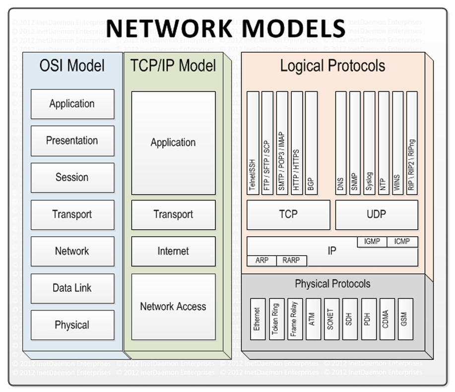

# Capítulo 5 – Modelo TCP/IP

No capítulo anterior, dissecamos o Modelo OSI, um mapa conceitual abrangente e formal para a comunicação em rede. Agora, vamos direcionar nosso foco para o **Modelo TCP/IP**, que pode ser considerado a **implementação prática** e o conjunto de protocolos que de fato rege o funcionamento da Internet e da grande maioria das redes atuais.

É fundamental iniciar este estudo com a clareza de que os conceitos dos modelos OSI e TCP/IP, por diversas vezes, se sobrepõem e se complementam. Enquanto o OSI é o modelo de referência teórico ideal, o TCP/IP é a suíte de protocolos funcional que se provou mais prática e resiliente, tornando-se o padrão global.

## Origens e Filosofia do Modelo TCP/IP

A arquitetura TCP/IP não nasceu de um comitê de padronização, mas de uma necessidade prática. Seu desenvolvimento começou na década de 1970, com o patrocínio da **ARPA (Advanced Research Projects Agency)**, uma agência do Departamento de Defesa dos Estados Unidos. O objetivo era criar uma rede de longa distância robusta e resiliente, a **ARPANET**, que pudesse sobreviver a falhas parciais (uma preocupação estratégica durante a Guerra Fria) e interconectar diferentes sistemas de computadores em centros de pesquisa.

Essa origem militar e acadêmica moldou a filosofia do TCP/IP, que se diferencia da abordagem mais formal do OSI:

- **Pragmatismo e Resiliência:** O modelo foi construído com o objetivo de funcionar em um ambiente heterogêneo e pouco confiável. A inteligência da rede foi deliberadamente movida para as pontas (os hosts), enquanto o núcleo da rede foi mantido o mais simples possível, com a única tarefa de encaminhar pacotes da melhor forma que puder.
- **Modelo Aberto e Evolutivo:** Os protocolos não foram impostos, mas desenvolvidos de forma colaborativa e documentados em publicações chamadas **RFCs (Request for Comments)**. Esse processo aberto permitiu uma rápida evolução e adaptação.

## Arquitetura de 4 Camadas do TCP/IP

Diferentemente do modelo OSI com suas sete camadas, a arquitetura de protocolos TCP/IP, conforme definida em suas RFCs originais (como a RFC 793), é estruturada em **quatro camadas** mais amplas.

1. **Camada de Acesso à Rede (Network Access Layer):** Esta é a camada mais baixa e combina as funcionalidades das camadas Física (1) e de Enlace (2) do modelo OSI. Ela é responsável por todos os detalhes de hardware e protocolos necessários para a transmissão física dos dados, como a conversão de bits em sinais elétricos, o endereçamento MAC e o acesso ao meio. O TCP/IP não define protocolos específicos para esta camada; ele foi projetado para ser agnóstico e operar sobre qualquer tecnologia de rede existente ou futura (Ethernet, Wi-Fi, Token Ring, etc.).
2. **Camada de Internet (Internet Layer):** Corresponde diretamente à Camada de Rede (3) do OSI. Esta camada é o coração do modelo TCP/IP. Seu principal protocolo, o **IP (Internet Protocol)**, é responsável pelo endereçamento lógico, pelo encapsulamento dos dados em pacotes (ou datagramas) e pelo roteamento desses pacotes através da inter-rede para que cheguem à rede de destino correta.
3. **Camada de Transporte (Transport Layer):** Corresponde diretamente à Camada de Transporte (4) do OSI. Ela estabelece a comunicação lógica entre os hosts de origem e destino. É aqui que operam os dois principais protocolos de serviço: o **TCP (Transmission Control Protocol)**, que oferece uma comunicação confiável e orientada à conexão, e o **UDP (User Datagram Protocol)**, que oferece uma comunicação rápida e não orientada à conexão.
4. **Camada de Aplicação (Application Layer):** Esta camada combina as funções das camadas de Sessão (5), Apresentação (6) e Aplicação (7) do OSI. Ela contém os protocolos de alto nível que as aplicações utilizam para se comunicar pela rede. Exemplos incluem **HTTP** para navegação web, **SMTP** para e-mail e **FTP** para transferência de arquivos.

Ainda que o modelo formal possua quatro camadas, é importante notar que, por razões puramente didáticas, diversos autores e materiais de estudo (incluindo os de Tanenbaum e Kurose) apresentam o TCP/IP em uma estrutura de cinco camadas, onde a camada de "Acesso à Rede" é dividida novamente em Física e Enlace para melhor alinhamento com a estrutura do OSI.

A grande força do modelo TCP/IP reside em sua flexibilidade, especialmente na camada de Acesso à Rede. Ao não ditar uma tecnologia específica, ele permitiu a interconexão de redes completamente heterogêneas, de diferentes fabricantes e tecnologias, formando a base para a rede global e diversa que é a Internet hoje.

## Comparando os Modelos: OSI vs. TCP/IP

Embora o Modelo OSI seja a referência teórica fundamental, a arquitetura de protocolos que prevaleceu e se tornou o padrão de fato da Internet é a TCP/IP. É essencial entender como esses dois modelos se relacionam, pois muitas das funcionalidades descritas nas camadas OSI são implementadas por protocolos da pilha TCP/IP.

### Mapeamento de Camadas e Protocolos

A melhor forma de visualizar a relação entre os modelos é através de um mapeamento direto de suas camadas, que também nos permite posicionar os principais protocolos que compõem a arquitetura TCP/IP. Embora os protocolos específicos sejam detalhados em capítulos futuros, o diagrama a seguir oferece um quadro resumo de grande importância.

Analisando a imagem, podemos extrair várias conclusões importantes:

- **Camada de Acesso à Rede:** No TCP/IP, esta camada corresponde às camadas Física e de Enlace do OSI. Ela não define um protocolo específico, mas opera sobre tecnologias existentes como Ethernet, Token Ring, ATM e tecnologias sem fio como GSM.
- **Camada Internet:** Corresponde à camada de Rede do OSI. O protocolo central aqui é o **IP (Internet Protocol)**, auxiliado por outros protocolos de suporte como **ARP**, **ICMP** e **IGMP**.
- **Camada de Transporte:** Alinhada com a camada de Transporte do OSI, ela oferece os dois principais serviços de comunicação fim a fim através do **TCP** e do **UDP**.
- **Camada de Aplicação:** Esta camada do TCP/IP engloba as responsabilidades das camadas de Sessão, Apresentação e Aplicação do OSI. É aqui que reside a vasta maioria dos protocolos que os usuários e as aplicações interagem diretamente, como **HTTP**, **FTP**, **SMTP**, **DNS**, entre outros.

### Nomenclatura: Arquitetura vs. Protocolos

Um ponto de confusão recorrente, inclusive em materiais técnicos, é o uso do termo "TCP/IP". É crucial fazer a seguinte distinção:

- **Arquitetura ou Pilha de Protocolos TCP/IP:** Refere-se ao **modelo de 4 camadas completo**, com todo o conjunto de protocolos que o compõem. Esta é a forma correta de se referir ao modelo como um todo.
- **Protocolos TCP e IP:** Referem-se a **dois protocolos específicos** dentro da arquitetura. O TCP opera na camada de Transporte e o IP na camada de Internet. Eles são os protocolos mais importantes e dão nome à pilha, mas não são a pilha inteira.

Portanto, a frase "O protocolo TCP/IP faz o roteamento..." está tecnicamente incorreta. O correto seria:

> "A arquitetura de protocolos TCP/IP define o roteamento na camada de Internet..."
> 
> OU
> 
> "O protocolo IP, que faz parte da arquitetura TCP/IP, é responsável pelo roteamento..."

### Principais Diferenças Estruturais

Como o diagrama ilustra, as duas grandes diferenças na estrutura dos modelos são:

1. **Consolidação das Camadas Inferiores:** O modelo TCP/IP não se preocupa com os detalhes da transmissão física e do enlace local. Ele abstrai essas funções em uma única **Camada de Acesso à Rede**, assumindo que alguma tecnologia existente cumprirá esse papel.
2. **Consolidação das Camadas Superiores:** O TCP/IP agrupa as funções de gerenciamento de diálogo (Sessão), formatação de dados (Apresentação) e os serviços de rede (Aplicação) em uma única **Camada de Aplicação**. Na prática, a própria aplicação final é responsável por gerenciar esses aspectos.

### Variações de Nomenclatura

Para complementar, é comum encontrar diferentes nomes para as camadas do modelo TCP/IP em diversas bibliografias. A tabela abaixo resume as nomenclaturas mais comuns:

| Camada Formal (RFC) | Nomes Alternativos Comuns                                          | Correspondência OSI             |
| ------------------- | ------------------------------------------------------------------ | ------------------------------- |
| **Aplicação**       | Camada de Processo                                                 | Aplicação, Apresentação, Sessão |
| **Transporte**      | Camada Host-a-Host                                                 | Transporte                      |
| **Internet**        | Camada de Rede, Camada Inter-rede ou Rede                          | Rede                            |
| **Acesso à Rede**   | Camada de Enlace, Camada de Interface de Rede ou Cama de Host/Rede | Enlace, Física                  |

## Considerações Finais

Neste capítulo, fizemos a transição fundamental do modelo de referência teórico, o OSI, para a arquitetura de protocolos que se tornou a espinha dorsal da Internet e das redes modernas: a **pilha de protocolos TCP/IP**. Vimos que, embora compartilhem muitos princípios, os dois modelos nasceram de filosofias distintas. Enquanto o OSI é um guia conceitual abrangente, o TCP/IP emergiu de uma necessidade prática de criar uma rede resiliente e interoperável, a ARPANET.

Exploramos a estrutura pragmática do TCP/IP, consolidada em **quatro camadas**: Acesso à Rede, Internet, Transporte e Aplicação. Detalhamos como essa arquitetura mais enxuta mapeia as funcionalidades do modelo de sete camadas do OSI, combinando as camadas Física e de Enlace em uma única camada de Acesso à Rede, e as camadas de Sessão, Apresentação e Aplicação em uma única camada de Aplicação.

Foi destacada a importância da terminologia correta, diferenciando a **arquitetura TCP/IP** como um todo dos seus dois protocolos mais famosos, o **TCP** e o **IP**, que atuam como o núcleo das camadas de Transporte e Internet, respectivamente.

Ao final, fica claro que o sucesso e a dominância do TCP/IP residem em sua flexibilidade e em seu design aberto e robusto. Ele não prescreve tecnologias rígidas, especialmente em suas camadas mais baixas, permitindo que opere sobre praticamente qualquer meio físico e de enlace. Essa adaptabilidade foi crucial para que ele se tornasse a linguagem universal da comunicação em rede.

Ao dominar a distinção entre o modelo de referência ideal (OSI) e a arquitetura funcional da Internet (TCP/IP), estamos equipados com o vocabulário e a estrutura mental para analisar qualquer processo de comunicação. Com este alicerce arquitetônico estabelecido, estamos preparados para mergulhar nos detalhes dos protocolos que compõem esta pilha.