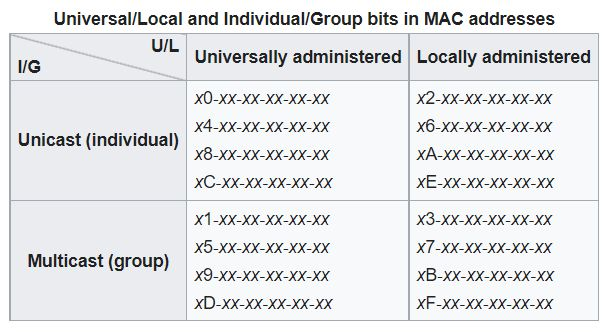
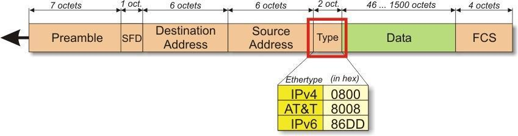
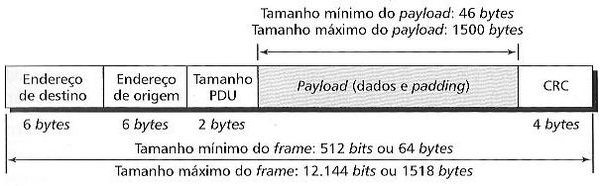
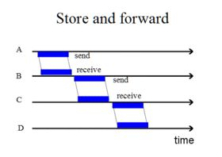
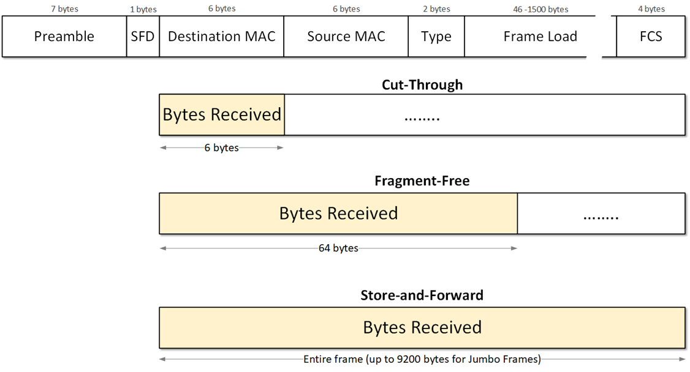

# Capítulo 6 – Protocolos e Tecnologias da Camada de Acesso à Rede

Nos capítulos anteriores, estabelecemos a arquitetura conceitual dos modelos OSI e TCP/IP. Vimos que a camada mais baixa da pilha TCP/IP, a Camada de Acesso à Rede, é uma fusão das responsabilidades das camadas Física e de Enlace do modelo OSI. Esta camada fundamental serve como a ponte entre o mundo lógico dos pacotes de software e o mundo físico dos sinais elétricos, luminosos ou de rádio. Como vimos, ela será responsável por prover meios de acesso ao meio físico, controlar o fluxo de dados, estabelecer critérios de identificação e, crucialmente, lidar com a inevitabilidade de erros na transmissão.

Este capítulo é dedicado a explorar os protocolos e tecnologias que operam nesta camada. Iniciaremos nossa jornada analisando um dos problemas mais fundamentais da comunicação: como garantir que os dados recebidos sejam exatamente os mesmos que foram enviados?

## Detecção e Correção

Quando um dispositivo prepara dados para transmissão, a Camada de Enlace (operando dentro da Camada de Acesso à Rede do TCP/IP) organiza os pacotes recebidos da camada superior em unidades chamadas **quadros** (_frames_). Esses quadros, que são longas sequências de bits, são então entregues à Camada Física para serem convertidos em sinais e enviados através de um meio de transmissão.

Como exploramos no Capítulo 2, nenhum meio de transmissão é perfeito. Os sinais estão sujeitos a uma variedade de interferências, como ruído eletromagnético, atenuação e diafonia, que podem corromper os dados durante o trânsito. Um pulso de +5V (representando um bit '1') pode chegar ao receptor com uma voltagem tão baixa que é interpretado como 0V (um bit '0').

Simplesmente ignorar esses erros é inviável. Portanto, a Camada de Acesso à Rede implementa mecanismos robustos para lidar com eles. Essas estratégias se dividem em duas categorias principais:

1. **Detecção de Erros:** Técnicas que permitem ao receptor identificar que um quadro foi corrompido durante a transmissão. A ação mais comum ao detectar um erro é simplesmente **descartar o quadro** corrompido, confiando que um protocolo de camada superior (como o TCP) notará a perda e solicitará uma retransmissão.
2. **Correção de Erros:** Técnicas mais complexas que não apenas detectam um erro, mas também possuem informação suficiente para **identificar qual bit foi alterado e corrigi-lo** no lado do receptor, sem a necessidade de uma retransmissão.

A escolha entre detecção e correção depende da confiabilidade do meio. Em meios relativamente confiáveis, como fibra óptica e cabos de par trançado modernos, a detecção de erros é mais eficiente; é mais rápido descartar um quadro ocasionalmente corrompido do que adicionar a grande sobrecarga de dados (_overhead_) necessária para a correção de erros em cada quadro. Em meios muito propensos a erros, como a comunicação sem fio, a correção de erros (chamada de FEC - Forward Error Correction) torna-se vital.

Vamos analisar as três principais técnicas de _detecção_ de erros utilizadas em redes.

### Verificação de Paridade

A verificação de paridade é a técnica de detecção de erros mais simples. Sua lógica é adicionar um único bit extra a um bloco de dados, chamado de **bit de paridade**, para que o número total de bits '1' no bloco resultante seja sempre par (no caso da **paridade par**) ou sempre ímpar (no caso da **paridade ímpar**).

O transmissor e o receptor devem concordar previamente com qual tipo de paridade estão usando.

- **Exemplo com Paridade Par:** O transmissor deseja enviar a sequência de dados: `110100`
    1. Ele conta o número de bits '1' na sequência: existem 3 bits '1'.
    2. Como o objetivo é a paridade _par_ (um número par de bits '1'), e ele atualmente tem 3 (ímpar), ele adiciona um bit de paridade igual a **`1`**.
    3. A sequência final transmitida é: **`1101001`**. O número total de bits '1' agora é 4 (par).

Se o receptor receber a sequência `1101001`, ele conta 4 bits '1' (par), assume que os dados estão corretos e remove o bit de paridade, recuperando o `110100` original.

#### Detecção de Erros com Paridade

Agora, suponha que um erro ocorra durante a transmissão, alterando um único bit:

- Sequência Transmitida: `1101001`
- Sequência Recebida (com 1 erro): **`0`**`101001`
- O receptor conta os bits '1' na sequência recebida e encontra 3 (ímpar).
- Como o receptor esperava uma quantidade _par_ de bits '1', ele sabe que ocorreu um erro e descarta o quadro.

#### Fraqueza da Paridade Simples

A grande limitação da paridade simples é que ela só é capaz de detectar um número **ímpar** de erros (1, 3, 5, etc.). Se um número _par_ de bits for alterado, o mecanismo de paridade falha.

- Sequência Transmitida: `1101001`
- Sequência Recebida (com 2 erros): **`0`**`1`**`1`**`1001`
- O receptor conta os bits '1' na sequência recebida e encontra 4 (par).
- O receptor assume que o quadro está correto, embora os dados estejam corrompidos. O erro passa despercebido.

#### Paridade Bidimensional

Para superar a fragilidade da paridade simples e até mesmo adicionar capacidade de _correção_, pode-se usar a **paridade bidimensional**. Nessa técnica, os dados são organizados em uma matriz (linhas e colunas). Um bit de paridade é calculado para cada linha e para cada coluna.

Imagine que queremos enviar 12 bits: `1101 0110 1011`

1. **Organização em Matriz:**
    
    ```
    1 1 0 1
    0 1 1 0
    1 0 1 1
    ```
    
2. **Cálculo da Paridade (Par):** Calculamos a paridade para cada linha (à direita) e cada coluna (abaixo).
    
    ```
    1 1 0 1 | 1  (3 bits '1')
    0 1 1 0 | 0  (2 bits '1')
    1 0 1 1 | 1  (3 bits '1')
    ---------
    0 0 0 0
    ```
    
    (A paridade das colunas `101`, `110`, `011`, `101` resulta em `0000`.)
    
3. **Transmissão:** O transmissor envia os dados e os bits de paridade.
4. **Detecção e Correção no Receptor:** Suponha que um bit de dados seja corrompido, e o receptor receba:
    
    ```
    1 1 0 1 | 1
    0 1 0 0 | 0  <-- Erro aqui (era 1)
    1 0 1 1 | 1
    ---------
    0 0 0 0
    ```
    
    O receptor recalcula as paridades:
    - Paridade da Linha 2: `0+1+0+0 = 1`. O bit de paridade recebido foi `0`. **Há um erro na Linha 2.**
    - Paridade da Coluna 3: `0+0+1 = 1`. O bit de paridade recebido foi `0`. **Há um erro na Coluna 3.**
    
O receptor agora sabe que o erro está na intersecção da **Linha 2** com a **Coluna 3**. Ele pode, então, inverter o bit naquela posição (de `0` para `1`), corrigindo o dado original sem precisar de retransmissão. Esta técnica é significativamente mais robusta, mas exige um _overhead_ maior de bits de controle.

### Método de Soma de Verificação (Checksum)

O método de **soma de verificação** (ou _Checksum_) é outra técnica de detecção de erros que oferece uma proteção relativamente baixa, mas com uma vantagem crucial: é muito simples de implementar em software e exige pouco poder de processamento.

Por essa razão, o _checksum_ é amplamente utilizado na Camada de Transporte, pelos protocolos **TCP e UDP**. Como a Camada de Transporte opera a nível de software (dentro do sistema operacional), um baixo consumo de processamento no cálculo de erros é fundamental para não sobrecarregar a CPU do dispositivo.

O processo básico funciona da seguinte maneira:

1. **Transmissor:**
    - Divide os dados do segmento em blocos de tamanho fixo (ex: 16 bits).
    - Soma todos esses blocos usando um tipo especial de aritmética (chamada aritmética de complemento a um).
    - Calcula o "complemento a um" do resultado final dessa soma. Este valor final é o _checksum_.
    - O _checksum_ é inserido em um campo específico no cabeçalho do segmento (TCP ou UDP).

2. **Receptor:**
    - Recebe o segmento e divide os dados (incluindo o campo _checksum_) nos mesmos blocos de 16 bits.
    - Soma todos os blocos (incluindo o _checksum_ recebido).
    - Se o resultado final da soma for uma sequência de todos os bits '1', o segmento é considerado livre de erros. Se qualquer outro valor for obtido, um erro foi detectado e o segmento é descartado.

Embora seja melhor que a paridade simples, o _checksum_ ainda pode falhar em detectar certos tipos de erros (como a transposição de dois blocos de dados).

### Verificação de Redundância Cíclica (CRC)

A **Verificação de Redundância Cíclica**, ou **CRC**, é a técnica de detecção de erros mais poderosa e amplamente utilizada nas tecnologias da Camada de Enlace (como Ethernet e Wi-Fi). Ela é significativamente mais robusta que a paridade ou o _checksum_, especialmente na detecção de **erros em rajada** (_burst errors_), onde múltiplos bits consecutivos são corrompidos, um cenário muito comum em meios físicos.

O CRC exige um processamento de cálculo mais intensivo. No entanto, como a Camada de Enlace opera primariamente a nível de hardware (na placa de rede), esses cálculos são realizados por chips dedicados (ASICs), não impactando o processamento da CPU principal do dispositivo.

O CRC é baseado em aritmética de polinômios. A sequência de bits a ser transmitida é tratada como um polinômio, onde cada bit é o coeficiente (0 ou 1) de um termo.

- Exemplo: A sequência `11001` corresponde ao polinômio $1x^4 + 1x^3 + 0x^2 + 0x^1 + 1x^0$, ou simplesmente $x^4 + x^3 + 1$.

O funcionamento do CRC pode ser resumido da seguinte forma:

1. O transmissor e o receptor concordam previamente com um **polinômio gerador** (ou chave geradora), que também é uma sequência de bits. O tamanho desse gerador define o padrão do CRC.
2. O transmissor pega o quadro de dados e adiciona $n$ bits '0' ao final, onde $n$ é o número de bits no gerador (menos um).
3. Ele divide essa longa sequência de bits pelo polinômio gerador, usando uma aritmética binária especial (baseada em XOR) chamada divisão polinomial.
4. O **resto** dessa divisão é o _checksum_ do CRC. Esse resto terá $n$ bits.
5. O transmissor substitui os $n$ bits '0' que ele havia adicionado ao quadro de dados pelo _checksum_ (o resto da divisão). Este quadro final (dados + CRC) é o que é enviado.
6. O receptor recebe o quadro (dados + CRC) e o divide _exatamente_ pelo mesmo polinômio gerador.
7. Se o quadro foi recebido sem erros, o resto dessa divisão será **zero**. Se o resto for qualquer valor diferente de zero, o receptor sabe que um erro ocorreu e descarta o quadro.

Os padrões de CRC são nomeados de acordo com o tamanho do _checksum_ gerado:

- **CRC-8, CRC-12, CRC-16, CRC-32**

O padrão **CRC-32** é o mais utilizado pelos padrões do IEEE (como o Ethernet) e oferece um nível de proteção extremamente alto, sendo capaz de detectar a grande maioria dos erros possíveis, incluindo todos os erros em rajada de até 32 bits.

### Distância de Hamming

Para quantificar a capacidade de um código de detectar ou corrigir erros, utiliza-se um conceito chamado **Distância de Hamming**. Este parâmetro define a robustez de um conjunto de palavras-código.

A "Distância de Hamming" entre duas palavras-código (sequências de bits) de mesmo tamanho é simplesmente a **quantidade de bits que são diferentes** entre elas.

- **Exemplo:**
    - Palavra-código A: `01101011`
    - Palavra-código B: `11110000`
    
    Para calcular a distância, comparamos bit a bit (ou, mais formalmente, fazemos uma operação XOR):
    
    ```
        0110 1011
    XOR 1111 0000
    -------------
        1001 1011
    ```
    
    Contando os bits '1' no resultado, vemos que a Distância de Hamming entre A e B é **5**. Isso implica que seriam necessárias 5 alterações de bits para transformar a palavra A na palavra B.

A Distância de Hamming de um _código_ (um conjunto de todas as palavras-código válidas) é a menor distância entre quaisquer dois pares de palavras-código nesse conjunto. Esse valor nos diz o quão "separadas" as palavras-código estão umas das outras e, portanto, o quão robustas elas são a erros.

Este conceito nos leva a duas regras fundamentais:

1. **Regra de Detecção:** Para ser capaz de detectar até $d$ erros, um código precisa ter uma Distância de Hamming de, no mínimo, **$d + 1$**.
    - _Exemplo:_ A paridade simples (que vimos acima) transforma `110` em `1100` e `111` em `1111` (paridade par). A distância entre `1100` e `1111` é 2. Com uma distância de 2, o código pode detectar $d = 2 - 1 = 1$ erro. Ele não pode garantir a detecção de 2 erros, como já comprovamos.

2. **Regra de Correção:** Para ser capaz de corrigir até $t$ erros, um código precisa ter uma Distância de Hamming de, no mínimo, **$2t + 1$**.
    - _Exemplo:_ Para criar um código que possa corrigir 1 bit de erro ($t=1$), precisamos de uma Distância de Hamming de pelo menos $2(1) + 1 = 3$. Isso significa que as palavras-código válidas devem ser "distantes" o suficiente umas das outras para que, mesmo que um bit seja alterado, a palavra corrompida ainda esteja "mais perto" da palavra original do que de qualquer outra palavra-código válida.

## Endereçamento da Camada de Acesso à Rede

Após estabelecermos mecanismos para verificar a integridade de um quadro de dados, a próxima questão fundamental é: como identificar o remetente e o destinatário desse quadro? Em uma rede local, onde dezenas ou centenas de dispositivos podem compartilhar o mesmo meio, é essencial que exista um sistema de endereçamento que permita a um quadro ser entregue _exclusivamente_ ao seu destino correto.

Todo dispositivo que se conecta a uma rede, seja um computador, impressora, smartphone ou servidor, precisa de uma interface de rede (como uma Placa de Rede ou NIC). A Camada de Acesso à Rede atribui a cada uma dessas interfaces um identificador único para a comunicação no enlace local. Esse endereço é conhecido como **Endereço MAC (Media Access Control)**, ou, de forma mais popular, endereço físico.

### Estrutura do Endereço MAC

Na grande maioria das tecnologias de rede modernas, incluindo Ethernet e Wi-Fi, os endereços MAC são compostos por **6 bytes (48 bits)**. Essa extensão permite um número astronômico de endereços únicos: $2^{48}$, ou mais de 281 trilhões de combinações, garantindo que, na teoria, nunca existam dois dispositivos no mundo com o mesmo endereço.

Esses endereços são tipicamente representados no formato hexadecimal, com os bytes separados por dois-pontos ou hífens. Por exemplo: `47:3E:2A:B2:11:24`.

Este endereço é, em geral, gravado permanentemente na memória ROM da interface de rede pelo fabricante, e é por isso que também é conhecido como "endereço de hardware" ou "endereço queimado" (_burned-in address_). Sua estrutura de 48 bits é dividida em duas metades:

1. **OUI (Organizationally Unique Identifier):** Os primeiros 3 bytes (24 bits) do endereço identificam o fabricante da placa. Este bloco é distribuído e controlado por uma autoridade central, o **IEEE (Institute of Electrical and Electronics Engineers)**. Ao consultar o OUI, é possível saber quem fabricou o dispositivo.
2. **Identificador de Interface (Número de Série):** Os últimos 3 bytes (24 bits) são um número sequencial único atribuído pela própria fabricante.

Usando o exemplo anterior, `47:3E:2A:B2:11:24`:

- O OUI é `47:3E:2A` (identifica o fabricante).
- O Número de Série é `B2:11:24` (identifica a placa específica daquele fabricante).

### Endereço MAC vs. Endereço IP

É crucial entender a diferença de papéis entre o endereço MAC (Camada 2) e o endereço IP (Camada 3).

- Um **Endereço IP** é um endereço _lógico_. Ele é temporário (geralmente atribuído dinamicamente) e hierárquico, identificando a rede à qual um dispositivo está conectado. Pense nele como o **CEP e o endereço de uma casa**: ele muda se você se mudar para outra cidade.
- Um **Endereço MAC** é um endereço _físico_. Ele é (em tese) permanente e único, identificando a interface de hardware. Pense nele como o **CPF ou o chassi do carro**: ele é fixo e acompanha o dispositivo, não importa em qual rede ele se conecte.

Quando os dispositivos estão dentro de uma **mesma rede local** (ou seja, no mesmo domínio de broadcast), a comunicação e o encaminhamento de quadros são baseados _exclusivamente_ no endereço MAC. O switch, que é o "carteiro do bairro", só precisa olhar o endereço MAC de destino para saber em qual porta entregar o quadro.

Mas então, fica a pergunta: e quando um pacote vem de uma rede diferente, com outro endereço IP? Se o switch só entende MAC, como ele sabe para quem entregar?

Aqui entra a colaboração entre as camadas. O roteador, que faz a fronteira entre as redes, usa um protocolo auxiliar chamado **ARP (Address Resolution Protocol)**, que atua na camada de rede. O ARP basicamente "pergunta" (via broadcast) na rede local: "Quem possui o endereço IP `192.168.1.50`?" O dispositivo que possui esse IP responde à requisição, informando: "Sou eu, e o meu endereço MAC é `47:3E:2A:B2:11:24`." De posse dessa informação, o roteador pode então encapsular o pacote IP dentro de um quadro de Camada 2 com o MAC de destino correto, e o switch local pode finalmente fazer a entrega. (Veremos o ARP em detalhe em capítulos futuros).

### Tipos de Endereçamento MAC

O endereço MAC não é usado apenas para comunicação de um dispositivo para outro. Ele define três tipos de tráfego na rede local:

1. **Unicast:** É a comunicação "um-para-um". O quadro possui o MAC de origem do remetente e o MAC de destino do destinatário específico. Esta é a forma mais comum de comunicação.
2. **Broadcast:** É a comunicação "um-para-todos". O quadro é enviado para um endereço MAC especial de broadcast, que é, por padrão, **`FF:FF:FF:FF:FF:FF`**. Este endereço é uma sequência de 48 bits '1'. Por convenção, todas as interfaces de rede em um domínio de broadcast são obrigadas a "escutar" e processar quadros enviados para este endereço. É o "grito" da rede, usado por protocolos como o ARP (para descobrir um MAC) e o DHCP (para solicitar um endereço IP).
3. **Multicast:** É a comunicação "um-para-muitos". O quadro é enviado para um endereço MAC de grupo especial, que representa um subconjunto de dispositivos na rede (mas não todos). Dispositivos que desejam receber essa informação (como um stream de vídeo, por exemplo) "assinam" esse grupo. Isso é muito mais eficiente do que enviar um broadcast (que sobrecarregaria todos) ou múltiplas cópias unicast (que desperdiçaria banda).

#### Decodificando os Bits de Controle (I/G e U/L)

O endereço MAC não é apenas um número de série; os primeiros bits do endereço contêm informações de controle importantes que definem o tipo de endereço. O primeiro byte (os dois primeiros dígitos hexadecimais) contém dois "flags" (bits de controle):

- **Bit I/G (Individual / Group):** É o primeiro bit (o bit menos significativo) do primeiro byte. Ele define se o endereço é para um dispositivo individual ou para um grupo.
    - **I/G = 0:** Endereço **Individual (Unicast)**.
    - **I/G = 1:** Endereço de **Grupo (Multicast ou Broadcast)**.

- **Bit U/L (Universal / Local):** É o segundo bit (o segundo menos significativo) do primeiro byte. Ele define se o endereço é globalmente único (de fábrica) ou se foi atribuído manualmente.
    - **U/L = 0:** Endereço **Universalmente Administrado**. Este é o endereço padrão "queimado de fábrica", contendo o OUI do fabricante.
    - **U/L = 1:** Endereço **Localmente Administrado**. Permite que um administrador de rede sobrescreva manualmente o MAC de um dispositivo (por exemplo, em máquinas virtuais ou para políticas de rede), usando um endereço que garantidamente não conflitará com nenhum endereço de fábrica.

A tabela a seguir, baseada nas especificações do IEEE, ilustra como esses bits de controle, refletidos no _segundo dígito hexadecimal_ do endereço MAC, definem a natureza do tráfego.

<div align="center">

</div>

Analisando a tabela, podemos extrair uma regra de bolso muito útil. O destaque fica por conta do **segundo dígito hexadecimal** do endereço MAC (representado na tabela por 0, 1, 2, 3, 4, etc.).

- Se este dígito for **par** (0, 2, 4, 6, 8, A, C, E), o bit I/G correspondente é 0, e trata-se de um endereço **Unicast (Individual)**.
- Se este dígito for **ímpar** (1, 3, 5, 7, 9, B, D, F), o bit I/G correspondente é 1, e trata-se de um endereço de **Multicast (Grupo)**.

Como o endereço de broadcast (`FF:FF:FF:FF:FF:FF`) possui 'F' (um número ímpar) como seu segundo dígito, ele se encaixa corretamente na regra como um tipo de endereço de grupo. É importante reforçar que, ao avaliar se um dígito hexadecimal é par ou ímpar, vamos além do 9, onde: A = 10 (par), B = 11 (ímpar), C = 12 (par), D = 13 (ímpar), E = 14 (par) e F = 15 (ímpar).

## Protocolo Ethernet

Se existe um protocolo que define a rede local (LAN) moderna, é o **Ethernet**. É o principal e mais onipresente protocolo utilizado em redes locais cabeadas. Como as LANs representam a vasta maioria das redes com as quais interagimos diariamente, pode-se afirmar que o protocolo Ethernet está presente em boa parte de todas as redes operacionais atualmente.

Sua história começa nos laboratórios da Xerox, no Vale do Silício, na década de 1970. O padrão original, conhecido como **Ethernet DIX** (em referência às três empresas que colaboraram em sua segunda versão: Digital, Intel e Xerox), estabeleceu as bases para a comunicação em redes locais. Pouco tempo depois, o **IEEE** (Institute of Electrical and Electronics Engineers) adaptou e padronizou esse protocolo sob a nomenclatura **IEEE 802.3**.

Justamente por essa condição, onde o 802.3 é uma padronização formal do conceito original do Ethernet DIX, diversos textos e até mesmo profissionais da área acabam tratando os dois como idênticos. Na prática, as diferenças originais eram mínimas (principalmente em um campo do cabeçalho do quadro, chamado "Tipo" no Ethernet DIX e "Comprimento" no IEEE 802.3) e, com o tempo, os padrões convergiram, tornando-se interoperáveis para todos os fins práticos.

### Ethernet no Contexto da Família IEEE 802

O IEEE 802.3 (Ethernet) é parte de uma família maior de padrões, que inclui outros protocolos de acesso muito conhecidos, como o **IEEE 802.11 (WLAN ou Wi-Fi)** e o histórico IEEE 802.5 (Token Ring). Um ponto fundamental a se ressaltar é que a grande diferença entre esses protocolos reside na parte inferior da Camada de Acesso à Rede, ou seja, na Camada Física e na subcamada **MAC (Media Access Control)** da Camada de Enlace.

Como vimos anteriormente, a Camada de Enlace é dividida em duas subcamadas:

- **MAC (Controle de Acesso ao Meio):** Define o endereçamento físico (endereço MAC) e as regras de acesso ao meio (ex: CSMA/CD para 802.3, CSMA/CA para 802.11).
- **LLC (Controle do Enlace Lógico):** Atua como a interface com a camada superior (a Camada de Rede).

Ambos os padrões, 802.3 e 802.11, utilizam a mesma subcamada LLC (padronizada como IEEE 802.2). Portanto, sob a ótica da Camada de Rede, não há nenhuma informação sobre qual meio físico está sendo utilizado. O protocolo IP simplesmente entrega um pacote para a subcamada LLC, e esta o encaminha para a subcamada MAC apropriada (seja ela Ethernet ou Wi-Fi), que se encarregará de formatar o quadro e acessar o meio físico.

### Padrão Ethernet Clássico (10 Mbps)

A rede Ethernet padrão, em suas primeiras implementações, foi definida para a interligação de dispositivos em uma LAN a taxas de transmissão de **10 Mbps**, operando no formato **Half-Duplex**.

Nessa era inicial, utilizava-se o **Hub** como equipamento central de interconexão. Como vimos no Capítulo 3, o hub é um dispositivo de Camada 1 que não realiza processamento inteligente de quadros. Com isso, tínhamos uma estrutura de rede com topologia _física_ em estrela (se usando cabos 10BaseT) ou _física_ em barramento (se usando cabos 10Base2/5), mas que, em ambos os casos, resultava em uma topologia _lógica_ em **barramento**.

Esse barramento lógico gerava tráfego em **difusão (broadcast)** para todos os dispositivos da rede; qualquer sinal enviado por um nó era replicado para todos os outros. Nesse contexto, o controle de acesso ao meio era totalmente descentralizado e residia nos próprios dispositivos, que se valiam do protocolo **CSMA/CD (Carrier Sense Multiple Access with Collision Detection)** para "ouvir" o meio, detectar colisões e coordenar o acesso, evitando que dois dispositivos transmitissem ao mesmo tempo.

Os padrões do Ethernet clássico são nomeados de acordo com sua velocidade, tipo de transmissão e meio físico:

- **10Base5:** Utilizava o cabo coaxial grosso (Thicknet), permitindo segmentos de até 500 metros.
- **10Base2:** Utilizava o cabo coaxial fino (Thinnet), uma alternativa mais barata e flexível, com segmentos de até 185 metros.
- **10BaseT:** O padrão que se tornou dominante, utilizando cabo de par trançado (Twisted Pair).

### Padrão Fast Ethernet (100 Mbps)

Com a crescente demanda por velocidade, o padrão Ethernet evoluiu para o **Fast Ethernet**, que se consolidou rapidamente como a tecnologia padrão em redes LAN por muitos anos. O Fast Ethernet eleva a taxa de transmissão para **100 Mbps**.

Originalmente, ele também foi projetado para operar em modo **Half-Duplex** (ainda dependendo de hubs e CSMA/CD), mas sua grande vantagem foi o suporte ao modo **Full-Duplex**.

- **Operação Full-Duplex:** Ao utilizar um **Switch** (dispositivo de Camada 2) em vez de um Hub, cada porta do switch se torna um domínio de colisão isolado. Isso elimina a possibilidade de colisões entre os dispositivos conectados às portas do switch.
    - Uma consequência direta disso é que o **CSMA/CD não é mais necessário** e é desabilitado. O dispositivo pode transmitir e receber dados simultaneamente.
    - Isso nos leva a uma interpretação comum em materiais técnicos e provas: quando um enlace opera em modo Full-Duplex, o Fast Ethernet é capaz de suportar um _throughput_ (vazão) agregado de **200 Mbps** (100 Mbps para enviar e 100 Mbps para receber, ao mesmo tempo). Tal analogia também vale para o padrão Ethernet clássico (10 Mbps), que em Full-Duplex alcança uma vazão agregada de 20 Mbps.

Para facilitar a migração, o Fast Ethernet manteve o mesmo formato de quadro (frame), o mesmo MTU (Maximum Transmission Unit) e os mesmos mecanismos de endereçamento MAC do Ethernet clássico.

Os padrões mais comuns do Fast Ethernet são:

- **100Base-TX:** O sucessor direto do 10BaseT, utiliza cabo de par trançado (Categoria 5 ou superior). Assim como o 10BaseT, os dados são transmitidos usando **apenas dois dos quatro pares** de fios do cabo (um par para transmissão e outro para recepção).
- **100Base-FX:** Padrão para transmissão em fibra óptica, permitindo distâncias muito maiores.

#### Fim da Regra 5-4-3

Na era do Ethernet clássico (10 Mbps) com hubs/repetidores, a "Regra 5-4-3" era usada para limitar o diâmetro da rede e garantir que o CSMA/CD funcionasse. Com o Fast Ethernet, os bits são 10 vezes mais rápidos, encurtando o tempo disponível para a detecção de colisões. Isso tornou a Regra 5-4-3 obsoleta.

Para redes Fast Ethernet que ainda utilizavam repetidores (hubs), novas e mais restritas regras de topologia foram criadas, baseadas em duas classes de repetidores:

- **Repetidor Classe I:** Um repetidor Classe I é capaz de interligar segmentos de diferentes tipos físicos (por exemplo, 100Base-TX com 100Base-FX). Por realizar essa "tradução" de sinais, ele introduz um atraso maior. Em uma rede Fast Ethernet, só era permitido **um** repetidor Classe I. A distância máxima entre dois computadores seria de aproximadamente 200 metros (considerando segmentos de 100 metros).
- **Repetidor Classe II:** Este repetidor é mais rápido, pois só pode interligar segmentos do **mesmo tipo** (ex: 100Base-TX com 100Base-TX). Por ter um atraso menor, a regra permitia **até dois** repetidores Classe II em série. Para garantir a integridade do sinal, a distância do cabo _entre_ os dois repetidores era limitada a, no máximo, 5 metros.

### Padrão Gigabit Ethernet (1000 Mbps)

Se o Fast Ethernet consolidou o uso de switches, o **Gigabit Ethernet** representa o próximo salto lógico de desempenho, tornando-se rapidamente o padrão para novas instalações e infraestruturas de backbones locais. Atualmente, o padrão Gigabit Ethernet está se tornando cada vez mais presente nas redes de usuários finais e muito em breve assumirá o posto que hoje é das redes Fast Ethernet.

A concepção básica do Gigabit Ethernet buscou manter a compatibilidade com seus predecessores, mas introduziu uma mudança fundamental na topologia:

- **Abandono do Barramento Lógico:** A concepção original do padrão ainda previa a interconexão de duas ou mais estações. Entretanto, para qualquer cenário com três ou mais estações, o padrão Gigabit Ethernet determina que se deve utilizar, no mínimo, um **switch L2** através da topologia em estrela. Ele **não suporta mais a topologia em barramento**, nem a nível físico (como o 10Base2) nem a nível lógico (como o uso de hubs). O hub, um dispositivo de domínio de colisão compartilhado, é obsoleto neste padrão.

As redes Gigabit Ethernet operam com taxas de transmissão na casa de **1000 Mbps**, ou **1 Gbps**. O modo **Full-Duplex** é o método de operação padrão e esperado. O modo Half-Duplex também é suportado (para interoperabilidade com dispositivos legados, como "hubs Gigabit", que foram raros), mas é muito pouco utilizado na prática.

- **Controle de Acesso:** Quando operando em modo Full-Duplex (o cenário padrão com switches), não há possibilidade de colisões, e o mecanismo CSMA/CD é desativado. Em seu lugar, utiliza-se o **Flow Control (Controle de Fluxo)**, um padrão (IEEE 802.3x) que permite ao switch ou a um dispositivo final enviar um sinal de "pausa" para o transmissor, caso seu buffer de recepção esteja cheio, evitando a perda de quadros.
- **Vazão Agregada:** No mesmo sentido do Fast Ethernet, quando o Gigabit Ethernet opera em modo Full-Duplex, sua vazão (throughput) agregada pode ser considerada de **2 Gbps** (1 Gbps para transmissão e 1 Gbps para recepção simultâneos).

O padrão também manteve o formato dos quadros 802.3, garantindo plena compatibilidade com os padrões mais antigos. Isso significa que um quadro Ethernet pode atravessar um segmento Fast Ethernet e um segmento Gigabit Ethernet sem precisar ser modificado.

#### Padrões de Cabeamento e Codificação

Para alcançar a velocidade de 1000 Mbps, o padrão precisou de técnicas de cabeamento e codificação mais avançadas.

**Cabeamento de Par Trançado:**

O padrão mais comum para Gigabit Ethernet em cabo de cobre é o **1000Base-T**.

- Este padrão depende de cabos de par trançado Categoria 5 (CAT 5), no mínimo. No entanto, para garantir a integridade do sinal, recomenda-se fortemente o uso de cabos **CAT 5e** ou **CAT 6**.
- A grande mudança do 1000Base-T em relação ao 100Base-TX é que ele **utiliza todos os 4 pares de fios** do cabo par trançado. Mais do que isso, ele utiliza os 4 pares de forma **bidirecional e simultânea** (Full-Duplex em cada par), o que exige um processamento de sinal muito sofisticado para cancelar a interferência e o eco gerados dentro do próprio cabo.

Embora o 1000Base-T seja o padrão universal, existe também o **1000Base-TX**, que especifica o uso de **apenas 2 pares** para alcançar 1 Gbps. No entanto, este padrão exige, no mínimo, cabeamento **CAT 6** e não teve grande adoção de mercado em comparação com a flexibilidade do 1000Base-T.

**Padrões de Fibra Óptica e Outros:**

- **1000Base-SX:** Para fibra óptica multimodo (curto alcance, "Short Wavelength").
- **1000Base-LX:** Para fibra óptica monomodo (longo alcance, "Long Wavelength").
- **1000Base-CX:** Um padrão de curto alcance (até 25m) usando cabos de cobre blindados (STP).

**Codificação de Sinal:**

A codificação Manchester, usada no Ethernet 10BaseT, não é eficiente o suficiente para taxas de gigabit. O Fast Ethernet (100Base-TX) já havia evoluído para a codificação 4B/5B (onde 4 bits de dados são representados por 5 bits no meio, para garantir transições de clock e evitar longas sequências de zeros).

O Gigabit Ethernet foi além, adotando esquemas ainda mais eficientes. O padrão **8B/10B** foi adotado para as variantes de fibra (1000Base-SX/LX), uma tecnologia robusta vinda de outras redes de alta velocidade, como a _Fibre Channel_ (usada em redes de armazenamento). Já o padrão 1000Base-T (cobre) usa um esquema de codificação ainda mais complexo chamado PAM-5 (Pulse Amplitude Modulation 5-level).

#### Otimizações de Desempenho

Com o aumento da velocidade, os gargalos da rede mudam. Em 1 Gbps, o tempo de transmissão do quadro no meio é muito pequeno, mas o processamento de cada quadro (pela CPU do dispositivo e pelos switches) pode se tornar o novo gargalo.

Para otimizar isso, o padrão Gigabit Ethernet introduziu o suporte a **"Jumbo Frames"** (quadros gigantes).

- Um quadro Ethernet padrão (802.3) tem um MTU (Maximum Transmission Unit), ou seja, um _payload_ (carga útil) máximo de **1500 bytes**. Esse valor foi definido na década de 1980 por motivos de custo de processamento, tempo de ocupação do meio (para o CSMA/CD funcionar) e o tempo de retransmissão em caso de perdas em meios pouco confiáveis.
- Os Jumbo Frames são quadros que permitem um payload maior que 1500 bytes, tipicamente chegando a **9000 bytes**.

O benefício é a **eficiência de processamento**. Para transmitir 9000 bytes de dados, um dispositivo precisaria processar e enviar 6 quadros padrão (6 cabeçalhos, 6 checksums). Com jumbo frames, ele processa e envia apenas 1 quadro. Isso reduz drasticamente a carga sobre a CPU do servidor e dos switches. Em redes de 1 Gbps (ou mais rápidas), o tempo extra de ocupação do meio é desprezível.

Um detalhe crucial é que **todos os equipamentos de rede envolvidos na comunicação** (as placas de rede dos servidores, os switches e os roteadores no caminho) devem estar configurados para suportar o mesmo tamanho de jumbo frame. Se um único dispositivo no caminho não o suportar, a comunicação falhará ou exigirá fragmentação (o que anula o benefício).

Na mesma linha de se aumentar a produtividade, implementou-se ainda o recurso de **rajada de quadros (frame burst)**. Esse recurso busca aumentar a quantidade de quadros que podem ser emitidos em sequência por um dispositivo dentro de um mesmo bloco de sinalização, otimizando o uso do meio em operações de grande volume de dados.

#### 10 Gbps Ethernet

A evolução não parou no Gigabit. Padrões de **10 Gbps** e até **100 Gbps** já são amplamente utilizados em ambientes específicos que exigem altíssima vazão, como redes de backbone, interconexão de datacenters e redes de armazenamento (SANs - Storage Area Networks).

As redes de 10 Gbps (10GbE) são ainda mais restritivas, abandonando de vez qualquer resquício do Ethernet clássico:

- Não é mais possível o uso de hubs ou repetidores.
- Suportam **apenas o modo Full-Duplex**.
- O mecanismo **CSMA/CD não é mais utilizado** de forma alguma, pois o conceito de meio compartilhado e colisões é totalmente eliminado.
- Para cabos de pares trançados (padrão 10G-BaseT), utiliza-se no mínimo cabos CAT 6 (para distâncias curtas) ou, preferencialmente, cabos **CAT 6a** (aumentado) ou CAT 7 para garantir o desempenho nos 100 metros.

### Recursos Auxiliares do Padrão Ethernet

Além da velocidade, a família de protocolos Ethernet evoluiu para incluir recursos de gerenciamento e eficiência que são cruciais nas redes modernas.

#### Auto-Negociação (Autonegotiation)

Este é um recurso fundamental para a interoperabilidade. A auto-negociação retrata a capacidade das placas de rede e dos equipamentos (como switches) em "conversarem" e negociarem automaticamente entre si qual a maior velocidade e qual o melhor modo de operação suportados por ambos.

Tal procedimento ocorre no exato momento em que um cabo é conectado (na inicialização do link). Por exemplo, ao conectar um laptop moderno (com placa de 1 Gbps) a uma porta de um switch mais antigo (com portas de 100 Mbps), os dois dispositivos negociam e fecham o link em **100 Mbps Full-Duplex**, a melhor configuração comum a ambos.

#### Power over Ethernet (PoE) – Padrão 802.af

Um dos padrões auxiliares mais utilizados é o **Power over Ethernet (PoE)**, formalizado pelo **IEEE 802.af** (e suas evoluções, como 802.at/PoE+ e 802.bt/PoE++).

Esse padrão permite que seja transmitida **energia elétrica** através dos mesmos cabos de par trançado que transportam os dados. Isso elimina a necessidade de os equipamentos de rede terem uma fonte de alimentação separada ou estarem próximos a uma tomada.

É um recurso muito utilizado em:

- **Access Points (APs)** de redes sem fio;
- **Câmeras de vigilância** IP;
- **Telefones IP** (VoIP);
- Switches remotos ou pequenos sensores.

Assim, pode-se instalar uma câmera de segurança no teto de um galpão interligando-a com apenas um cabo Ethernet que fornece tanto a conexão de dados quanto a energia, simplificando drasticamente a instalação. Outros termos utilizados para descrever tal recurso são **Power over LAN (PoL)** ou **Inline Power**.

#### Green Ethernet – Padrão 802.az

Com a proliferação de dispositivos de rede, o consumo de energia tornou-se uma preocupação. O padrão **IEEE 802.az**, também conhecido como **Green Ethernet** ou Ethernet de Eficiência Energética, surgiu com o objetivo de reduzir o consumo de energia dos equipamentos.

O Green Ethernet trabalha de duas formas principais:

1. **Detecção de Link Inativo:** Ele detecta portas do switch que estão conectadas a um dispositivo desligado (como um PC que não está ativo). A porta entra em um modo de "sleep" (stand-by) de baixo consumo, em vez de continuar operando com potência total.
2. **Ajuste de Potência por Comprimento de Cabo:** O padrão detecta a extensão real do cabo de rede. Sinais enviados por cabos curtos (ex: 5 metros) exigem menos potência para chegar à outra ponta do que sinais enviados por cabos longos (ex: 80 metros). O switch ajusta a potência de transmissão da porta para o mínimo necessário, economizando energia.

### Evolução dos Padrões (Histórico)

Conforme já vimos, o padrão Ethernet não é uma tecnologia estática. Ele evoluiu drasticamente ao longo das décadas, adaptando-se continuamente às novas realidades e necessidades do mercado para o tráfego de dados. A tabela a seguir apresenta um histórico dos principais marcos dessa evolução, padronizados pelo comitê IEEE 802.3. Ressalta-se que alguns desses padrões, como o 802.1p e o 802.1q, que adicionam recursos de priorização e redes virtuais, serão trabalhados em detalhe posteriormente.

|**Padrão**|**Ano**|**Característica**|
|---|---|---|
|802.3a|1985|10Base-2 Thin Ethernet (Cabo Coaxial Fino)|
|802.3i|1990|10Base-T – Par Trançado|
|802.3u|1995|100Base-T Fast Ethernet e Auto Negociação|
|802.3x|1997|Padrão Full-Duplex e Controle de Fluxo|
|802.3z|1998|1000Base-SX, LX e CX (Gigabit Ethernet)|
|802.3ab|1998|1000BASE-T (1Gbps sobre par trançado)|
|802.3ac|1999|Tamanho máximo do frame estendido para 1522 bytes, permitindo o uso das TAGs do 802.1Q (VLANs) e 802.1p (QoS)|
|802.3ad|2000|Link Aggregation – Agregação de Link (juntar várias portas para formar um link de maior velocidade)|
|802.3ae|2003|10Gbps Ethernet over Fiber (10BASE-SR, -LR, ER, SW, LW, EW)|
|802.3af|2004|Power over Ethernet (PoE)|
|802.3an|2006|10GBASE-T (10Gbps sobre par trançado)|
|802.3az|2010|Energy-Efficient Ethernet ("Green Ethernet")|
|802.3at|2009|PoE+ (Potência aumentada para PoE)|
|802.3bt|2018|PoE++ (Potência ainda maior para PoE)|

### Quadro Ethernet (Frame Header)

Para que o protocolo Ethernet possa realizar suas funções de endereçamento e detecção de erros, ele encapsula os dados da camada superior (como um pacote IP) dentro de uma estrutura bem definida chamada **quadro (frame)**.

É importante notar que o "quadro" Ethernet completo, do ponto de vista da Camada Física, inclui campos de sincronização que precedem o quadro lógico da Camada de Enlace. A figura a seguir apresenta a estrutura completa, desde os bits de sincronização até a verificação de erros.

<div align="center">

</div>

Analisando a figura, podemos dissecar o quadro campo a campo, na ordem em que ele é transmitido:

- **Preâmbulo (Preamble) (7 bytes ou octetos):** O quadro não começa imediatamente com o endereço. Antes, é enviado um preâmbulo de 7 bytes, composto por uma sequência alternada de bits `10101010...`. A função desse preâmbulo não é transportar dados, mas sim "acordar" a interface de rede do receptor e permitir que seu relógio interno (clock) se sincronize perfeitamente com o do transmissor, garantindo que os bits seguintes sejam lidos no tempo correto.
- **SFD (Start Frame Delimiter) (1 byte ou octeto):** Seguindo o preâmbulo, este campo de 1 byte (com o padrão `10101011`) atua como o delimitador de início de quadro. A sequência `11` no final quebra o padrão do preâmbulo e sinaliza para o receptor: "A sincronização terminou, o quadro de dados começa _agora_."
- **Endereço de Destino (Destination Address) (6 bytes):** Este é o primeiro campo do quadro lógico. É o endereço MAC (48 bits) da interface de rede para a qual o quadro se destina.
- **Endereço de Origem (Source Address) (6 bytes):** O endereço MAC (48 bits) da interface de rede que está enviando o quadro. É fundamental notar essa ordem: em um quadro Ethernet, o endereço de destino _sempre_ vem antes do endereço de origem.
- **Tipo (Type / Ethertype) (2 bytes):** Este campo é crucial para a interoperabilidade entre as camadas. Ele atua como um "demultiplexador", indicando para o sistema operacional do receptor qual protocolo da camada superior (Camada de Rede) deve receber os dados deste quadro. Como um computador pode estar rodando múltiplos protocolos (IPv4, IPv6, ARP) simultaneamente, é este campo que informa, por exemplo, que o payload contém um pacote IPv4 (usando o código `0x0800`), ou um pacote IPv6 (código `0x86DD`), ou uma mensagem ARP (código `0x0806`).
- **Dados (Data / Payload) (46 a 1500 bytes):** Esta é a carga útil, os dados reais que estão sendo transportados. Geralmente, é um pacote IP vindo da Camada de Rede.
- **FCS (Frame Check Sequence) (4 bytes):** Este é o _trailer_ (cauda) do quadro, não um cabeçalho. É um campo de 4 bytes (32 bits) que contém um valor de **Verificação de Redundância Cíclica (CRC)**. O transmissor calcula o CRC-32 com base em todos os campos do quadro (de Destino a Dados) e insere o resultado aqui. O receptor realiza _exatamente o mesmo cálculo_ sobre o quadro recebido. Se o resultado do receptor não for idêntico ao valor no FCS, o receptor sabe que o quadro foi corrompido durante a transmissão e o **descarta silenciosamente**. O Ethernet não tenta corrigir o erro nem notifica o transmissor; ele confia que um protocolo de camada superior (como o TCP) perceberá a perda e solicitará a retransmissão.

### Tamanho do Quadro, Padding e MTU

A imagem a seguir foca nos campos lógicos da Camada de Enlace e suas restrições de tamanho, que são fundamentais para o funcionamento da rede:

<div align="center">

</div>

Analisando esta estrutura, podemos definir os limites de tamanho de um quadro Ethernet padrão:

- **Overhead do Quadro:** Os campos de cabeçalho e trailer somam 18 bytes:
    - 6 bytes (Destino) + 6 bytes (Origem) + 2 bytes (Tipo/Tamanho) + 4 bytes (CRC/FCS) = **18 bytes**.
- **Payload Máximo (MTU):** O padrão Ethernet define que o tamanho máximo do campo de dados (payload) é de **1500 bytes**. Este limite é conhecido como **MTU (Maximum Transmission Unit)** e se tornou o valor de referência para a Internet.
- **Tamanho Máximo do Quadro:** Consequentemente, o tamanho máximo de um quadro Ethernet é 1500 bytes (payload) + 18 bytes (overhead) = **1518 bytes**. (Os 8 bytes de Preamble/SFD não entram nessa conta, pois são considerados sobrecarga da Camada Física).
- **Payload Mínimo e Padding:** O padrão Ethernet também define um tamanho _mínimo_ para o campo de dados: **46 bytes**. Se a camada superior fornecer um pacote menor que 46 bytes (por exemplo, uma pequena mensagem de controle ou um pacote TCP ACK), a placa de rede irá adicionar automaticamente dados de preenchimento ("padding", geralmente bits '0') para "engordar" o payload até que ele atinja os 46 bytes necessários.
- **Tamanho Mínimo do Quadro:** Esse padding garante que o tamanho total mínimo de um quadro Ethernet seja sempre 46 bytes (payload mínimo) + 18 bytes (overhead) = **64 bytes** (ou 512 bits).

Esse tamanho mínimo de 64 bytes não é um número arbitrário. Ele é um legado crucial da era do **CSMA/CD** e das redes Half-Duplex (baseadas em hubs ou cabos coaxiais).

Em um meio compartilhado, uma estação precisava ser capaz de detectar uma **colisão** antes de terminar de enviar seu quadro. O tempo que um sinal leva para viajar do ponto mais distante da rede e voltar (o _round-trip delay_) é chamado de _slot time_. O quadro mínimo de 64 bytes foi calculado para ser longo o suficiente para que seu tempo de transmissão fosse maior que o _slot time_ da rede.

Se um quadro fosse menor (ex: 30 bytes), uma estação poderia terminar de enviá-lo _antes_ que o sinal de colisão, vindo do outro extremo da rede, chegasse de volta a ela. Isso resultaria em uma "colisão tardia" não detectada, corrompendo os dados sem que o transmissor soubesse. O _padding_ (preenchimento) foi a solução para garantir que todo quadro "ocupasse" o meio por tempo suficiente para que o CSMA/CD funcionasse corretamente.

### Controle de Fluxo (Flow Control)

Nos ambientes de rede modernos, que operam em modo **Full-Duplex** com switches, o CSMA/CD é desativado, pois as colisões não podem mais ocorrer. No entanto, um novo problema surge: o **congestionamento**.

Um servidor de alta velocidade pode enviar dados para um computador cliente mais lento, ou vários computadores podem enviar dados simultaneamente para uma única porta do switch (ex: acessando um servidor). Nesses casos, o buffer (memória de fila) do dispositivo receptor pode ficar cheio, forçando-o a descartar quadros.

Para evitar essa perda de pacotes, foi criado o mecanismo de **Controle de Fluxo (Flow Control)**, padronizado pelo **IEEE 802.3x**.

- O Controle de Fluxo permite que um dispositivo receptor (como um switch ou um computador) que esteja com seus buffers cheios envie um quadro especial chamado **PAUSE frame** de volta ao transmissor.
- Este quadro PAUSE instrui o transmissor a interromper temporariamente o envio de dados por um curto período de tempo.
- Isso dá ao receptor tempo para processar sua fila (buffer) e se preparar para receber mais dados, evitando a perda de pacotes e a consequente necessidade de retransmissão pela camada de transporte (TCP). O Ethernet PAUSE funciona apenas em enlaces Ethernet Full-Duplex.

### Métodos de Comutação (Switching) Ethernet

Quando um switch, o dispositivo central da rede Ethernet moderna, recebe um quadro em uma de suas portas, sua principal tarefa é decidir para qual porta de saída esse quadro deve ser encaminhado. No entanto, _como_ ele executa essa tarefa é uma questão fundamental de design que envolve uma troca clássica entre velocidade e confiabilidade.

Existem diferentes métodos de encaminhamento, ou modos de operação, que um switch pode utilizar.

#### Store-and-Forward (Armazena e Encaminha)

Como o próprio nome sugere, o modo **Store-and-Forward** é o método mais completo e seguro. O switch que opera neste modo deve **receber e armazenar o quadro inteiro** em um buffer de memória antes de tomar qualquer decisão de encaminhamento.

Somente após o último bit do quadro (o FCS) ser recebido, o switch realiza duas verificações cruciais:

1. **Verificação de Erros (CRC):** O switch calcula o CRC-32 sobre o quadro recebido e compara o resultado com o campo FCS do quadro. Se os valores não baterem, o quadro está corrompido e é **imediatamente descartado**.
2. **Verificação de Tamanho:** O switch verifica se o quadro atende aos padrões de tamanho. Se for menor que 64 bytes ("runt frame") ou maior que 1518 bytes ("giant frame"), ele também é descartado.

Somente se o quadro passar em ambas as verificações (estiver íntegro e com o tamanho correto), o switch irá analisar o endereço MAC de destino e encaminhá-lo para a porta de saída correta.

- **Vantagem:** Este método assegura a mais alta confiabilidade. Ao filtrar erros e quadros malformados na origem, ele impede que "lixo" de rede (quadros corrompidos) se propague e consuma largura de banda desnecessariamente.
- **Desvantagem:** É o método mais lento, pois introduz uma **latência (atraso)** que depende do tamanho do quadro. O switch deve esperar o quadro inteiro chegar antes de começar a retransmiti-lo, o que é especialmente perceptível em quadros grandes de 1518 bytes.

A figura a seguir ilustra o processo de latência do Store-and-Forward.

<div align="center">

</div>

Na imagem, o dispositivo A envia um quadro. O dispositivo B (um switch) deve _receber toda a informação_ antes de poder _começar a enviar_ o mesmo quadro para o dispositivo C. Esse processo se repete em cada "salto", criando um atraso cumulativo.

#### Cut-Through (Encaminhamento Direto)

Com o objetivo de diminuir drasticamente a latência causada pelo método anterior, foi criado o modo **Cut-Through** (às vezes chamado de _Fast Forward_).

Neste método, o switch adota uma abordagem minimalista e focada na velocidade. Assim que um quadro começa a chegar em uma porta, o switch lê **apenas os 6 primeiros bytes** do cabeçalho, que correspondem ao **endereço MAC de destino**.

Imediatamente após ler o MAC de destino, o switch consulta sua tabela de endereços e, se souber a porta de saída, começa a "transmitir" os bits do quadro para a porta de saída _enquanto o restante do quadro ainda está sendo recebido_ na porta de entrada.

- **Vantagem:** Latência extremamente baixa. O atraso é mínimo e constante, independentemente do tamanho do quadro, pois a decisão de encaminhamento é tomada nos primeiros 6 bytes.
- **Desvantagem:** Nenhuma confiabilidade. O switch não armazena o quadro e, portanto, **não verifica o CRC** nem o tamanho. Se o quadro estiver corrompido, o switch o encaminhará da mesma forma, propagando o erro pela rede.

#### Fragment Free (Livre de Fragmentos)

O método **Fragment Free** é um meio-termo inteligente entre a velocidade do Cut-Through e a confiabilidade do Store-and-Forward.

O switch que utiliza este método faz a leitura dos **primeiros 64 bytes** do quadro antes de encaminhá-lo. Por que 64 bytes? Como vimos, 64 bytes é o tamanho _mínimo_ de um quadro Ethernet válido.

A lógica é baseada em uma observação estatística: a grande maioria dos erros em redes Ethernet, especialmente os causados por colisões (um resquício de redes mais antigas, mas ainda um problema), resulta em quadros malformados com _menos_ de 64 bytes (os "runt frames" ou fragmentos de colisão).

Ao esperar pelos primeiros 64 bytes, o switch garante que o quadro não é um fragmento de colisão. Se os 64 primeiros bytes chegaram intactos, é estatisticamente provável que o restante do quadro também esteja correto, e o switch o encaminha sem esperar pelo CRC.

- **Vantagem:** Gera uma latência baixa (embora maior que o Cut-Through) e filtra a causa mais comum de erros na rede (fragmentos de colisão).
- **Desvantagem:** Ainda pode encaminhar quadros que tenham erros no final do payload ou um CRC inválido, desde que tenham mais de 64 bytes.

#### Adaptative Cut-Through (Comutação Adaptativa)

Este é um método híbrido, utilizado por switches mais modernos, que permite a utilização dos métodos anteriores de forma adaptativa. A configuração pode ser manual (definida pelo administrador de rede) ou automática.

Em um cenário automático, o switch monitora a taxa de erro em suas portas.

- Inicialmente, ele pode operar em modo **Cut-Through** para priorizar a velocidade.
- No entanto, se o switch detectar que uma porta está começando a encaminhar muitos quadros com erros (o que ele pode perceber por estatísticas de erro em outras portas), ele pode "promover" automaticamente aquela porta para o modo **Store-and-Forward**.
- Isso permite que o switch isole a fonte de problemas e pare de propagar os quadros corrompidos, adaptando-se dinamicamente à saúde da rede.

A figura a seguir mostra as parcelas do quadro que cada um dos três principais métodos precisa analisar antes de agir.

<div align="center">

</div>

### Papel dos Endereços IP e MAC no Encaminhamento

Um dos conceitos mais importantes em redes com comutação por pacotes é entender a diferença de papéis entre os endereços da Camada 2 (MAC) e da Camada 3 (IP) durante uma comunicação.

Quando um quadro precisa sair de uma origem A (um computador) para um destino D (um servidor em outra rede), passando por dois nós intermediários B e C (roteadores), a dinâmica dos endereços é a seguinte:

Na **Camada de Rede (Camada 3)**, os endereços IP de origem e destino são globais para aquela comunicação. Eles identificam os pontos finais da jornada.

- **IP de Origem:** IP de A
- IP de Destino: IP de D

Estes dois endereços IP permanecerão constantes no cabeçalho do pacote durante toda a viagem de A para D.

Na **Camada de Enlace (Camada 2)**, os endereços MAC são locais, identificando apenas o remetente e o destinatário em um _enlace específico_ (um segmento de rede). O quadro é destruído e reconstruído em cada salto (roteador).

Vamos acompanhar o quadro:

1. Enlace A → B (Primeira Rede Local): O computador A precisa enviar o pacote para seu gateway, o Roteador B. Ele cria um quadro Ethernet:
    - **Endereço MAC de Origem:** MAC de A
    - **Endereço MAC de Destino:** MAC de B

2. No Roteador B: O Roteador B recebe o quadro. Ele "desencapsula" o quadro, descarta o cabeçalho Ethernet de A→B e pega o pacote IP que estava dentro. Ele analisa o IP de Destino (IP de D) e consulta sua tabela de roteamento. A tabela informa que, para chegar a D, o próximo salto é o Roteador C.

3. Enlace B → C (Rede Intermediária): O Roteador B agora cria um quadro Ethernet totalmente novo para enviar o pacote no próximo enlace:
    - **Endereço MAC de Origem:** MAC de B
    - **Endereço MAC de Destino:** MAC de C

4. No Roteador C: O processo se repete. O Roteador C descarta o quadro B→C, analisa o pacote IP e sua tabela de roteamento. Ele descobre que o destino D está em uma rede diretamente conectada a ele.

5. Enlace C → D (Rede Local de Destino): O Roteador C cria o quadro Ethernet final para a entrega:
    - **Endereço MAC de Origem:** MAC de C
    - **Endereço MAC de Destino:** MAC de D

Percebe-se que o endereço físico, ou MAC, possui significado **apenas local**, isto é, dentro da respectiva LAN ou enlace. Por esse motivo, à medida que o pacote trafega por diferentes segmentos de rede, o quadro (e seus endereços MAC) precisa ser modificado e recriado em cada salto.

Ao contrário do endereço físico, o endereço IP possui significado global (ou de ponta a ponta), não sendo alterado entre a origem e o destino final.

#### Uma Exceção Importante

Ao se afirmar que o endereço IP não muda, é preciso ter em mente uma exceção muito comum: o **NAT (Network Address Translation)**. Como veremos em um módulo específico, o NAT é uma técnica que _permite_ que um equipamento intermediário (geralmente o roteador de borda da rede) modifique o endereço IP de origem (e, às vezes, o de destino) dos pacotes.

Entretanto, para fins de entendimento do roteamento padrão, os endereços IP públicos possuem um significado e visibilidade global na Internet.

