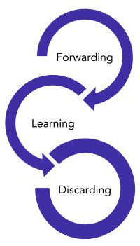

# Capítulo 7 – Protocolos STP e RSTP

Nos capítulos anteriores, estabelecemos a arquitetura das redes locais modernas, com foco especial no protocolo Ethernet e nos switches. Vimos que um dos pilares do design de redes robustas, especialmente no modelo hierárquico, é a **redundância**. As redes LAN em sua maioria são interligadas por diversos switches de forma hierárquica e muitas vezes com links redundantes. O objetivo é claro: gerar uma disponibilidade satisfatória da rede, de forma que caso aconteça algum problema com um link ou equipamento, a rede possua caminhos alternativos para que o tráfego possa alcançar seu destino.

Porém, essa topologia física redundante, tão desejável para a resiliência (Camada 1), é um problema catastrófico para a lógica de encaminhamento da Camada 2. Os switches Ethernet, por padrão, não entendem o conceito de "caminhos múltiplos" e tratam todos os links como ativos. Tal arranjo gera problemas graves na rede, como os **"loops"** ou caminhos cíclicos.

Imagine um cenário simples com três switches (A, B e C) conectados em um triângulo.

1. Um computador conectado ao Switch A envia um único quadro de **broadcast** (como uma requisição ARP).
2. O Switch A, seguindo sua lógica padrão, inunda (floods) o quadro por todas as suas portas, enviando uma cópia para o Switch B e outra para o Switch C.
3. O Switch B recebe o quadro de A e o inunda para o Switch C. Simultaneamente, o Switch C recebe o quadro de A e o inunda para o Switch B.
4. Agora, o Switch B recebe o quadro do Switch C e o envia de volta para o Switch A, que por sua vez o envia para o Switch C, e assim por diante.
5. O quadro original de broadcast é preso em um loop infinito, sendo multiplicado exponencialmente a cada passagem pelos switches.

Esse fenômeno é conhecido como **Broadcast Storm (Tempestade de Broadcast)** e é fatal para uma rede. Ele consome 100% da largura de banda dos links e sobrecarrega as CPUs dos switches, levando a uma negação de serviço completa. Além disso, o loop causa **instabilidade na tabela MAC**, pois um switch vê o mesmo endereço MAC de origem chegando por portas diferentes, "batendo" a entrada na tabela e quebrando a comunicação unicast.

## Spanning Tree Protocol (STP)

Com vistas a evitar esse tipo de problema, foi criado o **Spanning Tree Protocol (STP)**, padronizado pelo IEEE sob a identificação **802.1d**.

O STP é um protocolo de Camada 2 cuja premissa de funcionamento é criar uma topologia lógica livre de loops a partir de uma topologia física redundante. Ele faz isso através do **bloqueio seletivo de algumas portas** dos switches. O resultado é que, embora existam múltiplos enlaces físicos (garantindo a redundância), apenas um caminho lógico fica operacional para a comunicação entre quaisquer dois pontos da rede. Se o caminho ativo falhar, o STP automaticamente "desbloqueia" uma das portas redundantes para assumir o tráfego, recalculando a topologia.

### Funcionamento do STP

O STP executa um algoritmo para "desenhar" uma árvore lógica (a _Spanning Tree_ ou Árvore de Abrangência) sobre a topologia física da rede. Para isso, os switches precisam conversar entre si, e eles o fazem trocando mensagens de controle chamadas **BPDUs (Bridge Protocol Data Units)**. O processo de construção dessa árvore, chamado de **convergência**, segue quatro passos principais:

#### Passo 1: Eleição da Root Bridge (Ponte Raiz)

Primeiramente, vamos analisar de forma visual uma rede com links redundantes que precisa ser "resolvida" pelo STP:

Como podemos ver, existem diversos caminhos possíveis entre os switches. O STP precisa de um ponto de referência central para construir sua árvore lógica. Esse ponto é a **Root Bridge (Ponte Raiz)**. O primeiro passo do algoritmo é eleger qual switch na rede será a Root Bridge.

Para isso, cada switch possui um identificador único chamado **Bridge ID (BID)**. O BID é um valor de 8 bytes composto por dois campos:

1. **Prioridade da Bridge (Bridge Priority):** Um valor de 2 bytes (16 bits) que indica a prioridade do switch. O valor padrão é 32768.
2. **Endereço MAC:** O endereço MAC de 6 bytes (48 bits) do switch.

Ao ligarem, todos os switches trocam BPDUs contendo seus BIDs. O switch que possuir o **menor Bridge ID** é eleito a Root Bridge. Os critérios de desempate são:

1. O switch com o **menor valor de Prioridade** vence.
2. Se as prioridades forem idênticas (o que é comum, pois todos usam o padrão 32768), o switch com o **menor Endereço MAC** vence.

> **Nota sobre o BID Moderno:** A imagem acima também ilustra o padrão mais moderno (usado pelo RSTP e em redes com VLANs). O campo de prioridade de 2 bytes foi dividido em dois: 4 bits para a prioridade (em incrementos de 4096) e 12 bits para o **Extended System ID**, que geralmente carrega o número da VLAN. Para os propósitos do STP clássico (802.1d), podemos considerar a estrutura mais simples de 2 bytes de prioridade + 6 bytes de MAC.

#### Passo 2: Eleição das Root Ports (Portas Raiz)

Após a definição da Root Bridge, o protocolo começa a mapear e montar a árvore. O próximo passo é que _todos os outros switches_ (não-raiz) devem definir qual de suas portas tem o melhor caminho para alcançar a Root Bridge. Essa interface será chamada de **Root Port (RP)**.

- Cada switch não-raiz terá **exatamente uma** Root Port.
- Essa é a _única_ interface que o switch usará para encaminhar tráfego _em direção_ à Root Bridge.
- A escolha é baseada no **menor custo de caminho** (Root Path Cost) para a Root Bridge.

O "custo" de um link é um valor inversamente proporcional à sua velocidade (links mais rápidos têm custo menor). O custo total do caminho é a soma dos custos de todos os links entre o switch e a Root Bridge.

|**Velocidade do Link**|**Custo STP (802.1d)**|
|---|---|
|10 Mbps|100|
|100 Mbps|19|
|1 Gbps|4|
|10 Gbps|2|

#### Passo 3: Eleição das Designated Ports (Portas Designadas)

Até o momento, temos a Root Bridge (cujas portas são todas de encaminhamento) e as Root Ports (uma por switch não-raiz, também de encaminhamento). O próximo passo é definir as portas de encaminhamento para cada _segmento_ de rede (o link entre dois switches).

Uma **Designated Port (DP)** é a porta responsável por enviar e receber tráfego _para_ um determinado segmento. Todo segmento de rede na topologia STP terá **exatamente uma** Designated Port.

A eleição funciona assim:

- Todas as portas na **Root Bridge** são, por definição, Designated Ports, pois elas são a fonte da árvore.
- Em um segmento que conecta dois switches não-raiz, o switch que tiver o **menor custo de caminho** para a Root Bridge colocará sua porta nesse segmento como DP.
- Um mesmo switch pode ter várias Portas Designadas (uma para cada segmento que ele "serve").

#### Passo 4: Bloqueio das Portas Restantes

Após a definição de todas as Root Ports e Designated Ports, qualquer porta que não tenha sido eleita para uma dessas duas funções é colocada no estado de **Blocking (Bloqueada)**.

Essas são as portas que, se ficassem ativas, criariam o loop lógico. Elas permanecem inativas, não encaminham quadros de dados e não aprendem endereços MAC. Elas apenas "escutam" os BPDUs para saber se o caminho principal falhou. Caso o caminho principal falhe (por exemplo, uma Root Port pare de receber BPDUs), o STP re-executa o algoritmo, e uma porta que estava bloqueada pode se tornar a nova Root Port, reestabelecendo a conectividade pela rota redundante.

### Convergência e Estados das Portas STP

Todo esse procedimento de eleição e definição de portas é conhecido como **convergência do STP**. A rede não está operacional até que a convergência esteja completa. Para que uma porta no estado Blocking passe ao estado Forwarding (Encaminhamento), ela deve passar por dois estágios intermediários: Listening (Escuta) e Learning (Aprendizado).

Os estados das portas no STP são:

|**Estado**|**Encaminha Quadros?**|**Aprendizagem de MACs?**|**Transitório ou Estável?**|
|---|---|---|---|
|**Disabled**|Não|Não|Estável|
|**Blocking**|Não|Não|Estável|
|**Listening**|Não|Não|Transitório|
|**Learning**|Não|**Sim**|Transitório|
|**Forwarding**|**Sim**|**Sim**|Estável|

- **Disabled (Desabilitado):** A porta está administrativamente desligada ou falhou. Não participa do STP.
- **Blocking (Bloqueio):** A porta é um link redundante e foi bloqueada para evitar loops. Ela apenas recebe e processa BPDUs.
- **Listening (Escuta):** Um estado transitório. A porta ouve e envia BPDUs para participar da eleição da topologia (definir quem é Root, RP, DP). Não encaminha dados nem aprende MACs para evitar loops durante a eleição.
- **Learning (Aprendizado):** Um estado transitório. A porta já sabe qual será seu papel (RP ou DP), mas ainda não encaminha dados para evitar loops temporários. No entanto, ela começa a aprender os endereços MAC dos quadros recebidos para popular sua tabela MAC.
- **Forwarding (Encaminhamento):** A porta está totalmente operacional. Ela encaminha quadros de dados, aprende endereços MAC e participa ativamente da rede.

#### Temporizadores e o Tempo de Convergência

A mudança de estados obedece a temporizadores definidos pelo protocolo:

- **Hello Timer:** Por padrão, a Root Bridge envia uma mensagem BPDU "Hello" a cada **2 segundos** para indicar que está ativa.
- **Maximum Age Timer (Max Age):** Por padrão, **20 segundos**. Este é o tempo que uma porta em blocking armazena a informação de um BPDU. Se ela parar de receber Hellos por 20 segundos, ela assume que o link superior falhou e inicia a reconvergência, passando para o estado Listening.
- **Forward Delay Timer:** Por padrão, **15 segundos**. Este é o tempo que a porta passa em _cada um_ dos estados transitórios (Listening e Learning).

Dessa forma, o tempo total para a convergência de uma porta (o tempo para ela sair de Blocking e chegar a Forwarding) em caso de falha de um link primário é de **até 50 segundos**:

- 20 segundos (esperando o Max Age expirar)
- + 15 segundos (no estado Listening)
- + 15 segundos (no estado Learning)
- = **50 segundos**

Esse longo tempo de convergência é a principal desvantagem do STP clássico e o motivo pelo qual ele foi substituído por protocolos mais rápidos, como o RSTP.

### Analisando uma Rede Convergida

Na imagem a seguir, temos um exemplo de uma rede que já passou pelo processo de convergência do STP.

Neste caso, o Switch1 foi eleito a Root Bridge. Como as prioridades de todos os switches eram idênticas, utilizou-se o critério de desempate: o Switch1 possui o menor endereço MAC (aa:aa:aa:aa:aa:aa).

Observações sobre a topologia:

- **Switch1 (Root):** Como é a Root Bridge, todas as suas portas ativas (10/27 para S4 e 10/13 para S2) são, por definição, **Designated Ports (DP)**, pois ele é a origem da árvore.
- **Switch4:** Seu melhor caminho para o Root é o link direto (porta 2/27, custo 19). Portanto, 2/27 é sua **Root Port (RP)**.
- **Switch3:** Seu melhor caminho para o Root é via Switch2 (custo 19+19 = 38), que é melhor do que o caminho via Switch4 (custo 100+19 = 119). Portanto, sua porta 3/37 é sua **Root Port (RP)**.
- **Switch2:** Seu melhor caminho para o Root é o link direto (porta 3/13, custo 19). Portanto, a porta 3/13 deveria ser sua **Root Port (RP)**. (O diagrama neste ponto contém uma imprecisão, rotulando-a como DP, quando na verdade ela atua como RP).
- **Link Bloqueado:** O link entre o Switch3 e o Switch4 é o link redundante que precisa ser bloqueado. O Switch4 (custo 19 para o Root) "ganha" o segmento contra o Switch3 (custo 38 para o Root). Portanto, a porta 2/25 (no S4) torna-se a DP daquele segmento. A porta 3/25 (no S3) perde a disputa (não é RP nem DP) e é colocada no estado de **Blocking** (representado pelo 'x').

### Notificação de Mudança de Topologia (TCN)

Quando a rede está convergida, ela permanece estável. Mas o que acontece se um link mudar de status (cair ou um novo for ativado)? O STP precisa ser notificado para recalcular a árvore.

1. **TCN (Topology Change Notification):** Quando um switch não-raiz (Ex: Switch B) detecta uma mudança em uma de suas portas (um link caiu ou subiu), ele envia um quadro BPDU especial chamado **TCN (Topology Change Notification)**. Este quadro é enviado _pela Root Port_ do switch, "subindo" em direção à Root Bridge.
2. **TCA (Topology Change Acknowledgment):** O switch "acima" (que recebe o TCN em sua Designated Port) responde com um **TCA (Topology Change Acknowledgment)** para confirmar o recebimento da notificação. Esse switch, por sua vez, envia seu próprio TCN para sua Root Port, e o processo se repete até que a notificação chegue à Root Bridge.

3. **TC (Topology Change):** Uma vez que a Root Bridge (R) é notificada da mudança, ela assume a responsabilidade de informar _toda a rede_ sobre a instabilidade. Ela começa a enviar seus BPDUs Hello normais, mas com um bit especial (flag) de **TC (Topology Change)** ativado. Este BPDU é propagado "descendo" pela árvore, de DP para RP, até que todos os switches da rede o recebam.

O propósito desse TC é instruir todos os switches a **reduzirem o tempo de envelhecimento de suas tabelas MAC** (do padrão de 300 segundos para o valor do Forward Delay, 15 segundos). Isso "limpa" rapidamente as entradas de MAC antigas, forçando os switches a reaprenderem a localização dos hosts, que agora podem estar acessíveis por um novo caminho.

## Rapid Spanning Tree Protocol (RSTP)

O protocolo STP (802.1d) foi um pilar fundamental para a estabilidade das redes locais, resolvendo o problema catastrófico dos loops de Camada 2. No entanto, sua principal desvantagem é o **lento tempo de convergência**. Em uma rede moderna, esperar **até 50 segundos** para que um link redundante assuma após uma falha, ou para que um computador possa acessar a rede após ser conectado, é inaceitável. Aplicações em tempo real, como Voz sobre IP (VoIP) ou videoconferências, seriam interrompidas, e a experiência do usuário seria severamente degradada.

Devido à grande complexidade das redes atuais e às mudanças constantes na topologia (dispositivos móveis se conectando, links sendo adicionados), eram necessários rearranjos constantes da árvore, implicando na necessidade de rodar o algoritmo e aguardar o tempo de convergência diversas vezes.

Por esse motivo, o IEEE desenvolveu o **Rapid Spanning Tree Protocol (RSTP)**, padronizado como **IEEE 802.1w**. O RSTP não é um protocolo novo, mas sim uma **evolução** direta do STP, otimizado para uma convergência radicalmente mais rápida, muitas vezes em menos de um segundo.

### Simplificação dos Estados da Porta

A primeira grande mudança do RSTP foi simplificar os cinco estados de porta do STP (Disabled, Blocking, Listening, Learning, Forwarding) em apenas três.

1. **Discarding (Descarte):** Este novo estado unifica três estados do STP (Disabled, Blocking e Listening). A lógica é simples: em todos esses três estados antigos, a porta está inoperante do ponto de vista do tráfego de dados. Ela não encaminha quadros de dados e (exceto no estado Disabled) apenas processa BPDUs. O RSTP simplifica isso: se uma porta não está encaminhando dados, ela está no estado de _Discarding_.
2. **Learning (Aprendizado):** Este estado é mantido idêntico ao do STP. É um estado transitório onde a porta ainda não encaminha dados (para evitar loops), mas já começa a aprender os endereços MAC das fontes dos quadros recebidos para popular sua tabela MAC.
3. **Forwarding (Encaminhamento):** Também idêntico ao STP. A porta está totalmente operacional, encaminhando dados e aprendendo MACs.

O mapeamento entre os protocolos pode ser resumido na tabela a seguir:

|**Estado Operacional**|**Estado STP (802.1d)**|**Estado RSTP (802.1w)**|**Encaminha Quadros de Dados?**|**Aprende Endereços MAC?**|
|---|---|---|---|---|
|Desabilitado|Disabled|Discarding|Não|Não|
|Habilitado (Bloqueado)|Blocking|Discarding|Não|Não|
|Habilitado (Convergindo)|Listening|Discarding|Não|Não|
|Habilitado (Convergindo)|Learning|Learning|Não|**Sim**|
|Habilitado (Ativo)|Forwarding|Forwarding|**Sim**|**Sim**|

### Novas Funções (Roles) para Portas

A verdadeira "mágica" da convergência rápida do RSTP vem da introdução de novas funções (roles) para as portas, que vão além das simples Root Port e Designated Port. O RSTP pré-calcula caminhos alternativos.

- **Porta Raiz (Root Port):** Mesma funcionalidade do STP. É a porta no switch não-raiz com o menor custo de caminho para a Root Bridge. Está no estado _Forwarding_.
- **Porta Designada (Designated Port):** Mesma funcionalidade do STP. É a porta que "serve" um segmento, enviando e recebendo tráfego para ele. Está no estado _Forwarding_.
- **Porta Alternativa (Alternate Port):** Esta é uma grande inovação. Uma porta Alternativa é uma porta que _também_ tem um caminho para a Root Bridge, mas que _não_ é a Root Port (pois seu custo é maior). É um caminho redundante. O STP clássico simplesmente colocaria essa porta em _Blocking_. O RSTP a rotula como _Alternate_ e a mantém em _Discarding_.
    - **Benefício:** Se a Root Port falhar, o switch não precisa esperar 50 segundos. Ele sabe que a Porta Alternativa é o "Plano B" e pode transicioná-la _imediatamente_ para _Forwarding_, resultando em uma convergência quase instantânea.
- **Porta de Backup (Backup Port):** Esta é uma porta redundante para uma _Porta Designada_, geralmente encontrada em cenários com hubs (meios compartilhados), onde um switch pode ter dois links para o mesmo segmento. Se a Porta Designada falhar, a Porta de Backup (que estava em _Discarding_) assume seu lugar.

### Portas de Borda (Edge Ports)

Uma das melhorias mais significativas do RSTP para o usuário final foi a introdução do conceito de **Portas de Borda (Edge Ports)**.

- **Problema no STP:** No STP clássico, quando um computador é conectado a uma porta do switch, o switch não sabe se é um computador (que não causa loops) ou outro switch (que pode causar um loop). Por segurança, ele _sempre_ assume o pior caso e força a porta a passar pelos 30 segundos dos estados _Listening_ e _Learning_. Isso causa a frustrante espera de 30-50 segundos para que um PC possa usar a rede.
- **Solução no RSTP:** O RSTP permite que o administrador de rede configure manualmente as portas que se conectam a estações finais (computadores, impressoras, servidores) como **Edge Ports**.
    - Uma Edge Port, por definição, não está ligada a outra bridge (switch) e, portanto, _nunca_ poderá criar um loop na rede.
    - Quando um dispositivo é conectado a uma Edge Port, o switch _pula_ os estados de Discarding e Learning (os antigos Listening e Learning) e transiciona a porta **imediatamente** para o estado de _Forwarding_.

As portas que _não_ são de borda (**Non-Edge Ports**) são aquelas que se conectam a outros switches. Essas portas, sim, devem passar pelo processo completo de negociação do RSTP para garantir uma topologia livre de loops. Essas portas Non-Edge são ainda subdivididas:

- **Segmento Ponto-a-Ponto (Point-to-Point):** Um link Full-Duplex que conecta um switch a exatamente um outro switch. O RSTP usa um mecanismo rápido de "proposta e acordo" (proposal/agreement) para convergir esses links em menos de um segundo, sem usar os antigos temporizadores.
- **Segmento Compartilhado (Shared):** Um link Half-Duplex, tipicamente conectado a um hub. Nesses segmentos, o RSTP perde sua vantagem de velocidade e reverte ao comportamento mais lento e timer-based do STP 802.1d para garantir a compatibilidade e evitar colisões.

## MSTP (Multiple Spanning Tree Protocol)

O RSTP resolveu o problema da _velocidade_ de convergência, mas ainda herdou um problema de _eficiência_ do STP: ambos os protocolos criam **uma única Spanning Tree** para toda a rede (para todas as VLANs).

Imagine uma rede com dois links redundantes (Link A e Link B) e duas VLANs (Vendas e Engenharia). O STP/RSTP elegerá _um_ desses links como o caminho ativo e _bloqueará_ o outro (seja como Blocking ou Alternate) para _todas as VLANs_. Isso significa que o Link B, perfeitamente funcional, ficará ocioso, desperdiçando metade da largura de banda da rede.

O **MSTP (Multiple Spanning Tree Protocol)**, padronizado como **IEEE 802.1s**, foi criado para resolver esse problema, permitindo o balanceamento de carga real em Camada 2.

O MSTP permite que o administrador agrupe múltiplas VLANs em **"Instâncias" (MSTIs)**. Em vez de rodar uma única árvore para todas as VLANs, o MSTP roda uma instância separada do RSTP para cada _grupo_ de VLANs.

- **Exemplo:**
    - **Instância 1:** Agrupa as VLANs 10, 20, 30.
    - **Instância 2:** Agrupa as VLANs 40, 50, 60.

O administrador pode então configurar o MSTP para que a **Instância 1** use o **Link A** como caminho principal (e bloqueie o Link B) e a **Instância 2** use o **Link B** como principal (e bloqueie o Link A). O resultado é que _ambos os links_ são utilizados ativamente, cada um por um conjunto diferente de VLANs, alcançando um balanceamento de carga e o uso completo da infraestrutura.

O MSTP organiza os switches em **Regiões (MST Regions)**, como visto na figura. Uma região é um grupo de switches que compartilha a mesma configuração de instâncias e VLANs. Para o mundo exterior (outras regiões ou switches rodando RSTP), a região inteira do MSTP é vista como uma única "bridge" gigante, conectada por uma árvore comum (CST - Common Spanning Tree), garantindo a interoperabilidade.

## Shortest Path Bridging (SPB)

Embora o MSTP tenha otimizado o uso de links, ele ainda é complexo de configurar e se baseia na mesma premissa do STP: _bloquear_ portas para evitar loops. A evolução mais recente no controle de loops de Camada 2 abandona completamente essa ideia.

O **Shortest Path Bridging (SPB)**, padronizado como **IEEE 802.1aq**, não é uma evolução do Spanning Tree; é um **substituto**.

O SPB foi desenvolvido para operar em redes com topologia em **Malha (Mesh)**, onde existem múltiplos caminhos. Em vez de bloquear links, o SPB adota uma abordagem de "roteamento" em Camada 2. Ele usa um protocolo de estado de enlace (similar ao IS-IS, usado em roteamento de Camada 3) para "aprender" toda a topologia da rede.

Com esse mapa completo, ele calcula o **caminho mais curto (shortest path)** para todos os destinos, permitindo o **balanceamento de carga real através de todos os caminhos possíveis**, sem bloquear nenhum link (a menos que seja absolutamente necessário).

O SPB é significativamente mais eficiente, possui um tempo de convergência ainda mais rápido que o RSTP e aumenta a largura de banda efetiva da rede, pois todos os links podem ser usados simultaneamente.

## Considerações Finais

Neste capítulo, abordamos um dos desafios mais críticos e fundamentais da arquitetura de redes locais comutadas: o paradoxo da **redundância**. Vimos que, embora os links físicos redundantes sejam essenciais para a alta disponibilidade e resiliência da rede, eles são inerentemente perigosos para a lógica de encaminhamento da Camada 2, criando **loops** que resultam em **tempestades de broadcast** e instabilidade total da rede.

Exploramos a solução clássica para esse problema, o **Spanning Tree Protocol (STP - 802.1d)**. Entendemos seu elegante algoritmo, que "desenha" uma árvore lógica sobre a topologia física, elegendo uma **Root Bridge** como referência e, em seguida, definindo os papéis de cada porta (**Root Port**, **Designated Port**) para construir um único caminho livre de loops. O preço dessa estabilidade, como vimos, é o bloqueio de portas redundantes e um tempo de convergência muito lento, que pode chegar a 50 segundos.

Em seguida, acompanhamos a evolução desse protocolo para atender às demandas das redes modernas. Vimos como o **RSTP (802.1w)** revolucionou a convergência, reduzindo o tempo de falha para milissegundos ao introduzir novos papéis de porta, como a **Porta Alternativa**, e o conceito vital de **Edge Port**, que permite a conexão imediata de dispositivos finais.

Avançamos para o **MSTP (802.1s)**, que resolveu o problema da eficiência. Em vez de bloquear links e desperdiçar largura de banda, o MSTP permite o **balanceamento de carga** em redes com múltiplas VLANs, criando diferentes instâncias de Spanning Tree que utilizam caminhos redundantes distintos. Por fim, vislumbramos o futuro com o **SPB (802.1aq)**, um protocolo que abandona a ideia de bloqueio e adota uma forma de "roteamento" em Camada 2 para utilizar todos os caminhos disponíveis em topologias de malha.

Ao dominar os mecanismos que garantem uma topologia de Camada 2 estável e livre de loops, concluímos nossa exploração profunda da Camada de Acesso à Rede. Com a fundação de nossas redes locais agora sólida, rápida e resiliente, estamos prontos para subir na pilha de protocolos e focar no próximo grande desafio: como interconectar todas essas redes locais distintas para formar uma rede global. No próximo capítulo, entraremos no domínio da Camada de Internet e do Protocolo IP.