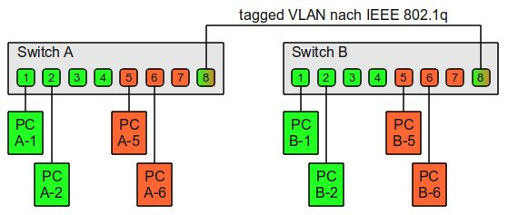
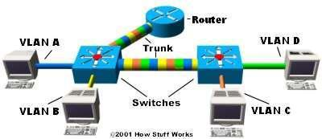
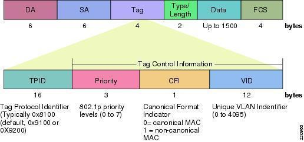
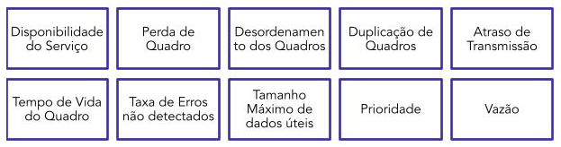
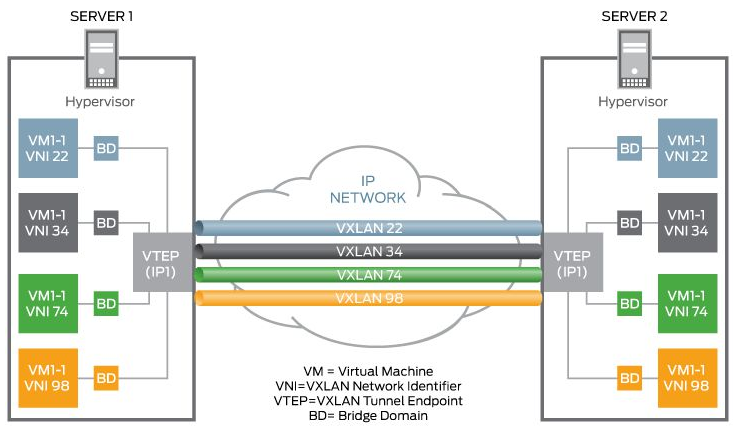

# Capítulo 8 – Redes Locais Virtuais (VLANs)

Nos capítulos anteriores, exploramos a arquitetura fundamental das redes locais (LANs), com foco especial nos switches Ethernet e nos protocolos, como o Spanning Tree, que garantem uma topologia estável e livre de loops. Estabelecemos que uma rede comutada, por padrão, cria um único e grande domínio de broadcast. Embora o STP evite que os broadcasts circulem indefinidamente, ele não impede que se propaguem por toda a rede, consumindo largura de banda e recursos de processamento de cada dispositivo. À medida que uma organização cresce, essa arquitetura "plana" (flat network) se torna um gargalo de desempenho, um pesadelo de gerenciamento e um risco de segurança. É nesse contexto que surge uma das tecnologias de Camada 2 mais poderosas e fundamentais da rede moderna: a **Rede Local Virtual, ou VLAN**.

## O Que São VLANs e Por Que Elas São Necessárias?

As LANs atuais são configuradas de formas otimizadas pelos administradores de redes no intuito de segmentar essas redes por grupos específicos ou localidades, como rede de alunos e professores em uma universidade, ou redes departamentais em uma empresa (Vendas, Engenharia, Finanças).

As interligações entre esses ambientes, na maioria dos casos, são feitas por switches. Caso todos os dispositivos da organização persistam em um mesmo domínio de broadcast, ou seja, na mesma rede lógica, podem ocorrer alguns problemas graves à medida que essa rede cresça.

1. **Tempestades de Broadcast e Isolamento:** O primeiro e mais crítico problema é a **falta de isolamento de tráfego**. Em uma rede plana, todo o tráfego de broadcast (como uma requisição ARP ou uma descoberta de DHCP) será propagado por _todos_ os switches e entregue a _todas_ as portas da rede, ainda que os dispositivos estejam organizados em departamentos ou salas diferentes. Em uma rede com milhares de dispositivos, o "ruído" de broadcast pode consumir uma quantidade significativa de largura de banda e forçar cada dispositivo a processar tráfego que não lhe diz respeito.
2. **Ineficiência e Custo:** Sem a segmentação lógica, a única forma de isolar grupos é através de hardware físico. Por exemplo, talvez seja necessário alocar um switch de 24 portas para atender um grupo de 10 usuários do departamento de Finanças em uma sala e, na sala ao lado, outro switch de 24 portas para atender outro grupo de 10 usuários do departamento de RH. Como o objetivo era segmentar esses ambientes para que não compartilhassem o mesmo broadcast, usa-se dois comutadores, desperdiçando 28 portas e dois equipamentos.
3. **Gerenciamento e Inflexibilidade:** Um terceiro ponto é a dificuldade de gerenciar os usuários e seus dispositivos. Em uma rede física, a associação à rede é definida pelo cabo. Se um funcionário do departamento de Vendas (que precisa de acesso a servidores específicos) se muda para uma mesa no andar da Engenharia, o administrador de rede precisa ir fisicamente até a sala de telecomunicações e mudar o cabo daquele usuário de uma porta de switch para outra.

### Solução: Virtualizar a LAN

Os referidos problemas podem ser resolvidos com a técnica de LANs virtuais, ou como são conhecidas, **VLANs**. Essa tecnologia permite "fatiar" um único switch físico, criando diversas redes locais virtuais, logicamente independentes, que coexistem em um mesmo meio físico compartilhado.

Uma VLAN é, por definição, um **domínio de broadcast independente**.

- Isso resolve o **problema de isolamento**, pois um broadcast enviado por um dispositivo na VLAN 10 será encaminhado _apenas_ para outras portas pertencentes à VLAN 10. Ele jamais alcançará as portas da VLAN 20, eliminando o problema da falta de isolamento.
- Isso resolve o **problema da eficiência**. É possível utilizar um único comutador de 24 portas para dividir grupos em salas ou departamentos distintos. Por exemplo, as portas 1-10 podem ser alocadas à VLAN 10 (Vendas) e as portas 11-20 à VLAN 20 (Engenharia), tudo no mesmo equipamento.
- Isso resolve o **problema de gerenciamento**. Se o funcionário de Vendas se mudar, o administrador simplesmente reconfigura a nova porta do usuário (via software) para pertencer à VLAN 10, sem precisar tocar em um único cabo.

### VLANs e Roteamento

As VLANs possuem todas as características de uma rede de Camada 3 (uma sub-rede). Isso nos leva a um conceito fundamental: para que haja a comunicação **entre** VLANs distintas, necessita-se de um roteador (ou um switch de Camada 3) para fazer o roteamento entre elas.

Isto é, se um dispositivo na porta 1 de um switch estiver na VLAN 10 (ex: IP 192.168.10.5) e um segundo dispositivo estiver na porta 2 do _mesmo switch_ em uma VLAN 20 (ex: IP 192.168.20.8), eles estão em redes lógicas diferentes. Sem o uso de um roteador, esses dispositivos não conseguirão se comunicar, mesmo estando fisicamente conectados ao mesmo equipamento.

## Critérios de Atribuição de VLANs

A alocação dos dispositivos conectados aos switches em cada VLAN pode seguir três critérios básicos, além de outros possíveis, dependendo da sofisticação do equipamento:

1. **VLAN Baseada em Porta (Port-Based VLAN):** Também chamada de VLAN de nível 1 ou "VLAN estática". Nesse critério, a associação à VLAN é feita na porta do switch. Não se considera o dispositivo a ser conectado, mas tão somente a porta utilizada. Ou seja, o administrador configura a porta 1 do switch para pertencer à VLAN 10. Sendo assim, _todo e qualquer_ dispositivo que se conectar nessa porta pertencerá automaticamente à VLAN 10. Este é o método mais comum, seguro e simples de gerenciar. A porta é chamada de **porta de acesso (access port)**.
2. **VLAN Baseada em Endereço MAC (MAC-Based VLAN):** Também chamada de VLAN de nível 2 ou "VLAN dinâmica". Neste critério, a associação é baseada no endereço MAC do dispositivo, não na porta do switch. O administrador cria uma tabela de mapeamento (ex: o endereço MAC `AA:AA:AA:AA:AA:AA` pertencerá à VLAN 20). A vantagem é a mobilidade: o usuário pode mudar seu dispositivo de porta ou de switch e ele continuará sendo da VLAN 20. A desvantagem é a enorme sobrecarga de gerenciamento (manter a tabela de todos os MACs) e o risco de segurança (um atacante pode "clonar" um MAC para entrar em uma VLAN).
3. **VLAN Baseada em Sub-rede (Network Address-Based VLAN):** Também chamada de VLAN de nível 3. Neste aspecto, o switch deve ser capaz de interpretar endereços de rede, ou seja, deve ser um **switch L3 (Multilayer Switch)**. O switch inspeciona o endereço IP de origem do pacote para determinar a qual VLAN ele pertence.

Existem ainda outras subdivisões que dizem respeito à forma como as tabelas de endereços MAC dos dispositivos são montadas (um conceito conhecido como VLAN Learning):

- **VLAN Aberta (Shared VLAN Learning - SVL):** Há um único banco de dados de endereços MAC (tabela CAM) para todas as VLANs. A entrada na tabela inclui o MAC, a porta e o ID da VLAN.
- **VLAN Fechada (Independent VLAN Learning - IVL):** Possui um banco de dados (tabela MAC) separado para cada VLAN. Por implementar essa segmentação e isolamento de informações, tem-se que esse modelo é o mais seguro e o mais comum em implementações modernas.
- **VLAN Mixada:** Possui certa versatilidade na implementação, podendo utilizar os dois modos anteriores.

## Interconectando Switches

Agora, outra questão precisa ser respondida. Já que cada porta de acesso do switch estará alocada para uma VLAN específica, como que usuários que pertencem à _mesma VLAN_, porém em _comutadores diferentes_, se comunicarão?

Bom, para isso, configura-se um tipo especial de porta, a **porta Trunk**. Uma porta de acesso (access port) pertence a uma única VLAN. Uma porta Trunk, por outro lado, não pertence a nenhuma VLAN específica; ela é um "canal" de agregação responsável por transportar o tráfego de **todas as VLANs** simultaneamente entre comutadores vizinhos.

A seguir, temos um exemplo de uma configuração de VLANs em dois switches:

Como podemos observar na imagem:

- Existem 2 VLANs distintas, representadas pelas cores Verde e Laranja.
- Em ambos os switches, as portas de 1 a 7 são **portas de acesso**, configuradas para suas respectivas VLANs.
- A porta número 8 de ambos os switches está sendo utilizada no modo **Trunk** para permitir a troca de dados entre as mesmas VLANs em switches diferentes.

Ou seja, caso o "PC A-1" (VLAN Verde) pretenda se comunicar com o "PC B-2" (VLAN Verde), o quadro sairá do PC A-1, entrará no Switch A, será encaminhado pela porta Trunk 8, chegará no Switch B pela porta 8, e o Switch B o encaminhará para a porta 2.

No entanto, a comunicação entre VLANs distintas (ex: "PC A-1" e "PC A-5") não será possível, mesmo no mesmo switch, devido ao completo isolamento de broadcast entre elas e à ausência de um roteador.

Já na imagem a seguir, temos um ambiente com comunicação completa entre as VLANs.

Podemos verificar a existência de 4 VLANs distintas (A, B, C, D). Os switches estão interconectados por portas Trunk (que transportam o tráfego de todas as VLANs). Crucialmente, há um **Roteador** conectado também a uma porta Trunk. Caso um dispositivo da VLAN A queira se comunicar com um da VLAN C, o tráfego deve, obrigatoriamente, passar pelo roteador para ser encaminhado entre as redes virtuais.

Mas ainda tem uma questão que não respondemos. Se o link Trunk transporta tráfego de múltiplas VLANs misturado, como os switches sabem "quem é quem"? Como o Switch B, no primeiro exemplo, sabe que o quadro vindo do Switch A pela porta Trunk deve ir para a VLAN Verde (porta 2) e não para a Laranja (porta 5)?

Bom, para isso foi definido o protocolo **IEEE 802.1Q**. Ele especifica o funcionamento da VLAN através da utilização de **TAGs (etiquetas)** nos cabeçalhos dos quadros da camada de enlace, conforme veremos a seguir.

### Mecanismo de Identificação: TAG 802.1Q

No final da seção anterior, deixamos uma questão crucial: se um link **Trunk** transporta tráfego de múltiplas VLANs (Verde, Laranja, etc.) de forma misturada, como o switch receptor sabe qual quadro pertence a qual VLAN? A resposta está em um mecanismo de "etiquetagem" (tagging).

Para que os switches pudessem identificar a qual VLAN um quadro pertencia, foi definido o padrão **IEEE 802.1Q**. Este padrão, que opera em conjunto com os protocolos de Spanning Tree (como o 802.1D e suas evoluções), especifica a inserção de uma "etiqueta" (TAG) de 4 bytes (32 bits) no cabeçalho do quadro Ethernet.

Como podemos ver na figura anterior, a TAG 802.1Q é inserida **no meio do cabeçalho** do quadro original, especificamente entre o campo "MAC de Origem" (Source Address) e o campo "Tipo/Tamanho" (Type/Length).

Este processo de inserção e remoção da TAG é o que define a fronteira da VLAN:

1. Um quadro **não-etiquetado** (untagged) chega de um dispositivo final (PC A-1) em uma **porta de acesso** (Access Port) configurada para a VLAN 10.
2. O switch recebe este quadro, sabe que ele pertence à VLAN 10 e o encaminha para a porta Trunk.
3. Antes de enviar o quadro pelo Trunk, o switch **insere a TAG 802.1Q** no cabeçalho, especificando "VLAN ID = 10".
4. O quadro **etiquetado** (tagged) viaja pelo link Trunk até o Switch B.
5. O Switch B recebe o quadro, lê a TAG, vê "VLAN ID = 10" e sabe que este quadro se destina apenas a outras portas da VLAN 10.
6. Ao encaminhar o quadro para a porta de acesso do PC B-1 (que também está na VLAN 10), o Switch B **remove a TAG**, entregando um quadro Ethernet padrão ao dispositivo final.

Como a inserção da TAG altera o conteúdo do quadro, um novo cálculo do CRC é realizado e um novo valor é escrito no campo FCS (Frame Check Sequence).

#### Anatomia da TAG 802.1Q

A TAG 802.1Q é composta por 4 bytes (32 bits), que por sua vez são divididos em dois campos principais:

- **TPID (Tag Protocol Identifier) (2 bytes / 16 bits):** Este é o "identificador" de que o quadro é um quadro 802.1Q. Ele possui um valor fixo (tipicamente `0x8100`). Quando um switch lê este valor no local onde esperaria o campo "Tipo/Tamanho", ele sabe que o quadro está etiquetado e que os próximos 2 bytes contêm as informações de VLAN.
- **TCI (Tag Control Information) (2 bytes / 16 bits):** Este campo contém as informações de controle, e é subdividido em três partes:
    - **Priority (PCP - Priority Code Point) (3 bits):** Estes 3 bits são usados para implementar o padrão **IEEE 802.1p**, que trata de **Qualidade de Serviço (QoS)** na Camada 2. Veremos este item em mais detalhes.
    - **CFI (Canonical Format Indicator) (1 bit):** Um bit usado historicamente para indicar compatibilidade entre redes Ethernet e Token Ring. Em redes Ethernet modernas, este valor é quase sempre 0.
    - **VID (VLAN Identifier) (12 bits):** Este é o campo mais importante da TAG. São 12 bits usados para a identificação da VLAN.

Como o VID possui 12 bits, existe a possibilidade de se criar até **$2^{12} = 4096$** VLANs diferentes. Os IDs vão de 0 a 4095. No entanto, os IDs **0** e **4095** são reservados para uso do sistema, restando **4094 VLANs** (de 1 a 4094) para utilização efetiva pelo administrador da rede.

#### Impacto no Tamanho do Quadro

Um ponto importante a ser mencionado é que com a utilização desses 4 bytes da TAG no cabeçalho, a rede precisa ser capaz de lidar com quadros maiores. O padrão Ethernet original (802.3) definia um quadro máximo de 1518 bytes (18 bytes de cabeçalho/trailer + 1500 bytes de payload).

A adição da TAG de 4 bytes elevaria esse total para 1522 bytes. Para acomodar isso e _evitar_ a redução obrigatória da carga útil (payload) para 1496 bytes, o comitê **IEEE 802.3ac** atualizou o padrão Ethernet para permitir um **tamanho máximo de quadro de 1522 bytes**. Isso garante que um quadro etiquetado (taggeado) ainda possa transportar um pacote IP completo de 1500 bytes.

### Qualidade de Serviço (QoS)

Como vimos anteriormente, os 3 primeiros bits do campo TCI (dentro da TAG 802.1Q) são reservados para o protocolo **802.1p**, que define critérios relacionados à **Qualidade de Serviço (QoS)**.

É comum que algoritmos de QoS sejam implementados nas camadas superiores da rede (Camada 3 ou 4), mas o 802.1p permite a complementação desses fatores já na Camada 2, dando aos switches a capacidade de priorizar tráfegos críticos.

A imagem acima mostra diversos fatores que afetam a qualidade de uma comunicação (Atraso, Perda de Quadro, Vazão, etc.). O principal objetivo do 802.1p é melhorar o suporte a tráfegos com tempos críticos, como Voz sobre IP (VoIP) ou videoconferências.

Os 3 bits de prioridade (chamados de PCP) permitem estabelecer 8 possíveis níveis de prioridade (0 a 7):

- **Prioridade 0 (Padrão):** Melhor esforço (Best-Effort).
- **Prioridade 1-3:** Tráfego normal (ex: dados de aplicações de negócios).
- **Prioridade 4-5:** Tráfego de vídeo.
- **Prioridade 6-7:** Tráfego de voz e controle de rede (o mais alto).

Quando um switch está congestionado (com filas de pacotes aguardando para sair por uma porta), ele usará esses 3 bits para decidir quem "passa na frente". Os quadros com prioridade maior (como voz) terão precedência sobre os de prioridade menor (como um download de arquivo). É importante notar que o 802.1p **não implementa reserva de banda**, mas tão somente a **priorização do tráfego** nas filas.

### Alternativas ao STP: Protocolo TRILL

Embora o 802.1Q (VLANs) e o 802.1D (STP) resolvam os problemas de segmentação e loops, eles criam outro: o Spanning Tree, por definição, _bloqueia_ links redundantes, desperdiçando largura de banda e criando caminhos de tráfego não otimizados.

Uma tecnologia mais moderna que aborda essa limitação é o **TRILL (Transparent Interconnection of Lots of Links)**. Este protocolo utiliza técnicas de **roteamento na camada de enlace** para permitir que todos os links em uma topologia de malha fiquem ativos, sem a ocorrência de loops.

O TRILL permite a criação de uma "nuvem" de Camada 2 com um endereçamento simples, permitindo que os nós na rede se movam dentro dessa nuvem sem alterar seu endereçamento IP, de forma similar ao que o roteamento de Camada 3 permite. Ele também suporta nativamente recursos de broadcast e multicast de forma eficiente, algo que em redes STP é problemático.

De forma bem objetiva, o seu funcionamento se baseia nos seguintes aspectos:

1. **Encapsulamento:** Um switch de borda TRILL (chamado de RBridge ou Router Bridge) **encapsula** o quadro Ethernet original do usuário dentro de um novo cabeçalho de transporte TRILL.
2. **Roteamento L2:** O quadro encapsulado é "roteado" através da rede de switches TRILL usando um protocolo de roteamento de estado de enlace (link-state), o **IS-IS**. Como é um protocolo de roteamento, ele calcula o caminho mais curto e evita loops.
3. **Desencapsulamento:** Ao chegar ao RBridge de destino, o cabeçalho TRILL é removido e o quadro Ethernet original é entregue ao destino.

A estrutura do cabeçalho TRILL, como visto acima, se assemelha muito a um cabeçalho de Camada 3 (como o IP). Ele inclui:

- **RBridge Destino e RBridge Origem:** Identifica os switches de borda da nuvem TRILL.
- **TTL (Time-to-Live):** Um contador de saltos (hops) que é decrementado a cada RBridge. Se chegar a zero, o quadro é descartado. Esta é a característica fundamental que o STP não possui e que impede loops de forma nativa.
- **Multi-Destino:** Um bit que indica se o quadro é multicast ou broadcast.

Ao contrário do 802.1Q, que apenas _insere uma etiqueta_ de identificação, o TRILL _encapsula_ o quadro Ethernet inteiro para transportá-lo através de uma rede inteligente de Camada 2 que não depende de bloqueio de portas.

## Redes Overlay

À medida que as tecnologias de Camada 2 evoluíram, com o 802.1Q (VLANs) e o 802.1aq (TRILL), um conceito mais amplo começou a ganhar força, impulsionado principalmente pela ascensão dos _data centers_ e da computação em nuvem: as **Redes Overlay**.

Uma rede overlay é, em essência, uma rede lógica e virtual construída sobre uma rede física já existente (a rede "underlay"). Ela é usada para viabilizar aplicações e serviços de forma flexível, proporcionando uma camada adicional de abstração.

Neste modelo, os nós da rede overlay (que podem ser servidores, máquinas virtuais ou switches) são conectados por "laços" ou túneis virtuais. Esses túneis virtuais podem, na prática, atravessar dezenas de laços físicos (cabos, switches, roteadores) na rede subjacente.

### Usos Comuns de Redes Overlay

Embora o termo pareça moderno, o conceito é bastante antigo. Redes overlay são frequentemente usadas em:

- **Redes Privadas Virtuais (VPNs):** Quando um funcionário em _home office_ se conecta à rede da empresa, ele estabelece uma VPN. Logicamente, o computador do funcionário passa a pertencer à rede interna da empresa, mas fisicamente, o tráfego é encapsulado e viaja "por cima" da rede física da Internet pública.
- **Redes de Distribuição de Conteúdo (CDNs):** Serviços de streaming (como Netflix ou YouTube) operam uma rede overlay de servidores de cache. Quando um usuário assiste a um vídeo, ele o recebe de um servidor (nó da overlay) que está fisicamente próximo a ele (ex: em seu provedor de internet), e não da sede principal da empresa.
- **Redes P2P (Peer-to-Peer):** Aplicações de compartilhamento de arquivos criam uma rede overlay onde os "pares" se conectam diretamente, independentemente da topologia física da Internet que os separa.

Até mesmo a própria Internet, em seu início, pode ser vista como um exemplo clássico de rede overlay, pois utilizava a rede de telefone existente como sua infraestrutura física subjacente para funcionar. A grande vantagem dessas redes é a capacidade de criar topologias lógicas que podem melhorar o desempenho, a segurança e a confiabilidade, sem a necessidade de modificar a rede física base.

### VXLAN

A tecnologia overlay mais relevante no contexto das redes locais modernas é a **VXLAN (Virtual Extensible LAN)**. A VXLAN é uma tecnologia de virtualização de rede projetada especificamente para superar as limitações de escalabilidade das VLANs tradicionais.

A rápida adoção da virtualização de servidores (com a criação de milhares de Máquinas Virtuais - VMs) impulsionou a necessidade de uma rede igualmente ágil. Os operadores de _data centers_ e provedores de nuvem precisavam de uma forma de segmentar logicamente suas redes para milhares de "locatários" (clientes) diferentes, garantindo privacidade e segurança.

#### Problema que a VXLAN Resolve

As VLANs tradicionais, baseadas no padrão 802.1Q, apresentam duas limitações severas para a computação em nuvem:

1. **Limite de Escala:** O campo VID de 12 bits do 802.1Q permite um máximo de **4.094 VLANs**. Para um provedor de nuvem como a Amazon ou o Google, que precisa hospedar dezenas de milhares de clientes (locatários), esse número é insuficiente.
2. **Limite de Camada 2:** As VLANs são um conceito de Camada 2. O tráfego de uma VLAN não pode cruzar um roteador (Camada 3). Se um pacote etiquetado com VLAN chega a um roteador, essa informação de VLAN é removida. Isso significa que os segmentos de VLAN ficam "presos" dentro de um data center ou de uma rede local. Isso é um grande problema para casos de uso como a **migração de Máquinas Virtuais (VM Migration)**, que exige que a VM possa se mover de um servidor físico para outro (potencialmente em outro data center) sem precisar mudar seu endereço IP ou sua rede lógica.

#### Funcionamento da VXLAN

A VXLAN resolve esses dois problemas criando uma rede overlay de Camada 2 que "viaja" sobre uma rede de Camada 3.

1. **Encapsulamento (L2 sobre L4):** A VXLAN **encapsula** o quadro Ethernet original de Camada 2 (da Máquina Virtual) dentro de um pacote **UDP** de Camada 4. Este pacote UDP, por sua vez, é colocado dentro de um pacote IP de Camada 3.
2. **Identificador de Rede (VNI):** Em vez de uma "TAG" de 12 bits, a VXLAN utiliza um identificador de segmento de **24 bits**, chamado **VNI (VXLAN Network Identifier)**. Isso permite a criação de, teoricamente, até **16 milhões de segmentos de rede** (VXLANs) diferentes em um mesmo domínio administrativo.
3. **Os Pontos de Túnel (VTEP):** Os dispositivos que realizam o encapsulamento e o desencapsulamento são chamados de **VTEP (VXLAN Tunnel Endpoint)**. O VTEP é tipicamente o software hypervisor no servidor (onde a VM está) ou o switch físico no topo do rack (Top-of-Rack switch).

Com esse mecanismo, a VXLAN oferece uma segmentação de rede na escala massiva exigida pelos provedores de nuvem.

Mais importante ainda, ela resolve o problema de mobilidade. Como o quadro L2 original está "escondido" dentro de um pacote IP/UDP, ele pode agora ser roteado através de qualquer rede de Camada 3 (como a rede interna do data center ou a própria Internet).

Na linha do que mencionamos, onde cada VXLAN pode assumir um identificador de segmentação, a imagem abaixo busca representar essa estrutura virtualizada a partir de múltiplas máquinas virtuais em diferentes servidores e ambientes.

Na imagem, vemos dois servidores físicos, cada um hospedando múltiplas Máquinas Virtuais (VMs). Essas VMs pertencem a redes lógicas diferentes, identificadas por seus **VNIs**.

- Os servidores estão em locais físicos diferentes, conectados por uma **Rede IP** (a rede "underlay").
- Uma VM no Servidor 1 (por exemplo, VNI 74) precisa se comunicar com uma VM no Servidor 2 que está na _mesma_ rede lógica (VNI 74).
- O **VTEP** no Servidor 1 (com seu próprio endereço IP1) recebe o quadro L2 da VM, o encapsula em um pacote UDP/IP e o endereça ao VTEP do Servidor 2.
- Este pacote viaja pela Rede IP através do túnel "VXLAN 74".
- O VTEP do Servidor 2 recebe o pacote, o desencapsula e entrega o quadro L2 original para a VM de destino.

O resultado é que, no que diz respeito aos servidores e VMs, eles fazem parte da mesma rede de Camada 2 (o mesmo domínio de broadcast, BD). Para a rede IP física, tratava-se apenas de tráfego UDP normal entre os IPs dos dois VTEPs. Isso permite que um segmento de rede VXLAN se estenda até onde a rede roteada de Camada 3 puder alcançar.

## Considerações Finais

Neste capítulo, exploramos uma das tecnologias mais fundamentais e transformadoras da Camada de Enlace: as **Redes Locais Virtuais (VLANs)**. Partimos do problema de uma rede "plana" (flat network), onde a ausência de segmentação leva a tempestades de broadcast, ineficiência de recursos e graves falhas de segurança. Vimos como a VLAN é a solução clássica para "fatiar" um switch físico em múltiplos domínios de broadcast lógicos e isolados.

Estabelecemos que as VLANs se comportam como sub-redes independentes, exigindo um dispositivo de Camada 3 (como um roteador ou switch L3) para permitir a comunicação _entre_ elas. Detalhamos como essa segmentação é implementada na prática: através de **portas de acesso** (access ports) para dispositivos finais e **portas Trunk** para a interconexão de switches.

O mecanismo-chave que viabiliza os trunks, o protocolo **IEEE 802.1Q**, foi dissecado. Entendemos como a inserção de uma **TAG** de 4 bytes no cabeçalho Ethernet permite ao switch identificar a qual VLAN um quadro pertence. Vimos também como essa TAG nos oferece um benefício adicional através do padrão **IEEE 802.1p**, que utiliza 3 bits de prioridade para aplicar Qualidade de Serviço (QoS) diretamente na Camada 2.

Por fim, olhamos para o futuro e para as limitações impostas pelo próprio modelo de VLANs. Abordamos o **TRILL (802.1aq)** como uma alternativa moderna ao Spanning Tree, que utiliza roteamento em Camada 2 para permitir o uso de todos os links redundantes sem bloqueios. Mais importante, mergulhamos nas **Redes Overlay** e na **VXLAN**, a tecnologia que define a segmentação em _data centers_ e na computação em nuvem. Compreendemos como a VXLAN supera as duas grandes limitações do 802.1Q: o **limite de escala** (saltando de 4.094 VLANs para 16 milhões de VNIs) e o **limite de fronteira** (encapsulando quadros L2 em pacotes IP/UDP, permitindo que redes virtuais se estendam por qualquer rede de Camada 3, através de múltiplos data centers).

Com o domínio completo da segmentação em Camada 2, desde uma simples sala de escritório até uma nuvem global, estamos agora prontos para subir na pilha. No próximo capítulo, focaremos no protocolo que torna toda essa comunicação inter-redes (e as próprias VXLANs) possível: o Protocolo de Internet (IP).