# Capítulo 9 – Redes Sem Fio

Nos capítulos anteriores, construímos uma base sólida sobre o funcionamento das redes cabeadas. Exploramos os protocolos que previnem loops (STP), organizam o tráfego em domínios de broadcast (VLANs) e definem a comunicação na rede local (Ethernet). Todas essas tecnologias presumem um meio físico controlado, confinado e relativamente seguro: o cabo. Agora, adentramos um mundo fundamentalmente diferente, o das **redes sem fio (WLANs)**, onde o meio de transmissão é o ar. Essa mudança de meio, do físico para o etéreo, introduz um conjunto inteiramente novo de desafios, que vão desde o controle de acesso ao meio (como evitar "colisões" no ar) até, e mais crucialmente, a segurança. Em uma rede cabeada, um invasor precisa de acesso físico. Em uma rede sem fio, qualquer pessoa ao alcance do sinal pode "ouvir" o tráfego e tentar se conectar. Por essa razão, antes mesmo de explorarmos como os dados viajam, precisamos entender como controlamos _quem_ pode entrar na rede.

## 802.1X: Padrão de Autenticação de Rede

O primeiro desafio em qualquer rede, mas especialmente em redes sem fio, é a **autenticação**: o processo de verificar a identidade de um usuário ou dispositivo antes de permitir seu acesso. Uma senha simples compartilhada (como o WPA2-Personal, ou "a senha do Wi-Fi") é frágil em ambientes corporativos. Se um funcionário sai da empresa, a senha precisa ser trocada em todos os dispositivos, o que é impraticável.

Para resolver isso, o IEEE criou o padrão **802.1X**. Este protocolo não é exclusivo de redes sem fio, mas é amplamente utilizado nelas. Seu objetivo é prover um mecanismo robusto e centralizado de **autenticação, controle de acesso e distribuição de chaves**, tudo isso **baseado em portas**. É importante mencionar que, embora seja amplamente mencionado e utilizado em redes sem fio, ele também é perfeitamente aplicável em redes com fio (controlando quem pode se conectar a uma porta específica de um switch).

O padrão 802.1X é incrivelmente versátil, pois foi projetado para ser independente das camadas inferiores (pode rodar sobre Wi-Fi, Ethernet, etc.) e das camadas superiores (pode usar diferentes métodos de autenticação). Ele segue uma arquitetura cliente-servidor e utiliza um método de desafio-resposta (_challenge-response_) para validar as credenciais.

### Os Três Elementos do 802.1X

Uma arquitetura 802.1X é composta por três elementos ou papéis fundamentais:

1. **Suplicante (Supplicant):** É o dispositivo cliente que deseja se autenticar e obter acesso à rede (ex: um notebook, smartphone ou computador de mesa). O suplicante executa um software que entende o protocolo 802.1X.
2. **Autenticador (Authenticator):** É o equipamento de infraestrutura que atua como o "porteiro" da rede. Ele bloqueia ou libera o acesso à porta (física ou virtual). O autenticador não toma a decisão de autenticação; ele simplesmente atua como um intermediário.
3. **Servidor de Autenticação (Authentication Server - AS):** É o "cérebro" da operação. É um sistema de back-end que armazena (ou tem acesso) à base de dados de usuários, senhas e certificados. Ele recebe as credenciais do suplicante (encaminhadas pelo autenticador) e toma a decisão final de "Aprovar" ou "Negar" o acesso.

Em um exemplo concreto de rede sem fio do padrão 802.11, teríamos:

- A estação (notebook) que deseja acesso é o **Suplicante**.
- O **Access Point (AP)** é o **Autenticador**.
- Um servidor **RADIUS (Remote Authentication Dial-In User Service)** é o **Servidor de Autenticação**.

A figura abaixo nos apresenta esse cenário:

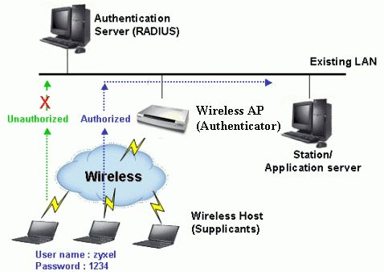

Como a imagem ilustra, o Access Point (Autenticador) mantém a porta virtual bloqueada ("Unauthorized") até que o Suplicante forneça suas credenciais (usuário/senha). O AP encaminha essas credenciais para o Servidor RADIUS, que as verifica em sua base. Se as credenciais estiverem corretas, o RADIUS envia uma mensagem de "Sucesso" de volta ao AP, que então "abre" a porta para o Suplicante, permitindo que ele acesse a rede ("Authorized").

É importante ressaltar que o padrão não define a disposição do servidor de autenticação. Em redes corporativas (Enterprise), ele é um servidor dedicado. Em soluções de escritórios pequenos, o Servidor de Autenticação (uma versão simplificada) pode estar embutido no próprio Access Point, não sendo um elemento dedicado.

### Protocolo de Encapsulamento: EAP e EAPOL

O 802.1X em si não é um protocolo de autenticação. Ele é um _framework_ de controle de acesso. Para transportar as mensagens de autenticação, ele utiliza um protocolo de encapsulamento chamado **EAP (Extensible Authentication Protocol)**.

O "E" de EAP é sua característica mais importante: **Extensível**. O EAP foi projetado para ser um contêiner flexível, capaz de carregar diversos tipos de protocolos de autenticação dentro dele. Para que o EAP possa viajar sobre uma rede local (LAN), ele é encapsulado usando o **EAPOL (EAP over LAN)**.

A figura a seguir demonstra essa arquitetura em camadas:

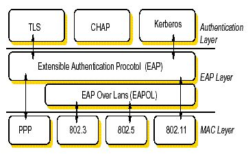

Essa estrutura permite que o 802.1X agregue todos os recursos de autenticação de tecnologias robustas. A camada de Autenticação no topo pode usar certificados (TLS), senhas (CHAP) ou credenciais de domínio (Kerberos). O EAP "empacota" essas mensagens, e o EAPOL as transporta pela rede (seja ela 802.3 Ethernet, 802.11 Wi-Fi, etc.), permitindo autenticar tanto dispositivos quanto usuários em um mesmo sistema.

### Métodos de Autenticação EAP

Na camada de autenticação, diversos protocolos são suportados. A escolha do método EAP define o nível de segurança e a complexidade de implementação. Os mais comuns (e incomuns) incluem:

- **EAP-MD5:** Baseado em usuário e senha, usando o hash MD5. É um método antigo e **inseguro**. Não há autenticação mútua (o cliente não sabe se está falando com um servidor legítimo) e ele não possibilita a geração de chaves de criptografia dinâmicas. **Não deve ser usado.**
- **EAP-TLS (Transport Layer Security):** É um dos métodos mais seguros. Requer certificados digitais tanto no lado do _servidor_ quanto no lado do _cliente_. Isso permite a autenticação mútua (o cliente verifica o servidor, e o servidor verifica o cliente). Ele gera chaves de criptografia dinâmicas por usuário e por sessão. Sua principal desvantagem é a dificuldade de gerenciamento, pois exige a instalação e manutenção de um certificado em cada dispositivo cliente (suplicante).
- **EAP-TTLS (Tunneled TLS):** Uma extensão do EAP-TLS que resolve o problema do certificado do cliente. Ele usa um certificado _apenas no lado do servidor_. O cliente usa esse certificado para criar um "túnel" TLS seguro e, _dentro_ desse túnel, envia suas credenciais de forma segura (geralmente usuário e senha). Também gera chaves dinâmicas.
- **EAP-PEAP (Protected EAP):** Muito similar ao EAP-TTLS, também usa usuário e senha com autenticação mútua (o cliente valida o servidor pelo certificado). Foi desenvolvido pela Microsoft e é hoje um dos métodos mais comuns em redes corporativas (WPA2-Enterprise).
- **EAP-LEAP (Lightweight EAP):** Um protocolo proprietário da Cisco, baseado em usuário e senha. Foi popular, mas hoje é considerado menos seguro que PEAP ou TLS.
- **EAP-FAST (Flexible Authentication via Secure Tunneling):** Também da Cisco, foi criado como um substituto do LEAP. Não usa certificados para criar o túnel, mas sim uma credencial pré-compartilhada chamada PAC (Protected Access Credential).

A tabela a seguir resume as principais características desses tipos de EAP:

|**802.1X EAP, Tipos e Característica**|**MD5 (Message Digest 5)**|**TLS (Transport Level Security)**|**TTLS (Tunneled Transport Level Security)**|**PEAP (Protected Transport Level Security)**|**FAST (Flexible Authentication via Secure Tunneling)**|**LEAP (Lightweight Extensible Authentication Protocol)**|
|---|---|---|---|---|---|---|
|**Certificado do lado do Cliente**|Não|**Sim**|Não|Não|Não (PAC)|Não|
|**Certificado do lado do Servidor**|Não|**Sim**|**Sim**|**Sim**|Não (PAC)|Não|
|**Geração de Chave Dinâmica**|Não|**Sim**|**Sim**|**Sim**|**Sim**|**Sim**|
|Rogue AP detection|Não|Não|Não|Não|Sim|Sim|
|Provedor|MS|MS|Funk|MS|Cisco|Cisco|
|**Atributos de Autenticação**|Via única|**Mútuo**|**Mútuo**|**Mútuo**|**Mútuo**|**Mútuo**|
|**Dificuldade de Implementação**|Fácil|**Difícil** (devido o certificado no cliente)|Moderado|Moderado|Moderado|Moderado|
|**Segurança Wi-Fi**|**Fraca**|Muito Alta|Alta|Alta|Alta|Alta (com senhas fortes)|

### Fluxo de Mensagens do 802.1X

Para termos o devido registro, é importante também observarmos o funcionamento e fluxo de mensagens aplicado aos protocolos. A imagem a seguir detalha a "conversa" entre os três componentes:

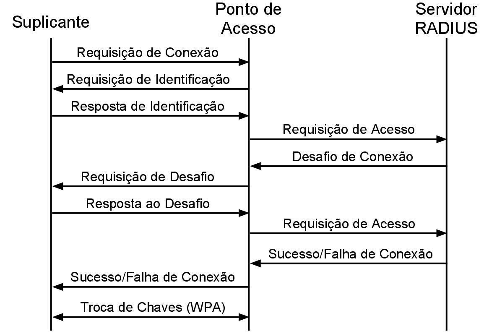

Nesse contexto, podemos elencar quatro tipos de mensagens que definem o processo: **1. Requisição**, **2. Resposta**, **3. Sucesso** e **4. Falha**.

O fluxo ocorre da seguinte forma:

1. **Início (Requisição):** O Suplicante (cliente) se associa ao Ponto de Acesso (Autenticador) e envia uma "Requisição de Conexão" (na prática, uma mensagem EAPOL-Start).
2. **Identidade (Requisição/Resposta):** O Ponto de Acesso responde com uma "Requisição de Identificação" (EAP-Request Identity). O Suplicante envia sua identidade (ex: `usuario@empresa.com`) em uma "Resposta de Identificação".
3. **Encaminhamento para o RADIUS:** O Ponto de Acesso, que não conhece esse usuário, encapsula essa identidade e a envia ao Servidor RADIUS em uma "Requisição de Acesso" (RADIUS-Access-Request).
4. **Desafio (Requisição/Resposta):** O Servidor RADIUS inicia o "desafio" EAP (como EAP-PEAP ou EAP-TLS). Ele envia um "Desafio de Conexão" (RADIUS-Challenge) ao Ponto de Acesso, que o repassa ao Suplicante ("Requisição de Desafio").
5. **Autenticação EAP:** O Suplicante responde ao desafio ("Resposta ao Desafio"), e o Ponto de Acesso atua como um "proxy" transparente, encaminhando as mensagens de ida e volta entre o Suplicante e o RADIUS até que o protocolo EAP seja concluído.
6. **Decisão (Sucesso/Falha):** O Servidor RADIUS toma a decisão final. Ele envia uma mensagem de "Sucesso de Conexão" (RADIUS-Access-Accept) ou "Falha de Conexão" (RADIUS-Access-Reject) para o Ponto de Acesso.
7. **Abertura da Porta:** O Ponto de Acesso recebe a decisão. Se for "Sucesso", ele abre a porta e retransmite a mensagem de sucesso ao Suplicante. Se for "Falha", ele mantém a porta fechada e informa o Suplicante.
8. **Troca de Chaves:** No caso de sucesso, a mensagem do RADIUS (RADIUS-Access-Accept) contém o material criptográfico (chaves) que o Ponto de Acesso e o Suplicante usarão para criptografar o tráfego da sessão (a "Troca de Chaves WPA").

## Arquitetura e Topologias de Redes 802.11

As redes sem fio, comumente conhecidas pelo seu padrão mais popular, **IEEE 802.11** (ou Wi-Fi), fazem parte de um dos padrões de implementação definidos pelo IEEE, derivados das redes com fio. No entanto, como o meio de transmissão (o ar) é fundamentalmente diferente, o padrão 802.11 define sua própria arquitetura e seus próprios "blocos de construção" para a rede.

O padrão traz dois conceitos base, chamados de tipos de serviços, que definem a arquitetura de uma rede sem fio:

1. **BSS (Basic Service Set)**: O Conjunto de Serviços Básicos.
2. **ESS (Extended Service Set)**: O Conjunto de Serviços Estendido.

### BSS (Basic Service Set)

Define-se como **BSS** a base, ou o bloco de construção fundamental, de uma rede local sem fio (WLAN). Um BSS é formado por um grupo de estações (dispositivos fixos ou móveis, como notebooks e smartphones) que podem se comunicar entre si.

Existem dois modos principais de operação para um BSS, que definem drasticamente a topologia e o funcionamento da rede.

#### Modo Infraestrutura (BSS com Ponto Central)

Este é o modo de operação mais comum, utilizado em residências, escritórios e ambientes públicos. Nas redes com ponto central, a arquitetura segue a mesma analogia de uma topologia em estrela, em que **toda a comunicação deve passar pelo nó central**.

Esse nó central é o **Access Point (AP)**, ou Ponto de Acesso. Neste modo, os dispositivos clientes (estações) não se comunicam diretamente entre si. Mesmo que dois notebooks estejam na mesma sala, o tráfego de um para o outro deve, obrigatoriamente, fluir do notebook 1, subir até o AP, e então descer do AP para o notebook 2.

Esse design centralizado é crucial por vários motivos:

- O AP atua como o **Autenticador** (como vimos no 802.1X), controlando quem pode ou não entrar na rede.
- O AP atua como uma **ponte (bridge)**, conectando os dispositivos sem fio à rede cabeada (Ethernet), permitindo que eles acessem recursos como servidores e a Internet.
- O AP gerencia o acesso ao meio, evitando colisões de rádio.

Uma rede que utiliza este modo é chamada de **rede de infraestrutura**. O termo **Hotspot** é comumente aplicado tanto ao local físico que disponibiliza o acesso com essa infraestrutura (ex: um café, aeroporto) quanto, em alguns contextos, ao próprio Access Point.

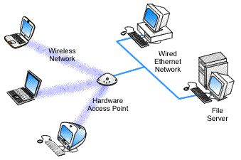

A imagem acima ilustra perfeitamente uma rede de infraestrutura. O "Hardware Access Point" atua como a ponte central, servindo os dispositivos da "Wireless Network" e conectando-os à "Wired Ethernet Network" (rede cabeada), onde residem outros recursos como o "File Server".

#### Modo Ad-Hoc (BSS Independente)

Já nas redes que não utilizam um ponto de acesso central, os dispositivos operam no modo **Ad-Hoc**. Neste modo, as estações são capazes de se comunicarem **diretamente entre si** em uma topologia ponto-a-ponto ou malha (mesh).

Em uma rede Ad-Hoc (também chamada de **IBSS - Independent Basic Service Set**), não há um "chefe" de rede. Cada dispositivo descobre seus vizinhos e estabelece conexões diretas. Em redes mais avançadas (como redes _mesh_ móveis ou MANETs), os dispositivos também podem atuar como roteadores, repassando a informação para outros dispositivos que estão fora do alcance de rádio, embora isso não seja comum em implementações Wi-Fi simples.

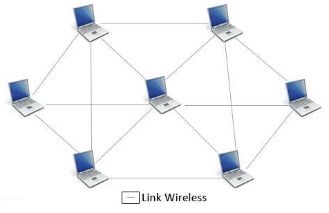

Este modo é útil para situações temporárias onde não há infraestrutura de rede, como a criação de uma rede rápida entre dois notebooks para transferir um arquivo, ou em redes de sensores e veículos.

### ESS (Extended Service Set)

Um único BSS (ou um único AP) tem uma área de cobertura limitada. Em um prédio de escritórios, um campus universitário ou até mesmo uma casa grande, um AP não é suficiente. Para resolver isso, o padrão 802.11 define o **ESS (Extended Service Set)**.

Um ESS é formado por **duas ou more BSSs** interconectadas. Para formar um ESS, as BSSs devem, obrigatoriamente, ser do tipo infraestrutura (utilizar APs).

A conexão entre as BSSs (ou seja, entre os APs) se dá por um **Sistema de Distribuição (DS - Distribution System)**. Na prática, o DS é quase sempre a **rede local cabeada (Ethernet)** à qual os Access Points estão conectados.

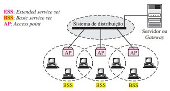

A imagem acima demonstra um ESS:

- Existem três APs, e cada um cria sua própria BSS (a "bolha" de cobertura de rádio).
- Os três APs estão conectados ao "Sistema de Distribuição" (a rede cabeada), que por sua vez se conecta a um servidor ou gateway de Internet.
- O conjunto dessas três BSSs, unidas pelo DS, forma um único e grande ESS.

A principal vantagem de um ESS é que ele permite a **mobilidade (roaming)**. Para os dispositivos clientes, o ESS inteiro se parece com uma única e grande rede.

### Tipos de Transição (Mobilidade)

Conforme já comentamos, dentro de uma mesma BSS, os dispositivos se comunicam mediados pelo AP. Agora, com múltiplas BSSs no contexto de uma ESS, podemos ter equipamentos que estão em uma zona de alcance de duas BSSs (como os dispositivos nos pontos de intersecção dos círculos na figura).

Esse cenário nos leva a três tipos de mobilidade definidos pelo IEEE 802.11:

1. **Sem Transição:** Uma estação deste tipo é fixa (como um computador de mesa com Wi-Fi) ou se movimenta apenas dentro da área de cobertura (BSS) de seu AP original.
2. **Transição Inter-BSS (Roaming):** Esta é a mobilidade mais importante. Uma estação com mobilidade de transição inter-BSS pode se movimentar de uma BSS para outra (ou seja, "pular" do AP1 para o AP2) _dentro do mesmo ESS_. Como ambos os APs estão conectados ao mesmo Sistema de Distribuição (a mesma rede lógica), essa transição (chamada de _hand-off_ ou _roaming_) pode ocorrer de forma transparente, sem que o usuário perca sua conexão ou seu endereço IP.
3. **Transição Inter-ESS:** Uma estação com mobilidade de transição inter-ESS pode se movimentar de um ESS para outro (por exemplo, sair da rede Wi-Fi do escritório e se conectar à rede Wi-Fi do café). O padrão IEEE 802.11 **não assegura** que a comunicação será contínua durante essa transição, pois, para a rede, o dispositivo está se desconectando de uma rede lógica e se conectando a uma completamente nova e diferente.

### Padrão IEEE 802.11 (Wi-Fi)

Já tivemos a oportunidade de mencionar sobre a dinâmica e a diferença fundamental entre o **802.3 (Ethernet)** e o **802.11 (Wi-Fi)**. Vimos que, embora ambos compartilhem a mesma subcamada superior de enlace (a **LLC**), suas subcamadas inferiores (**MAC**) são completamente distintas, pois seus meios físicos são distintos.

Enquanto o 802.3 utiliza o **CSMA/CD** (Detecção de Colisão) em um meio cabeado confiável, o 802.11, operando no ar (um meio caótico e imprevisível), deve utilizar o **CSMA/CA** (Prevenção de Colisão).

Entretanto, há outra diferença crucial e ainda mais visível entre os dois: o seu **cabeçalho de quadro**. O quadro Ethernet (802.3) é simples, rápido e enxuto. O quadro 802.11, por outro lado, é significativamente mais complexo, pois precisa gerenciar um conjunto de problemas que não existem no mundo cabeado: clientes dormindo, autenticação no ar, fragmentação de pacotes e a necessidade de múltiplos endereços para navegar pela rede sem fio.

#### Estrutura do Cabeçalho MAC 802.11

Sendo assim, vamos conhecer a sua estrutura e os seus campos.

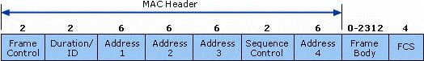

Ao observar o cabeçalho MAC 802.11, algumas diferenças em relação ao quadro Ethernet saltam à vista:

- **Tamanho:** O cabeçalho é muito maior.
- **Frame Control (Controle de Quadro):** Um campo de 2 bytes que define tudo sobre o quadro.
- **Duration/ID (Duração/ID):** Usado para o CSMA/CA, para que uma estação possa "reservar" o meio por um determinado tempo.
- **Múltiplos Endereços:** O quadro 802.11 possui **quatro campos de endereço** (Address 1 a 4), cada um com 6 bytes (48 bits).

Estamos diante de uma dinâmica interessante, pois os campos `Address 1` a `Address 4` podem assumir funções e significados totalmente diferentes (Endereço de Destino, Fonte, Receptor, Transmissor, BSSID, etc.) a depender dos parâmetros definidos no campo **`Frame Control`**.

Portanto, para entender o quadro 802.11, devemos primeiro entender os subcampos no contexto do campo `Frame Control`.

#### Campo "Frame Control"

O campo `Frame Control`, de 2 bytes, é o "cérebro" do quadro 802.11. Ele define a função do quadro e como os outros campos devem ser interpretados.

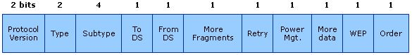

No quadro de controle, temos:

- **Protocol Version (Versão do Protocolo) [2 bits]:** Indica a versão corrente do protocolo 802.11 utilizado. As estações receptoras usam esse valor para determinar se a versão do protocolo do quadro recebido é suportada.
- **Type e Subtype (Tipo e Subtipo) [2 + 4 bits]:** Determina a função exata do quadro. Existem três tipos principais, cada um com vários subtipos:
    1. **Quadros de Gerenciamento (Management Frames):** Usados para descobrir, associar, autenticar e se desconectar de um AP (ex: _Beacon_, _Probe Request/Response_, _Association Request_).
    2. **Quadros de Controle (Control Frames):** Usados para gerenciar o acesso ao meio. São o coração do CSMA/CA (ex: _RTS - Request to Send_, _CTS - Clear to Send_, _ACK - Acknowledgment_).
    3. **Quadros de Dados (Data Frames):** Usados para carregar o payload (os dados do usuário, como um pacote IP).
- **To DS e From DS (Para/Do Sistema de Distribuição) [1 + 1 bit]:** Estes são os dois bits mais importantes para o endereçamento. Eles indicam se o quadro está indo _para_ o Sistema de Distribuição (DS) (a rede cabeada) ou se está vindo _do_ DS. A combinação desses dois bits determina o significado dos 4 campos de endereço.
- **More Fragments (Mais Fragmentos) [1 bit]:** O 802.11 permite a fragmentação de quadros grandes. Como o ar é um meio propenso a erros, é mais eficiente enviar pedaços menores (fragmentos) do que um quadro grande. Se um fragmento pequeno se corromper, apenas ele precisa ser retransmitido. Este bit indica se mais fragmentos do quadro estão vindo.
- **Retry (Retransmissão) [1 bit]:** Indica se a informação (dado ou gerenciamento) está ou não sendo retransmitida. O 802.11 é um protocolo de enlace _confiável_ (ao contrário do Ethernet) e espera um ACK para cada quadro. Se o ACK não chegar, o quadro é retransmitido com este bit ativado.
- **Power Management (Gerenciamento de Energia) [1 bit]:** Indica se a estação que transmitiu a informação está em _active mode_ (modo ativo) ou em _power-save-mode_ (modo economia de energia). Essencial para a vida útil da bateria de dispositivos móveis.
- **More Data (Mais Dados) [1 bit]:** Usado pelo AP para "avisar" uma estação que está em _power-save-mode_ que ele (o AP) tem mais quadros armazenados em buffer para enviar a ela.
- **WEP (ou "Protected Frame") [1 bit]:** Indica se o corpo do quadro (o payload) está ou não criptografado.
- **Order (Ordem) [1 bit]:** Indica se todos os quadros de dados recebidos devem ser processados em ordem estrita.

#### Esquema de Quatro Endereços

E aqui começa a dinâmica: a depender da combinação dos bits `To DS` e `From DS` no campo `Frame Control`, teremos informações e papéis diferentes para os quatro campos de endereço.

Para entender a tabela a seguir, precisamos definir os 5 papéis de endereço que um quadro 802.11 pode conter:

- **DA (Destination Address):** O endereço MAC do **destino final** do pacote (ex: o servidor na Internet).
- **SA (Source Address):** O endereço MAC da **fonte original** do pacote (ex: o notebook).
- **RA (Receiver Address):** O endereço MAC da **próxima estação** que irá receber fisicamente o quadro no _meio sem fio_ (ex: o AP).
- **TA (Transmitter Address):** O endereço MAC da estação que **transmitiu fisicamente** o quadro no _meio sem fio_ (ex: o notebook ou o AP).
- **BSSID (Basic Service Set Identifier):** O identificador único do BSS.
    - Em modo **Infraestrutura**, o BSSID é o endereço MAC do Access Point.
    - Em modo **Ad-Hoc (IBSS)**, o BSSID é um endereço MAC gerado aleatoriamente pela primeira estação que iniciou a rede.

A tabela abaixo ilustra como os campos de endereço são mapeados com base nos bits `To DS` e `From DS`:

|**To DS**|**From DS**|**Significado (Caso de Uso)**|**End. 1 (RA)**|**End. 2 (TA)**|**End. 3**|**End. 4**|
|---|---|---|---|---|---|---|
|0|0|Comunicação Ad-Hoc (IBSS) ou _Direct Link_|**DA**|**SA**|BSSID|-|
|0|1|**Do AP para o Cliente** (Saindo do DS)|**DA** (Cliente)|**TA** (AP)|**SA** (Servidor)|-|
|1|0|**Do Cliente para o AP** (Indo para o DS)|**RA** (AP)|**SA** (Cliente)|**DA** (Servidor)|-|
|1|1|Wireless Distribution System (WDS - AP para AP)|**RA** (AP-2)|**TA** (AP-1)|**DA**|**SA**|

Entendendo os Cenários:

1. **To DS = 0, From DS = 0 (End. 1=DA, End. 2=SA, End. 3=BSSID):**
    - O quadro não vai para o DS e não vem do DS.
    - **Caso de Uso:** Um notebook em uma rede **Ad-Hoc** envia um quadro para outro notebook.
    - `End 1 (RA)` é o Destino (DA), pois o receptor é o destino.
    - `End 2 (TA)` é a Fonte (SA), pois o transmissor é a fonte.
    - `End 3` é o BSSID, para identificar a qual rede Ad-Hoc o quadro pertence.
2. **To DS = 1, From DS = 0 (End. 1=RA, End. 2=SA, End. 3=DA):**
    - O quadro vai _para_ o DS (rede cabeada).
    - **Caso de Uso:** Um **cliente Wi-Fi** (notebook) envia um quadro para um **servidor na rede cabeada**.
    - `End 1 (RA)` é o Receptor imediato: o **AP** (cujo MAC é o BSSID).
    - `End 2 (TA)` é o Transmissor imediato: o **Cliente Wi-Fi** (que é também a Fonte original, SA).
    - `End 3` é o Destino final: o **Servidor** na rede cabeada (DA).
3. **To DS = 0, From DS = 1 (End. 1=DA, End. 2=TA, End. 3=SA):**
    - O quadro vem _do_ DS.
    - **Caso de Uso:** Um **servidor na rede cabeada** envia um quadro para um **cliente Wi-Fi** (notebook).
    - `End 1 (RA)` é o Receptor imediato: o **Cliente Wi-Fi** (que é também o Destino final, DA).
    - `End 2 (TA)` é o Transmissor imediato: o **AP** (cujo MAC é o BSSID).
    - `End 3` é a Fonte original: o **Servidor** na rede cabeada (SA).
4. **To DS = 1, From DS = 1 (End. 1=RA, End. 2=TA, End. 3=DA, End. 4=SA):**
    - O quadro vem do DS e vai para o DS.
    - **Caso de Uso:** Este é o único cenário que usa todos os quatro endereços. É usado em um **Wireless Distribution System (WDS)**, onde um AP atua como "repetidor" (ponte) sem fio para outro AP.
    - `End 1 (RA)` é o **AP Receptor**.
    - `End 2 (TA)` é o **AP Transmissor**.
    - `End 3 (DA)` é o **Destino final** na rede cabeada.
    - `End 4 (SA)` é a **Fonte original** (o cliente que originou o quadro).

### Evolução dos Padrões 802.11

O padrão IEEE 802.11 não é uma especificação única e estática. Assim como o Ethernet evoluiu de 10 Mbps para 100 Gbps, o padrão Wi-Fi é uma família de emendas (amendments) que foram sendo lançadas ao longo dos anos. Cada nova emenda buscou, principalmente, aumentar a taxa de transmissão de dados (throughput) e melhorar a confiabilidade, seja utilizando novas faixas de frequência, modulações mais eficientes ou tecnologias de antena mais inteligentes.

A tabela a seguir é muito importante e resume os principais padrões "físicos" da família 802.11 e suas características centrais:

| **Padrão**   | **Banda (GHz)** | **Comprimento do Canal** | **Modulação**   | **Tecnologias de Antena**   | **Taxa de Referência (Mbits/s)** | **Observações**               |
| ------------ | --------------- | ------------------------ | --------------- | --------------------------- | -------------------------------- | ----------------------------- |
| **802.11a**  | 5               | 20 MHz                   | **OFDM**        | N/A                         | 54                               | Incompatível com o 802.11b    |
| **802.11b**  | 2,4             | 20 MHz                   | **DSSS**        | N/A                         | 11                               | -                             |
| **802.11g**  | 2,4             | 20 MHz                   | DSSS e **OFDM** | N/A                         | 54                               | Evolução do 802.11b           |
| **802.11n**  | 2,4 e 5         | 20 e 40 MHz              | OFDM            | **MIMO** (até 4 antenas)    | 600                              | Primeiro padrão a usar MIMO   |
| **802.11ac** | 5               | 40, 80 e 160 MHz         | OFDM            | **MU-MIMO** (até 8 antenas) | 7000 (aprox. 7 Gbps)             | Também conhecido como Wi-Fi 5 |
| **802.11ax** | 2,4, 5 e 6      | 20, 40, 80, 160 MHz      | **OFDMA**       | **MU-MIMO** (8 antenas)     | 9600 (aprox. 9.6 Gbps)           | Também conhecido como Wi-Fi 6 |

Para entender por que esses padrões são diferentes, precisamos analisar as tecnologias-chave que eles introduziram: a **modulação** (como o sinal é codificado no rádio) e a **tecnologia de antena**.

#### Tecnologias de Modulação e Espectro

O rádio é um ambiente "poluído", cheio de interferências. As técnicas de "Espalhamento Espectral" (Spread Spectrum) foram criadas para tornar a comunicação sem fio robusta contra essas interferências.

- **FHSS (Frequency Hopping Spread Spectrum):** Literalmente, "Espalhamento Espectral com Salto de Frequência". Esta foi uma das técnicas originais usadas no primeiro padrão 802.11. Basicamente, a partir de um sincronismo e controle entre emissor e receptor, o transmissor "salta" de um canal de frequência para outro em uma sequência pseudo-aleatória e pré-definida, permanecendo em cada canal por um curtíssimo período. Isso torna o sinal muito resiliente; se uma frequência específica estiver sofrendo interferência, o sinal só será afetado por uma pequena fração de segundo antes de saltar para uma frequência limpa.
    
    

    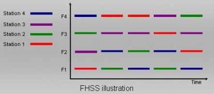
    

    
    A figura acima traz essa representação, em que as estações mudam as frequências (F1, F2, F3, F4) para transmissão em períodos de tempo determinados, seguindo padrões de salto diferentes para evitar colisões entre si.
- **DSSS (Direct Sequence Spread Spectrum):** "Espalhamento Espectral de Sequência Direta". Esta foi a técnica que tornou o Wi-Fi popular com o padrão **802.11b**. Em vez de "saltar" no tempo, o DSSS "espalha" o sinal por uma faixa de frequência larga _simultaneamente_. Ele faz isso pegando o fluxo de bits original e multiplicando-o por uma sequência de "chips" muito mais rápida (o código de espalhamento). O resultado é um sinal de baixa potência, mas muito largo, que se parece com ruído de fundo para qualquer receptor que não conheça o código de espalhamento. O padrão 802.11b utiliza uma técnica sucessora chamada **HR-DSSS (High Rate–DSSS)**, que permitiu que ele chegasse a taxas de 11 Mbps (um grande salto para a época).
- **OFDM (Orthogonal Frequency-Division Multiplexing):** "Multiplexação por Divisão de Frequência Ortogonal". Esta é a técnica de modulação que permitiu o salto para altas velocidades, sendo a base dos padrões **802.11a, g, n, e ac**. Em vez de usar um único sinal largo (como o DSSS), o OFDM divide o canal de 20MHz em dezenas de sub-portadoras (sub-canais) estreitas e independentes. Ele então transmite uma pequena parte dos dados em cada sub-portadora, em paralelo. A grande vantagem é a resiliência: se uma interferência atingir uma frequência específica, ela corromperá apenas algumas das 52 sub-portadoras, e não o sinal inteiro. Os dados perdidos são facilmente recuperados pelos códigos de correção de erro, permitindo taxas de transmissão muito mais altas e estáveis, como 54 Mbps.
- **MIMO (Multiple-Input Multiple-Output):** Introduzida pelo **802.11n**, esta não é uma técnica de modulação, mas de _antena_. Antes do 802.11n, os rádios usavam uma antena para transmitir e uma para receber. O MIMO utiliza múltiplas antenas para enviar e receber múltiplos fluxos de dados (chamados _spatial streams_) _ao mesmo tempo, no mesmo canal_. Isso multiplica a velocidade. Um rádio 802.11g tinha uma taxa de 54 Mbps. Um rádio 802.11n com 3 antenas (3x3 MIMO) poderia, teoricamente, atingir mais de 450 Mbps. O **MU-MIMO** (Multi-User MIMO), introduzido pelo 802.11ac, aprimorou isso, permitindo que um AP use suas múltiplas antenas para falar com _múltiplos dispositivos diferentes_ (ex: um celular e um notebook) exatamente ao mesmo tempo.

#### Evolução e Comparação dos Padrões

- **802.11a vs. 802.11b:** O padrão 802.11b não é considerado uma continuação do 802.11a, pois eles foram desenvolvidos em paralelo e são incompatíveis. O **802.11a** (54 Mbps com OFDM na banda de 5 GHz) era tecnicamente superior, mais rápido e operava em uma banda de frequência "limpa" (sem interferência de micro-ondas ou telefones sem fio). No entanto, o **802.11b** (11 Mbps com DSSS na banda de 2.4 GHz) "venceu" a adoção inicial do mercado. O motivo é que, embora a taxa de transmissão fosse menor, o sinal de 2.4 GHz tem um alcance muito maior (a nota menciona na ordem de 7 vezes mais) e os chips eram mais baratos de produzir.
- **802.11g:** Este sim foi um aperfeiçoamento e o sucessor direto do 802.11b. Ele foi o "melhor dos dois mundos": pegou a velocidade de 54 Mbps e a modulação OFDM do padrão "a", mas a implementou na banda de 2.4 GHz. Isso o tornou rápido e, ao mesmo tempo, manteve o grande alcance e a retrocompatibilidade com todos os dispositivos 802.11b existentes.

### Canais de Frequência e Sobreposição

A tecnologia de redes sem fio utiliza-se de canais de transmissão que refletem as subfaixas de frequência em que as informações são trafegadas. Os padrões 802.11 operam em faixas de frequência licenciadas (ISM - Industrial, Scientific and Medical), principalmente 2.4 GHz e 5 GHz.

- A banda de **2.4 GHz** (usada por 802.11b/g/n) vai de 2.4 GHz a 2.485 GHz.
- A banda de **5 GHz** (usada por 802.11a/n/ac) é muito mais larga, indo de 5.0 GHz a 5.8 GHz.

O problema central da banda de 2.4 GHz é a **sobreposição de canais (channel overlap)**. A banda é dividida em 14 canais (embora no Brasil e na maior parte das Américas, apenas os canais 1 a 11 sejam permitidos). Cada canal tem uma largura de 22 MHz, mas o centro de um canal está a apenas 5 MHz de distância do próximo.

A tabela a seguir detalha os canais da banda de 2.4 GHz:

|**Canal**|**Frequência Nominal**|**Frequência Prática (largura de 22MHz)**|
|---|---|---|
|**1**|**2.412 GHz**|**2.401 a 2.423 GHz**|
|2|2.417 GHz|2.405 a 2.428 GHz|
|3|2.422 GHz|2.411 a 2.433 GHz|
|4|2.427 GHz|2.416 a 2.438 GHz|
|5|2.432 GHz|2.421 a 2.443 GHz|
|**6**|**2.437 GHz**|**2.426 a 2.448 GHz**|
|7|2.442 GHz|2.431 a 2.453 GHz|
|8|2.447 GHz|2.436 a 2.458 GHz|
|9|2.452 GHz|2.441 a 2.463 GHz|
|10|2.457 GHz|2.446 a 2.468 GHz|
|**11**|**2.462 GHz**|**2.451 a 2.473 GHz**|
|12|2.467 GHz|2.456 a 2.478 GHz|
|13|2.472 GHz|2.461 a 2.483 GHz|
|14|2.482 GHz|2.466 a 2.485 GHz|

Quando várias redes sem fio sobrepõem suas áreas de cobertura (a "Selva de Wi-Fis" de Kurose), se elas utilizarem canais sobrepostos (ex: Canal 1 e Canal 2), elas irão interferir uma na outra, degradando o desempenho de ambas. Diz-se que não há sobreposição apenas entre canais que se distanciam por pelo menos 4 canais.

A boa prática para diminuir a interferência é alocar cada AP em subfaixas (canais) não sobrepostas. Na banda de 2.4 GHz, existem apenas **três** canais que não se sobrepõem: **1, 6 e 11**.

O diagrama de frequência abaixo ilustra isso perfeitamente.

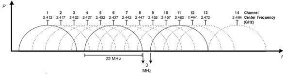

Vejam que na imagem é representado muito bem, em linha mais escura, a marcação dos canais 1, 6 e 11, demonstrando que não há sobreposição entre eles. Qualquer instalação profissional de Wi-Fi na banda de 2.4GHz deve usar _apenas_ esses três canais.

### Outros Padrões e Recursos Relevantes

- **802.11z (TDLS - Tunneled Direct Link Setup):** Este padrão surgiu para otimizar a comunicação _dentro_ de uma WLAN. Em uma rede de infraestrutura normal, se o notebook A quer enviar um arquivo para o notebook B (ambos conectados no mesmo AP), o tráfego sobe do A para o AP, e então desce do AP para o B. O 802.11z permite a criação de um **túnel direto** entre os dois dispositivos, sem depender do Access Point para retransmitir os dados.
- **Wi-Fi Direct:** É importante mencionar que a implementação do TDLS é diferente do recurso conhecido como **Wi-Fi Direct**. Este último tem o foco no estabelecimento de forma rápida de um link de comunicação entre dois dispositivos (ex: um smartphone e uma Smart TV) _independentemente_ de uma estrutura de rede sem fio (AP) existente.

### Tecnologias OFDM e MIMO

Dando seguimento, vamos agora entender as principais tecnologias que permitiram a grande evolução em velocidade e eficiência dos padrões de redes sem fio. Se observarmos novamente a tabela de padrões, veremos que duas tecnologias se tornam referência nos padrões mais modernos: OFDM e MIMO.

#### Orthogonal Frequency Division Multiplexing (OFDM)

Uma das principais tecnologias que apoiam a expansão das capacidades e a otimização do uso do meio de transmissão é o **OFDM (Multiplexação por Divisão de Frequência Ortogonal)**.

Para entender a importância do OFDM, precisamos primeiro olhar para o método tradicional, o **FDM (Frequency Division Multiplexing)**. No FDM, para que múltiplos sinais (canais) sejam transmitidos na mesma faixa de frequência sem que um interfira no outro, é preciso inserir "bandas de guarda" (guard bands) — espaços vazios — entre eles.

A imagem abaixo, na parte (a), ilustra o FDM. Vemos que para a mesma faixa de frequência (Available bandwidth), buscou-se evitar a sobreposição, o que limita a quantidade de canais (f1 a f4) e desperdiça espectro.

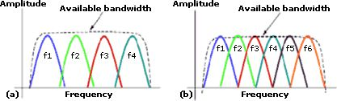

Já na parte (b) da imagem, temos o **OFDM**. E aí surge a pergunta: mas os canais (f1 a f6) estão claramente se sobrepondo, isso não vai gerar interferência?

A resposta é **não**, e essa é a "mágica" do OFDM. O "O" de Ortogonal se refere a uma característica matemática e de cálculo em domínio de frequência. As subportadoras (os canais) são projetadas de tal forma que o _pico_ de amplitude de um canal coincide perfeitamente com o ponto de amplitude _zero_ (o ponto nulo) de todos os outros canais sobrepostos.

O resultado é que, embora os sinais se sobreponham, eles não geram interferência entre si no momento da decodificação. Isso permite "empacotar" muito mais subportadoras (f1 a f6, no exemplo) na mesma largura de banda que o FDM usava para menos canais, aumentando drasticamente a eficiência espectral e a taxa de transmissão total. Esta é a tecnologia que permitiu o salto do 802.11b (11 Mbps) para o 802.11a/g (54 Mbps) e continua sendo a base de todos os padrões modernos.

#### Multiple In, Multiple Out (MIMO)

Se o OFDM tornou o "caminho" (o canal) mais eficiente, a tecnologia **MIMO (Multiple In, Multiple Out)**, introduzida a partir do padrão **802.11n**, foi responsável por criar múltiplos "caminhos" onde antes só existia um.

Basicamente, o MIMO explora a capacidade de se obter múltiplas entradas (recepção) e múltiplas saídas (transmissão) por intermédio do uso de **várias antenas** no transmissor e no receptor.

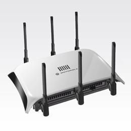

A imagem acima mostra um Ponto de Acesso com múltiplas antenas, uma característica visual de um dispositivo com capacidade MIMO.

A tecnologia MIMO é baseada no conceito de **fluxos espaciais (spatial streams)** distintos por caminhos diferentes. Em ambientes internos, o sinal de rádio ricocheteia em paredes, móveis e pessoas, criando múltiplos caminhos (um fenômeno chamado _multipath_). Antes do MIMO, o _multipath_ era um problema que causava interferência. O MIMO transforma esse problema em solução.

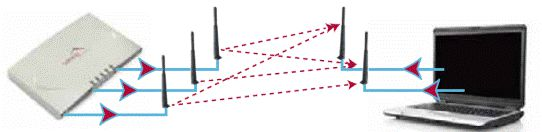

Como a imagem acima ilustra, um transmissor com múltiplas antenas pode enviar **fluxos de dados diferentes** de cada uma de suas antenas _ao mesmo tempo e na mesma frequência_. Esses sinais viajam por caminhos diferentes (as linhas pontilhadas) e chegam "misturados" nas antenas do receptor. O receptor, que também possui múltiplas antenas e um processador de sinal avançado, consegue desvendar essa mistura de sinais, separar os fluxos e remontar os dados originais, contribuindo para uma vazão final muito maior.

Um ponto que merece ser citado é que há uma relação de antenas e capacidades de fluxos, que respeita a estrutura `NxM:S`:

- **N** é a quantidade de Antenas de Transmissão.
- **M** é a quantidade de Antenas de Recepção.
- **S** é a quantidade de Fluxos Espaciais (Spatial Streams).

Um dispositivo 2x2:2 pode, teoricamente, duplicar a taxa de dados. Um 4x4:4 pode quadruplicar. O padrão 802.11n, por exemplo, suportava até 4 fluxos.

### Camada de Acesso ao Meio 802.11 (MAC e LLC)

É importante reforçar, como já vimos, que a camada de enlace é dividida em duas subcamadas.

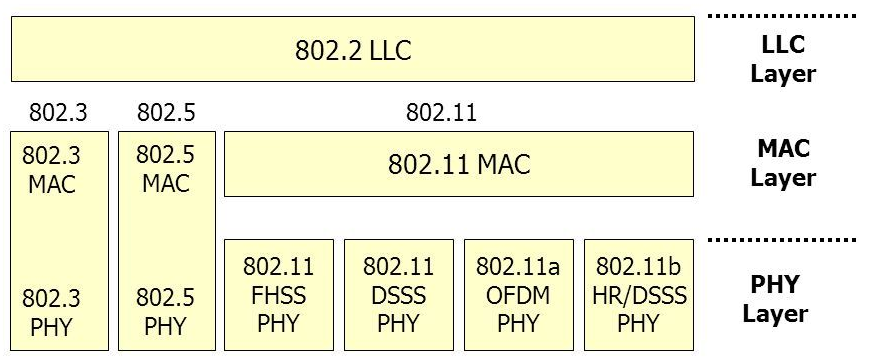

A figura acima nos dá essa visão clara:

1. **Subcamada Superior (LLC - Logical Link Control):** Padronizada como **802.2**, ela é **idêntica** quando comparamos os padrões 802.3 (Ethernet), 802.5 (Token Ring) e 802.11 (Wi-Fi). A LLC atua como a interface de tradução universal para as camadas superiores. A Camada de Rede (IP) entrega um pacote para a LLC, e ela não precisa saber (nem se importa) se o meio físico é um cabo de cobre ou o ar.
2. **Subcamada Inferior (MAC - Media Access Control):** Aqui temos a diferença. A subcamada MAC é específica para o meio. O MAC 802.3 lida com CSMA/CD e quadros com dois endereços. O MAC 802.11 lida com CSMA/CA, gerenciamento de energia, BSS/ESS, e quadros com até quatro endereços.
3. **Camada Física (PHY):** Abaixo do MAC, o 802.11 possui múltiplas camadas físicas (FHSS, DSSS, OFDM, etc.) que o MAC 802.11 sabe como gerenciar.

Nesse contexto, toda a parte de relação com o meio e ocupação de canais (como CSMA/CA, OFDM, MIMO) se dá a partir da camada MAC e da camada PHY, uma vez que a LLC é a mesma para ambos e trata de outros aspectos de organização da informação.

### Gerenciamento de Potência (Power Management)

Uma característica vital do padrão 802.11, especialmente para dispositivos móveis operados por bateria, é o **gerenciamento de potência**.

O protocolo 802.11 permite que os dispositivos operem em dois estados:

1. **Modo Ativo (Active Mode):** O rádio da estação está totalmente ligado. Ela pode transmitir ou receber informações a qualquer momento. Isso implica em um maior consumo de potência.
2. **Modo de Dormência (Power-Save Mode ou Stand-by):** Para economizar bateria, a estação "avisa" ao Access Point que está entrando em modo de dormência. Neste modo, o rádio principal é desligado. A estação apenas "acorda" em intervalos muito curtos e pré-definidos para verificar se há mensagens para ela.

Quando o Access Point recebe um quadro destinado a um dispositivo que está em _power-save_, o nó central (AP) não o transmite. Ele **armazena a informação em um buffer** e aguarda. Quando a estação "acorda" brevemente, ela ouve um quadro especial do AP (o _Beacon Frame_) que contém um mapa (TIM - Traffic Indication Map). Se a estação vir seu ID nesse mapa, ela entende que o AP tem dados para ela, entra no Modo Ativo e solicita o envio dos quadros armazenados.

Percebam que esse gerenciamento de potência do _dispositivo cliente_ é diferente do conceito de aumento ou diminuição da _potência de transmissão_ do sinal emitido pelo nó central (AP), que é usado para ajustar a área de cobertura (o alcance) do sinal.

### 802.11e: Qualidade de Serviço (QoS) para Wi-Fi

Os padrões 802.11 originais (a/b/g) tratavam todo o tráfego de forma igualitária, usando o método de acesso CSMA/CA, que é essencialmente "o primeiro a conseguir, transmite". Isso funciona bem para dados que não são sensíveis ao tempo, como e-mails ou navegação na web (o que é chamado de tráfego de _melhor esforço_ ou _best-effort_).

No entanto, com o surgimento de aplicações em tempo real, como Voz sobre IP (VoIP) e streaming de vídeo, esse modelo se mostrou inadequado. Um quadro de voz, que é pequeno e sensível a atrasos (latência), tinha que competir pelo meio de transmissão da mesma forma que um grande download de arquivo.

Para resolver isso, foi criado o padrão **802.11e**, que congrega um conjunto de aprimoramentos de **Qualidade de Serviço (QoS)**, aplicando-os diretamente na subcamada MAC.

A principal implementação do 802.11e é o **EDCA (Enhanced Distributed Channel Access)**. O EDCA determina que os tráfegos de maior prioridade têm mais possibilidade de emissão de pacotes do que os tráfegos de prioridades inferiores. Em vez de uma única fila de "melhor esforço", o EDCA cria quatro **Categorias de Acesso (ACs)**, permitindo a propagação de diferentes classes de tráfego e a otimização da rede.

Conforme a prioridade, o tráfego é classificado em uma das seguintes categorias:

- **AC_VO (Voz):** A mais alta prioridade. Reservada para tráfego de voz, que é extremamente sensível a atrasos.
- **AC_VI (Vídeo):** Segunda prioridade. Para tráfego de vídeo, que é sensível a atrasos e jitter (variação no atraso).
- **AC_BE (Best Effort / Melhor Esforço):** A categoria padrão, para tráfego normal, como e-mails e navegação web.
- **AC_BK (Background / Segundo Plano):** A prioridade mais baixa. Usada para tráfego que não tem pressa, como downloads de arquivos grandes, impressões em rede ou backups.

O 802.11e tem uma característica de inovação a partir da combinação dos padrões de acesso originais, o **DCF** (Distributed Coordination Function, o CSMA/CA padrão) e o **PCF** (Point Coordination Function, um método antigo baseado em polling do AP), formando o **HCF (Hybrid Coordination Function)**. O HCF, por sua vez, pode operar em duas versões:

- **EDCA (Enhanced Distributed Channel Access):** O método de acesso ao canal DCF aprimorado, baseado em contenção e prioridades (o mais utilizado).
- **HCCA (HCF Controlled Channel Access):** Um método mais complexo, controlado e centralizado pelo AP.

#### 802.11ax (Wi-Fi 6)

Naturalmente, as redes de computadores seguem suas evoluções contínuas. No que tange a redes sem fio, a geração mais recente que consolidou o uso massivo da tecnologia é o **Wi-Fi 6**.

O Wi-Fi 6, também conhecido como **IEEE 802.11ax**, é a mais recente evolução da tecnologia sem fio, projetada não apenas para ser mais rápida, mas fundamentalmente para melhorar a **eficiência** e a **capacidade** da rede em ambientes de alta densidade (com muitos dispositivos conectados simultaneamente), como aeroportos, estádios e escritórios modernos.

Ele opera nas faixas de **2,4GHz e 5GHz**, mantendo total compatibilidade com as versões anteriores (802.11a/b/g/n/ac). Na banda de 2,4 GHz, que é mais congestionada, ele opera primariamente com canais de 20 MHz e 40 MHz. Já na banda de 5 GHz, ele pode usar larguras de banda de 20 MHz, 40 MHz, 80 MHz e até **160 MHz**, o que contribui para suas altíssimas velocidades.

Uma de suas melhorias na camada física foi a introdução da modulação **1024-QAM** (Modulação de Amplitude em Quadratura). Enquanto o 802.11ac (Wi-Fi 5) usava 256-QAM (capaz de codificar 8 bits por símbolo), o 1024-QAM consegue "empacotar" 10 bits por símbolo. Isso gera, por si só, uma eficiência na ordem de 25% a 35% a mais de capacidade de transmissão de dados no mesmo espectro.

Vamos conhecer um pouco sobre as principais características e evoluções que o Wi-Fi 6 introduziu:

1. **Melhoria da Velocidade (OFDMA e MU-MIMO):** O Wi-Fi 6 oferece velocidades teóricas máximas de até 9,6 Gbps (quase três vezes mais rápido que o Wi-Fi 5). Essa velocidade não vem apenas do 1024-QAM, mas principalmente de duas tecnologias:
    - **OFDMA (Orthogonal Frequency-Division Multiple Access):** Esta é a _principal_ inovação do Wi-Fi 6. Todos os padrões anteriores (Wi-Fi 5/4) usavam OFDM, que dedicava um canal inteiro para transmitir dados para _um_ dispositivo por vez (como um caminhão de entregas indo para uma única casa, mesmo que meio vazio). O OFDMA permite que o AP divida o canal em dezenas de "unidades de recurso" (RUs) menores e as aloque para _múltiplos dispositivos_ (ex: 10 dispositivos) simultaneamente, na _mesma transmissão_. É o mesmo caminhão, mas agora entregando pacotes para 10 casas diferentes na mesma viagem.
    - **MU-MIMO (Multi-User MIMO):** O Wi-Fi 5 já usava o MU-MIMO, mas o Wi-Fi 6 o aprimora, permitindo que mais dispositivos (até 8) se comuniquem simultaneamente com o roteador e, crucialmente, agora ele funciona tanto no _downlink_ (do AP para o cliente) quanto no _uplink_ (do cliente para o AP).
2. **Redução da Latência:** A latência (o tempo de resposta) é drasticamente reduzida. Isso é um resultado direto do OFDMA. Em vez de um dispositivo ter que esperar o canal ficar totalmente livre para enviar um pequeno pacote (como um comando de jogo online), ele agora pode "pegar carona" em uma transmissão OFDMA maior, enviando seus dados em uma pequena Unidade de Recurso. Isso melhora drasticamente a experiência do usuário em jogos on-line e videoconferências em tempo real.
3. **Melhoria da Eficiência Energética (TWT):** O Wi-Fi 6 consome menos energia, o que é vital para dispositivos móveis e IoT. Ele introduz a tecnologia **TWT (Target Wake Time)**. Com o TWT, o AP pode "agendar" horários específicos para que os dispositivos acordem e transmitam dados (ex: "Celular X, durma agora e acorde em 300 milissegundos para verificar se há dados"). Isso permite que os dispositivos permaneçam em um modo de baixa energia por muito mais tempo, prolongando significativamente a vida útil da bateria.
4. **Melhoria da Cobertura e Coexistência (BSS Coloring):** O Wi-Fi 6 oferece melhor desempenho em ambientes congestionados. Ele usa a tecnologia **BSS Coloring**. Em um prédio de apartamentos, por exemplo, o AP de um usuário ouve o tráfego do AP do vizinho no mesmo canal. Em padrões antigos, ele interpretaria isso como uma colisão e esperaria o vizinho terminar. Com o BSS Coloring, cada quadro é "colorido" (um número no cabeçalho) com o ID da sua rede (BSS). O AP vê o tráfego do vizinho, percebe que é de "outra cor" e, se o sinal for fraco o suficiente, ele o ignora e transmite ao mesmo tempo, reduzindo a interferência e melhorando a qualidade do sinal.
5. **Maior Capacidade de Rede:** Este é o resultado da soma de OFDMA, MU-MIMO e BSS Coloring. O Wi-Fi 6 pode lidar com muito mais dispositivos conectados simultaneamente sem degradar o desempenho da rede.
6. **Maior Segurança (WPA3):** O Wi-Fi 6 também torna a rede mais segura. A certificação Wi-Fi 6 _exige_ o uso do protocolo **WPA3**, que é mais seguro do que o WPA2 usado pela geração anterior. O WPA3 usa criptografia mais forte e métodos de troca de chaves mais robustos (como o SAE - Simultaneous Authentication of Equals), tornando a rede mais difícil de ser interceptada por hackers.

### Funções de Coordenação de Acesso (DCF e PCF)

No coração da subcamada MAC 802.11 estão os métodos que definem "quem pode falar" e "quando". O padrão 802.11 define dois modos de operação para coordenar o acesso ao meio:

1. **DCF (Distributed Coordination Function):** Função de Coordenação Distribuída.
2. **PCF (Point Coordination Function):** Função de Coordenação de Ponto.

#### Distributed Coordination Function (DCF) e o CSMA/CA

O **DCF** é o modo de operação padrão, fundamental e mais utilizado do 802.11. É um método de acesso baseado em contenção (_contention-based_), o que significa que todas as estações competem pelo direito de transmitir.

É um modo independente de um controle central, semelhante em filosofia ao padrão Ethernet. Entretanto, o método de acesso ao meio utilizado pelo DCF é o **CSMA/CA**, que é fundamentalmente diferente do **CSMA/CD** usado pelo Ethernet.

##### Por que não CSMA/CD (Detecção de Colisão)?

O CSMA/CD, conforme vimos, é um método de _detecção_ de colisão. O nó que deseja transmitir verifica se o meio está livre e, caso esteja, começa a transmitir. Enquanto ele está transmitindo, ele utiliza a tecnologia LWT (Listen While Talk), ou seja, ele monitora o meio _enquanto_ está transmitindo. Se ele detectar um sinal diferente do que está enviando, ele confirma uma colisão, dispara um sinal (JAM) e reinicia o processo.

Este método é impossível de ser implementado em redes sem fio por duas razões principais:

1. **Inviabilidade do "Listen While Talk":** Em um rádio, o sinal de transmissão de uma estação é milhões de vezes mais potente do que qualquer sinal que ela possa receber. A própria transmissão "encegueceria" o receptor da estação, tornando impossível para ela "ouvir" uma colisão (um sinal muito mais fraco) ao mesmo tempo em que grita (transmite).
2. **Problema do Terminal Escondido:** O CSMA/CD assume que, se uma colisão ocorrer, todos os nós na rede a detectarão. Em redes sem fio, isso não é verdade.

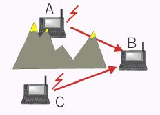

A imagem acima ilustra o cenário clássico do **terminal escondido**. Nela, a estação **B** (um Access Point, por exemplo) está no centro e consegue "enxergar" (receber sinal) tanto da estação **A** quanto da estação **C**. No entanto, devido a um obstáculo (como uma montanha ou prédio), **A e C não se enxergam**.

Se A e C quiserem transmitir para B ao mesmo tempo:

1. A "escuta" o meio (Carrier Sense) e não ouve nada (pois não ouve C). Assume que o meio está livre e começa a transmitir.
2. C faz exatamente a mesma coisa.
3. Os dois sinais colidem em B, e os dados são corrompidos.
4. Como A e C não se ouvem, nenhum deles jamais saberá que a colisão ocorreu. O CSMA/CD falha completamente.

##### CSMA/CA (Prevenção de Colisão)

Já o CSMA/CA, sucessor do CSMA/CD para meios sem fio, possui o recurso de **evitar** a colisão (_Collision Avoidance_). Ele faz isso através de um mecanismo de "reserva" do meio.

O DCF pode atuar de duas formas:

1. **Método Básico (Detecção de Colisão Indireta):** O emissor simplesmente verifica a disponibilidade do meio. Caso esteja livre por um período específico (veremos o DIFS adiante), ele envia a informação. Como ele não é capaz de escutar o meio enquanto envia, ele aguarda um quadro de confirmação **ACK (Acknowledgment)** do receptor. Se o ACK não chegar no tempo esperado, o emissor _assume_ que uma colisão (ou interferência) ocorreu, aguarda um tempo aleatório e tenta retransmitir.
2. **Método RTS/CTS (Prevenção Ativa):** Este é o método mais complexo e robusto, usado para evitar o problema do terminal escondido. Ele envolve uma sinalização prévia:
    - **RTS (Request to Send):** O nó "A", objetivando transmitir para "B", envia um pequeno pacote de controle **RTS** (Requisição para Enviar), indicando que pretende ocupar o meio e por quanto tempo.
    - **CTS (Clear to Send):** O nó "B", ao receber o RTS, responde com um pacote **CTS** (Livre para Enviar), indicando que pode começar a transmissão.
    - **A "Mágica" do CTS:** O nó "C" (o terminal escondido) não ouviu o RTS de A, mas ele **ouve o CTS de B**. O CTS funciona como um sinal de "SILÊNCIO" para todas as estações ao alcance de B.
    - **NAV (Network Allocation Vector):** Os quadros RTS e CTS contêm um campo de "Duração". Quando o nó "C" (e qualquer outra estação vizinha) ouve o RTS ou o CTS, ele lê esse valor de duração e o armazena em um temporizador interno chamado **NAV (Vetor de Alocação de Rede)**. O NAV é, essencialmente, um controle interno que diz: "O meio estará ocupado pelos próximos _X_ microssegundos, não tente transmitir".
    - **DATA e ACK:** O nó "A" recebe o CTS, envia seus dados (DATA) e, após finalizar, aguarda um pacote **ACK (Confirmação)** de "B". Se o ACK não chegar, o processo é reiniciado.

Lembremos que todo esse procedimento de controle (DCF) ocorre diretamente entre os dispositivos (distribuído), não havendo um controle central.

#### Point Coordination Function (PCF)

Já no modo **PCF**, há um controle **centralizado**. Este modo é opcional e só funciona em redes de infraestrutura (com Access Point).

No modo PCF, o Access Point atua como um "mestre" ou "moderador" da rede, sendo responsável por fazer a alocação do meio aos dispositivos que desejam transmitir. Ele utiliza um mecanismo de **Polling (Sondagem)**, onde o AP "pergunta" a cada estação, uma por uma, se ela tem dados para enviar. Assumindo esse controle centralizado, o problema de colisão na rede é eliminado (cria-se um período _livre de contenção_).

#### Coexistência (DCF e PCF) e Prioridade (IFS)

Um ponto extremamente importante de se mencionar é que os dois modelos, DCF (distribuído) e PCF (centralizado), podem atuar juntos dentro de uma mesma célula de rede sem fio.

Como o PCF (centralizado) consegue "ganhar" o acesso ao meio contra todas as estações DCF (distribuídas)? A resposta está na definição de **intervalos de tempo obrigatórios** (InterFrame Spacing - IFS).

O padrão 802.11 define 4 intervalos de prioridade. Um tempo de espera mais curto significa uma prioridade mais alta. Esses intervalos são disparados de forma simultânea e contados paralelamente após o meio ficar livre.

Do mais curto (maior prioridade) para o mais longo (menor prioridade):

1. **SIFS (Short InterFrame Spacing):** O intervalo mais curto de todos. É a **maior prioridade**. É usado apenas para quadros de controle que são uma resposta imediata a uma transmissão, como um **ACK**, um **CTS** ou o próximo fragmento de um pacote. Isso garante que uma transação (RTS -> CTS -> DATA -> ACK) nunca seja interrompida por outra estação.
2. **PIFS (PCF InterFrame Spacing):** O segundo intervalo mais curto. É a prioridade usada pelo **Access Point** para iniciar o modo **PCF (Polling)**. Como o PIFS é _mais curto_ que o DIFS, o AP (no modo PCF) sempre terá a chance de falar antes de qualquer estação normal (no modo DCF).
3. **DIFS (DCF InterFrame Spacing):** O intervalo padrão para o modo **DCF**. Após o meio ficar livre, _qualquer estação_ que queira iniciar uma _nova_ transmissão (enviar um RTS ou um quadro de dados) deve esperar, no mínimo, o tempo de um DIFS. Se o meio permanecer livre durante esse tempo, a estação pode começar sua tentativa de transmissão.
4. **EIFS (Extended InterFrame Spacing):** O intervalo de menor prioridade. É um tempo de espera longo, usado por estações que receberam um pacote corrompido ou defeituoso. É uma "penalidade" para garantir que a estação que detectou um erro espere tempo suficiente antes de tentar informar o fato, para não colidir com um ACK ou CTS que ela possa não ter entendido.

#### Cenário de Transmissão Completo

Após visualizarmos as formas de operação, os tipos de quadros e os intervalos, apresentamos um diagrama de quadros que indica um cenário de transmissão DCF ao longo do tempo:

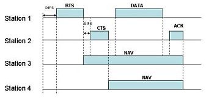

Neste diagrama, podemos analisar o fluxo completo:

1. A **Estação 1** deseja transmitir. Ela espera o meio ficar livre por um período **DIFS** (iniciando o modo DCF).
2. Ao final do DIFS, ela transmite seu quadro **RTS**.
3. A **Estação 2** (o receptor) espera apenas um **SIFS** (o intervalo de maior prioridade) e responde com o **CTS**.
4. As **Estações 3 e 4** ouvem o CTS (ou o RTS) e ativam seus temporizadores **NAV**, permanecendo em silêncio pelo tempo indicado no quadro.
5. A **Estação 1** recebe o CTS, espera um **SIFS**, e envia seus **DATA** (dados).
6. A **Estação 2** recebe os dados, espera um **SIFS**, e envia a confirmação final **ACK**.
7. Somente após o término de todo esse processo é que o meio fica livre, os NAVs expiram, e outras estações podem começar a esperar um novo DIFS para competir pelo meio.

## Aspectos de Segurança em Redes Sem Fio

Abordaremos alguns aspectos de segurança de forma objetiva neste capítulo, com o intuito de termos informações suficientes para respondermos às questões de redes sem fio, pois muitas delas juntam os aspectos de segurança com características de redes.

### SSID: Identificação da Rede

Basicamente, cada rede sem fio possui uma identificação que a distingue das demais, permitindo a associação entre os dispositivos e os pontos de acesso. Essa identificação, que é o "nome" da rede (como `NET_CASA_5G` ou `WIFI_CORPORATIVO`), é chamada de **SSID (Service Set Identifier)**.

O SSID é configurado no Access Point (Ponto de Acesso). Antes da associação de qualquer cliente, o Access Point deve enviar quadros de sinalização (chamados _Beacon Frames_) periodicamente, informando o SSID da rede e seu endereço MAC (o BSSID). Assim, os dispositivos (notebooks, celulares) que estão na área de cobertura podem "escutar" esses beacons, identificar a rede e exibi-la na lista de redes disponíveis para o usuário.

Entretanto, este recurso de "anunciar" o SSID pode ser desabilitado no AP, tornando a rede **oculta**. Neste caso, os _Beacon Frames_ ainda são enviados (para sincronismo), mas o campo SSID vai vazio. Ou seja, caso um usuário deseje se conectar a essa rede, ela não aparecerá na lista, e ele deverá informar manualmente o SSID exato. (Isso é uma medida de "segurança por obscuridade", mas não impede que um atacante, usando ferramentas de análise, descubra o SSID).

Após a definição da rede à qual o usuário deseja se conectar (seja pela lista ou manualmente), inicia-se o processo de autenticação, caso a rede seja fechada ou privada.

### Segurança em LANs Sem Fio

Como as redes 802.11 utilizam um meio compartilhado e aberto — o ar — em que todos os dispositivos dentro do alcance de um sinal são capazes de capturar este tráfego, as técnicas de segurança e autenticação são fundamentais. Elas são a única forma de garantir:

1. **Autenticidade:** Garantir que apenas usuários autorizados possam entrar na rede.
2. **Confidencialidade:** Criptografar os dados para que, se forem interceptados, não possam ser lidos.
3. **Integridade:** Garantir que os dados não foram alterados no caminho.

As principais técnicas de autenticação e criptografia dos dados são os protocolos **WEP (Wired Equivalent Privacy)**, **WPA (Wi-Fi Protected Access)**, **WPA2** e **WPA3**.

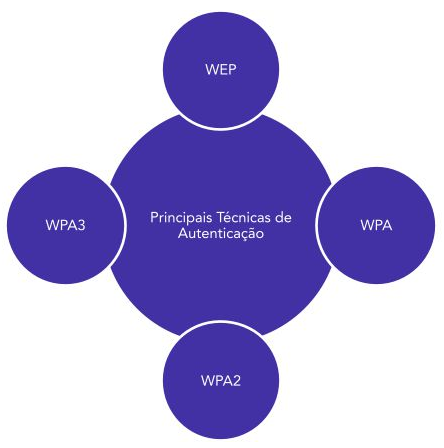

Essa evolução representa uma "corrida armamentista" de segurança. O primeiro e o segundo (WEP e WPA) já foram "quebrados", ou seja, são considerados inseguros e passíveis de interceptação do tráfego por um usuário malicioso. Já o WPA2, que foi o padrão-ouro por mais de uma década, possui uma vulnerabilidade em condições específicas (o ataque _KRACK_), o que, ensejou, inclusive, a criação do padrão mais recente, o WPA3.

### WEP (Wired Equivalent Privacy)

O WEP foi o primeiro protocolo padrão de segurança para redes sem fio, lançado em 1997. Seu nome ("Privacidade Equivalente a uma Rede Cabeada") reflete seu objetivo: tornar a rede sem fio tão segura quanto conectar um cabo Ethernet. Infelizmente, ele falhou drasticamente nisso.

O WEP utiliza o algoritmo de criptografia de fluxo **RC4**. Para criptografar, ele combina uma chave secreta estática (a "senha" do WEP, compartilhada por todos os dispositivos) com um **Vetor de Inicialização (IV)**, que é um valor de 24 bits gerado para cada pacote.

- No WEP original, a chave total tinha 64 bits: 40 bits da chave secreta (digitada pelo usuário) + 24 bits do IV.
- Posteriormente, surgiu o WEP de 128 bits: 104 bits da chave secreta + os mesmos 24 bits do IV.

Entretanto, diversas vulnerabilidades graves foram encontradas no WEP, sendo a principal delas o uso de **chaves estáticas** (a mesma chave para todos) e o tamanho perigosamente pequeno do **IV (24 bits)**.

Nesse cenário de falha do WEP, mas antes da finalização do WPA2, surgiu como um "curativo" o **TKIP (Temporal Key Integrity Protocol)**. O TKIP foi a base do _WPA_. Seu propósito era corrigir as falhas do WEP, mas ainda sendo compatível com o hardware antigo (que só entendia RC4). O TKIP passou a utilizar de forma fixa chaves de 128 bits, com um IV maior de 48 bits, e, o mais importante, introduziu a _troca de chaves por pacote_ (chaves temporais), eliminando a chave estática.

Após o TKIP como alternativa de criptografia, foi consolidada a utilização do conjunto **802.1X/EAP** (que vimos na seção anterior) como o padrão para _autenticação_ em redes corporativas.

#### Modos de Autenticação WEP

Ainda sobre o WEP, é importante termos no radar o seu funcionamento básico. Ele possui dois algoritmos: o **KSA (Key Scheduler Algorithm)**, responsável por gerar a chave pseudoaleatória a ser usada, e o **PRGA (Pseudo Random Generation Algorithm)**, que efetivamente encripta a mensagem. O PRGA é dividido em duas fases: Autenticação e Encriptação/Decriptação.

A seguir, temos a visão dos dois modos de _autenticação_ do WEP: Conexão Aberta e Conexão por Chave Compartilhada.

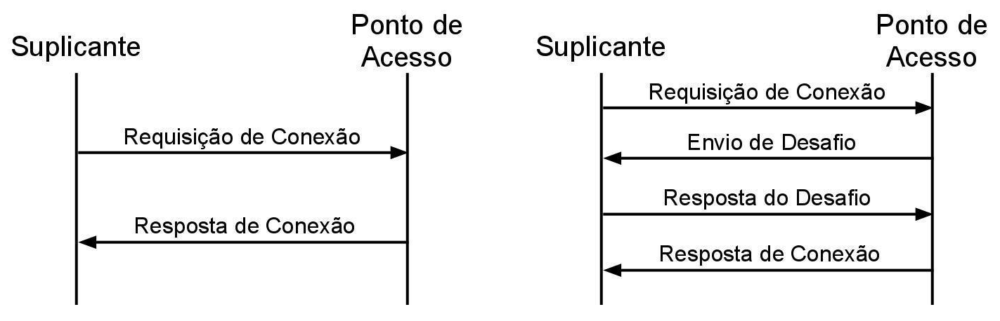

1. **Open System (Sistema Aberto):** Na primeira imagem (esquerda), temos o WEP Open System. É uma rede "aberta" que não solicita credenciais do suplicante ao Access Point. O suplicante envia uma "Requisição de Conexão" e o Ponto de Acesso responde com "Resposta de Conexão" (sucesso). Na prática, temos uma ausência de autenticação. É importante destacar que, após essa autenticação nula, a comunicação pode (e geralmente é) criptografada normalmente, usando a chave WEP estática (conforme a etapa do PRGA).
2. **Shared Key (Chave Compartilhada):** Já o segundo modo (direita) é o WEP Shared Key, onde temos o modelo de chave ou senha compartilhada. Aqui, há um processo de desafio-resposta em quatro etapas:
    1. O Suplicante envia a "Requisição de Conexão".
    2. O Ponto de Acesso responde com um "Envio de Desafio" (um texto aleatório em claro).
    3. O Suplicante criptografa esse desafio com a chave WEP e o envia na "Resposta do Desafio".
    4. O AP decriptografa a resposta com sua chave. Se o resultado for igual ao desafio original, ele envia a "Resposta de Conexão" (sucesso).
        A mesma chave usada nesse desafio será utilizada posteriormente no processo de criptografia das informações.

**Paradoxo da Segurança WEP:** Embora a "Shared Key" pareça uma autenticação real, dadas as características e vulnerabilidades do WEP, na prática, esse processo é **mais frágil**. Um atacante pode capturar o desafio (texto claro) e a resposta (texto cifrado), e usar essa informação para descobrir o fluxo de chave RC4 e, eventualmente, a chave WEP estática. Por esse motivo, se o foco era em aumentar a privacidade (confidencialidade) dos dados, era paradoxalmente mais recomendável usar o Open System (que não expunha a chave no desafio) e apenas criptografar o tráfego.

#### Fluxo de Criptografia WEP

Avançando para o processo de criptografia (a segunda fase do PRGA), podemos ver o fluxo de envio dos dados no regime de encriptação (esquerda) e decriptação (direita).

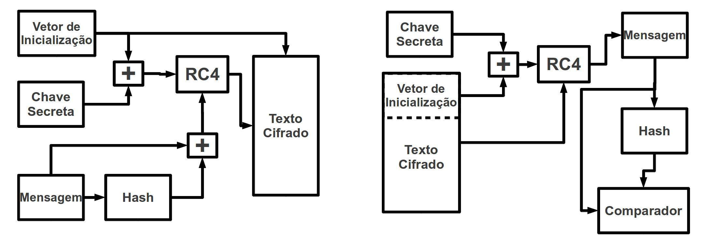

O intuito não é entrar em detalhes da sua implementação, mas tão somente entender as etapas e os recursos utilizados:

**Na Encriptação (esquerda):**

1. A **Mensagem** (dados) passa por uma função **Hash** (especificamente, um CRC-32) para gerar um Valor de Verificação de Integridade (ICV).
2. A Mensagem e seu Hash (ICV) são combinados.
3. O **Vetor de Inicialização (IV)** (24 bits) é combinado (concatenado) com a **Chave Secreta** (estática).
4. Essa chave combinada (IV+Key) é usada como semente (input) para o algoritmo de criptografia de fluxo **RC4**.
5. O RC4 gera um fluxo de chave (keystream).
6. O fluxo de chave é combinado (via operação XOR) com o (Mensagem + Hash).
7. O resultado é o **Texto Cifrado**, que é transmitido pela rede (junto com o IV em texto claro).

**Na Decriptação (direita):**

1. O receptor pega o **Vetor de Inicialização** (que veio em texto claro) e o combina com a mesma **Chave Secreta**.
2. Ele usa essa chave combinada como input no mesmo algoritmo **RC4**, o que gera _exatamente o mesmo_ fluxo de chave.
3. Ele combina (XOR) o **Texto Cifrado** recebido com o fluxo de chave gerado.
4. O resultado é a **Mensagem** original mais o **Hash** (ICV) original.
5. Para verificar a integridade, o receptor calcula um _novo_ Hash sobre a Mensagem recebida.
6. O **Comparador** verifica se o novo Hash gerado é igual ao Hash que foi recebido (o ICV). Se ambos forem iguais, temos a garantia do princípio da integridade.

#### Vulnerabilidades Fatais do WEP

Como já falamos, o WEP possui vulnerabilidades críticas que o tornam obsoleto. Entre elas, podemos citar:

1. **Ataque de Força Bruta (Chave Pequena):** O tamanho efetivo da chave (40 ou 104 bits) é considerado pequeno para os padrões modernos. O poder computacional atual possibilita a quebra da chave por força bruta.
2. **Reutilização do Vetor de Inicialização (IV):** Esta é a falha mais grave. O IV tem apenas 24 bits, o que gera cerca de 16,7 milhões de combinações. Em uma rede movimentada, esse número se esgota rapidamente (em horas ou até minutos) e os IVs começam a se repetir (reutilização). Um atacante que captura dois pacotes que usaram o _mesmo IV_ pode usar análise estatística para quebrar a criptografia.
3. **Possibilidade de Manipulação do CRC32:** O CRC32 (usado como Hash/ICV) é uma verificação de integridade, mas não de autenticidade, e possui uma natureza linear. Isso permite que um atacante manipule bits específicos no texto cifrado e, ao mesmo tempo, "corrija" o CRC32 cifrado para que a alteração passe despercebida pelo receptor. Isso representa uma quebra total do princípio da integridade.
4. **Softwares de Quebra:** Ferramentas como **airSnort** e **WepCrack** automatizaram esses ataques, permitindo que qualquer pessoa com um notebook e o software correto pudesse "quebrar" uma rede WEP em questão de minutos.

### WPA (Wi-Fi Protected Access)

As vulnerabilidades catastróficas do WEP não eram apenas teóricas; elas eram ativamente exploradas, tornando as redes sem fio inseguras. A indústria precisava de uma solução rápida. O padrão IEEE **802.11i** estava sendo desenvolvido para ser a solução de segurança robusta e de longo prazo, mas ainda não estava finalizado.

Como uma medida provisória para corrigir as falhas do WEP, a Wi-Fi Alliance criou o **WPA (Wi-Fi Protected Access)**. O WPA foi lançado como um novo algoritmo, baseado em um rascunho (draft) da especificação IEEE 802.11i. Ele não implementava todos os recursos do 802.11i (que se tornaria o WPA2), mas sim um subconjunto focado em corrigir as falhas mais graves do WEP.

O grande trunfo do WPA foi ser projetado para rodar no _mesmo hardware_ que usava o WEP, permitindo uma atualização de segurança via software (firmware) sem a necessidade de trocar os Access Points e placas de rede.

O WPA introduziu três avanços cruciais sobre o WEP:

1. **Confidencialidade (Criptografia):** Substituiu a chave estática do WEP pelo **TKIP (Temporal Key Integrity Protocol)**. O TKIP ainda usava o algoritmo RC4 (para manter a compatibilidade com o hardware WEP), mas gerava **chaves dinâmicas por pacote**.
2. **Verificação de Integridade:** Substituiu o fraco CRC-32 do WEP pelo **MIC (Message Integrity Check)**, um mecanismo muito mais robusto que impede a manipulação de pacotes.
3. **Autenticação:** Integrou formalmente o padrão **802.1X/EAP** para autenticação em nível empresarial, abandonando o inseguro WEP Shared Key.

Além disso, o WPA aumentou o tamanho do Vetor de Inicialização (IV) de 24 bits para **48 bits**, eliminando a vulnerabilidade de reutilização do IV que assolava o WEP.

#### WPA Personal vs. WPA Enterprise

O WPA também introduziu a divisão de modos de segurança que usamos até hoje:

- **WPA-Personal (ou WPA-PSK):** Este é o modelo que utilizamos em ambientes domésticos e pequenos escritórios. Ele utiliza uma **PSK (Pre-Shared Key)**, ou seja, uma "senha" padrão (com 8 a 63 caracteres) que é configurada no Access Point e em todos os dispositivos clientes para acesso à rede sem fio.
- **WPA-Enterprise (ou WPA-EAP):** Este modo não usa uma senha compartilhada. Ele implementa a arquitetura **802.1X** completa, onde cada usuário possui credenciais únicas (como login e senha de rede) que são validadas por um servidor central (RADIUS). As chaves de criptografia são geradas dinamicamente e são específicas para cada usuário e cada sessão. Como o próprio nome sugere, é o modo utilizado em ambientes empresariais.

Ambas as versões (Personal e Enterprise) podem ser utilizadas tanto para o WPA quanto para seu sucessor, o WPA2.

> **Uma Nota sobre o WPS (Wi-Fi Protected Setup):**
> 
> Para simplificar o processo de conexão em redes WPA-Personal, foi criado um método alternativo conhecido como WPS. Em vez de digitar a senha longa, o WPS permite que um usuário se conecte pressionando um botão no roteador ou digitando um PIN de 8 dígitos. Embora tenha sido criado para fortalecer e simplificar o processo, o WPS trouxe uma grande falha de segurança consigo (especificamente no processo de recuperação do PIN), tornando-o vulnerável a ataques de força bruta, sendo hoje uma prática recomendada desabilitá-lo.

#### Handshake do WPA-PSK (4-Way Handshake)

Vamos focar no funcionamento do WPA-Personal (PSK). A parte de conexão é superficialmente parecida com a do WEP Shared Key, mas provê uma segurança imensamente superior ao **não transmitir pelo ar** nem a chave mestra (PMK), nem a chave de sessão (PTK).

Este processo, conhecido como "4-Way Handshake" (negociação de 4 vias), ocorre _após_ o suplicante se associar ao Ponto de Acesso. Ele envolve dois atores: o Suplicante e o Ponto de Acesso.

A chave pré-compartilhada (a "senha" do Wi-Fi) é usada como a **PMK (Primary Master Key)**. O objetivo do handshake não é trocar a PMK (pois ambos já a possuem), mas sim _provar_ que ambos a possuem (sem revelá-la) e, a partir dela, gerar um novo conjunto de chaves dinâmicas para a sessão.

O fluxo é o seguinte:

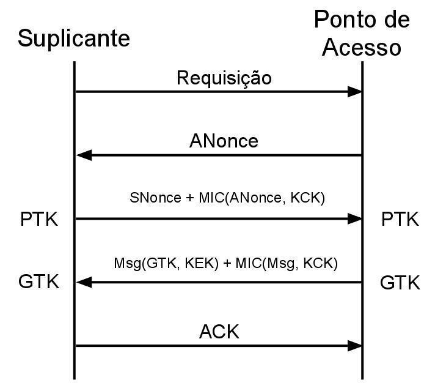

1. O Ponto de Acesso (AP) envia para o Suplicante um número aleatório chamado **ANonce** ("Nonce do Autenticador").
2. O Suplicante, ao receber o ANonce, gera seu próprio número aleatório, o **SNonce** ("Nonce do Suplicante").
3. O Suplicante agora possui todos os ingredientes: a **PMK** (que ele já sabia), o **ANonce** (que ele recebeu) e o **SNonce** (que ele gerou). Ele combina esses valores e calcula a chave principal desta sessão: a **PTK (Pairwise Transient Key)**.
4. O Suplicante envia uma mensagem ao AP contendo o **SNonce** (em texto claro) e um **MIC** (calculado usando a chave KCK, que é parte da PTK). Este MIC funciona como uma assinatura da mensagem, provando ao AP que o Suplicante possui a PMK.
5. O AP recebe o SNonce. Agora, ele também possui a PMK, o ANonce e o SNonce. Ele calcula a _sua própria_ cópia da **PTK** e a usa para verificar o MIC enviado pelo Suplicante. Se o MIC for válido, o Suplicante está autenticado.
6. O AP então envia a **GTK (Group Temporal Key)** para o Suplicante. A GTK é a chave que será usada para criptografar o tráfego de broadcast/multicast da rede. Esta mensagem (Msg) é criptografada usando a chave KEK (parte da PTK) e assinada com um MIC (usando a KCK).
7. O Suplicante recebe a mensagem, valida o MIC e usa sua KEK para descriptografar a GTK.
8. O Suplicante envia um **ACK** final, e a porta é aberta para o tráfego de dados.

#### Hierarquia de Chaves do WPA/WPA2

Como vimos no fluxo, o WPA não usa uma única chave, mas uma hierarquia delas. A **PMK** (a senha ou o resultado do 802.1X) nunca é usada diretamente para criptografar dados. Ela é usada apenas para gerar a **PTK (Pairwise Transient Key)**, que é a chave da sessão.

A PTK (geralmente de 512 bits) é, por sua vez, "fatiada" em várias chaves menores com propósitos específicos:

- **KCK (Key Confirmation Key):** Usada para calcular o **MIC** nas mensagens do handshake. Sua função é _autenticar_ e provar a posse da PMK.
- **KEK (Key Encryption Key):** Usada para _criptografar_ outras chaves (como a GTK) quando elas precisam ser transportadas com segurança durante o handshake.
- **TEK (Temporal Encryption Key):** Esta é a chave (ex: 128 bits) que será efetivamente usada pelo algoritmo de criptografia (TKIP/RC4 no WPA, AES no WPA2) para criptografar os dados do usuário.
- **TMK (Temporal MIC Key):** Chave usada para gerar o MIC (assinatura) nos pacotes de _dados_ reais. (Nota: Em muitas implementações, esta função é combinada ou derivada da KCK).

#### Criptografia: TKIP (Temporal Key Integrity Protocol)

Para manter a compatibilidade com o hardware WEP, o WPA utilizou o algoritmo de criptografia RC4, mas o "envolveu" com o **TKIP**. O TKIP conserta as falhas do WEP:

1. Ele usa uma chave base de 128 bits (a TEK).
2. Ele combina essa TEK com o IV de 48 bits e o endereço MAC do transmissor, usando uma função de _hash_ (Fase 1 e Fase 2, como descrito nas anotações), para gerar a chave RC4 final de 128 bits (104 bits de chave + 24 bits de IV para o RC4).
3. O resultado é que **cada pacote é criptografado com uma chave RC4 única e dinamicamente gerada**, eliminando a vulnerabilidade de chave estática e reutilização de IV do WEP.

#### Integridade: MIC (Message Integrity Check)

O TKIP também introduziu um mecanismo de integridade robusto para substituir o CRC-32 do WEP, chamado **MIC**, ou apelidado de "Michael".

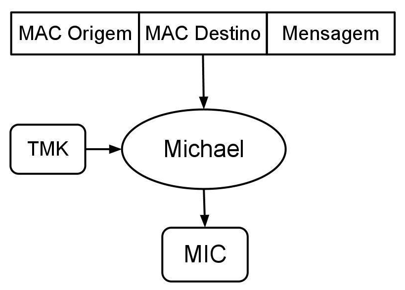

O MIC foi criado para combater a fragilidade do WEP que permitia a manipulação do CRC-32. O MIC é uma "assinatura" criptográfica (um _hash_ com chave) calculada sobre a mensagem, usando uma chave secreta (a TMK, derivada da PTK).

Como a imagem ilustra, o algoritmo "Michael" pega os endereços MAC (origem e destino), a mensagem e a chave de integridade (TMK) como entrada. A saída é o valor do MIC. Como um atacante não possui a TMK, ele não pode alterar a mensagem e gerar um novo MIC válido, garantindo a integridade dos dados. Este processo é totalmente independente do Vetor de Inicialização.

### WPA2 (Wi-Fi Protected Access II)

Seguindo a nossa discussão, o WPA foi uma solução provisória, um "curativo" de segurança. A verdadeira e robusta solução de longo prazo foi a ratificação completa do padrão **IEEE 802.11i**, que se tornou comercialmente conhecido como **WPA2**.

O WPA2 é a implementação que complementa todas as especificações do 802.11i, apresentando-se como uma garantia de segurança muito mais forte. A principal e mais importante mudança do WPA2 é o abandono do algoritmo de criptografia RC4, que o WPA foi forçado a usar por questões de retrocompatibilidade.

O protocolo WPA2 utiliza a cifra de bloco **AES (Advanced Encryption Standard)**, o mesmo padrão de criptografia de nível militar usado por governos e bancos, que é muito mais seguro e robusto que a cifra de fluxo RC4.

Embora a criptografia subjacente tenha mudado, o WPA2 manteve a mesma arquitetura de autenticação que tornou o WPA bem-sucedido:

- Ele implementa a mesma técnica de **4-Way Handshake** (as 4 trocas de mensagem para autenticação) para gerar chaves de sessão dinâmicas.
- Ele implementa as mesmas duas versões de autenticação: **WPA2-Personal** (usando uma chave pré-compartilhada ou PSK) e **WPA2-Enterprise** (usando 802.1X e um servidor RADIUS).

A seguir, temos a representação do 4-Way Handshake, que é idêntico em sua lógica tanto no WPA quanto no WPA2:

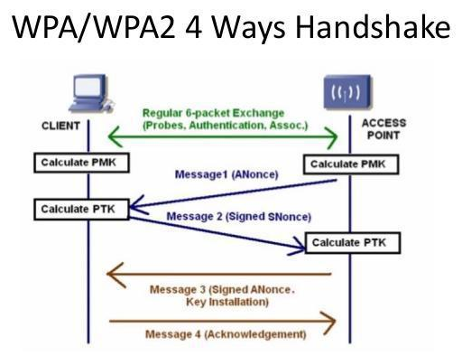

Como visto no processo do WPA, alguns termos são fundamentais:

- **NONCE:** Diz respeito a um número aleatório gerado pelo nó e usado apenas uma vez (_Number used Once_) nesse ciclo criptográfico. Temos o **ANonce** (gerado pelo AP) e o **SNonce** (gerado pelo Suplicante).
- **PMK (Pair-wise Master Key):** Esta é a "chave mestra" da sessão.
    - No modo _Enterprise_, a PMK é gerada pelo servidor RADIUS após a autenticação 802.1X bem-sucedida.
    - No modo _Personal_, a PMK é também chamada de **PSK (Pre-Shared Key)**. A PSK não é _exatamente_ a senha que o usuário digita; ela é um valor derivado da combinação da senha da rede sem fio (de 8 a 63 caracteres) com o nome da rede (o SSID), através de um processo de hash.

Para completar os elementos, os endereços MAC tanto do AP quanto do Suplicante também são utilizados como "sal" (salt) no processo de cálculo da PTK (Pairwise Transient Key), garantindo que a chave de sessão seja única para aquele par de dispositivos.

#### CCMP: O Sucessor do TKIP

O WPA2 utiliza duas técnicas de segurança para confidencialidade e integridade: **TKIP** (para retrocompatibilidade com dispositivos WPA) e **CCMP**, sendo o **CCMP obrigatório**.

O **CCMP (Counter Mode with Cipher Block Chaining Message Authentication Code Protocol)** é o protocolo de criptografia usado pelo WPA2. Ele é totalmente independente do funcionamento do WEP, justamente pelo fato de não usar o algoritmo RC4. Ao invés disto, a mensagem é codificada com o uso do **AES**.

O CCMP é, na verdade, a combinação de duas técnicas de criptografia baseadas em AES:

1. **AES-CTR (Counter Mode):** Usado para a **confidencialidade** (criptografia) dos dados.
2. **CBC-MAC:** Usado para a **integridade e autenticação** (o MIC, ou "Message Authentication Code"). O termo "Encadeamento de blocos de Cifras" (Cipher Block Chaining) refere-se a essa técnica.

O conceito de chaves temporárias e código de integridade de mensagem introduzido pelo WPA continuou a ser usado, só que funcionando de maneira diferente. A primeira grande diferença se encontra na PTK:

- Enquanto a PTK do **WPA (TKIP)** possui 512 bits...
- A PTK do **WPA2 (CCMP)** dispõe de apenas **384 bits**.

A razão para essa redução é a eficiência do AES. O CCMP não precisa da **TMK (Temporal MIC Key)**, que era uma chave separada no WPA. O CCMP usa a **TEK (Temporal Encryption Key)** tanto para a encriptação (no AES-CTR) quanto para o cálculo do MIC (no CBC-MAC), "alimentando" o algoritmo AES em todos os passos e eliminando a necessidade de uma chave de MIC separada.

#### Processo de Criptografia CCMP

O processo de encriptação (e, analogamente, de decriptação) do CCMP é muito mais robusto que o do WEP ou TKIP. Ele utiliza o "Número de Pacote" (o IV, ou vetor de inicialização, que também serve como um contador) para garantir que cada pacote seja criptografado de forma única, impedindo ataques de repetição (_replay attacks_).

A figura abaixo ilustra o fluxo de dados no CCMP:

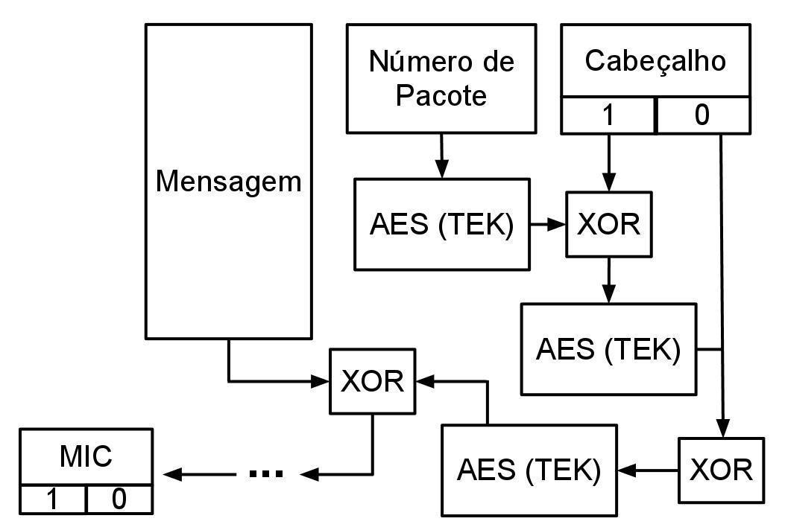

O processo, embora pareça complexo, pode ser dividido em duas partes:

1. **Cálculo do MIC (Autenticação e Integridade):**
    - O CCMP usa o **CBC-MAC**. De forma simplificada, ele pega o cabeçalho (que inclui o Número de Pacote para proteção) e o primeiro bloco da mensagem, aplica uma operação XOR e criptografa o resultado com AES (usando a TEK).
    - O resultado (bloco cifrado) é então combinado (XOR) com o _próximo_ bloco da mensagem, e o processo se repete, criando um "encadeamento".
    - Quando todos os pedaços da mensagem tiverem passado por este processo, o resultado final é uma "assinatura" (o MIC) que autentica tanto o cabeçalho quanto a mensagem.
2. **Encriptação da Mensagem (Confidencialidade):**
    - O CCMP usa o **AES-CTR (Counter Mode)**. Para cada pedaço da mensagem, ele pega um "Nonce" (um vetor com parâmetros, incluindo o Número de Pacote), o incrementa e o _criptografa_ com AES (TEK).
    - O resultado é um "bloco de fluxo de chave" (keystream).
    - Esse keystream é combinado (XOR) com o pedaço da mensagem em texto claro, gerando o pedaço encriptado correspondente.
    - Como este tipo de operação é invertível (basta aplicar o XOR novamente com o mesmo keystream), o processo de decriptação no receptor é idêntico. O receptor também recalcula o MIC e o compara com o MIC recebido para garantir a integridade.

#### Vulnerabilidade do WPA2 (Ataque de Dicionário)

Apesar de sua enorme robustez, o WPA2 (especificamente o WPA2-Personal/PSK) possui uma vulnerabilidade teórica que pode ser explorada em determinados contextos: o **ataque de dicionário offline** sobre o 4-Way Handshake.

- Como vimos, a senha (PSK/PMK) _nunca_ é enviada pelo ar.
- No entanto, as mensagens 1, 2, 3 e 4 do handshake (que contêm os Nonces e os MICs) _são_ enviadas pelo ar e podem ser capturadas por um atacante.
- Um atacante pode, então, tentar adivinhar a senha _offline_. Para cada senha em seu "dicionário", ele a usa (junto com o SSID) para gerar a PMK.
- Com essa PMK _tentativa_ e os Nonces _capturados_, ele simula o cálculo da PTK e, em seguida, calcula o MIC da mensagem (ex: Mensagem 2).
- Se o MIC que ele calculou for _idêntico_ ao MIC que ele capturou no ar, o atacante descobriu a senha.

Neste tipo de ataque, não há necessidade de interação direta com o AP (é um ataque passivo, pós-captura), o que dificulta um monitoramento ou ação por parte do AP. A única defesa contra isso é o uso de uma senha (PSK) longa, complexa e que não esteja em dicionários.

Vale ressaltar que os métodos WEP, WPA e WPA2 foram desenvolvidos para tratar os princípios de integridade e confidencialidade, ainda que utilizem protocolos e tecnologias auxiliares para esse fim.

#### Resumo de Protocolos de Criptografia

Um breve resumo dos protocolos de criptografia que vimos até aqui:

| **Protocolo de Segurança** | **Algoritmo de Criptografia** | **Protocolo de Chave/Integridade**       |
| -------------------------- | ----------------------------- | ---------------------------------------- |
| **WEP**                    | RC4 (Fluxo)                   | Chave fixa (estática)                    |
| **WPA**                    | RC4 (Fluxo)                   | **TKIP** (Chaves dinâmicas temporais)    |
| **WPA2**                   | **AES** (Bloco)               | **CCMP** (Obrigatório) + TKIP (Opcional) |

### WPA3: A Nova Geração de Segurança

Já em um caráter mais recente, estamos convivendo com a tecnologia de segurança **WPA3**, lançada pela Wi-Fi Alliance em 2018. Ela surgiu seguindo a mesma lógica de evolução dos recursos de segurança, mas com um objetivo muito claro: corrigir as vulnerabilidades fundamentais que ainda existiam no WPA2.

O surgimento do WPA3 foi diretamente motivado pela descoberta do ataque **KRACK (Key Reinstallation Attack)**. Este notório ataque explorou uma vulnerabilidade no próprio _fluxo_ do 4-Way Handshake do WPA2, permitindo que um atacante (em condições específicas) enganasse um cliente para reinstalar uma chave já em uso, forçando-o a usar nonces (números aleatórios) repetidos e, com isso, quebrar a criptografia da sessão.

O WPA3 endereça essa e outras vulnerabilidades, introduzindo um novo padrão de segurança.

#### Substituição do PSK pelo SAE

A mudança mais significativa do WPA3 está no modo **Personal**. O WPA3 substitui a chave pré-compartilhada (PSK) do WPA2 pelo **SAE (Simultaneous Authentication of Equals)**, um protocolo de troca de chaves também conhecido como "Dragonfly".

Esta substituição resolve duas falhas graves do WPA2-Personal:

1. **Defesa contra Ataques de Dicionário Offline:** Como vimos, o WPA2-PSK era vulnerável a ataques de dicionário offline. Um atacante podia capturar passivamente o 4-Way Handshake no ar e, em seguida, usar um computador potente para testar milhões de senhas por segundo contra o handshake capturado, sem nunca interagir com o AP.
    O SAE torna esse ataque impossível. O handshake do SAE requer que tanto o cliente quanto o AP participem ativamente da negociação usando a senha desde o primeiro passo. Para um atacante testar uma única senha, ele precisa iniciar uma interação direta com o AP. O AP pode, então, detectar múltiplas tentativas de falha (como qualquer sistema de login) e bloquear o atacante. Isso transforma um ataque offline (rápido e indetectável) em um ataque online (lento, custoso e fácil de detectar).
2. **Proteção contra KRACK:** O protocolo de handshake do SAE é inerentemente resistente a ataques de reinstalação de chaves.

#### Proteção de Dados Históricos (Forward Secrecy)

Um outro recurso de segurança crucial que o SAE introduz é a **"Forward Secrecy"** (Sigilo Adiante).

- No WPA2-PSK, se um atacante gravou _um ano_ de tráfego criptografado da sua rede e, _hoje_, ele finalmente descobre sua senha, ele pode usar essa senha para descriptografar _todo_ o tráfego histórico que ele guardou.
- No WPA3-SAE, a senha só é usada para autenticar o handshake. As chaves de criptografia reais são geradas dinamicamente (chaves efêmeras) e não podem ser recalculadas a partir da senha.
- Isso significa que, caso um hacker consiga violar a senha, ele não consegue descriptografar os dados que já foram trocados. Sua invasão será limitada do tráfego recente para frente.

#### Aumento da Complexidade Criptográfica

O WPA3 também eleva o padrão mínimo de criptografia, aumentando a robustez contra ataques de força bruta:

- **WPA3-Personal:** Utiliza chaves de 128 bits e o protocolo SAE.
- **WPA3-Enterprise:** Oferece dois modos:
    - Um modo padrão de 128 bits (baseado em AES-CCMP).
    - Um modo opcional de **192 bits** para ambientes de altíssima segurança (como governamentais ou financeiros), que exige:
        - Autenticação EAP-TLS com criptografia de curva elíptica (ECDH e ECDSA-384).
        - Criptografia da sessão com GCMP-256.
        - Hashing com HMAC-SHA384.

### Três Pilares do WPA3

Trazendo uma outra abordagem ou perspectiva dos tipos de segurança aplicados às redes sem fio, podemos resumir os modos de segurança em dois grandes grupos:

1. **Personal (ou PSK - Pre-Shared Key):** Método que usa uma senha ou frase secreta compartilhada entre todos os dispositivos. É comumente usado em redes domésticas ou pequenas empresas.
2. **Enterprise:** Método mais seguro e complexo que requer um servidor de autenticação central (como o **RADIUS**) e o protocolo **EAP (Extensible Authentication Protocol)**. Ele fornece autenticação individualizada para cada usuário (com login e senha ou certificados).

Com base nesses modelos, o padrão WPA3 introduziu três "frentes" de segurança, cada uma resolvendo um problema específico:

1. **WPA3-Personal:** Substitui o PSK pelo **SAE**, como já vimos, para proteger redes domésticas contra ataques de dicionário e fornecer _forward secrecy_.
2. **WPA3-Enterprise:** Aprimora o modo 802.1X, tornando obrigatório o uso de protocolos EAP mais seguros e introduzindo a suíte opcional de 192 bits para segurança máxima.
3. **Wi-Fi Enhanced Open (OWE):** Esta é uma nova frente que resolve um problema histórico: a insegurança de redes Wi-Fi "abertas".

Em redes abertas tradicionais (como em cafés, aeroportos ou praças), a conexão não exige senha. A consequência direta disso é que _não há criptografia_, e todo o tráfego enviado pelo ar é em texto claro, podendo ser facilmente "cheirado" (sniffado) por qualquer pessoa mal-intencionada no mesmo local.

O **Wi-Fi Enhanced Open**, baseado na tecnologia **OWE (Opportunistic Wireless Encryption)**, resolve isso. Ele permite que os usuários se conectem _sem_ autenticação (sem senha), mas, nos bastidores, o dispositivo do cliente e o Access Point negociam chaves de criptografia efêmeras e individualizadas.

O resultado é o melhor dos dois mundos para redes públicas: a facilidade de conexão de uma rede aberta, mas com a **confidencialidade** (criptografia) de uma rede segura. Cada usuário na rede aberta tem seu tráfego criptografado individualmente, impedindo que outros usuários no mesmo café possam espionar sua atividade.

