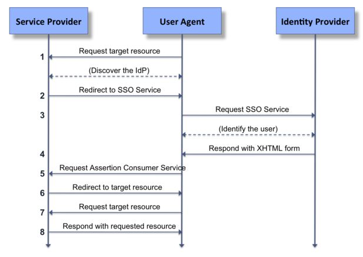
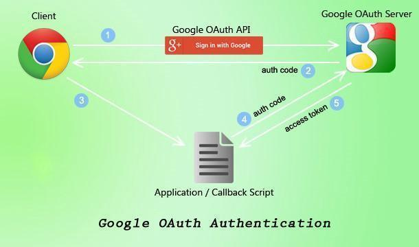
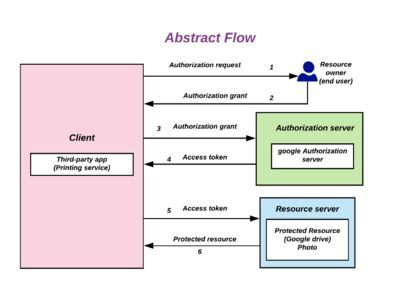
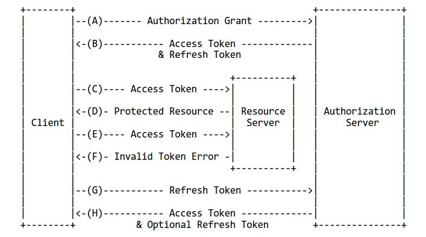
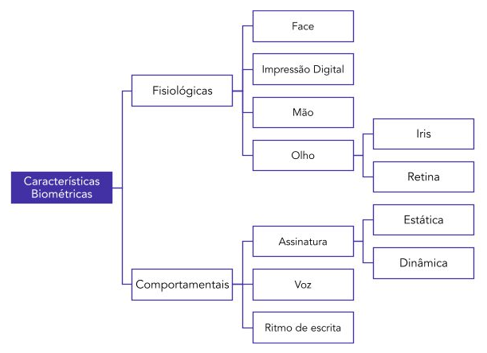

# Capítulo 2 – Autenticação e seus Mecanismos

Após estabelecermos os princípios fundamentais que regem a Segurança da Informação, adentramos agora em um de seus processos mais críticos e onipresentes: a **autenticação**. Se a segurança é a fortaleza que protege nossos dados, a autenticação é o portão de entrada e o guarda que exige a identificação correta. É o procedimento que valida a identidade de um usuário, garantindo que ele é quem realmente alega ser, antes de conceder-lhe acesso aos recursos protegidos. No nosso dia a dia, realizamos dezenas de processos de autenticação, muitas vezes sem perceber: ao desbloquear o celular com a digital, ao digitar a senha do e-mail ou ao inserir o cartão no caixa eletrônico. Neste capítulo, vamos dissecar os mecanismos que tornam esse processo possível, desde os fatores básicos de autenticação até as estratégias mais avançadas que combinam múltiplas camadas de verificação para criar uma defesa robusta e adaptativa.

## Os Fatores de Autenticação

Os mecanismos de autenticação, que são as rotinas e ferramentas utilizadas para implementar o princípio da autenticação, podem ser classificados em três grandes categorias, baseadas na natureza da "prova" que o usuário deve fornecer para validar sua identidade.

- **Algo que você sabe:** Nesta categoria, a autenticidade é determinada com base em uma informação que, teoricamente, é de conhecimento exclusivo do usuário. O exemplo clássico e mais difundido é a **senha**. Ao acessar a rede corporativa, o sistema assume que apenas o dono da conta conhece a combinação correta de usuário e senha. A segurança deste método depende inteiramente do sigilo dessa informação. Outros exemplos incluem códigos PIN (Número de Identificação Pessoal), frases secretas ou as respostas para "perguntas de segurança".
- **Algo que você tem:** Aqui, a autenticação é vinculada a um objeto físico que está sob a posse exclusiva do usuário. A identidade é comprovada pela apresentação deste item. Os exemplos mais comuns incluem:
    - **Tokens de segurança:** Pequenos dispositivos (geralmente em formato de chaveiro) que geram um código numérico único e temporário a cada poucos segundos.
    - **Smart Cards e Crachás:** Cartões com um chip embutido que, ao serem inseridos ou aproximados de um leitor, comprovam a identidade do portador.
    - **Celular:** O smartphone se tornou um dos principais fatores "algo que você tem", seja ao receber um código de verificação por SMS ou ao utilizar um aplicativo autenticador.
- **Algo que você é:** Esta categoria utiliza características biométricas, que são traços físicos ou comportamentais únicos e intrínsecos ao indivíduo. É, em regra, o mecanismo mais robusto para garantir a autenticidade, pois é extremamente difícil de ser fraudado ou transferido. É importante destacar que a biometria vai muito além da **impressão digital**. Outros exemplos incluem:
    - **Reconhecimento facial:** Utilizado para desbloquear smartphones e sistemas de controle de acesso.
    - **Leitura de íris ou retina:** Padrões oculares que oferecem altíssima precisão.
    - **Reconhecimento de voz:** Análise do padrão vocal único de uma pessoa.
    - **Geometria da mão:** Análise das dimensões e formato da mão.

## Os Pilares do Gerenciamento de Acesso (AAA)

O serviço de autenticação raramente atua de forma isolada. Ele é, na verdade, a primeira etapa de um processo mais amplo de gerenciamento de acesso, conhecido pelo acrônimo **AAA**, que representa três funções interdependentes e essenciais: **Autenticação, Autorização e Auditoria** (do inglês, _Authentication, Authorization, and Accounting_).

1. **Autenticação (_Authentication_):** Como já vimos, é o processo de verificar a identidade. Responde à pergunta: "**Quem é você?**".
2. **Autorização (_Authorization_):** Uma vez que o usuário está autenticado, a autorização é o processo que determina **o que ele pode fazer**. Corresponde à verificação das permissões e privilégios daquela identidade para decidir se ela pode ou não acessar um determinado recurso. Não basta ser um usuário válido; é preciso ter a permissão correta. Um exemplo clássico em sistemas de arquivos é ter permissão para ler o conteúdo de um diretório, mas não ter permissão para modificar ou criar novos arquivos nele.
3. **Auditoria (_Accounting_ ou Rastreabilidade):** Esta função é responsável por registrar as ações realizadas pelos usuários. Ela cria trilhas de auditoria (_logs_) que permitem rastrear quem fez o quê e quando. Responde à pergunta: "**O que você fez?**". Essa rastreabilidade é fundamental para a identificação de falhas, a investigação de incidentes de segurança e a responsabilização por atos indevidos.

## Fortalecendo a Autenticação: Do Fator Único ao Multifator

É um consenso na área de segurança que nenhum sistema é 100% infalível. O objetivo é sempre adicionar camadas de defesa para dificultar ao máximo a ação de um atacante. No contexto da autenticação, a dependência de um único fator, especialmente a senha ("algo que você sabe"), se mostrou insuficiente. Senhas podem ser adivinhadas, roubadas através de _phishing_ ou vazadas em incidentes de segurança.

Para mitigar esse risco, surgiu o conceito de **autenticação forte**, mais conhecida como **Autenticação de Dois Fatores (2FA)** ou **Duplo Fator de Autenticação**. Como o nome sugere, o processo é dividido em duas etapas, exigindo que o usuário forneça duas "provas" de sua identidade.

O ponto crucial, e frequentemente testado em provas, é que essas duas provas devem, obrigatoriamente, pertencer a **categorias diferentes** dos fatores de autenticação. A combinação deve ser de:

- Algo que você **sabe** + Algo que você **tem**
- Algo que você **sabe** + Algo que você **é**
- Algo que você **tem** + Algo que você **é**

**Atenção:** Exigir duas senhas, uma após a outra, **não é 2FA**, pois ambos os fatores pertencem à mesma categoria ("algo que você sabe").

O exemplo mais comum de 2FA no dia a dia combina "algo que você sabe" com "algo que você tem". Na primeira etapa, o usuário insere seu login e senha. Em seguida, o sistema exige uma segunda prova: um código aleatório e temporário (conhecido como OTP - _One-Time Password_) que é enviado para o celular do usuário (via SMS ou um aplicativo autenticador). Esse código funciona como uma chave de sessão, válida apenas para aquele acesso específico.

Dessa forma, mesmo que um atacante consiga roubar sua senha, ele não conseguirá acessar a conta, pois não terá acesso ao seu celular para obter o código da segunda etapa. Diversas aplicações modernas utilizam este recurso:

- **BB Code** do Banco do Brasil.
- **Steam Guard** para acesso a contas de jogos.
- **Google Authenticator** ou a verificação em duas etapas do **Gmail**.

Indo além, o conceito pode ser expandido para a **Autenticação Multifator (MFA)**, que segue o mesmo princípio, mas pode exigir dois ou mais fatores de autenticação, aumentando ainda mais o nível de segurança.

### Autenticação Multifator Adaptativa (MFA Adaptativa)

A MFA Adaptativa é uma evolução inteligente da autenticação multifator. Em vez de aplicar rigidamente os mesmos fatores para todos os logins, ela **ajusta dinamicamente os requisitos de autenticação com base no risco** percebido em cada tentativa de acesso. Ela analisa o contexto e o comportamento do usuário para decidir se uma simples senha é suficiente ou se uma verificação adicional é necessária.

A MFA adaptativa utiliza uma série de informações contextuais para avaliar o risco, incluindo:

1. **Localização:** A tentativa de login vem de um país ou cidade incomum?
2. **Dispositivo:** É o mesmo notebook ou celular que o usuário sempre utiliza?
3. **Horário:** O acesso está ocorrendo em um horário atípico para aquele usuário?
4. **Rede:** A conexão é de uma rede Wi-Fi pública e desconhecida ou da rede confiável da empresa?
5. **Comportamento:** Houve múltiplas tentativas de login falhadas recentemente?

Com base na análise desses parâmetros, o sistema pode tomar decisões inteligentes. Por exemplo, se um usuário tenta fazer o login de seu computador habitual, na rede de sua casa e em um horário normal, o sistema pode permitir o acesso apenas com a senha. No entanto, se o mesmo usuário tenta acessar a conta minutos depois de um endereço IP em outro continente, o sistema identificará o alto risco e exigirá uma verificação adicional robusta, como uma autenticação biométrica ou um código de um token físico, antes de liberar o acesso.

## Otimizando o Acesso: Single Sign-On (SSO)

À medida que o número de sistemas e aplicações que utilizamos no dia a dia cresce, gerenciar dezenas de senhas diferentes se torna uma tarefa insustentável e, paradoxalmente, um risco de segurança (pois leva à reutilização de senhas fracas). Para resolver esse problema, surgiu o conceito de **_Single Sign-On_** **(SSO)**, ou **Logon Único**.

A ideia fundamental do SSO é permitir que um usuário, após se autenticar uma única vez em um sistema central de identidade, possa acessar múltiplos sistemas, serviços e aplicações independentes sem a necessidade de digitar suas credenciais novamente.

Imagine o cenário de um dia de trabalho típico em uma corporação. Ao chegar, o funcionário liga seu computador e acessa sua máquina com um _login_ e senha. A partir desse momento, ele consegue abrir o sistema de ponto eletrônico, acessar seu e-mail corporativo, utilizar o sistema de gestão de projetos e consultar a intranet, tudo de forma transparente, sem ser interrompido a cada passo para inserir a mesma senha repetidamente. O SSO funciona como um "passaporte digital": uma vez validado na entrada, ele garante trânsito livre por todos os "territórios" (sistemas) autorizados.

É importante destacar que o SSO é um serviço que permite a integração entre sistemas que são, por natureza, independentes. A mágica acontece nos bastidores, onde um sistema de gerenciamento de identidades atua como uma autoridade central de confiança. Quando o usuário tenta acessar um novo serviço, este, em vez de pedir a senha ao usuário, "pergunta" ao sistema central se aquele usuário já está autenticado e se tem permissão para acessá-lo.

O principal protocolo que viabiliza o SSO em ambientes corporativos é o **LDAP (_Lightweight Directory Access Protocol_)**, que permite a comunicação com serviços de diretório, como o _Microsoft Active Directory_, onde as identidades e permissões dos usuários são gerenciadas de forma centralizada. Em aplicações web, uma implementação mais simples pode ser feita através do uso de **cookies** e _tokens_ de sessão compartilhados entre os domínios de uma mesma organização.

O conceito inverso também se aplica. Através do **_Single Sign-Off_**, ao encerrar a sessão em um dos sistemas (fazer _logoff_) ou no portal central, o usuário é automaticamente desconectado de todos os outros serviços que foram acessados através daquela sessão de SSO, garantindo que o acesso seja completamente revogado de forma segura.

Com certeza. Suas anotações sobre SAML são muito pertinentes e abordam um tema cada vez mais relevante. Vamos integrar e aprofundar esse conteúdo para dar sequência ao Capítulo 2, explicando o papel desse padrão na federação de identidades.

## Federação de Identidades e o Padrão SAML

À medida que os serviços digitais se tornaram mais complexos e interconectados, surgiu um novo desafio: como permitir que um usuário, autenticado em uma organização, acesse serviços de outra organização de forma segura e transparente? A solução para este problema é a **federação de identidades**, e o principal padrão que a viabiliza é o **SAML (_Security Assertion Markup Language_)**.

É fundamental destacar que o SAML não é uma tecnologia ou um software em si, mas sim um **padrão aberto** — um conjunto de regras e um formato de comunicação — que permite a troca segura de informações de autenticação e autorização entre diferentes domínios de segurança. Ele funciona como um "idioma" comum que permite que um sistema que gerencia identidades se comunique de forma confiável com um sistema que oferece serviços.

Nessa arquitetura, temos dois atores principais:

1. **Provedor de Identidade (IdP - _Identity Provider_):** É a entidade responsável por gerenciar e autenticar a identidade dos usuários. É ele quem guarda as senhas, verifica as credenciais e "afirma" que um usuário é quem ele diz ser.
2. **Provedor de Serviço (SP - _Service Provider_):** É a aplicação ou o serviço que o usuário deseja acessar. Ele não gerencia as senhas, mas confia na afirmação do Provedor de Identidade para conceder o acesso.

O SAML permite que o Provedor de Identidade passe credenciais de autorização (as "afirmações" ou _assertions_) para o Provedor de Serviço. Essa estrutura simplifica a implementação de _logins_ centralizados e unificados, sendo um dos pilares para o funcionamento do _Single Sign-On_ (SSO) entre organizações distintas.

### Exemplo Prático: A Plataforma Gov.br

Um excelente exemplo da aplicação desses conceitos é a plataforma **Gov.br**, do Governo Federal brasileiro. Antes de sua implementação, cada órgão público (Receita Federal, INSS, Detran) possuía seu próprio sistema de cadastro e autenticação, forçando o cidadão a criar e gerenciar dezenas de _logins_ e senhas diferentes.

A plataforma Gov.br atua como um **Provedor de Identidade (IdP)** centralizado. Ela unificou a gestão da identidade digital do cidadão. Uma vez que o usuário se autentica na plataforma Gov.br, esta pode comunicar a identidade validada aos diversos serviços do governo (os **Provedores de Serviço**). Cabe então a cada órgão definir quais permissões (autorização) aquele cidadão terá em seu sistema específico.

#### Níveis de Confiança: As Credenciais Bronze, Prata e Ouro

O Gov.br também ilustra perfeitamente como uma gestão de identidade federada pode operar com diferentes níveis de confiança. A plataforma classifica as contas dos usuários em três níveis — **Bronze, Prata e Ouro** —, baseados no rigor do processo de validação da identidade.

- **Nível Bronze:** É o nível de entrada. A identidade é validada através de informações cadastrais que o governo já possui (CPF, nome da mãe, data de nascimento, vínculos empregatícios). O usuário cria um _login_ e senha após responder a essas perguntas. A confiança é baseada em "algo que você sabe".
- **Nível Prata:** Aumenta o nível de confiança. A identidade é validada através de mecanismos mais fortes, como o reconhecimento facial para conferência com a foto da CNH ou o acesso via credenciais de um banco conveniado. A confiança aqui é baseada em uma verificação mais robusta.
- **Nível Ouro:** É o nível de máxima confiança. A identidade é validada por reconhecimento facial comparado com a base de dados biométricos da Justiça Eleitoral. A confiança é baseada em "algo que você é" (biometria).

Essa separação permite que os Provedores de Serviço (os órgãos) definam o nível de segurança exigido para cada serviço, com base em sua criticidade. Para consultar o andamento de um processo simples, uma conta de nível Bronze pode ser suficiente. No entanto, para realizar a declaração de Imposto de Renda pré-preenchida, um serviço de alta sensibilidade, é exigida uma conta de nível Ouro, garantindo um grau muito maior de certeza sobre a identidade do usuário.

### Os Papéis e o Fluxo de Comunicação SAML

Para que a federação de identidades funcione, o padrão SAML (atualmente em sua versão 2.0) define formalmente três papéis principais que interagem durante o processo de autenticação e autorização:

1. **_Principal:_** É o usuário final, tipicamente um ser humano, que busca acessar um recurso ou serviço.
2. **Provedor de Identidade (IdP - _Identity Provider_):** É a autoridade central responsável por autenticar o _Principal_. É o sistema que gerencia as credenciais (como _login_ e senha) e emite as "asserções" de segurança que atestam a identidade do usuário.
3. **Provedor de Serviço (SP - _Service Provider_):** É a aplicação ou o recurso que o _Principal_ deseja acessar. O SP não autentica o usuário diretamente, mas confia nas asserções emitidas pelo IdP para tomar decisões de autorização.

Em uma rotina de acesso, o fluxo de comunicação entre esses três papéis, mediado pelo navegador do usuário (chamado de **_User Agent_**), ocorre de forma orquestrada. O _Principal_ solicita acesso ao SP; o SP redireciona o _Principal_ para o IdP para que ele se autentique; e, por fim, o IdP envia uma confirmação de identidade de volta ao SP, que libera o acesso.

É crucial destacar que o padrão SAML **não especifica o método de autenticação** que o IdP deve utilizar. O Provedor de Identidade tem total autonomia para definir como validará a identidade do usuário. Pode ser um simples formulário de _login_ e senha, ou podem ser implementados mecanismos mais robustos, como a autenticação multifator (MFA). O IdP pode, inclusive, integrar-se a outros serviços de diretório, como o _Active Directory_ da Microsoft (via LDAP) ou um servidor RADIUS, para centralizar ainda mais a gestão de identidades. Essa flexibilidade é um dos pontos fortes do padrão.

#### Detalhando o Fluxo de Acesso

A imagem a seguir ilustra, de forma simplificada, a sequência de passos em um fluxo de SSO iniciado pelo Provedor de Serviço, que é o cenário mais comum.

Vamos detalhar cada etapa dessa comunicação:

1. **Requisição de Recurso:** O usuário (_Principal_), através de seu navegador (_User Agent_), tenta acessar um recurso protegido no site do Provedor de Serviço (SP).
2. **Redirecionamento para o SSO:** O SP verifica que o usuário não possui uma sessão ativa (não está autenticado) e o redireciona para o serviço de SSO do Provedor de Identidade (IdP). Essa requisição de redirecionamento contém informações sobre quem a está solicitando (o SP) e para onde o usuário deve retornar após a autenticação.
3. **Solicitação de Autenticação:** O navegador do usuário segue o redirecionamento e faz uma requisição ao IdP, solicitando a autenticação.
4. **Desafio de Autenticação:** O IdP apresenta ao usuário um desafio para que ele prove sua identidade. Isso é, comumente, um formulário de _login_ e senha, mas poderia ser qualquer método, como a solicitação de um segundo fator (MFA). O usuário então insere suas credenciais.
5. **Envio da Asserção SAML:** Após o usuário se autenticar com sucesso, o IdP gera uma **asserção SAML**. Este é um documento XML, assinado digitalmente, que contém os dados do usuário e a confirmação de que sua identidade foi validada. O IdP envia essa asserção para o navegador do usuário.
6. **Redirecionamento de Volta ao SP:** O navegador, de posse da asserção, é redirecionado de volta para o Provedor de Serviço.
7. **Validação da Asserção e Concessão de Acesso:** O navegador envia a asserção SAML para o SP. O SP, que confia no IdP, valida a assinatura digital do documento, extrai as informações do usuário, estabelece uma sessão local para ele e, finalmente, concede o acesso ao recurso originalmente solicitado.
8. **Resposta com o Recurso:** O SP entrega ao navegador o conteúdo do recurso que o usuário queria acessar desde o início.

Esse processo, embora pareça complexo, ocorre em poucos segundos e de forma transparente para o usuário, que tem a experiência de um _login_ único. É essa capacidade de federar identidades que permite o surgimento de ecossistemas de serviços integrados, onde a autenticação em um sistema central abre as portas para diversas outras aplicações, como veremos a seguir com o padrão OAuth.

## O Padrão OAuth: A Autorização Delegada

Enquanto o SAML é um padrão robusto focado primariamente em **autenticação** (provar quem o usuário é) em ambientes corporativos, o **OAuth** é um padrão aberto focado em **autorização** (definir o que uma aplicação pode fazer em nome do usuário). Embora frequentemente utilizado em fluxos de _login_, sua função essencial não é autenticar o usuário, mas sim permitir que um usuário conceda a uma aplicação de terceiros um acesso limitado e específico aos seus dados, que estão armazenados em outro serviço, sem precisar compartilhar sua senha.

Concebido em um esforço conjunto de empresas como Google e Twitter, o OAuth se tornou o padrão de fato para a autorização delegada na internet, viabilizando os familiares botões de "Entrar com o Google" ou "Conectar com o Facebook" que encontramos em inúmeros sites e aplicativos.

A imagem acima ilustra a experiência do usuário. Ao clicar no botão "Sign in with Google", o usuário está, na prática, iniciando um processo no qual ele autoriza a aplicação que está utilizando a trocar informações com os servidores da Google para acessar uma parte de seus dados.

O OAuth, atualmente em sua versão 2.0, define uma arquitetura com quatro papéis básicos para orquestrar esse processo de delegação de forma segura.

1. **_Resource Owner_** **(Dono do Recurso):** É o usuário final, a pessoa que possui os dados e que tem o poder de conceder ou negar o acesso a eles.
2. **_Client_** **(Cliente):** É a aplicação de terceiros que deseja acessar os dados do usuário. Pode ser um site, um aplicativo de celular ou um software de desktop.
3. **_Authorization Server_** **(Servidor de Autorização):** É o servidor que gerencia a identidade do usuário e emite os "tokens de acesso" após obter sua autorização. É ele quem apresenta a tela de _login_ e a tela de consentimento.
4. **_Resource Server_** **(Servidor de Recursos):** É o servidor que hospeda os dados protegidos do usuário (como o Google Photos, a API do Gmail ou a lista de contatos do Facebook) e que aceita e valida os tokens de acesso.

### O Fluxo de Concessão de Autorização

O processo de delegação do OAuth 2.0, conhecido como "fluxo de concessão", pode parecer complexo, mas segue uma lógica clara de solicitação e consentimento, como ilustra o diagrama a seguir.

Vamos detalhar cada etapa desse fluxo:

1. **Solicitação de Autorização:** A aplicação (_Client_) solicita autorização ao usuário (_Resource Owner_). Isso geralmente se manifesta como um redirecionamento do navegador para uma página do Servidor de Autorização (ex: Google), que exibe uma tela informando qual aplicação está pedindo acesso e a quais dados específicos ela deseja acessar (ex: "O Aplicativo X deseja ver seu nome, e-mail e foto de perfil").
2. **Concessão de Autorização:** O usuário, após se autenticar no Servidor de Autorização (se já não tiver uma sessão ativa), analisa as permissões solicitadas e concede a autorização, geralmente clicando em um botão "Permitir" ou "Autorizar".
3. **Envio da Concessão ao Servidor de Autorização:** A aplicação (_Client_) recebe do usuário um código de autorização temporário e o envia, de forma segura e em _background_, para o Servidor de Autorização.
4. **Emissão do Token de Acesso:** O Servidor de Autorização valida o código recebido e, se tudo estiver correto, emite um **Token de Acesso (_Access Token_)** para a aplicação. Este token é a chave que comprova a autorização concedida pelo usuário. Geralmente, ele é um **_Bearer Token_**, o que significa que qualquer sistema que o "porte" (do inglês, _to bear_) pode utilizá-lo para acessar os recursos.
5. **Requisição ao Servidor de Recursos:** De posse do Token de Acesso, a aplicação (_Client_) pode agora fazer requisições ao Servidor de Recursos (ex: a API do Google Drive), incluindo o token no cabeçalho da requisição para provar que tem a permissão do usuário.
6. **Retorno do Recurso Protegido:** O Servidor de Recursos valida o token junto ao Servidor de Autorização e, se for válido, retorna os dados solicitados para a aplicação (_Client_). É nesta etapa que a aplicação consegue, por exemplo, exibir a foto de perfil do usuário, importar seus contatos ou salvar um arquivo em seu Google Drive.

É fundamental ressaltar que todo esse tráfego, especialmente a transmissão do _Bearer Token_, deve ocorrer obrigatoriamente sobre uma conexão segura **HTTPS**. Como o token é a credencial de acesso, se ele for interceptado, um atacante poderia utilizá-lo para acessar os dados do usuário. O HTTPS garante que toda a comunicação seja criptografada, protegendo o token durante seu trânsito.

### Detalhes Técnicos do OAuth 2.0

Para além do fluxo conceitual, a implementação do OAuth 2.0 envolve uma série de especificações técnicas que definem os tipos de aplicações, os formatos dos tokens e os mecanismos para a renovação do acesso. Compreender esses detalhes é fundamental para entender a segurança e a flexibilidade do padrão.

#### Tipos de Clientes: Confidencial vs. Público

O padrão OAuth 2.0 diferencia as aplicações (_Clients_) em duas categorias, com base em sua capacidade de manter um segredo em sigilo:

- **Clientes Confidenciais (_Confidential Clients_):** São aplicações capazes de manter a confidencialidade de suas credenciais, especialmente o `client_secret` (uma espécie de senha da aplicação). Tipicamente, são aplicações que executam em um servidor seguro (_backend_), como uma aplicação web tradicional. Como o código e as credenciais residem em um ambiente controlado pelo desenvolvedor, e não no navegador do usuário, o `client_secret` pode ser armazenado e utilizado com segurança.
- **Clientes Públicos (_Public Clients_):** São aplicações que, por sua natureza, não conseguem garantir o sigilo de um `client_secret`. Os exemplos mais comuns são aplicações que rodam inteiramente no navegador (_Single-Page Applications - SPAs_) ou aplicativos móveis. Como todo o código da aplicação é distribuído e executado no dispositivo do usuário, qualquer segredo embutido nele poderia ser extraído por um usuário mal-intencionado. Por essa razão, o fluxo de autorização para clientes públicos não depende de um `client_secret`.

#### Os Diferentes Tipos de Tokens

A comunicação no OAuth é orquestrada por diferentes tipos de tokens, cada um com uma finalidade específica.

- **_Bearer Tokens:_** É o tipo mais comum de _Access Token_. Como o nome sugere, qualquer entidade que "porte" (_to bear_) este token pode usá-lo para acessar os recursos protegidos, de forma análoga a um ingresso de cinema ou a um vale-transporte. A grande vantagem é a simplicidade, mas também representa seu principal ponto de atenção: se um _Bearer Token_ for roubado (por exemplo, através da interceptação de tráfego não criptografado), o atacante pode utilizá-lo para se passar pela aplicação legítima.
- **_Sender-Constrained Tokens:_** Para mitigar o risco de roubo dos _Bearer Tokens_, foram criados os _Sender-Constrained Tokens_. Estes tokens são criptograficamente "amarrados" ao cliente que os solicitou, geralmente através de um certificado TLS mútuo. Na prática, o token contém uma "impressão digital" do certificado do cliente. Para utilizá-lo, o cliente deve não apenas apresentar o token, mas também provar que possui a chave privada correspondente ao certificado. Isso garante que, mesmo que o token seja roubado, ele será inútil para o atacante.
- **_ID Tokens:_** Este tipo de token não é usado para acessar recursos, mas para fornecer informações sobre a **identidade** do usuário autenticado. Ele é o pilar de um padrão chamado **OpenID Connect (OIDC)**, que funciona como uma camada de identidade sobre o OAuth 2.0. Enquanto o _Access Token_ responde à pergunta "O que esta aplicação pode fazer?", o _ID Token_ responde à pergunta "Quem é o usuário que autorizou esta aplicação?".
- **_Refresh Tokens:_** São credenciais especiais utilizadas para obter um novo _Access Token_ sem que o usuário precise se autenticar novamente. Dada a sua importância, vamos detalhá-los a seguir.

#### _Refresh Tokens_

Os _Access Tokens_ são, por design, de curta duração. Um token pode expirar em uma hora, ou até mesmo em poucos minutos, para limitar o dano caso ele seja comprometido. No entanto, forçar o usuário a fazer _login_ a cada hora seria uma péssima experiência de uso. É para resolver este dilema que existe o **_Refresh Token_**.

Um _Refresh Token_ é uma credencial de longa duração, emitida junto com o _Access Token_ durante a autorização inicial. Sua única finalidade é ser trocada por um novo _Access Token_ quando o antigo expirar.

O fluxo de renovação é o seguinte:

1. A aplicação (_Client_) recebe um `access_token` (de curta duração) e um `refresh_token` (de longa duração).
2. A aplicação utiliza o `access_token` para fazer chamadas à API e acessar os recursos protegidos.
3. Após um tempo, o `access_token` expira. A próxima tentativa de usá-lo resultará em um erro de "token inválido".
4. Nesse momento, em vez de pedir ao usuário para fazer _login_ novamente, a aplicação utiliza o `refresh_token` para fazer uma requisição, em _background_ e de forma silenciosa, ao Servidor de Autorização.
5. O Servidor de Autorização valida o `refresh_token` e, se estiver tudo correto, emite um **novo** `access_token` (e, opcionalmente, um novo `refresh_token`) para a aplicação.
6. A aplicação pode, então, continuar a acessar os recursos protegidos com o novo token, de forma transparente para o usuário.

A imagem a seguir, extraída da documentação oficial do OAuth, ilustra essa dinâmica:

Analisando o fluxo:

- **(A) e (B):** A aplicação (_Client_) obtém a concessão de autorização e recebe o `Access Token` e o `Refresh Token` iniciais.
- **(C) e (D):** A aplicação usa o `Access Token` com sucesso para acessar um recurso protegido no _Resource Server_.
- **(E) e (F):** Após um tempo, o `Access Token` expira. A aplicação tenta usá-lo novamente, mas o _Resource Server_ retorna um erro de "Token Inválido".
- **(G) e (H):** A aplicação, percebendo que o token expirou, usa o `Refresh Token` para fazer uma requisição ao _Authorization Server_, que responde com um novo `Access Token`, permitindo que o acesso continue.

Por ser uma credencial de longa duração e de alto poder, o _Refresh Token_ deve ser armazenado com o máximo de segurança pela aplicação. Seu vazamento pode permitir que um atacante mantenha um acesso persistente à conta do usuário.

#### Boas Práticas e Gerenciamento de Tokens

A segurança e a eficácia de um sistema baseado em OAuth 2.0 dependem diretamente de como os tokens são gerados, transmitidos e validados. Embora o padrão defina os fluxos, a implementação desses tokens — geralmente utilizando o padrão **JWT (_JSON Web Token_)** — exige a adesão a um conjunto de boas práticas para garantir a robustez do sistema. A seguir, detalhamos essas práticas em três áreas distintas: segurança, configuração e manipulação.

##### Boas Práticas de Segurança para JWT

Esta seção foca nos controles essenciais para proteger os tokens contra adulteração, interceptação e uso indevido.

1. **Use Algoritmos Seguros:** A assinatura digital é o que garante a integridade do token. É fundamental preferir algoritmos criptográficos fortes, como o **RS256** (assimétrico, com par de chaves pública/privada), em vez de algoritmos mais simples como o HS256 (simétrico). O uso de algoritmos assimétricos permite que o Servidor de Recursos valide o token sem precisar conhecer a chave secreta de assinatura, aumentando a segurança.
2. **Mantenha as Chaves Secretas Seguras:** A chave privada usada para assinar os tokens é o segredo mais crítico do sistema de autorização. Ela jamais deve ser exposta no código-fonte. O armazenamento deve ser feito em locais seguros, como gerenciadores de segredos (_secret managers_), cofres de nuvem ou, no mínimo, em variáveis de ambiente protegidas no servidor.
3. **Defina um Tempo de Expiração Curto:** Todo _Access Token_ deve ter um tempo de vida curto, configurado através da _claim_ `exp` (_expiration_). Geralmente, esse tempo varia de minutos a, no máximo, uma hora. Isso minimiza drasticamente a janela de oportunidade para um atacante utilizar um token que tenha sido comprometido.
4. **Implemente a Revogação de Tokens:** É preciso ter um mecanismo para invalidar um token antes de sua expiração natural (por exemplo, quando um usuário faz _logoff_). Uma abordagem comum é manter uma "lista de negação" (_denylist_) de tokens revogados que o servidor consulta a cada requisição.
5. **Valide os Tokens no Servidor:** Toda vez que um token é recebido, o servidor de recursos deve, obrigatoriamente, realizar uma validação completa. Isso inclui verificar a validade da assinatura digital e todas as _claims_ relevantes (como `exp`, `iss`, `aud`) antes de confiar em seu conteúdo.
6. **Use HTTPS:** A transmissão de tokens, especialmente os _Bearer Tokens_, deve ocorrer **exclusivamente** sobre um canal criptografado (HTTPS). Isso é inegociável, pois impede que ataques de interceptação (_Man-in-the-Middle_) capturem o token em trânsito.
7. **Minimize as _Claims_:** Um token deve carregar apenas as informações estritamente necessárias para o processo de autorização (como o ID do usuário e suas permissões). Dados sensíveis ou informações de identificação pessoal (PII) devem ser evitados para reduzir o risco em caso de vazamento.
8. **Verifique a Origem do Token:** Sempre valide a _claim_ `iss` (_issuer_) para garantir que o token foi emitido por um Servidor de Autorização confiável e esperado pela sua aplicação.

##### Boas Práticas de Configuração para JWT

Esta seção aborda as diretrizes para a correta configuração e estruturação dos tokens, visando a interoperabilidade e a manutenibilidade.

1. **Configuração de _Claims_:** Utilize as _claims_ registradas pelo padrão para garantir que seu token seja compreendido por diferentes sistemas. As essenciais são: `iss` (_issuer_ - quem emitiu), `sub` (_subject_ - o ID do usuário), `aud` (_audience_ - para quem o token se destina) e `exp` (_expiration time_ - quando o token expira).
2. **Uso de Bibliotecas Confiáveis:** A implementação de criptografia é complexa. Em vez de criar sua própria biblioteca, utilize sempre soluções de código aberto que sejam amplamente conhecidas, bem mantidas e auditadas pela comunidade de segurança. Isso evita a introdução de falhas de implementação que poderiam comprometer todo o sistema.
3. **Rotação de Chaves:** Implemente uma política para rotacionar (trocar) periodicamente as chaves de assinatura. Esta é uma medida proativa que limita o impacto a longo prazo caso uma chave secreta seja eventualmente comprometida.
4. **Defina Escopo e Permissões:** Utilize a _claim_ `scope` para definir de forma granular o que o token está autorizado a fazer, seguindo o Princípio do Menor Privilégio. Em vez de um token genérico de "acesso total", crie escopos como "ler_perfil", "escrever_arquivos", etc.
5. **Monitore e Mantenha _Logs_:** Registre e monitore eventos importantes relacionados aos tokens, como sua emissão, falhas de validação e tentativas de uso de tokens expirados. Esses _logs_ são fundamentais para a detecção de atividades suspeitas e para a resposta a incidentes.
6. **Estabeleça uma Política de Renovação de Tokens:** Defina claramente como e quando os tokens devem ser renovados. Essa política deve equilibrar a segurança (tokens de curta duração) e a experiência do usuário (renovação transparente), geralmente através do uso de _Refresh Tokens_.

##### Manipulação de Tokens _Stateless_ de Curta Duração

A estratégia mais moderna e segura para o gerenciamento de tokens combina os conceitos que vimos, focando em tokens _stateless_ (sem estado) e de vida curta.

1. **Use Tokens de Curta Duração:** Priorize o uso de _Access Tokens_ com um tempo de vida muito curto. Eles são ideais para aplicações _stateless_, onde o servidor não precisa manter informações sobre a sessão do cliente entre as requisições.
2. **Implemente um Mecanismo de Renovação:** Para que o usuário não precise se autenticar a cada poucos minutos, a aplicação deve ter um mecanismo para renovar o _Access Token_ antes que ele expire, de forma transparente.
3. **Utilize _Refresh Tokens_:** A renovação é feita utilizando um _Refresh Token_. Este token, de longa duração, é enviado ao Servidor de Autorização para obter um novo _Access Token_ de curta duração, sem a necessidade de uma nova interação do usuário.
4. **Verifique a Expiração:** O servidor de recursos deve, em toda requisição, verificar a _claim_ de expiração (`exp`) do _Access Token_ e rejeitar imediatamente qualquer token que já tenha expirado.
5. **Aproveite o Desempenho e a Escalabilidade:** A natureza _stateless_ dos JWTs significa que o servidor não precisa consultar um banco de dados de sessões para validar um token. A validação é feita apenas com a chave de assinatura. Isso torna o processo extremamente rápido e facilita a escalabilidade horizontal da aplicação.

## Biometria: A Identidade como Chave

Dentre os fatores de autenticação, a biometria representa a abordagem mais intrinsecamente ligada ao indivíduo. A própria etimologia da palavra já nos revela seu conceito: **BIO** (vida) + **METRIA** (medida). A biometria é, portanto, a ciência e a tecnologia de medir e analisar características biológicas para fins de identificação. Em termos de segurança, é a forma de reconhecer de maneira única um indivíduo por meio de suas características **fisiológicas** (a estrutura de seu corpo) ou **comportamentais** (seus padrões de ação).

Embora pareça uma tecnologia futurista, seus fundamentos científicos são antigos. O antropólogo inglês **Francis Galton** é considerado um dos pioneiros da biometria moderna. Em 1892, a partir de seus estudos sobre traços genéticos e hereditariedade, Galton desenvolveu o primeiro sistema robusto para a classificação de **impressões digitais**, um método que foi rapidamente adotado por departamentos de polícia ao redor do mundo e que, até hoje, é um dos mais conhecidos.

No contexto da segurança da informação, a biometria é a materialização do fator "algo que você é", sendo utilizada para implementar um controle de acesso extremamente seguro, pois, diferentemente de uma senha, uma característica biométrica não pode ser esquecida, perdida ou, em teoria, facilmente roubada.

### Classificação das Técnicas Biométricas

As diversas técnicas de biometria podem ser divididas em duas grandes categorias, conforme ilustra o diagrama a seguir.

1. **Características Fisiológicas:** Referem-se a traços relacionados à estrutura física do corpo, que são relativamente estáveis ao longo do tempo.
    - **Impressão Digital:** Analisa os padrões únicos formados pelas cristas e vales na ponta dos dedos. É a tecnologia biométrica mais difundida e utilizada no mundo.
    - **Reconhecimento Facial:** Mapeia as características únicas do rosto de uma pessoa, como a distância entre os olhos, o formato do nariz e o contorno da mandíbula, criando uma "assinatura facial".
    - **Geometria da Mão:** Mede e analisa as dimensões da mão e dos dedos.
    - **Reconhecimento Ocular:** Esta técnica se divide em duas abordagens distintas:
        - **Íris:** Analisa o padrão complexo e aleatório dos anéis coloridos que circundam a pupila. O processo é rápido, feito com uma câmera de alta resolução, e oferece um nível de precisão altíssimo.
        - **Retina:** Mapeia o padrão único dos vasos sanguíneos no fundo do olho. É ainda mais precisa que a leitura de íris, mas o processo é mais invasivo, exigindo que o usuário olhe fixamente para um ponto de luz.

2. **Características Comportamentais:** Referem-se a traços relacionados a padrões de comportamento e ação, que são aprendidos e desenvolvidos ao longo do tempo.
    - **Reconhecimento de Voz:** Analisa as características acústicas da fala, que são determinadas tanto pela fisiologia (formato do trato vocal) quanto pelo comportamento (ritmo, sotaque).
    - **Dinâmica da Assinatura:** Não analisa a aparência estática da assinatura, mas sim o **ato de assinar**. Sensores capturam a velocidade, a pressão, a aceleração e o ritmo dos traços, criando um perfil comportamental único.
    - **Ritmo de Escrita (_Keystroke Dynamics_):** Analisa o padrão e o ritmo com que uma pessoa digita em um teclado, medindo o tempo entre as teclas pressionadas e a duração de cada pressionamento. É uma técnica que pode ser usada para autenticação contínua.

### Princípios de um Traço Biométrico Ideal

Para que uma característica biológica seja considerada eficaz para fins de identificação, ela deve atender a um conjunto de princípios:

1. **Universalidade:** Todas as pessoas devem possuir a característica. (Ex: a maioria das pessoas possui impressões digitais).
2. **Singularidade:** A característica deve ser suficientemente diferente entre dois indivíduos, garantindo que não haja duplicidade. (Ex: o padrão da íris é único para cada pessoa).
3. **Permanência:** A característica não deve mudar significativamente ao longo do tempo. (Ex: as impressões digitais são formadas no útero e permanecem as mesmas por toda a vida).
4. **Mensurabilidade:** A característica deve poder ser capturada e medida quantitativamente por um dispositivo.

### O Funcionamento de um Sistema Biométrico

Um sistema biométrico opera em um ciclo que envolve quatro etapas principais:

1. **Cadastro (_Enrollment_):** É o primeiro passo. O usuário apresenta sua característica biométrica a um sensor pela primeira vez. O sistema captura a amostra, extrai seus pontos únicos e cria um **template** (um modelo matemático), que é armazenado de forma segura em uma base de dados.
2. **Captura:** Em um momento posterior de autenticação, o usuário apresenta novamente sua característica ao sensor (ex: coloca o dedo no leitor).
3. **Extração:** O sistema processa a amostra recém-capturada e extrai seus pontos únicos, criando um novo _template_ temporário.
4. **Comparação:** O _template_ temporário é comparado com o _template_ original, armazenado no banco de dados. Se a correspondência (_match_) estiver dentro de uma margem de tolerância aceitável, a identidade do usuário é validada com sucesso.

