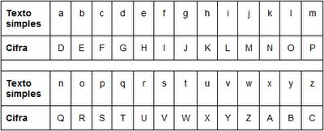
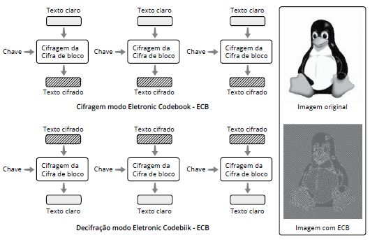
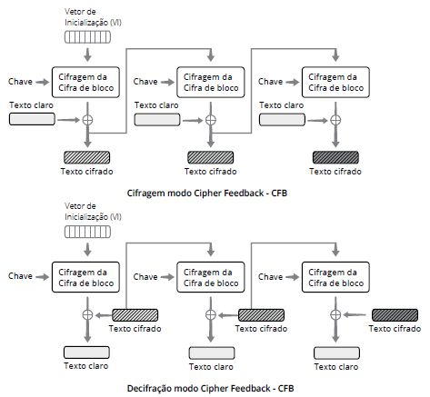

# Capítulo 3 – Criptografia

Nos capítulos anteriores, estabelecemos que a informação é o ativo mais valioso de qualquer organização e que um dos pilares para sua proteção é o princípio da **confidencialidade**. Garantir que dados sensíveis sejam acessíveis apenas por entidades autorizadas é um desafio que acompanha a humanidade desde que a comunicação existe. Diante desse cenário, historicamente, sempre se buscou criar formas de "esconder" a informação de terceiros, de modo que, mesmo que um adversário interceptasse uma mensagem, ele não seria capaz de compreendê-la. Essa necessidade ancestral deu origem a uma das ciências mais fascinantes e cruciais da segurança da informação: a **criptografia**. Ela é a principal ferramenta que utilizamos para transformar dados legíveis e vulneráveis em informações codificadas e seguras, sendo a espinha dorsal da privacidade no mundo digital, desde uma simples troca de mensagens até as mais complexas transações financeiras.

## Criptografia: A Ciência da Escrita Oculta

A criptografia é a ciência e a arte de transformar uma informação (chamada de **texto plano** ou _plaintext_) em um formato codificado e aparentemente ininteligível (chamado de **texto cifrado** ou _ciphertext_), de forma que apenas o destinatário legítimo, de posse de uma "chave" secreta, consiga reverter o processo e ler a mensagem original. O objetivo é "embaralhar" os dados de maneira controlada, garantindo que, mesmo que um atacante obtenha acesso a eles, não será capaz de extrair seu significado.

O próprio termo "criptografia" revela sua essência. Ele vem da junção de duas palavras gregas: **Kryptós**, que significa "oculto", e **grápho**, que significa "escrita". A criptografia é, em sua origem, a "escrita oculta". Para compreender este universo, é fundamental dominar alguns termos que formam a base de seu estudo:

- **Criptografia:** Como vimos, é a ciência de codificar mensagens para garantir sua confidencialidade e integridade.
- **Criptoanálise:** É a ciência (ou a arte) de "quebrar" códigos e decifrar mensagens sem o conhecimento da chave. A partir da análise (_análysis_, em grego, que significa "decomposição") do texto cifrado, o criptoanalista busca encontrar falhas no método de cifragem para revelar a informação oculta.
- **Criptologia:** É o campo de estudo (_logo_, em grego) mais amplo, que agrega tanto a criptografia quanto a criptoanálise. É o estudo completo da comunicação segura.
- **Cifra (ou Algoritmo Criptográfico):** É o método, o conjunto de passos ou a função matemática utilizada para codificar e decodificar a informação.

A combinação de diferentes métodos de cifragem com fórmulas e funções matemáticas complexas gera os algoritmos de criptografia modernos que protegem nossa vida digital. No entanto, em sua base, esses algoritmos derivam de três técnicas de cifragem clássicas: substituição, transposição e esteganografia.

Com certeza. Retomando o ponto em que paramos, vamos agora detalhar os métodos clássicos de cifragem, utilizando e expandindo suas anotações para cada uma das técnicas.

### Métodos Clássicos de Cifragem

Na base de todos os algoritmos criptográficos modernos, encontramos princípios que foram desenvolvidos e refinados ao longo de séculos. As técnicas clássicas de cifragem podem ser divididas em três grandes categorias, baseadas na forma como manipulam a mensagem original para ocultar seu conteúdo.

#### Cifra de Substituição

A substituição é o método de codificação mais intuitivo. Sua lógica consiste em **substituir** cada caractere, símbolo ou unidade de dado do texto plano por outro, de acordo com uma regra ou um alfabeto secreto. Embora seja um método simples de executar, sua segurança é geralmente baixa, tornando-o mais fácil de ser quebrado por técnicas de criptoanálise.

O exemplo mais famoso desta categoria é a **Cifra de César**, um método supostamente utilizado por Júlio César para proteger suas comunicações militares. Trata-se de uma **cifra de substituição monoalfabética**, na qual a regra é extremamente simples: cada letra da mensagem original é substituída pela letra que se encontra um número fixo de posições à frente no alfabeto. Na versão clássica, esse deslocamento (a "chave") é de três posições.

A tabela a seguir ilustra a aplicação da Cifra de César com um deslocamento de 3 letras:

Seguindo essa regra, a letra 'a' do texto simples se torna 'D' no texto cifrado, 'b' se torna 'E', e assim por diante. Ao chegar ao fim do alfabeto, a contagem continua a partir do início (um processo chamado de operação de módulo).

Vamos aplicar essa cifra a um exemplo prático. Para garantir a codificação, caracteres especiais e acentos são geralmente removidos ou normalizados.

- **Mensagem Original:** `atacar hoje a noite`
- **Mensagem Cifrada:** `DWDFDU KRMH D QRLWH`

A aparente simplicidade, no entanto, é a maior fraqueza deste método. Um criptoanalista pode quebrar a Cifra de César com extrema facilidade, testando os 25 deslocamentos possíveis (ataque de força bruta) ou, de forma mais inteligente, através da **análise de frequência**. Em qualquer idioma, certas letras aparecem com muito mais frequência do que outras (em português, as vogais 'a' e 'e' são as mais comuns). Ao contar a frequência das letras no texto cifrado, o analista pode deduzir qual letra cifrada corresponde a 'a' ou 'e' e, a partir daí, descobrir a chave de deslocamento.

#### Cifra de Transposição

Diferentemente da substituição, a cifra de transposição não altera os caracteres do texto plano. Em vez disso, ela **rearranja** a ordem deles, embaralhando a mensagem de acordo com uma regra específica. Nenhum caractere é adicionado ou removido; a segurança reside na complexidade do embaralhamento.

Os algoritmos de criptografia modernos frequentemente utilizam este recurso, dividindo a mensagem original em blocos de tamanhos iguais e permutando seus bits. Um exemplo clássico e simples para ilustrar o conceito é a **cifra de transposição de colunas**.

Neste método, utiliza-se uma palavra-chave para definir a ordem de embaralhamento. Vamos cifrar a mensagem `ATACAR AO AMANHECER` usando a chave `SEGURANCA`:

1. Primeiro, escrevemos a mensagem em uma grade sob a palavra-chave.
2. Em seguida, lemos as colunas na ordem alfabética da chave (`A`, `C`, `E`, `G`, `N`, `R`, `S`, `U`).

|**S**|**E**|**G**|**U**|**R**|**A**|**N**|**C**|**A**|
|---|---|---|---|---|---|---|---|---|
|A|T|A|C|A|R|A|O|A|
|M|A|N|H|E|C|E|R|X|

Lendo as colunas na ordem alfabética da chave (`A`, `C`, `E`, etc.), o texto cifrado seria: `RCA ORA TAE CM ANH AE`. Perceba que não há letras ou sílabas novas; apenas as originais foram reordenadas.

#### Esteganografia

Por último, temos a esteganografia, uma técnica que se diferencia fundamentalmente da criptografia. Enquanto a criptografia busca ocultar o **conteúdo** de uma mensagem, a esteganografia tem como objetivo ocultar a **própria existência** da mensagem.

A informação secreta é embutida dentro de um arquivo de cobertura de aparência inofensiva. Tipicamente, busca-se esconder uma mensagem de texto dentro do código de uma imagem digital. Isso é feito através de algoritmos que realizam alterações minúsculas e imperceptíveis nos dados do arquivo de cobertura. Em uma imagem, por exemplo, a cor de cada pixel é representada por um conjunto de bits. A técnica de **LSB (_Least Significant Bit_)** altera o bit menos significativo de alguns pixels para codificar a mensagem secreta. A mudança na cor é tão sutil que é indetectável ao olho humano, mas pode ser extraída por um software que conheça o método.

A esteganografia não se limita a imagens. Uma mensagem pode ser escondida em arquivos de áudio, vídeo ou até mesmo em um texto comum, através de sutis alterações na formatação ou no espaçamento. É comum que a esteganografia seja usada em conjunto com a criptografia: primeiro, a mensagem é cifrada para proteger seu conteúdo e, em seguida, o texto cifrado é escondido em outro arquivo para ocultar o fato de que uma comunicação secreta está ocorrendo.

Com certeza. Suas anotações sobre Cifragem de Bloco e o modo ECB são o ponto de partida perfeito para entrarmos no universo da criptografia moderna. Vamos detalhar esses conceitos, explicando o propósito dos modos de operação e aprofundando a análise do ECB.

## Criptografia Moderna: Cifras de Bloco e seus Modos de Operação

As cifras clássicas que estudamos, como a de César, operam diretamente sobre os caracteres da mensagem. A criptografia moderna, por sua vez, opera sobre os dados em seu formato binário (bits) e utiliza algoritmos matemáticos muito mais complexos. Uma das abordagens mais fundamentais é a **cifragem de bloco** (_block cipher_).

Como o nome sugere, a ideia central é quebrar a mensagem a ser enviada em **blocos de tamanho fixo** (por exemplo, 128 bits) e aplicar as operações matemáticas do algoritmo de criptografia a cada um desses blocos. Um algoritmo como o AES (_Advanced Encryption Standard_), por exemplo, é um especialista em cifrar um único bloco de 128 bits.

Mas como utilizar esse algoritmo para cifrar uma mensagem de tamanho arbitrário, como um e-mail de vários kilobytes? É para resolver essa questão que existem os **modos de operação**. Um modo de operação é uma "receita" ou um protocolo que define como aplicar repetidamente a cifragem de um único bloco para criptografar uma sequência de blocos de forma segura.

É crucial entender que, em regra, todos os modos de operação buscam garantir o princípio da **confidencialidade**. No entanto, alguns modos mais avançados são capazes de oferecer garantias adicionais de **autenticidade** e **integridade**. Não se pode, portanto, generalizar e afirmar que a cifragem de bloco, por si só, garante todos os princípios da segurança. A robustez da proteção depende fundamentalmente do modo de operação escolhido.

### Electronic Codebook (ECB)

O _Electronic Codebook_ (ECB) é o modo de operação mais simples e intuitivo para uma cifra de bloco. Sua lógica é direta: cada bloco de texto claro é cifrado de forma **completamente independente** dos outros, utilizando sempre a mesma chave de criptografia. O texto cifrado final é simplesmente a concatenação de todos os blocos cifrados.

Como o diagrama ilustra, o processo é análogo a ter um "livro de códigos" eletrônico. Para cada bloco de texto claro de entrada, existe um bloco de texto cifrado correspondente na saída, e essa relação é sempre a mesma enquanto a chave não mudar.

#### A Grande Falha de Segurança do ECB

A simplicidade do ECB é também sua maior fraqueza. Como cada bloco é cifrado de forma independente e com a mesma chave, **blocos de texto claro idênticos sempre produzirão blocos de texto cifrado idênticos**. Essa característica faz com que o ECB não consiga esconder os padrões presentes nos dados originais, vazando informações estruturais importantes para um criptoanalista.

A imagem do pinguim no diagrama é o exemplo mais famoso para ilustrar essa falha. Uma imagem digital é composta por muitos blocos de dados repetidos (por exemplo, a cor preta do fundo ou a cor branca da barriga). Ao cifrar a imagem com o modo ECB, todos os blocos pretos se tornam um mesmo bloco cifrado de uma cor, todos os blocos brancos se tornam um mesmo bloco cifrado de outra cor, e assim por diante. O resultado é que, embora as cores tenham mudado, o contorno e a estrutura da imagem original permanecem perfeitamente visíveis. A confidencialidade foi, na prática, quebrada.

Por essa razão, o modo ECB **não é considerado seguro** para a maioria das aplicações e seu uso é fortemente desaconselhado para criptografar qualquer dado que possa conter padrões, como textos, imagens, ou arquivos estruturados. Seu uso seguro se restringe a cenários muito específicos, como a transmissão de um valor único e aleatório que não seja maior que um bloco (como a cifra de uma outra chave criptográfica).

#### Vantagens do ECB

Apesar de suas graves falhas de segurança, o modo ECB possui duas vantagens operacionais:

- **Paralelismo:** Como cada bloco é independente, é possível cifrar ou decifrar múltiplos blocos ao mesmo tempo, em paralelo, o que pode resultar em um melhor desempenho em sistemas com múltiplos processadores.
- **Tolerância a Erros:** Um erro de bit em um determinado bloco de texto cifrado, causado por uma falha de transmissão, por exemplo, afetará apenas a decifragem daquele bloco específico. Os demais blocos da mensagem serão decifrados corretamente.

### Cipher Block Chaining (CBC)

Para superar a grave falha de segurança do modo ECB, foi desenvolvido o **Cipher Block Chaining (CBC)**. Como o próprio nome sugere, este modo de operação cria um "encadeamento" entre os blocos, fazendo com que a cifragem de cada bloco dependa do resultado da cifragem do bloco anterior. Essa dependência elimina a vulnerabilidade de padrões repetidos, tornando o CBC uma opção drasticamente mais segura e, por muitos anos, o modo de operação mais utilizado em diversas aplicações e protocolos.

O mecanismo central que cria essa dependência é a operação matemática **XOR** (representada no diagrama pelo símbolo ⊕, um círculo em volta do sinal de "+"). Antes de cada bloco de texto claro ser cifrado, ele é primeiro "misturado" com o bloco de texto cifrado imediatamente anterior através do XOR.

#### O Fluxo de Cifragem e o Vetor de Inicialização (VI)

Observando o diagrama, o processo de cifragem em CBC ocorre da seguinte forma:

1. **O Primeiro Bloco:** Para o primeiro bloco de texto claro, não existe um "bloco cifrado anterior" para ser usado na operação XOR. Para resolver isso, utiliza-se um bloco de dados aleatório chamado **Vetor de Inicialização (VI)**, ou _Initialization Vector_ (IV). Este VI é combinado com o primeiro bloco de texto claro via XOR.
2. O resultado da operação XOR é então cifrado com a chave, produzindo o primeiro bloco de texto cifrado.
3. **O Encadeamento:** A partir do segundo bloco, o processo se repete, mas em vez do VI, utiliza-se o **bloco de texto cifrado anterior**. O segundo bloco de texto claro é combinado via XOR com o primeiro bloco de texto cifrado. O resultado é então cifrado com a chave para produzir o segundo bloco de texto cifrado, e assim por diante.

O Vetor de Inicialização é crucial para a segurança do CBC. Ele garante que, mesmo que a mesma mensagem seja cifrada duas vezes com a mesma chave, os textos cifrados resultantes serão completamente diferentes, pois um VI novo e aleatório será gerado para cada operação de cifragem.

O resultado, como mostra a imagem do pinguim cifrado com CBC, é um ruído estatisticamente aleatório, onde nenhum padrão da imagem original pode ser discernido.

#### Vantagens e Desvantagens do CBC

- **Vantagem (Segurança):** A principal vantagem do CBC é sua capacidade de esconder padrões nos dados, oferecendo um nível de confidencialidade muito superior ao do ECB.
- **Desvantagem (Processamento Sequencial):** A natureza encadeada do CBC implica que a cifragem é um processo inerentemente sequencial. Não é possível cifrar o bloco 2 antes que a cifragem do bloco 1 esteja completa. Isso impede o paralelismo e pode tornar a cifragem em CBC mais lenta que em outros modos, como o ECB.
- **Desvantagem (Propagação de Erros):** A dependência entre os blocos também afeta a forma como os erros são tratados. Se um bit for corrompido em um bloco de texto cifrado durante a transmissão, isso causará a corrupção completa do bloco de texto claro correspondente. Além disso, o erro se propagará para o bloco seguinte, corrompendo o bit na mesma posição. A partir do terceiro bloco, no entanto, o erro é contido.

### Cipher Feedback (CFB)

O modo **Cipher Feedback (CFB)** foi projetado para uma finalidade específica: permitir que uma cifra de bloco funcione como uma **cifra de fluxo** (_stream cipher_). Isso significa que, em vez de precisar agrupar os dados em blocos completos antes de cifrar, o modo CFB permite cifrar e transmitir a informação em unidades menores, como um único byte ou até mesmo um único bit, de forma imediata. Essa característica o torna útil para aplicações que dependem de transmissão de dados em tempo real, sem latência de buffer.

Assim como o CBC, o modo CFB também utiliza um mecanismo de encadeamento para garantir que blocos de texto claro idênticos não resultem em blocos de texto cifrado idênticos.

#### O Fluxo de Cifragem e a Diferença para o CBC

A principal diferença entre o CFB e o CBC reside no **ponto em que a operação XOR é aplicada**.

- No **CBC**, o texto claro é primeiro misturado (via XOR) com o bloco cifrado anterior, e o **resultado** é então cifrado.
- No **CFB**, o processo é invertido: o Vetor de Inicialização (VI) ou o bloco cifrado anterior é **primeiro cifrado com a chave**. O resultado dessa cifragem (um bloco de dados pseudoaleatório) é então misturado (via XOR) com o texto claro para produzir o texto cifrado.

É importante notar que, no modo CFB, **o texto claro nunca passa diretamente pelo algoritmo de cifragem**. O algoritmo é usado apenas para gerar uma sequência de dados pseudoaleatórios (o _keystream_), que é então combinada com o texto claro.

O fluxo de decifragem no CFB é interessante, pois utiliza a mesma função de cifragem do bloco. O texto cifrado recebido é combinado via XOR com o resultado da cifragem do bloco anterior para se obter o texto claro original.

#### Vantagens e Desvantagens do CFB

- **Vantagem (Operação como Cifra de Fluxo):** Sua capacidade de processar dados em unidades menores que um bloco é sua principal vantagem, tornando-o adequado para fluxos de dados contínuos.
- **Desvantagem (Processamento Sequencial):** Assim como o CBC, a cifragem em CFB é sequencial, pois a geração do _keystream_ para um bloco depende do texto cifrado do bloco anterior. Isso impede o paralelismo.
- **Desvantagem (Propagação de Erros):** O CFB é mais sensível a erros de transmissão que o CBC. Um erro de um único bit em um bloco de texto cifrado irá corromper a decifragem do bloco correspondente e continuará a corromper a decifragem dos blocos subsequentes até que o bit errôneo seja "deslocado" para fora do registro de entrada do algoritmo.

### Outros Modos de Operação: OFB e CTR

Além do ECB e do CBC, existem outros modos de operação importantes, cada um com suas próprias características de desempenho e segurança.

- **Output Feedback (OFB):** O modo OFB é conceitualmente muito similar ao CFB, pois também opera como uma cifra de fluxo, gerando um _keystream_ que é combinado com o texto claro via XOR. A diferença fundamental é que a **realimentação (_feedback_) é feita pela saída do próprio algoritmo de cifragem**, e não pelo texto cifrado. Isso significa que o _keystream_ é gerado de forma independente do texto claro e do texto cifrado. A principal vantagem dessa abordagem é que **erros de transmissão não se propagam**. Um erro em um bit do texto cifrado afetará apenas o bit correspondente no texto claro, sem corromper os blocos subsequentes.
- **Counter (CTR):** O modo Contador é um dos mais modernos e eficientes. Assim como o OFB, ele transforma a cifra de bloco em uma cifra de fluxo. No entanto, em vez de usar realimentação, ele gera o _keystream_ cifrando os valores de um **contador**. Para cada bloco de texto claro, um contador é incrementado e cifrado, e o resultado é combinado com o texto claro via XOR. Como a geração do _keystream_ para cada bloco depende apenas do valor do contador (que é previsível) e não do resultado de blocos anteriores, o modo CTR permite um **alto grau de paralelismo**, tanto na cifragem quanto na decifragem. Isso o torna um dos modos de operação de mais alto desempenho.

### Cifragem de Fluxo (_Stream Cipher_)

Diferentemente das cifras de bloco, que operam sobre grupos de dados de tamanho fixo, as **cifras de fluxo** (_stream ciphers_) são projetadas para cifrar a informação de forma contínua, à medida que ela chega. Como o próprio nome remete, a ideia é ser um processo mais dinâmico e ágil, aplicando o algoritmo de cifragem a unidades de dados muito pequenas, como um bit ou um byte de cada vez.

Essa característica torna a cifragem de fluxo ideal para cenários onde os dados são gerados ou transmitidos como um fluxo contínuo e o tempo de latência é crítico. O exemplo mais claro é a transmissão de mídias, como _streaming_ de vídeo ou chamadas de voz sobre IP (VoIP). Nessas aplicações, não é viável esperar que um bloco inteiro de 128 bits de dados de áudio seja acumulado antes de ser cifrado e enviado; a cifragem precisa ocorrer em tempo real para garantir uma comunicação fluida.

#### Mecanismo de Funcionamento: _Keystream_ e a Operação XOR

A maioria das cifras de fluxo opera com base em um princípio simples e elegante. O algoritmo criptográfico utiliza uma chave secreta para gerar uma sequência de dados pseudoaleatórios chamada de **_keystream_** (fluxo de chave). Este _keystream_ tem o mesmo comprimento da mensagem original.

A cifragem, então, ocorre combinando o texto plano com o _keystream_ através da operação **XOR**. O resultado dessa operação é o texto cifrado.

- **Cifragem:** `Texto Cifrado = Texto Plano ⊕ Keystream`

A beleza desse método reside na sua simetria. Para decifrar a mensagem, o destinatário, que possui a mesma chave secreta, utiliza-a para gerar o mesmo _keystream_. Ele então combina o texto cifrado recebido com o _keystream_ novamente via XOR. Como a operação XOR é sua própria inversa (`A ⊕ B ⊕ B = A`), o resultado é o texto plano original.

- **Decifragem:** `Texto Plano = Texto Cifrado ⊕ Keystream`

A segurança de todo o sistema depende inteiramente da qualidade e da imprevisibilidade do _keystream_. Se um atacante conseguir prever o _keystream_, ele poderá decifrar a mensagem com a mesma facilidade que o destinatário legítimo.

#### Vantagens e Desvantagens da Cifragem de Fluxo

- **Vantagens:**
    - **Velocidade:** Geralmente são muito rápidas e exigem menos recursos computacionais que as cifras de bloco.
    - **Baixa Latência:** Por operarem em pequenas unidades de dados, são ideais para aplicações em tempo real.
    - **Sem Necessidade de _Padding_:** Como cifram bit a bit ou byte a byte, não há necessidade de adicionar dados de preenchimento (_padding_) à mensagem, como ocorre nas cifras de bloco.
- **Desvantagens:**
    - **Vulnerabilidade à Reutilização da Chave:** A regra de ouro da cifragem de fluxo é: **nunca reutilize o mesmo _keystream_**. Se duas mensagens diferentes forem cifradas com o mesmo _keystream_, um atacante que intercepte ambos os textos cifrados poderá combiná-los via XOR, o que cancela o _keystream_ e revela informações sobre os textos planos originais.
    - **Falta de Integridade:** As cifras de fluxo, em sua forma pura, não oferecem garantia de integridade. Um atacante pode alterar bits no texto cifrado e essa alteração se refletirá de forma previsível no texto claro decifrado, sem que o destinatário perceba a manipulação. Por essa razão, elas são quase sempre utilizadas em conjunto com um **Código de Autenticação de Mensagem (MAC)** para garantir a integridade.

Como vimos nos tópicos anteriores, os modos de operação **CFB, OFB e CTR** são, na prática, maneiras de utilizar uma cifra de bloco para que ela se comporte como uma cifra de fluxo, gerando um _keystream_ para ser combinado com o texto plano.

## Identificação de Dados Criptografados

Uma das características desejáveis de um bom algoritmo de criptografia é que seu resultado (o texto cifrado) seja estatisticamente indistinguível de dados puramente aleatórios. Essa propriedade é excelente na perspectiva da segurança, pois dificulta enormemente qualquer tipo de criptoanálise baseada na busca por padrões.

No entanto, essa mesma característica cria um desafio significativo para outras áreas, como a de auditoria de segurança e, principalmente, a de **forense computacional**. Em uma investigação digital, um dos primeiros passos do perito é identificar quais dados em um sistema estão criptografados, pois eles podem conter informações cruciais para o caso. A natureza "aleatória" do texto cifrado, portanto, exige o uso de técnicas específicas para sua detecção.

Os dados criptografados podem ser encontrados em três contextos principais: em arquivos individuais, em volumes virtuais ou em discos inteiros.

### Formas de Armazenamento de Dados Criptografados

#### Criptografia de Arquivos

Neste primeiro e mais comum contexto, a criptografia é aplicada somente ao **conteúdo** de arquivos específicos. Uma característica fundamental deste método é que os **metadados** do arquivo — como nome, tamanho, tipo, data de criação e de modificação — permanecem em texto claro, ou seja, não são cifrados. Para um investigador, isso pode fornecer pistas valiosas mesmo que o conteúdo em si esteja inacessível (ex: um arquivo chamado `Planilha_Sonegação_2025.xlsx`).

Existem duas formas básicas de se gerar esses arquivos criptografados:

1. **Criptografia Nativa de Aplicações:** Muitos programas de produtividade oferecem uma função nativa para proteger arquivos com senha. É o caso de suítes de escritório como Microsoft Office (Word, Excel) e LibreOffice, bem como programas de compactação (ZIP, RAR) e de geração de PDFs. Nesses casos, a senha fornecida pelo usuário é utilizada para derivar uma chave de criptografia que cifra o conteúdo do arquivo.
2. **Criptografia por Ferramentas Específicas:** Existem também programas cuja única finalidade é criptografar arquivos e pastas. No ambiente Windows, o **EFS (_Encrypting File System_)** é um recurso do sistema de arquivos NTFS que permite ao usuário criptografar arquivos de forma transparente, vinculando a chave de decifragem à sua conta de usuário. Em ambientes Linux, ferramentas como **eCryptFS** e **EncFS** permitem a criação de diretórios criptografados, onde qualquer arquivo salvo é automaticamente cifrado.

##### Técnicas para Identificar Dados Criptografados

Para detectar a presença de arquivos ou dados cifrados em um sistema, os peritos utilizam principalmente duas técnicas:

- **Análise de Entropia:** A entropia, em ciência da computação, é uma medida do grau de aleatoriedade ou desordem de um conjunto de dados. Dados comuns, como textos, imagens ou programas, possuem uma estrutura e padrões repetitivos, resultando em uma entropia relativamente baixa. Por outro lado, dados bem cifrados (assim como dados bem comprimidos) são projetados para terem uma aparência completamente aleatória, apresentando, portanto, uma **entropia muito alta**. Ferramentas forenses podem escanear um disco e calcular a entropia de cada arquivo. Arquivos que apresentam um nível de entropia próximo do máximo teórico são fortes candidatos a estarem criptografados.
- **Análise de Assinaturas de Arquivo (_File Signatures_):** Muitos formatos de arquivo, inclusive os de contêineres criptografados, começam com uma sequência específica de bytes, conhecida como "número mágico" ou assinatura, que identifica o tipo do arquivo. Ferramentas forenses utilizam bancos de dados com milhares dessas assinaturas para identificar rapidamente o tipo de cada arquivo em um disco, independentemente de sua extensão. Um arquivo criado pelo popular software de criptografia VeraCrypt, por exemplo, pode ser identificado por marcadores específicos em seu cabeçalho, mesmo que o usuário o tenha renomeado com uma extensão `.jpg`.

#### Discos Virtuais Criptografados

Uma abordagem mais abrangente para a proteção de dados é a criação de **discos virtuais criptografados**. Em vez de cifrar arquivos individualmente, este método utiliza um único **arquivo-contêiner** criptografado que, ao ser "montado" com a senha ou chave correta, se apresenta ao sistema operacional como uma nova unidade de disco virtual (por exemplo, uma nova letra de unidade, como `G:` no Windows).

Esse disco virtual possui seu próprio sistema de arquivos e se comporta como um disco rígido ou pendrive comum. Qualquer arquivo salvo dentro dele é automaticamente criptografado em tempo real e armazenado dentro do arquivo-contêiner. Quando o disco virtual é "desmontado", ele desaparece do sistema, e o arquivo-contêiner volta a ser um bloco único de dados cifrados e inacessíveis.

A grande vantagem deste método é a transparência e a segurança. Todo o sistema de arquivos do sistema operacional hospedeiro não é afetado, permanecendo em texto claro. A criptografia fica confinada a esse ambiente virtual isolado. Todas as alterações realizadas no disco virtual são salvas diretamente no arquivo-contêiner, garantindo a confidencialidade e a integridade dos dados em repouso.

Diversas são as aplicações capazes de criar e gerenciar esses arquivos-contêiner:

- **BitLocker To Go (Windows):** Embora mais conhecido pela criptografia de disco inteiro, o BitLocker também permite a criação de discos virtuais criptografados (arquivos VHD).
- **VeraCrypt:** É o sucessor espiritual do popular, porém descontinuado, **TrueCrypt**. É uma das ferramentas de código aberto mais robustas e confiáveis para a criação de volumes criptografados.
- **LUKS (_Linux Unified Key Setup_):** É o padrão para criptografia de disco no ecossistema Linux.
- **Apple Disk Image (macOS):** O Utilitário de Disco nativo do macOS permite a criação de imagens de disco (`.dmg`) protegidas por senha e criptografia.

Para um perito forense, a identificação desses arquivos-contêiner segue a mesma lógica da identificação de arquivos criptografados. Os testes de **entropia** são extremamente eficazes, pois o conteúdo de um contêiner criptografado é indistinguível de dados aleatórios. Além disso, por funcionarem como um disco virtual, esses arquivos geralmente possuem tamanhos consideráveis (na ordem de gigabytes ou mais), o que, combinado com a alta entropia, os torna fortes suspeitos em uma análise de disco.

#### Criptografia de Disco Inteiro (_Full Disk Encryption_)

O cenário é um clássico em filmes e séries de investigação: a polícia recupera o computador de um suspeito, mas, ao tentar acessar seus dados, se depara com uma barreira impenetrável que exige uma senha. Esse obstáculo é o resultado da **Criptografia de Disco Inteiro**, também conhecida como _Full Disk Encryption_ (FDE) ou _Whole Disk Encryption_ (WDE).

Diferentemente dos outros dois contextos que vimos, onde a criptografia é aplicada a arquivos ou volumes virtuais, o FDE cifra **todo o conteúdo de um disco rígido ou SSD**, incluindo o sistema operacional, as aplicações, os arquivos temporários e todos os dados do usuário. É a forma mais completa de proteção para dados em repouso (_at rest_).

O processo de inicialização de um sistema com FDE é o que o diferencia. Para que o computador possa ser ligado, uma pequena parte do disco, conhecida como **partição de _boot_**, permanece sem criptografia. Essa pequena partição contém o código necessário para carregar um ambiente de **autenticação pré-inicialização (_Pre-Boot Authentication_ - PBA)**. É nesse momento, antes mesmo de o sistema operacional principal começar a carregar, que o usuário é solicitado a fornecer sua senha, PIN ou chave de recuperação. Somente após a validação dessa credencial é que a chave para decifrar o restante do disco é liberada, e o sistema operacional pode continuar sua inicialização.

Uma vez que o sistema está em funcionamento, o processo de criptografia e decriptografia é completamente **transparente** para o usuário. Os dados são decifrados em tempo real à medida que são lidos do disco para a memória, e cifrados novamente ao serem gravados de volta no disco, sem impacto perceptível no desempenho.

As mesmas ferramentas que mencionamos anteriormente são capazes de realizar a criptografia de disco inteiro, como o **BitLocker** (Windows), **FileVault** (macOS), **LUKS** (Linux) e **VeraCrypt** (multiplataforma). Os mesmos princípios se aplicam a mídias removíveis, como pendrives e HDs externos, que podem ser completamente criptografados para garantir o transporte seguro de informações.

Para a detecção forense de um disco com FDE, os peritos analisam os primeiros setores do disco. Geralmente, cada software de criptografia deixa um "marcador" ou uma assinatura própria nessa área não cifrada, que permite não apenas identificar a presença da criptografia, mas também qual ferramenta foi utilizada para implementá-la.

### Criptoanálise

Como já mencionamos, a **criptoanálise** é o contraponto da criptografia. É a ciência focada em analisar sistemas criptográficos com o objetivo de "quebrar" sua segurança e decifrar a informação oculta, geralmente sem o conhecimento da chave secreta. A realização de um ataque de criptoanálise bem-sucedido depende fundamentalmente da quantidade de informações que o atacante tem à sua disposição e de sua capacidade de manipular o sistema.

Com base nesse nível de conhecimento e interação, os ataques criptoanalíticos são classificados em uma hierarquia de poder, do mais fraco ao mais forte. Conhecer esses cinco tipos de ataque é fundamental para entender como a segurança de um algoritmo é avaliada.

#### Ataque de Apenas Texto Cifrado (_Ciphertext-Only_)

Este é o cenário de ataque mais fraco e desafiador para o criptoanalista. Nele, o atacante possui acesso apenas a uma ou mais mensagens cifradas. Ele pode conhecer o algoritmo de criptografia utilizado, mas não tem nenhuma informação sobre o texto plano original correspondente.

- **Objetivo:** A partir do texto cifrado, o atacante tenta descobrir o texto plano original ou, idealmente, a chave de criptografia utilizada.
- **Exemplo:** Um espião intercepta uma transmissão de rádio militar codificada. Ele não sabe o conteúdo da mensagem, apenas o texto cifrado que foi transmitido. Para quebrar a cifra, ele teria que recorrer a técnicas estatísticas, como a **análise de frequência** que mencionamos para a Cifra de César, ou a um ataque de **força bruta**, testando todas as chaves possíveis até que uma delas produza um texto plano que faça sentido.

#### Ataque de Texto Claro Conhecido (_Known-Plaintext_)

Neste cenário, o atacante possui um nível de conhecimento maior. Além de ter acesso a mensagens cifradas, ele também possui os **pares de texto plano correspondentes**. Ou seja, ele sabe qual era a mensagem original para um determinado texto cifrado.

- **Objetivo:** Utilizar a relação entre o texto plano conhecido e seu resultado cifrado para descobrir a chave de criptografia e, com ela, decifrar outras mensagens.
- **Exemplo:** Durante a Segunda Guerra Mundial, os Aliados sabiam que toda mensagem de rádio alemã cifrada pela máquina Enigma terminava com a saudação "Heil Hitler". Isso lhes deu um trecho de texto plano conhecido. Ao comparar esse trecho com o final do texto cifrado, eles tinham um ponto de partida valioso para deduzir a configuração diária dos rotores da Enigma.

#### Ataque de Texto Claro Escolhido (_Chosen-Plaintext_)

Este é um tipo de ataque muito mais poderoso. Aqui, o atacante não apenas conhece alguns pares de texto plano/cifrado, mas ele tem a capacidade de **escolher textos planos arbitrários e obter seus correspondentes textos cifrados**. Ele pode, efetivamente, "usar" o sistema de criptografia como uma caixa-preta para gerar amostras.

- **Objetivo:** Escolher textos planos estrategicamente (por exemplo, textos com padrões específicos) para observar como eles são transformados, a fim de extrair informações que revelem a chave.
- **Exemplo:** Um atacante ganha acesso temporário a um dispositivo de criptografia. Ele pode então alimentar o dispositivo com mensagens de sua escolha (ex: "AAAAA...", "BBBBB...") e analisar os textos cifrados resultantes para identificar padrões ou relações que o ajudem a deduzir a estrutura interna do algoritmo ou a chave em uso.

#### Ataque de Texto Cifrado Escolhido (_Chosen-Ciphertext_)

Este é o "espelho" do ataque anterior e representa um cenário ainda mais poderoso para o atacante. Nele, o atacante pode **escolher textos cifrados arbitrários e obter seus correspondentes textos planos decifrados**. Ele tem acesso a uma "máquina de decifragem" que ele pode alimentar com suas próprias entradas.

- **Objetivo:** Criar textos cifrados com pequenas e sutis alterações e observar como essas alterações se refletem no texto plano resultante, buscando vulnerabilidades que revelem a chave. Este tipo de ataque é particularmente eficaz contra implementações de criptografia que não validam a integridade do texto cifrado antes de decifrá-lo.
- **Exemplo:** O famoso ataque "Padding Oracle" contra implementações mais antigas do TLS/SSL é um exemplo de ataque de texto cifrado escolhido. O atacante enviava mensagens cifradas ligeiramente modificadas para um servidor. O servidor, ao tentar decifrar, retornava mensagens de erro diferentes dependendo de a modificação ter resultado em um _padding_ (preenchimento) válido ou não. Analisando essas respostas de erro, o atacante conseguia, byte a byte, reconstruir o texto plano original.

#### Ataque de Texto Escolhido (_Chosen-Text_)

Este é o cenário mais poderoso de todos, combinando os dois anteriores. O atacante tem a capacidade de escolher tanto os textos planos para serem cifrados quanto os textos cifrados para serem decifrados. Ele tem controle total sobre as entradas e saídas do sistema criptográfico, permitindo uma análise extremamente aprofundada de seu funcionamento.

