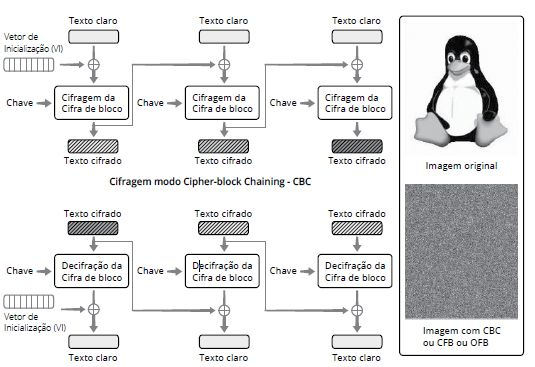

# Capítulo 3 – Criptografia

Nos capítulos anteriores, estabelecemos que a informação é o ativo mais valioso de qualquer organização e que um dos pilares para sua proteção é o princípio da **confidencialidade**. Garantir que dados sensíveis sejam acessíveis apenas por entidades autorizadas é um desafio que acompanha a humanidade desde que a comunicação existe. Diante desse cenário, historicamente, sempre se buscou criar formas de "esconder" a informação de terceiros, de modo que, mesmo que um adversário interceptasse uma mensagem, ele não seria capaz de compreendê-la. Essa necessidade ancestral deu origem a uma das ciências mais fascinantes e cruciais da segurança da informação: a **criptografia**. Ela é a principal ferramenta que utilizamos para transformar dados legíveis e vulneráveis em informações codificadas e seguras, sendo a espinha dorsal da privacidade no mundo digital, desde uma simples troca de mensagens até as mais complexas transações financeiras.

## A Ciência da Escrita Oculta

A criptografia é a ciência e a arte de transformar uma informação (chamada de **texto plano** ou _plaintext_) em um formato codificado e aparentemente ininteligível (chamado de **texto cifrado** ou _ciphertext_), de forma que apenas o destinatário legítimo, de posse de uma "chave" secreta, consiga reverter o processo e ler a mensagem original. O objetivo é "embaralhar" os dados de maneira controlada, garantindo que, mesmo que um atacante obtenha acesso a eles, não será capaz de extrair seu significado.

O próprio termo "criptografia" revela sua essência. Ele vem da junção de duas palavras gregas: **Kryptós**, que significa "oculto", e **grápho**, que significa "escrita". A criptografia é, em sua origem, a "escrita oculta". Para compreender este universo, é fundamental dominar alguns termos que formam a base de seu estudo:

- **Criptografia:** Como vimos, é a ciência de codificar mensagens para garantir sua confidencialidade e integridade.
- **Criptoanálise:** É a ciência (ou a arte) de "quebrar" códigos e decifrar mensagens sem o conhecimento da chave. A partir da análise (_análysis_, em grego, que significa "decomposição") do texto cifrado, o criptoanalista busca encontrar falhas no método de cifragem para revelar a informação oculta.
- **Criptologia:** É o campo de estudo (_logo_, em grego) mais amplo, que agrega tanto a criptografia quanto a criptoanálise. É o estudo completo da comunicação segura.
- **Cifra (ou Algoritmo Criptográfico):** É o método, o conjunto de passos ou a função matemática utilizada para codificar e decodificar a informação.

A combinação de diferentes métodos de cifragem com fórmulas e funções matemáticas complexas gera os algoritmos de criptografia modernos que protegem nossa vida digital. No entanto, em sua base, esses algoritmos derivam de três técnicas de cifragem clássicas: substituição, transposição e esteganografia.

## Métodos Clássicos de Cifragem

Na base de todos os algoritmos criptográficos modernos, encontramos princípios que foram desenvolvidos e refinados ao longo de séculos. As técnicas clássicas de cifragem podem ser divididas em três grandes categorias, baseadas na forma como manipulam a mensagem original para ocultar seu conteúdo.

### Cifra de Substituição

A substituição é o método de codificação mais intuitivo. Sua lógica consiste em **substituir** cada caractere, símbolo ou unidade de dado do texto plano por outro, de acordo com uma regra ou um alfabeto secreto. Embora seja um método simples de executar, sua segurança é geralmente baixa, tornando-o mais fácil de ser quebrado por técnicas de criptoanálise.

O exemplo mais famoso desta categoria é a **Cifra de César**, um método supostamente utilizado por Júlio César para proteger suas comunicações militares. Trata-se de uma **cifra de substituição monoalfabética**, na qual a regra é extremamente simples: cada letra da mensagem original é substituída pela letra que se encontra um número fixo de posições à frente no alfabeto. Na versão clássica, esse deslocamento (a "chave") é de três posições.

A tabela a seguir ilustra a aplicação da Cifra de César com um deslocamento de 3 letras:

Seguindo essa regra, a letra 'a' do texto simples se torna 'D' no texto cifrado, 'b' se torna 'E', e assim por diante. Ao chegar ao fim do alfabeto, a contagem continua a partir do início (um processo chamado de operação de módulo).

Vamos aplicar essa cifra a um exemplo prático. Para garantir a codificação, caracteres especiais e acentos são geralmente removidos ou normalizados.

- **Mensagem Original:** `atacar hoje a noite`
- **Mensagem Cifrada:** `DWDFDU KRMH D QRLWH`

A aparente simplicidade, no entanto, é a maior fraqueza deste método. Um criptoanalista pode quebrar a Cifra de César com extrema facilidade, testando os 25 deslocamentos possíveis (ataque de força bruta) ou, de forma mais inteligente, através da **análise de frequência**. Em qualquer idioma, certas letras aparecem com muito mais frequência do que outras (em português, as vogais 'a' e 'e' são as mais comuns). Ao contar a frequência das letras no texto cifrado, o analista pode deduzir qual letra cifrada corresponde a 'a' ou 'e' e, a partir daí, descobrir a chave de deslocamento.

### Cifra de Transposição

Diferentemente da substituição, a cifra de transposição não altera os caracteres do texto plano. Em vez disso, ela **rearranja** a ordem deles, embaralhando a mensagem de acordo com uma regra específica. Nenhum caractere é adicionado ou removido; a segurança reside na complexidade do embaralhamento.

Os algoritmos de criptografia modernos frequentemente utilizam este recurso, dividindo a mensagem original em blocos de tamanhos iguais e permutando seus bits. Um exemplo clássico e simples para ilustrar o conceito é a **cifra de transposição de colunas**.

Neste método, utiliza-se uma palavra-chave para definir a ordem de embaralhamento. Vamos cifrar a mensagem `ATACAR AO AMANHECER` usando a chave `SEGURANCA`:

1. Primeiro, escrevemos a mensagem em uma grade sob a palavra-chave.
2. Em seguida, lemos as colunas na ordem alfabética da chave (`A`, `C`, `E`, `G`, `N`, `R`, `S`, `U`).

|**S**|**E**|**G**|**U**|**R**|**A**|**N**|**C**|**A**|
|---|---|---|---|---|---|---|---|---|
|A|T|A|C|A|R|A|O|A|
|M|A|N|H|E|C|E|R|X|

Lendo as colunas na ordem alfabética da chave (`A`, `C`, `E`, etc.), o texto cifrado seria: `RCA ORA TAE CM ANH AE`. Perceba que não há letras ou sílabas novas; apenas as originais foram reordenadas.

### Esteganografia

Por último, temos a esteganografia, uma técnica que se diferencia fundamentalmente da criptografia. Enquanto a criptografia busca ocultar o **conteúdo** de uma mensagem, a esteganografia tem como objetivo ocultar a **própria existência** da mensagem.

A informação secreta é embutida dentro de um arquivo de cobertura de aparência inofensiva. Tipicamente, busca-se esconder uma mensagem de texto dentro do código de uma imagem digital. Isso é feito através de algoritmos que realizam alterações minúsculas e imperceptíveis nos dados do arquivo de cobertura. Em uma imagem, por exemplo, a cor de cada pixel é representada por um conjunto de bits. A técnica de **LSB (_Least Significant Bit_)** altera o bit menos significativo de alguns pixels para codificar a mensagem secreta. A mudança na cor é tão sutil que é indetectável ao olho humano, mas pode ser extraída por um software que conheça o método.

A esteganografia não se limita a imagens. Uma mensagem pode ser escondida em arquivos de áudio, vídeo ou até mesmo em um texto comum, através de sutis alterações na formatação ou no espaçamento. É comum que a esteganografia seja usada em conjunto com a criptografia: primeiro, a mensagem é cifrada para proteger seu conteúdo e, em seguida, o texto cifrado é escondido em outro arquivo para ocultar o fato de que uma comunicação secreta está ocorrendo.

## Criptografia Moderna: Cifras de Bloco e seus Modos de Operação

As cifras clássicas que estudamos, como a de César, operam diretamente sobre os caracteres da mensagem. A criptografia moderna, por sua vez, opera sobre os dados em seu formato binário (bits) e utiliza algoritmos matemáticos muito mais complexos. Uma das abordagens mais fundamentais é a **cifragem de bloco** (_block cipher_).

Como o nome sugere, a ideia central é quebrar a mensagem a ser enviada em **blocos de tamanho fixo** (por exemplo, 128 bits) e aplicar as operações matemáticas do algoritmo de criptografia a cada um desses blocos. Um algoritmo como o AES (_Advanced Encryption Standard_), por exemplo, é um especialista em cifrar um único bloco de 128 bits.

Mas como utilizar esse algoritmo para cifrar uma mensagem de tamanho arbitrário, como um e-mail de vários kilobytes? É para resolver essa questão que existem os **modos de operação**. Um modo de operação é uma "receita" ou um protocolo que define como aplicar repetidamente a cifragem de um único bloco para criptografar uma sequência de blocos de forma segura.

É crucial entender que, em regra, todos os modos de operação buscam garantir o princípio da **confidencialidade**. No entanto, alguns modos mais avançados são capazes de oferecer garantias adicionais de **autenticidade** e **integridade**. Não se pode, portanto, generalizar e afirmar que a cifragem de bloco, por si só, garante todos os princípios da segurança. A robustez da proteção depende fundamentalmente do modo de operação escolhido.

### Electronic Codebook (ECB)

O _Electronic Codebook_ (ECB) é o modo de operação mais simples e intuitivo para uma cifra de bloco. Sua lógica é direta: cada bloco de texto claro é cifrado de forma **completamente independente** dos outros, utilizando sempre a mesma chave de criptografia. O texto cifrado final é simplesmente a concatenação de todos os blocos cifrados.

Como o diagrama ilustra, o processo é análogo a ter um "livro de códigos" eletrônico. Para cada bloco de texto claro de entrada, existe um bloco de texto cifrado correspondente na saída, e essa relação é sempre a mesma enquanto a chave não mudar.

#### A Grande Falha de Segurança do ECB

A simplicidade do ECB é também sua maior fraqueza. Como cada bloco é cifrado de forma independente e com a mesma chave, **blocos de texto claro idênticos sempre produzirão blocos de texto cifrado idênticos**. Essa característica faz com que o ECB não consiga esconder os padrões presentes nos dados originais, vazando informações estruturais importantes para um criptoanalista.

A imagem do pinguim no diagrama é o exemplo mais famoso para ilustrar essa falha. Uma imagem digital é composta por muitos blocos de dados repetidos (por exemplo, a cor preta do fundo ou a cor branca da barriga). Ao cifrar a imagem com o modo ECB, todos os blocos pretos se tornam um mesmo bloco cifrado de uma cor, todos os blocos brancos se tornam um mesmo bloco cifrado de outra cor, e assim por diante. O resultado é que, embora as cores tenham mudado, o contorno e a estrutura da imagem original permanecem perfeitamente visíveis. A confidencialidade foi, na prática, quebrada.

Por essa razão, o modo ECB **não é considerado seguro** para a maioria das aplicações e seu uso é fortemente desaconselhado para criptografar qualquer dado que possa conter padrões, como textos, imagens, ou arquivos estruturados. Seu uso seguro se restringe a cenários muito específicos, como a transmissão de um valor único e aleatório que não seja maior que um bloco (como a cifra de uma outra chave criptográfica).

#### Vantagens do ECB

Apesar de suas graves falhas de segurança, o modo ECB possui duas vantagens operacionais:

- **Paralelismo:** Como cada bloco é independente, é possível cifrar ou decifrar múltiplos blocos ao mesmo tempo, em paralelo, o que pode resultar em um melhor desempenho em sistemas com múltiplos processadores.
- **Tolerância a Erros:** Um erro de bit em um determinado bloco de texto cifrado, causado por uma falha de transmissão, por exemplo, afetará apenas a decifragem daquele bloco específico. Os demais blocos da mensagem serão decifrados corretamente.

### Cipher Block Chaining (CBC)

Para superar a grave falha de segurança do modo ECB, foi desenvolvido o **Cipher Block Chaining (CBC)**. Como o próprio nome sugere, este modo de operação cria um "encadeamento" entre os blocos, fazendo com que a cifragem de cada bloco dependa do resultado da cifragem do bloco anterior. Essa dependência elimina a vulnerabilidade de padrões repetidos, tornando o CBC uma opção drasticamente mais segura e, por muitos anos, o modo de operação mais utilizado em diversas aplicações e protocolos.

O mecanismo central que cria essa dependência é a operação matemática **XOR** (representada no diagrama pelo símbolo ⊕, um círculo em volta do sinal de "+"). Antes de cada bloco de texto claro ser cifrado, ele é primeiro "misturado" com o bloco de texto cifrado imediatamente anterior através do XOR.

#### Fluxo de Cifragem e o Vetor de Inicialização (VI)

Observando o diagrama, o processo de cifragem em CBC ocorre da seguinte forma:

1. **O Primeiro Bloco:** Para o primeiro bloco de texto claro, não existe um "bloco cifrado anterior" para ser usado na operação XOR. Para resolver isso, utiliza-se um bloco de dados aleatório chamado **Vetor de Inicialização (VI)**, ou _Initialization Vector_ (IV). Este VI é combinado com o primeiro bloco de texto claro via XOR.
2. O resultado da operação XOR é então cifrado com a chave, produzindo o primeiro bloco de texto cifrado.
3. **O Encadeamento:** A partir do segundo bloco, o processo se repete, mas em vez do VI, utiliza-se o **bloco de texto cifrado anterior**. O segundo bloco de texto claro é combinado via XOR com o primeiro bloco de texto cifrado. O resultado é então cifrado com a chave para produzir o segundo bloco de texto cifrado, e assim por diante.

O Vetor de Inicialização é crucial para a segurança do CBC. Ele garante que, mesmo que a mesma mensagem seja cifrada duas vezes com a mesma chave, os textos cifrados resultantes serão completamente diferentes, pois um VI novo e aleatório será gerado para cada operação de cifragem.

O resultado, como mostra a imagem do pinguim cifrado com CBC, é um ruído estatisticamente aleatório, onde nenhum padrão da imagem original pode ser discernido.

#### Vantagens e Desvantagens do CBC

- **Vantagem (Segurança):** A principal vantagem do CBC é sua capacidade de esconder padrões nos dados, oferecendo um nível de confidencialidade muito superior ao do ECB.
- **Desvantagem (Processamento Sequencial):** A natureza encadeada do CBC implica que a cifragem é um processo inerentemente sequencial. Não é possível cifrar o bloco 2 antes que a cifragem do bloco 1 esteja completa. Isso impede o paralelismo e pode tornar a cifragem em CBC mais lenta que em outros modos, como o ECB.
- **Desvantagem (Propagação de Erros):** A dependência entre os blocos também afeta a forma como os erros são tratados. Se um bit for corrompido em um bloco de texto cifrado durante a transmissão, isso causará a corrupção completa do bloco de texto claro correspondente. Além disso, o erro se propagará para o bloco seguinte, corrompendo o bit na mesma posição. A partir do terceiro bloco, no entanto, o erro é contido.

### Cipher Feedback (CFB)

O modo **Cipher Feedback (CFB)** foi projetado para uma finalidade específica: permitir que uma cifra de bloco funcione como uma **cifra de fluxo** (_stream cipher_). Isso significa que, em vez de precisar agrupar os dados em blocos completos antes de cifrar, o modo CFB permite cifrar e transmitir a informação em unidades menores, como um único byte ou até mesmo um único bit, de forma imediata. Essa característica o torna útil para aplicações que dependem de transmissão de dados em tempo real, sem latência de buffer.

Assim como o CBC, o modo CFB também utiliza um mecanismo de encadeamento para garantir que blocos de texto claro idênticos não resultem em blocos de texto cifrado idênticos.

#### Fluxo de Cifragem e a Diferença para o CBC

A principal diferença entre o CFB e o CBC reside no **ponto em que a operação XOR é aplicada**.

- No **CBC**, o texto claro é primeiro misturado (via XOR) com o bloco cifrado anterior, e o **resultado** é então cifrado.
- No **CFB**, o processo é invertido: o Vetor de Inicialização (VI) ou o bloco cifrado anterior é **primeiro cifrado com a chave**. O resultado dessa cifragem (um bloco de dados pseudoaleatório) é então misturado (via XOR) com o texto claro para produzir o texto cifrado.

É importante notar que, no modo CFB, **o texto claro nunca passa diretamente pelo algoritmo de cifragem**. O algoritmo é usado apenas para gerar uma sequência de dados pseudoaleatórios (o _keystream_), que é então combinada com o texto claro.

O fluxo de decifragem no CFB é interessante, pois utiliza a mesma função de cifragem do bloco. O texto cifrado recebido é combinado via XOR com o resultado da cifragem do bloco anterior para se obter o texto claro original.

#### Vantagens e Desvantagens do CFB

- **Vantagem (Operação como Cifra de Fluxo):** Sua capacidade de processar dados em unidades menores que um bloco é sua principal vantagem, tornando-o adequado para fluxos de dados contínuos.
- **Desvantagem (Processamento Sequencial):** Assim como o CBC, a cifragem em CFB é sequencial, pois a geração do _keystream_ para um bloco depende do texto cifrado do bloco anterior. Isso impede o paralelismo.
- **Desvantagem (Propagação de Erros):** O CFB é mais sensível a erros de transmissão que o CBC. Um erro de um único bit em um bloco de texto cifrado irá corromper a decifragem do bloco correspondente e continuará a corromper a decifragem dos blocos subsequentes até que o bit errôneo seja "deslocado" para fora do registro de entrada do algoritmo.

### Outros Modos de Operação: OFB e CTR

Além do ECB e do CBC, existem outros modos de operação importantes, cada um com suas próprias características de desempenho e segurança.

- **Output Feedback (OFB):** O modo OFB é conceitualmente muito similar ao CFB, pois também opera como uma cifra de fluxo, gerando um _keystream_ que é combinado com o texto claro via XOR. A diferença fundamental é que a **realimentação (_feedback_) é feita pela saída do próprio algoritmo de cifragem**, e não pelo texto cifrado. Isso significa que o _keystream_ é gerado de forma independente do texto claro e do texto cifrado. A principal vantagem dessa abordagem é que **erros de transmissão não se propagam**. Um erro em um bit do texto cifrado afetará apenas o bit correspondente no texto claro, sem corromper os blocos subsequentes.
- **Counter (CTR):** O modo Contador é um dos mais modernos e eficientes. Assim como o OFB, ele transforma a cifra de bloco em uma cifra de fluxo. No entanto, em vez de usar realimentação, ele gera o _keystream_ cifrando os valores de um **contador**. Para cada bloco de texto claro, um contador é incrementado e cifrado, e o resultado é combinado com o texto claro via XOR. Como a geração do _keystream_ para cada bloco depende apenas do valor do contador (que é previsível) e não do resultado de blocos anteriores, o modo CTR permite um **alto grau de paralelismo**, tanto na cifragem quanto na decifragem. Isso o torna um dos modos de operação de mais alto desempenho.

