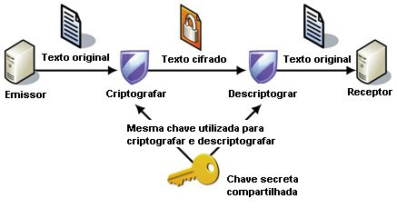
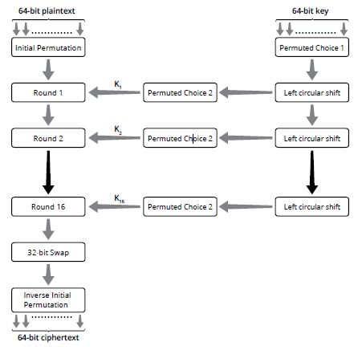
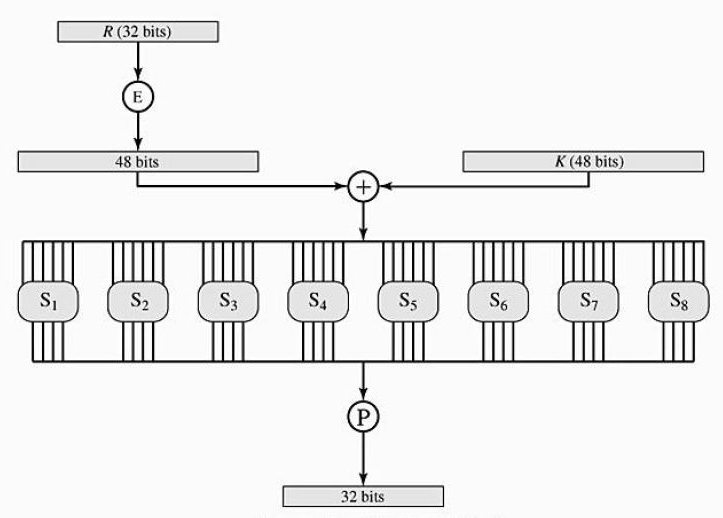
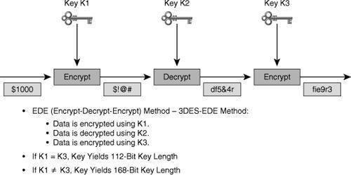
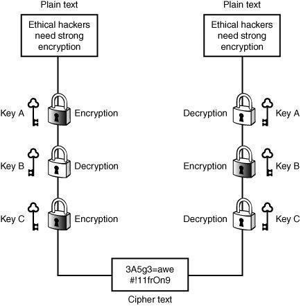
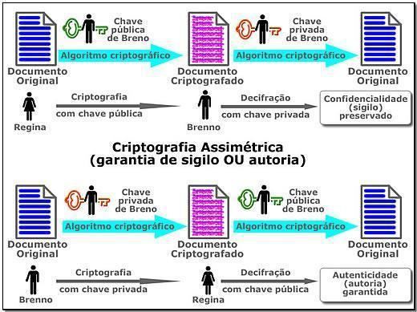
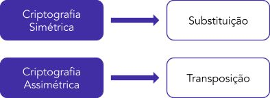
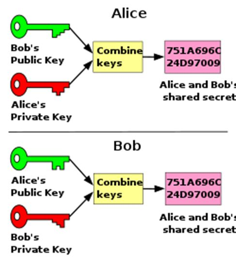
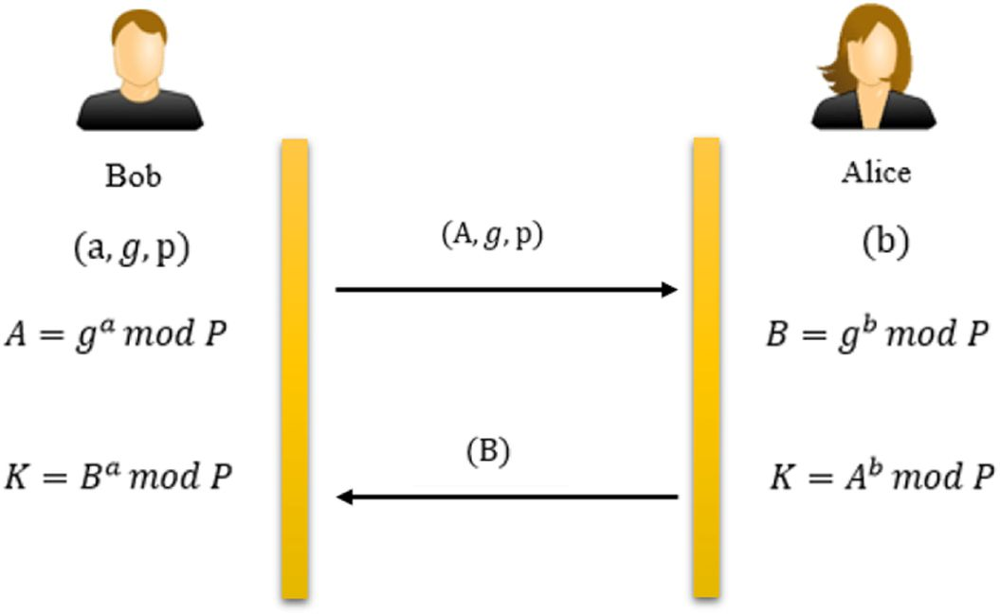
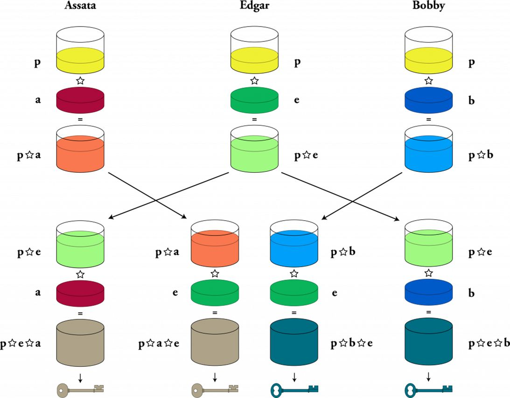

# Capítulo 4 – Criptografia Simétrica, Assimétrica e Funções Hash

No capítulo anterior, exploramos os fundamentos da criptografia, desde suas origens clássicas até os modos de operação que regem os algoritmos modernos. Estabelecemos que o objetivo é transformar dados legíveis em um formato ininteligível, protegendo-os de acessos não autorizados. Agora, vamos nos aprofundar nos dois principais paradigmas que executam essa tarefa no mundo digital: a **criptografia simétrica** e a **assimétrica**. Embora ambas busquem a confidencialidade, suas abordagens para o gerenciamento de chaves são fundamentalmente diferentes, cada uma com suas próprias forças, fraquezas e casos de uso ideais. Além delas, estudaremos também as **funções de hash**, uma terceira categoria de ferramenta criptográfica que, embora não seja usada para decifrar dados, é indispensável para garantir a integridade da informação.

## Criptografia Simétrica (Chave Secreta)

A criptografia simétrica, também conhecida como criptografia de chave secreta ou de chave única, é o paradigma mais antigo e intuitivo. Seu princípio fundamental é o uso de **uma única chave compartilhada tanto para o processo de cifragem quanto para o de decifragem**.

O fluxo de comunicação é direto: o emissor pega um texto em claro e o submete a um algoritmo de criptografia simétrica, utilizando uma chave secreta para realizar os cálculos matemáticos que o transformarão em texto cifrado. Essa mensagem cifrada é então enviada ao destinatário. Para reverter o processo e obter a mensagem original, o destinatário deve aplicar o mesmo algoritmo, utilizando a **mesma chave** que foi usada na cifragem.

A imagem a seguir ilustra perfeitamente este modelo:

### Desafio da Distribuição de Chaves

A simplicidade do modelo simétrico é também a fonte de seu maior desafio operacional: o **problema da distribuição de chaves**. Para que a comunicação funcione, tanto o emissor quanto o receptor precisam ter uma cópia da mesma chave secreta. Isso gera um dilema: como as duas partes podem combinar e trocar essa chave de forma segura, especialmente se o único canal de comunicação que elas possuem já é inseguro? Enviar a chave pelo mesmo canal que será usado para a mensagem seria como enviar a chave de um cofre junto com o próprio cofre.

### Propriedades de Segurança e Boas Práticas

A criptografia simétrica, em sua forma pura, visa garantir primordialmente o princípio da **confidencialidade**. Se a chave for mantida em segredo, apenas as partes que a possuem poderão decifrar a mensagem. No entanto, ela não oferece, nativamente, garantias de:

- **Integridade:** Um atacante no meio do caminho poderia alterar o texto cifrado, e o destinatário, ao decifrar, obteria uma mensagem corrompida, sem um mecanismo para detectar a alteração.
- **Autenticidade e Não-Repúdio:** Como a chave é compartilhada, não há como provar criptograficamente qual das partes (emissor ou receptor) realmente gerou uma mensagem cifrada.

Uma boa prática em qualquer processo de criptografia é realizar a **compressão dos dados antes da encriptação**. Este procedimento tem um duplo benefício: primeiro, ele reduz o tamanho dos dados, aumentando o desempenho da transmissão e do processo criptográfico; segundo, e mais importante, a compressão reduz a redundância e os padrões repetitivos nos dados, o que dificulta o trabalho de um criptoanalista.

### Comparação com a Criptografia Assimétrica

Ao longo deste capítulo, veremos a criptografia assimétrica em detalhes, mas já é possível adiantar alguns pontos de comparação cruciais:

- **Desempenho:** Os algoritmos de criptografia simétrica são, por ordem de magnitude, muito mais rápidos e computacionalmente menos exigentes que os algoritmos de chave assimétrica. Isso se deve, em parte, ao fato de operarem com chaves significativamente menores.
- **Uso Prático (Criptografia Híbrida):** Devido à diferença de desempenho, a abordagem mais comum na prática é utilizar os dois paradigmas em conjunto. Utiliza-se a criptografia **assimétrica**, mais lenta, apenas no início da comunicação, com o propósito de trocar de forma segura a chave **simétrica**. Uma vez que ambas as partes possuem a chave secreta, toda a comunicação subsequente (a troca de grandes volumes de dados) é realizada utilizando a criptografia simétrica, muito mais rápida. É assim que funcionam protocolos como o TLS/SSL, que protegem nossa navegação na web.

É importante reforçar, seguindo o Princípio de Kerckhoffs, que a segurança de qualquer algoritmo criptográfico moderno, seja ele simétrico ou assimétrico, deve residir **exclusivamente no segredo da chave**, e não no segredo do algoritmo. Os algoritmos são públicos e exaustivamente analisados pela comunidade acadêmica. Sua robustez está em sua solidez matemática.

### Principais Algoritmos de Criptografia Simétrica

Com os conceitos gerais da criptografia simétrica estabelecidos, podemos agora analisar alguns dos algoritmos específicos mais importantes. Cada um deles representa um marco na evolução da segurança digital, com suas próprias características de design, tamanho de chave e nível de robustez.

#### DES (_Data Encryption Standard_)

Durante muitos anos, o **Data Encryption Standard (DES)** foi o algoritmo padrão para a criptografia simétrica, amplamente adotado por governos e indústrias em todo o mundo. Criado pela IBM e adotado como um padrão pelo governo dos EUA em 1977, o DES dominou o cenário da criptografia por mais de duas décadas.

Sua característica mais marcante — e, eventualmente, sua ruína — é o tamanho de sua chave. O DES utiliza uma chave de **64 bits**. No entanto, desses 64 bits, 8 são utilizados para a verificação de paridade (um mecanismo simples de detecção de erros), não contribuindo para a segurança. Isso resulta em uma **força de segurança efetiva de apenas 56 bits**. Para efeito de análise de segurança e de provas, quando se fala da robustez do DES, o número a ser considerado é 56 bits.

Com a evolução exponencial do poder computacional, uma chave de 56 bits se tornou vulnerável a ataques de força bruta. Em 1997, em um desafio lançado pelo NIST (_National Institute of Standards and Technology_), o DES foi publicamente quebrado. Hoje, ele é considerado inseguro para qualquer aplicação moderna, mas seu estudo continua sendo fundamental para a compreensão dos princípios das cifras de bloco.

##### Estrutura do DES: A Rede de Feistel

O DES é uma cifra de bloco que opera sobre blocos de 64 bits de dados. Sua arquitetura interna é baseada em uma estrutura conhecida como **Rede de Feistel**, que divide o bloco de dados em duas metades de 32 bits (esquerda e direita) e as processa através de múltiplas rodadas. O fluxo geral de operações é o seguinte:

1. **Permutação Inicial:** O bloco de 64 bits de texto claro passa por uma permutação inicial, que embaralha os bits.
2. **16 Rodadas de Cifragem:** O bloco permutado é então submetido a 16 rodadas idênticas de processamento. Em cada rodada, uma subchave única de 48 bits (derivada da chave principal de 56 bits) é utilizada.
3. **Troca Final e Permutação Inversa:** Após as 16 rodadas, as duas metades do bloco são trocadas, e o resultado passa por uma permutação final (inversa da inicial) para produzir o texto cifrado de 64 bits.

##### Anatomia de uma Rodada do DES

O "coração" da segurança do DES reside no que acontece dentro de cada uma das 16 rodadas. A estrutura de Feistel opera sobre as metades do bloco, aplicando uma função complexa que envolve quatro estágios principais:

1. **Expansão:** A metade direita do bloco (32 bits) é expandida para 48 bits através de uma permutação que duplica alguns dos bits.
2. **Mistura de Chaves:** O resultado de 48 bits é combinado com a subchave daquela rodada (também de 48 bits) através de uma operação XOR.
3. **Substituição (S-boxes):** O resultado da mistura é dividido em oito blocos de 6 bits. Cada um desses blocos é alimentado em uma **S-box** (_Substitution-box_) diferente. As S-boxes são o núcleo da segurança do DES. Cada uma é uma tabela de substituição não-linear que transforma a entrada de 6 bits em uma saída de 4 bits. O design exato dessas tabelas foi mantido em segredo pela NSA na época, o que gerou constantes acusações de que poderiam conter um _backdoor_.
4. **Permutação (P-box):** As oito saídas de 4 bits das S-boxes (totalizando 32 bits) são então rearranjadas de acordo com uma permutação fixa, a **P-box** (_Permutation-box_).

O resultado final de 32 bits dessa função é então combinado via XOR com a metade esquerda do bloco, e as duas metades são trocadas para iniciar a próxima rodada.

##### Confusão, Difusão e o Princípio de Kerckhoffs

O design do DES é um exemplo clássico da aplicação de duas propriedades fundamentais para a segurança de uma cifra, identificadas pelo "pai" da teoria da informação, Claude Shannon:

- **Confusão:** Busca tornar a relação entre a chave e o texto cifrado a mais complexa e obscura possível. No DES, a confusão é fornecida principalmente pelas **S-boxes**, que realizam uma substituição complexa e não-linear.
- **Difusão:** Busca espalhar a influência de cada bit do texto claro sobre muitos bits do texto cifrado. No DES, a difusão é fornecida pelas **permutações** (P-box e expansão), que embaralham os bits a cada rodada. O objetivo é que a mudança de um único bit no texto claro cause uma "avalanche", alterando, em média, metade dos bits no texto cifrado.

Por fim, vale reforçar o **Princípio de Kerckhoffs**, que é um pilar da criptografia moderna. Ele estabelece que a segurança de um sistema criptográfico não deve depender do sigilo do algoritmo, mas unicamente do **sigilo da chave**. Os algoritmos, como o DES, devem ser públicos e abertos ao escrutínio da comunidade para que suas fraquezas possam ser encontradas e sua robustez, comprovada.

#### 3DES (_Triple DES_)

Com a crescente inviabilidade do DES frente ao avanço do poder computacional, a comunidade criptográfica precisava de uma solução mais robusta. Em vez de criar um algoritmo inteiramente novo do zero, uma solução engenhosa e de transição foi proposta: aplicar o já conhecido e amplamente analisado algoritmo DES múltiplas vezes. Assim nasceu o **Triple DES (3DES)**.

A ideia, como o nome sugere, é aplicar o DES três vezes consecutivas sobre o mesmo bloco de dados. No entanto, para garantir a segurança e a retrocompatibilidade, o padrão adotado não foi uma simples cifragem tripla, mas sim um processo de **Cifrar-Decifrar-Cifrar (EDE - _Encrypt-Decrypt-Encrypt_)**.

O fluxo de operação é o seguinte:

1. O bloco de texto claro é primeiro **cifrado** com uma chave K1.
2. O resultado dessa cifragem é então **decifrado** com uma segunda chave, K2.
3. Por fim, o resultado da decifragem é **cifrado** novamente com uma terceira chave, K3.

A escolha de "decifrar" na etapa intermediária foi uma decisão de design inteligente, que permite a retrocompatibilidade com o DES original. Se as três chaves (K1, K2 e K3) forem idênticas, a primeira cifragem é imediatamente anulada pela segunda decifragem, e o resultado final é equivalente a uma única cifragem DES com aquela chave.

##### Opções de Chave e Nível de Segurança

O 3DES oferece duas principais configurações para as chaves, o que impacta diretamente sua robustez:

- **Opção de 3 Chaves:** K1, K2 e K3 são três chaves DES independentes de 56 bits cada. Isso resulta em um tamanho de chave total de 56 x 3 = **168 bits**. No entanto, devido a um tipo de ataque conhecido como "_meet-in-the-middle_", a força de segurança efetiva do 3DES nesta configuração é considerada de **112 bits**, e não os 168 bits nominais.
- **Opção de 2 Chaves:** Nesta configuração, a primeira e a terceira chaves são idênticas (K1 = K3), e a segunda chave (K2) é diferente. Esta foi uma opção popular para simplificar o gerenciamento das chaves. A força de segurança, neste caso, é de 56 x 2 = **112 bits**.

##### Processo de Decifragem

O processo de decifragem do 3DES é a exata operação inversa da cifragem. Para obter o texto claro a partir do texto cifrado, aplica-se a sequência **Decifrar-Cifrar-Decifrar (DED)**, utilizando as mesmas chaves na ordem inversa.

1. O texto cifrado é primeiro **decifrado** com a chave K3.
2. O resultado é então **cifrado** com a chave K2.
3. Finalmente, o resultado é **decifrado** com a chave K1, revelando o texto claro original.

Apesar de ter sido uma solução eficaz para estender a vida útil do DES, o 3DES também é hoje considerado obsoleto para novas aplicações. Seus principais problemas são o **baixo desempenho** (por executar o algoritmo DES três vezes) e o **tamanho de bloco pequeno** (64 bits), herdado do DES original. Ele foi oficialmente substituído pelo AES como o padrão recomendado.

#### Rivest Cipher (RC)

Desenvolvida por Ron Rivest na RSA Security, a família de algoritmos "Rivest Cipher" (RC) representa uma série de cifras simétricas que tiveram um impacto significativo na indústria. Embora compartilhem o mesmo criador, suas versões possuem arquiteturas e finalidades distintas. As que mais aparecem na literatura técnica são a RC4, a RC5 e a RC6.

##### RC4: A Cifra de Fluxo Onipresente

O **RC4** é, de longe, o mais conhecido e historicamente o mais utilizado da família. Sua principal característica é ser uma **cifra de fluxo** (_stream cipher_) orientada a byte. Ele é conhecido por sua extrema simplicidade e alta velocidade de implementação em software.

- **Funcionamento:** O RC4 utiliza uma chave de tamanho variável (de 40 a 2048 bits) para inicializar um "estado" interno, que é uma grande tabela de 256 bytes. A partir desse estado, um algoritmo de geração pseudoaleatória (PRGA) produz um fluxo contínuo de bytes, o _keystream_. Esse _keystream_ é então combinado com o texto claro via XOR para produzir o texto cifrado. A segurança do RC4 reside inteiramente na imprevisibilidade desse _keystream_.
- **Uso Histórico:** Devido à sua velocidade e simplicidade, o RC4 foi um dos algoritmos de criptografia mais populares do mundo, sendo amplamente utilizado em protocolos como o **SSL/TLS** (para proteger a navegação web) e no padrão de segurança **WEP** (para redes Wi-Fi).
- **Vulnerabilidades e Obsolescência:** Apesar de sua popularidade, diversas vulnerabilidades e vieses estatísticos foram descobertos no _keystream_ gerado pelo RC4 ao longo dos anos. Essas fraquezas o tornam suscetível a ataques que podem, com o tempo, revelar o texto plano. Por essa razão, o uso do RC4 é hoje **fortemente desaconselhado** e foi removido das versões mais recentes de protocolos seguros como o TLS 1.3.

##### RC5: A Cifra de Bloco Parametrizada

Diferente do RC4, o **RC5** é uma **cifra de bloco** notável por sua simplicidade e, principalmente, por sua alta **flexibilidade**. Ele foi projetado para ser "parametrizado", permitindo que o desenvolvedor ajuste três variáveis fundamentais para adequar o algoritmo a diferentes necessidades de segurança e desempenho:

- **Tamanho de Bloco Variável:** Pode ser configurado para 32, 64 ou 128 bits.
- **Tamanho de Chave Variável:** Pode variar de 0 a 2048 bits.
- **Número de Rodadas Variável:** Pode variar de 0 a 255 rodadas de processamento.

Essa capacidade de ajuste permite que o RC5 seja otimizado para diferentes plataformas de _hardware_. Seu design simples se baseia em três rotinas primitivas: adição, operação XOR e rotações de bits dependentes dos dados.

##### RC6: O Sucessor Evoluído

O **RC6** foi desenvolvido como uma evolução direta do RC5, com o objetivo de ser um dos candidatos no processo de seleção do novo Padrão de Criptografia Avançado (**AES**). Mantendo a estrutura básica de seu predecessor, o RC6 introduziu melhorias para aumentar sua segurança e desempenho:

- **Estrutura:** Também é uma cifra de bloco, mas fixa seu tamanho de bloco em 128 bits para atender aos requisitos da competição AES.
- **Melhorias:** O RC6 adicionou o uso da **multiplicação de inteiros** como uma de suas operações primitivas, o que aumenta significativamente a difusão dos bits por rodada, oferecendo maior segurança em menos rodadas. Além disso, enquanto o RC5 operava sobre duas metades do bloco (dois registradores), o RC6 opera sobre quatro, permitindo um embaralhamento mais complexo a cada rodada.

Embora tenha sido um dos cinco finalistas da competição AES, o algoritmo escolhido para se tornar o novo padrão foi o Rijndael.

#### AES (_Advanced Encryption Standard_): Padrão da Criptografia Moderna

Com a obsolescência do DES e do 3DES, o governo dos Estados Unidos, através do NIST, promoveu uma competição aberta no final da década de 1990 para selecionar um novo algoritmo de criptografia que se tornaria o padrão para o século XXI. O vencedor foi um algoritmo chamado **Rijndael**, que foi então padronizado como o **Advanced Encryption Standard (AES)**.

Hoje, o AES é o algoritmo de criptografia simétrica mais utilizado e confiável do mundo, presente em praticamente todos os protocolos e aplicações que exigem segurança, desde a proteção de transações bancárias e navegação web (TLS/SSL) até a criptografia de arquivos em seu computador e _smartphone_.

Suas principais características são:

- **Tamanho de Bloco Fixo:** O AES opera sobre blocos de dados de **128 bits**.
- **Tamanhos de Chave Variáveis:** Ele suporta três tamanhos de chave: **128, 192 ou 256 bits**.

A robustez de um algoritmo está diretamente ligada ao tamanho de sua chave. Como referência geral no cenário atual:

- **64 bits (ou menos):** Considerado fraco e inseguro contra ataques de força bruta.
- **128 bits:** Oferece um nível de segurança forte, adequado para a maioria das aplicações de rotina.
- **256 bits:** Oferece um nível de segurança altíssimo, recomendado para a proteção de dados extremamente sensíveis e de longo prazo.

##### Estrutura e Rodadas

Uma diferença fundamental em relação ao DES é que o AES **não utiliza uma Rede de Feistel**. Sua arquitetura é baseada em um design conhecido como **Rede de Substituição-Permutação (SPN)**, no qual todo o bloco de dados é processado em cada rodada.

O número de rodadas de processamento no AES não é fixo, mas varia de acordo com o tamanho da chave utilizada, para garantir que a complexidade da chave seja totalmente difundida pelo texto cifrado:

- **Chave de 128 bits:** 10 rodadas
- **Chave de 192 bits:** 12 rodadas
- **Chave de 256 bits:** 14 rodadas

##### A Anatomia de uma Rodada do AES

Em cada rodada, o AES aplica uma sequência de quatro transformações matemáticas sobre o bloco de dados. Esses estágios são projetados para prover as propriedades de confusão e difusão de Shannon de forma altamente eficiente.

1. **_SubBytes_** **(Substituição):** Este é um estágio de substituição não-linear. Cada byte do bloco é substituído por outro, de acordo com uma tabela de consulta fixa chamada S-box (a S-box do Rijndael). Esta é a principal fonte de **confusão** do algoritmo.
2. **_ShiftRows_** **(Permutação):** Neste estágio, os bytes do bloco são organizados em uma matriz 4x4, e as linhas dessa matriz são deslocadas (rotacionadas) ciclicamente por diferentes offsets. Esta operação embaralha os bytes dentro do bloco, sendo uma importante fonte de **difusão**.
3. **_MixColumns_** **(Substituição/Difusão):** Esta é uma operação de mistura que opera nas colunas da matriz de dados. Utilizando uma complexa aritmética sobre corpos finitos, ela combina os quatro bytes de cada coluna, garantindo que a alteração de um único byte na entrada afete todos os quatro bytes da coluna na saída. Este passo contribui enormemente para a **difusão**.
4. **_AddRoundKey:_** Neste último estágio, a chave entra em ação. Uma "chave de rodada" única (derivada da chave principal) é combinada com o bloco de dados através de uma simples operação XOR bit a bit.

Esses quatro estágios são repetidos por 10, 12 ou 14 vezes. É importante notar que todos os estágios são projetados para serem reversíveis, o que permite que o processo de decifragem aplique as transformações inversas para recuperar o texto claro original.

#### Outros Algoritmos Simétricos Notáveis

Além do DES e do AES, que foram ou são padrões governamentais, diversos outros algoritmos de criptografia simétrica tiveram grande impacto e continuam sendo relevantes, seja por seu legado histórico ou por sua robustez contínua.

##### Blowfish

O **Blowfish** é uma cifra de bloco simétrica projetada em 1993 pelo renomado criptógrafo Bruce Schneier. Ele foi criado com o objetivo explícito de ser um substituto rápido, gratuito e livre de patentes para o DES. Seus principais alvos de projeto foram:

- Ser extremamente rápido em microprocessadores de 32 bits de propósito geral.
- Oferecer um tamanho de chave flexível (variando de 32 a 448 bits) para se adaptar a diferentes requisitos de segurança.
- Ser simples e compacto, facilitando sua implementação e análise.

Arquiteturalmente, o Blowfish utiliza uma **rede de Feistel com 16 rodadas** e opera sobre **blocos de 64 bits**. Sua característica mais inovadora é o uso de **S-boxes dependentes da chave**. Diferente do DES, que possui S-boxes fixas, o Blowfish gera suas tabelas de substituição a partir da própria chave do usuário. Este é um processo de inicialização computacionalmente caro, mas que, uma vez concluído, permite que a cifragem subsequente seja muito veloz.

A principal fraqueza do Blowfish hoje não está em seu design, mas em seu **tamanho de bloco de 64 bits**. Assim como outras cifras com blocos pequenos, ele é vulnerável a **ataques de aniversário** quando utilizado para cifrar grandes volumes de dados (na casa dos gigabytes), o que pode levar a vazamentos de informação. Por essa razão, seu uso é desaconselhado para novas aplicações que lidam com grandes quantidades de dados, tendo sido sucedido por seu "irmão mais novo", o Twofish.

##### Twofish

O **Twofish** foi projetado pela mesma equipe liderada por Bruce Schneier, como um candidato para a competição que selecionou o AES. Ele foi desenhado para ser tão seguro quanto seus concorrentes, mas oferecendo um alto grau de flexibilidade e desempenho em uma variedade de plataformas.

O Twofish opera sobre **blocos de 128 bits** e aceita chaves de **128, 192 ou 256 bits**, as mesmas especificações do AES. Ele também utiliza uma **rede de Feistel com 16 rodadas**, mas adiciona camadas de segurança sofisticadas, como o _whitening_ (uma operação XOR com subchaves antes da primeira e depois da última rodada) e o uso de S-boxes complexas, que também são dependentes da chave.

Livre de patentes e de código aberto, o Twofish é um algoritmo extremamente robusto. Desde sua publicação, **nenhum ataque prático que comprometa a cifra completa foi descoberto**. Seu bloco de 128 bits elimina o risco de colisões que afeta as cifras de 64 bits, garantindo uma longevidade comparável à do próprio AES. Por sua segurança comprovada, ele continua a ser uma alternativa popular ao AES em muitos projetos de código aberto.

##### IDEA (_International Data Encryption Algorithm_)

Desenvolvido na Suíça no início dos anos 1990, o **IDEA** é outra cifra de bloco que ganhou notoriedade por sua força e por seu design inovador. Ele opera sobre **blocos de 64 bits** e utiliza uma **chave de 128 bits**.

Sua estrutura não é uma rede de Feistel. Em vez disso, suas 8,5 rodadas de processamento combinam, de forma engenhosa, operações de três grupos algébricos diferentes: **XOR**, **adição modular** e **multiplicação modular**. Essa mistura de operações lineares e não-lineares foi projetada para oferecer forte resistência contra a criptoanálise diferencial, uma das técnicas de ataque mais poderosas da época.

O IDEA é mais conhecido por ter sido o algoritmo de criptografia utilizado na versão 2.0 do **PGP (_Pretty Good Privacy_)**, um dos softwares de criptografia de e-mail mais famosos da história. Assim como o Blowfish, sua principal limitação hoje é o tamanho de bloco de 64 bits.

##### Síntese Comparativa

A tabela a seguir resume e compara as principais características desses três algoritmos.

|Algoritmo|Tipo/Estrutura|Tamanho do Bloco|Tamanhos de Chave|Número de Rodadas|Estado de Segurança Atual|Uso Típico/Observações|
|---|---|---|---|---|---|---|
|**Blowfish**|Cifra de bloco simétrica, rede de Feistel.|64 bits|32 a 448 bits|16|Sem ataques práticos à versão completa; vulnerável a colisões em volumes muito altos por causa do bloco de 64 bits.|_Hashing_ de senhas (bcrypt), softwares legados.|
|**Twofish**|Cifra de bloco simétrica, rede de Feistel.|128 bits|128, 192 ou 256 bits|16|Nenhum ataque prático conhecido; foi um dos finalistas do processo AES.|Alternativa ao AES em projetos _open-source_, discos criptografados.|
|**IDEA**|Cifra de bloco simétrica; combina XOR, adição e multiplicação.|64 bits|128 bits|8,5|Considerada segura; a principal limitação é o bloco de 64 bits.|Versões clássicas do PGP, sistemas legados.|

#### ChaCha20: Cifra de Fluxo Moderna

Diferente dos algoritmos de bloco como o AES, o **ChaCha20** é uma **cifra de fluxo** (_stream cipher_) de alto desempenho, descendente do algoritmo Salsa20. Ele foi projetado para ser extremamente rápido e seguro em implementações de software, oferecendo uma alternativa robusta ao AES, especialmente em plataformas que não possuem aceleração de hardware para criptografia.

- **Estrutura:** O ChaCha20 opera com uma chave de **256 bits**, um **nonce** (número de uso único) de 96 bits e um contador de 32 bits. Juntos, eles formam o estado inicial de 512 bits (64 bytes) do algoritmo.
- **Funcionamento:** Para cada bloco de texto claro, o ChaCha20 utiliza seu estado inicial para gerar um bloco de 512 bits de _keystream_. Esse processo é determinístico e envolve **20 rodadas** de operações matemáticas simples e rápidas (adições, XORs e rotações de bits). O _keystream_ resultante é então combinado com o texto claro via XOR para produzir o texto cifrado. O contador é incrementado para cada novo bloco, garantindo que o _keystream_ seja sempre diferente.
- **Segurança:** A segurança do ChaCha20 repousa na dificuldade de reverter as 20 rodadas de mistura. Até hoje, os ataques criptoanalíticos mais eficazes só conseguiram quebrar versões enfraquecidas do algoritmo, com no máximo 7 ou 8 rodadas. A versão completa, com 20 rodadas, permanece computacionalmente segura e sem vulnerabilidades práticas conhecidas.

No entanto, como toda cifra de fluxo, o ChaCha20 compartilha uma fragilidade fundamental: a **reutilização de um nonce com a mesma chave é catastrófica**. Se isso ocorrer, o mesmo _keystream_ será gerado para duas mensagens diferentes, permitindo que um atacante as combine e extraia informações do texto plano. Por isso, a unicidade do _nonce_ é um requisito de segurança inegociável.

##### ChaCha20-Poly1305: Adicionando Autenticidade e Integridade

O ChaCha20, em sua forma pura, fornece apenas **confidencialidade**. Para atender às necessidades dos protocolos modernos, que exigem também **integridade** e **autenticidade**, ele é quase sempre utilizado em uma construção conhecida como **AEAD (_Authenticated Encryption with Associated Data_)**.

A combinação **ChaCha20-Poly1305** é a implementação AEAD mais popular. Nela, dois algoritmos trabalham em conjunto:

1. **ChaCha20:** Cifra a mensagem, garantindo a confidencialidade.
2. **Poly1305:** Atua como um **MAC (_Message Authentication Code_)**, gerando uma "etiqueta" de autenticação de 128 bits sobre o texto cifrado. Essa etiqueta garante que a mensagem não foi alterada no caminho (integridade) e que foi gerada por alguém que possui a chave secreta (autenticidade).

Essa combinação robusta e de alto desempenho se tornou um padrão na internet moderna, sendo adotada em protocolos de segurança críticos como o **TLS 1.3** (ao lado do AES-GCM), **OpenSSH** e na VPN **WireGuard**, consolidando o ChaCha20 como uma das cifras de fluxo de referência para segurança de alto nível em software.

## Criptografia Assimétrica (Chave Pública)

A **Criptografia Assimétrica**, também conhecida como **criptografia de chave pública**, representa uma revolução conceitual que resolveu o maior desafio da criptografia simétrica: o problema da distribuição segura de chaves. Proposta na década de 1970, sua característica fundamental é o uso de um **par de chaves matematicamente interligadas**: uma **chave pública** e uma **chave privada**.

- **Chave Privada:** É mantida em segredo absoluto pelo seu dono. É a sua identidade criptográfica.
- **Chave Pública:** Como o nome sugere, é distribuída livremente e pode ser de conhecimento de qualquer pessoa.

A genialidade do sistema reside na relação matemática entre as chaves: o que uma chave cifra, somente a sua contraparte no par pode decifrar. É computacionalmente inviável deduzir a chave privada a partir do conhecimento da chave pública. Isso responde à pergunta mais comum sobre o modelo: não é inseguro que a chave pública seja conhecida por todos, pois sua única função é cifrar dados que apenas o dono da chave privada correspondente poderá ler, ou verificar a autenticidade de dados que só poderiam ter sido cifrados por aquela chave privada.

Outro ponto importante é que o processo não se restringe a uma única sequência. Dependendo do objetivo — confidencialidade ou autenticidade —, a ordem de uso das chaves se inverte, o que confere uma enorme flexibilidade ao modelo.

É essa capacidade de operar com chaves distintas que permitiu a troca segura de chaves simétricas pela internet, formando a base da criptografia híbrida e de toda a infraestrutura de certificação digital que sustenta a segurança da web moderna.

### Os Dois Pilares da Criptografia Assimétrica: Confidencialidade e Autenticidade

A utilização do par de chaves permite garantir duas propriedades de segurança distintas, dependendo de qual chave é usada para iniciar o processo. A imagem a seguir ilustra os dois cenários.

#### Garantindo a Confidencialidade (Sigilo)

Quando o objetivo é garantir que apenas o destinatário possa ler uma mensagem, o fluxo é o seguinte:

- **Regra:** Cifra-se com a chave **pública do destinatário**. Decifra-se com a chave **privada do destinatário**.

Analisando o primeiro cenário da figura: Regina (a emissora) quer enviar um documento sigiloso para Breno (o receptor).

1. Regina obtém a chave pública de Breno, que é de conhecimento geral.
2. Ela utiliza essa chave pública para cifrar o documento.
3. O documento criptografado, agora, só pode ser decifrado pela única chave que forma par com a que o cifrou: a chave privada de Breno.
4. Como somente Breno possui sua própria chave privada, ele é o único capaz de ler a mensagem. A confidencialidade está garantida.

#### Garantindo a Autenticidade (Autoria / Assinatura Digital)

Quando o objetivo é provar a origem de uma mensagem e garantir que ela não foi alterada, ou seja, garantir a autoria e a integridade, o fluxo se inverte:

- **Regra:** Cifra-se com a chave **privada do emissor**. Decifra-se com a chave **pública do emissor**.

Analisando o segundo cenário da figura: Breno (o emissor) quer enviar um documento de forma que Regina (a receptora) tenha certeza de que foi ele quem o enviou.

1. Breno utiliza sua própria chave privada para cifrar (ou, mais precisamente, "assinar") o documento.
2. Ele envia o documento criptografado para Regina.
3. Regina, ou qualquer outra pessoa, pode obter a chave pública de Breno para tentar decifrar o documento.
4. Se a chave pública de Breno conseguir decifrar a mensagem corretamente, isso serve como uma prova criptográfica irrefutável de que a mensagem só pode ter sido cifrada pela chave privada correspondente. Como só Breno possui sua chave privada, fica garantida a autenticidade da origem. Este é o princípio fundamental por trás da **assinatura digital**.

É crucial entender esses dois fluxos e não os decorar. A lógica por trás de qual chave usar para cada finalidade é a base para a compreensão dos algoritmos de criptografia assimétrica.

De uma perspectiva conceitual e simplificada, pode-se traçar um paralelo entre os paradigmas criptográficos e as cifras clássicas. A criptografia simétrica, ao transformar um dado em outro (como nas S-boxes), ecoa o princípio da **Substituição**. Já a criptografia assimétrica, baseada em complexas funções matemáticas, pode ser analogamente associada à ideia de **Transposição** em um nível muito mais abstrato.

Vamos conhecer agora os principais algoritmos que implementam este paradigma.

### Diffie-Hellman (DH): A Troca Segura de Chaves

O algoritmo **Diffie-Hellman (DH)** não é, estritamente falando, um algoritmo de cifragem. Sua finalidade não é cifrar e decifrar mensagens, mas sim resolver o problema mais fundamental da criptografia simétrica: como duas partes, que nunca se comunicaram antes, podem estabelecer uma chave secreta compartilhada através de um canal de comunicação inseguro (como a internet), sem que um interceptador consiga descobrir essa chave?

O DH é um protocolo de **acordo de chaves** (_key agreement_). Ele providencia um meio matemático para que duas partes, como Alice e Bob, possam, de forma independente, chegar ao mesmo segredo compartilhado, sem que esse segredo jamais seja transmitido pela rede. Esse segredo pode então ser usado como a chave para um algoritmo de criptografia simétrica (como o AES) para proteger a comunicação subsequente. Protocolos de segurança robustos, como o **IPSec** (usado em VPNs) e o **TLS/SSL** (que protege a navegação web via HTTPS), utilizam o DH como pilar para o estabelecimento de seus canais seguros.

#### A Analogia das Cores

Antes de mergulharmos na matemática, a maneira mais didática de entender o funcionamento do Diffie-Hellman é através de uma analogia com a mistura de cores.

1. **Acordo Público:** Alice e Bob primeiro concordam publicamente com uma cor inicial comum (ex: amarelo). Um interceptador também conhecerá essa cor.
2. **Segredos Privados:** Cada um escolhe uma cor secreta que apenas eles conhecem. Alice escolhe vermelho e Bob escolhe verde.
3. **Mistura e Troca Pública:** Alice mistura sua cor secreta (vermelho) com a cor pública (amarelo), resultando em laranja, e envia essa cor para Bob. Bob faz o mesmo, misturando sua cor secreta (verde) com a pública (amarelo), resultando em azul-esverdeado, e envia para Alice. O interceptador agora vê as cores laranja e azul-esverdeado, mas não consegue "separar" as cores secretas originais.
4. **Criação do Segredo Compartilhado:** Alice pega a cor que recebeu de Bob (azul-esverdeado) e a mistura com sua própria cor secreta (vermelho). Bob faz o mesmo, misturando a cor que recebeu de Alice (laranja) com sua própria cor secreta (verde).
5. **Resultado:** Ambos chegarão exatamente à mesma cor final (um tom de marrom), que é o segredo compartilhado. O interceptador, mesmo possuindo a cor pública e as duas cores misturadas, não consegue chegar a essa cor final.

#### O Mecanismo Matemático

A robustez do Diffie-Hellman reside na complexidade matemática do **problema do logaritmo discreto**. Em termos simples, é fácil calcular o resultado de uma exponenciação modular ($g^a \pmod p$), mas é computacionalmente inviável encontrar o expoente `a` conhecendo apenas a base `g`, o módulo `p` e o resultado.

O fluxo de operação, conforme ilustrado no diagrama, é o seguinte:

1. **Parâmetros Públicos:** Bob e Alice concordam com dois números públicos: um grande número primo `p` e uma base `g`.
2. **Chaves Privadas:** Bob escolhe um número secreto `a`, e Alice escolhe um número secreto `b`.
3. **Cálculo das Chaves Públicas:** Bob calcula sua chave pública $A = g^a \pmod p$ e a envia para Alice. Alice calcula sua chave pública $B = g^b \pmod p$ e a envia para Bob.
4. **Geração da Chave Compartilhada (K):** Agora, cada um pode calcular a chave secreta compartilhada.
    - Bob utiliza a chave pública que recebeu de Alice (`B`) e seu próprio número secreto (`a`): $K = B^a \pmod p$.
    - Alice utiliza a chave pública que recebeu de Bob (`A`) e seu próprio número secreto (`b`): $K = A^b \pmod p$.

Devido às propriedades da matemática modular, ambos chegarão ao mesmo valor de `K`, que se torna a chave simétrica para a sessão, sem que `K` jamais tenha sido transmitido pela rede.

#### Evoluções: ECDH e _Perfect Forward Secrecy_ (PFS)

As versões mais modernas do Diffie-Hellman utilizam a **Criptografia de Curva Elíptica (ECC)**, resultando no protocolo **ECDH**. Ele atinge o mesmo objetivo, mas com chaves muito menores, o que o torna mais rápido e eficiente.

O uso do DH (especialmente o ECDH) é fundamental para uma propriedade de segurança chamada **_Perfect Forward Secrecy_ (PFS)**. No PFS, um novo acordo de chaves DH é realizado para cada nova sessão de comunicação. Isso significa que cada sessão tem uma chave simétrica única e efêmera. Mesmo que um atacante consiga, no futuro, roubar a chave privada de longo prazo de um servidor, ele não conseguirá decifrar as comunicações passadas que foram gravadas, pois cada uma foi protegida por uma chave de sessão diferente, que já foi descartada.

Existem diferentes implementações do Diffie-Hellman, que variam de acordo com a forma como as chaves são utilizadas (anônimas, estáticas ou efêmeras), o que impacta o nível de segurança e autenticação da troca.

#### Modos de Implementação do Diffie-Hellman

O algoritmo Diffie-Hellman, em sua essência matemática, estabelece um segredo compartilhado, mas **não autentica as partes envolvidas na troca**. Alice e Bob sabem que possuem um segredo em comum, mas não têm como ter certeza de que estão realmente conversando um com o outro. Um atacante poderia se posicionar no meio da comunicação, realizar uma troca de chaves com cada um deles e retransmitir as mensagens, quebrando toda a segurança.

Para resolver isso e adequar o protocolo a diferentes necessidades, existem três modos principais de implementação, que variam na forma como as chaves públicas são tratadas.

- **Diffie-Hellman Anônimo:** Neste modo, as chaves públicas trocadas não são autenticadas. Não há nenhum mecanismo para verificar a quem elas pertencem. Embora isso permita uma comunicação anônima, é o modo **mais inseguro e altamente suscetível a ataques _Man-in-the-Middle_ (MITM)**. Um atacante pode interceptar a troca, apresentar sua própria chave pública para cada uma das partes e se passar por elas, ganhando a capacidade de decifrar e modificar toda a comunicação sem que os participantes percebam. Por essa vulnerabilidade, o DH anônimo não é utilizado em aplicações que exigem segurança.
- **Diffie-Hellman Estático:** Neste modo, as partes utilizam chaves Diffie-Hellman de longa duração (estáticas). Para garantir a autenticidade, a chave pública de cada participante é geralmente embutida em um **certificado digital**, assinado por uma Autoridade Certificadora (AC) confiável. Ao iniciar a comunicação, as partes trocam seus certificados, verificam as assinaturas e, assim, validam a identidade um do outro antes de proceder com o acordo de chaves. Essa abordagem resolve o problema de autenticação, mas tem uma grande desvantagem: a **ausência de _Perfect Forward Secrecy_ (PFS)**. Como a mesma chave privada estática é usada para derivar as chaves de múltiplas sessões, se essa chave privada for comprometida em algum momento, um atacante que tenha gravado o tráfego de comunicações passadas poderá utilizá-la para decifrar todas elas.
- **Diffie-Hellman Efêmero (DHE ou ECDHE):** Este é o modo mais seguro e o padrão para a web moderna. Nele, um **novo par de chaves Diffie-Hellman é gerado para cada sessão de comunicação** e descartado logo em seguida (são chaves "efêmeras"). Isso garante a propriedade de **_Perfect Forward Secrecy_ (PFS)**. Mesmo que a chave privada de longo prazo de um servidor seja roubada, as sessões de comunicação passadas permanecem seguras, pois cada uma foi protegida por uma chave de sessão única que já não existe mais. Para resolver o problema da autenticação, o DH efêmero é combinado com uma chave estática: o servidor utiliza sua chave privada de longo prazo (geralmente uma chave RSA ou ECDSA, contida em seu certificado digital) para **assinar digitalmente** sua chave pública DH efêmera. O cliente, ao receber a chave efêmera, pode verificar essa assinatura e ter certeza de que ela foi gerada pelo servidor legítimo.

Fazendo uma comparação entre os modos:

|Modo|Autenticação das Partes|_Perfect Forward Secrecy_ (PFS)|Principal Risco|
|---|---|---|---|
|**Anônimo**|Não|Não|Ataques _Man-in-the-Middle_ (MITM)|
|**Estático**|Sim (via certificados)|Não|Comprometimento da chave privada expõe todas as sessões passadas.|
|**Efêmero**|Sim (assinando a chave efêmera)|**Sim**|Maior custo computacional por sessão (geração de novas chaves).|

Em resumo, enquanto o método anônimo é inseguro e o estático não protege contra o comprometimento futuro de chaves, o método efêmero se consolidou como a melhor prática por oferecer tanto a autenticação das partes quanto a garantia de que cada sessão de comunicação seja criptograficamente independente das outras.

#### Ataque _Man-in-the-Middle_ (MITM)

Como mencionamos, a principal fraqueza do modo anônimo do Diffie-Hellman é a ausência de autenticação. Ele cria um canal seguro, mas não oferece nenhuma garantia sobre **com quem** esse canal foi estabelecido. Essa brecha permite um dos ataques mais conhecidos e eficazes contra protocolos de comunicação: o **ataque do intermediário**, ou **_Man-in-the-Middle_ (MITM)**.

Neste ataque, um agressor (tradicionalmente chamado de Mallory ou, no diagrama de cores, Edgar) se posiciona secretamente no meio da comunicação entre as duas partes legítimas (Alice e Bob). Ele intercepta todas as mensagens trocadas e estabelece duas sessões seguras separadas: uma com Alice (fingindo ser Bob) e outra com Bob (fingindo ser Alice).

A imagem a seguir, utilizando a didática das cores, ilustra perfeitamente como o ataque funciona:

Analisando o fluxo:

1. Assata (Alice) e Bobby (Bob) iniciam a troca de chaves. O atacante, Edgar (Mallory), está no meio.
2. Alice envia sua cor pública misturada (laranja) para Bob, mas Mallory a intercepta.
3. Bob envia sua cor pública misturada (azul) para Alice, mas Mallory também a intercepta.
4. Agora, Mallory engana ambos:
    - Ele envia sua própria cor pública misturada (verde-claro) para Alice. Alice, acreditando ser a cor de Bob, a mistura com sua cor secreta e cria um segredo compartilhado **com Mallory**.
    - Ele envia sua mesma cor pública misturada (verde-claro) para Bob. Bob, acreditando ser a cor de Alice, a mistura com sua cor secreta e cria um segredo compartilhado **com Mallory**.
5. O resultado é que Alice e Bob acreditam ter um canal seguro um com o outro, mas, na realidade, ambos estabeleceram canais seguros com o atacante. Mallory pode agora receber as mensagens de Alice, decifrá-las, ler (ou modificar) seu conteúdo, cifrá-las novamente com a chave de Bob e retransmiti-las, e vice-versa, sem que nenhuma das partes perceba a interceptação.

##### Fluxo Matemático do Ataque

Traduzindo a analogia para o fluxo matemático do Diffie-Hellman, o ataque ocorre da seguinte forma:

1. Alice e Bob concordam publicamente em usar um número primo `p` e uma base `g`. Mallory também conhece `p` e `g`.
2. Alice escolhe sua chave privada `a` e calcula sua chave pública $A = g^a \pmod p$.
3. Alice envia `A` para Bob, mas Mallory intercepta e armazena `A`.
4. Bob escolhe sua chave privada `b` e calcula sua chave pública $B = g^b \pmod p$.
5. Bob envia `B` para Alice, mas Mallory intercepta e armazena `B`.
6. Mallory agora gera **sua própria** chave privada, `m`, e calcula sua chave pública $M = g^m \pmod p$.
7. Mallory envia sua chave pública `M` para Alice (que pensa que é a chave de Bob) e também para Bob (que pensa que é a chave de Alice).
8. Alice calcula o segredo compartilhado: $K_{AM} = M^a \pmod p$. Ela acredita ter um segredo com Bob, mas na verdade tem um segredo com Mallory.
9. Bob calcula o segredo compartilhado: $K_{BM} = M^b \pmod p$. Ele também acredita ter um segredo com Alice, mas tem um segredo com Mallory.
10. Mallory, por sua vez, pode calcular ambos os segredos: ele usa a chave pública de Alice (`A`) para calcular $K_{AM} = A^m \pmod p$, e a chave pública de Bob (`B`) para calcular $K_{BM} = B^m \pmod p$.

Com isso, Mallory estabeleceu duas sessões seguras e pode retransmitir, ler e modificar toda a comunicação. A defesa contra este ataque, como vimos nos modos **estático e efêmero**, é a **autenticação das chaves públicas** através de certificados e assinaturas digitais, que garantem que Alice e Bob tenham certeza da identidade um do outro antes de completarem o acordo de chaves.

### Rivest, Shamir e Adleman (RSA)

Publicado em 1977 por seus criadores Ron Rivest, Adi Shamir e Leonard Adleman, o algoritmo **RSA** é, sem dúvida, o mais famoso e influente da criptografia assimétrica. Baseado nas propostas conceituais do Diffie-Hellman, o RSA foi o primeiro algoritmo a fornecer uma implementação prática e completa para as duas grandes funções da criptografia de chave pública: a **cifragem de dados** para garantir a confidencialidade e a criação de **assinaturas digitais** para garantir a autenticidade e o não-repúdio.

Sua robustez e versatilidade o tornaram a espinha dorsal da segurança na internet por décadas. O RSA é um componente fundamental em protocolos como o **SSL/TLS** (que protege nossa navegação HTTPS) e é a base da **Infraestrutura de Chave Pública (PKI - _Public Key Infrastructure_)**, o ecossistema de certificados digitais que permite verificar a identidade de sites, softwares e pessoas na internet.

#### A Matemática por Trás da Segurança

A segurança do RSA reside na **dificuldade computacional de se fatorar números primos muito grandes**. O algoritmo se baseia em um princípio simples: é fácil para um computador multiplicar dois números primos enormes para obter um terceiro número (o módulo `n`). No entanto, se você tiver apenas o resultado `n`, é extremamente difícil e demorado encontrar os dois números primos originais (`p` e `q`) que o geraram. Toda a segurança do RSA depende dessa "via de mão única" matemática.

Devido ao avanço do poder computacional, o tamanho da chave do RSA precisou aumentar ao longo do tempo. Atualmente, para garantir uma robustez adequada contra ataques, sugere-se a utilização de chaves de **2048 ou 4096 bits**. Chaves menores, como as de 1024 bits, embora ainda utilizadas em alguns sistemas legados, não são mais consideradas seguras para novas aplicações, pois já estão no limiar de serem quebradas por ataques de força bruta. É importante notar que existe um _trade-off_: quanto maior a chave, mais seguro o algoritmo se torna, mas também mais lento e computacionalmente mais exigente ele é.

##### Processo de Geração de Chaves

A geração do par de chaves pública e privada no RSA segue um processo matemático preciso:

1. **Escolha de Primos:** Escolhem-se dois números primos (`p` e `q`) muito grandes e aleatórios.
2. **Cálculo do Módulo:** Calcula-se o módulo `n`, que fará parte tanto da chave pública quanto da privada, através da multiplicação: `n = p * q`.
3. **Cálculo do Totiente:** Calcula-se a função totiente de Euler em `n`: `φ(n) = (p-1) * (q-1)`. O resultado indica a quantidade de números inteiros positivos menores que `n` que são primos relativos a `n`.
4. **Escolha do Expoente Público:** Escolhe-se um inteiro `e` (o expoente de cifragem) que seja maior que 1 e menor que `φ(n)`, e que seja coprimo a `φ(n)` (ou seja, o máximo divisor comum entre `e` e `φ(n)` é 1).
5. **Cálculo do Expoente Privado:** Calcula-se o expoente `d` (o expoente de decifragem), que deve ser o **inverso multiplicativo modular** de `e` em relação a `φ(n)`. Isso significa que `d` deve satisfazer a equação `(d * e) mod φ(n) = 1`. Esse cálculo é geralmente realizado com o Algoritmo de Euclides Estendido.

Ao final do processo, temos:

- A **Chave Pública**, que é o par **`(n, e)`**.
- A **Chave Privada**, que é o número **`d`**. Embora apenas `d` seja necessário para a decifragem, os valores `p` e `q` são geralmente mantidos como parte da chave privada para acelerar os cálculos.

##### Cifragem e Decifragem

Com o par de chaves gerado, os processos de cifragem e decifragem são operações de exponenciação modular.

**Para Cifrar:** Para transformar uma mensagem m em um texto cifrado c, utiliza-se a chave pública (n, e) do destinatário:

$c = m^e \pmod n$

**Para Decifrar:** Para recuperar a mensagem m a partir do texto cifrado c, utiliza-se a chave privada d do destinatário:

$m = c^d \pmod n$

Assim como as cifras de bloco simétricas, o RSA opera sobre blocos de dados de tamanho limitado, que devem ser numericamente menores que o módulo `n`.

### ElGamal

Desenvolvido por Taher Elgamal em 1985, o algoritmo **ElGamal** é um sistema de criptografia assimétrica cujo funcionamento e segurança são baseados na mesma fundação matemática do protocolo Diffie-Hellman: a **dificuldade computacional de se calcular logaritmos discretos** em um corpo finito.

Sua principal aplicação se dá em duas áreas cruciais da criptografia moderna: a criação de **assinaturas digitais** (através de uma variante chamada DSA - _Digital Signature Algorithm_) and a **troca segura de chaves** para o estabelecimento de comunicações. Um exemplo notável de sua utilização é sua incorporação em padrões de criptografia de e-mail, como o **PGP (_Pretty Good Privacy_)**.

O sistema ElGamal é composto por três componentes básicos:

1. **Gerador de Chaves:** O algoritmo para a criação do par de chaves pública e privada.
2. **Algoritmo de Cifragem:** O processo para criptografar a mensagem.
3. **Algoritmo de Decifragem:** O processo para decifrar a mensagem.

Uma característica interessante do ElGamal é que o texto cifrado resultante é, tipicamente, duas vezes maior que o texto plano original. Além disso, o algoritmo possui uma natureza probabilística, o que significa que cifrar a mesma mensagem várias vezes resultará em textos cifrados diferentes, uma propriedade que aumenta sua segurança contra certos tipos de ataques criptoanalíticos.

### Criptografia de Curva Elíptica (ECC)

A **Criptografia de Curva Elíptica (ECC - _Elliptic Curve Cryptography_)** é uma abordagem moderna e altamente eficiente para a criptografia de chave pública. Em vez de se basear na dificuldade de fatorar números primos grandes (como o RSA), a segurança do ECC está ancorada na complexidade matemática das curvas elípticas sobre corpos finitos.

Sua principal e mais impactante vantagem é a capacidade de oferecer um nível de segurança equivalente ao do RSA, mas com **chaves muito menores**. Essa eficiência tem consequências práticas enormes:

- **Desempenho:** Chaves menores exigem menos poder de processamento para serem geradas e utilizadas.
- **Largura de Banda:** As chaves e assinaturas são menores, consumindo menos dados na transmissão.

Essa combinação de alta segurança com baixo custo computacional tornou o ECC a escolha padrão para ambientes com recursos limitados, como **dispositivos móveis**, cartões inteligentes (_smart cards_) e o universo da **Internet das Coisas (IoT)**.

O ECC não é um algoritmo único, mas um _framework_ que serve de base para outros protocolos, como:

- **ECDH (_Elliptic Curve Diffie-Hellman_):** Uma versão mais eficiente do Diffie-Hellman para a troca segura de chaves.
- **ECDSA (_Elliptic Curve Digital Signature Algorithm_):** O padrão para assinaturas digitais baseadas em curvas elípticas, utilizado em criptomoedas como o Bitcoin.

#### Considerações de Segurança do ECC

Apesar de sua robustez, a segurança de uma implementação ECC depende de dois fatores críticos:

1. **A Escolha da Curva:** A segurança do sistema depende fundamentalmente da escolha de uma curva elíptica "bem escolhida", que não possua fraquezas matemáticas conhecidas. O uso de curvas padronizadas e amplamente analisadas pela comunidade criptográfica (como as definidas pelo NIST) é crucial. Curvas fracas ou mal implementadas podem conter vulnerabilidades ou até mesmo _backdoors_.
2. **A Qualidade da Geração de Números Aleatórios:** A geração da chave privada em um sistema ECC exige uma fonte de números aleatórios de alta qualidade. Uma falha neste processo pode comprometer toda a segurança. O caso mais famoso ocorreu em 2010 com a Sony, que, em sua implementação do ECDSA para o PlayStation 3, utilizou um valor aleatório fixo em vez de um genuinamente aleatório. Essa falha permitiu que _hackers_ calculassem a chave privada mestra do console, quebrando sua segurança.

### One-Time Pad (OTP)

O **One-Time Pad (OTP)**, ou cifra de uso único, é uma técnica de criptografia que ocupa um lugar especial na história da criptologia. Se implementado corretamente, é o **único sistema criptográfico matematicamente provado como incondicionalmente seguro**, ou seja, inquebrável.

Seu funcionamento é, em teoria, muito simples. A cifragem ocorre combinando o texto plano, caractere por caractere (ou bit a bit), com uma chave secreta através da operação XOR.

Para que o OTP atinja a segurança perfeita, três regras estritas e inegociáveis devem ser seguidas:

1. A chave deve ser **verdadeiramente aleatória**.
2. A chave deve ter, no mínimo, o **mesmo tamanho da mensagem** a ser cifrada.
3. A chave deve ser utilizada **uma única vez** (_one-time_) e, em seguida, completamente destruída.

A quebra de qualquer uma dessas regras invalida a garantia de segurança incondicional.

Apesar de sua perfeição teórica, o OTP é extremamente impraticável para a maioria das aplicações modernas. O requisito de gerar, distribuir de forma segura e gerenciar uma chave secreta do mesmo tamanho de cada mensagem a ser enviada é um desafio logístico monumental. Seu uso histórico foi restrito a comunicações de altíssimo sigilo, como linhas diretas diplomáticas e militares.

#### Segurança Incondicional vs. Computacional

A análise do OTP nos permite diferenciar dois conceitos fundamentais de segurança:

- **Segurança Incondicional:** É a propriedade do One-Time Pad. Significa que a cifra não pode ser quebrada, não importa quanto poder computacional ou tempo o atacante tenha à sua disposição.
- **Segurança Computacional:** É a propriedade de todos os outros algoritmos modernos que estudamos (DES, AES, RSA, ECC). Significa que, embora seja teoricamente possível quebrar a cifra (por exemplo, por força bruta), o **custo** para fazê-lo (em tempo e recursos) é tão astronomicamente alto que se torna impraticável. A segurança reside no fato de que o custo para quebrar a cifra é muito superior ao valor da informação protegida, ou o tempo necessário para a quebra é maior que o tempo de vida útil da própria informação.

