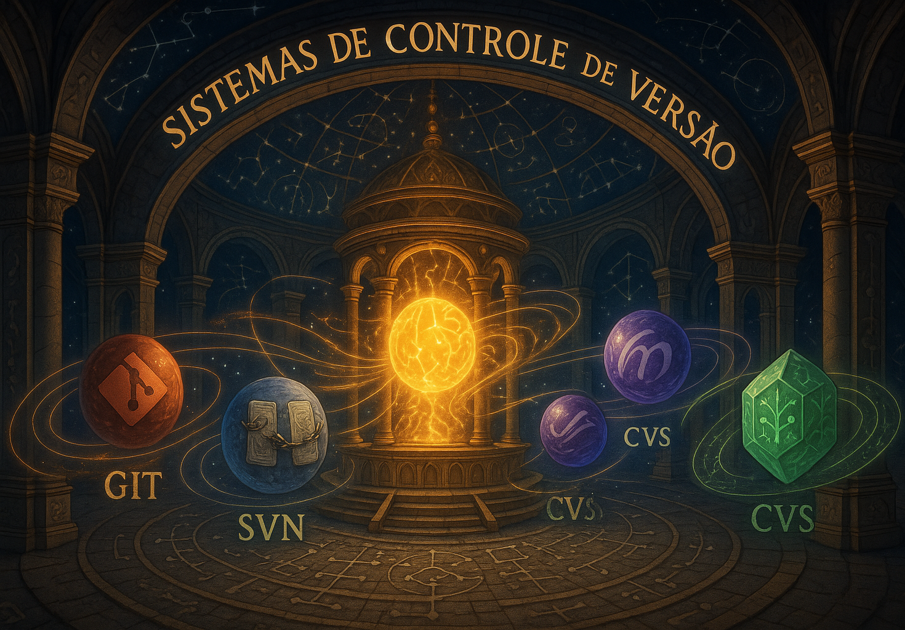

  

 

# Sistemas de Controle de Versão

**Sistemas de Controle de Versão** são ferramentas fundamentais no desenvolvimento de software moderno, responsáveis por **registrar, acompanhar e gerenciar todas as alterações realizadas no código-fonte de um projeto ao longo do tempo**. Eles permitem que desenvolvedores **trabalhem de forma colaborativa, segura e organizada**, mesmo em equipes distribuídas ou projetos de larga escala.

Enquanto o código evolui com novas funcionalidades, correções de erros e melhorias de desempenho, é o **Sistema de Controle de Versão (SCV)** que mantém o histórico completo das modificações, **facilitando o rastreamento de mudanças, o retorno a versões anteriores e a fusão de contribuições feitas em paralelo**. Sem um SCV, seria extremamente difícil coordenar o trabalho em equipe, evitar sobrescritas acidentais ou reverter erros com segurança.

Esses sistemas são essenciais para garantir **controle, transparência e estabilidade no ciclo de vida do software**, além de proporcionarem **estrutura para processos como integração contínua, entrega contínua (CI/CD) e revisão de código**. Em outras palavras, os SCVs são a base que sustenta o desenvolvimento colaborativo e ágil, promovendo **eficiência, confiabilidade e escalabilidade** nos projetos.

Os principais conceitos e funcionalidades associados aos Sistemas de Controle de Versão incluem:

- **Commits**: Unidades de alteração registradas com comentários descritivos, facilitando o entendimento e a rastreabilidade das mudanças.
- **Branches (ramificações)**: Linhas de desenvolvimento independentes que permitem trabalhar em novas funcionalidades, correções ou experimentos sem afetar o código principal.
- **Merge e Rebase**: Processos para combinar alterações feitas em diferentes branches, mantendo a consistência e integridade do código.
- **Histórico de versões**: Registro completo de tudo o que foi feito no projeto, incluindo quem fez, quando e por que, promovendo transparência e auditabilidade.
- **Controle Distribuído vs. Centralizado**: Diferenças entre modelos como o Git (distribuído) e o Subversion (centralizado), com impactos nos fluxos de trabalho e na autonomia dos desenvolvedores.
- **Resolução de conflitos**: Mecanismos que ajudam a identificar e resolver sobreposições quando duas ou mais pessoas alteram a mesma parte do código.
- **Tagging e Versionamento Semântico**: Técnicas para marcar pontos importantes no histórico e facilitar o controle de lançamentos e compatibilidade entre versões.

Adotar um Sistema de Controle de Versão traz benefícios concretos como **aumento da produtividade da equipe**, **redução de erros**, **facilidade na manutenção de sistemas** e **agilidade na entrega de novas versões**. Além disso, essas ferramentas são essenciais para viabilizar **fluxos de trabalho modernos**, como **devops**, **trabalho remoto** e **colaboração aberta em projetos de código-fonte livre**.

Em um mercado em constante transformação, onde agilidade, segurança e colaboração são requisitos fundamentais, o uso de Sistemas de Controle de Versão **não é apenas uma escolha técnica — é um requisito indispensável para a criação de software com qualidade, previsibilidade e sustentabilidade ao longo do tempo**.

## Índice de Conteúdos

Abaixo segue o índice com diversos conteúdos sobre sistemas operacionais.

- 
