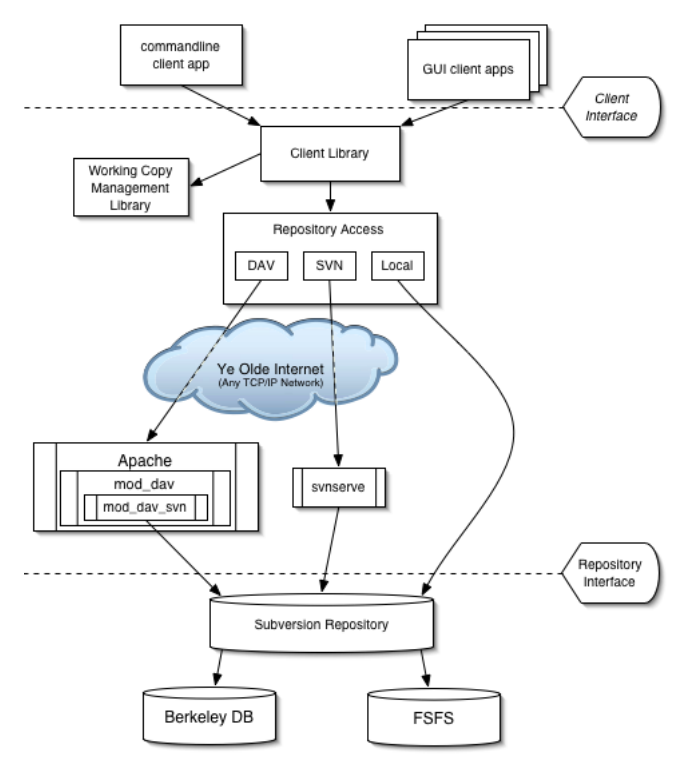

# Capítulo 4 – Subversion (SVN): A Evolução do Modelo Centralizado

Após termos explorado as origens do controle de versão com o CVS e a revolução causada pelo modelo distribuído do Git, é hora de nos aprofundarmos em uma ferramenta que representa um dos capítulos mais importantes na história do desenvolvimento de software: o **Apache Subversion**, universalmente conhecido como **SVN**. O Subversion não surgiu como uma mera alternativa, mas como uma resposta direta e poderosa às limitações e fragilidades do CVS. Seu objetivo, desde o início, foi ambicioso: ser um sistema de controle de versão centralizado, de código aberto, universalmente reconhecido por sua confiabilidade como um "porto seguro" para dados valiosos. Sua filosofia se baseia na simplicidade de seu modelo e na capacidade de atender a uma vasta gama de usuários e projetos, de indivíduos a operações corporativas em grande escala.

Por um longo período, antes que os sistemas distribuídos se tornassem o padrão da indústria, o SVN foi a escolha de fato para equipes que buscavam um sistema robusto, maduro e comprovadamente mais poderoso que o CVS. Estudar o Subversion não é apenas uma aula de história; é entender a evolução do pensamento sobre colaboração e a base sobre a qual muitas práticas de desenvolvimento modernas foram construídas.

## A Arquitetura e Filosofia do Subversion

O Apache™ Subversion® é um sistema de controle de versão (VCS) de código aberto e gratuito, projetado para gerenciar arquivos e diretórios, e as alterações feitas neles, ao longo do tempo. Como vimos com outros sistemas, isso permite que você recupere versões mais antigas de seus dados ou examine o histórico detalhado de como seus dados foram alterados. Nesse sentido, muitas pessoas pensam em um sistema de controle de versão como uma espécie de “máquina do tempo”.

A arquitetura do Subversion é firmemente baseada no modelo **cliente-servidor**. No centro de tudo está o **repositório**, um banco de dados robusto que armazena a totalidade dos dados versionados. Na outra ponta está o **programa cliente Subversion**, que os desenvolvedores usam para gerenciar uma cópia local de partes desses dados versionados. Entre esses dois extremos, existem várias rotas de comunicação através de uma camada de Acesso ao Repositório (RA), algumas das quais passam por redes de computadores e servidores de rede, enquanto outras podem ignorar a rede completamente e acessar o repositório diretamente no sistema de arquivos local.

	

O Subversion pode operar em redes, o que permite que ele seja usado por pessoas em computadores diferentes. Em algum nível, a capacidade de várias pessoas modificarem e gerenciarem o mesmo conjunto de dados de seus respectivos locais promove a colaboração. O progresso pode ocorrer mais rapidamente sem um único canal através do qual todas as modificações devem ocorrer.

É importante notar que, embora seja amplamente utilizado para gerenciar código-fonte, o Subversion é, por design, um sistema de propósito geral. Alguns sistemas de controle de versão também são sistemas de gerenciamento de configuração de software (SCM). Esses sistemas são adaptados especificamente para gerenciar árvores de código-fonte e possuem muitos recursos específicos para desenvolvimento de software, como compreensão nativa de linguagens de programação ou fornecimento de ferramentas para construção de software. O Subversion, no entanto, não é um desses sistemas. É um sistema geral que pode ser usado para gerenciar qualquer coleção de arquivos. Para você, esses arquivos podem ser código-fonte – para outros, qualquer coisa, desde listas de compras de supermercado até mixagens de vídeo digital e muito mais.

### A Posição do SVN no Cenário do Versionamento

Muito mudou desde a época em que o Subversion surgiu. Nos anos seguintes, uma nova metodologia de controle de versão chamada **controle de versão distribuído (DVCS)** ganhou ampla atenção e adoção. Ferramentas como Git e Mercurial rapidamente alcançaram o topo das classificações do sistema de controle de versão distribuído.

O controle de versão distribuído aproveita a crescente onipresença de conexões de rede de alta velocidade e baixos custos de armazenamento para oferecer uma abordagem que difere do modelo centralizado em aspectos importantes. O primeiro e mais óbvio é o fato de que não há um depósito central e remoto de dados versionados. Em vez disso, cada usuário mantém e opera em armazenamentos de dados de histórico de versão local muito profundos– completos, em certo sentido. A colaboração ainda ocorre, mas é realizada trocando conjuntos de alterações (coleções de alterações feitas em itens com versão) diretamente entre os armazenamentos de dados locais dos usuários, não por meio de um armazenamento de dados mestre centralizado. Na verdade, qualquer semelhança com uma fonte “mestre” canônica dos dados versionados de um projeto é apenas por convenção, um status atribuído pelos vários colaboradores desse projeto.

Há prós e contras para cada abordagem. Talvez os dois maiores benefícios fornecidos pelas ferramentas DVCS sejam o desempenho incrível para as operações do dia a dia (porque o armazenamento de dados primário é mantido localmente) e suporte muito melhor para mesclagem entre ramificações (porque os algoritmos de mesclagem servem como o núcleo de como os DVCSs trabalham).

Por outro lado, o controle de versão distribuído é mais complexo do que os sistemas centralizados. Isso se deve ao fato de que, em um DVCS, cada colaborador trabalha em uma cópia local do repositório, que inclui todo o histórico de versões. Essa abordagem aumenta a complexidade porque exige que os usuários gerenciem múltiplas cópias locais e sincronizem suas alterações com outros repositórios. A complexidade do DVCS pode tornar a colaboração mais desafiadora. Em um ambiente onde várias cópias do repositório estão sendo trabalhadas simultaneamente, coordenar alterações e integrá-las sem conflitos requer uma comunicação e gestão cuidadosa.

Portanto, existem algumas desvantagens em usar um DVCS. Eles podem ser mais complexos de configurar e usar do que um CVCS, especialmente para usuários iniciantes. Além disso, o desempenho pode ser um problema para operações que envolvem grandes conjuntos de dados (como clonar um repositório muito grande pela primeira vez). Finalmente, pode-se argumentar que os DVCSs são mais vulneráveis a certos tipos de desafios de segurança do que os CVCSs, pois a superfície de ataque é maior (múltiplos repositórios para proteger) em vez de um único servidor central.

## A Estrutura do Repositório: Trunk, Branches e Tags

Uma das contribuições mais duradouras do Subversion para o mundo do versionamento foi a popularização de uma convenção para estruturar o repositório. Embora não seja uma regra imposta pelo software, a seguinte estrutura de diretórios de alto nível tornou-se o padrão de fato para quase todos os projetos SVN:

- **Repositório (Repository):** É o "coração" de qualquer sistema de controle de versão. É o principal lugar onde os desenvolvedores podem guardar seu trabalho, onde não depositam apenas arquivos como também o histórico completo do desenvolvimento.
- **Trunk:** A pasta `trunk` contém os projetos que estão em desenvolvimento. É considerada a linha principal de desenvolvimento. Nela será salva, diariamente, as atualizações efetuadas pela equipe.
- **Branches:** É a pasta que contém "linhas de desenvolvimento" de um determinado projeto. Podem haver poucas diferenças entre elas, porém uma independe da outra. Uma `branch` é tipicamente uma cópia do `trunk` feita para se trabalhar em uma nova funcionalidade de grande porte ou para estabilizar uma versão para lançamento, sem interromper o desenvolvimento no `trunk`. No momento que a equipe decide que o projeto está pronto para ser liberado como uma versão, a pasta `trunk` é copiada para a pasta `branches` e um nome de versão é dado. Este branch é então congelado e não sofre mais alterações de funcionalidades, apenas correções de bugs e testes.
- **Tags:** Quando os testes são efetuados em uma `branch` e concluídos, a versão em que se encontra é copiada para a pasta `tags`, formando uma versão liberada, ou `release`. Nesse momento, a `tag` é empacotada e pode ser enviada ao cliente. Qualquer alteração de correção feita na `branch` de lançamento deve ser mesclada para a `tag` após a finalização dos testes. O SVN considera uma `tag` apenas uma variação de uma `branch`; na prática, é isso mesmo, ela é uma cópia exata de uma `branch`, apenas uma ramificação da árvore de versões que, por convenção, não deve ser alterada.
- **Working copy:** É uma cópia local de uma parte do repositório (seja do `trunk`, de uma `branch` ou de uma `tag`). O repositório é compartilhado por toda a equipe e não pode ser modificado diretamente. A `working copy` é um local de trabalho privado onde os desenvolvedores podem fazer seu trabalho de forma isolada do resto de sua equipe.

## A Arquitetura Técnica e o Ecossistema SVN

O Subversion, uma vez instalado, possui várias peças diferentes. A seguir, uma visão geral detalhada do que você obtém.

|**Componente**|**Descrição**|
|---|---|
|`svn`|O programa cliente de linha de comando. Esta é a ferramenta principal que os desenvolvedores usam para interagir com o repositório, executando comandos como `checkout`, `commit`, `update`, etc.|
|`svnversion`|Um programa utilitário para relatar o estado de uma cópia de trabalho. Ele informa em qual revisão a cópia de trabalho se encontra, útil para scripts de build e integração contínua.|
|`svnlook`|Uma ferramenta para inspecionar diretamente um repositório Subversion no servidor. Permite visualizar o conteúdo, histórico e estrutura sem a necessidade de uma cópia de trabalho. Muito usado em scripts de "hook" do lado do servidor.|
|`svnadmin`|A ferramenta administrativa para criar, ajustar ou reparar um repositório Subversion. Usada para tarefas como criar um novo repositório, fazer backups (`dump`) e restaurar (`load`).|
|`mod_dav_svn`|Um módulo de plug-in para o Servidor HTTP Apache. É uma maneira robusta de disponibilizar seu repositório para outras pessoas em uma rede, aproveitando os recursos de autenticação, autorização e criptografia (SSL/TLS) do Apache.|
|`svnserve`|Um programa de servidor autônomo, leve e customizado. É uma alternativa mais simples ao Apache e pode ser executado como um processo daemon ou invocado via SSH.|
|`svndumpfilter`|Um programa para filtrar fluxos de despejo (`dump`) do repositório Subversion, permitindo, por exemplo, extrair um único projeto de um dump que contém vários.|
|`svnsync`|Um programa para espelhar incrementalmente um repositório para outro em uma rede, útil para criar réplicas de leitura ou backups a quente.|
|`svnrdump`|Um programa para realizar `dumps` e `loads` do histórico de um repositório através de uma conexão de rede, sem necessitar de acesso direto ao sistema de arquivos do servidor.|

### O Servidor `svnserve`

O Subversion foi projetado com uma camada de acesso ao repositório abstrata. Isso significa que, em teoria, o Subversion pode usar um número infinito de implementações de rede. Na prática, existem dois servidores Subversion em uso generalizado hoje: o módulo para Apache e o `svnserve`.

O `svnserve` é um programa servidor pequeno e leve que conversa com os clientes através de um protocolo personalizado e stateful. Como seu protocolo é explicitamente projetado para o Subversion (diferente do HTTP, que é stateless), ele fornece operações de rede significativamente mais rápidas. Embora possa usar SASL para fornecer uma variedade de opções de autenticação e criptografia, ele não possui recursos avançados como registro detalhado ou uma interface de navegação web integrada. No entanto, é extremamente fácil de configurar e geralmente é a melhor opção para equipes pequenas que estão começando com o Subversion.

O protocolo de rede que o `svnserve` utiliza também pode ser encapsulado em uma conexão SSH. Esta opção de implantação difere bastante de uma implantação tradicional do `svnserve`:

- **Criptografia e Autenticação:** O SSH é usado para criptografar todas as comunicações e também para a autenticação. Isso requer que os usuários tenham contas reais no sistema operacional do servidor, diferente do `svnserve` padrão, que possui seu próprio arquivo de contas de usuário privadas.
- **Permissões:** Como esta configuração requer que cada usuário gere um processo `svnserve` privado e temporário, é equivalente (do ponto de vista das permissões) a permitir que um grupo de usuários locais acesse o repositório via `file://`. O controle de acesso baseado em caminho (`path-based access control`) não tem significado aqui, pois cada usuário está, efetivamente, acessando diretamente os arquivos do banco de dados do repositório.

## O Ciclo de Trabalho e os Comandos Essenciais

O Subversion tem vários recursos e opções, mas no dia-a-dia, é provável que você use apenas alguns deles. O ciclo de trabalho típico é assim:

1. **Atualize sua cópia de trabalho.** Isso envolve o uso do comando `svn update`.
2. **Faça suas alterações.** As alterações mais comuns que você fará são edições no conteúdo de seus arquivos existentes. Mas às vezes você precisa adicionar, remover, copiar e mover arquivos e diretórios—os comandos `svn add`, `svn delete`, `svn copy` e `svn move` lidam com esses tipos de mudanças estruturais dentro da cópia de trabalho.
3. **Revise suas alterações.** Os comandos `svn status` e `svn diff` são críticos para revisar as mudanças que você fez em sua cópia de trabalho.
4. **Corrija seus erros.** Ninguém é perfeito, então, ao revisar suas alterações, você pode identificar algo que não está certo. Às vezes, a maneira mais fácil de corrigir um erro é começar tudo de novo do zero. O comando `svn revert` restaura um arquivo ou diretório para seu estado não modificado.
5. **Resolva quaisquer conflitos (mescle as alterações de outras pessoas).** No tempo que você leva para fazer e revisar suas alterações, outras pessoas também podem ter feito e publicado alterações. Você desejará integrar suas alterações em sua cópia de trabalho para evitar possíveis cenários de desatualização ao tentar publicar a sua própria. Novamente, o comando `svn update` é a maneira de fazer isso. Se isso resultar em conflitos locais, você precisará resolvê-los usando o comando `svn resolve`.
6. **Publique (comite) suas alterações.** O comando `svn commit` transmite suas alterações para o repositório onde, se forem aceitas, elas criam as versões mais recentes de todas as coisas que você modificou. Agora, outras pessoas também podem ver seu trabalho!

## Resolvendo os Problemas do CVS: Os Superpoderes do Subversion

O Subversion não foi apenas uma nova ferramenta; foi uma reengenharia completa que abordou diretamente as falhas mais críticas do CVS. Abaixo, apresentamos os recursos que o tornaram tão superior.

|**Recurso**|**Descrição**|
|---|---|
|**Possui a maioria dos recursos do CVS**|O Subversion igualou ou excedeu o conjunto de recursos do CVS onde esses recursos continuavam aplicáveis ao seu novo design.|
|**Diretórios são versionados**|O Subversion trata diretórios como objetos de primeira classe, assim como os arquivos, rastreando suas adições, remoções e renomeações.|
|**Copiar, excluir e renomear são versionados**|Essas operações são todas registradas no histórico, preservando a linhagem dos arquivos.|
|**Metadados com versão ("propriedades")**|Permite que metadados arbitrários (pares chave/valor) sejam anexados a qualquer arquivo ou diretório e versionados junto com eles.|
|**Commits Atômicos**|Nenhuma parte de um commit entra em vigor até que todo o commit seja bem-sucedido. Isso garante a consistência do repositório.|
|**Branches e Tags são operações baratas**|Implementadas como "cópias" de tempo constante, tornando a criação de ramificações e etiquetas extremamente rápida e eficiente.|
|**Mesclar rastreamento (Merge tracking)**|O sistema automatiza e auxilia no gerenciamento do fluxo de alterações entre as linhas de desenvolvimento (branches).|
|**Bloqueio de arquivos (File locking)**|Suporta o bloqueio de arquivos para que os usuários possam ser avisados quando várias pessoas tentam editar o mesmo arquivo, útil para arquivos binários não mescláveis.|
|**Links simbólicos podem ser versionados**|Permite que usuários de sistemas Unix coloquem links simbólicos sob controle de versão.|
|**Opção de servidor autônomo (svnserve)**|Oferece um servidor leve e customizado como alternativa ao Apache HTTPD, que pode ser encapsulado em SSH para segurança.|
|**Design de biblioteca em camadas**|O código é estruturado como um conjunto de módulos com APIs limpas, projetado para ser chamado por outras aplicações.|
|**Arquivos binários manipulados de forma eficiente**|Usa um algoritmo de diferenciação binária para transmitir e armazenar revisões sucessivas, tornando-o tão eficiente com arquivos binários quanto com arquivos de texto.|

Vamos detalhar os avanços mais impactantes que o Subversion introduziu:

### Commits Atômicos: A Garantia de Consistência

Esta é a melhoria mais importante sobre o CVS. No Subversion, cada `commit` é uma **transação atômica**. Isso significa que a operação de `commit`, mesmo que envolva múltiplos arquivos e diretórios, ou é bem-sucedida em sua totalidade, ou falha por completo. O repositório nunca é deixado em um estado inconsistente, com apenas parte das alterações aplicadas. Além disso, o SVN gera um **número de revisão global** para cada commit, em vez de um número de revisão por arquivo, tornando muito mais fácil referenciar um estado consistente do projeto inteiro.

### Gerenciamento de Arquivos e Diretórios

No CVS, o histórico estava atrelado ao arquivo. Se você renomeasse `a.txt` para `b.txt`, o sistema via isso como a exclusão de `a.txt` e a criação de um novo arquivo, `b.txt`, perdendo toda a linhagem de alterações. O Subversion introduziu operações de renomeação (`svn move`) e cópia (`svn copy`) que são registradas no histórico. Agora, o sistema sabe que `b.txt` é a continuação de `a.txt`, preservando seu histórico completo. O mesmo se aplica aos diretórios, que são tratados como objetos de primeira classe.

### Tudo é Versionado: Arquivos, Diretórios e Metadados

Diferente do CVS, o Subversion trata **diretórios como cidadãos de primeira classe**, assim como os arquivos. Isso significa que operações como adicionar, remover, copiar e renomear diretórios são todas versionadas e fazem parte do histórico. Além disso, o SVN permite que **metadados arbitrários**, chamados de "propriedades" (pares chave/valor), sejam anexados a qualquer arquivo ou diretório e sejam versionados junto com eles.

### Branches e Tags como Operações Rápidas

Enquanto no CVS a criação de ramificações era um processo complexo e pesado, o Subversion implementa essa funcionalidade através de uma operação de **cópia barata (cheap copy)**. Quando você cria uma branch ou uma tag, o SVN não duplica fisicamente todos os arquivos. Em vez disso, ele cria uma cópia virtual que aponta para as versões existentes, de forma semelhante a um link. Isso torna a criação de branches e tags uma operação de tempo constante, ou seja, extremamente rápida, independentemente do tamanho do projeto, incentivando seu uso.

### Rastreamento de Merges (Merge Tracking)

A partir da versão 1.5, o Subversion introduziu o recurso de **rastreamento de merges**. O sistema passa a "lembrar" quais alterações já foram mescladas entre diferentes branches. Isso automatiza e simplifica enormemente o processo de mesclar uma branch de funcionalidades de volta ao `trunk`, evitando que as mesmas alterações sejam mescladas repetidamente e ajudando a gerenciar o fluxo de mudanças em cenários de desenvolvimento complexos.

## SVN vs. DVCS: Uma Análise Comparativa

Com a ascensão de ferramentas como o Git, a discussão entre os modelos centralizado e distribuído tornou-se central. Cada abordagem tem seus prós e contras.

- **Complexidade vs. Simplicidade:** O modelo distribuído (DVCS) é inerentemente mais complexo. Cada colaborador possui uma cópia completa do repositório, e a sincronização ocorre trocando conjuntos de alterações entre esses múltiplos repositórios. Isso exige que os usuários entendam conceitos como repositórios remotos, `fetch`, `pull` e `push`. O modelo centralizado do SVN é conceitualmente mais simples: existe uma única fonte de verdade (o servidor), e os comandos (`update`, `commit`) são diretos e fáceis de entender para iniciantes.
- **Performance e Trabalho Offline:** Talvez a maior vantagem do DVCS seja a performance. Como o repositório inteiro está local, operações como visualizar o histórico (`log`), comparar versões (`diff`) e fazer commits são quase instantâneas. No SVN, essas operações frequentemente exigem comunicação com o servidor, introduzindo latência de rede. O modelo distribuído também permite trabalho offline completo.
- **Gerenciamento e Controle:** Em ambientes corporativos que exigem controle de acesso granular por diretório, o modelo centralizado do SVN pode ser mais fácil de administrar. Como toda a autorização acontece no servidor, é simples configurar regras como "A equipe de UI só pode escrever no diretório `/assets/css`". Em um DVCS, o controle de acesso é geralmente aplicado no nível do repositório inteiro.

Em resumo, não existe uma "melhor" abordagem para todos os casos. A escolha depende das necessidades do projeto, da cultura da equipe e dos requisitos de segurança e gerenciamento.

## Referência de Comandos Subversion

A seguir está uma lista de referência dos comandos mais comuns do `svn`. Não é necessário memorizá-la, mas sim usá-la como um guia de consulta. A documentação completa e definitiva pode ser encontrada no livro oficial do Subversion ("The SVN Book").

|**Comando**|**Descrição**|
|---|---|
|`svn add`|Adiciona arquivos, diretórios ou links simbólicos.|
|`svn blame (praise, annotate, ann)`|Mostra informações de autor e revisão em linha para os arquivos ou URLs especificados.|
|`svn cat`|Exibe o conteúdo dos arquivos ou URLs especificados.|
|`svn changelist (cl)`|Associa (ou desassocia) caminhos locais com um `changelist`.|
|`svn checkout (co)`|Faz o check-out de uma cópia de trabalho de um repositório.|
|`svn cleanup`|Limpa recursivamente a cópia de trabalho.|
|`svn commit (ci)`|Envia alterações da sua cópia de trabalho para o repositório.|
|`svn copy (cp)`|Copia um arquivo ou diretório em uma cópia de trabalho ou no repositório.|
|`svn delete (del, remove, rm)`|Apaga um item de uma cópia de trabalho ou do repositório.|
|`svn diff (di)`|Mostra as diferenças entre duas revisões ou caminhos.|
|`svn export`|Exporta uma árvore de diretórios limpa.|
|`svn help (h,?)`|Fornece ajuda sobre o comando especificado.|
|`svn import`|Envia um arquivo ou árvore de diretórios não versionada para o repositório.|
|`svn info`|Exibe informações sobre um item local ou remoto.|
|`svn list (ls)`|Lista as entradas do diretório no repositório.|
|`svn lock`|Bloqueia caminhos de cópia de trabalho ou URLs no repositório para que nenhum outro usuário possa enviar alterações neles.|
|`svn log`|Exibe mensagens de log de commit.|
|`svn merge`|Aplica as diferenças entre duas fontes a um caminho de cópia de trabalho.|
|`svn mergeinfo`|Consulta informações relacionadas à mesclagem.|
|`svn mkdir`|Cria um novo diretório sob controle de versão.|
|`svn move (mv)`|Move um arquivo ou diretório.|
|`svn patch`|Aplica mudanças representadas em um patch `unidiff` à cópia de trabalho.|
|`svn propdel (pdel, pd)`|Remove uma propriedade de um item.|
|`svn propedit (pedit, pe)`|Edita a propriedade de um ou mais itens sob controle de versão.|
|`svn propget` (pget, pg)|Imprime o valor de uma propriedade.|
|`svn proplist` (plist, pl)|Lista todas as propriedades.|
|`svn relocate`|Realoca a cópia de trabalho para apontar para uma URL raiz de repositório diferente.|
|`svn resolve`|Resolve conflitos em arquivos ou diretórios de cópia de trabalho.|
|`svn revert`|Desfaz todas as edições locais.|
|`svn status` (stat, st)|Imprime o status dos arquivos e diretórios da cópia de trabalho.|
|`svn switch` (sw)|Atualiza a cópia de trabalho para uma URL diferente.|
|`svn unlock`|Desbloqueia caminhos de cópia de trabalho ou URLs.|
|`svn update` (up)|Atualiza sua cópia de trabalho.|
|`svn upgrade`|Atualiza o formato de armazenamento de metadados para uma cópia de trabalho.|

## Considerações Finais

Neste capítulo, dissecamos o Apache Subversion, não apenas como uma ferramenta, mas como um marco evolutivo no controle de versão. Entendemos que o SVN surgiu como uma resposta direta e necessária às limitações do CVS, trazendo consigo um novo padrão de robustez para o modelo centralizado.

Os conceitos de **commits atômicos**, o **versionamento completo de diretórios e metadados**, e a implementação de **branches e tags como operações eficientes** foram as inovações que solidificaram o SVN como a escolha principal para incontáveis projetos por mais de uma década. A estrutura `trunk/branches/tags` que ele popularizou tornou-se uma das práticas mais influentes na organização de projetos de software.

Analisamos em profundidade sua arquitetura, os componentes que formam seu ecossistema e as diferentes maneiras de disponibilizar um repositório, como o leve `svnserve` e o robusto `mod_dav_svn` para Apache. Detalhamos o ciclo de trabalho disciplinado que ele promove, garantindo uma colaboração mais segura e organizada.

Ao comparar o SVN com os sistemas distribuídos como o Git, compreendemos os trade-offs entre a simplicidade do modelo centralizado e a flexibilidade e performance do modelo distribuído. O Subversion representa o auge da era centralizada; um sistema confiável, maduro e que ainda hoje é utilizado em muitos ambientes que valorizam sua simplicidade e seu modelo de governança centralizado. Estudar o SVN é, portanto, essencial para qualquer profissional que deseje ter uma compreensão completa da paisagem do controle de versão, reconhecendo a importância da evolução e os diferentes caminhos que nos trouxeram até as ferramentas de hoje.