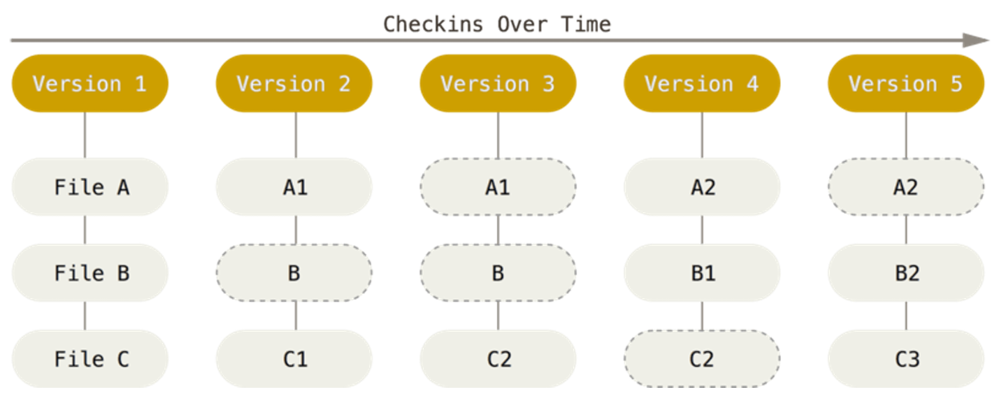

# Capítulo 3 – Git: A Revolução do Controle de Versão Distribuído

Nos capítulos anteriores, viajamos pela história dos Sistemas de Controle de Versão, entendendo o modelo centralizado que o CVS popularizou. Vimos como essa abordagem resolveu problemas básicos de colaboração, mas também como ela introduziu suas próprias limitações, notadamente a dependência de um servidor central e a falta de operações atômicas. O mundo da tecnologia, sempre em busca de mais eficiência, velocidade e flexibilidade, precisava de um novo paradigma.

É neste ponto da história que surge o **Git**. O Git não é apenas uma melhoria incremental; ele representa uma mudança fundamental na filosofia de como o controle de versão é feito. Neste capítulo, vamos mergulhar no que torna o Git a ferramenta de versionamento mais dominante do mundo, explorando sua arquitetura distribuída, sua filosofia de design e os comandos essenciais que formam a base do seu poder.

## A Evolução dos Modelos de Versionamento

Para entender por que o Git é tão revolucionário, precisamos primeiro entender a jornada que nos trouxe até ele. O controle de versão evoluiu através de três modelos principais.

### O Ponto de Partida: Sistemas de Controle de Versão Locais (VCS)

O método mais básico de controle de versão, que muitas pessoas ainda usam instintivamente, é copiar arquivos para outro diretório, talvez adicionando uma data ou um número de versão ao nome da pasta. Esta abordagem, embora melhor do que nada, é extremamente propensa a erros. É fácil esquecer em qual diretório você está e acidentalmente sobrescrever o arquivo errado.

Para resolver isso, os primeiros VCSs formais foram criados como ferramentas locais. Eles utilizavam um banco de dados simples na máquina do próprio usuário para rastrear as alterações.

<div align="center">
  
</div>

Uma das ferramentas mais populares dessa era foi o **RCS (Revision Control System)**, que ainda hoje pode ser encontrado em muitos sistemas operacionais. O RCS funcionava mantendo "conjuntos de alterações" (as diferenças entre as versões de um arquivo) em um formato especial no disco. Com isso, ele conseguia reconstruir qualquer versão de um arquivo a qualquer momento, somando as diferenças necessárias.

### A Era da Colaboração: Sistemas Centralizados (CVCS)

O grande problema dos sistemas locais era a dificuldade de colaboração. Para resolver isso, foram desenvolvidos os **Sistemas de Controle de Versão Centralizados (CVCSs)**, como o Subversion e o CVS, que exploramos no capítulo anterior.

Neste modelo, há um único servidor que contém o repositório central com todos os arquivos versionados. Os desenvolvedores (clientes) se conectam a esse servidor para baixar (`checkout`) os arquivos e enviar (`commit`) suas alterações.

<div align="center">
  
</div>

Este modelo oferece vantagens claras: os administradores têm controle refinado sobre quem pode fazer o quê, e todos na equipe têm uma visão do que os outros estão fazendo. No entanto, sua principal fraqueza é o **ponto único de falha**. Se o servidor central ficar offline, ninguém pode colaborar ou salvar novas versões. Pior ainda, se o disco do servidor for corrompido e não houver backups, todo o histórico do projeto pode ser perdido para sempre.

### A Mudança de Paradigma: Sistemas Distribuídos (DVCS)

É aqui que o Git entra em cena, como parte da família dos **Sistemas de Controle de Versão Distribuídos (DVCS)**. Outras ferramentas notáveis nesta categoria incluem Mercurial, Bazaar e Darcs.

Em um DVCS, os clientes não apenas baixam a última versão dos arquivos; eles **clonam (duplicam) o repositório completo** em suas máquinas locais. Isso significa que cada desenvolvedor tem em seu computador uma cópia integral de todo o histórico do projeto.

<div align="center">
  
</div>

Esta arquitetura tem consequências profundas:

- **Redundância e Segurança:** Se o servidor principal (se houver um) falhar, qualquer um dos repositórios dos clientes pode ser usado para restaurá-lo. Cada clone é, na prática, um backup completo de todos os dados.
- **Fluxos de Trabalho Flexíveis:** Como cada desenvolvedor tem um repositório completo, é possível configurar múltiplos fluxos de trabalho. Vários desenvolvedores podem sincronizar seus repositórios entre si sem a necessidade de um servidor central, ou podem usar um servidor central apenas como um ponto de convenção. Isso permite modelos hierárquicos e outras formas de colaboração que não são possíveis em sistemas centralizados.

## O Nascimento do Git: Uma Breve História

Como muitas tecnologias disruptivas, o Git nasceu de uma necessidade e uma controvérsia. O kernel do Linux é um dos maiores e mais importantes projetos de código aberto do mundo. Entre 1991 e 2002, as alterações no seu código eram gerenciadas de forma semi-manual, através de patches e arquivos compactados. Em 2002, o projeto começou a usar um DVCS comercial chamado **BitKeeper**.

Em 2005, a relação entre a comunidade do Linux e a empresa por trás do BitKeeper se desgastou, e a ferramenta deixou de ser gratuita para o projeto. Este evento forçou a comunidade, e em especial **Linus Torvalds** (o criador do Linux), a desenvolver sua própria ferramenta, baseada nas lições aprendidas com o BitKeeper.

Os objetivos para este novo sistema eram ambiciosos e claros:

- **Velocidade:** Tinha que ser extremamente rápido.
- **Projeto Simples:** A arquitetura interna deveria ser o mais simples possível.
- **Suporte Forte para Desenvolvimento Não-Linear:** Precisava lidar com milhares de ramificações (branches) paralelas de forma eficiente.
- **Completamente Distribuído:** Nenhum servidor central deveria ser necessário.
- **Capacidade de Lidar com Grandes Projetos:** Deveria ser capaz de gerenciar projetos da escala do kernel do Linux com eficiência (tanto em velocidade quanto em tamanho dos dados).

Desde seu nascimento em 2005, o Git evoluiu e amadureceu, mantendo essas qualidades iniciais. Ele é incrivelmente rápido, eficiente com projetos grandes e possui um sistema de ramificações que revolucionou o desenvolvimento não linear.

## A Filosofia do Git: Entendendo os Fundamentos

Para usar o Git de forma eficaz, é crucial entender sua filosofia interna, que é diferente da maioria dos outros sistemas.

### Snapshots, Não Diferenças

A principal diferença entre o Git e quase qualquer outro VCS (como Subversion, Perforce, etc.) é a maneira como ele enxerga e armazena seus dados. Conceitualmente, a maioria dos outros sistemas armazena informações como uma **lista de alterações baseadas em arquivos (deltas)**. Eles pensam no histórico como "Arquivo A, versão 1; depois, estas linhas foram alteradas no Arquivo A para criar a versão 2".

<div align="center">
  
</div>

O Git não funciona assim. Em vez disso, o Git trata seus dados mais como um **conjunto de instantâneos (snapshots) de um sistema de arquivos em miniatura**. Toda vez que você faz um `commit` (salva o estado do seu projeto), o Git basicamente tira uma "foto" de como todos os seus arquivos estão naquele momento e armazena uma referência para esse snapshot. Para ser eficiente, se os arquivos não foram alterados de um commit para o outro, o Git não armazena o arquivo novamente; ele apenas cria um link para a versão idêntica anterior que já está armazenada.

<div align="center">
  
</div>

Essa abordagem de snapshots faz com que o Git se comporte mais como um mini-sistema de arquivos com ferramentas poderosas sobre ele, em vez de apenas um VCS tradicional.

### Integridade Acima de Tudo: O Papel do SHA-1

Tudo no Git passa por uma **soma de verificação (checksum)** antes de ser armazenado, e é referenciado por esse checksum depois. Isso torna impossível alterar o conteúdo de qualquer arquivo ou diretório sem que o Git saiba. Esta funcionalidade está na base da filosofia do Git. Você não pode perder informações em trânsito ou ter um arquivo corrompido no repositório sem que o Git detecte.

O mecanismo que o Git usa para isso é um **hash SHA-1**. Trata-se de uma sequência de 40 caracteres hexadecimais (0-9 e a-f), calculada com base no conteúdo do arquivo ou da estrutura do diretório. Um hash SHA-1 se parece com isto:

```
24b9da6552252987aa493b52f8696cd6d3b00373
```

Você verá esses hashes por toda parte ao usar o Git, pois ele os usa para tudo. Na verdade, o Git armazena tudo em seu banco de dados não pelo nome do arquivo, mas pelo valor do hash de seu conteúdo.

### Quase Todas as Operações São Locais

Como cada desenvolvedor tem uma cópia completa do repositório em sua máquina, a maioria das operações no Git precisa apenas de arquivos e recursos locais. Se você está acostumado com a latência de rede dos CVCSs, o Git parecerá incrivelmente rápido. Para navegar no histórico de um projeto, por exemplo, o Git não precisa se conectar a um servidor; ele lê diretamente do seu banco de dados local, e o resultado é quase instantâneo.

Isso também significa que você pode fazer quase tudo enquanto está offline. Se você está em um avião ou trem, pode continuar trabalhando: fazendo commits, criando branches, visualizando o histórico. Quando tiver uma conexão de rede novamente, você pode sincronizar suas alterações. Em muitos outros sistemas, isso é impossível ou muito complicado.

### O Princípio da Adição de Dados

Quando você realiza ações no Git, na maioria das vezes, você está apenas **adicionando dados** ao banco de dados do Git. É muito difícil fazer o sistema apagar dados ou realizar uma ação que não seja reversível. Assim como em qualquer VCS, você pode perder alterações que ainda não foram "commitadas". Mas, uma vez que você faz um commit de um snapshot, é extremamente difícil perdê-lo, especialmente se você sincroniza regularmente com outros repositórios. Isso torna o uso do Git uma experiência muito segura, pois você sabe que pode experimentar sem o perigo de estragar permanentemente o seu trabalho.

## Os Três Estados: O Coração do Fluxo de Trabalho do Git

Agora, preste atenção. Este é o conceito mais importante a ser lembrado sobre o Git para que todo o resto do seu aprendizado flua sem problemas. O Git tem **três estados principais** nos quais seus arquivos podem residir: **commited (consolidado)**, **modified (modificado)** e **staged (preparado)**.

- **Modified (Modificado):** Você alterou o arquivo, mas ainda não o salvou no seu banco de dados local.
- **Staged (Preparado):** Você marcou a versão atual de um arquivo modificado para fazer parte do seu próximo commit.
- **Committed (Consolidado):** Os dados estão armazenados de forma segura em seu banco de dados local.

Estes três estados correspondem a três seções de um projeto Git:

1. **O Diretório de Trabalho (Working Directory):** É uma cópia local de uma versão específica do projeto. São os arquivos que você vê e edita no seu sistema de arquivos.
2. **A Área de Preparo (Staging Area):** É um arquivo, geralmente contido no diretório Git, que armazena informações sobre o que exatamente entrará no seu próximo commit. É um passo intermediário que permite construir um commit com precisão.
3. **O Diretório Git (Repositório):** É onde o Git armazena os metadados e o banco de dados de objetos do seu projeto. Esta é a parte mais importante do Git, e é o que é copiado quando você clona um repositório.

<div align="center">
  
</div>

O fluxo de trabalho básico no Git, portanto, é o seguinte:

1. Você modifica arquivos no seu **diretório de trabalho**.
2. Você seleciona as alterações que deseja incluir no próximo commit e as adiciona à **área de preparo** (um processo chamado "staging").
3. Você faz um `commit`, que pega os arquivos como eles estão na área de preparo e armazena esse snapshot de forma permanente no seu **diretório Git**.

## Gerenciando o Repositório: Comandos Essenciais

A interação com o Git é realizada através de comandos que manipulam esses três estados. A seguir, apresentamos os comandos mais importantes, agrupados por sua função no fluxo de trabalho.

### Configuração Inicial e Criação

Antes de tudo, você precisa configurar o Git e criar um repositório.

|**Comando**|**Descrição**|
|---|---|
|`git config --global user.name "Seu Nome"`|Define o nome do autor para todos os seus commits.|
|`git config --global user.email "seu@email.com"`|Define o email do autor para todos os seus commits.|
|`git init`|**Cria um novo repositório Git** em um diretório existente.|
|`git clone git@servidor:usuario/repositorio.git`|**Clona um repositório remoto** já existente para a sua máquina local.|

### O Fluxo Básico de Trabalho

Estes são os comandos que você usará dezenas de vezes ao dia.

|**Comando**|**Descrição**|
|---|---|
|`git status`|**Verifica o estado dos seus arquivos** e diretórios, mostrando quais estão modificados, preparados ou não rastreados.|
|`git add <arquivo>`|**Adiciona um arquivo à área de preparo (staging area)**. Use `git add .` para adicionar todas as alterações atuais.|
|`git commit -m "Mensagem descritiva"`|**Grava um snapshot permanente** dos arquivos da área de preparo no histórico do repositório. A mensagem é obrigatória e deve descrever a alteração.|
|`git rm <arquivo>`|**Remove um arquivo** tanto do diretório de trabalho quanto da área de preparo.|

### Analisando o Histórico

Visualizar o que aconteceu no projeto é fundamental.

|**Comando**|**Descrição**|
|---|---|
|`git log`|**Exibe o histórico de commits**, do mais recente ao mais antigo.|
|`git log -p -2`|Mostra o histórico com o **diff (diferenças) das duas últimas alterações**.|
|`git log --stat`|Exibe um **resumo do histórico**, mostrando quais arquivos foram alterados e quantas linhas foram adicionadas/removidas.|
|`git log --pretty=format:"%h - %an, %ar : %s"`|Formata a saída do log. Este exemplo mostra hash abreviado, autor, data relativa e comentário.|
|`git blame <arquivo>`|Mostra, para cada linha de um arquivo, **qual commit e autor a modificou pela última vez**.|
|`git diff`|Mostra as diferenças entre o diretório de trabalho e a área de preparo.|

### Trabalhando com Repositórios Remotos

O poder do Git se manifesta na colaboração através de repositórios remotos.

|**Comando**|**Descrição**|
|---|---|
|`git remote -v`|**Exibe os repositórios remotos** configurados.|
|`git remote add origin <url_remoto>`|**Vincula seu repositório local a um repositório remoto**, dando-lhe o apelido "origin".|
|`git fetch`|**Busca as alterações** do repositório remoto, mas não as aplica ao seu branch atual.|
|`git pull`|**Busca e mescla (merge)** as alterações do repositório remoto no seu branch atual. É uma combinação de `git fetch` e `git merge`.|
|`git push -u origin master`|**Envia seus commits** do branch local "master" para o repositório remoto "origin".|

### Ignorando Arquivos com `.gitignore`

Muitas vezes, um projeto gera arquivos que não devem ser colocados sob controle de versão, como arquivos de compilação, logs ou dependências de pacotes. Para isso, utiliza-se um arquivo especial chamado `.gitignore`.

Este arquivo de texto simples especifica padrões de nomes de arquivos e diretórios que o Git deve ignorar intencionalmente. Cada linha no arquivo `.gitignore` representa um padrão. Arquivos que já estão sendo rastreados pelo Git não são afetados por este arquivo; ele só se aplica a arquivos ainda não rastreados. Um projeto normalmente inclui um arquivo `.gitignore` em seu repositório para garantir que todos os colaboradores ignorem os mesmos tipos de arquivos gerados.

## Considerações Finais

Neste capítulo, mergulhamos no Git e na revolução que ele representou para o controle de versão. Partimos da evolução dos modelos de versionamento, compreendendo as limitações dos sistemas locais e centralizados para então apreciar plenamente a robustez e a flexibilidade da arquitetura **distribuída** do Git.

Exploramos a filosofia que guia a ferramenta: o uso de **snapshots** em vez de diferenças, a garantia de **integridade** através de hashes SHA-1, a velocidade das **operações locais** e a segurança de um banco de dados que prioritariamente **adiciona dados**.

O conceito mais crucial que desvendamos foi o **fluxo de trabalho de três estados**, que rege toda a interação com o Git. A jornada de um arquivo através do **Diretório de Trabalho**, da **Área de Preparo (Staging Area)** e, finalmente, do **Repositório Git (Committed)** é o que permite ao desenvolvedor um controle granular e preciso sobre o histórico do seu projeto.

Por fim, apresentamos os comandos essenciais que transformam essa teoria em prática, desde a configuração inicial até a colaboração com repositórios remotos. Com esta base sólida, estamos prontos para explorar os recursos mais avançados do Git nos próximos capítulos, como seu poderoso sistema de ramificações (branching), que é onde a verdadeira magia do desenvolvimento não-linear acontece.