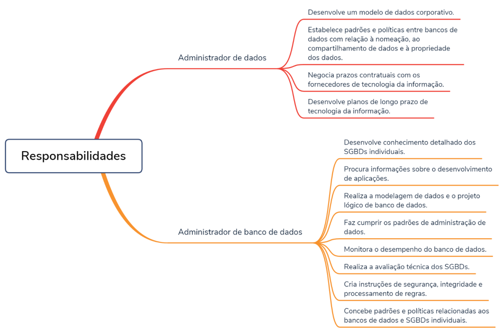
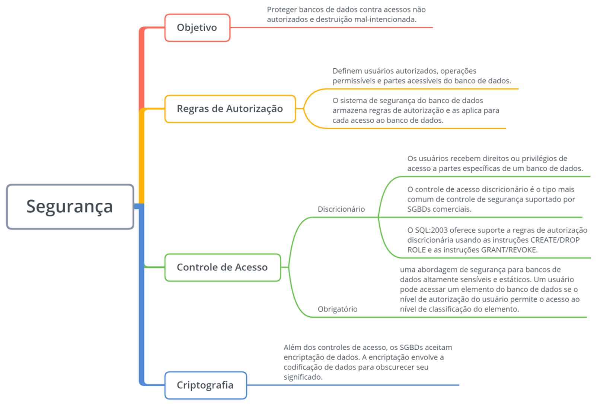
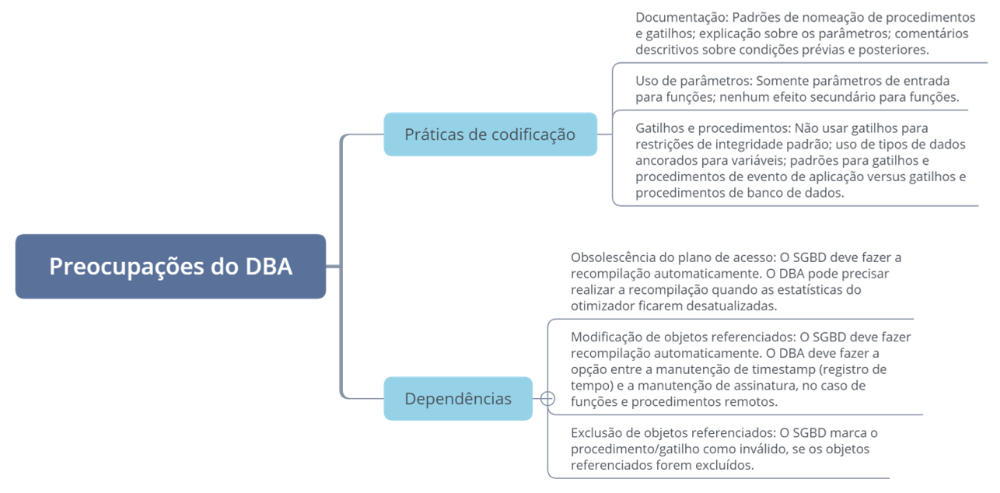

# Capítulo 1 – Fundamentos da Administração de Bancos de Dados

## O Contexto da Gestão de Informações

No cenário corporativo moderno, a informação é, sem dúvida, um dos ativos mais valiosos. A capacidade de coletar, armazenar, processar e analisar dados de forma eficiente e segura é um diferencial competitivo fundamental. Nesse contexto, surgem duas funções gerenciais essenciais, porém distintas, responsáveis por zelar por esse ativo: o **Administrador de Dados (Data Administrator - DA)** e o **Administrador de Banco de Dados (Database Administrator - DBA)**. Embora os termos sejam frequentemente usados de forma intercambiável, suas responsabilidades e escopos de atuação são bastante diferentes.

Compreender essa distinção é o primeiro passo para mergulhar no universo da administração de bancos de dados. Este capítulo fará uma introdução a esse universo, detalhando o papel multifacetado do DBA. Exploraremos as principais tarefas que compõem o dia a dia desse profissional, desde o projeto e a implementação de bancos de dados até o monitoramento contínuo de seu desempenho, a garantia de sua disponibilidade e a implementação de robustos mecanismos de segurança e integridade. Além disso, abordaremos o processo estratégico de seleção e avaliação de Sistemas de Gerenciamento de Banco de Dados (SGBDs) e a importância de gerenciar componentes de lógica de banco de dados, como gatilhos e procedimentos armazenados.

### Administrador de Dados (DA) vs. Administrador de Banco de Dados (DBA)

O **Administrador de Dados (DA)** é um profissional que ocupa uma posição de média ou alta gerência, com uma visão estratégica e abrangente sobre os recursos de informação da organização. Sua preocupação não se limita aos bancos de dados; ele considera todos os tipos de dados, onde quer que estejam — sejam eles estruturados em bancos de dados relacionais, semiestruturados em arquivos XML, não estruturados em documentos, páginas web ou provenientes de fontes externas.

O **Administrador de Banco de Dados (DBA)**, por sua vez, desempenha um papel mais técnico e operacional. Sua responsabilidade é focada na gestão dos bancos de dados individuais e dos SGBDs que os suportam. Enquanto o DA define "o quê" (quais dados são importantes e quais políticas devem regê-los), o DBA define "o como" (como implementar, proteger e otimizar o acesso a esses dados nos SGBDs).

A figura a seguir compara as responsabilidades de ambas as funções, evidenciando o escopo mais amplo e estratégico do Administrador de Dados em contraste com o foco mais técnico e específico do Administrador de Banco de Dados.

<div align="center">
  
</div>

Uma das tarefas mais críticas do Administrador de Dados é o desenvolvimento e a manutenção de um **modelo de dados corporativo**. Este é um modelo conceitual de alto nível que representa de forma integrada todos os dados da organização, servindo como um mapa mestre para guiar a criação e a integração de todos os bancos de dados.

Para cumprir suas responsabilidades, o DBA utiliza uma vasta gama de ferramentas. Elas vão desde ferramentas de modelagem de dados e projeto de banco de dados, que podem fazer parte de suítes **CASE (Computer-Aided Software Engineering)**, até a escrita direta de instruções SQL para criar estruturas como índices (`CREATE INDEX`) e visões (`CREATE VIEW`), ou para implementar a lógica de negócio através de gatilhos e procedimentos armazenados. O objetivo deste capítulo é, justamente, aprofundar nas responsabilidades do DBA, que são o alicerce para a gestão eficaz de qualquer ambiente de banco de dados.

## As Múltiplas Facetas da Administração de Bancos de Dados

O papel do DBA é vasto e dinâmico, exigindo um conjunto diversificado de habilidades técnicas e analíticas para garantir que os dados da organização sejam úteis, utilizáveis, disponíveis e, acima de tudo, corretos. As responsabilidades do DBA englobam todo o ciclo de vida do banco de dados, desde sua concepção até sua manutenção e otimização contínua. A seguir, examinaremos em detalhe cada uma dessas áreas de atuação.

### Projeto do Banco de Dados

A primeira tarefa frequentemente associada ao DBA é o projeto e a criação de bancos de dados. Essa atividade é a fundação sobre a qual todo o sistema de informação será construído. Um projeto bem-executado resulta em um banco de dados eficiente, escalável e que atende às necessidades do negócio. Por outro lado, um projeto pobre pode levar a um desempenho sofrível, dificuldades de manutenção e, no pior dos casos, dados imprecisos.

Para projetar um banco de dados relacional de forma correta, o DBA precisa de um profundo entendimento da teoria relacional, das técnicas de normalização e da implementação específica do SGBD que será utilizado. A habilidade de criar e interpretar **diagramas entidade-relacionamento (DER)** é essencial, pois eles são a principal ferramenta para a modelagem de dados conceitual e lógica.

O processo de design envolve a transformação de um modelo de dados lógico, que representa as entidades e relacionamentos do negócio, em um modelo de dados físico, que define as tabelas, colunas, tipos de dados, índices e outras estruturas que serão efetivamente implementadas no SGBD. É responsabilidade do DBA garantir que essa transformação seja feita de maneira a criar um banco de dados útil e performático para as aplicações e os usuários.

> Embora o projeto do banco de dados seja uma atividade de importância crítica, é interessante notar que ele representa uma parte relativamente pequena do tempo total de trabalho de um DBA. Na prática, um DBA experiente provavelmente gastará muito mais tempo em tarefas de administração, monitoramento e ajuste de desempenho do que na concepção e construção inicial dos bancos de dados. No entanto, a qualidade do projeto inicial impactará diretamente a complexidade e o volume de trabalho de todas as outras atividades ao longo da vida do banco de dados.

### Seleção e Avaliação de SGBDs

Outra responsabilidade estratégica que frequentemente recai sobre o DBA é a de liderar o processo de seleção e avaliação de um novo SGBD. A escolha de um SGBD é uma decisão de infraestrutura de TI de longo prazo e alto impacto. Com o crescimento do comércio eletrônico, da análise de dados e de outras iniciativas digitais, os SGBDs se tornaram ainda mais centrais para o sucesso das organizações.

O processo de seleção começa com uma análise detalhada das necessidades da organização, seguida de uma avaliação criteriosa dos recursos oferecidos pelos SGBDs candidatos. O objetivo é chegar a uma pequena lista de dois ou três sistemas que serão investigados mais a fundo. Por ser um processo altamente técnico, o DBA é a figura central, pois possui o conhecimento meticuloso necessário para avaliar as funcionalidades, a arquitetura e o desempenho de cada SGBD.

Para uma avaliação mais pormenorizada, é comum o uso de **benchmarks**, que são cargas de trabalho padronizadas usadas para medir e comparar o desempenho de diferentes sistemas. Um bom benchmark deve ser:

- **Relevante:** A carga de trabalho do benchmark deve ser similar à carga de trabalho real da organização.
- **Portável:** Deve ser possível executá-lo em diferentes SGBDs e plataformas de hardware.
- **Escalável:** Deve permitir a avaliação do desempenho sob diferentes volumes de dados e usuários.
- **Compreensível:** Os resultados devem ser claros e fáceis de interpretar.

Dado que o desenvolvimento de benchmarks customizados é uma tarefa complexa e cara, muitas organizações recorrem a padrões de mercado. O **Conselho de Processamento de Transações (Transaction Processing Council - TPC)** é a principal entidade que desenvolve e publica benchmarks padrão para diferentes tipos de cargas de trabalho. O DBA pode usar os resultados desses benchmarks para obter estimativas confiáveis do desempenho de um SGBD em uma configuração específica de hardware e software.

|**Benchmark**|**Descrição**|**Medidas de Desempenho**|
|---|---|---|
|**TCP-C**|Benchmark de entrada de pedido online|Transações por minuto; preço por transação por minuto|
|**TCP-H**|Suporte a decisões para consultas ad hoc|Consultas compostas por hora; preço por consulta transação composta por hora|
|**TCP-App**|Transações business-to-business com aplicações e serviços Web|Interações de serviços Web por segundo (SIPS), por servidor de aplicação; SIPS total; preço por SIPS|
|**TCP-W**|Benchmark de comércio eletrônico|Interações Web por segundo; preço por interação Web por segundo|

A fase final do processo de seleção transcende os aspectos técnicos e envolve considerações estratégicas do Administrador de Dados, da gerência e da equipe jurídica. Analisar a saúde financeira e a visão de futuro do fornecedor do SGBD é crucial, pois um sistema de informação pode ter uma vida útil de muitos anos. Escolher um SGBD de um fornecedor que não acompanha a evolução do setor pode comprometer iniciativas futuras. Por fim, devido aos altos custos envolvidos, a negociação contratual é um fator chave na decisão final.

### Monitoramento de Performance e Tuning

Uma das responsabilidades mais contínuas e desafiadoras do DBA é o monitoramento e ajuste de desempenho, uma atividade conhecida como **tuning**. Mas o que é, exatamente, o desempenho de um banco de dados? Podemos pensá-lo através da clássica relação entre oferta e demanda.

Os usuários e as aplicações **demandam** informações do banco de dados, e o SGBD **oferece** essas informações. A taxa e a eficiência com que o SGBD atende a essa demanda podem ser chamadas de desempenho. Cinco fatores inter-relacionados influenciam diretamente essa dinâmica:

1. **Carga de Trabalho (Workload):** Representa a demanda total sobre o SGBD em um dado momento. É uma combinação de transações online, processos em lote (batch), consultas ad hoc, análises complexas e comandos administrativos. A carga de trabalho pode ser previsível em alguns momentos (ex: processamento da folha de pagamento no final do mês) e imprevisível em outros.
2. **Rendimento (Throughput):** Define a capacidade de processamento do hardware e do software do sistema. É um composto da velocidade de E/S do disco, da velocidade da CPU, da capacidade de processamento paralelo, da eficiência do sistema operacional e do próprio SGBD.
3. **Recursos:** São as ferramentas de hardware e software disponíveis para o SGBD, como o próprio kernel do banco de dados, o espaço em disco, os controladores de cache de memória e o microcódigo.
4. **Otimização:** A capacidade de um sistema ser ajustado para operar de forma mais eficiente. Em SGBDs relacionais, a otimização de consultas SQL é uma função interna crucial, mas o desempenho geral depende da otimização de muitos outros fatores, como a estrutura do SQL, a configuração de parâmetros do banco de dados e a eficiência do código da aplicação.
5. **Contenção:** Ocorre quando dois ou mais componentes da carga de trabalho tentam usar o mesmo recurso de forma conflitante, como duas transações tentando atualizar a mesma linha de uma tabela ao mesmo tempo. À medida que a contenção aumenta, o rendimento diminui.

> Com base nesses fatores, podemos definir o **desempenho do banco de dados** como a otimização do uso de recursos para aumentar o rendimento e minimizar a contenção, permitindo que a maior carga de trabalho possível seja processada com eficiência.

Sempre que um problema de performance surge, o DBA é o primeiro a ser acionado. Contudo, o DBA não atua no vácuo. Problemas de desempenho frequentemente envolvem interações complexas entre a aplicação, o banco de dados e outros componentes da infraestrutura de TI. Portanto, o tuning eficaz exige não apenas expertise no SGBD, mas também um conhecimento amplo do ecossistema tecnológico e uma forte colaboração com outras equipes técnicas.

O monitoramento deve ser uma atividade proativa e, sempre que possível, automatizada. O DBA pode configurar scripts e alertas para ser notificado quando métricas de desempenho (como tempo de resposta de consultas, uso de CPU ou contenção de bloqueios) ultrapassam limites aceitáveis. As habilidades necessárias para o tuning incluem a criação de índices adequados, o dimensionamento correto de buffers e caches, o alinhamento do banco de dados com a infraestrutura e a capacidade de se adaptar às mudanças constantes no ambiente, como o aumento do volume de dados, do número de usuários ou de novos requisitos de negócio.

### Garantia da Disponibilidade

A **disponibilidade** refere-se à garantia de que os dados e o banco de dados estejam acessíveis sempre que as aplicações e os clientes precisarem deles. Embora intimamente ligada ao desempenho (um sistema indisponível tem o pior desempenho possível), a disponibilidade é uma preocupação distinta e multifacetada.

O primeiro nível de disponibilidade é manter o SGBD em si funcionando corretamente, utilizando monitoramento e alertas automáticos para detectar e corrigir falhas rapidamente. Além disso, o próprio projeto do banco de dados deve ser pensado para minimizar conflitos de acesso concorrente entre aplicações.

Um aspecto crucial da disponibilidade é minimizar o **tempo de inatividade (downtime)** necessário para realizar tarefas administrativas, como backups, reorganizações de tabelas ou atualizações de software. Quanto mais rápido o DBA puder executar essas tarefas, ou quanto mais puder realizá-las com o banco de dados online, maior será a disponibilidade geral do sistema. Os SGBDs e ferramentas modernas oferecem cada vez mais utilitários que operam online, permitindo a manutenção sem interromper o acesso dos usuários, mas exigindo maior planejamento e habilidade do DBA.

### Segurança e Autorização

Após o banco de dados ser criado, é fundamental garantir que apenas usuários e aplicações autorizados possam acessá-lo e modificá-lo. Esta é uma das responsabilidades mais críticas do DBA. A segurança é implementada principalmente através dos recursos nativos do SGBD, utilizando os comandos SQL `GRANT` (para conceder permissões) e `REVOKE` (para revogá-las).

A administração da segurança abrange uma ampla gama de ações no ambiente do banco de dados, incluindo:

- Criação de objetos de banco de dados (tabelas, visões, etc.).
- Alteração da estrutura desses objetos.
- Acesso ao catálogo do sistema (dicionário de dados).
- Leitura e modificação de dados nas tabelas.
- Execução de procedimentos armazenados e funções.
- Inicialização e parada de instâncias do banco de dados.
- Execução de utilitários como `LOAD`, `RECOVER` e `REORG`.

O DBA deve implementar o **princípio do menor privilégio**, concedendo a cada usuário apenas as permissões estritamente necessárias para realizar seu trabalho. Além dos comandos `GRANT` e `REVOKE`, a segurança pode ser reforçada com outros mecanismos. As **visões (views)**, por exemplo, podem ser usadas para ocultar colunas ou linhas sensíveis de uma tabela, permitindo um controle de acesso mais granular. O DBA também precisa interagir com sistemas de segurança externos, como o **LDAP (Lightweight Directory Access Protocol)**, para integrar a autenticação do banco de dados com o diretório corporativo de usuários.

Além disso, com o aumento das ameaças cibernéticas, o DBA deve ter um profundo conhecimento sobre como prevenir ataques comuns, como a **injeção de SQL**. Abaixo, a figura resume os principais conceitos de segurança que o DBA deve dominar.

<div align="center">
  
</div>

### Backup e Recuperação

O DBA deve estar sempre preparado para recuperar dados em caso de falha. Uma falha pode variar desde um simples erro de programa até um desastre natural que afete o data center. É um fato muitas vezes surpreendente para iniciantes que a grande maioria das recuperações não é causada por falhas de hardware, mas sim por **erros de software de aplicação ou erros humanos**. Estima-se que estes correspondam a cerca de 80% dos incidentes que exigem recuperação. Independentemente da causa, a responsabilidade do DBA é restaurar o banco de dados a um estado consistente o mais rápido possível.

Existem diferentes tipos de recuperação, cada um adequado a um cenário de falha específico:

- **Recuperação ao Estado Atual:** É o tipo mais comum, utilizado após uma falha de sistema (como uma queda de energia ou um crash do SGBD) que tira o banco de dados do ar. O objetivo é trazer o banco de dados de volta ao seu estado exato no momento da falha, aplicando transações commitadas que estavam no log e desfazendo transações que estavam em andamento. Durante este processo, as aplicações ficam indisponíveis.
- **Recuperação Point-in-Time (PITR):** Utilizada para corrigir erros lógicos em grande escala, como um programa em lote que inseriu dados incorretos ou um usuário que excluiu acidentalmente uma grande quantidade de dados. Esta técnica restaura o banco de dados para um ponto específico no tempo **antes** da ocorrência do erro. A principal desvantagem é que ela remove os efeitos de **todas** as transações ocorridas após aquele ponto, incluindo as transações válidas, que podem precisar ser reaplicadas manualmente.
- **Recuperação de Transações (ou Recuperação de Aplicações):** É um tipo de recuperação mais cirúrgico e sofisticado, que visa remover os efeitos de transações específicas e problemáticas de um banco de dados, sem afetar as outras transações válidas que ocorreram no mesmo período. É a solução ideal para corrigir erros de aplicação, pois evita a perda de dados corretos e o longo tempo de inatividade associado a uma recuperação point-in-time completa.

Para que qualquer tipo de recuperação seja possível, o DBA deve desenvolver e implementar uma estratégia de backup robusta. Isso inclui a realização de cópias de imagem periódicas dos arquivos do banco de dados e a proteção e backup dos logs de transação, que são essenciais para a recuperação.

### Garantia da Integridade e Governança de Dados

Garantir que um banco de dados armazene apenas dados corretos e consistentes é uma das principais missões do DBA. Isso é alcançado através da implementação de regras de integridade, utilizando os recursos oferecidos pelo SGBD. A integridade de dados pode ser analisada sob três aspectos:

- **Integridade Física (de Domínio):** Refere-se à garantia de que os dados armazenados em uma coluna estejam de acordo com seu tipo de dado definido. O DBA escolhe o tipo de dado apropriado (ex: `INTEGER`, `VARCHAR`, `DATE`) para cada coluna, e o SGBD impede a inserção de valores de tipos incompatíveis. Além dos tipos básicos, o DBA pode usar restrições para refinar ainda mais a integridade:
    - **Restrições Referenciais (Chaves Estrangeiras):** Garantem que os relacionamentos entre tabelas sejam válidos. Por exemplo, um pedido só pode ser associado a um cliente que já exista na tabela de clientes.
    - **Restrições de Unicidade (Chaves Primárias e `UNIQUE`):** Asseguram que um valor ou conjunto de valores seja único em uma tabela, evitando duplicatas.
    - **Restrições de Verificação (`CHECK`):** Permitem a implementação de regras de negócio mais complexas, definindo os valores permitidos para uma coluna (ex: `salario > 0`). O padrão SQL:2003 também permite a criação de **domínios**, que são tipos de dados customizados com restrições `CHECK` embutidas, promovendo a reutilização de regras de validação. Por exemplo:
        
        ```sql
        -- Instruções CREATE DOMAIN e o Uso de Domínios (SQL:2003)
        CREATE DOMAIN TurmaAluno AS CHAR(2)
        CHECK (VALUE IN ('FR', 'SO', 'JR', 'SR'));
        
        CREATE DOMAIN CargaHorariaCurso AS SMALLINT
        CHECK (VALUE BETWEEN 1 AND 9);
        ```
        
- **Integridade Semântica:** Vai além dos tipos de dados e se refere à qualidade, precisão e significado dos dados. Um banco de dados de clientes onde 25% dos endereços estão desatualizados pode ter integridade física perfeita, mas sua integridade semântica é pobre. Garantir a qualidade semântica envolve uma combinação de código de aplicação bem escrito, processos de negócio sólidos e políticas de governança de dados. O DBA também deve gerenciar a **redundância** de dados, garantindo que, se dados forem armazenados em múltiplos locais, existam procedimentos para mantê-los sincronizados.
- **Integridade Interna:** Refere-se à consistência das estruturas internas do próprio SGBD, como índices e ponteiros. Se um índice fica fora de sincronia com os dados da tabela, as consultas podem retornar resultados incorretos. O DBA possui ferramentas para verificar e reparar essas inconsistências, garantindo que as estruturas internas do SGBD permaneçam saudáveis.

Além da integridade, o DBA tem um papel importante na **conformidade (compliance)** com regulações governamentais e da indústria (como LGPD, Sarbanes-Oxley, etc.). Embora o DBA não defina as políticas de conformidade, ele é responsável por implementar os controles técnicos necessários para cumpri-las, como configurar auditorias detalhadas, implementar mascaramento ou criptografia de dados sensíveis e gerenciar políticas de retenção e arquivamento de dados.

### Gerenciamento de Gatilhos e Procedimentos Armazenados

**Gatilhos (Triggers)** e **Procedimentos Armazenados (Stored Procedures)** são blocos de código (geralmente SQL procedural) armazenados no banco de dados que permitem a implementação de lógica de negócio complexa. Embora o DBA possa escrever esses objetos, sua principal responsabilidade é **gerenciá-los**.

Isso envolve:

- **Estabelecer Padrões:** Definir boas práticas de codificação, incluindo padrões de documentação, uso correto de parâmetros e conteúdo apropriado. Por exemplo, gatilhos não devem ser usados para implementar restrições que poderiam ser definidas de forma declarativa (com `CHECK` ou chaves estrangeiras), pois isso torna a manutenção mais difícil.
- **Gerenciar Dependências:** Um procedimento ou gatilho depende das tabelas, visões e outros objetos que ele referencia. Quando um desses objetos é alterado, o objeto dependente pode precisar ser recompilado. A maioria dos SGBDs gerencia isso automaticamente, mas o DBA deve estar ciente das limitações e, em alguns casos, forçar a recompilação manual para garantir que o plano de acesso SQL se mantenha otimizado.
- **Compreender Interações:** Em sistemas complexos, um gatilho pode disparar outro, criando uma cascata de eventos. O DBA deve monitorar e entender essas interações para evitar loops infinitos ou comportamentos inesperados.

O mapa mental abaixo resume as principais áreas de preocupação e responsabilidade de um Administrador de Banco de Dados.

<div align="center">
  
</div>

## Considerações Finais

Neste capítulo, desvendamos o papel essencial e multifacetado do Administrador de Banco de Dados. Vimos que, muito além da imagem simplista de alguém que apenas cria tabelas, o DBA é um guardião técnico e estratégico do ativo de dados de uma organização. Suas responsabilidades são um pilar para o funcionamento, a segurança e a eficiência de sistemas de informação modernos.

Exploramos a distinção fundamental entre o Administrador de Dados, com sua visão estratégica, e o DBA, com seu foco operacional e técnico. Detalhamos as diversas áreas de atuação do DBA: desde o projeto lógico e físico, que estabelece a fundação do banco de dados, até a complexa tarefa de selecionar o SGBD mais adequado para as necessidades da empresa.

Aprofundamos nas atividades contínuas que consomem a maior parte do tempo de um DBA: o incansável monitoramento de desempenho e o tuning para otimizar o uso de recursos; a garantia da disponibilidade para que os dados estejam sempre acessíveis; e a implementação rigorosa de políticas de segurança e autorização para proteger o banco de dados contra acessos indevidos.

Além disso, destacamos a importância crítica dos processos de backup e recuperação, que não servem apenas para desastres, mas principalmente para corrigir os inevitáveis erros humanos e de aplicação. Por fim, abordamos a responsabilidade do DBA em garantir a integridade dos dados e em gerenciar a lógica de negócio implementada através de gatilhos e procedimentos armazenados.

Fica claro que a administração de bancos de dados é uma disciplina que exige uma combinação única de profundo conhecimento técnico sobre o SGBD, compreensão das necessidades de negócio, habilidades analíticas para resolver problemas de desempenho e um compromisso inabalável com a segurança e a integridade dos dados. Em um mundo cada vez mais orientado por dados, o DBA é uma figura central para garantir que este ativo vital seja gerenciado com a máxima eficácia e confiabilidade.