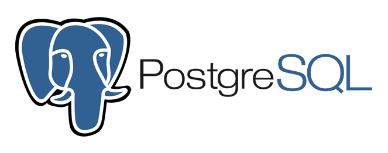
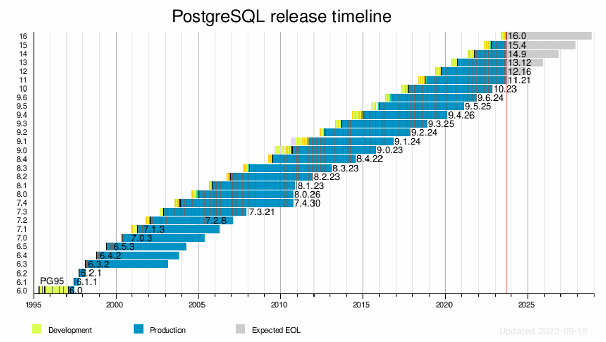

# Capítulo 2 – PostgreSQL: Introdução e Evolução

O foco deste e dos próximos capítulos será o **PostgreSQL**, um SGBD que tem ganhado imensa popularidade e respeito na comunidade de tecnologia. Para situar o estudo, o PostgreSQL será contextualizado dentro do vasto arcabouço da teoria de Bancos de Dados.

A divisão de conteúdo para esta série de capítulos sobre o PostgreSQL foi pensada da seguinte forma: primeiramente, será abordado o processo de administração de banco de dados utilizando este SGBD; em seguida, serão analisadas as peculiaridades dos comandos de manipulação e criação de bases de dados, tratando também dos tipos de dados suportados e das extensões do PostgreSQL à linguagem SQL/ANSI, conhecidas como PL/pgSQL.

## O Que é o PostgreSQL?

O PostgreSQL é frequentemente anunciado por sua comunidade como "o banco de dados open source mais avançado do mundo". Embora seja uma afirmação audaciosa, ela reflete a reputação que o sistema construiu ao longo de décadas de desenvolvimento. De forma mais racional e técnica, pode-se definir o **PostgreSQL** como um poderoso **Sistema de Gerenciamento de Banco de Dados Objeto-Relacional (ORDBMS)**, de código aberto, cujo desenvolvimento é mantido por uma comunidade global de desenvolvedores e empresas.

  

Suas raízes remontam ao projeto **POSTGRES**, mais especificamente à versão 4.2, desenvolvido no Departamento de Ciência da Computação da Universidade da Califórnia, em Berkeley (UCB). O PostgreSQL foi pioneiro em muitos conceitos que só se tornaram disponíveis em alguns dos principais sistemas de banco de dados comerciais anos depois. A colaboração entre a comunidade de software livre e um conjunto de empresas e universidades resultou em um sistema reconhecido por sua estabilidade, escalabilidade e segurança sólidas, além de um conjunto de recursos que rivaliza com os de SGBDs empresariais de alto custo.

As principais qualidades que atraem massas de novos usuários a cada ano e mantêm os usuários atuais entusiasmados com seus projetos são sua estabilidade, escalabilidade e segurança sólidas, bem como os recursos que um sistema de gerenciamento de banco de dados de nível empresarial oferece.

O PostgreSQL é um descendente de código aberto do programa original desenvolvido em Berkeley. Ele suporta uma grande parte do padrão SQL/ANSI e oferece muitas características modernas, entre as quais se destacam:

- **Consultas Complexas:** Suporte a junções sofisticadas, subconsultas, funções de janela e expressões de tabela comuns (CTEs).
- **Integridade Referencial:** Implementação robusta de chaves primárias e estrangeiras.
- **Funcionalidades Ativas:** Suporte completo a triggers e procedimentos armazenados.
- **Visões Atualizáveis:** Capacidade de modificar dados através de visões simples.
- **Integridade Transacional:** Garantia das propriedades ACID (Atomicidade, Consistência, Isolamento e Durabilidade).
- **Controle de Concorrência Multiversão (MVCC):** Um mecanismo sofisticado que permite que leitores não bloqueiem escritores e vice-versa, aumentando significativamente o desempenho em ambientes concorrentes.

Além disso, uma de suas características mais marcantes é sua **extensibilidade**. O PostgreSQL pode ser estendido pelo usuário de várias maneiras. Por exemplo, é possível adicionar novos **tipos de dados** através dos user-defined types (UDT), novas **funções** utilizando as user-defined functions (UDF), e até mesmo criar novos **operadores**, **funções de agregação**, **métodos de acesso para índices** e **linguagens procedurais** (além da nativa PL/pgSQL, existem vínculos para linguagens como PL/Python, PL/Perl e PL/Tcl).

Atribui-se boa parte do sucesso e da ampla adoção do SGBD à sua **licença liberal** (a Licença PostgreSQL, similar à licença BSD). Por conta dela, o PostgreSQL pode ser usado, modificado e distribuído por qualquer pessoa ou empresa, gratuitamente, para qualquer finalidade, seja ela privada, comercial ou acadêmica, sem custos de licenciamento.

## Uma Breve História do PostgreSQL e a Evolução de suas Funcionalidades

A análise da trajetória histórica do PostgreSQL é pertinente, pois permite apresentar como as principais funcionalidades de um sistema de banco de dados moderno evoluíram ao longo do tempo. Essa oportunidade serve para familiarizar o leitor com os termos associados aos serviços providos por um SGBD.

  

Originalmente chamado de **Postgres**, o projeto foi criado na UCB por uma equipe liderada pelo professor de ciência da computação **Michael Stonebraker**, que mais tarde se tornou CTO da Informix Corporation (empresa que viria a ser comprada pela IBM). Em 1995, dois alunos de Ph.D. do laboratório de Stonebraker, Andrew Yu e Jolly Chen, realizaram uma modificação crucial: substituíram a linguagem de consulta proprietária do Postgres, a PostQUEL, por um interpretador que utilizava um subconjunto estendido de funções da linguagem SQL. Eles renomearam o sistema para **Postgres95**. Neste momento, o Postgres95 deu um grande passo para se tornar um SGBD relacional. Ao incorporar a linguagem SQL, facilitou a vida dos DBAs e outros profissionais que necessitavam fazer uso do banco de dados. Mas a evolução não parou por aí.

Em 1996, o Postgres95 saiu de dentro da academia e começou uma nova vida no universo open source fora do campus. Um grupo de desenvolvedores dedicados, não ligados a Berkeley, viu o sistema como uma promessa e se dedicou ao seu desenvolvimento contínuo. Valendo-se de contribuições enormes de tempo, habilidade, trabalho e conhecimento técnico, esse grupo global de desenvolvimento transformou radicalmente o Postgres.

Durante os anos subsequentes, eles trouxeram consistência e uniformidade ao código-fonte, criaram um conjunto detalhado de testes de regressão para garantir a qualidade e a estabilidade a cada nova modificação, e estabeleceram listas de discussão para relatórios de bugs, o que fez com que inúmeros problemas fossem corrigidos. Adicionalmente, novas e incríveis funcionalidades foram adicionadas. Eles ajustaram todo o sistema, preenchendo várias lacunas, incluindo a criação de uma documentação completa para desenvolvedores e usuários.

O fruto deste trabalho foi um novo banco de dados, que rapidamente ganhou uma reputação sólida de estabilidade. O início de sua nova vida no mundo open source trouxe tantos novos recursos e aprimoramentos que o sistema de banco de dados recebeu seu nome atual: **PostgreSQL**. O nome "Postgres" ainda é comumente usado como um apelido mais fácil de pronunciar.

Com o novo nome, o PostgreSQL iniciou sua contagem de versionamento pela **versão 6.0**, em 1997, dando crédito aos seus muitos anos anteriores de desenvolvimento. Com a ajuda de centenas de desenvolvedores de todo o mundo, o sistema foi alterado e melhorado em quase todas as áreas.

### Evolução das Versões e Funcionalidades

Ao longo de mais de duas décadas de desenvolvimento aberto, o PostgreSQL incorporou um conjunto impressionante de funcionalidades.

**Versões 6.0 a 7.0 (1997-2000):** Nestes primeiros anos, grandes melhorias e funcionalidades foram implementadas, solidificando a base do SGBD. A mais notável foi a introdução do **Controle de Concorrência Multiversão (MVCC)**. O antigo sistema de bloqueio em nível de tabela foi substituído por este mecanismo sofisticado, que permite que transações de leitura continuem a ver um "instantâneo" consistente dos dados, mesmo durante a atividade de escrita de outras transações. Isso aumentou drasticamente a concorrência e possibilitou a realização de backups online (hot backups). Além disso, houve melhorias significativas na sintaxe SQL, com a adição de subconsultas, restrições, chaves primárias, chaves estrangeiras, identificadores entre aspas, coerção de tipo para strings literais, casting de tipos e entrada de inteiros em formato binário e hexadecimal. Foram adicionados novos tipos de dados nativos, incluindo uma ampla gama de tipos de data/hora e tipos geométricos. A velocidade e o desempenho geral tiveram grandes aumentos, na ordem de 20% a 40%, e o tempo de inicialização do servidor foi reduzido em 80%.

**Versões 7.1 a 8.4 (2001-2009):** Este período marcou a introdução de funcionalidades que tornaram o PostgreSQL uma alternativa viável para aplicações empresariais críticas. Destacam-se o **Write-Ahead Logging (WAL)**, que aumentou drasticamente a confiabilidade e a recuperação de falhas; o suporte a **esquemas SQL**; outer joins; prepared queries e a sintaxe de `JOIN` do padrão SQL-92. Foi introduzido também o **TOAST** (The Oversized-Attribute Storage Technique), um mecanismo que permite o armazenamento eficiente de valores de atributos muito grandes, e o suporte nativo a IPv6 e ao `information_schema` do padrão SQL. A capacidade de busca textual (full-text search), o processo de limpeza automática (autovacuum), o suporte a linguagens procedurais como Perl, Python e TCL, e a melhoria do suporte a conexões seguras com SSL foram outros marcos. No final deste ciclo, as versões 8.x trouxeram o suporte nativo para a plataforma **Microsoft Windows**, savepoints, tablespaces, **recuperação point-in-time (PITR)**, **commit em duas fases**, particionamento de tabelas (baseado em herança), índices de bitmap, papéis (roles), **funções de janela (window functions)** e **expressões de tabela comuns (CTEs)**.

**Versões 9.0 a 9.6 (2010-2016):** A série 9.x focou em escalabilidade, replicação e funcionalidades analíticas.

|Versão|Melhorias Notáveis|
|---|---|
|**9.0**|Replicação de streaming binário nativa, hot standby, suporte a Windows 64-bits, gatilhos por coluna e execução condicional de gatilhos, restrições de exclusão.|
|**9.1**|Replicação síncrona, collations por coluna, tabelas unlogged, indexação k-NN, isolamento de transação serializable (SSI), extensões, tabelas estrangeiras (SQL/MED).|
|**9.2**|Replicação em cascata, varreduras index-only, suporte nativo a JSON, melhorias na gestão de bloqueios, tipos de dados de intervalo (range types).|
|**9.3**|Tarefas de background customizáveis, checksums de dados, operadores JSON dedicados, `LATERAL JOIN`, tabelas estrangeiras graváveis, visões materializadas.|
|**9.4**|Tipo de dados binário **JSONB**, `ALTER SYSTEM` para configuração, atualização de visões materializadas sem bloqueio, decodificação lógica para replicação.|
|**9.5**|`IMPORT FOREIGN SCHEMA`, políticas de segurança em nível de linha (row-level security), índice BRIN, `GROUPING SETS`, `CUBE`, `ROLLUP`, e o comando `INSERT ... ON CONFLICT` ("UPSERT").|
|**9.6**|Introdução ao **paralelismo de consultas** para varreduras sequenciais e junções, melhorias na replicação síncrona e busca textual por frases.|

**Versões 10 a 16 (2017-2023):** Este período mais recente consolidou o PostgreSQL como um líder em inovação no mundo dos bancos de dados relacionais.

|Versão|Melhorias Notáveis|
|---|---|
|**10**|**Replicação Lógica** (publicação/assinatura), **Particionamento Declarativo de Tabelas**, melhor paralelismo de consulta, _commit_ por quórum para replicação síncrona, autenticação SCRAM-SHA-256.|
|**11**|Maior robustez e desempenho para particionamento, **Transações Suportadas em Procedimentos Armazenados**, paralelismo de consulta aprimorado, **Compilação Just-in-Time (JIT)** para expressões.|
|**12**|Otimizações de desempenho para CTEs e particionamento, reconstrução concorrente de índices, **colunas geradas**, suporte para expressões de caminho SQL/JSON.|
|**13**|Melhorias em particionamento (junções por partição), replicação lógica em tabelas particionadas, otimizações de índice e melhorias nas estatísticas estendidas.|
|**14**|Melhor desempenho para cargas de trabalho com muitas conexões, suporte a tipos de dados **multirange**, acesso a dados JSON via subscritos.|
|**15**|Comando `MERGE` padrão SQL, melhor desempenho de classificações em memória, compressão no lado do servidor para `pg_basebackup`, melhorias em replicação lógica.|
|**16**|Paralelismo para junções `FULL` e `RIGHT`, replicação lógica a partir de uma instância secundária, replicação lógica bidirecional, mais sintaxe padrão SQL/JSON, e a visão de monitoramento `pg_stat_io`.|

### A Versão Mais Recente: PostgreSQL 17

Continuando seu ciclo de lançamentos anuais, o PostgreSQL 17, cuja versão final é esperada para o final de 2024, traz consigo um novo conjunto de aprimoramentos focados em desempenho, segurança e usabilidade para desenvolvedores e administradores. Com base nos ciclos de desenvolvimento e nas discussões da comunidade, as principais novidades desta versão incluem:

- **Manutenção Incremental de Visões Materializadas:** Uma das funcionalidades mais aguardadas, permitindo que visões materializadas sejam atualizadas de forma incremental e concorrente (`REFRESH MATERIALIZED VIEW CONCURRENTLY INCREMENTALLY`), sem a necessidade de uma recarga completa. Isso torna o uso de visões materializadas muito mais prático para análise de dados em tempo real e para a construção de data marts.
- **Melhorias no Planejador de Consultas e JIT:** O planejador de consultas agora possui um modelo de custos mais apurado para operações paralelas e para o uso de compilação JIT, resultando em planos de execução ainda mais eficientes para consultas analíticas complexas. O paralelismo também foi estendido para mais tipos de consultas, incluindo algumas operações em `UNION`.
- **Aprimoramentos na Replicação Lógica:** A versão 17 introduz a capacidade de replicação lógica para sequências e grandes objetos, além de maior flexibilidade na replicação de DDL (comandos de definição de dados), facilitando a manutenção de esquemas sincronizados entre réplicas.
- **Segurança e Autenticação:** Introdução do suporte nativo para autenticação com passkeys (baseado no padrão WebAuthn), oferecendo uma alternativa mais segura e moderna às senhas. Além disso, foram adicionados mais controles granulares para a gestão de privilégios em nível de procedimento e função.
- **Melhorias na Gestão de Armazenamento:** O processo de `VACUUM` foi otimizado para lidar de forma mais eficiente com tabelas muito grandes e fragmentadas, reduzindo o impacto no desempenho durante as operações de manutenção.
- **Experiência do Desenvolvedor:** Introdução da cláusula `WHEN NOT MATCHED BY SOURCE` no comando `MERGE`, alinhando-se ainda mais com o padrão SQL. Adição da função `JSON_TABLE` para transformar dados JSON em um formato relacional tabular dentro de uma consulta.

### Política de Suporte e Versionamento

O Grupo de Desenvolvimento Global do PostgreSQL (PGDG) oferece suporte a uma versão principal por **5 anos** após seu lançamento inicial. Após o quinto aniversário, uma versão principal recebe um último lançamento menor contendo quaisquer correções finais e é então considerada **fim de vida (End of Life - EOL)**, não sendo mais suportada oficialmente.

É crucial entender o esquema de versionamento. Uma mudança no primeiro ou segundo número da versão (ex: de 15.x para 16.0) constitui uma **versão principal (major release)**. As versões principais geralmente mudam o formato interno dos arquivos de dados e das tabelas de sistema, exigindo uma atualização mais complexa, que pode ser feita através de uma descarga/recarga completa do banco de dados (dump/restore) ou, de forma mais eficiente, utilizando o utilitário `pg_upgrade`. Uma mudança no número após o segundo ponto (ex: de 16.0 para 16.1) constitui uma **versão menor (minor release)**. As versões menores corrigem apenas bugs, problemas de segurança e potenciais corrupções de dados, e não alteram o formato dos dados em disco, permitindo atualizações simples e rápidas (geralmente, basta substituir os binários do PostgreSQL e reiniciar o servidor).

A tabela abaixo mostra o ciclo de vida de algumas das versões recentes e suportadas do PostgreSQL, com base na data de referência deste capítulo.

|Versão|Última Versão Menor|Suportado|Lançamento Inicial|Fim de Vida (EOL) Previsto|
|---|---|---|---|---|
|**17**|17.0 (Beta)|Sim|Set/Out 2024|Nov 2029|
|**16**|16.3|Sim|14/Set/2023|Nov 2028|
|**15**|15.7|Sim|13/Out/2022|Nov 2027|
|**14**|14.12|Sim|30/Set/2021|Nov 2026|
|**13**|13.15|Sim|24/Set/2020|Nov 2025|
|**12**|12.19|Sim|3/Out/2019|Nov 2024|

Nota: As datas e versões menores são ilustrativas para o contexto de meados de 2025, baseadas nos padrões de lançamento do projeto.

## Capacidades e Escala do PostgreSQL

Por ser um banco de dados objeto-relacional maduro, o PostgreSQL oferece um vasto conjunto de recursos, e é muito difícil "assustar" uma instância do PostgreSQL com demandas de escala. Os limites teóricos do sistema são impressionantes e, na prática, raramente são alcançados, sendo geralmente limitados pelo hardware e pelo sistema operacional subjacentes.

Uma única instância (um cluster de bancos de dados) pode conter um número praticamente ilimitado de bancos de dados individuais. Cada banco de dados pode ter um tamanho total efetivamente ilimitado (limitado apenas pelo sistema de arquivos), e pode conter um número virtualmente ilimitado de tabelas. Cada tabela, por sua vez, pode ter até 32 TB de dados (com a possibilidade de extensão através de particionamento).

Além disso, se houver alguma preocupação de que esses limites superiores não sejam suficientes, considere que uma única tabela pode ter até 1.600 colunas, com cada coluna individual podendo armazenar até 1 GB de dados. O sistema suporta um número ilimitado de índices por tabela, com cada índice podendo ser multi-coluna (composto por até 32 colunas).

Resumindo, o PostgreSQL pode armazenar e gerenciar muito mais dados do que a maioria das aplicações jamais necessitará. Para usar essa ferramenta tão poderosa, é necessário, primeiramente, instalar e configurar o SGBD, um processo que será abordado nos próximos tópicos.

## Considerações Finais

Neste capítulo introdutório, foi apresentado o PostgreSQL, não apenas como um software, mas como um ecossistema robusto, maduro e em constante evolução. Foi definida sua natureza como um Sistema de Gerenciamento de Banco de Dados Objeto-Relacional (ORDBMS) de código aberto, destacando suas principais características: estabilidade, escalabilidade, segurança e uma notável extensibilidade.

A jornada histórica, desde suas origens acadêmicas como Postgres até sua transformação em um projeto global e comunitário, ilustra o poder do desenvolvimento colaborativo e a incorporação gradual de funcionalidades que hoje são consideradas padrão em sistemas de banco de dados de nível empresarial. O acompanhamento da evolução de suas versões evidencia um compromisso contínuo com a inovação, a performance e a adesão aos padrões SQL, ao mesmo tempo em que introduz recursos avançados que o mantêm na vanguarda da tecnologia de dados.

Compreender o que é o PostgreSQL, sua história e suas capacidades é o primeiro passo para dominar esta ferramenta poderosa. Nos próximos capítulos, o foco se deslocará da teoria para a prática, explorando os detalhes de sua administração, a manipulação de dados com sua rica implementação da linguagem SQL e a utilização de seus recursos avançados para construir aplicações confiáveis e performáticas.