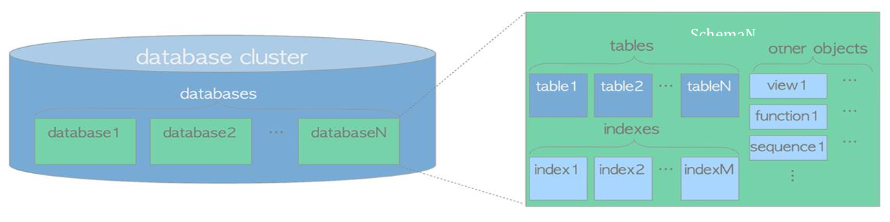
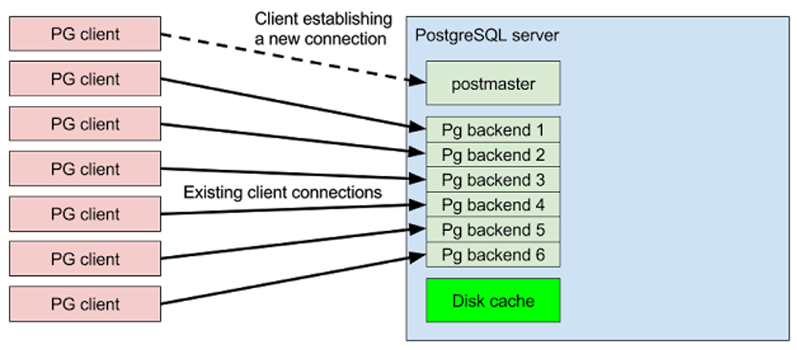

# Capítulo 4 – PostgreSQL: Arquitetura e Terminologia Essencial

Para administrar e desenvolver sistemas com qualquer tecnologia de forma eficaz, é indispensável dominar seu vocabulário específico. No universo do PostgreSQL, certos termos possuem significados precisos que definem sua arquitetura e seu funcionamento. Compreender essa terminologia não é apenas um exercício acadêmico; é a base para a leitura da documentação oficial, para a interação com a comunidade global de usuários e, fundamentalmente, para a realização de tarefas práticas de configuração, gerenciamento e otimização.

Este capítulo se dedica a explorar os conceitos e a terminologia essenciais do PostgreSQL. Será feita uma análise da estrutura de uma instância do PostgreSQL, desde o conceito de _cluster_ de bancos de dados até a organização interna em esquemas e objetos. Serão abordados também os papéis dos usuários, a arquitetura de processos do servidor e a importância de componentes críticos como o diretório `PGDATA` e os **Write-Ahead Logs (WALs)** para a persistência e a recuperação de dados.

## O Cluster de Bancos de Dados: A Instância do PostgreSQL

Uma das primeiras e mais importantes distinções na terminologia do PostgreSQL é o uso do termo **cluster de bancos de dados** (ou, simplesmente, cluster). No contexto do PostgreSQL, um cluster refere-se a uma **única instância em execução do servidor de banco de dados**, que é gerenciada por um **único processo mestre (postmaster)**. Essa instância, por sua vez, pode servir e lidar com múltiplos **bancos de dados**.

Cada banco de dados dentro de um cluster é um espaço completamente isolado, contendo seu próprio conjunto de esquemas, tabelas, índices e outros objetos. Os usuários e as aplicações se conectam a um banco de dados específico para realizar suas operações. Um aspecto fundamental desse isolamento é que os usuários conectados a um banco de dados não podem, por padrão, cruzar os limites deste e interagir com os dados contidos em outro banco de dados dentro do mesmo cluster, a menos que estabeleçam uma nova e explícita conexão com o segundo banco de dados.

A figura abaixo ilustra essa arquitetura, onde uma única instância do PostgreSQL (o cluster) gerencia diversos bancos de dados distintos e isolados.

  

## Organização Lógica: Esquemas e Objetos

Dentro de cada banco de dados, a organização lógica é refinada através do uso de **esquemas (schemas)**. Um esquema pode ser descrito como um **namespace**, ou um **contêiner nomeado**, que um usuário pode criar para organizar objetos de banco de dados — como tabelas, visões, funções e sequências — em uma coleção mais estruturada e gerenciável.

Os esquemas permitem que múltiplos objetos com o mesmo nome existam dentro do mesmo banco de dados, desde que estejam em esquemas diferentes. Por exemplo, é possível ter uma tabela `vendas.clientes` e outra `marketing.clientes`. Os esquemas não podem ser aninhados, representando, portanto, um **único nível de namespace** dentro de um banco de dados. Quando um banco de dados é criado, ele vem com um esquema padrão chamado `public`, que é onde os objetos são criados por padrão, caso nenhum outro esquema seja especificado.

Os **objetos de banco de dados** são, portanto, tudo aquilo que pode ser criado e gerenciado dentro de um esquema. Isso inclui, mas não se limita a:

- Tabelas
- Visões (Views)
- Índices
- Funções e Procedimentos Armazenados
- Gatilhos (Triggers)
- Tipos de Dados customizados
- Sequências

Cada objeto pertence a um, e apenas um, esquema.

## Usuários, Papéis e Privilégios

No PostgreSQL, os **usuários** são definidos em todo o cluster, o que significa que uma identidade de usuário não está vinculada a um banco de dados específico. Um único usuário (ou, mais precisamente, um **papel**, ou role, que é o termo mais genérico e correto a partir de versões mais recentes) pode se conectar e gerenciar qualquer banco de dados no cluster, desde que tenha recebido permissão para tal.

O PostgreSQL divide os papéis em duas categorias principais com base em seus privilégios:

- **Papéis Normais (Usuários):** São aqueles que podem se conectar, criar objetos e manipular dados, sempre dependendo do conjunto de privilégios que lhes foi concedido sobre os bancos de dados e os objetos específicos.
- **Superusuários:** São papéis com privilégios irrestritos. Um superusuário pode fazer qualquer coisa com qualquer objeto de banco de dados, contornando todas as verificações de permissão. Mais notavelmente, os superusuários também podem controlar o ciclo de vida do cluster (por exemplo, eles podem terminar conexões de outros usuários, recarregar a configuração do servidor, parar todo o cluster e executar tarefas de manutenção de baixo nível).

É possível configurar quantos superusuários forem necessários, e cada superusuário tem as mesmas permissões onipotentes. Por essa razão, a concessão de privilégios de superusuário deve ser feita com extrema cautela e limitada ao mínimo de contas possível.

## A Base Física: O Diretório de Dados PGDATA

O PostgreSQL armazena todos os seus dados — tanto os dados do usuário (o conteúdo das tabelas e índices) quanto seu estado interno (metadados, configuração, logs) — no sistema de arquivos local do servidor. Este é um ponto importante a se ter em mente: o PostgreSQL depende fundamentalmente do sistema de arquivos subjacente para implementar a persistência e a durabilidade dos dados. Portanto, a configuração e o tuning do sistema de arquivos e do subsistema de disco são tarefas importantes para que o PostgreSQL funcione bem.

Todo o conteúdo de um cluster de bancos de dados é armazenado em um único diretório no sistema de arquivos, conhecido universalmente como **PGDATA**. Este diretório representa fisicamente tudo o que o cluster está servindo como bancos de dados.

Essa arquitetura permite um conceito interessante: é possível ter uma única instalação dos binários do PostgreSQL em uma máquina e fazer com que ela sirva diferentes clusters, cada um com seu próprio diretório `PGDATA` independente (e rodando em uma porta de rede diferente). Na verdade, essa é uma forma possível e comum de se implementar atualizações entre versões principais com mínimo tempo de inatividade, utilizando ferramentas como `pg_upgrade`.

O diretório `PGDATA` precisa ser **inicializado** antes de poder ser usado pelo PostgreSQL. Este processo de inicialização, realizado pelo comando `initdb`, cria toda a estrutura de subdiretórios e arquivos de configuração iniciais dentro do `PGDATA`. O conteúdo detalhado do `PGDATA` será explorado em um momento oportuno, mas, por agora, é suficiente lembrar que este diretório é onde o PostgreSQL espera encontrar todos os seus dados e arquivos de configuração para poder iniciar e operar.

## Confiabilidade e Recuperação: O Write-Ahead Log (WAL)

Dentro do diretório `PGDATA`, duas partes são absolutamente críticas para o funcionamento e a confiabilidade do cluster: um espaço para o armazenamento dos dados em si (geralmente no subdiretório `base`) e os arquivos de **Write-Ahead Log (WAL)**. Sem qualquer uma dessas duas partes, o cluster é incapaz de garantir a consistência dos dados e, em algumas circunstâncias críticas, pode até mesmo não conseguir iniciar.

Os WALs são uma tecnologia fundamental que muitos sistemas de banco de dados utilizam para garantir a durabilidade e a atomicidade das transações. A ideia é simples, mas poderosa: **antes de aplicar qualquer alteração a um bloco de dados no disco**, uma descrição dessa alteração (a intenção de mudança) é primeiro registrada e persistida no arquivo de log. Nesse caso, se o cluster travar (crash) a qualquer momento, ele sempre poderá contar com o log já gravado em disco para entender quais operações foram concluídas com sucesso antes da falha e o que deve ser feito para recuperar o sistema a um estado consistente.

O termo "travamento", neste contexto, refere-se a qualquer possível desastre que possa atingir o _cluster_, incluindo um bug de software, mas, mais provavelmente, eventos como falta de energia elétrica, falhas no disco rígido, ou um término abrupto do processo do servidor. Com o uso do WAL, o PostgreSQL se compromete a fornecer a melhor consistência de dados possível, garantindo que nenhuma transação confirmada seja perdida.

## Metadados: O Catálogo do Sistema e o `information_schema`

Internamente, o PostgreSQL mantém o controle das estruturas de todas as tabelas, índices, funções, usuários e todas as outras informações necessárias para gerenciar o cluster em um armazenamento de metadados dedicado, denominado **catálogo do sistema**. O catálogo é fundamental para o ciclo de vida do cluster e reflete, em tempo real, praticamente todas as ações realizadas sobre as estruturas e os dados do usuário.

Uma característica poderosa do PostgreSQL é que ele fornece acesso ao catálogo para os usuários do banco de dados (especialmente superusuários) por meio de uma interface SQL. Isso significa que o catálogo é, em si, um conjunto de tabelas especiais que podem ser consultadas e, em certa medida, manipuladas por meio de instruções SQL.

O padrão SQL define um conjunto de visões padronizadas chamado **`information_schema`**. Trata-se de uma coleção de visões comuns a todas as implementações de banco de dados que seguem o padrão, permitindo que um DBA ou desenvolvedor inspecione o estado interno do banco de dados de forma portável. Por exemplo, o `information_schema` define uma visão chamada `tables` que coleta informações sobre todas as tabelas definidas pelo usuário, possibilitando consultá-la para verificar se uma tabela específica existe ou não.

O catálogo nativo do PostgreSQL é, como alguns o descrevem, um "`information_schema` com esteroides". O catálogo nativo (localizado no esquema `pg_catalog`) é muito mais preciso, detalhado e específico da implementação do que o `information_schema` geral. Assim, um DBA pode extrair muito mais informações sobre o status e o funcionamento interno do PostgreSQL consultando diretamente as tabelas do catálogo.

## Arquitetura de Processos: O Postmaster e os Backends

Quando um cluster PostgreSQL é iniciado, ele executa um único processo principal chamado **postmaster**. O objetivo do postmaster é atuar como um "porteiro" ou um processo ouvinte (listener), aguardando por conexões de entrada de clientes, que geralmente são feitas através de uma conexão de rede TCP/IP.

Quando uma nova solicitação de conexão de um cliente chega, o postmaster realiza a autenticação inicial e, se for bem-sucedida, ele dá origem a um novo processo no sistema operacional. Este novo processo é denominado **processo de backend** (ou, às vezes, simplesmente postgres), e ele é responsável por servir a uma, e apenas uma, conexão de cliente.

  

Isso significa que toda vez que uma nova conexão com o cluster é aberta, o cluster reage lançando um novo processo de backend para atendê-la. Este processo de backend viverá até que a conexão do cliente termine, momento em que o processo é, consequentemente, destruído. Além de criar os processos de backend para as conexões dos clientes, o postmaster geralmente também inicia e supervisiona alguns **processos utilitários** ou de background, que são responsáveis por manter o PostgreSQL funcionando corretamente. Exemplos desses processos incluem o checkpointer (que gerencia os checkpoints no WAL), o walwriter (que escreve os registros do WAL para o disco) e o autovacuum launcher (que gerencia a limpeza automática de tabelas).

## Resumo da Terminologia

Para resumir, esta é uma recapitulação rápida dos principais termos usados no PostgreSQL que foram discutidos neste capítulo:

- **Cluster:** Refere-se a toda a instância de serviço do PostgreSQL, que pode gerenciar múltiplos bancos de dados.
- **Postmaster:** É o primeiro processo que o cluster executa quando é iniciado. Este processo é responsável por gerenciar as conexões de entrada e manter o controle das atividades de todo o cluster. O postmaster se bifurca (forks) em um processo de backend toda vez que uma nova conexão de cliente é estabelecida.
- **Banco de Dados:** É um contêiner de dados isolado dentro de um cluster, ao qual os usuários (ou aplicações) podem se conectar. Um banco de dados é composto por diferentes objetos, incluindo esquemas, tabelas, gatilhos, entre outros.
- **PGDATA:** É o nome convencional para o diretório no sistema de armazenamento persistente que é totalmente dedicado a um cluster PostgreSQL e a todos os seus dados.
- **WALs (Write-Ahead Logs):** Contêm o log sequencial das intenções de alteração do banco de dados, sendo o mecanismo fundamental usado para recuperar os dados de um travamento crítico e garantir a durabilidade.

## Considerações Finais

Este capítulo estabeleceu o vocabulário fundamental necessário para navegar no ecossistema do PostgreSQL. A compreensão de termos como cluster, banco de dados, esquema, `PGDATA`, WAL e a arquitetura de processos com o postmaster e os backends é essencial para qualquer interação significativa com este SGBD.

Dominar essa terminologia não é um fim em si mesmo, mas um pré-requisito para utilizar o sistema de forma eficaz. Ela permite a interpretação correta da vasta documentação oficial, facilita a comunicação com a comunidade global de usuários e desenvolvedores para a solução de problemas, e, mais importante, fornece o arcabouço conceitual para a realização de tarefas práticas de administração, desenvolvimento e otimização.

Com esta base terminológica sólida, os próximos capítulos poderão se aprofundar nos aspectos práticos da administração do PostgreSQL, desde a configuração inicial do servidor e a criação de bancos de dados e usuários, até a execução de consultas e a implementação de rotinas de manutenção.