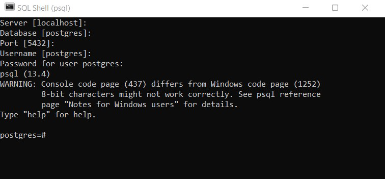

# Capítulo 5 – PostgreSQL: Conectando a um Servidor

Após a instalação do PostgreSQL e a familiarização com seus conceitos básicos, a próxima etapa natural é aprender como utilizá-lo. Como se estabelece a comunicação com o servidor de banco de dados? Conectar-se ao banco de dados é a primeira experiência prática da maioria dos usuários e desenvolvedores. Este capítulo abordará esse processo fundamental, corrigindo quaisquer dúvidas que possam surgir ao longo do caminho. É importante ressaltar que a conexão a um banco de dados deve ser feita de forma segura; portanto, podem existir alguns obstáculos e configurações a serem superados, projetados para garantir que os dados que se deseja acessar estejam devidamente protegidos.

Para que uma conexão seja bem-sucedida, é necessário que um servidor PostgreSQL esteja em execução em uma máquina (o host), "escutando" por conexões em uma porta de rede específica. Nesse servidor, devem existir um banco de dados ao qual se deseja conectar e um usuário (ou papel) devidamente cadastrado e com as permissões necessárias. Uma forma prática de observar isso é através de ferramentas gráficas como o **pgAdmin**, que frequentemente acompanha as instalações mais recentes do PostgreSQL. Ao iniciar o pgAdmin, nota-se que o serviço do servidor PostgreSQL deve ser inicializado antes que a ferramenta de administração possa se conectar. No Windows, por exemplo, o ícone do elefante, símbolo do PostgreSQL, geralmente aparece na barra de tarefas, indicando que o servidor está ativo.

O host que executa o servidor deve permitir explicitamente as conexões dos clientes, e estes, por sua vez, devem fornecer os dados corretos para autenticação, utilizando o método especificado pelo servidor. Por exemplo, especificar uma senha durante a tentativa de conexão não funcionará se o servidor estiver configurado para solicitar uma forma diferente de autenticação para aquele usuário ou endereço de origem.

## A Primeira Conexão: O Utilitário `psql`

A ferramenta mais fundamental e poderosa para interagir com o PostgreSQL é o **`psql`**. Este programa, disponível na pasta `bin` da instalação do PostgreSQL, é um front-end interativo baseado em terminal. Ele permite que comandos SQL sejam digitados interativamente, enviados ao servidor PostgreSQL e que os resultados da consulta sejam visualizados diretamente no terminal. Alternativamente, a entrada de comandos para o `psql` pode vir de um arquivo, o que o torna uma ferramenta excelente para a execução de scripts. Além de executar SQL, o `psql` fornece um grande número de **meta-comandos** (comandos que começam com uma barra invertida, `\`) e diversas funcionalidades similares às de um shell de sistema operacional, que facilitam a escrita de scripts e a automação de uma grande variedade de tarefas administrativas. O conhecimento do `psql` é, portanto, indispensável para qualquer administrador ou desenvolvedor que trabalhe seriamente com PostgreSQL.

A seguir, um exemplo de uma tentativa de conexão utilizando o `SQL Shell (psql)`. Neste exemplo, os seguintes dados são fornecidos interativamente:

- **`Server [localhost]`:** O nome ou endereço IP do host onde o servidor está rodando. O valor padrão `localhost` indica que a conexão é para um servidor na mesma máquina.
- **`Database [postgres]`:** O nome do banco de dados ao qual se deseja conectar. Neste exemplo, foi escolhido o banco `estrategia`.
- **`Port [5432]`:** A porta de rede na qual o servidor está escutando. O valor padrão é `5432`, mas no exemplo foi utilizada a porta `5434`.
- **`Username [postgres]`:** O nome do usuário (papel) que será usado para a autenticação.

<div align="center">
  
</div>

A primeira coisa a se observar é que, uma vez que a conexão foi estabelecida com sucesso, o prompt de comando muda. O `psql` passa a informar o banco de dados ao qual o usuário está conectado (neste caso, `postgres=`) e, se o usuário conectado for um superusuário, o prompt termina com um sinal de cerquilha (`#`). Caso o usuário não seja um superusuário, o sinal de maior que (`>`) é utilizado no final do prompt.

## Parâmetros Essenciais de Conexão

O servidor de banco de dados PostgreSQL é classificado como um sistema cliente-servidor. O local onde o sistema do servidor roda é conhecido como **host**. É possível acessar um servidor PostgreSQL remotamente através de uma rede. No entanto, para isso, é necessário especificar o parâmetro **host**, que pode ser um nome de domínio (ex: `db.minhaempresa.com`), ou o parâmetro **hostaddr**, que é o endereço IP do servidor (ex: `192.168.1.100`). Pode-se especificar o host como `"localhost"` se o objetivo for fazer uma conexão TCP/IP para o servidor que está rodando na mesma máquina que o cliente.

Em qualquer sistema, pode haver mais de um servidor de banco de dados PostgreSQL em execução, mesmo na mesma máquina. Cada servidor de banco de dados escuta em exatamente uma **porta** de rede, que não pode ser compartilhada entre os servidores no mesmo host. O número da porta padrão para o PostgreSQL é **5432**, que foi oficialmente registrado na **IANA (Internet Assigned Numbers Authority)** e é atribuído exclusivamente ao PostgreSQL. O número da porta pode ser usado para identificar unicamente um servidor de banco de dados específico, caso existam vários em execução no mesmo host ou na mesma rede.

Um servidor de banco de dados PostgreSQL, como vimos no capítulo anterior, também é conhecido como um **"cluster de banco de dados"**, porque o servidor permite a definição de um ou mais bancos de dados em cada instância. Cada solicitação de conexão de um cliente deve identificar exatamente um banco de dados, especificado por seu nome (**dbname**). Ao se conectar, o cliente só será capaz de ver e interagir com os objetos (tabelas, esquemas, etc.) que foram criados dentro do banco de dados especificado na conexão.

> **Dica:** Para confirmar que a conexão foi estabelecida com o servidor certo e da maneira correta, é possível executar alguns comandos SQL diretamente no `psql` para inspecionar os detalhes da conexão atual:
> 
> - `SELECT current_database()`: Mostra o nome do banco de dados ao qual a sessão está conectada.
> - `SELECT current_user`: Mostra o ID do usuário (papel) da sessão atual.
> - `SELECT inet_server_addr()`: Mostra o endereço IP do servidor que aceitou a conexão.
> - `SELECT inet_server_port()`: Exibe a porta na qual o servidor está escutando e aceitou esta conexão.
> 
> A senha do usuário, por razões óbvias de segurança, não é acessível através de comandos SQL gerais.

## Interagindo com o Banco de Dados via `psql`

Ao entrar no `psql`, o que se pode fazer? É possível executar comandos SQL para a criação de objetos no banco de dados (DDL), para a manipulação de dados em tabelas (DML) e para realizar consultas (DQL). Além disso, o `psql` oferece um rico conjunto de meta-comandos para tarefas administrativas e de exploração. Aqui estão alguns dos principais meta-comandos do `psql`:

|Comando|Descrição|
|---|---|
|**`\?`**|Lista todos os meta-comandos disponíveis no `psql`.|
|**`\h [comando_sql]`**|Exibe a ajuda para a sintaxe de um comando SQL específico. Se nenhum comando for especificado, lista todos os comandos SQL que possuem ajuda disponível.|
|**`\l`** ou **`\l+`**|Lista todos os bancos de dados disponíveis no servidor PostgreSQL. A versão com `+` mostra mais detalhes.|
|**`\c nome_do_banco`**|Conecta-se a um banco de dados específico no mesmo servidor.|
|**`\conninfo`**|Exibe informações detalhadas sobre a conexão atual (usuário, banco, host, porta).|
|**`\dt [schema.*]`**|Lista todas as tabelas no banco de dados atual (ou de um esquema específico).|
|**`\d nome_da_tabela`**|Mostra a estrutura detalhada de uma tabela específica (colunas, tipos, índices, restrições).|
|**`\di`**|Lista todos os índices no banco de dados atual.|
|**`\df`**|Lista todas as funções disponíveis no banco de dados atual.|
|**`\dn`**|Lista todos os esquemas disponíveis no banco de dados atual.|
|**`\du`** ou **`\du+`**|Lista todos os papéis (usuários) no servidor PostgreSQL. A versão com `+` mostra mais detalhes.|
|**`\password [user]`**|Altera a senha do usuário especificado (ou do usuário atual, se nenhum for fornecido).|
|**`\timing`**|Ativa ou desativa a exibição do tempo de execução de cada consulta, em milissegundos.|
|**`\i nome_do_arquivo`**|Executa um script SQL a partir de um arquivo local.|
|**`\e`**|Abre um editor de texto externo (definido pela variável de ambiente `EDITOR`) para escrever uma consulta SQL mais longa. Ao salvar e fechar o editor, a consulta é executada.|
|**`\x`**|Ativa ou desativa a exibição de resultados de consultas em modo expandido, que é útil para visualizar tabelas com muitas colunas.|
|**`\z [tabela]`**|Lista as permissões (ACLs - Access Control Lists) das tabelas e outros objetos.|
|**`\sf nome_da_funcao`**|Exibe o código-fonte de uma função específica.|
|**`\copyright`**|Exibe as informações de direitos autorais e licença do PostgreSQL.|
|**`\q`**|Sai do `psql` e encerra a sessão.|

## Configurando Conexões Remotas

Existe uma variedade de distribuições e métodos de instalação possíveis para o PostgreSQL. Em muitas delas, especialmente nas que seguem as melhores práticas de segurança, o **acesso remoto é desabilitado por padrão**. Isso significa que, em uma instalação padrão, o servidor PostgreSQL só aceitará conexões originadas da própria máquina onde ele está instalado (`localhost`). Esta é uma medida de segurança importante para evitar a exposição não intencional do banco de dados à rede.

A seguir, será apresentado como realizar os ajustes necessários nos arquivos de configuração do PostgreSQL para permitir a aceitação de conexões remotas de forma segura. Este processo envolve, principalmente, a edição de dois arquivos de configuração: `postgresql.conf` e `pg_hba.conf`.

### Arquivos de Configuração para Acesso Remoto

Para admitir o acesso remoto, é preciso fazer alterações em arquivos específicos. Primeiramente, serão mostradas quais são as alterações em cada arquivo, e, em seguida, serão tecidos os comentários teóricos explicativos a respeito de cada alteração.

1. **Adicionar/editar a seguinte linha no arquivo `postgresql.conf`:**
    
    ```toml
    listen_addresses = '*'
    ```
    
    O parâmetro `listen_addresses` especifica em qual ou quais endereços IP da máquina o servidor PostgreSQL irá "escutar" por tentativas de conexão. Isso permite que se tenha mais de uma placa de rede (NICs) por sistema e se controle por qual delas o banco de dados estará acessível. Na maioria dos casos, para habilitar o acesso remoto geral, deseja-se aceitar conexões em todas as NICs disponíveis. Para isso, utiliza-se o valor `*`, que significa "todos os endereços IP".
    
2. **Adicionar uma regra ao arquivo `pg_hba.conf`:** Para permitir o acesso a todos os bancos de dados, para todos os usuários, a partir de qualquer endereço IP, utilizando uma senha criptografada, a seguinte linha pode ser adicionada:
    
    ```toml
    # TYPE  DATABASE        USER            ADDRESS                 METHOD
    host    all             all             0.0.0.0/0               md5
    ```
    
    **Atenção**: Esta regra é muito permissiva e geralmente não é recomendada para ambientes de produção. Ela serve como um exemplo inicial para habilitar o acesso. Em um ambiente real, as regras devem ser o mais restritivas possível.

###  Detalhando o `pg_hba.conf`

A autenticação de clientes no PostgreSQL é controlada por um arquivo de configuração que, tradicionalmente, é chamado **`pg_hba.conf`** e é armazenado no diretório de dados raiz do banco de dados (o `PGDATA`). A sigla HBA significa **Host-Based Authentication (Autenticação Baseada em Host)**. Um arquivo `pg_hba.conf` padrão é criado quando o diretório de dados é inicializado pelo comando `initdb`.

O formato geral do arquivo `pg_hba.conf` é um conjunto de registros, um por linha. As linhas em branco são ignoradas, assim como qualquer texto após o caractere de comentário `#`. Os registros não podem se estender por mais de uma linha. Um registro é constituído por um número de campos que são separados por espaços e/ou tabulações. Os campos podem conter espaços em branco, desde que o valor do campo seja colocado entre aspas.

Cada registro especifica:

- Um tipo de conexão.
- Uma faixa de endereço IP de cliente (se for relevante para o tipo de conexão).
- Um nome de banco de dados.
- Um nome de usuário.
- O método de autenticação a ser usado para conexões que correspondam a estes parâmetros.

O processo de autenticação funciona da seguinte maneira: quando um cliente tenta se conectar, o PostgreSQL lê o arquivo `pg_hba.conf` sequencialmente, de cima para baixo. **O primeiro registro** cujos valores de tipo de conexão, endereço do cliente, banco de dados solicitado e nome de usuário correspondam à tentativa de conexão é usado para executar a autenticação. **Não há nenhuma possibilidade de múltiplas tentativas ou fallback**; se a autenticação falhar com base na regra correspondente, a conexão é negada, e os registros subsequentes não são considerados. Se nenhum registro no arquivo corresponder à tentativa de conexão, o acesso é negado por padrão.

A ordem pela qual as regras são listadas no arquivo `pg_hba.conf` é, portanto, de **extrema importância**. Regras mais específicas devem vir antes de regras mais genéricas. Por exemplo:

```toml
# TYPE  DATABASE        USER            ADDRESS                 METHOD
# Rejeita especificamente a conexão do host 192.168.54.1
host    all             all             192.168.54.1/32         reject

# Permite conexões de qualquer outro host usando GSSAPI
host    all             all             0.0.0.0/0               gss
```

Neste exemplo, uma tentativa de conexão vinda do IP `192.168.54.1` corresponderá à primeira regra e será imediatamente rejeitada (`reject`). Qualquer outra conexão remota corresponderá à segunda regra e tentará a autenticação via GSSAPI. Se a ordem fosse invertida, a primeira regra (`0.0.0.0/0`) corresponderia a todas as conexões, e a regra de rejeição específica nunca seria alcançada.

Vamos retomar e detalhar a linha de exemplo adicionada ao arquivo `pg_hba.conf`:

```toml
# TYPE  DATABASE        USER            ADDRESS                 METHOD
host    all             all             0.0.0.0/0               md5
```

Esta regra significa que uma conexão remota (`host`) é admitida para qualquer banco de dados (`all`) por qualquer usuário (`all`), vinda de qualquer endereço IP IPv4 (`0.0.0.0/0`). Para se autenticar, será solicitada uma senha, que será verificada usando o método de criptografia `md5`.

Vejamos cada um dos parâmetros indicados:

- **`TYPE`**: Define o tipo de conexão. Os valores mais comuns são `local` (aceita conexões via sockets de domínio Unix, ou seja, da mesma máquina, sem usar a pilha de rede), `host` (conexão via TCP/IP, pode ser local ou remota) e `hostssl` (exige que a conexão TCP/IP seja criptografada com SSL/TLS).
- **`DATABASE`**: Especifica a qual banco de dados a regra se aplica. `all` significa "para todos os bancos de dados". Outros nomes devem corresponder exatamente a um nome de banco de dados. É possível também especificar uma lista de bancos separados por vírgula, ou usar o símbolo `@` para incluir um arquivo com uma lista de bancos.
- **`USER`**: Indica o nome do usuário (papel) PostgreSQL ao qual a regra se aplica. `all` significa "para todos os usuários". Assim como em `DATABASE`, pode-se usar uma lista de usuários separados por vírgula, `@` para incluir um arquivo com uma lista de usuários, ou o sinal de mais (`+`) como prefixo de um nome de papel para indicar que a regra se aplica a todos os membros daquele papel de grupo.
- **`CIDR-ADDRESS`**: Consiste em duas partes: um endereço IP e uma máscara de sub-rede no formato CIDR (Classless Inter-Domain Routing). A máscara de sub-rede é especificada como o número de bits iniciais do endereço IP que devem corresponder. Assim, `/32` para IPv4 (ou `/128` para IPv6) significa uma correspondência exata com um único endereço IP. `/24` significa que os primeiros 24 bits (os três primeiros octetos) devem corresponder; por exemplo, `192.168.0.0/24` corresponderia a qualquer endereço IP de `192.168.0.1` a `192.168.0.255`. O valor `/0` significa uma correspondência de zero bits, de modo que todos os endereços IP daquela família (IPv4 ou IPv6) corresponderão.
- **`METHOD`**: Especifica como as credenciais de login devem ser verificadas. Os métodos mais importantes são:
    - **`scram-sha-256`**: O método de autenticação por senha mais seguro e recomendado, disponível desde o PostgreSQL 10. Utiliza um mecanismo de desafio-resposta que evita o envio da senha pela rede.
    - **`md5`**: O método baseado em senha usado em versões mais antigas. É menos seguro que o SCRAM e não deve ser usado em novas instalações.
    - **`password`**: Envia a senha em texto claro pela rede. Só deve ser usado se a conexão for protegida por SSL/TLS.
    - **`trust`**: Efetivamente significa "sem autenticação". Sempre aceita a conexão sem verificar nenhuma credencial. É extremamente inseguro e só deve ser usado para conexões locais em ambientes de desenvolvimento totalmente controlados.
    - **`reject`**: Sempre recusa a conexão, independentemente das credenciais. Útil para bloquear explicitamente certos hosts ou usuários.
    - Outros métodos avançados incluem `gss` e `sspi` para integração com Kerberos/Active Directory, `ldap` para autenticação via servidores LDAP, e `pam` para integração com a infraestrutura de autenticação do sistema operacional.

É crucial configurar o `pg_hba.conf` corretamente para garantir a segurança e controlar o acesso ao banco de dados PostgreSQL. Alterações neste arquivo, assim como no `postgresql.conf`, normalmente exigem um recarregamento da configuração ou um reinício completo do serviço do servidor PostgreSQL para que tenham efeito.

## Considerações Finais

Este capítulo abordou os passos práticos e conceituais para estabelecer uma conexão com um servidor PostgreSQL. Foi demonstrado que o processo, embora direto, depende de uma série de parâmetros essenciais — host, porta, nome do banco de dados e credenciais de usuário — que definem o alvo e a identidade da conexão.

A exploração do utilitário de linha de comando `psql` revelou-o como uma ferramenta indispensável, não apenas para a execução interativa de comandos SQL, mas também para a automação de tarefas administrativas através de seus ricos meta-comandos. A capacidade de inspecionar o estado da conexão e do banco de dados diretamente do `psql` é um recurso valioso para administradores e desenvolvedores.

Finalmente, a discussão sobre a configuração de conexões remotas através dos arquivos `postgresql.conf` e `pg_hba.conf` tocou em um aspecto fundamental da administração de bancos de dados: a segurança. A configuração padrão do PostgreSQL, que restringe o acesso remoto, é um lembrete de que a segurança deve ser uma consideração primária, e que a abertura do banco de dados para a rede deve ser uma ação deliberada e controlada. O entendimento detalhado do formato e da lógica do arquivo `pg_hba.conf` é uma habilidade essencial para qualquer DBA, permitindo a implementação de políticas de acesso granulares e seguras.

Com o conhecimento sobre como se conectar e interagir com o servidor, e como gerenciar o acesso a ele, o caminho está aberto para explorar as funcionalidades mais profundas do PostgreSQL, como a definição de estruturas de dados, a manipulação de informações e a escrita de lógicas de negócio complexas, tópicos que serão abordados nos próximos capítulos.