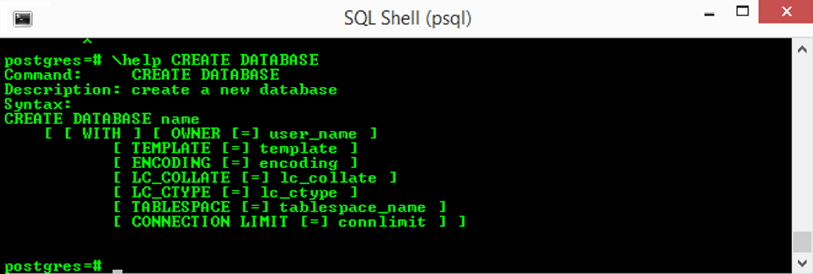

# Capítulo 6 – PostgreSQL: Criando um Banco de Dados

Após a instalação bem-sucedida do PostgreSQL e a familiarização com sua arquitetura e terminologia, o próximo passo lógico na jornada de administração e desenvolvimento é a criação das estruturas que irão armazenar os dados. Este capítulo se dedica a explorar os comandos e conceitos fundamentais para a criação de um ambiente de banco de dados funcional no PostgreSQL.

O processo será abordado em duas etapas cruciais. Primeiramente, será analisado o utilitário `initdb`, responsável pela **inicialização de um cluster de bancos de dados**. Este é o passo inaugural que prepara o terreno, criando o diretório de dados e os bancos de dados de sistema necessários para que a instância do PostgreSQL possa operar. Em seguida, o foco se voltará para a criação de bancos de dados individuais dentro de um cluster já existente, utilizando tanto o comando SQL `CREATE DATABASE` quanto seu utilitário de linha de comando correspondente, o `createdb`.

## Inicialização do Cluster de Bancos de Dados com `initdb

Antes que qualquer banco de dados possa ser criado ou qualquer conexão possa ser estabelecida, é necessário criar e inicializar um **cluster de bancos de dados**. Como visto no capítulo anterior, no jargão do PostgreSQL, um "cluster" não se refere a um grupo de máquinas trabalhando em conjunto, mas sim a uma **coleção de bancos de dados que é gerenciada por uma única instância do servidor PostgreSQL**. O comando responsável por essa tarefa fundamental é o `initdb`.

A execução do `initdb` cria um novo cluster de bancos de dados, que consiste em um diretório no sistema de arquivos onde todos os dados do cluster residirão. A sintaxe básica para sua utilização é:

```shell
initdb [opção...] [--pgdata | -D] diretório
```

O argumento mais importante é o `diretório`, que especifica a localização no sistema de arquivos onde o cluster de bancos de dados deve ser armazenado. Este diretório, frequentemente referido pela variável de ambiente `PGDATA`, conterá todos os subdiretórios e arquivos necessários para a operação do cluster, incluindo os bancos de dados de sistema, os bancos de dados de usuário, os arquivos de configuração e os logs de transação (WALs). É crucial que o usuário do sistema operacional que irá executar o servidor PostgreSQL tenha permissão de leitura e escrita neste diretório.

Cada banco de dados criado posteriormente dentro deste cluster será, de fato, armazenado fisicamente em um subdiretório distinto dentro do `PGDATA`, garantindo uma separação física dos dados de cada banco.

### A Importância dos Bancos de Dados Padrão: `template1` e `template0`

Ao executar o `initdb`, além de criar a estrutura de diretórios e os arquivos de configuração, o PostgreSQL cria três bancos de dados padrão: `postgres`, `template0` e `template1`.

- **`postgres`:** É um banco de dados padrão destinado ao uso de usuários, ferramentas e aplicações de terceiros. É o banco ao qual muitas ferramentas se conectam por padrão.
- **`template1`:** Como o nome sugere, este é o banco de dados "molde" ou "template" padrão. Quando o comando `CREATE DATABASE` é executado sem especificar um template diferente, o PostgreSQL essencialmente cria um clone exato do `template1`. Isso significa que quaisquer objetos (tabelas, funções, etc.) ou configurações que existam no `template1` serão copiados para o novo banco de dados. Isso permite que os administradores customizem o `template1`, adicionando extensões ou objetos que desejam que estejam presentes em todos os novos bancos de dados por padrão.
- **`template0`:** Este é um segundo banco de dados molde, "virgem" e imutável. Ele contém a mesma coleção de objetos padrão que o `template1` possuía no momento da criação do cluster. O `template0` não deve ser modificado e serve como uma cópia de segurança limpa. Sua principal utilidade é na criação de novos bancos de dados com configurações de _encoding_ ou _locale_ diferentes das do `template1`, pois para isso é necessário clonar um template que não tenha nenhuma conexão ativa, condição que o `template0` garante.

### Configuração de `Locale` na Inicialização

Um aspecto de configuração de extrema importância, que é definido no momento da inicialização do cluster, é o **suporte a `locale`**. O termo **locale** refere-se a um conjunto de parâmetros que definem as convenções linguísticas e culturais para uma determinada região. Isso inclui:

- O conjunto de caracteres (alfabeto).
- As regras de ordenação de caracteres (ex: 'a' vem antes de 'b', 'z' vem antes de 'á'?).
- A formatação de números, moedas e datas/horas.

O PostgreSQL não implementa sua própria lógica de _locale_, mas utiliza o padrão ISO C e POSIX fornecido pelo sistema operacional do servidor para aplicar essas regras.

O suporte a locale é **automaticamente inicializado quando um cluster de banco de dados é criado usando o `initdb`**. Por padrão, o `initdb` inicializará o cluster de banco de dados com a configuração de locale do ambiente de execução do próprio comando. Portanto, se o sistema operacional já está configurado para utilizar o idioma e as convenções regionais que se deseja usar no cluster, então não há mais nada a ser feito.

Contudo, se for necessário usar um _locale_ diferente, ou se não houver certeza sobre qual locale está definido no sistema, é possível instruir o `initdb` a usar uma configuração específica, através da opção `--locale`.

Por exemplo, para sistemas baseados em Unix, o seguinte comando inicializaria um cluster com o locale definido para o idioma Sueco (`sv`), conforme falado na Suécia (`SE`):

```shell
initdb --locale=sv_SE -D /usr/local/pgsql/data
```

A escolha do _locale_ na inicialização do cluster é uma decisão crítica, pois ela define as configurações padrão para os bancos de dados `template1` e `template0`. Isso afeta diretamente o comportamento de ordenação de strings em índices e em cláusulas `ORDER BY`, bem como o comportamento de funções que lidam com a classificação de caracteres (maiúsculas, minúsculas, etc.). Embora seja possível criar bancos de dados individuais com locales diferentes posteriormente, a configuração definida no `initdb` servirá como o padrão para todo o cluster.

## Criando Bancos de Dados Individuais

Uma vez que o cluster de bancos de dados está inicializado e o servidor PostgreSQL está em execução, é possível criar bancos de dados individuais para abrigar os dados das aplicações. Existem duas formas principais de se fazer isso: através do comando SQL `CREATE DATABASE` ou utilizando o programa utilitário de linha de comando `createdb`.

### O Comando `CREATE DATABASE`

A forma padrão e mais flexível de criar um novo banco de dados é através do comando SQL `CREATE DATABASE`. Para poder executar este comando, o usuário (ou o papel atual) deve possuir o privilégio especial `CREATEDB`. Por padrão, superusuários possuem este privilégio.

A sintaxe básica do comando é:

```sql
CREATE DATABASE nome_do_banco;
```

No entanto, o comando oferece uma série de opções que permitem um controle granular sobre as propriedades do novo banco de dados. A sintaxe completa é mais extensa:

```sql
CREATE DATABASE nome
    [ [ WITH ] [ OWNER [=] nome_do_usuario ]
           [ TEMPLATE [=] template ]
           [ ENCODING [=] encoding ]
           [ LOCALE [=] locale ]
           [ LC_COLLATE [=] lc_collate ]
           [ LC_CTYPE [=] lc_ctype ]
           [ TABLESPACE [=] nome_do_tablespace ]
           [ ALLOW_CONNECTIONS [=] allowconn ]
           [ CONNECTION LIMIT [=] connlimit ]
           [ IS_TEMPLATE [=] istemplate ] ]
```

A figura a seguir, obtida através do comando `\h CREATE DATABASE` no `psql`, ilustra a sintaxe e as opções disponíveis.

<div align="center">
  
</div>

Alguns dos parâmetros mais importantes são:

- **`OWNER`**: Especifica o usuário (papel) que será o proprietário do novo banco de dados. Se omitido, o proprietário será o usuário que executou o comando.
- **`TEMPLATE`**: Especifica o nome do banco de dados molde a partir do qual o novo banco será criado. Como mencionado, se este parâmetro for omitido, o PostgreSQL utiliza o `template1` por padrão.
- **`ENCODING`**: Define a codificação de caracteres (ex: `UTF8`, `LATIN1`) a ser usada no novo banco de dados. A escolha da codificação é fundamental e deve ser compatível com os dados que serão armazenados.
- **`LC_COLLATE`** e **`LC_CTYPE`**: Permitem especificar configurações de _locale_ para ordenação de strings (`LC_COLLATE`) e classificação de caracteres (`LC_CTYPE`) que sejam diferentes do padrão do banco de dados molde.
- **`TABLESPACE`**: Permite especificar um tablespace (uma localização no sistema de arquivos) diferente do padrão para armazenar os objetos deste novo banco de dados.

Exemplo Prático:

Para criar um novo banco de dados chamado sistema_vendas, cujo proprietário será o usuário gerente_vendas, utilizando a codificação UTF8 e baseado no template padrão template1, o seguinte comando seria executado:

```sql
CREATE DATABASE sistema_vendas
    OWNER = gerente_vendas
    ENCODING = 'UTF8';
```

### O Utilitário `createdb`

Além do comando SQL, o PostgreSQL fornece um programa utilitário de linha de comando chamado **`createdb`** para maior conveniência. Este programa é um **wrapper** (um "empacotador") para o comando `CREATE DATABASE`. Ele pode ser executado diretamente do shell do sistema operacional, sem a necessidade de se conectar primeiro ao `psql`.

O `createdb` aceita parâmetros de linha de comando que correspondem às opções do comando SQL. Por exemplo, para realizar a mesma operação do exemplo anterior, o comando seria:

```shell
createdb -O gerente_vendas -E UTF8 sistema_vendas
```

O uso do `createdb` é particularmente útil para a automação de tarefas e a execução de scripts de provisionamento de ambientes.

## Considerações Finais

Este capítulo detalhou o processo fundamental de criação de um ambiente de banco de dados no PostgreSQL. Foi estabelecida a distinção crucial entre a **inicialização de um cluster de bancos de dados** com o comando `initdb` e a **criação de um banco de dados individual** com `CREATE DATABASE` ou `createdb`.

A inicialização do cluster foi apresentada como o passo primordial, que não apenas cria a estrutura física de diretórios `PGDATA`, mas também estabelece configurações globais críticas, como o **locale** padrão, que influenciarão o comportamento de todo o servidor. A compreensão do papel dos bancos de dados molde, `template1` e `template0`, é essencial para entender como novos bancos de dados são criados e como customizar seu conteúdo inicial.

Uma vez que o cluster está operacional, a criação de bancos de dados específicos para cada aplicação pode ser realizada de forma flexível, seja através da sintaxe rica do comando SQL `CREATE DATABASE`, que oferece controle granular sobre propriedades como proprietário, codificação e tablespace, ou através do conveniente utilitário de linha de comando `createdb`.

Com um ou mais bancos de dados criados, o ambiente está pronto para a próxima etapa: a definição das estruturas de dados que irão abrigar as informações, como tabelas, colunas e restrições. Este será o foco do próximo capítulo, onde se começará a dar forma ao esquema lógico dentro do banco de dados recém-criado.