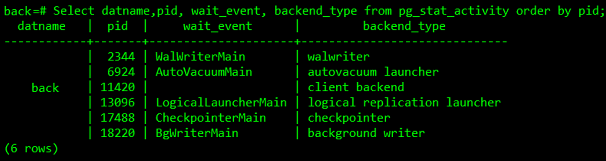

# Capítulo 7 – PostgreSQL: Organização e Arquitetura do Servidor

Este capítulo abrange temas de interesse fundamental para o administrador de banco de dados PostgreSQL. Inclui detalhes sobre a estrutura de arquivos da instalação do software, a configuração do servidor, o gerenciamento de usuários e bancos de dados, e as tarefas de manutenção essenciais. Qualquer pessoa que executa um servidor PostgreSQL, mesmo para uso pessoal, mas especialmente em um ambiente de produção, deve estar familiarizada com os tópicos aqui abordados para garantir uma gestão eficaz e segura.

## A Estrutura Física: Distribuição de Arquivos em Diretórios

Quando o PostgreSQL é instalado, ele cria uma estrutura de diretórios em uma localização raiz, que em sistemas Unix-like é, normalmente, `/usr/local/pgsql` e, em sistemas Windows, `C:\Program Files\PostgreSQL\[VERSÃO]`. Este diretório principal contém todos os arquivos necessários para a operação do PostgreSQL e é dividido em vários subdiretórios, cada um com uma finalidade específica.

<div align="center">
  
</div>

- **`/bin`**: Este diretório contém os programas executáveis de linha de comando do PostgreSQL. São as ferramentas essenciais que um DBA ou desenvolvedor utiliza para interagir com o servidor. Alguns dos executáveis mais importantes encontrados aqui são:
    - `psql`: O cliente interativo de terminal, fundamental para executar consultas SQL e comandos administrativos.
    - `pg_dump` e `pg_dumpall`: Utilitários para criar backups lógicos de um único banco de dados ou de todo o cluster.
    - `pg_restore`: Ferramenta para restaurar backups criados pelo `pg_dump`.
    - `initdb`: O programa usado para criar e inicializar um novo cluster de banco de dados (o diretório `PGDATA`).
    - `pg_ctl`: O utilitário de controle do servidor, usado para iniciar, parar, reiniciar e verificar o status da instância do PostgreSQL.
    - `createdb` e `dropdb`: Wrappers de linha de comando para os comandos SQL `CREATE DATABASE` e `DROP DATABASE`.
- **`/lib`**: Aqui ficam armazenadas as bibliotecas compartilhadas (`.so` em Linux/Unix, `.dll` em Windows) necessárias para o funcionamento dos diversos programas do PostgreSQL. Além das bibliotecas do núcleo, este diretório também contém os módulos para linguagens procedurais (como `plpgsql.so`), bibliotecas para conexão com outras linguagens de programação e, em algumas distribuições, arquivos de exemplo e templates de configuração que podem ser copiados para o diretório `PGDATA` e modificados.
- **`/share`**: Este diretório contém arquivos de suporte que são independentes da arquitetura do processador. Isso inclui:
    - Arquivos de documentação em vários formatos.
    - Arquivos de controle (`.control`) e scripts SQL para as extensões do PostgreSQL.
    - Dicionários para busca textual, arquivos de conversão de codificação e informações de fuso horário.
    - Arquivos de exemplo e tutoriais.
- **`/include`**: Contém os arquivos de cabeçalho da linguagem C (`.h`) necessários para o desenvolvimento de aplicações cliente que se conectam ao PostgreSQL usando a biblioteca `libpq`, ou para o desenvolvimento de extensões e funções em C que rodam dentro do servidor.

- **`/doc`**: Armazena a documentação oficial completa do PostgreSQL, geralmente em formato HTML, permitindo a consulta local sem a necessidade de acesso à internet.
- **`/pgAdmin4`, `/installer`, `/scripts`, `/debug_symbols`**: Estes diretórios não são parte padrão de todas as instalações do PostgreSQL (como uma compilação a partir do código-fonte ou pacotes mínimos de um sistema operacional), mas são frequentemente criados por instaladores gráficos, como o fornecido pela EnterpriseDB.
    - `/pgAdmin4`: Contém os arquivos e o ambiente de execução para o pgAdmin 4, a popular ferramenta de administração gráfica para o PostgreSQL.
    - `/installer`: Geralmente contém scripts e logs relacionados ao processo de instalação e desinstalação do software.
    - `/scripts`: Pode conter scripts de conveniência, como os necessários para registrar o servidor como um serviço no sistema operacional.
    - `/debug_symbols`: Contém arquivos de símbolos de depuração (como `.pdb` no Windows) que são essenciais para analisar crash dumps e depurar problemas de baixo nível no servidor.

É importante ter em mente a estrutura dos arquivos dentro do diretório de dados, também conhecido como **`PGDATA`**. Este diretório atua como o contêiner de disco que armazena todos os dados do cluster, incluindo os dados dos usuários e a configuração do cluster.

## Anatomia do Diretório de Dados (`PGDATA`)

O diretório `PGDATA` é o coração de uma instância PostgreSQL. Ele representa fisicamente o que o cluster está servindo como bancos de dados. É possível ter uma única instalação dos binários do PostgreSQL e fazer com que ela gerencie diferentes clusters, cada um com seu próprio diretório `PGDATA`. Esta abordagem é frequentemente utilizada para executar diferentes versões do PostgreSQL na mesma máquina ou para implementar estratégias de atualização. O diretório `PGDATA` precisa ser inicializado pelo comando `initdb` antes de ser usado pelo PostgreSQL.

O `PGDATA` está estruturado em vários arquivos e subdiretórios. Os arquivos de configuração principais são os seguintes:

- **`postgresql.conf`**: É o arquivo de configuração principal, lido como padrão quando o serviço do servidor é iniciado. Ele contém centenas de parâmetros que controlam o comportamento do servidor, desde a alocação de memória até as configurações de log e replicação.
- **`postgresql.auto.conf`**: É um arquivo de configuração que armazena configurações que foram alteradas dinamicamente através de instruções SQL, como o comando `ALTER SYSTEM`. As configurações neste arquivo sobrepõem as do `postgresql.conf`.
- **`pg_hba.conf`**: O arquivo de Host-Based Authentication. Ele fornece a configuração referente às permissões de conexão ao banco de dados, especificando quais usuários podem se conectar, de quais endereços IP, a quais bancos de dados e qual método de autenticação deve ser usado.
- **`PG_VERSION`**: É um arquivo de texto simples que contém o número da versão principal do PostgreSQL que gerencia aquele diretório `PGDATA`. É útil para inspecionar rapidamente qual versão do cluster criou e gerenciou o diretório.
- **`postmaster.pid`**: Um arquivo de bloqueio que contém o ID do processo (PID) do processo `postmaster` do cluster em execução. A existência deste arquivo é usada por ferramentas como o `pg_ctl` para determinar se o servidor está ativo.

Já os principais subdiretórios dentro do `PGDATA` são:

- **`base`**: É o diretório que contém os subdiretórios para cada banco de dados do cluster. Cada subdiretório é nomeado com o OID (Object Identifier) do banco de dados correspondente e, dentro dele, estão os arquivos que representam as tabelas, índices e outros objetos daquele banco. Usando comandos do sistema operacional como `du` e `ls`, os administradores podem inspecionar a quantidade de espaço em disco usada por cada banco de dados, tabela ou índice.
- **`global`**: É um diretório que contém objetos que são compartilhados por todo o cluster, como as tabelas de sistema que armazenam informações sobre usuários e bancos de dados (ex: `pg_database`).
- **`pg_wal`**: É o diretório que contém os arquivos de Write-Ahead Log (WAL). Estes são os logs de transação que registram todas as modificações feitas no banco de dados, sendo essenciais para a recuperação de falhas e para a replicação.
- **`pg_stat`** e **`pg_stat_tmp`**: São, respectivamente, os diretórios para o armazenamento das informações estatísticas permanentes e temporárias sobre o status e a saúde do cluster, coletadas pelo processo **stats collector**.

Uma observação importante é que o PostgreSQL não nomeia os arquivos de objetos no disco (como os arquivos que representam as tabelas) de forma mnemônica ou legível por humanos. Em vez disso, cada arquivo é nomeado por um identificador numérico, o seu **OID (Object Identifier)**. Ao inspecionar as pastas dentro do diretório `base`, verifica-se que cada uma contém arquivos cujos nomes são números. Esta abstração permite que o PostgreSQL gerencie internamente a relação entre os nomes lógicos dos objetos (ex: `tabela_clientes`) e seus arquivos físicos correspondentes.

## Gerenciamento do Servidor com `pg_ctl`

O **`pg_ctl`** é um utilitário fundamental para controlar o status de um cluster de banco de dados PostgreSQL. Suas principais funções são iniciar, parar ou reiniciar o servidor backend do PostgreSQL, ou ainda, exibir o status de um servidor em execução. Embora o servidor possa ser iniciado manualmente, o `pg_ctl` encapsula tarefas importantes, como o redirecionamento da saída de log e o gerenciamento de arquivos de PID. Ele também fornece opções convenientes para uma parada controlada do servidor.

O `pg_ctl` aceita o comando a ser executado como seu primeiro argumento, seguido por outros parâmetros específicos. Os comandos principais são os seguintes:

- **`start`**, **`stop`** e **`restart`**: Executam as ações correspondentes de iniciar, parar e reiniciar o cluster. Interromper um cluster pode ser muito mais problemático do que iniciá-lo e, por esse motivo, é possível passar argumentos extras para o comando `stop`. Em particular, existem três maneiras (modos) de se interromper um cluster:
    - **Modo `smart` (inteligente):** Este é o modo padrão. O servidor PostgreSQL aguarda suavemente que todos os clientes conectados se desconectem e só então desliga o cluster. Ele não permite novas conexões.
    - **Modo `fast` (rápido):** Desconecta imediatamente todas as conexões de clientes existentes (forçando um rollback em transações ativas) e desliga o servidor sem ter que esperar.
    - **Modo `immediate` (imediato):** Aborta todos os processos do PostgreSQL de forma abrupta, incluindo as conexões de clientes. Esta ação é similar a um "puxar da tomada" e desliga o cluster de forma "suja", o que significa que a integridade dos dados não é garantida naquele momento e o servidor precisará executar uma recuperação de falha (crash recovery) na próxima inicialização, utilizando os arquivos WAL.

- **`status`**: Relata o status atual (em execução ou não) do cluster, informando o PID do processo `postmaster`.
- **`initdb`** (ou `init`): Executa a inicialização de um novo cluster de banco de dados no diretório especificado, possivelmente removendo quaisquer dados que existiam anteriormente no local.
- **`reload`**: Faz com que o servidor PostgreSQL recarregue seus arquivos de configuração (como `postgresql.conf` e `pg_hba.conf`) sem a necessidade de um reinício completo. É útil para aplicar alterações de configuração que não exigem um restart.
- **`promote`**: É usado em um cenário de replicação, quando um cluster está rodando como um servidor subordinado (standby). Este comando promove o servidor standby para se tornar o novo servidor mestre, desanexando-o do mestre original e permitindo que ele aceite operações de escrita.

Após iniciar o servidor usando o comando `pg_ctl`, é possível visualizar alguns arquivos que compõem e refletem a configuração e o estado do servidor:

- **`postmaster.pid`**: A existência deste arquivo no diretório de dados é usada pelo `pg_ctl` para ajudar a determinar se o servidor está sendo executado ou não.
- **`postmaster.opts`**: Se esse arquivo existir no diretório de dados, o `pg_ctl` (no modo `restart`) passará o conteúdo do arquivo como opções de linha de comando para o novo processo do servidor. O conteúdo deste arquivo também é exibido no modo `status`.
- **`postgresql.conf`**: Este arquivo, localizado no diretório de dados, é analisado por ferramentas cliente, como o `psql`, para descobrir a porta apropriada a ser usada para a conexão.

## A Arquitetura de Processos do PostgreSQL

O PostgreSQL utiliza uma arquitetura multiprocesso para garantir robustez e isolamento entre as conexões dos clientes. Ao ser inicializado, o PostgreSQL inicia vários processos diferentes no sistema operacional. Esses processos são responsáveis por manter o cluster em bom estado de funcionamento, bem como por observar e instruir o cluster em suas ações. Esta seção fornece uma visão geral dos principais processos que podem ser encontrados em um cluster em execução, permitindo o reconhecimento de cada um deles e de seus respectivos propósitos.

Ao executar a seguinte consulta SQL em um terminal `psql` com um usuário administrador, é possível visualizar os processos em execução para o banco de dados ao qual se está conectado:

```sql
SELECT datname, pid, wait_event, backend_type FROM pg_stat_activity;
```

<div align="center">
  
</div>

É interessante perceber que os números de processo (PIDs) exibidos por esta consulta são os mesmos que aparecem na lista de processos do sistema operacional.

<div align="center">
  
</div>

O processo **`postmaster`** (cujo PID no exemplo é 2256) é o processo pai que origina e supervisiona todos os outros subprocessos do cluster. Os principais processos de manutenção e de _background_ incluem:

- **`checkpointer`**: É um processo responsável por executar os **pontos de verificação (checkpoints)**. Um checkpoint é um ponto no tempo no log de transações (WAL) no qual o PostgreSQL garante que todos os arquivos de dados que foram modificados em memória até aquele ponto sejam efetivamente escritos de forma persistente no disco. Isso limita a quantidade de log que precisa ser reprocessada durante uma recuperação de falha.
- **`background writer`**: É um processo que auxilia na escrita de blocos de dados "sujos" (modificados em memória, no shared buffers) para o disco de forma contínua e em segundo plano. Isso ajuda a suavizar os picos de E/S que ocorreriam se a escrita fosse feita apenas durante os checkpoints.
- **`walwriter`**: É o processo responsável por gravar os registros do Write-Ahead Log (WAL) do buffer de WAL em memória para os arquivos de WAL permanentes no disco. Isso é crucial para garantir a durabilidade das transações.
- **`stats collector`**: É um processo que coleta e monitora a atividade do banco de dados, como o número de acessos a tabelas e índices. Essas estatísticas são armazenadas e utilizadas posteriormente pelo otimizador de consultas para tomar decisões sobre os melhores planos de execução.
- **`logical replication launcher`**: É um processo responsável por iniciar e gerenciar os processos de trabalho (worker processes) para a replicação lógica (publicação/assinatura).

## Explorando os Metadados: O Catálogo do Sistema

Os **catálogos do sistema** são o lugar onde um SGBD armazena os **metadados** de um esquema relacional, tais como informações sobre tabelas, colunas, tipos de dados, funções, usuários e permissões, além de informações sobre a estruturação interna do próprio banco. No PostgreSQL, os catálogos do sistema são, eles próprios, tabelas regulares, localizadas principalmente no esquema `pg_catalog`.

É possível, tecnicamente, interagir com essas tabelas de catálogo diretamente via SQL. Pode-se eliminar e recriar as tabelas, adicionar colunas, inserir e atualizar valores. Contudo, é preciso ter extremo cuidado, pois a manipulação manual e incorreta dos catálogos pode danificar irremediavelmente o sistema. Normalmente, não se deve alterar os catálogos do sistema à mão; existem sempre comandos DDL de alto nível para fazer isso de forma segura (por exemplo, o comando `CREATE DATABASE` insere uma linha no catálogo `pg_database` e, ao mesmo tempo, cria o banco de dados fisicamente no disco). Há algumas exceções para operações particularmente esotéricas, como a adição de novos métodos de acesso a índices.

Outros exemplos de tabelas e visões importantes presentes no catálogo de sistema são:

|Nome da Tabela/Visão|Propósito|
|---|---|
|**`pg_attrdef`**|Armazena os valores padrão (default) das colunas. Apenas as colunas que explicitamente especificam um valor padrão terão uma entrada aqui.|
|**`pg_attribute`**|Descreve as colunas (atributos) de todas as tabelas e outros objetos relacionais.|
|**`pg_cast`**|Registra os caminhos de conversão (casting) entre tipos de dados, tanto as conversões disponíveis nativamente no sistema quanto aquelas definidas pelo usuário.|
|**`pg_constraint`**|Armazena informações sobre as restrições de integridade: `CHECK`, `UNIQUE`, `PRIMARY KEY` e `FOREIGN KEY`.|
|**`pg_depend`**|Armazena os relacionamentos de dependência entre os objetos do banco de dados. Esta informação permite ao comando `DROP` descobrir quais outros objetos devem ser removidos por uma operação em cascata (`DROP CASCADE`) ou quais objetos impedem a remoção (`DROP RESTRICT`).|
|**`pg_namespace`**|Lista os esquemas (namespaces) de um determinado banco de dados.|
|**`pg_proc`**|Registra as informações sobre funções e procedimentos armazenados. A tabela contém dados tanto para funções de agregação quanto para funções escalares simples.|
|**`pg_type`**|Registra informações sobre os tipos de dados. Inclui tipos básicos, tipos `ENUM`, domínios e tipos compostos.|

É importante mencionar a visão **`pg_settings`**, que fornece acesso de leitura e, em alguns casos, de escrita, aos parâmetros de run-time do servidor. Ela é, essencialmente, uma interface SQL alternativa para os comandos `SHOW` e `SET`, usados para manipular os parâmetros de sistema. Ela também fornece acesso a informações adicionais sobre cada parâmetro que não estão diretamente disponíveis no comando `SHOW`, como os valores mínimos e máximos permitidos. Uma atualização (`UPDATE`) aplicada a uma linha da visão `pg_settings` é equivalente a executar o comando `SET` no parâmetro correspondente. A alteração afeta apenas o valor utilizado pela sessão atual.

Para saber mais sobre outros elementos contidos nas quase 100 tabelas e visões presentes no catálogo de dados, a documentação oficial do PostgreSQL é a fonte definitiva: [https://www.postgresql.org/docs/current/catalogs.html](https://www.postgresql.org/docs/current/catalogs.html).

## Considerações Finais

Este capítulo desvendou a organização interna de um servidor PostgreSQL, fornecendo uma visão detalhada de sua arquitetura física e de processos. A compreensão desses componentes é um passo fundamental para qualquer administrador de banco de dados que deseje gerenciar o sistema de forma eficaz, segura e performática.

Foi explorada a estrutura de diretórios criada durante a instalação, com um foco especial no diretório `PGDATA`, o coração do cluster, que abriga desde os dados do usuário até os arquivos de configuração críticos e os logs de transação (WALs). A análise da arquitetura de processos, centrada no processo mestre `postmaster` e nos seus processos de backend e de background, esclareceu como o PostgreSQL lida com as conexões de clientes e executa suas tarefas internas de manutenção.

O utilitário `pg_ctl` foi apresentado como a ferramenta primária para controlar o ciclo de vida do servidor, oferecendo opções granulares para iniciar, parar e gerenciar a instância. Finalmente, o mergulho no catálogo do sistema revelou como o PostgreSQL armazena seus próprios metadados em tabelas relacionais, que podem ser consultadas via SQL, oferecendo uma introspecção poderosa sobre o estado e a estrutura do banco de dados.

Com este conhecimento sobre a organização do servidor, o administrador está mais bem preparado para realizar tarefas essenciais como configuração, monitoramento, solução de problemas e planejamento de capacidade. O entendimento da localização e do propósito de cada arquivo e processo não é apenas teórico, mas uma habilidade prática que se traduz em uma administração mais confiante e eficiente do PostgreSQL.