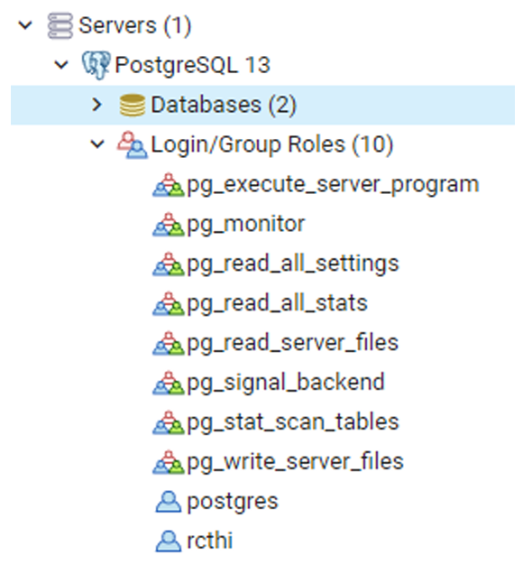
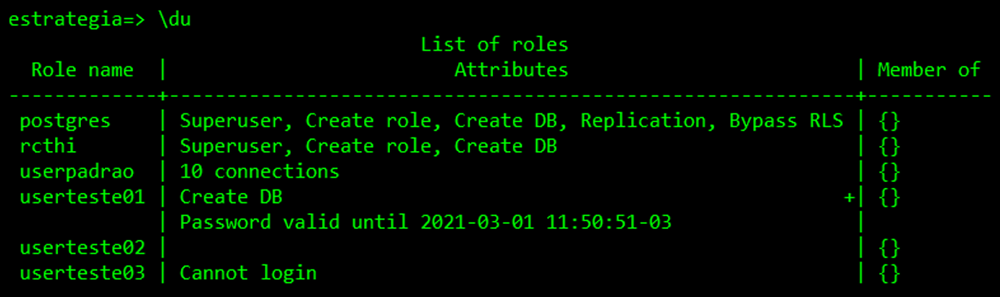
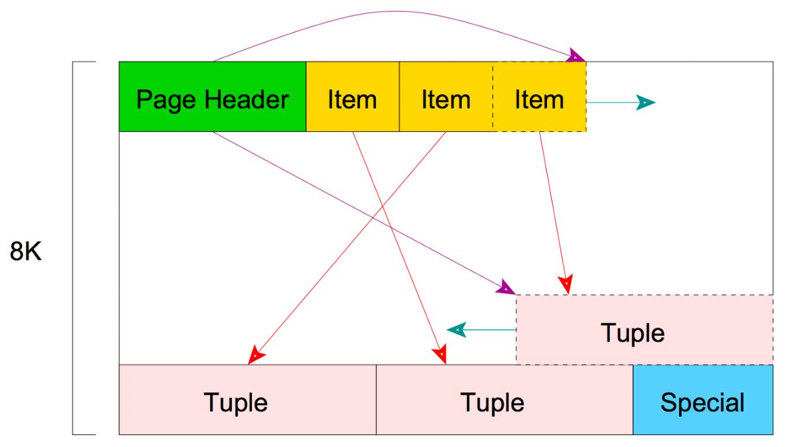

# Capítulo 8 – PostgreSQL: Autenticação e Gestão de Acesso

A **autenticação** é o processo pelo qual o servidor de banco de dados estabelece e verifica a identidade de um cliente que tenta se conectar. É a primeira linha de defesa da segurança do banco de dados. Por extensão, o resultado da autenticação determina se o aplicativo cliente (ou o usuário que o executa) tem permissão para sequer iniciar uma sessão com o banco de dados que foi solicitado.

O PostgreSQL oferece um sistema de autenticação de clientes extremamente flexível e robusto, com diversos métodos disponíveis. O método utilizado para autenticar uma conexão cliente em particular pode ser selecionado de forma granular, com base em uma combinação de fatores, incluindo o endereço de host do cliente, o banco de dados específico ao qual ele deseja se conectar e o nome de usuário fornecido.

Toda essa lógica de controle é centralizada em um único arquivo de configuração, o `pg_hba.conf`, que atua como o "porteiro" do cluster, definindo as regras de quem pode entrar e como deve provar sua identidade.

## Métodos de Autenticação

Conforme introduzido no capítulo anterior, a autenticação no PostgreSQL é governada pelas regras definidas no arquivo `pg_hba.conf`. Cada linha nesse arquivo especifica um método de autenticação para um determinado conjunto de conexões. A seguir, uma lista detalhada das possibilidades de métodos de autenticação (`METHOD`) disponíveis no PostgreSQL.


|Método de Autenticação|Descrição e Considerações|
|---|---|
|**`trust`**|Permite a conexão incondicionalmente, sem solicitar senha ou qualquer outra forma de credencial. Este método assume que qualquer um que consiga se conectar ao servidor a partir dos endereços especificados na regra é confiável. **Uso:** Deve ser usado com extrema cautela, apenas em redes totalmente seguras e isoladas, ou para conexões locais em ambientes de desenvolvimento onde a segurança não é uma preocupação.|
|**`reject`**|Rejeita a conexão incondicionalmente. É útil para "filtrar" ou bloquear explicitamente certos hosts ou redes. Por exemplo, uma linha com `reject` pode bloquear um host específico, enquanto uma linha posterior, mais genérica, permite que os hosts restantes da mesma sub-rede se conectem.|
|**`scram-sha-256`**|Executa a autenticação SCRAM-SHA-256 (Salted Challenge Response Authentication Mechanism) para verificar a senha do usuário. Este é o **método de autenticação por senha mais seguro e recomendado** pelo PostgreSQL. Ele utiliza um mecanismo de desafio-resposta que evita o envio da senha pela rede, mesmo de forma criptografada, protegendo contra ataques de escuta (sniffing).|
|**`md5`**|Exige que o cliente forneça uma senha para autenticação. A senha não é enviada em texto claro, mas sim através de um mecanismo de desafio-resposta que utiliza um hash MD5. Embora mais seguro que o método `password`, o `md5` é considerado criptograficamente mais fraco que o `scram-sha-256` e deve ser evitado em novas instalações.|
|**`password`**|Exige que o cliente forneça uma senha não criptografada para autenticação. Como a senha é enviada em texto claro através da rede, este método **não deve ser usado em redes não confiáveis**, a menos que a conexão esteja protegida por SSL/TLS.|
|**`gss`**|Usa GSSAPI (Generic Security Service Application Program Interface) para autenticar o usuário. É um método avançado, geralmente utilizado para integração com sistemas de autenticação centralizada como Kerberos. Este método só está disponível para conexões TCP/IP.|
|**`sspi`**|Usa SSPI (Security Support Provider Interface), a API padrão do Windows para autenticação. Permite a autenticação de logon único (single sign-on) em ambientes Windows. Este método só está disponível em servidores PostgreSQL rodando no Windows.|
|**`ident`**|Obtém o nome de usuário do sistema operacional do cliente entrando em contato com um servidor `ident` na máquina cliente (que deve estar rodando) e verifica se ele corresponde ao nome do usuário do banco de dados solicitado. A autenticação `ident` só pode ser utilizada em conexões TCP/IP e é raramente usada hoje em dia, pois depende de um serviço adicional no cliente e pode ser facilmente falsificada.|
|**`peer`**|Obtém o nome de usuário do sistema operacional do cliente diretamente do kernel do sistema operacional e verifica se ele corresponde ao nome do usuário do banco de dados solicitado. É muito seguro, mas **só está disponível para conexões locais** (via Unix domain sockets). É o método padrão para conexões locais em muitas distribuições Linux.|
|**`ldap`**|Autentica o cliente verificando um par de nome de usuário e senha em um servidor LDAP (Lightweight Directory Access Protocol) centralizado.|
|**`radius`**|Autentica usando um servidor RADIUS (Remote Authentication Dial-In User Service).|
|**`cert`**|Autentica o cliente usando seu certificado de cliente SSL. A conexão deve ser SSL/TLS. O nome comum (`CN`) do certificado do cliente é comparado com o nome do usuário do banco de dados solicitado.|
|**`pam`**|Autentica utilizando o serviço PAM (Pluggable Authentication Modules) fornecido pelo sistema operacional do servidor. Permite que o PostgreSQL se integre com qualquer esquema de autenticação configurado no sistema operacional.|

## Gerenciamento de Acesso com Papéis (Roles)

Após a autenticação bem-sucedida, o PostgreSQL precisa determinar o que o usuário conectado tem permissão para fazer. Ele administra as permissões de acesso ao banco de dados utilizando um conceito unificado e poderoso chamado **papéis (roles)**. Um papel pode ser pensado como uma entidade do banco de dados que pode possuir objetos e ter privilégios. Dependendo de como o papel é configurado, ele pode atuar como um **usuário** do banco de dados, como um **grupo** de usuários, ou ambos.

Os papéis podem possuir permissões sobre objetos de banco de dados (como tabelas, esquemas, funções) e podem, por sua vez, atribuir (conceder) seus próprios privilégios a outros papéis, visando controlar de forma granular e organizada quem tem acesso a quais objetos.

<div align="center">
  
</div>

O conceito de papéis, introduzido no PostgreSQL 8.1, unificou os conceitos anteriormente separados de "usuários" e "grupos". Agora, há apenas papéis. Qualquer papel pode atuar como um usuário (se tiver o atributo `LOGIN`), como um grupo (se outros papéis forem seus membros), ou ambos. A seguir, será descrito como criar e gerenciar papéis, introduzindo o sistema de privilégios do SGBD.

É importante entender que um papel é definido no **nível do cluster**. Isso significa que a identidade de um papel é global para toda a instância do PostgreSQL. No entanto, os privilégios de um papel são específicos de cada banco de dados. O mesmo papel pode ter permissões para se conectar a um banco de dados e não a outro, ou ter permissões de escrita em tabelas de um banco e apenas de leitura em outro.

### Papéis no Banco de Dados

Os papéis de banco de dados são conceitos completamente separados dos usuários do sistema operacional. Na prática, por conveniência ou para certos métodos de autenticação (como `peer`), pode ser útil manter uma correspondência entre eles, mas isso não é um requisito.

Para criar um papel, utiliza-se o comando SQL `CREATE ROLE`:

```sql
CREATE ROLE nome_do_papel;
```

O nome do papel segue as regras para identificadores SQL: sem caracteres especiais, a menos que esteja entre aspas duplas. Na prática, geralmente são adicionadas opções ao comando para definir os atributos do papel. Para remover um papel existente, utiliza-se o comando análogo `DROP ROLE`:

```sql
DROP ROLE nome_do_papel;
```

Por conveniência, os programas executáveis `createuser` e `dropuser` são fornecidos como _wrappers_ em torno desses comandos SQL, permitindo que sejam chamados diretamente da linha de comando do shell.

Para determinar o conjunto de papéis existentes em um cluster, pode-se examinar a tabela de catálogo do sistema `pg_roles`:

```sql
SELECT rolname FROM pg_roles;
```

Dentro do cliente `psql`, o meta-comando `\du` (ou `\du+` para mais detalhes) é uma forma útil e formatada de listar os papéis existentes. Abaixo, um exemplo da criação de um papel e da subsequente execução do comando `\du` no `psql`.

<div align="center">
  
</div>

É uma boa prática de segurança criar um papel que tenha os privilégios `CREATEDB` e `CREATEROLE`, mas que **não** seja um `SUPERUSER`, e então usar esse papel para todo o gerenciamento de rotina dos bancos de dados e de outros papéis. Essa abordagem evita os perigos de se operar como um superusuário para tarefas que, na verdade, não necessitam de privilégios tão elevados.

### Atributos dos Papéis

Quando um usuário tenta se conectar a um banco de dados, o PostgreSQL verifica não apenas suas credenciais, mas também uma série de **atributos** associados ao seu papel para garantir que ele tenha permissão para efetuar o login. As principais opções que permitem manipular e gerenciar os papéis e suas tentativas de login são definidas durante a criação (`CREATE ROLE`) ou modificação (`ALTER ROLE`) do papel:

- **`PASSWORD 'senha'`** ou **`ENCRYPTED PASSWORD 'senha'`**: São opções equivalentes que permitem definir a senha de login para o papel. Ambas existem por razões de compatibilidade com versões anteriores do PostgreSQL. Hoje em dia, o cluster sempre armazena as senhas dos papéis de forma criptografada (hashed), portanto, o uso de `ENCRYPTED PASSWORD` não adiciona nenhum valor de segurança extra em relação a `PASSWORD`.
- **`PASSWORD NULL`**: Força explicitamente que o papel tenha uma senha nula (não uma senha vazia, mas a ausência de uma senha). Esta opção pode ser usada para desabilitar a autenticação baseada em senha para um determinado papel, forçando-o a usar outros métodos (como `cert` ou `peer`).
- **`CONNECTION LIMIT <n>`**: Permite que o papel abra não mais do que `<n>` conexões simultâneas com o cluster, independentemente do banco de dados. Isso é útil para evitar que um único usuário ou aplicação esgote os recursos de conexão do servidor.
- **`VALID UNTIL 'timestamp'`**: Permite especificar um instante no futuro quando a senha do papel (ou o próprio papel, dependendo da interpretação) expirará.
- **`IN ROLE nome_do_papel_pai`**: Serve para criar um novo papel como membro de um ou mais papéis já existentes, fazendo com que ele herde os privilégios desses papéis.

A sintaxe completa do comando `CREATE ROLE` revela a gama de atributos que podem ser definidos:

```sql
CREATE ROLE nome [ [ WITH ] opção [ ... ] ]

onde opção pode ser:
      SUPERUSER | NOSUPERUSER
    | CREATEDB | NOCREATEDB
    | CREATEROLE | NOCREATEROLE
    | INHERIT | NOINHERIT
    | LOGIN | NOLOGIN
    | REPLICATION | NOREPLICATION
    | BYPASSRLS | NOBYPASSRLS
    | CONNECTION LIMIT connlimit
    | [ ENCRYPTED ] PASSWORD 'senha'
    | VALID UNTIL 'timestamp'
    | IN ROLE nome_do_papel [, ...]
    | IN GROUP nome_do_papel [, ...]
    | ROLE nome_do_papel [, ...]
    | ADMIN nome_do_papel [, ...]
    | USER nome_do_papel [, ...]
    | SYSID uid
```

A maioria dos parâmetros é de entendimento intuitivo: `SUPERUSER` concede privilégios de superusuário, `CREATEDB` permite criar bancos de dados, `CREATEROLE` permite criar outros papéis, e `LOGIN` é o atributo que efetivamente transforma um papel em um "usuário" que pode se conectar ao banco de dados. `REPLICATION` é um privilégio especial para papéis usados em processos de replicação.

## Estrutura de Armazenamento Interno: Tabelas, Páginas e Tuplas

Quando um banco de dados é criado, além do esquema `public` (que é criado por padrão para os objetos do usuário), cada banco de dados contém um esquema especial chamado **`pg_catalog`**. Este esquema contém as tabelas e visões do sistema, que armazenam os metadados do banco, incluindo todos os tipos de dados, funções e operadores integrados. O `pg_catalog` é, efetivamente, parte do caminho de busca padrão (`search_path`), o que significa que não é necessário usar o prefixo `pg_catalog.` ao consultar as tabelas do sistema.

Uma vez conectado a um banco de dados via `psql`, é possível listar as tabelas do sistema com o comando:

```shell
\dt pg_catalog.*
```

Fisicamente, cada tabela (e índice) no PostgreSQL é armazenada como uma matriz de **páginas** de tamanho fixo (geralmente 8 KB). Em uma tabela, todas as páginas são logicamente equivalentes, portanto, um determinado item (linha ou tupla) pode ser armazenado em qualquer página que tenha espaço livre.

A estrutura usada para armazenar os dados de uma tabela é um **arquivo de heap (heap file)**. Os arquivos de heap são, conceitualmente, listas de registros não ordenados de tamanho variável. O arquivo de heap é estruturado como uma coleção de páginas (ou blocos), cada uma contendo uma coleção de **itens**. O termo **item** refere-se a uma tupla (linha) armazenada em uma página. A estrutura de uma página de dados no PostgreSQL se parece com o seguinte:

<div align="center">
  
</div>

Uma página contém alguns cabeçalhos que não serão cobertos em detalhe aqui, mas que fornecem informações sobre o estado da página, como _checksums_, ponteiros para o início e o fim do espaço livre, etc. Após os cabeçalhos, há um **array de identificadores de item (item identifiers)**. Cada identificador neste array é um par `(deslocamento, comprimento)` que aponta para a localização e o tamanho de um item (tupla) real dentro da mesma página.

Como um identificador de item em uma página nunca é movido até que o espaço da tupla seja liberado (por um `VACUUM`), seu índice dentro do array pode ser usado a longo prazo para fazer referência a uma tupla, mesmo quando a própria tupla é movida dentro da página para compactar o espaço livre. Um ponteiro para um item é denominado **`CTID` (ItemPointer)**. O `CTID` é o endereço físico de uma tupla, e é composto por um **número de página** e pelo **índice do identificador de item** dentro daquela página.

Os próprios itens (as tuplas) são armazenados no espaço alocado ao contrário, ou seja, de trás para frente, a partir do final da página em direção ao início. Para resumir, dentro de uma página, os ponteiros para as tuplas (o array de identificadores de item) são armazenados no início, e as tuplas em si são armazenadas no final da página, com o espaço livre no meio.

É possível acessar o `CTID` de uma linha em uma consulta, tratando-o como uma coluna de sistema:

```sql
SELECT ctid, * FROM minha_tabela;
```

O `ctid` retornado terá um formato como `(0,1)`, significando "página 0, item 1".

## Considerações Finais

Este capítulo abordou os mecanismos fundamentais que governam o acesso a um servidor PostgreSQL: a **autenticação** e a **autorização**. Foi demonstrado que a segurança de acesso é uma responsabilidade primária do administrador do banco de dados e é controlada de forma centralizada e poderosa através do arquivo de configuração `pg_hba.conf`.

A exploração dos diversos métodos de autenticação, desde o simples e inseguro `trust` até o robusto `scram-sha-256` e as integrações com sistemas externos como LDAP e Kerberos, evidencia a flexibilidade do PostgreSQL para se adaptar a diferentes requisitos de segurança. A compreensão de como configurar o `pg_hba.conf` corretamente, respeitando a ordem das regras, é uma habilidade essencial para proteger o banco de dados contra acessos não autorizados.

Além da autenticação, foi aprofundado o conceito de **papéis (_roles_)** como o mecanismo unificado do PostgreSQL para gerenciar permissões. A capacidade de criar papéis com atributos específicos (`LOGIN`, `SUPERUSER`, `CREATEDB`, etc.) e de organizá-los em hierarquias de herança oferece um sistema de autorização granular e escalável, alinhado com as melhores práticas de gestão de privilégios.

Finalmente, uma breve incursão na estrutura de armazenamento físico das tabelas, com a introdução dos conceitos de páginas, arquivos de heap e o identificador de tupla `CTID`, começou a desvendar como o PostgreSQL organiza os dados "por baixo dos panos". Este conhecimento, embora de baixo nível, é a base para entender o funcionamento de índices, o processo de `VACUUM` e outros aspectos de desempenho que serão abordados futuramente.

Com um entendimento sólido de como a autenticação e a autorização funcionam, e de como os dados são estruturados fisicamente, o próximo passo é aprender a criar e manipular os objetos que efetivamente conterão os dados, como tabelas, colunas, tipos de dados e restrições de integridade.