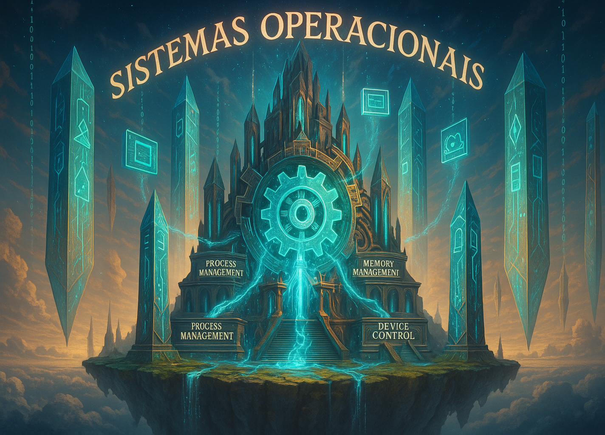

  

 

# Sistemas Operacionais

A disciplina de **Sistemas Operacionais** é o elo fundamental entre o **hardware físico** e as **aplicações de software**, responsável por **gerenciar os recursos do computador e oferecer uma interface funcional para os usuários e programas**. Ela estuda **como os sistemas controlam, coordenam e otimizam o uso dos componentes físicos e lógicos**, garantindo que múltiplas tarefas possam ser executadas de forma eficiente, segura e organizada.

Enquanto os usuários interagem diretamente com programas e aplicações, é o **Sistema Operacional (SO)** que trabalha nos bastidores, realizando funções essenciais como **gerenciamento de processos**, **controle de memória**, **acesso a dispositivos de entrada e saída (E/S)** e **administração de arquivos e permissões**. Sem um SO, um computador moderno seria apenas um conjunto de hardware sem capacidade de operação prática.

Essa disciplina é crucial para entender **como o computador oferece suporte à multitarefa**, **como ele gerencia conflitos de acesso aos recursos**, e **como garante segurança, isolamento e desempenho na execução dos programas**. Em outras palavras, estudar Sistemas Operacionais é desvendar o **motor invisível que mantém os computadores funcionando de forma ordenada e eficiente**.

Os principais conceitos e temas abordados na disciplina de Sistemas Operacionais incluem:

- **Gerenciamento de Processos e Threads**: Organização e controle da execução de tarefas, incluindo escalonamento, criação, sincronização e comunicação entre processos e threads.
- **Gerenciamento de Memória**: Técnicas como **memória virtual**, **paginação**, **segmentação** e controle do uso da RAM, permitindo que múltiplos programas compartilhem o espaço de memória de forma eficiente e segura.
- **Sistemas de Arquivos**: Estruturas e métodos para organização, armazenamento e acesso aos dados em discos e outros dispositivos, além de garantir integridade e controle de permissões.
- **Gerenciamento de Dispositivos e Entrada/Saída**: Abstração e controle do acesso aos diversos dispositivos periféricos, otimizando o fluxo de dados entre hardware e software.
- **Escalonamento de Processos**: Algoritmos que decidem qual processo será executado em determinado momento, balanceando critérios como desempenho, justiça e tempo de resposta.
- **Segurança e Controle de Acesso**: Mecanismos que protegem o sistema contra acessos não autorizados, isolam processos e garantem a privacidade e integridade dos dados.
- **Sistemas Distribuídos e Virtualização**: Extensões dos conceitos de sistemas operacionais para ambientes com múltiplos computadores conectados ou sistemas virtualizados.

Compreender Sistemas Operacionais permite **desenvolver softwares mais robustos**, **solucionar problemas de desempenho e estabilidade**, e **atuar na administração de servidores, dispositivos móveis, sistemas embarcados e ambientes em nuvem**. Este conhecimento é essencial tanto para desenvolvedores quanto para administradores de sistemas e engenheiros de infraestrutura.

Em um mundo cada vez mais conectado, com demandas crescentes por **eficiência, escalabilidade e segurança**, dominar os princípios dos Sistemas Operacionais **não é apenas uma vantagem competitiva — é uma competência indispensável para qualquer profissional que deseje atuar com excelência no universo da tecnologia**.

## Índice de Conteúdos

Abaixo segue o índice com diversos conteúdos sobre sistemas operacionais.

- x
