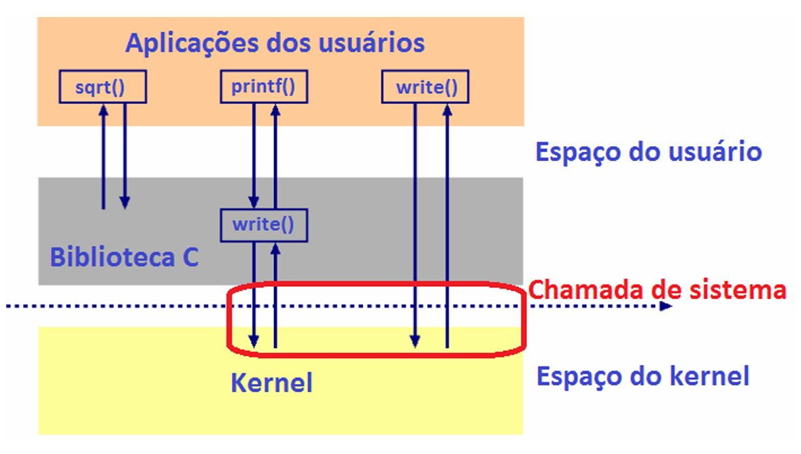
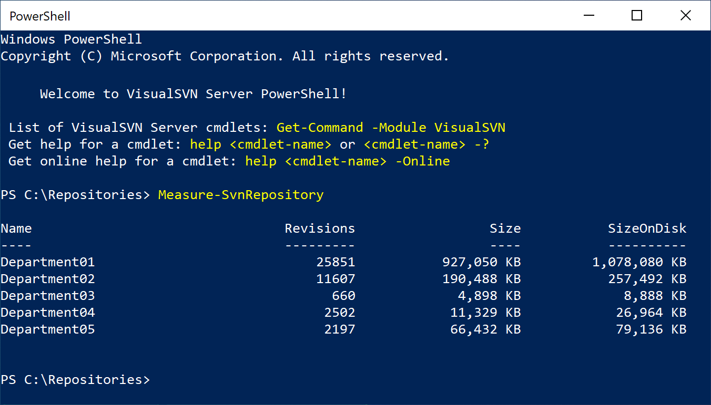
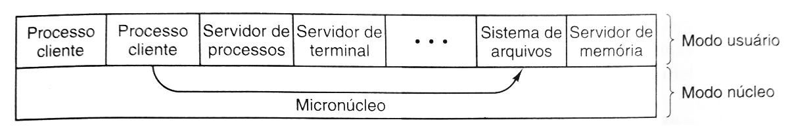

# Capítulo 1 – Conceitos Básicos

Ao iniciarmos nossa jornada pelo universo dos Sistemas Operacionais, é comum que os primeiros nomes que surjam em nossa mente sejam Windows, Linux, Android, iOS, entre outros. Estes são, de fato, exemplos proeminentes e amplamente utilizados na atualidade. Contudo, para compreendermos verdadeiramente o papel e a importância dessas complexas peças de software, precisamos ir além dos nomes e investigar: o que, de fato, define um **Sistema Operacional (S.O.)**?

Em sua essência, um Sistema Operacional desempenha duas funções primordiais e interdependentes que são cruciais para a interação entre o usuário, os aplicativos e o hardware do computador:

- **Abstração da Máquina (Máquina Estendida ou Virtual):** O hardware de um computador, com seus circuitos, registradores e sinais elétricos, é intrinsecamente complexo. O S.O. atua como uma camada intermediária que oculta essa complexidade, apresentando ao usuário e aos programadores uma interface mais amigável e abstrata. Ele transforma a máquina física em uma **máquina estendida** (ou **máquina virtual**), mais fácil de usar e programar. Afinal, "alguém" precisa "conversar" com os componentes físicos de forma inteligível.
- **Gerenciamento de Recursos:** Um computador moderno é um ecossistema de diversos recursos: processadores (CPUs), memória principal (RAM), dispositivos de armazenamento (HDs, SSDs), dispositivos de entrada e saída (teclado, mouse, monitor, impressora, placa de rede), arquivos, entre outros. O S.O. é o maestro dessa orquestra, responsável por gerenciar de forma eficiente e ordenada todos esses recursos, alocando-os aos diversos programas e usuários que deles necessitam, resolvendo conflitos e otimizando o desempenho geral do sistema.

## Funções Essenciais de um Sistema Operacional

Expandindo um pouco mais a visão sobre suas responsabilidades, podemos detalhar algumas das funções cruciais que um Sistema Operacional desempenha para garantir o funcionamento coeso e eficiente de um sistema computacional:

- **Interface com o Usuário:** Fornecer uma maneira para que o usuário possa interagir com o computador, seja através de interfaces gráficas (GUIs), linhas de comando (shells) ou outras formas.
- **Execução e Gerenciamento de Programas:** Carregar programas na memória, executá-los, gerenciar sua execução (controlando o acesso a recursos) e finalizá-los.
- **Gerenciamento de Memória:** Controlar quais partes da memória estão em uso, por quais processos, alocar e desalocar espaço de memória dinamicamente conforme a necessidade dos programas.
- **Gerenciamento de Arquivos e Armazenamento:** Organizar e controlar o armazenamento de dados em dispositivos secundários, permitindo que programas e usuários criem, leiam, escrevam, apaguem e manipulem arquivos e diretórios.
- **Gerenciamento de Dispositivos de Entrada e Saída (E/S):** Controlar a comunicação entre o computador e seus periféricos, gerenciando o fluxo de dados e tratando interrupções.
- **Escalonamento de Processos e Recursos:** Decidir qual programa utilizará o processador e outros recursos em um determinado momento, especialmente em sistemas multitarefa, impondo uma ordem e justiça no acesso.
- **Tratamento de Erros e Exceções:** Detectar e responder a erros de hardware ou software, tentando recuperar o sistema ou, no mínimo, informar o usuário sobre o problema de forma clara.
- **Contabilidade e Monitoramento:** Manter registros do uso de recursos, monitorar o desempenho do sistema e fornecer informações para otimizações ou diagnósticos.
- **Segurança e Proteção:** Garantir que os recursos do sistema sejam utilizados apenas por usuários e programas autorizados, protegendo dados e processos contra acessos indevidos ou maliciosos.

Essa lista, embora não exaustiva, ilustra a amplitude e a criticidade das tarefas executadas por um Sistema Operacional.

## A Ponte entre o Hardware e o Software: Chamadas de Sistema e Modos de Operação

Considerando que o Sistema Operacional atua como um intermediário essencial entre o hardware e os programas do usuário, surge uma questão fundamental: como um programador, ao desenvolver uma aplicação, solicita serviços ao S.O., como, por exemplo, ler dados de um disco ou enviar informações pela rede? A resposta reside nas **chamadas de sistema (system calls)**.

As chamadas de sistema podem ser vistas como uma **interface** que o Sistema Operacional oferece aos programas aplicativos. Elas funcionam como "instruções estendidas" ou um conjunto de funções predefinidas que os programas podem invocar para requisitar serviços que exigem acesso privilegiado ao hardware ou a recursos gerenciados pelo S.O. Essa abordagem abstrai do programador os detalhes complexos de "baixo nível" da interação com o hardware (como manipular registradores específicos de um controlador de disco) e, crucialmente, garante a integridade e a segurança do sistema, impedindo que programas de usuário realizem operações que possam comprometer o funcionamento do computador ou de outros programas.

Vejamos um exemplo conceitual, utilizando a linguagem C, para ilustrar a necessidade de chamadas de sistema:

```c
#include <stdio.h>
#include <math.h>
#include <unistd.h> // Para a função write (exemplo de chamada de sistema em UNIX-like)
#include <fcntl.h>  // Para open
#include <string.h> // Para strlen

int main() {
    double numero = 9.0;
    double raiz;
    int arquivo_desc;
    char buffer[] = "Teste de escrita em arquivo!\n";

    // Operação que NÃO necessita de chamada de sistema (cálculo matemático)
    raiz = sqrt(numero); // Executa em espaço do usuário
    printf("A raiz quadrada de %.2f eh %.2f\n", numero, raiz);

    // Operações que NECESSITAM de chamadas de sistema (operações de E/S em arquivo)
    // Abrir/criar um arquivo para escrita (chamada de sistema 'open')
    arquivo_desc = open("exemplo.txt", O_WRONLY | O_CREAT | O_TRUNC, 0644);
    if (arquivo_desc < 0) {
        perror("Erro ao abrir o arquivo");
        return 1;
    }

    // Escrever no arquivo (chamada de sistema 'write')
    if (write(arquivo_desc, buffer, strlen(buffer)) < 0) { // Transição para modo kernel
        perror("Erro ao escrever no arquivo");
        close(arquivo_desc);
        return 1;
    }
    printf("Dados escritos no arquivo 'exemplo.txt'\n");

    // Fechar o arquivo (chamada de sistema 'close')
    close(arquivo_desc); // Transição para modo kernel

    return 0;
}
```

<div align="center">
  
</div>

Analisando a Figura, percebemos uma distinção importante na execução do código. A função `sqrt()` (square root – raiz quadrada), que calcula a raiz quadrada de um número, é uma operação puramente matemática que pode ser executada integralmente no **espaço do usuário**. Ela recebe um valor como entrada, realiza um cálculo e retorna um resultado, sem precisar acessar diretamente recursos de hardware controlados ou interagir com o núcleo do sistema de forma privilegiada.

Por outro lado, a operação de escrita em um arquivo, representada pela função `write()` (e precedida pela `open()` para abrir o arquivo e sucedida pela `close()` para fechá-lo), é intrinsecamente diferente. Para que o programa possa escrever dados em um dispositivo de armazenamento (como um HD, SSD ou pen drive), é indispensável que o Sistema Operacional intervenha. Isso ocorre porque o acesso direto a dispositivos de hardware é uma operação privilegiada, que poderia causar danos irreparáveis ao sistema se fosse mal conduzida por um programa de usuário. Assim, quando a função `write()` é invocada, ocorre uma transição controlada para o **modo kernel**.

### Kernel: O Coração do Sistema Operacional

Mas o que exatamente é esse "kernel" e o "modo kernel" que mencionamos? O **kernel** é o **núcleo central e fundamental do Sistema Operacional**. É a porção do S.O. que possui controle total e irrestrito sobre tudo o que acontece no sistema. Ele é um dos primeiros componentes de software a serem carregados na memória durante o processo de inicialização do computador (boot) e, uma vez em execução, assume a responsabilidade de inicializar e gerenciar todo o hardware, desde processadores e memória até dispositivos periféricos.

O kernel atua como um gerente de recursos de baixo nível, tratando solicitações de entrada e saída (E/S) provenientes do software, alocando e gerenciando a memória do sistema, controlando o acesso a dispositivos periféricos e orquestrando a execução de múltiplos programas. Dada a sua criticidade, uma simples atualização ou alteração na versão do kernel pode ser suficiente para resolver problemas de compatibilidade de hardware, melhorar o desempenho ou corrigir falhas de segurança.

### Modo Kernel vs. Modo Usuário

Para proteger o sistema contra falhas ou ações maliciosas de programas aplicativos, os processadores modernos geralmente suportam pelo menos dois modos de operação distintos:

- **Modo Kernel (ou Modo Supervisor, Modo Privilegiado):** Neste modo, o código em execução (tipicamente o kernel do S.O.) tem acesso irrestrito a todas as instruções da máquina e a todas as áreas da memória. É no modo kernel que o S.O. realiza suas tarefas críticas de gerenciamento de hardware e recursos. Instruções que manipulam diretamente o hardware, configuram a memória ou controlam o acesso a dispositivos são consideradas **instruções privilegiadas** e só podem ser executadas neste modo.
- **Modo Usuário:** Neste modo, os programas aplicativos são executados. O código em modo usuário só pode executar um subconjunto limitado de instruções da máquina, conhecidas como **instruções não privilegiadas**. Essas são instruções que não oferecem risco direto à integridade do sistema (ex: operações aritméticas, manipulação de dados em sua própria área de memória). Se um programa em modo usuário tenta executar uma instrução privilegiada diretamente, o processador geralmente gera uma interrupção (uma exceção), e o controle é transferido para o kernel, que pode então tratar a tentativa de violação (por exemplo, finalizando o programa).

Quando um programa em modo usuário precisa realizar uma operação que exige privilégios (como a escrita em um arquivo no nosso exemplo anterior), ele faz isso através de uma **chamada de sistema**. Essa chamada provoca uma transição controlada e segura do modo usuário para o modo kernel. O kernel então executa a operação solicitada em nome do programa e, ao concluí-la, retorna o controle (e, se for o caso, um resultado) para o programa, que volta a operar em modo usuário. Esse mecanismo é essencial para a estabilidade e segurança dos sistemas operacionais modernos.

## Interface com o Usuário: GUI e Shell

Já exploramos como o kernel forma o núcleo do S.O., mas como o usuário interage com todo esse sistema? A "casca" ou a camada mais externa do Sistema Operacional, aquela que permite a interação direta do usuário, é a sua **interface**. Atualmente, a forma de interação mais difundida e intuitiva é a **GUI (Graphical User Interface – Interface Gráfica do Usuário)**.

Com uma GUI, o usuário interage com o Sistema Operacional por meio de elementos visuais como janelas, ícones, menus, botões e ponteiros (controlados por um mouse ou touchpad). Ações são realizadas clicando, arrastando e soltando esses elementos, tornando a experiência de uso mais acessível, especialmente para usuários menos técnicos. Sistemas como Windows, macOS, e as diversas distribuições Linux com ambientes gráficos como GNOME ou KDE, são exemplos clássicos de S.O. com GUIs ricas.

No entanto, antes do advento e popularização das GUIs, e ainda hoje como uma ferramenta poderosa para usuários avançados e administradores de sistema, existe o **shell**. O shell é um tipo de interface baseada em texto, um programa que atua como **interpretador de comandos**. Ele lê os comandos digitados pelo usuário no teclado, interpreta-os e passa as instruções e seus parâmetros para o Sistema Operacional executar. Por essa razão, também é frequentemente chamado de **CLI (Command-Line Interface – Interface de Linha de Comando)**.

Historicamente, os primeiros sistemas operacionais tinham o shell como sua única interface. Com a evolução da tecnologia e a busca por maior facilidade de uso, as GUIs gradualmente dominaram o mercado de computadores pessoais. Contudo, o shell permanece uma ferramenta indispensável em muitos cenários, como:

- Administração de servidores, onde interfaces gráficas podem consumir recursos desnecessários.
- Automação de tarefas através de scripts.
- Acesso a funcionalidades avançadas do S.O. que não estão disponíveis na GUI.
- Ambientes com recursos limitados.

Abaixo, um exemplo de shell, o **PowerShell**, que é o interpretador de comandos moderno do sistema operacional Windows, oferecendo funcionalidades avançadas de scripting e gerenciamento:

<div align="center">
  
</div>

É importante notar que muitos sistemas operacionais oferecem ambas as interfaces. Um usuário pode estar utilizando a GUI para a maioria das tarefas e, quando necessário, abrir uma janela de terminal para executar comandos específicos via shell.

## Tipos de Gerenciamento Fundamentais do S.O.

Conforme a complexidade dos sistemas computacionais foi crescendo, os Sistemas Operacionais assumiram um conjunto de responsabilidades de gerenciamento cada vez mais sofisticadas. De forma geral, e frequentemente destacada na literatura especializada, podemos identificar quatro tipos principais de gerenciamento que são intrínsecos à função de um S.O.:

1. **Gerenciamento de Processos:** Um **processo** é a unidade básica de trabalho em um sistema operacional; ele pode ser definido como um programa em execução. O S.O. é responsável por todas as atividades relacionadas aos processos, incluindo:
    - **Criação e Exclusão:** Iniciar novos processos e terminar processos que concluíram sua execução ou que precisam ser interrompidos.
    - **Suspensão e Retomada:** Pausar temporariamente a execução de processos e, posteriormente, permitir que continuem.
    - **Sincronização:** Fornecer mecanismos para que processos que cooperam entre si possam sincronizar suas ações, evitando condições de corrida ou deadlocks.
    - **Comunicação:** Oferecer mecanismos para que processos possam trocar informações entre si (Comunicação Interprocessos – IPC).
    - **Escalonamento:** Decidir qual processo deve utilizar a CPU em um determinado momento, distribuindo o tempo do processador de forma justa e eficiente.
2. **Gerenciamento de Memória Principal (RAM):** A memória principal é um recurso volátil e crucial onde os programas e seus dados residem enquanto estão em execução. O S.O. gerencia este recurso controlando:
    - **Alocação e Desalocação:** Decidir quais partes da memória estão em uso, por quais processos, e liberar a memória quando não é mais necessária.
    - **Rastreamento:** Manter o controle do estado de cada porção da memória.
    - **Memória Virtual:** Em muitos sistemas, gerenciar um espaço de endereçamento virtual para cada processo, que pode ser maior que a memória física disponível, utilizando técnicas como paginação e segmentação, e recorrendo ao disco como uma extensão da RAM (swap).
3. **Gerenciamento de Dispositivos de Entrada/Saída (E/S):** O S.O. gerencia a miríade de dispositivos de E/S conectados ao computador (teclados, mouses, monitores, impressoras, discos, placas de rede, etc.). Isso inclui:
    - **Interface Unificada:** Fornecer uma interface abstrata e consistente para que os programas possam interagir com diferentes dispositivos sem precisar conhecer os detalhes específicos de hardware de cada um (geralmente através de drivers de dispositivo).
    - **Comunicação com Dispositivos:** Enviar comandos aos dispositivos, receber dados deles e tratar os sinais de interrupção que eles geram para indicar a conclusão de uma operação ou a ocorrência de um evento.
    - **Gerenciamento de Buffers e Caches:** Utilizar áreas de memória temporária (buffers) para otimizar a transferência de dados entre dispositivos lentos e a CPU rápida, e caches para armazenar dados frequentemente acessados.
    - **Tratamento de Erros:** Detectar e tratar erros que possam ocorrer durante as operações de E/S.
4. **Gerenciamento de Armazenamento Secundário (Sistema de Arquivos):** Dispositivos de armazenamento secundário (HDs, SSDs, pen drives) são usados para armazenar dados e programas de forma persistente. O S.O. gerencia esse armazenamento através do **sistema de arquivos**, que é responsável por:
    - **Organização Lógica:** Fornecer uma estrutura lógica para que os usuários possam organizar dados em arquivos e diretórios (pastas).
    - **Mapeamento:** Traduzir os nomes lógicos de arquivos e diretórios para os endereços físicos nos dispositivos de armazenamento.
    - **Gerenciamento de Espaço Livre:** Rastrear quais blocos de armazenamento estão livres ou ocupados.
    - **Controle de Acesso e Segurança:** Definir e impor permissões de acesso a arquivos e diretórios, garantindo que apenas usuários autorizados possam lê-los ou modificá-los.
    - **Operações com Arquivos:** Permitir operações como criar, apagar, renomear, ler e escrever arquivos.

Esses quatro pilares de gerenciamento são interdependentes e interagem constantemente para prover um ambiente computacional funcional, eficiente e seguro.

## Arquiteturas de Kernel e Outras Classificações de Sistemas Operacionais

A forma como o núcleo (kernel) de um Sistema Operacional é estruturado internamente tem um impacto profundo em seu desempenho, robustez, flexibilidade e complexidade. Existem diferentes abordagens arquiteturais para o design do kernel, cada uma com suas vantagens e desvantagens. Vamos explorar as mais comuns:

### Kernel Monolítico

Na arquitetura de **kernel monolítico**, todos os principais componentes do Sistema Operacional (ou uma grande parte deles), como gerenciamento de processos, gerenciamento de memória, sistema de arquivos, drivers de dispositivo e chamadas de sistema, são executados em um único espaço de endereçamento privilegiado: o **espaço de núcleo (kernel space)**.

- **Características:**
    - **Estrutura Única:** O kernel é compilado como um único arquivo executável grande e coeso. Todas as suas rotinas e módulos internos podem se comunicar diretamente e de forma eficiente, pois residem no mesmo espaço de memória.
    - **Alto Desempenho:** A comunicação entre os componentes do kernel é muito rápida (geralmente através de chamadas de função diretas), o que pode resultar em um bom desempenho geral do sistema.
    - **Acesso Direto ao Hardware:** Todos os componentes do kernel têm acesso completo e direto ao hardware.
    - **Chamada de Supervisor:** A transição entre o modo usuário e o modo núcleo ocorre através de uma chamada de sistema (ou chamada de supervisor).
- **Desvantagens:**
    - **Robustez:** Se ocorrer um erro crítico (um bug) em qualquer parte do kernel (por exemplo, em um driver de dispositivo mal implementado), todo o sistema pode ser afetado, levando a uma falha geral (kernel panic ou "tela azul da morte").
    - **Manutenção e Desenvolvimento:** Modificar ou adicionar novas funcionalidades a um kernel monolítico pode ser complexo, pois qualquer alteração pode ter impacto em outras partes do sistema. O tamanho do código-base também pode ser um desafio.
    - **Portabilidade:** Adaptar um kernel monolítico para diferentes arquiteturas de hardware pode ser mais trabalhoso.
- **Exemplos:** Sistemas Unix tradicionais, Linux, BSDs (FreeBSD, OpenBSD, NetBSD) e MS-DOS. Embora o Linux seja monolítico, ele adota um design modular que permite carregar e descarregar módulos (como drivers) dinamicamente, o que lhe confere certa flexibilidade.

### Microkernel (Micronúcleo)

A arquitetura de **microkernel** (ou micronúcleo) adota uma abordagem oposta à monolítica. A ideia central é manter o kernel o menor e mais simples possível, executando apenas as funcionalidades absolutamente essenciais no espaço de núcleo.

- **Características:**
    - **Núcleo Mínimo:** O microkernel tipicamente lida apenas com as funções mais básicas, como gerenciamento de processos de baixo nível (criação e escalonamento), comunicação interprocessos (IPC) e, possivelmente, algum gerenciamento básico de memória.
    - **Serviços no Espaço do Usuário:** Muitas funcionalidades que tradicionalmente residem no kernel monolítico (como sistemas de arquivos, drivers de dispositivo, gerenciamento de rede) são implementadas como processos servidores separados, executando no **espaço do usuário**.
    - **Comunicação via Mensagens:** Os componentes do sistema (incluindo os serviços no espaço do usuário e as aplicações) se comunicam com o microkernel e entre si através de mecanismos de troca de mensagens (IPC).
- **Vantagens:**
    - **Robustez e Estabilidade:** Se um serviço no espaço do usuário falhar (por exemplo, um driver de dispositivo), apenas aquele serviço é afetado. Ele pode ser reiniciado sem derrubar todo o sistema operacional. Isso torna o sistema potencialmente mais estável.
    - **Segurança:** Como menos código roda em modo privilegiado, a superfície de ataque do kernel é menor.
    - **Flexibilidade e Extensibilidade:** Adicionar novos serviços ou modificar os existentes pode ser mais fácil, pois eles são módulos independentes no espaço do usuário.
    - **Portabilidade:** O microkernel, sendo menor, pode ser mais fácil de portar para novas arquiteturas de hardware.
- **Desvantagens:**
    - **Desempenho:** A comunicação via troca de mensagens entre processos no espaço do usuário e o microkernel (ou entre diferentes processos servidores) é geralmente mais lenta do que chamadas de função diretas dentro de um kernel monolítico. Isso pode levar a uma sobrecarga de desempenho (overhead) em algumas operações.
    - **Complexidade da Comunicação:** O design de um sistema eficiente de IPC pode ser complexo.
- **Exemplos:** Minix 3, GNU Hurd, QNX, L4 microkernel family e, em certa medida, o Mach (que influenciou o macOS e iOS).

### Kernel Híbrido

A arquitetura de **kernel híbrido** tenta combinar as melhores características das abordagens monolítica e microkernel, buscando um equilíbrio entre desempenho, robustez e modularidade.

- **Características:**
    - **Estrutura Combinada:** Um kernel híbrido geralmente possui um núcleo maior que um microkernel puro, mas não tão extenso quanto um kernel monolítico tradicional.
    - **Código Essencial e Não Essencial no Kernel Space:** Ele mantém alguns serviços ou componentes "não essenciais" (que poderiam estar no espaço do usuário em um microkernel puro) dentro do espaço de núcleo para melhorar o desempenho. No entanto, ele ainda pode usar mecanismos de passagem de mensagens para comunicação entre certos componentes ou para permitir que serviços sejam executados como processos separados.
    - **Modularidade:** Frequentemente permite o carregamento dinâmico de módulos ou drivers.
- **Objetivo:** A ideia é obter a estabilidade e a segurança de um design mais modular (semelhante ao microkernel) e, ao mesmo tempo, alcançar um desempenho mais próximo ao de um kernel monolítico para operações críticas, mantendo código sensível ao desempenho no espaço de núcleo.
- **Exemplos:** Microsoft Windows (a partir da linha NT), macOS (XNU kernel, que é baseado no Mach microkernel mas incorpora componentes do BSD monolítico), BeOS, e em certa medida, o Android (que usa o kernel Linux, que é monolítico, mas com uma arquitetura de sistema acima dele que tem características de microkernel com seus serviços e daemons).

### Sistemas Exonúcleos (Exokernels)

Uma abordagem menos comum, mas conceitualmente interessante, é a dos **sistemas exonúcleos (exokernels)**. A filosofia por trás do exonúcleo é dar às aplicações o controle mais direto possível sobre os recursos de hardware, minimizando as abstrações impostas pelo Sistema Operacional.

- **Características:**
    - **Núcleo Mínimo para Proteção e Multiplexação:** O exonúcleo em si é extremamente pequeno. Sua principal responsabilidade é garantir a proteção (impedindo que uma aplicação acesse recursos de outra) e a multiplexação segura dos recursos de hardware (como CPU, memória, disco, rede) entre as diferentes aplicações.
    - **Controle de Recursos pela Aplicação:** Em vez de o S.O. impor políticas de gerenciamento de recursos (como algoritmos de escalonamento de CPU ou gerenciamento de cache de disco), o exonúcleo permite que cada aplicação (ou bibliotecas de sistema operacional no nível do usuário) implemente suas próprias políticas otimizadas para suas necessidades específicas. Por exemplo, uma aplicação de banco de dados poderia gerenciar diretamente seus blocos de disco e sua própria política de cache.
    - **Bibliotecas de Sistema Operacional (LibOSes):** Como o exonúcleo oferece uma interface de muito baixo nível, ele é geralmente complementado por **bibliotecas de sistema operacional (LibOSes)** que rodam no espaço do usuário. Essas bibliotecas fornecem as abstrações e funcionalidades de S.O. mais tradicionais (como sistemas de arquivos, APIs de rede) para as aplicações, mas a diferença crucial é que a aplicação pode escolher qual LibOS usar ou até mesmo implementar suas próprias.
- **Vantagens:**
    - **Desempenho Potencialmente Maior:** Ao permitir que as aplicações gerenciem recursos de forma otimizada para seus próprios padrões de uso, pode-se evitar a sobrecarga de abstrações genéricas do S.O. e alcançar um desempenho melhor para aplicações especializadas.
    - **Flexibilidade e Inovação:** Permite a experimentação com novas abstrações de S.O. e políticas de gerenciamento de recursos no nível da aplicação, sem precisar modificar o núcleo do sistema.
- **Desvantagens:**
    - **Complexidade para o Desenvolvedor de Aplicações:** A responsabilidade de gerenciar recursos de baixo nível é transferida para o desenvolvedor da aplicação ou da LibOS, o que aumenta significativamente a complexidade do desenvolvimento.
    - **Segurança e Proteção:** Garantir a proteção entre aplicações que têm controle tão direto sobre o hardware é um desafio significativo.
- **Contexto:** Os exonúcleos são mais uma área de pesquisa e sistemas experimentais do que uma abordagem amplamente adotada em sistemas comerciais, mas suas ideias influenciaram o pensamento sobre como os sistemas operacionais podem fornecer controle mais granular sobre os recursos.

### Sistemas em Camadas

A ideia de construir um Sistema Operacional em **camadas hierárquicas** é uma abordagem clássica para organizar sua complexidade. Cada camada é construída sobre a camada inferior, utilizando apenas os serviços e funcionalidades que esta oferece, e, por sua vez, provê serviços para a camada superior.

- **Estrutura:** O sistema é dividido em um número de camadas (níveis), cada uma com uma funcionalidade bem definida. A camada mais inferior (Camada 0) é geralmente o hardware, e a camada mais superior (Camada N) é a interface com o usuário.
- **Comunicação:** Uma camada só pode invocar operações de camadas imediatamente inferiores.
- **Vantagens:**
    - **Modularidade e Abstração:** Facilita o design, a implementação e a verificação do sistema, pois cada camada lida com um subconjunto específico de funcionalidades e oculta os detalhes das camadas inferiores.
    - **Manutenção:** Modificações em uma camada, desde que sua interface com as camadas adjacentes seja mantida, não deveriam afetar as outras camadas.
- **Desvantagens:**
    - **Definição das Camadas:** Definir as camadas apropriadas e suas funcionalidades pode ser difícil.
    - **Desempenho:** A passagem de controle e dados através de múltiplas camadas pode introduzir sobrecarga de desempenho.

O primeiro sistema operacional notável construído dessa maneira foi o **sistema THE (Technische Hogeschool Eindhoven)**, desenvolvido na Holanda por Edsger Dijkstra e sua equipe. O sistema THE para o computador Electrologica X8 possuía seis camadas, conforme descrito na sua anotação:

|**Camada**|**Função**|
|---|---|
|5|Operador|
|4|Programas de usuário|
|3|Gerenciamento de E/S (entrada e saída)|
|2|Comunicação operador-processo (console)|
|1|Gerenciamento de memória e tambor (swap)|
|0|Alocação do processador e multiprogramação|

Essa estrutura em camadas influenciou muitos designs de sistemas operacionais subsequentes.

### Máquinas Virtuais (VMs)

A abordagem de **máquinas virtuais** estende o conceito de camadas e de abstração do hardware. Uma máquina virtual (VM) cria a ilusão de que cada processo está rodando em seu próprio computador, com seu próprio conjunto de recursos de hardware (processador, memória, disco).

- **Características:**
    - **Cópia do Hardware:** Uma VM fornece uma interface que é **idêntica ao hardware subjacente**. Isso significa que uma VM pode executar qualquer sistema operacional que rodaria no hardware real.
    - **Isolamento:** Múltiplas VMs podem rodar em um único computador físico, cada uma isolada das outras. Uma falha em uma VM não afeta as demais.
    - **Monitor de Máquina Virtual (VMM) ou Hypervisor:** O componente de software que cria e gerencia as VMs é chamado de VMM ou hypervisor. Ele roda diretamente no hardware (Tipo 1 ou bare-metal) ou sobre um sistema operacional hospedeiro (Tipo 2).
- **Vantagens:**
    - **Consolidação de Servidores:** Permite rodar múltiplos sistemas operacionais e aplicações em um único servidor físico, economizando custos de hardware e energia.
    - **Teste e Desenvolvimento:** Facilita o teste de software em diferentes ambientes de S.O. sem a necessidade de múltiplas máquinas físicas.
    - **Segurança e Isolamento:** O isolamento entre VMs pode melhorar a segurança.
    - **Portabilidade e Migração:** VMs podem ser facilmente movidas ou migradas entre diferentes servidores físicos.
- **Desvantagens:**
    - **Desempenho:** A camada de virtualização pode introduzir alguma sobrecarga de desempenho em comparação com a execução direta no hardware.
    - **Complexidade de Gerenciamento:** Gerenciar múltiplas VMs pode ser complexo.

### Modelo Cliente-Servidor

O **modelo cliente-servidor**, no contexto de arquiteturas de S.O., está intimamente relacionado à abordagem de microkernel. A ideia é minimizar o código que roda no kernel e mover a maior parte das funcionalidades do Sistema Operacional para processos que rodam no espaço do usuário, conhecidos como **processos servidores**.

- **Estrutura:**
    - **Microkernel:** Um núcleo mínimo é responsável pelas funções mais básicas (comunicação, algum gerenciamento de processos e memória).
    - **Processos Servidores:** Cada funcionalidade principal do S.O. (como sistema de arquivos, gerenciamento de rede, interface gráfica) é implementada por um ou mais processos servidores.
    - **Processos Clientes:** As aplicações do usuário são os clientes, que requisitam serviços aos processos servidores.
    - **Comunicação via Mensagens:** A interação entre clientes e servidores (e entre servidores) ocorre através da troca de mensagens, geralmente gerenciada pelo microkernel.

A figura ilustra esse conceito, onde vários processos servidores oferecem serviços, e processos clientes (e até mesmo outros servidores) interagem com eles através de mensagens mediadas pelo kernel.

<div align="center">
  
</div>

- **Vantagens:** Semelhantes às do microkernel: maior robustez (falha de um servidor não derruba o sistema), flexibilidade (servidores podem ser atualizados ou substituídos independentemente) e potencial para sistemas distribuídos (servidores podem rodar em máquinas diferentes).
- **Desvantagens:** Também semelhantes às do microkernel, principalmente a possível sobrecarga de desempenho devido à comunicação por mensagens.

## Classificação de Sistemas Operacionais: Monotarefa vs. Multitarefa

Além da arquitetura do kernel, os Sistemas Operacionais podem ser classificados de diversas outras formas. Uma das distinções mais fundamentais diz respeito à sua capacidade de executar múltiplas tarefas (ou processos) "ao mesmo tempo".

### Processos: A Instância de um Programa em Execução

Antes de prosseguirmos, vamos reforçar o conceito de **processo**. Um programa, por si só, é um conjunto estático de instruções armazenado em disco. Quando um programa é carregado na memória e começa a ser executado pela CPU, ele se torna um **processo**. Um processo é uma entidade dinâmica, com seu próprio estado (registradores da CPU, contador de programa, pilha de execução) e recursos alocados (memória, arquivos abertos, etc.).

É importante notar que um mesmo programa pode dar origem a múltiplos processos. Por exemplo, se você abrir cinco janelas diferentes do seu navegador Web, cada uma exibindo uma página HTML distinta, cada uma dessas janelas normalmente corresponderá a um processo separado (ou a um conjunto de processos cooperantes, dependendo da arquitetura do navegador). Todas são instâncias do mesmo programa navegador, mas cada uma é um processo independente em execução.

### Sistemas Monotarefa

Um **sistema monotarefa** é aquele que **não permite a execução de mais de um processo (tarefa) ao mesmo tempo**. Em um sistema estritamente monotarefa, apenas um programa pode estar ativo e utilizando os recursos do sistema (especialmente a CPU) em um dado instante. Quando esse programa termina ou é explicitamente fechado pelo usuário, outro programa pode então ser iniciado.

- **Características:**
    - Simplicidade de gerenciamento de processos (pois há apenas um).
    - Não há necessidade de compartilhar a CPU ou outros recursos complexamente.
    - Típico de sistemas operacionais muito antigos (como o MS-DOS em seus primórdios) ou de sistemas embarcados muito simples com recursos extremamente limitados.

### Sistemas Multitarefa

Um **sistema multitarefa** é aquele que possui a capacidade de executar **vários processos aparentemente de forma simultânea**. Mesmo em um sistema com um único núcleo de processamento (single-core CPU), o S.O. multitarefa cria a ilusão de paralelismo ao alternar rapidamente a CPU entre os diversos processos que estão prontos para executar. Essa técnica é conhecida como **multiplexação no tempo** da CPU.

O Sistema Operacional divide o tempo do processador em pequenas fatias (time slices) e aloca uma fatia para cada processo em uma espécie de rodízio. Como essa alternância é muito rápida (milhares ou milhões de vezes por segundo), o usuário tem a impressão de que vários programas estão rodando ao mesmo tempo.

Uma distinção crucial dentro dos sistemas multitarefa é se eles são **preemptivos** ou **cooperativos (não preemptivos)**:

- **Multitarefa Cooperativa (Não Preemptiva):** Neste modelo, um processo continua executando até que ele, voluntariamente, libere a CPU para outro processo. Isso pode ocorrer quando o processo termina, quando ele realiza uma operação de E/S (que o fará esperar) ou quando ele explicitamente chama uma função do S.O. para ceder o processador.
    - **Problema:** Um processo mal comportado ou com um bug pode monopolizar a CPU, impedindo que outros processos executem e tornando o sistema não responsivo.
    - **Exemplo:** Windows 3.x utilizava multitarefa cooperativa.
- **Multitarefa Preemptiva:** Neste modelo, o Sistema Operacional tem o controle total sobre o escalonamento da CPU. Ele pode **interromper (preemptar)** a execução de um processo que está rodando, mesmo que este não queira ceder o processador, para dar a vez a outro processo. Essa interrupção é geralmente baseada em um temporizador (timer interrupt) que sinaliza ao S.O. que o tempo alocado ao processo atual expirou.
    - **Vantagem:** Garante que nenhum processo possa monopolizar a CPU, tornando o sistema mais responsivo e estável. Permite um escalonamento mais justo e eficiente dos processos, baseado em prioridades ou outros algoritmos.
    - **Complexidade:** Requer mecanismos mais sofisticados no S.O. para gerenciar o contexto dos processos (salvar e restaurar o estado da CPU quando há uma troca) e para lidar com a sincronização de acesso a recursos compartilhados.
    - **Dominante Hoje:** A grande maioria dos sistemas operacionais modernos (Windows NT e posteriores, Linux, macOS, Android, iOS) utiliza multitarefa preemptiva.

O **escalonamento de processos**, que é a tarefa do S.O. de decidir qual processo executará em seguida e por quanto tempo, é uma função crítica em sistemas multitarefa preemptivos e é realizado por um componente do kernel chamado **escalonador (scheduler)**, que utiliza algoritmos específicos para tomar essas decisões.

### Processos em Primeiro Plano (Foreground) vs. Segundo Plano (Background)

Em sistemas multitarefa, especialmente aqueles com interfaces gráficas, os processos podem ser categorizados com base em sua interação com o usuário:

- **Processo em Primeiro Plano (Foreground):** É o processo com o qual o usuário está interagindo diretamente no momento. Geralmente, é a janela ativa na tela. Exemplos incluem um editor de texto que você está usando, um navegador Web onde você está digitando, ou um jogo que está sendo jogado. Processos em primeiro plano costumam ter prioridade mais alta no acesso à CPU e a recursos de E/S para garantir uma boa responsividade à interação do usuário.
- **Processo em Segundo Plano (Background):** É um processo que está em execução, mas não está recebendo interação direta do usuário no momento e, muitas vezes, não possui uma interface gráfica visível. Ele continua a operar suas funções "nos bastidores". Exemplos incluem um servidor Web que está aguardando requisições, um antivírus que está escaneando arquivos, um serviço de atualização de software, ou um backup automático.

### Daemons (Serviços)

Um **daemon** (pronuncia-se "dímon" ou "dêimon") é um tipo especial de processo que é executado continuamente em **segundo plano (background)**, geralmente sem qualquer forma de interação direta com o usuário através de uma interface gráfica. O termo "daemon" tem sua origem nos sistemas operacionais da família Unix, mas o conceito análogo existe em outros sistemas, como os "serviços" no Windows.

- **Características dos Daemons/Serviços:**
    - **Início Automático:** Muitos daemons são iniciados automaticamente durante o boot (inicialização) do sistema operacional e permanecem ativos enquanto o sistema está ligado.
    - **Sem Interface Direta com Usuário:** Eles não possuem uma janela ou interface gráfica com a qual o usuário interage rotineiramente. Se houver necessidade de configuração, isso geralmente é feito através de arquivos de configuração, ferramentas de linha de comando específicas ou painéis de controle.
    - **Funções Essenciais ou de Suporte:** Daemons realizam tarefas essenciais para o funcionamento do sistema ou fornecem serviços para outros programas ou usuários.
    - **Exemplos Comuns:**
        - `sshd`: Daemon do Secure Shell, permite logins remotos seguros.
        - `httpd` ou `nginx`: Servidores Web que respondem a requisições HTTP.
        - `cupsd`: Daemon do sistema de impressão (Common UNIX Printing System).
        - `cron` (em Unix-like) ou Agendador de Tarefas (Windows): Daemons/serviços que executam tarefas agendadas em horários específicos.
        - Serviços de rede, serviços de log, serviços de atualização, etc.

Os daemons são cruciais para a funcionalidade e a automação de muitas tarefas em um sistema operacional moderno.

## Outros Conceitos e Serviços Relevantes em Sistemas Operacionais

Além dos pilares de gerenciamento e das classificações que já exploramos, existem outros conceitos e serviços fornecidos pelos Sistemas Operacionais que são importantes para entendermos seu funcionamento e utilidade no dia a dia.

### Journaling em Sistemas de Arquivos

O **journaling** é uma técnica empregada por muitos sistemas de arquivos modernos (como NTFS no Windows, ext4 e XFS no Linux, HFS+ e APFS no macOS) para aumentar significativamente a **integridade dos dados e a velocidade de recuperação do sistema em caso de falhas inesperadas**, como uma queda de energia, um travamento do sistema (crash) ou um desligamento abrupto.

- **Como Funciona:** A ideia central do journaling é manter um **"jornal" ou "log"** em uma área dedicada do disco. Antes de realizar qualquer modificação diretamente na estrutura principal do sistema de arquivos (como escrever dados em um arquivo, criar um diretório ou atualizar metadados), o sistema de arquivos primeiro registra uma descrição dessas operações que **serão** realizadas no jornal.
    1. **Registro no Jornal (Log):** A intenção de modificar os dados ou metadados é escrita no jornal.
    2. **Aplicação das Mudanças (Commit):** As modificações são efetivamente aplicadas na estrutura principal do sistema de arquivos.
    3. **Marcação no Jornal:** Após a aplicação bem-sucedida, o jornal é atualizado para indicar que as operações registradas foram concluídas.
- **Recuperação Após Falha:** Se o sistema falhar durante o processo (por exemplo, após o registro no jornal, mas antes da aplicação completa das mudanças), quando o sistema é reiniciado, o S.O. pode verificar o jornal.
    - Se uma transação no jornal foi registrada como iniciada, mas não como concluída, o S.O. pode **"reproduzir" (replay)** as operações do jornal para garantir que as modificações sejam completadas e o sistema de arquivos retorne a um estado consistente.
    - Alternativamente, se a transação não pôde ser completada, ela pode ser **desfeita (rollback)**.
- **Benefícios:**
    - **Consistência:** Reduz drasticamente o risco de corrupção do sistema de arquivos, pois evita que ele fique em um estado intermediário e inconsistente após uma falha.
    - **Recuperação Rápida:** A verificação do jornal para restaurar a consistência é muito mais rápida do que uma varredura completa de toda a estrutura do sistema de arquivos (como era comum com ferramentas como `fsck` ou `CHKDSK` em sistemas sem journaling, que podiam levar horas em discos grandes).

O journaling, portanto, não previne a perda de dados que ainda não foram escritos no disco no momento da falha, mas garante que a _estrutura_ do sistema de arquivos permaneça consistente e rapidamente recuperável.

### Spool de Impressão

O termo **spool** é um acrônimo para **Simultaneous Peripheral Operations On-Line** (Operações Periféricas Simultâneas On-line). No contexto de Sistemas Operacionais, ele está mais comumente associado ao **spool de impressão**.

- **Conceito:** O spool de impressão é um sistema (ou uma área de armazenamento temporário no disco) que permite que múltiplos trabalhos de impressão, enviados por diferentes usuários ou aplicações, sejam enfileirados e processados em ordem pela impressora.
- **Funcionamento:**
    1. Quando um usuário ou aplicação envia um documento para impressão, em vez de o programa ter que esperar que a impressora (um dispositivo relativamente lento) processe todo o trabalho, o S.O. rapidamente armazena os dados do trabalho de impressão em uma área temporária no disco (o "spool").
    2. O programa que solicitou a impressão pode então continuar suas outras tarefas, pois sua responsabilidade de enviar os dados foi rapidamente concluída.
    3. Um processo gerenciador de impressão (muitas vezes um daemon ou serviço chamado "spooler") monitora essa fila de trabalhos no spool.
    4. O spooler envia os trabalhos para a impressora um de cada vez, na ordem em que foram recebidos (ou de acordo com prioridades definidas), assim que a impressora fica disponível.
- **Benefícios:**
    - **Eficiência:** Permite que os programas e usuários não fiquem bloqueados esperando pela impressora. Múltiplos trabalhos podem ser enviados rapidamente para a fila.
    - **Gerenciamento da Fila:** Enquanto um trabalho está no spool, ele pode ser gerenciado. Dependendo do sistema operacional e das permissões do usuário, é possível:
        - Cancelar um trabalho de impressão.
        - Pausar e retomar um trabalho.
        - Alterar a prioridade de um trabalho na fila.
        - Visualizar o status dos trabalhos.

O conceito de spooling não se limita à impressão; ele pode ser usado para gerenciar o acesso a qualquer dispositivo periférico que seja mais lento que a CPU e que precise lidar com múltiplas requisições.

### Outros Serviços Prestados pelo Sistema Operacional

Além dos quatro gerenciamentos fundamentais e dos conceitos de journaling e spooling, os Sistemas Operacionais modernos oferecem uma vasta gama de outros serviços que facilitam a vida do usuário e o desenvolvimento de aplicações:

- **Manutenção de Data e Hora:** O S.O. mantém o relógio do sistema atualizado e permite sua alteração (geralmente com permissões administrativas). Muitos S.O. também sincronizam automaticamente a hora com servidores de tempo na internet (NTP).
- **Gerenciamento de Usuários e Grupos:** Controlar quem pode usar o sistema, quais são seus privilégios, e agrupar usuários com permissões semelhantes. Isso inclui:
    - Listar os usuários que estão atualmente logados no sistema.
    - Fornecer mecanismos de autenticação (como login com usuário e senha, biometria, etc.).
- **Sistema de Segurança e Controle de Acesso:**
    - Proteger arquivos e diretórios através de permissões que definem quem pode ler, escrever ou executar cada recurso.
    - Controlar o acesso a recursos do sistema e a operações privilegiadas.
    - Mecanismos de firewall, auditoria de segurança, etc.
- **Serviços de Rede:** Fornecer pilhas de protocolos de rede (como TCP/IP) para permitir a comunicação com outros computadores e com a internet, incluindo configuração de interfaces de rede, resolução de nomes (DNS), etc.
- **Serviços de Acessibilidade:** Oferecer recursos para auxiliar usuários com deficiências (visuais, auditivas, motoras), como leitores de tela, lupas, legendas, teclado virtual, etc.
- **Instalação e Atualização de Software:** Gerenciar a instalação, remoção e atualização de programas e do próprio sistema operacional.
- **Interface de Programação de Aplicações (API):** Fornecer um conjunto bem definido de funções (as chamadas de sistema são parte disso, mas as APIs de S.O. são geralmente mais abrangentes) que os desenvolvedores podem usar para criar aplicações que interagem com o sistema e seus recursos de forma padronizada.

Esses serviços, combinados, transformam o hardware bruto em uma plataforma poderosa e utilizável para uma infinidade de aplicações e tarefas.

## Considerações Finais

Neste capítulo introdutório, navegamos pelos conceitos fundamentais que definem um Sistema Operacional. Vimos que ele atua como uma **máquina estendida**, abstraindo a complexidade do hardware, e como um eficiente **gerente de recursos**, orquestrando o uso de processadores, memória, dispositivos de E/S e armazenamento.

Exploramos a importância das **chamadas de sistema** como a ponte entre os programas aplicativos e os serviços privilegiados do **kernel**, o núcleo do S.O., e a distinção crucial entre **modo usuário** e **modo kernel** para a proteção e estabilidade do sistema. Discutimos as interfaces com o usuário, desde a tradicional **linha de comando (shell)** até as onipresentes **Interfaces Gráficas do Usuário (GUIs)**.

Aprofundamos nos quatro pilares de gerenciamento de um S.O.: **processos, memória, dispositivos de E/S e armazenamento (sistema de arquivos)**. Também abordamos as diversas **arquiteturas de kernel** (monolítico, microkernel, híbrido, exonúcleo, em camadas, máquinas virtuais e cliente-servidor), cada uma com suas particularidades em termos de design e compromissos.

Diferenciamos sistemas **monotarefa** de **multitarefa** (cooperativa e preemptiva) e introduzimos os conceitos de processos em **primeiro e segundo plano**, além dos **daemons (serviços)** que operam nos bastidores. Por fim, tocamos em outros conceitos importantes como **journaling** para a integridade de dados, **spool de impressão** para eficiência e uma variedade de outros **serviços essenciais** que tornam o S.O. uma plataforma completa.

Com esta base estabelecida, estamos prontos para mergulhar em tópicos mais específicos e aprofundados sobre o funcionamento interno e as complexidades dos Sistemas Operacionais nos próximos capítulos. A compreensão desses conceitos iniciais é o alicerce para desvendar os mecanismos mais avançados que regem o mundo da computação moderna.