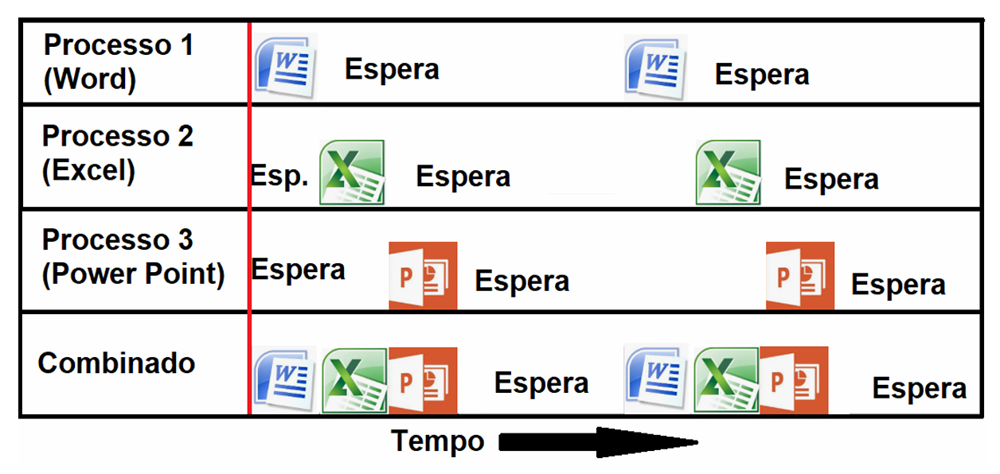
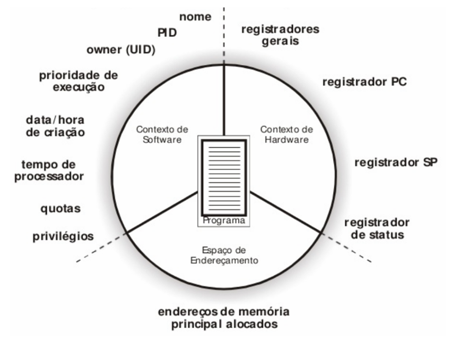
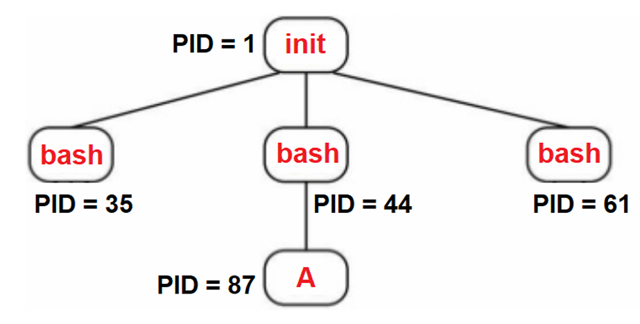
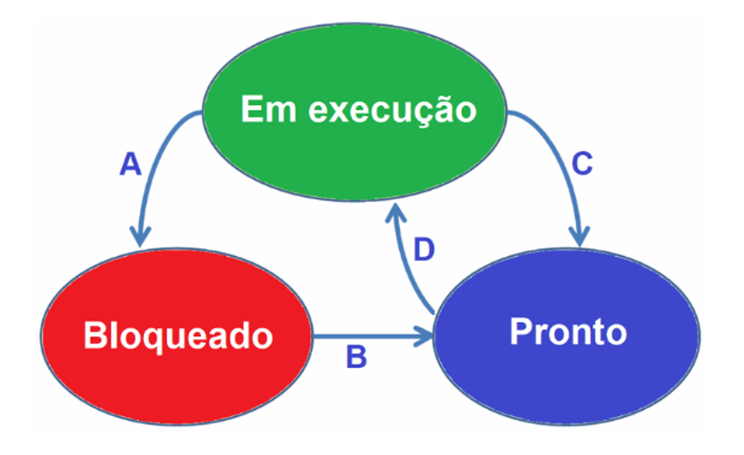
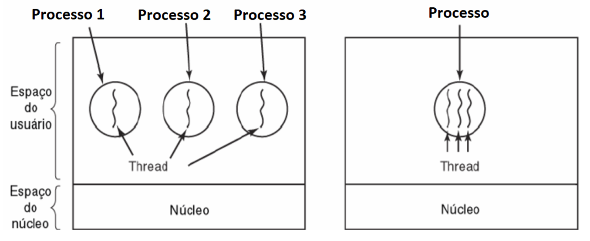
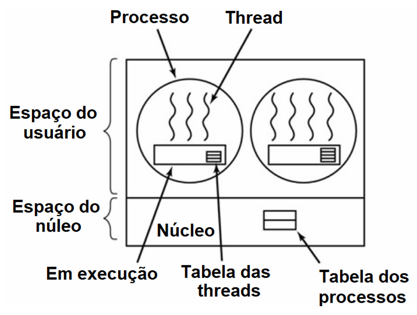
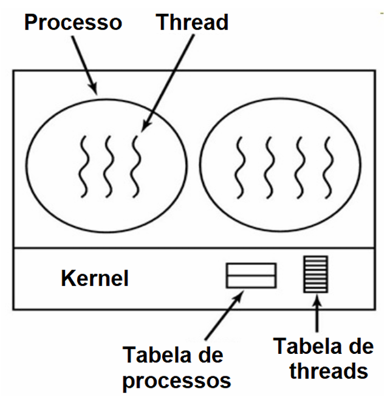
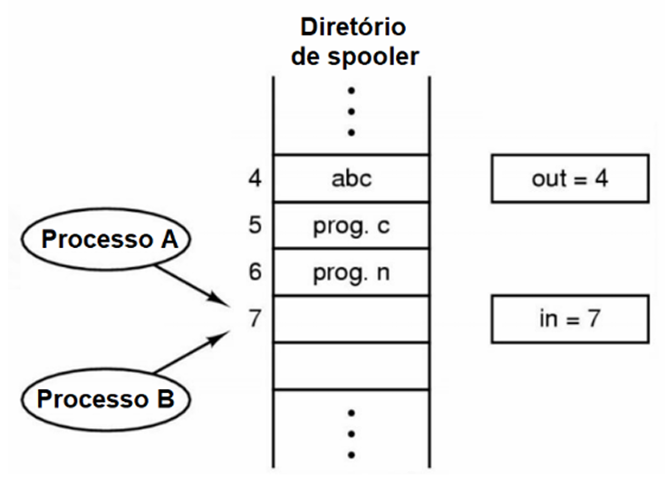
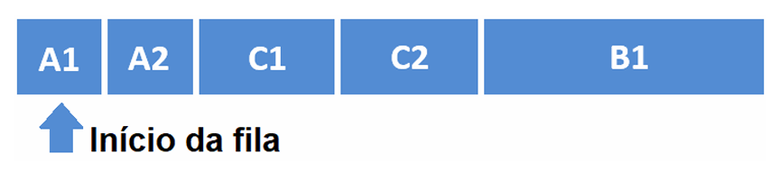
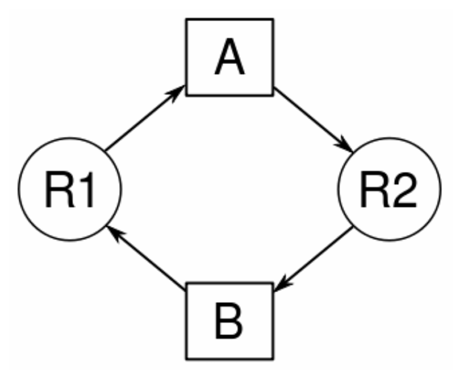

# Capítulo 2 – Gerenciamento de Processos

Um dos aspectos mais fascinantes e, ao mesmo tempo, complexos dos sistemas operacionais modernos é sua capacidade de realizar múltiplas atividades "simultaneamente". Mesmo em máquinas equipadas com um único núcleo de processamento (CPU), temos a nítida impressão de que diversos programas – um editor de textos, um navegador web, um reprodutor de música – estão operando em paralelo. Como isso é possível? A magia por trás dessa ilusão reside em um conceito fundamental chamado **pseudoparalelismo**, viabilizado por uma sofisticada técnica de **escalonamento** do uso do processador. Essencialmente, o Sistema Operacional divide o tempo da CPU em pequenas "fatias" e as distribui entre os diversos programas que desejam executar, seguindo políticas e algoritmos específicos. Cada programa, ou melhor, cada **processo**, recebe sua parcela de tempo para rodar, e essa alternância ocorre tão rapidamente que cria a percepção de execução paralela.

Mas, afinal, o que exatamente é um **processo**? De forma concisa, um processo é uma **instância de um programa em execução**. Um programa, por si só, é um conjunto estático de instruções e dados armazenado em um dispositivo de armazenamento (como um HD ou SSD). Quando o usuário decide executar esse programa (por exemplo, clicando duas vezes em seu ícone), o Sistema Operacional o carrega na memória principal (RAM) e inicia sua execução, transformando-o em uma entidade dinâmica: um processo. Esse processo inclui não apenas o código do programa, mas também os valores correntes de seus dados, como o conteúdo dos registradores da CPU (incluindo o Contador de Programa – PC, que indica a próxima instrução a ser executada, e o Registrador de Instrução – IR, que armazena a instrução atual) e os valores de suas variáveis (por exemplo, as variáveis `soma` ou `total` em um programa que realiza cálculos).

Cada processo, do seu "ponto de vista", opera como se tivesse o computador inteiro e o processador exclusivamente para si. Ele executa em uma espécie de **CPU virtual** fornecida pelo Sistema Operacional. Na realidade, como sabemos, o processador físico alterna rapidamente entre os diversos processos ativos no sistema. Essa capacidade de alternar a CPU entre múltiplos processos, permitindo que vários deles residam na memória e progridam em sua execução de forma intercalada, é conhecida como **multiprogramação** ou **multitarefa**.

A figura abaixo ilustra esquematicamente a execução de três processos (1, 2 e 3) em um único processador. Observe como o processador dedica um intervalo de tempo para o Processo 1, depois para o Processo 2 em seguida para o Processo 3, e então o ciclo pode se repetir ou seguir uma nova ordem definida pelo escalonador do S.O.

<div align="center">
  
</div>

É importante notar que a figura representa apenas um processo para cada programa hipotético. Na prática, um mesmo programa pode gerar múltiplos processos. Por exemplo, você pode ter várias janelas do Microsoft Word abertas, cada uma editando um documento diferente; cada uma dessas janelas corresponderá a um processo distinto do Word. O mesmo vale para o Excel, PowerPoint ou qualquer outro aplicativo. O limite para a quantidade de processos que podem ser executados simultaneamente geralmente se resume aos recursos disponíveis no sistema, como a quantidade de memória RAM, a capacidade de processamento e as limitações impostas pelo próprio sistema operacional.

Quando o processador decide parar a execução de um processo e iniciar (ou retomar) a execução de outro, ocorre um evento crucial chamado **troca de contexto** (também conhecido como **chaveamento de contexto** ou **mudança de contexto**). Este é um procedimento computacional fundamental em sistemas multitarefa, que consiste em:

1. **Armazenar o estado atual** (o contexto) do processo que está deixando a CPU. Esse contexto inclui o conteúdo de todos os registradores da CPU (PC, IR, registradores de dados, etc.), informações de gerenciamento de memória, estado de arquivos abertos e outras informações relevantes para que o processo possa ser retomado exatamente do ponto onde parou.
2. **Restaurar o estado** (o contexto previamente salvo) do próximo processo que irá utilizar a CPU.

A troca de contexto garante que, quando um processo que foi interrompido voltar a receber tempo de CPU, sua execução seja retomada precisamente do mesmo estado em que foi deixada, como se nada tivesse acontecido.

Imagine o seguinte cenário: você carrega um documento extenso no Word (digamos, 100 páginas), em seguida abre uma planilha complexa no Excel (com 50 abas) e, logo após, uma apresentação com muitos slides e animações no PowerPoint (100 slides). Se o sistema operacional fosse carregar cada um completamente antes de passar para o próximo, a espera seria considerável. Em vez disso, o S.O. pode carregar, por exemplo, as primeiras 10 páginas do Word, depois as primeiras 5 abas do Excel, em seguida os primeiros 20 slides do PowerPoint, e então retornar ao Word para carregar mais um trecho, e assim por diante. Esse chaveamento entre os processos de carregamento (e posteriormente, de execução) geralmente ocorre de forma tão veloz que temos a impressão de um paralelismo real, a menos que o processador seja muito antigo ou que estejamos tentando executar dezenas ou centenas de processos que demandem um alto desempenho simultaneamente – nesses casos, a lentidão pode se tornar perceptível.

## Ciclo de Vida de um Processo: Criação, Término e Hierarquia

Os processos não surgem espontaneamente nem duram para sempre. Eles possuem um ciclo de vida bem definido, que começa com sua criação e termina com sua finalização. Compreender como os processos são criados, como eles são organizados hierarquicamente e sob quais condições eles terminam é fundamental para entender o gerenciamento de processos em um S.O.

### Eventos que Desencadeiam a Criação de Processos

Existem quatro eventos principais que podem levar à criação de um novo processo em um sistema operacional:

1. **Inicialização do Sistema:** Quando o Sistema Operacional é iniciado (durante o boot), diversos processos são criados automaticamente. Alguns desses são processos de **primeiro plano (foreground)**, que interagem diretamente com o usuário (como a interface gráfica ou um shell de login). Outros são processos de **segundo plano (background)**, que não estão associados a um usuário específico, mas desempenham funções essenciais para o sistema (por exemplo, um processo que gerencia a rede, um servidor de impressão, ou um serviço que monitora a temperatura do hardware).
    - Processos de segundo plano que executam tarefas de sistema de forma contínua e autônoma são frequentemente chamados de **daemons** (em sistemas Unix-like) ou **serviços** (em sistemas Windows). Conforme definimos anteriormente:
        
        > “Um tipo especial de processo executado em segundo plano, geralmente sem interação direta com o usuário. O termo daemon tem origem do sistema operacional Unix e representa processos que são iniciados durante o boot do sistema e continuam a ser executados enquanto o sistema está ativo. Alguns exemplos são o daemon do sistema de impressão (cupsd) e o daemon de agendamento de tarefas (cron).”
        
2. **Chamada de Sistema para Criação de Processo:** Um processo que já está em execução pode solicitar ao Sistema Operacional a criação de um novo processo. Isso é comum em muitas aplicações que precisam executar tarefas paralelas ou delegar trabalho. Em sistemas Unix-like, como o Linux, a chamada de sistema `fork()` é o mecanismo clássico para criar um novo processo (que inicialmente é uma cópia do processo pai). Outras chamadas, como `exec()`, são usadas para carregar um novo programa nesse processo recém-criado.
3. **Requisição de um Usuário:** Um usuário pode explicitamente solicitar a criação de um novo processo, geralmente ao iniciar um aplicativo. Por exemplo, clicar duas vezes no ícone de um documento do Word ou digitar o nome de um programa em um terminal são ações que levam à criação de um novo processo.
4. **Início de uma Tarefa em Lote (Batch Job):** Em sistemas de grande porte (mainframes ou clusters de processamento), é comum a submissão de tarefas em lote (batch jobs). Quando chega a hora de executar uma dessas tarefas, o sistema operacional cria um novo processo para ela.

### Anatomia de um Processo

Um processo, enquanto entidade dinâmica em execução, é mais do que apenas o código do programa. Ele engloba diversos componentes e informações gerenciados pelo Sistema Operacional:

- **Código do Programa (Text Section):** As instruções executáveis do programa.
- **Dados Atuais:**
    - **Contador de Programa (PC):** Endereço da próxima instrução a ser executada.
    - **Registradores da CPU:** Valores atuais dos registradores de propósito geral, ponteiros de pilha, etc.
    - **Pilha de Execução (Stack):** Contém dados temporários como parâmetros de função, endereços de retorno e variáveis locais.
    - **Seção de Dados (Data Section):** Variáveis globais e estáticas.
    - **Heap:** Memória alocada dinamicamente durante a execução do processo.
- **Contexto de Software:** Informações administrativas e de controle mantidas pelo S.O., tais como:
    - **Identificador do Processo (PID):** Um número único que identifica o processo no sistema.
    - **Identificador do Usuário (UID):** O usuário proprietário do processo.
    - **Prioridade de Execução:** Um valor que influencia como o escalonador trata o processo.
    - **Estado do Processo:** Se está executando, pronto, bloqueado, etc.
    - **Informações de Contabilidade:** Tempo de CPU utilizado, limites de uso de recursos, etc.
    - **Informações de E/S:** Arquivos abertos pelo processo, dispositivos de E/S alocados, etc.
- **Espaço de Endereçamento:** A faixa de endereços de memória que o processo pode legalmente acessar. Cada processo geralmente possui seu próprio espaço de endereçamento virtual privado, isolado dos outros processos. Por exemplo, o texto que você está editando em um documento do Word reside no espaço de endereçamento do processo do Word.

A figura a seguir apresenta um esquema simplificado da estrutura de um processo na memória:

<div align="center">
  
</div>

### Bloco de Controle do Processo (PCB) e Tabela de Processos

Para gerenciar todas essas informações vitais sobre cada processo, o núcleo do Sistema Operacional mantém uma estrutura de dados fundamental conhecida como **Bloco de Controle do Processo (BCP)**, ou em inglês, **Process Control Block (PCB)**. O PCB é como a "identidade" ou o "prontuário" de um processo, armazenando todo o contexto necessário para o S.O. gerenciá-lo.

Como o PCB contém informações críticas e privilegiadas (como o estado dos registradores, ponteiros para áreas de memória, permissões), ele deve ser armazenado em uma área da memória que seja protegida contra acesso direto ou modificação por programas de usuário. Tipicamente, um PCB inclui:

- Identificador do Processo (PID).
- Estado atual do processo (executando, pronto, bloqueado).
- Contador de Programa (PC) e valores dos registradores da CPU (quando o processo não está na CPU, esses valores são salvos aqui).
- Informações de escalonamento da CPU (prioridade, ponteiros para filas de escalonamento).
- Informações de gerenciamento de memória (ponteiros para tabelas de páginas ou segmentos).
- Informações de contabilidade (tempo de CPU usado, limites).
- Informações sobre o status de E/S (dispositivos alocados, lista de arquivos abertos).
- Ponteiros para outros PCBs (por exemplo, para processos filhos ou processos na mesma fila de prontos).

O Sistema Operacional geralmente mantém uma **Tabela de Processos**, que é uma estrutura de dados (como um array ou lista encadeada de PCBs) que permite ao S.O. localizar e acessar rapidamente o PCB de qualquer processo ativo no sistema. Cada entrada na tabela de processos aponta para o PCB de um processo específico.

### Condições para o Término de Processos

Assim como os processos são criados, eles também chegam a um fim. O término de um processo pode ocorrer devido a diversas situações, que podem ser agrupadas em voluntárias (iniciadas pelo próprio processo) ou involuntárias (causadas por fatores externos ou erros):

1. **Término Normal (Voluntário):** Esta é a forma mais comum de término. O processo conclui sua tarefa designada e informa ao Sistema Operacional que terminou sua execução. Isso geralmente é feito através de uma chamada de sistema específica (por exemplo, `exit()` em C/Unix). Um programa que calcula a média de 10 números, exibe o resultado e finaliza, é um exemplo de término normal. Muitos aplicativos também oferecem uma maneira explícita para o usuário encerrá-los (um menu "Sair", a combinação de teclas ALT+F4 no Windows, etc.).
2. **Término por Erro (Voluntário):** O processo detecta uma condição de erro durante sua execução que o impede de continuar e decide terminar a si mesmo. Um exemplo clássico é uma tentativa de divisão por zero em uma operação matemática, ou tentar acessar um arquivo que não existe e para o qual não há tratamento de erro adequado. O processo pode chamar `exit()` com um código de erro para indicar a natureza da falha.
3. **Erro Fatal (Involuntário):** O processo comete um erro grave que é detectado pelo Sistema Operacional ou pelo hardware, levando ao seu término forçado. Exemplos incluem:
    - Execução de uma instrução ilegal (como tentar acessar uma área de memória protegida sem permissão).
    - Referenciar uma variável que aponta para um endereço de memória inválido (segmentation fault).
    - Um programa que espera um nome de arquivo como parâmetro, mas recebe um nome de arquivo que não existe e não trata essa exceção adequadamente.
4. **Eliminado por Outro Processo (Involuntário):** Um processo pode ser terminado por outro processo que tenha a devida autorização. Por exemplo, o usuário pode usar o comando `kill` no Linux (ou o Gerenciador de Tarefas no Windows) para forçar o encerramento de um processo que está travado ou consumindo recursos excessivamente. Um processo pai também pode terminar seus processos filhos.

Quando um processo termina, o Sistema Operacional é responsável por liberar todos os recursos que estavam alocados a ele (memória, arquivos abertos, dispositivos, etc.) para que possam ser reutilizados por outros processos.

### Hierarquia de Processos

Em muitos sistemas operacionais, especialmente aqueles derivados do Unix (como Linux e macOS), os processos são organizados em uma **hierarquia**, formando uma árvore. Quando um processo cria outro processo, o processo criador é chamado de **processo pai**, e o processo recém-criado é chamado de **processo filho**. Um processo pai pode ter múltiplos filhos, mas um processo filho tem apenas um pai.

Essa relação hierárquica permite o agrupamento de processos relacionados e pode ser usada para controle e gerenciamento. Por exemplo, se um processo pai termina, o S.O. pode decidir o que fazer com seus processos filhos (alguns sistemas os terminam automaticamente, outros os "adotam" por um processo especial).

No Linux, por exemplo, o processo **`init`** (ou seu sucessor moderno, como `systemd`) é o primeiro processo a ser executado após o carregamento do kernel. Ele tem o PID (Identificador de Processo) igual a 1 e é o ancestral de todos os outros processos no sistema.

Digamos que, a partir do processo `init`, sejam iniciados três shells (interpretadores de comando, como o `bash`). Se, a partir de um desses shells, o usuário executa um programa chamado "ProgramaA", teremos a seguinte hierarquia (PIDs são ilustrativos, exceto o do `init`):

<div align="center">
  
</div>

Nesta figura, init (PID=1) é o pai dos três processos bash. Um dos processos bash (PID=150) é o pai do ProgramaA (PID=345).

Essa estrutura hierárquica é útil para tarefas como enviar sinais para grupos de processos relacionados ou para rastrear a origem de um conjunto de atividades no sistema.

## Estados de um Processo e Suas Transições

Durante seu ciclo de vida, um processo não está sempre ativamente utilizando o processador. Ele transita por diferentes **estados**, dependendo de sua interação com o Sistema Operacional e com os recursos do sistema. De forma simplificada, mas fundamental, um processo pode se encontrar em um dos três seguintes estados principais:

1. **Executando (Running):** Neste estado, o processo está efetivamente utilizando a Unidade Central de Processamento (CPU) no momento. Suas instruções estão sendo buscadas, decodificadas e executadas pelo processador. Em um sistema com um único núcleo de CPU, apenas um processo pode estar no estado "Executando" a qualquer instante.
2. **Pronto (Ready):** O processo está apto a executar, possui todos os recursos necessários (exceto a CPU) e está aguardando sua vez de ser selecionado pelo escalonador do S.O. para receber um tempo de processador. Processos no estado "Pronto" geralmente residem em uma fila de processos prontos.
3. **Bloqueado (Blocked ou Waiting):** O processo está temporariamente incapaz de continuar sua execução porque está esperando por algum evento externo ocorrer ou por algum recurso se tornar disponível. Exemplos comuns incluem:
    - Aguardando a conclusão de uma operação de Entrada/Saída (E/S), como a leitura de dados de um disco rígido ou a recepção de dados da rede.
    - Esperando pelo término de um processo filho.
    - Aguardando a aquisição de um semáforo ou de um lock para acessar uma seção crítica.
    - Esperando por uma entrada do usuário (como uma digitação no teclado). Um processo no estado "Bloqueado" não pode utilizar a CPU, mesmo que ela esteja ociosa, até que o evento pelo qual ele espera aconteça.

### Transições entre Estados

As transições entre esses estados são eventos dinâmicos gerenciados pelo Sistema Operacional. A figura abaixo ilustra as quatro transições possíveis mais comuns entre os estados "Executando", "Pronto" e "Bloqueado":

<div align="center">
  
</div>

Vamos analisar cada transição em detalhe:

- **Transição A (Executando → Bloqueado):**
    - **Causa:** O processo que estava em execução na CPU inicia uma operação que não pode ser completada imediatamente e que o fará esperar. O exemplo mais clássico é uma solicitação de E/S. Se um processo pede para ler dados de um arquivo em um disco rígido, essa operação é muito mais lenta que a velocidade da CPU. Não faz sentido o processo continuar ocupando a CPU enquanto espera pelos dados.
    - **Ação do S.O.:** O Sistema Operacional move o processo do estado "Executando" para o estado "Bloqueado". O S.O. então seleciona outro processo da fila de prontos para executar.
    - **Por que é importante?** Seria um enorme desperdício de recursos da CPU se um processo ficasse "parado" no processador aguardando a conclusão de uma operação lenta de E/S. Ao bloqueá-lo, o S.O. permite que outro processo utilize esse tempo de CPU produtivamente.
- **Transição B (Bloqueado → Pronto):**
    - **Causa:** O evento pelo qual o processo estava esperando finalmente ocorre. Por exemplo, os dados solicitados do disco rígido foram lidos e transferidos para um buffer na memória, ou o usuário digitou a entrada esperada.
    - **Ação do S.O.:** O Sistema Operacional é notificado (geralmente por uma interrupção do dispositivo de E/S ou por um sinal) de que o evento ocorreu. Ele então move o processo do estado "Bloqueado" de volta para o estado "Pronto". O processo agora está apto a executar novamente, mas precisa aguardar sua vez na fila de prontos para receber tempo de CPU.
- **Transição C (Executando → Pronto):**
    - **Causa:** O processo estava em execução, mas o Sistema Operacional decide que ele já utilizou sua fatia de tempo (quantum) alocada ou que um processo de maior prioridade precisa executar. Isso ocorre em sistemas com escalonamento preemptivo.
    - **Ação do S.O.:** O escalonador do S.O. interrompe (preempta) o processo em execução e o move para o estado "Pronto", colocando-o de volta na fila de processos prontos. O processo que estava no estado "Executando" não solicitou um bloqueio nem terminou, mas simplesmente seu tempo de CPU se esgotou ou ele foi superado por um processo mais prioritário.
- **Transição D (Pronto → Executando):**
    - **Causa:** A CPU tornou-se disponível (por exemplo, o processo que estava executando foi bloqueado, terminou ou teve seu quantum expirado) e o escalonador do S.O. seleciona um processo da fila de prontos para ser o próximo a executar.
    - **Ação do S.O.:** O processo selecionado é movido do estado "Pronto" para o estado "Executando", e seu contexto (registradores, contador de programa) é carregado na CPU.

Os processos, portanto, ciclam continuamente por esses estados (com exceção do término) durante sua existência, com o Sistema Operacional orquestrando essas transições para maximizar a utilização da CPU e a responsividade do sistema.

### Comportamento de Processos: CPU-Bound vs. I/O-Bound

O padrão de transição entre estados de um processo pode variar significativamente dependendo da natureza de sua tarefa. Podemos classificar os processos, de forma geral, em dois tipos principais com base em como utilizam os recursos:

- **Processos CPU-Bound (Limitados por CPU):** São processos que passam a maior parte do seu tempo realizando cálculos e utilizando intensivamente a CPU. Eles tendem a ter longos "surtos" de uso da CPU e poucas operações de E/S.
    - **Comportamento Típico:** Frequentemente transitam de "Executando" para "Pronto" (Transição C), pois usam todo o seu quantum de tempo. Eles vão para o estado "Bloqueado" com menos frequência (ou talvez nunca, se não fizerem E/S significativa).
    - **Exemplos:** Programas de simulação científica, compilação de código extenso, renderização de gráficos complexos, execução de um filme (que envolve decodificação contínua de vídeo). Um filme pode parecer um exemplo de E/S, mas a decodificação do fluxo de vídeo e áudio é uma tarefa que consome bastante CPU.
- **Processos I/O-Bound (Limitados por E/S):** São processos que passam a maior parte do seu tempo esperando pela conclusão de operações de Entrada/Saída. Eles tendem a ter curtos "surtos" de uso da CPU, seguidos por longos períodos de espera por E/S.
    - **Comportamento Típico:** Frequentemente transitam de "Executando" para "Bloqueado" (Transição A) após um curto período de uso da CPU, pois logo solicitam uma nova operação de E/S. Após a conclusão da E/S, eles vão para "Pronto" (Transição B) e aguardam uma nova chance na CPU.
    - **Exemplos:** Um editor de texto aguardando a digitação do usuário, um servidor web aguardando requisições de clientes, um programa de bate-papo (chat) que espera constantemente por entrada do teclado ou mensagens da rede, um processo que copia grandes arquivos entre discos.

O escalonador do Sistema Operacional precisa levar em conta esses diferentes comportamentos ao tomar suas decisões, buscando um equilíbrio que mantenha tanto os processos CPU-bound progredindo quanto os processos I/O-bound responsivos.

## Threads: Concorrência Dentro de um Mesmo Processo

Um processo, em sua forma "tradicional" ou clássica, é caracterizado por possuir um único **espaço de endereçamento de memória** (onde residem seu código, dados e pilha) e um único **fluxo de controle** ou **fluxo de execução** (representado pelo contador de programa e pela sequência de instruções que ele executa). No entanto, em muitas situações, é desejável ou até mesmo necessário que um único processo seja capaz de realizar múltiplas tarefas ou subtarefas de forma concorrente, ou seja, ter mais de um fluxo de controle operando "quase em paralelo" dentro do mesmo contexto de processo.

Esses fluxos de controle independentes dentro de um mesmo processo são chamados de **threads** (também conhecidas como **processos leves** ou **lightweight processes - LWP**). A ideia fundamental é que todas as threads pertencentes a um mesmo processo compartilham o mesmo espaço de endereçamento de memória. Isso significa que elas compartilham:

- A **seção de código** do programa.
- A **seção de dados globais e estáticos**.
- Os **arquivos abertos** e outros recursos do sistema operacional alocados ao processo.

Contudo, para que cada thread possa executar de forma independente e manter seu próprio estado de execução, cada thread possui, individualmente:

- Seu próprio **contador de programa (PC)**.
- Seu próprio conjunto de **registradores da CPU**.
- Sua própria **pilha de execução (stack)**, usada para armazenar variáveis locais, parâmetros de função e endereços de retorno de suas próprias chamadas de função.

Essa estrutura permite que, quando o Sistema Operacional (ou uma biblioteca de threads) realiza uma troca de contexto entre threads do mesmo processo, apenas o estado específico da thread (registradores e pilha) precise ser salvo e restaurado, o que é geralmente muito mais rápido do que uma troca de contexto completa entre processos distintos (que envolve a troca de mapas de memória, entre outros).

### Vantagens e Casos de Uso de Threads

O uso de threads oferece diversas vantagens e é aplicado em uma vasta gama de cenários:

1. **Responsividade:** Em aplicações com interface gráfica, as threads podem manter a interface responsiva ao usuário enquanto outras threads realizam tarefas demoradas em segundo plano. Por exemplo, em um editor de texto, uma thread pode cuidar da interface e da digitação do usuário, enquanto outra thread verifica a ortografia em tempo real, e uma terceira salva o arquivo automaticamente em intervalos regulares. Se todas essas tarefas fossem feitas em um único fluxo, a interface poderia travar durante a verificação ortográfica ou o salvamento.
2. **Compartilhamento de Recursos:** Como as threads de um mesmo processo compartilham memória e arquivos, a comunicação e o compartilhamento de dados entre elas são muito mais eficientes e diretos do que a comunicação entre processos separados (que exigiria mecanismos de IPC mais complexos).
3. **Economia (Criação e Troca de Contexto):** Criar uma thread é geralmente muito mais rápido e consome menos recursos do que criar um novo processo. Da mesma forma, a troca de contexto entre threads do mesmo processo é mais leve do que entre processos distintos.
4. **Utilização de Múltiplos Processadores (Paralelismo Real):** Em sistemas com múltiplas CPUs ou múltiplos núcleos (multicore), as threads de um mesmo processo podem ser executadas verdadeiramente em paralelo, cada uma em um núcleo diferente, aumentando significativamente o desempenho de aplicações que podem ser decompostas em tarefas paralelizáveis.
5. **Simplificação de Código para Tarefas Concorrentes:** Para certas classes de problemas, como servidores que lidam com múltiplas conexões de clientes simultaneamente, o modelo de threads pode simplificar o design. Cada conexão de cliente pode ser tratada por uma thread separada.

Imagine um editor de texto moderno como o Microsoft Word ou o Google Docs. Ele executa inúmeras funcionalidades concorrentemente:

- Recebe e exibe a digitação do usuário.
- Verifica a ortografia e a gramática instantaneamente.
- Conta o número de palavras e páginas em tempo real.
- Formata o texto conforme o usuário digita (negrito, itálico, etc.).
- Salva automaticamente o documento em intervalos regulares.
- Pode estar sincronizando o documento com a nuvem.

Cada uma dessas funcionalidades pode ser (e frequentemente é) implementada como uma thread separada dentro do mesmo processo do editor de texto. A cada nova letra digitada, a thread do contador de palavras é ativada para atualizar a contagem, a thread do corretor ortográfico verifica a palavra recém-formada (possivelmente consultando um arquivo de dicionário em disco, o que seria uma operação de E/S), a thread de formatação aplica estilos, e assim por diante. Se não fosse pelo uso de threads, o editor teria que executar todas essas verificações sequencialmente após cada ação do usuário, tornando a experiência lenta e pouco fluida, ou então carregar múltiplos processos separados, o que seria muito mais "pesado" em termos de consumo de recursos.

A figura a seguir ilustra a diferença entre ter múltiplos processos, cada um com uma única thread (modelo tradicional à esquerda), e ter um único processo que contém múltiplas threads (modelo multithreaded à direita).

<div align="center">
  
</div>

No lado esquerdo, cada processo (P1, P2, P3) tem seu próprio espaço de endereçamento completo e um único fluxo de execução. No lado direito, um único processo (P) possui um espaço de endereçamento compartilhado (código, dados, arquivos) e três threads (T1, T2, T3), cada uma com seus próprios registradores e pilha.

### Categorias de Threads: Nível de Usuário vs. Nível de Kernel

As threads podem ser implementadas e gerenciadas de duas maneiras principais, dependendo de onde reside a lógica de gerenciamento de threads:

1. **Threads em Nível de Usuário (User-Level Threads - ULTs):**
    - **Gerenciamento:** Toda a lógica de criação, escalonamento, sincronização e destruição de threads é implementada por uma **biblioteca de threads no espaço do usuário**, sem envolvimento direto do kernel do Sistema Operacional. Para o kernel, o processo como um todo continua sendo uma única unidade de execução.
    - **Visibilidade para o Kernel:** O kernel não tem conhecimento da existência de múltiplas threads dentro do processo. Se uma thread do processo faz uma chamada de sistema bloqueante (como uma leitura de disco), o kernel bloqueia o processo inteiro, incluindo todas as suas outras threads, mesmo que elas estivessem prontas para executar.
    - **Escalonamento:** O escalonamento entre as threads de um mesmo processo é feito pela biblioteca de threads e é muito rápido, pois não requer uma troca para o modo kernel.
    - **Paralelismo Real:** Em sistemas multiprocessadores, as threads em nível de usuário de um mesmo processo geralmente não podem executar em paralelo em múltiplos núcleos, pois o kernel só enxerga e escalona o processo como um todo.
    - **Vantagens:** Criação e troca de contexto entre threads são muito rápidas (não há chamadas de sistema); podem ser implementadas em sistemas operacionais que não oferecem suporte nativo a threads.
    - **Desvantagens:** Se uma thread bloqueia, todo o processo bloqueia; não podem tirar proveito de multiprocessadores.
    
    A figura a seguir ilustra o conceito de threads em nível de usuário, onde a tabela de processos reside no kernel, mas as tabelas de threads de cada processo são mantidas no próprio espaço de usuário do processo.

<div align="center">
  
</div>

2. **Threads em Nível de Kernel (Kernel-Level Threads - KLTs):**
    
    - **Gerenciamento:** O kernel do Sistema Operacional tem conhecimento direto e gerencia todas as threads. A criação, escalonamento, sincronização e destruição de threads são realizadas por chamadas de sistema ao kernel.
    - **Visibilidade para o Kernel:** O kernel enxerga cada thread como uma unidade individual de escalonamento.
    - **Escalonamento:** O kernel pode escalonar threads de diferentes processos (ou do mesmo processo) de forma independente.
    - **Paralelismo Real:** Em sistemas multiprocessadores, o kernel pode escalonar múltiplas threads do mesmo processo para executar verdadeiramente em paralelo em diferentes núcleos.
    - **Bloqueio:** Se uma thread de um processo faz uma chamada de sistema bloqueante, o kernel pode bloquear apenas aquela thread, permitindo que outras threads do mesmo processo continuem executando (se estiverem prontas e houver CPUs disponíveis).
    - **Vantagens:** Permitem paralelismo real em multiprocessadores; o bloqueio de uma thread não bloqueia o processo inteiro.
    - **Desvantagens:** A criação e a troca de contexto entre threads em nível de kernel são mais lentas do que em nível de usuário, pois envolvem chamadas de sistema e uma transição para o modo kernel.
    
    A figura a seguir ilustra o conceito de threads em nível de kernel, onde tanto a tabela de processos quanto as tabelas de threads (ou informações sobre threads associadas a cada processo) são mantidas pelo kernel.

<div align="center">
  
</div>

Muitos sistemas operacionais modernos implementam um **modelo híbrido**, combinando aspectos das threads em nível de usuário e de kernel, tentando obter o melhor dos dois mundos (por exemplo, mapeando múltiplas threads de usuário para um número menor de threads de kernel).

O uso de threads introduz novas complexidades, especialmente relacionadas à **sincronização** do acesso a dados compartilhados para evitar condições de corrida, que serão discutidas na próxima seção.

## Comunicação e Sincronização entre Processos

Em um ambiente multitarefa, os processos frequentemente precisam interagir e coordenar suas atividades. Essa interação pode ocorrer de duas formas principais: processos podem ser **independentes** ou **cooperantes**. Processos independentes não afetam nem são afetados pela execução de outros processos. Já os processos cooperantes podem compartilhar dados, trocar informações ou influenciar o comportamento uns dos outros. A comunicação e a sincronização são mecanismos essenciais para permitir a cooperação eficaz e segura entre processos (e também entre threads de um mesmo processo).

### A Necessidade de Comunicação Interprocessos (IPC)

Um exemplo clássico e simples de entender onde a comunicação entre processos é necessária ocorre no uso do **pipe (`|`)** em um shell de linha de comando Unix-like. Considere o seguinte comando:

```bash
$ ls -l | grep ".txt" | sort -r | tee arquivo_saida.txt
```

Neste exemplo, temos uma cadeia (pipeline) de quatro comandos:

1. `ls -l`: Lista o conteúdo do diretório atual em formato longo.
2. `grep ".txt"`: Filtra a saída do `ls -l`, exibindo apenas as linhas que contêm ".txt".
3. `sort -r`: Ordena a saída do `grep` em ordem reversa.
4. `tee arquivo_saida.txt`: Recebe a saída do `sort -r`, exibe-a na tela e, simultaneamente, a salva no arquivo `arquivo_saida.txt`.

Cada um desses comandos (`ls`, `grep`, `sort`, `tee`) é executado como um processo separado. O símbolo `|` (pipe) instrui o shell a criar um canal de comunicação onde a **saída padrão** de um processo é conectada diretamente à **entrada padrão** do processo seguinte na cadeia. Assim, o resultado do `ls` torna-se a entrada para o `grep`, o resultado do `grep` torna-se a entrada para o `sort`, e assim por diante. Essa é uma forma poderosa de comunicação interprocessos (IPC).

### O Problema das Condições de Corrida (Race Conditions)

Quando processos (ou threads) cooperantes compartilham algum recurso, como uma área de memória comum ou um arquivo, surgem desafios significativos. Se múltiplos processos tentam ler e escrever nesse local compartilhado de forma concorrente e não coordenada, podem ocorrer **condições de corrida (race conditions)**.

Uma condição de corrida acontece quando o resultado de uma computação depende da ordem relativa ou do timing de eventos incontroláveis – especificamente, da sequência em que múltiplos processos acessam e manipulam dados compartilhados. O resultado final pode ser incorreto ou imprevisível.

Vamos ilustrar com o exemplo clássico do **diretório de spooler de impressão**. Imagine um sistema onde os arquivos a serem impressos são colocados em um diretório especial (o spooler). Um processo daemon de impressora verifica periodicamente esse diretório para ver quais arquivos devem ser impressos e os remove da fila após a impressão. Suponha que o daemon de impressora mantenha um arquivo de controle (vamos chamá-lo `proximo_slot_livre`) que armazena o número do próximo slot vago no diretório onde um novo arquivo de impressão pode ser colocado.

Agora, imagine que dois processos, Processo A e Processo B, decidem quase simultaneamente enviar um arquivo para impressão:

1. **Processo A** lê o valor de `proximo_slot_livre`. Suponha que seja `7`.
2. Antes que o Processo A possa atualizar `proximo_slot_livre` para `8` e colocar seu arquivo no slot `7`, o escalonador do S.O. interrompe o Processo A e dá a vez ao **Processo B**.
3. **Processo B** lê o valor de `proximo_slot_livre`. Ele também lê `7` (pois A ainda não atualizou).
4. **Processo B** então atualiza `proximo_slot_livre` para `8` e coloca seu arquivo de impressão no slot `7`.
5. O escalonador devolve a CPU ao **Processo A**.
6. **Processo A**, sem saber da ação de B, também atualiza `proximo_slot_livre` para `8` (baseado no valor `7` que ele leu originalmente) e tenta colocar seu arquivo no slot `7`.

O resultado é um desastre: o arquivo do Processo B no slot `7` é sobrescrito pelo arquivo do Processo A, e o arquivo do Processo B é perdido. Além disso, o valor de `proximo_slot_livre` ficou `8`, mas deveria ser `9` (se ambos tivessem usado slots distintos). A figura a seguir ilustra essa situação de forma simplificada.

<div align="center">
  
</div>

Este problema ocorreu porque a sequência de operações "ler o valor do slot", "usar o slot" e "atualizar o valor do slot" não foi **atômica**, ou seja, pôde ser interrompida no meio, permitindo que outro processo interferisse.

### Seções Críticas e a Necessidade de Exclusão Mútua

Para evitar condições de corrida e outros problemas relacionados ao acesso concorrente a recursos compartilhados (sejam eles memória, arquivos, ou estruturas de dados do kernel), é preciso encontrar uma maneira de proibir que mais de um processo (ou thread) leia e modifique esses dados compartilhados ao mesmo tempo. Em outras palavras, é necessária a **exclusão mútua (mutual exclusion)**.

A parte do programa onde um processo acessa a memória compartilhada ou outros recursos compartilhados é chamada de **região crítica** ou **seção crítica**. O problema da condição de corrida no exemplo do spooler ocorreu porque o Processo B começou a utilizar uma das variáveis compartilhadas (o slot do spooler e o contador `proximo_slot_livre`) antes que o Processo A tivesse terminado de trabalhar com ela dentro de sua seção crítica.

Para que uma solução ao problema da seção crítica seja considerada boa e robusta, ela deve satisfazer quatro condições fundamentais:

1. **Exclusão Mútua:** Em qualquer instante, no máximo um processo pode estar executando dentro de sua seção crítica (para um mesmo recurso compartilhado).
2. **Progresso (Sem Suposições sobre Velocidades ou CPUs):** Nenhuma suposição pode ser feita sobre as velocidades relativas dos processos ou sobre o número de processadores disponíveis no sistema. A solução deve funcionar independentemente disso. Além disso, se nenhum processo está em sua seção crítica e existem processos que desejam entrar, apenas aqueles que não estão executando em sua seção de restante (parte não crítica) podem participar da decisão de qual entrará em seguida, e essa seleção não pode ser adiada indefinidamente.
3. **Espera Limitada (Ausência de Bloqueio por Processos Externos):** Nenhum processo que está sendo executado fora de sua seção crítica pode bloquear outros processos que desejam entrar em suas seções críticas.
4. **Ausência de Espera Eterna (Bounded Waiting / No Starvation):** Nenhum processo deve ter que esperar indefinidamente (ou eternamente) para entrar em sua seção crítica. Deve haver um limite para o número de vezes que outros processos têm permissão para entrar em suas seções críticas após um processo ter feito uma solicitação para entrar em sua seção crítica e antes que essa solicitação seja concedida.

Solucionar o problema da seção crítica é um dos desafios centrais no design de sistemas concorrentes. Diversas primitivas de sincronização foram desenvolvidas para ajudar a alcançar a exclusão mútua.

### Semáforos

Um **semáforo** é um tipo especial de variável inteira, introduzida por Edsger Dijkstra, que é utilizada para controlar o acesso a recursos compartilhados por múltiplos processos em um ambiente de programação concorrente. A característica fundamental de um semáforo é que suas operações de verificação e alteração de valor são **atômicas**, ou seja, são indivisíveis e não podem ser interrompidas no meio de sua execução. Isso garante que, uma vez que um processo comece a operar sobre um semáforo, nenhum outro processo possa acessá-lo até que a operação do primeiro processo seja concluída ou que ele seja bloqueado. Essa atomicidade é crucial para evitar condições de corrida no próprio mecanismo de sincronização.

Um semáforo é usado para sinalizar. Tipicamente, ele pode assumir:

- Um valor **zero**, indicando que não há sinais pendentes para "despertar" um processo que está esperando pelo recurso.
- Um valor **positivo**, indicando que há um ou mais sinais pendentes.

Usamos o termo "despertar" porque um fluxo de execução (processo ou thread) é "colocado para dormir" (bloqueado) quando tenta entrar em uma região crítica que já está ocupada ou quando tenta adquirir um recurso que não está disponível.

As duas operações atômicas primárias associadas a um semáforo são:

1. **`down(S)`** (também chamada de `P(S)`, `wait(S)` ou `sleep(S)`):
    - Esta operação tenta decrementar o valor do semáforo `S`.
    - Se o valor de `S` for maior que zero, ele é decrementado em um, e o processo continua sua execução (significa que o recurso estava disponível ou havia um "sinal" para prosseguir).
    - Se o valor de `S` for zero, o processo que chamou `down(S)` é bloqueado (colocado para dormir) e adicionado a uma fila de espera associada ao semáforo. Ele permanecerá bloqueado até que outro processo execute uma operação `up(S)`.
2. **`up(S)`** (também chamada de `V(S)`, `signal(S)` ou `wakeup(S)`):
    - Esta operação incrementa o valor do semáforo `S` em um.
    - Se houver processos bloqueados na fila de espera desse semáforo (ou seja, processos que tentaram um `down(S)` quando `S` era zero), um deles é escolhido (a política de escolha pode variar – FIFO, prioridade, etc.), removido da fila de espera e "acordado" (desbloqueado), permitindo que ele complete sua operação `down(S)` (que efetivamente decrementará `S` novamente) e prossiga.
    - Se não houver processos esperando, o incremento simplesmente reflete que um recurso foi liberado ou um sinal foi emitido.

Exemplo de Uso para Exclusão Mútua:

Para proteger uma seção crítica, um semáforo (chamado, por exemplo, mutex_sem) pode ser inicializado com o valor 1.

```
// Inicialização
semaphore mutex_sem = 1;

// Código do Processo
...
down(mutex_sem); // Tenta entrar na seção crítica
// --- Seção Crítica ---
// Acessa recursos compartilhados
// --- Fim da Seção Crítica ---
up(mutex_sem);   // Libera a seção crítica
...
```

- O primeiro processo a chamar `down(mutex_sem)` decrementará `mutex_sem` para `0` e entrará na seção crítica.
- Qualquer outro processo que chame `down(mutex_sem)` enquanto `mutex_sem` for `0` será bloqueado.
- Quando o processo que está na seção crítica chama `up(mutex_sem)`, `mutex_sem` volta para `1`, e um dos processos bloqueados (se houver) é acordado e pode então entrar na seção crítica (após seu `down` ser completado, `mutex_sem` voltará a ser `0`).

Resumindo, para o caso de exclusão mútua, o valor do semáforo (inicializado em 1) efetivamente diz se a seção crítica está livre (`1`) ou ocupada (`0`). Se um semáforo é usado para contar recursos (por exemplo, um semáforo inicializado com `N` para controlar o acesso a `N` unidades de um recurso), seu valor indica quantos recursos estão disponíveis.

### Mutexes (Locks de Exclusão Mútua)

Um **mutex** (abreviação de **MUTual EXclusion**) é uma versão simplificada de um semáforo, projetada especificamente para o problema da exclusão mútua. Enquanto um semáforo pode ser usado como um contador geral (semáforo de contagem), um mutex é tipicamente usado para proteger uma seção crítica permitindo apenas dois estados: **livre (unlocked)** ou **ocupado (locked)**.

Consequentemente, para representar esses dois estados, apenas um bit seria teoricamente necessário. No entanto, na prática, os mutexes são frequentemente implementados usando uma variável inteira (por exemplo, `0` para livre e `1` para ocupado, ou vice-versa).

As operações típicas em um mutex são:

1. **`mutex_lock(m)`:**
    - Tenta adquirir o lock (trava) no mutex `m`.
    - Se o mutex `m` estiver livre (unlocked), o processo adquire o lock (o mutex se torna ocupado/locked), e o processo entra na seção crítica.
    - Se o mutex `m` já estiver ocupado por outro processo, o processo que chamou `mutex_lock(m)` é bloqueado até que o mutex seja liberado.
2. **`mutex_unlock(m)`:**
    - Libera o lock no mutex `m` (o mutex volta ao estado livre/unlocked).
    - Isso deve ser chamado pelo processo que atualmente detém o lock, tipicamente ao sair da seção crítica.
    - Se houver outros processos bloqueados esperando por este mutex, um deles é acordado e pode tentar adquirir o lock.

Os mutexes são mais simples que os semáforos quando a única necessidade é garantir que apenas um processo por vez acesse uma seção crítica. Eles não são adequados para cenários de contagem de recursos ou sinalização mais complexa que os semáforos podem suportar.

A escolha entre semáforos e mutexes depende da complexidade do problema de sincronização a ser resolvido. Para exclusão mútua simples, mutexes são geralmente preferidos por sua simplicidade conceitual e, às vezes, por uma implementação mais eficiente.

## Escalonamento de Processos: Orquestrando o Acesso à CPU

O **escalonamento de processos** é uma das funções mais críticas de um Sistema Operacional multitarefa. Trata-se da atividade fundamental de decidir qual dos processos que estão prontos para executar deve receber o controle da Unidade Central de Processamento (CPU) e por quanto tempo. Em um sistema com múltiplos processos competindo pela CPU, o escalonador (scheduler) do S.O. atua como um maestro, orquestrando a ordem de execução para atingir diversos objetivos, como maximizar a utilização da CPU, minimizar o tempo de resposta para processos interativos e garantir justiça entre os processos.

Essa atividade é essencial para permitir que o sistema execute, de forma eficiente e aparentemente simultânea, os diversos processos que são considerados prioritários ou necessários para o seu funcionamento e para atender às solicitações dos usuários.

### Momentos de Escalonamento

Existem certas situações em que uma decisão de escalonamento **pode** ocorrer e outras em que ela **deve** ocorrer:

**O Escalonamento DEVE Ocorrer Quando:**

1. **Um Processo Termina:** Quando um processo completa sua execução, ele libera a CPU. O S.O. deve então escolher outro processo da fila de prontos para executar. Não há motivo para manter a CPU ociosa se há trabalho a ser feito. Por exemplo, se um processo recebe uma fatia de tempo de 5 milissegundos (ms) para usar a CPU, mas conclui toda a sua tarefa em apenas 3ms, ele termina e o escalonador entra em ação imediatamente para selecionar o próximo processo.
2. **Um Processo é Bloqueado:** Se um processo em execução inicia uma operação de E/S (como ler um arquivo do disco) ou precisa esperar por um recurso (como um semáforo que está ocupado), ele não pode continuar utilizando a CPU produtivamente. Nesse caso, o S.O. move o processo para o estado "Bloqueado", e o escalonador deve escolher outro processo pronto para ocupar a CPU. Não faria sentido o processo ficar "gastando" tempo de CPU enquanto espera por um evento externo.

**O Escalonamento PODE Ocorrer Quando:**

1. **Um Novo Processo é Criado:** Quando um novo processo é criado e entra na fila de prontos, o escalonador pode decidir se o novo processo deve executar imediatamente (talvez por ter prioridade maior) ou se o processo atual deve continuar.
2. **Uma Interrupção de E/S Ocorre:** Quando uma operação de E/S termina, o processo que estava bloqueado esperando por ela geralmente volta para a fila de prontos. O escalonador pode então reavaliar qual processo deve executar.
3. **Uma Interrupção de Relógio (Clock Interrupt) Ocorre:** Em sistemas preemptivos, o S.O. usa um temporizador para gerar interrupções em intervalos regulares. Quando uma interrupção de relógio ocorre, o S.O. pode decidir se o processo atualmente em execução já usou sua fatia de tempo (quantum) e se deve ser substituído por outro.

### O Escalonador (Scheduler)

A rotina do Sistema Operacional responsável por implementar a política de escalonamento e tomar a decisão de qual processo executar em seguida é chamada de **escalonador (scheduler)**. Ele gerencia a alocação de recursos da CPU entre os vários processos concorrentes em um sistema, aplicando um ou mais algoritmos de escalonamento.

### Critérios de Escalonamento e Métricas de Desempenho

Ao projetar um algoritmo de escalonamento, diversos critérios e métricas de desempenho podem ser considerados, dependendo dos objetivos do sistema:

- **Utilização da CPU:** Manter a CPU ocupada o máximo de tempo possível.
- **Throughput ("Taxa de Transferência" ou Vazão):** O número de processos (ou tarefas) concluídos por unidade de tempo. Um throughput maior geralmente indica um sistema mais eficiente na conclusão de trabalhos. Essa medida é crucial para entender a capacidade de processamento do sistema em um período específico.
- **Tempo de Turnaround:** O intervalo de tempo total desde a criação de um processo até o seu término. Isso inclui o tempo gasto esperando na fila de prontos, o tempo executando na CPU e o tempo bloqueado esperando por E/S. As políticas de escalonamento geralmente buscam minimizar o tempo médio de turnaround.
- **Tempo de Espera:** O tempo total que um processo passa na fila de prontos, aguardando para receber a CPU.
- **Tempo de Resposta (para Sistemas Interativos):** O intervalo de tempo desde que uma requisição é submetida (por exemplo, um comando digitado pelo usuário) até que a primeira resposta seja produzida (não necessariamente a conclusão da requisição). Em sistemas interativos, minimizar o tempo de resposta é crucial para a experiência do usuário.
- **Justiça (Fairness):** Garantir que todos os processos recebam uma parcela justa da CPU e que nenhum processo seja indefinidamente adiado (starvation).
- **Previsibilidade:** Em sistemas de tempo real, é crucial que as tarefas sejam concluídas dentro de seus prazos (deadlines).

### Preempção e Starvation

- **Preempção:** Como já mencionado, a **preempção** é o ato do Sistema Operacional utilizar interrupções (geralmente do relógio) para retirar forçadamente a CPU de um processo em execução, mesmo que ele ainda não tenha terminado ou se bloqueado voluntariamente. Isso permite que o S.O. aloque a CPU a outro processo, garantindo que nenhum processo possa monopolizar o processador indefinidamente. A maioria dos sistemas operacionais modernos é preemptiva.
- **Starvation (Inanição ou Privação):** Em sistemas onde o escalonamento não é bem gerenciado (especialmente em sistemas não preemptivos ou com esquemas de prioridade mal implementados), pode ocorrer uma situação de **starvation**. Starvation, literalmente "morrer de fome", descreve a condição em que um processo é repetidamente preterido pelo escalonador e nunca (ou por um tempo excessivamente longo) recebe os recursos necessários para prosseguir com sua execução, como o acesso à CPU. Aquele processo fica eternamente aguardando na fila, enquanto outros processos (talvez com prioridade maior ou que chegam continuamente) "furam a fila". Algoritmos de escalonamento devem ser projetados para evitar ou mitigar o starvation.

Um **sistema multitarefa preemptivo**, portanto, é aquele que possibilita a execução de mais de um processo ao mesmo tempo, onde o S.O. tem o poder de interromper um processo em execução para dar a vez a outro. Isso é fundamental para a responsividade e justiça em sistemas de propósito geral.

### Categorias de Algoritmos de Escalonamento

Os algoritmos de escalonamento podem ser amplamente categorizados com base no tipo de sistema para o qual são mais adequados:

1. **Sistemas de Lote (Batch Systems):**
    - **Características:** Geralmente processam grandes volumes de dados sem interação direta do usuário (por exemplo, processamento de folhas de pagamento, simulações científicas de longa duração). Os usuários não estão esperando uma resposta rápida.
    - **Objetivos Típicos:** Maximizar o throughput, maximizar a utilização da CPU, minimizar o tempo de turnaround.
    - **Preempção:** Algoritmos não preemptivos são aceitáveis, ou algoritmos preemptivos com longos períodos de tempo (quanta) para cada processo podem ser usados. Isso reduz a sobrecarga das trocas de contexto, o que pode melhorar o desempenho geral para esse tipo de carga de trabalho.
2. **Sistemas Interativos:**
    - **Características:** Há interação constante com os usuários, que esperam respostas rápidas do sistema (por exemplo, computadores pessoais usados para jogos, edição de textos, navegação na Internet, desenvolvimento de software).
    - **Objetivos Típicos:** Minimizar o tempo de resposta, fornecer boa interatividade, garantir justiça.
    - **Preempção:** A preempção é fundamental para evitar que um único processo monopolize a CPU e torne o sistema não responsivo para outros usuários ou aplicações.
3. **Sistemas de Tempo Real (Real-Time Systems):**
    - **Características:** Os processos têm prazos (deadlines) rígidos para completar suas tarefas. A corretude do sistema depende não apenas do resultado lógico das computações, mas também do tempo em que esses resultados são produzidos (por exemplo, sistemas de controle industrial, sistemas de controle de voo, equipamentos médicos, multimídia).
    - **Objetivos Típicos:** Garantir o cumprimento de prazos, previsibilidade.
    - **Preempção:** Pode ou não ser necessária. Em alguns sistemas de tempo real, os processos são projetados para serem curtos e realizar suas tarefas rapidamente, bloqueando-se em seguida. Eles "sabem" que não podem executar por longos períodos. Em outros (especialmente sistemas de tempo real "hard" com deadlines críticos), um escalonamento preemptivo baseado em prioridades e prazos é essencial. Um sistema de tempo real executa apenas o que é estritamente necessário para sua função, como um radar que registra a velocidade de um veículo e o fotografa apenas se um limite específico for ultrapassado.

## Algoritmos de Escalonamento em Sistemas de Lote

Embora muitos algoritmos de escalonamento possam ser adaptados para diferentes contextos, alguns são classicamente associados a **sistemas de lote (batch systems)**, onde a interação do usuário é mínima ou inexistente e o foco principal é processar uma grande quantidade de trabalho de forma eficiente.

### First-Come, First-Served (FCFS) – Primeiro a Chegar, Primeiro a Ser Servido

Como o próprio nome sugere ("O primeiro a chegar é o primeiro a ser atendido"), o algoritmo **FCFS** é o mais simples conceitualmente. Os processos recebem tempo de CPU na exata ordem em que solicitam.

- **Funcionamento:**
    - Existe uma única fila de processos prontos, organizada como uma fila FIFO (First-In, First-Out).
    - Quando um processo se torna pronto, ele é adicionado ao final da fila.
    - O processo no início da fila é selecionado para execução.
    - Se um processo em execução é bloqueado (por exemplo, aguardando uma operação de E/S), ele é removido da CPU e, quando se torna pronto novamente (após a conclusão da E/S), ele retorna para o **final** da fila de prontos.
- **Natureza:** Este algoritmo é inerentemente **não preemptivo**. Uma vez que um processo recebe a CPU, ele a utiliza até que termine sua execução ou se bloqueie voluntariamente.
- **Problema do "Efeito Comboio":** Uma grande desvantagem do FCFS é o "efeito comboio" (convoy effect). Se um processo longo (CPU-bound) chega primeiro e ocupa a CPU, todos os processos curtos que chegam depois dele precisam esperar um tempo considerável, mesmo que eles pudessem ter sido concluídos rapidamente. Isso pode levar a um tempo médio de turnaround e tempo de espera ruins. Por exemplo, se um processo que precisa de 4 horas de CPU chega e começa a executar, e logo depois chegam vários processos que precisam de apenas alguns milissegundos, esses processos curtos terão que esperar as 4 horas, impactando negativamente a responsividade percebida do sistema (embora em sistemas de lote puros, a responsividade imediata não seja o critério principal).
- **Simplicidade:** É fácil de entender e implementar.

### Shortest Job First (SJF) – Tarefa Mais Curta Primeiro

O algoritmo **SJF** é uma abordagem **não preemptiva** que prioriza a execução do processo (ou job) cujo tempo total de execução estimado seja o menor entre todos os processos prontos. A premissa é que, ao executar os trabalhos mais curtos primeiro, o tempo médio de espera e o tempo médio de turnaround podem ser minimizados.

- **Requisito:** A principal dificuldade do SJF é que ele presume que os **tempos de execução de todos os jobs são conhecidos previamente**. Isso pode ser viável em ambientes onde os mesmos tipos de jobs são executados repetidamente e seus tempos de execução históricos são bem estabelecidos.
- **Funcionamento:**
    - Quando a CPU fica livre, o escalonador seleciona, da fila de processos prontos, aquele com o menor tempo de execução estimado.
    - Uma vez que um job começa a executar, ele roda até o fim ou até se bloquear.
- **Exemplo:** Imagine que jobs de uma empresa são executados há anos, e sabe-se que:
    - Jobs do Tipo A levam 2 minutos.
    - Jobs do Tipo B levam 6 minutos.
    - Jobs do Tipo C levam 4 minutos. Os jobs são agendados à tarde para serem executados a partir das 8h do dia seguinte. Se os seguintes jobs foram adicionados na ordem B1 (6 min), A1 (2 min), C1 (4 min), A2 (2 min) e C2 (4 min), o escalonamento SJF os executaria na seguinte ordem para minimizar o tempo de espera total: A1, A2, C1, C2, B1.
    Na figura abaixo, o eixo X representa o tempo, e os blocos representam os jobs. Com SJF, A1 e A2 (2 min cada) executariam primeiro, seguidos por C1 e C2 (4 min cada), e por último B1 (6 min), resultando em um tempo total de conclusão de 18 minutos e um tempo médio de turnaround menor do que se fosse FCFS.

<div align="center">
  
</div>

- **Ótimo para Tempo Médio de Espera:** O SJF é comprovadamente ótimo no sentido de minimizar o tempo médio de espera para um dado conjunto de processos.
- **Risco de Starvation:** Processos longos podem sofrer starvation se houver um fluxo contínuo de processos curtos chegando ao sistema.

### Shortest Remaining Time Next (SRTN) – Menor Tempo de Execução Restante

O **SRTN** (às vezes chamado de Shortest Remaining Time First - SRTF) é a **versão preemptiva** do algoritmo SJF.

- **Funcionamento:**
    - Assim como no SJF, o escalonador sempre escolhe o processo cujo tempo de execução restante estimado é o menor. O tempo de execução total também precisa ser conhecido previamente.
    - A diferença crucial é a preempção: quando um novo processo chega à fila de prontos, seu tempo total de execução estimado é comparado com o **tempo restante** do processo que está atualmente em execução.
    - Se o novo processo precisar de menos tempo para ser concluído do que o tempo que ainda falta para o processo corrente, o processo corrente é **suspenso (preemptado)**, e o novo processo é iniciado.
- **Benefício:** Esse esquema permite que jobs novos e curtos tenham prioridade e sejam executados rapidamente, melhorando o tempo de resposta percebido para eles, mesmo que um job mais longo já estivesse em execução.
- **Desvantagens:**
    - Maior sobrecarga devido a mais trocas de contexto.
    - Ainda requer conhecimento prévio dos tempos de execução.
    - Processos longos ainda podem sofrer starvation, talvez até mais do que no SJF não preemptivo, se houver um fluxo constante de processos muito curtos.

O SJF e o SRTN são interessantes teoricamente por sua otimalidade em relação a certas métricas, mas a necessidade de conhecer os tempos de execução de antemão limita sua aplicabilidade prática em sistemas de propósito geral, onde essa informação raramente está disponível com precisão.

## Algoritmos de Escalonamento em Sistemas Interativos

Em **sistemas interativos**, onde os usuários esperam respostas rápidas e uma experiência fluida, os critérios de escalonamento mudam. O foco se desloca para minimizar o tempo de resposta, garantir a justiça entre os processos e evitar que um único processo monopolize a CPU. A preempção torna-se uma característica essencial.

### Round-Robin (RR)

O **Round-Robin** é um dos algoritmos de escalonamento mais conhecidos, simples e amplamente utilizados para sistemas interativos de tempo compartilhado.

- **Funcionamento:**
    - Cada processo na fila de prontos recebe uma pequena unidade de tempo de CPU, chamada **quantum** ou **fatia de tempo (time slice)**, durante a qual ele pode ser executado.
    - Se, ao final do seu quantum, o processo ainda estiver em execução (não terminou nem se bloqueou), o Sistema Operacional realiza a **preempção** da CPU, ou seja, retira o controle do processador desse processo.
    - O processo preemptado é colocado de volta no **final da fila de prontos**, e a CPU é alocada ao próximo processo no início da fila, que por sua vez recebe um quantum para executar.
    - Obviamente, se um processo terminar sua execução antes do fim do seu quantum, ou se ele se bloquear (por exemplo, para uma operação de E/S), ele libera a CPU voluntariamente, e a troca de processo ocorre neste momento, sem esperar o fim do quantum.
- **Fila Circular:** A fila de prontos é geralmente implementada como uma fila circular FIFO.
- **Justiça:** O Round-Robin é inerentemente justo, pois todos os processos prontos têm a chance de executar em uma ordem cíclica.
- **Definição da Duração do Quantum:** A escolha da duração do quantum é um parâmetro crítico e um trade-off:
    - **Quantum Muito Curto:**
        - **Prós:** Melhora o tempo de resposta percebido para processos curtos e interativos, pois eles não precisam esperar muito para receber a CPU.
        - **Contras:** Aumenta a frequência de trocas de contexto. Como cada troca de contexto tem uma sobrecarga administrativa (salvar e carregar registradores, mapas de memória, atualizar tabelas e listas do S.O., etc.), um quantum muito curto pode levar a uma porcentagem significativa do tempo da CPU sendo gasta nessa sobrecarga, em vez de em trabalho útil. Por exemplo, se a troca de contexto leva 1ms e o quantum é de 9ms, 10% do tempo da CPU seriam desperdiçados em sobrecarga. Se o quantum for de 1ms e a troca também levar 1ms, 50% do tempo seria perdido.
    - **Quantum Muito Longo:**
        - **Prós:** Reduz a sobrecarga de trocas de contexto.
        - **Contras:** O comportamento do Round-Robin começa a se assemelhar ao do FCFS. Processos curtos podem ter que esperar muito tempo atrás de processos longos, degradando o tempo de resposta para interações.
    - **Valor Típico:** A duração do quantum em sistemas reais geralmente varia de algumas dezenas a algumas centenas de milissegundos, buscando um equilíbrio entre responsividade e eficiência.

O Round-Robin é um algoritmo fundamental para sistemas de tempo compartilhado e serve de base para muitos algoritmos mais sofisticados.

### Escalonamento por Prioridade

Neste esquema, cada processo recebe um valor de **prioridade**, e o processo pronto com a **maior prioridade** tem a permissão para executar.

- **Atribuição de Prioridades:** As prioridades podem ser atribuídas estaticamente (definidas no momento da criação do processo e não mudam) ou dinamicamente (o S.O. pode ajustar a prioridade de um processo durante sua execução com base em seu comportamento ou outros fatores).
- **Exemplo:** Um processo de daemon que envia e-mails em segundo plano deveria, logicamente, ter uma prioridade mais baixa do que um processo responsável por uma videoconferência ao vivo, que requer baixa latência para uma boa experiência do usuário.
- **Implementação:** Pode ser implementado com múltiplas filas de prontos, uma para cada nível de prioridade. O escalonador sempre escolhe um processo da fila de maior prioridade que não esteja vazia. Dentro de uma mesma fila de prioridade, algoritmos como Round-Robin ou FCFS podem ser usados.
- **Preempção:** O escalonamento por prioridade pode ser preemptivo ou não preemptivo.
    - **Preemptivo:** Se um novo processo de maior prioridade chega à fila de prontos enquanto um processo de menor prioridade está executando, o processo de menor prioridade é preemptado, e o de maior prioridade assume a CPU.
    - **Não Preemptivo:** O processo de maior prioridade só assume a CPU quando o processo atual terminar ou se bloquear voluntariamente.
- **Problema de Starvation:** Uma grande desvantagem do escalonamento por prioridade puro é o risco de **starvation** para processos de baixa prioridade. Se houver um fluxo constante de processos de alta prioridade chegando, os processos de baixa prioridade podem nunca receber tempo de CPU.
- **Soluções para Starvation:**
    - **Aging (Envelhecimento):** A prioridade de um processo que está esperando há muito tempo na fila de prontos é gradualmente aumentada pelo S.O. Eventualmente, sua prioridade se tornará alta o suficiente para que ele seja escalonado.
    - **Ajuste Dinâmico de Prioridades:** O escalonador pode diminuir a prioridade de um processo que está executando a cada interrupção de relógio (ou após usar uma certa quantidade de CPU). Se sua prioridade cair abaixo da do próximo processo com maior prioridade na fila, ocorre uma troca de processo.
    - **Combinação com Round-Robin:** Uma alternativa é dar um quantum a cada processo (como no Round-Robin) e, quando esse quantum esgotar, o escalonador verifica se há algum processo de maior prioridade (ou igual, seguindo a ordem da fila) para executar.

### Escalonamento por Múltiplas Filas (Multilevel Queue Scheduling)

Este algoritmo divide a fila de prontos em várias filas separadas, cada uma com seu próprio algoritmo de escalonamento e, frequentemente, com diferentes níveis de prioridade.

- **Funcionamento:**
    - Os processos são permanentemente atribuídos a uma fila no momento de sua criação, geralmente com base em alguma característica do processo (por exemplo, processos interativos em uma fila, processos de lote em outra; ou processos de sistema em uma fila de alta prioridade, processos de usuário em uma de baixa prioridade).
    - Cada fila tem seu próprio algoritmo de escalonamento (ex: Round-Robin para processos interativos, FCFS para processos de lote).
    - Deve haver um escalonamento entre as filas, que é tipicamente um escalonamento por prioridade fixa preemptivo. Por exemplo, nenhum processo da fila de lote executa a menos que todas as filas de processos interativos e de sistema estejam vazias.
- **Vantagem:** Permite aplicar diferentes políticas de escalonamento para diferentes classes de processos, otimizando para as necessidades de cada classe.
- **Desvantagem:** Pouca flexibilidade se um processo mudar seu comportamento (por exemplo, um processo inicialmente interativo que se torna CPU-bound).

### Escalonamento por Múltiplas Filas com Feedback (Multilevel Feedback Queue Scheduling)

Esta é uma variação mais sofisticada e flexível do escalonamento por múltiplas filas, que permite que os processos **migrem entre as diferentes filas**.

- **Funcionamento:**
    - Existem várias filas de prontos, geralmente com prioridades decrescentes (e, correspondentemente, quanta de tempo crescentes). Por exemplo:
        - Fila 0: Prioridade mais alta, quantum de 1 unidade.
        - Fila 1: Prioridade média, quantum de 2 unidades.
        - Fila 2: Prioridade mais baixa, quantum de 4 unidades (e assim por diante).
    - Um novo processo entra na fila de maior prioridade (Fila 0).
    - Se ele não terminar dentro do seu quantum (1 unidade), ele é movido para a próxima fila de prioridade mais baixa (Fila 1).
    - Se ele não terminar no quantum da Fila 1 (2 unidades), ele é movido para a Fila 2, e assim por diante.
    - Processos em filas de prioridade mais baixa só executam se as filas de prioridade mais alta estiverem vazias.
    - Se um processo em uma fila de baixa prioridade usa todo o seu (longo) quantum, ele geralmente retorna para a mesma fila ou para o final dela.
    - Se um processo que estava em uma fila de baixa prioridade (indicando ser CPU-bound) se bloqueia para E/S e depois se torna pronto novamente, ele pode ser promovido de volta para uma fila de maior prioridade, pois demonstrou um comportamento interativo.
- **Exemplo de Uso de Quanta:** Se um processo precisa de 50 quanta para terminar, e as filas têm quanta de 1, 2, 4, 8, 16, 32:
    - Ele usa 1 quantum na Fila 0 e é movido.
    - Ele usa 2 quanta na Fila 1 e é movido.
    - Ele usa 4 quanta na Fila 2 e é movido.
    - Ele usa 8 quanta na Fila 3 e é movido.
    - Ele usa 16 quanta na Fila 4 e é movido.
    - Na Fila 5 (com quantum de 32), ele precisaria de `50 - (1+2+4+8+16) = 50 - 31 = 19` quanta. Ele usaria 19 quanta e, ao terminar, liberaria o processador. No total, ele teria recebido `1+2+4+8+16+19 = 50` quanta, mas sua passagem pelas filas de maior prioridade foi rápida.
- **Vantagens:**
    - Favorece processos curtos e interativos (bom tempo de resposta).
    - Evita starvation de processos longos (eles eventualmente chegam a filas com quanta maiores).
    - Adapta-se ao comportamento do processo (um processo pode mudar de I/O-bound para CPU-bound e vice-versa, e sua posição nas filas refletirá isso).
- **Complexidade:** É um dos algoritmos mais complexos de implementar e parametrizar (número de filas, algoritmo por fila, política de promoção/rebaixamento, valores de quanta).

### Escalonamento Garantido

A ideia central do **escalonamento garantido** é "fazer promessas realistas aos usuários sobre o desempenho e cumpri-las".

- **Premissa:** Se houver N usuários (ou N processos de igual importância) ativos no sistema, cada um deveria receber aproximadamente **1/N do poder da CPU**.
- **Funcionamento:**
    - O sistema monitora quanto tempo de CPU cada processo utilizou desde o seu momento de login ou criação.
    - Ele também calcula a quantidade de tempo de CPU que cada processo _deveria_ ter recebido (que seria `tempo_total_desde_login / N`).
    - O escalonador então calcula a razão entre o tempo de CPU realmente consumido e o tempo que deveria ter sido consumido. Uma razão de 0.5 significa que o processo só recebeu metade do que deveria, enquanto uma razão de 2.0 significa que ele recebeu o dobro.
    - O algoritmo então executa o processo com a **menor razão** até que sua razão ultrapasse a do próximo competidor mais próximo.
- **Benefício:** Fornece uma distribuição mais previsível e justa do poder de processamento.
- **Desafio:** Implementar o rastreamento preciso e o cálculo dessas razões de forma eficiente pode ser complexo.

### Escalonamento por Sorteio (Lottery Scheduling)

O **escalonamento por sorteio** é uma abordagem probabilística que busca simplicidade e responsividade.

- **Funcionamento:**
    - A ideia básica é dar aos processos "bilhetes de loteria" para diversos recursos do sistema, incluindo o tempo de CPU.
    - Quando uma decisão de escalonamento precisa ser tomada (por exemplo, ao final de um quantum), um bilhete é sorteado aleatoriamente.
    - O processo que possui o bilhete sorteado ganha o direito de usar a CPU pelo próximo quantum.
- **Prioridades e Compartilhamento:**
    - Processos mais importantes ou que necessitam de uma maior parcela da CPU podem receber **mais bilhetes**, aumentando suas chances de serem sorteados. Por exemplo, se o Processo A tem 20 bilhetes e o Processo B tem 80 bilhetes, estatisticamente, A receberá cerca de 20% do tempo da CPU e B, cerca de 80%.
    - Processos cooperantes podem trocar bilhetes entre si. Se um processo cliente envia uma requisição a um processo servidor e depois bloqueia, ele pode dar seus bilhetes ao servidor para aumentar a chance de o servidor executar e responder rapidamente.
- **Vantagens:**
    - Simples de implementar.
    - Altamente responsivo (processos curtos têm uma boa chance de serem sorteados rapidamente).
    - Resolve problemas de prioridade de forma elegante (processos de "maior prioridade" simplesmente recebem mais bilhetes).
    - Evita starvation (desde que cada processo tenha pelo menos um bilhete, ele sempre terá uma chance, por menor que seja, de ser sorteado).
- **Natureza Probabilística:** Embora estatisticamente justo a longo prazo, o desempenho em curtos intervalos pode ser menos previsível do que em algoritmos determinísticos.

A escolha do algoritmo de escalonamento ideal depende muito dos objetivos do sistema operacional (lote, interativo, tempo real) e das características da carga de trabalho esperada. Muitos sistemas operacionais modernos usam combinações ou variações desses algoritmos clássicos.

## Deadlock (Impasse): O Abraço Mortal dos Processos

Em sistemas concorrentes onde múltiplos processos competem por um conjunto finito de recursos, pode surgir uma situação problemática e paralisante conhecida como **deadlock** (ou **impasse**). Um deadlock ocorre quando um conjunto de dois ou mais processos está bloqueado, cada um esperando por um recurso que está sendo retido por outro processo dentro do mesmo conjunto. Como todos estão esperando, e nenhum pode liberar o recurso que o outro precisa sem antes obter o recurso que está esperando, eles ficam presos em um "abraço mortal", incapazes de prosseguir com sua execução.

Pense em recursos como impressoras, unidades de fita, arquivos, registros em um banco de dados, ou até mesmo áreas de memória. Muitos desses recursos são **serialmente reutilizáveis**, o que significa que só podem ser utilizados por um processo de cada vez (exclusão mútua). Você consegue imaginar o resultado caótico se dois processos tentassem escrever simultaneamente em uma mesma fita magnética ou enviar seus trabalhos para a mesma impressora ao mesmo tempo? A saída seria uma bagunça ininteligível!

Por essa razão, os sistemas operacionais fornecem mecanismos (como semáforos ou mutexes, que vimos anteriormente) para garantir que um processo possa ter acesso exclusivo a determinados recursos por um período. No entanto, a própria necessidade de exclusividade, combinada com a forma como os processos solicitam e liberam recursos, pode levar a deadlocks.

### Exemplo Clássico de Deadlock

Vamos considerar um exemplo simples: os Processos A e B precisam, ambos, utilizar um scanner para digitalizar uma fotografia e, em seguida, um gravador de CD-R para gravar a imagem digitalizada.

1. **Processo A** requisita e obtém acesso exclusivo ao **scanner**.
2. Quase ao mesmo tempo, **Processo B** requisita e obtém acesso exclusivo ao **gravador de CD-R**.
3. Agora, o **Processo A**, ainda segurando o scanner, requisita o **gravador de CD-R**. No entanto, o gravador está ocupado pelo Processo B, então o Processo A fica bloqueado, esperando pela liberação do gravador.
4. Em seguida, o **Processo B**, ainda segurando o gravador, requisita o **scanner**. Mas o scanner está ocupado pelo Processo A, então o Processo B também fica bloqueado, esperando pela liberação do scanner.

Neste ponto, temos um deadlock:

- Processo A está segurando o Scanner e esperando pelo Gravador.
- Processo B está segurando o Gravador e esperando pelo Scanner.

Nenhum dos dois processos pode continuar, e eles ficarão bloqueados indefinidamente, a menos que haja uma intervenção externa.

### As Quatro Condições Necessárias para Deadlock (Condições de Coffman)

Para que um deadlock ocorra, quatro condições, conhecidas como as **Condições de Coffman**, devem ser satisfeitas simultaneamente no sistema:

1. **Condição de Exclusão Mútua (Mutual Exclusion):** Pelo menos um recurso envolvido deve ser não compartilhável, ou seja, apenas um processo pode usar o recurso por vez. Se outro processo solicitar esse recurso, ele deverá esperar até que o recurso seja liberado. (No nosso exemplo, tanto o scanner quanto o gravador são recursos de exclusão mútua).
2. **Condição de Posse e Espera (Hold and Wait):** Deve existir pelo menos um processo que está retendo (possuindo) pelo menos um recurso e, ao mesmo tempo, está esperando para adquirir recursos adicionais que estão atualmente retidos por outros processos. (Processo A possui o scanner e espera pelo gravador; Processo B possui o gravador e espera pelo scanner).
3. **Condição de Ausência de Preempção (No Preemption):** Os recursos não podem ser retirados à força (preemptados) de um processo que os está retendo. Um recurso só pode ser liberado voluntariamente pelo processo que o detém, após este ter completado sua tarefa com o recurso. (O S.O. não pode simplesmente "tomar" o scanner do Processo A para dá-lo ao Processo B).
4. **Condição de Espera Circular (Circular Wait):** Deve existir um conjunto de processos `{P₀, P₁, ..., Pₙ}` em espera, tal que P₀ está esperando por um recurso retido por P₁, P₁ está esperando por um recurso retido por P₂, ..., Pₙ₋₁ está esperando por um recurso retido por Pₙ, e Pₙ está esperando por um recurso retido por P₀. Essa cadeia de dependências forma um ciclo. A figura abaixo ilustra essa espera circular. Por exemplo: na figura abaixo o Processo 1 segura Recurso 1 e espera por Recurso 2. Processo 2 segura Recurso 2 e espera por Recurso 1, formando um ciclo.

<div align="center">
  
</div>

**É crucial entender que todas as quatro condições devem estar presentes para que um deadlock ocorra.** Se pelo menos uma dessas condições puder ser evitada ou quebrada, o deadlock não acontecerá.

### Estratégias para Lidar com Deadlocks

Existem, basicamente, quatro abordagens gerais para lidar com deadlocks:

1. **Ignorar o Problema (Algoritmo do Avestruz):**
    - Esta é, surpreendentemente, a estratégia mais simples e, por incrível que pareça, a mais adotada pela maioria dos sistemas operacionais de propósito geral, como Windows, Linux e macOS.
    - **Como o avestruz**, que supostamente enterra a cabeça na areia para ignorar o perigo, o sistema operacional simplesmente finge que deadlocks não existem ou que são eventos tão raros que não justificam o custo de mecanismos mais complexos para preveni-los ou detectá-los.
    - **Por que essa abordagem?** Implementar prevenção ou detecção robusta de deadlocks pode impor restrições significativas ao comportamento dos processos e consumir recursos consideráveis do sistema (sobrecarga de desempenho). Para sistemas de uso geral, presume-se que o custo de um deadlock ocasional (que pode exigir que o usuário reinicie a máquina ou "mate" manualmente os processos envolvidos) é menor do que o custo de implementar mecanismos anti-deadlock complexos e sempre ativos. O ônus é transferido para o usuário ou administrador do sistema.
2. **Detecção e Recuperação de Deadlocks:**
    - Nesta abordagem, o sistema operacional permite que deadlocks ocorram, mas possui mecanismos para **detectá-los** e, uma vez detectados, aplicar alguma estratégia de **recuperação**.
    - **Detecção:**
        - Envolve a manutenção de um grafo de alocação de recursos (que mostra quais processos possuem quais recursos e quais processos estão esperando por quais recursos).
        - Periodicamente, ou sempre que uma requisição de recurso não puder ser satisfeita, o sistema executa um algoritmo para verificar se existe um ciclo no grafo de alocação de recursos. A existência de um ciclo é uma indicação de deadlock (se cada recurso no ciclo tiver apenas uma instância).
    - **Recuperação:** Se um deadlock é detectado, o sistema deve tentar quebrá-lo. Algumas estratégias de recuperação incluem:
        - **Terminar um ou mais processos no ciclo de deadlock:** Escolher um processo "vítima" para ser terminado. A escolha da vítima pode ser complexa (processo com menor prioridade, processo que consumiu menos CPU, processo que reteve menos recursos, etc.).
        - **Preemptar recursos:** Retirar à força recursos de alguns dos processos envolvidos no deadlock e dá-los a outros processos até que o ciclo seja quebrado. Isso pode ser difícil de implementar de forma segura, pois o estado do processo que perdeu o recurso pode se tornar inconsistente.
        - **Rollback:** Retornar os processos a um estado anterior seguro (checkpoint) e reiniciar sua execução. Requer que o sistema mantenha checkpoints.
3. **Prevenção de Deadlocks:**
    - O objetivo aqui é garantir que o sistema nunca entre em um estado de deadlock, **impedindo que uma das quatro condições de Coffman ocorra**.
    - **Quebrando a Exclusão Mútua:** Geralmente não é prático para recursos intrinsecamente não compartilháveis como impressoras. Para recursos que podem ser compartilhados (como um arquivo de leitura), permitir o compartilhamento pode evitar deadlocks por esse recurso.
    - **Quebrando a Posse e Espera:**
        - Exigir que um processo requisite _todos_ os recursos de que necessita de uma só vez, antes de iniciar sua execução. Se todos puderem ser alocados, ele executa; caso contrário, ele espera sem reter nenhum recurso. (Difícil de implementar, pois os processos nem sempre sabem de todos os recursos que precisarão antecipadamente, e pode levar à subutilização de recursos).
        - Permitir que um processo requisite recursos apenas quando não estiver retendo nenhum outro. Se ele precisar de um novo recurso, deve primeiro liberar todos os que possui e depois requisitar todos juntos.
    - **Quebrando a Ausência de Preempção:** Se um processo que está retendo alguns recursos solicita outro recurso que não pode ser imediatamente alocado a ele, todos os recursos atualmente retidos por esse processo são preemptados (liberados). O processo só será reiniciado quando puder obter todos os seus recursos antigos mais os novos que está solicitando. (Aplicável a recursos cujo estado pode ser facilmente salvo e restaurado, como a CPU ou a memória, mas difícil para impressoras, por exemplo).
    - **Quebrando a Espera Circular:**
        - Impor uma ordem total de todos os tipos de recursos e exigir que cada processo solicite recursos em uma ordem crescente. Por exemplo, se a ordem é Fita (1), Disco (2), Impressora (3), um processo pode solicitar Fita e depois Disco, mas não pode solicitar Disco e depois Fita. (Pode ser muito restritivo e não natural para a lógica dos processos).
    A prevenção de deadlocks, embora garanta a ausência deles, geralmente leva a uma baixa utilização de recursos e a uma redução no throughput do sistema devido às restrições impostas.
4. **Evitação de Deadlocks (Deadlock Avoidance):**
    - Nesta abordagem, o sistema operacional requer **informações adicionais antecipadas** sobre os recursos que um processo **poderá** requisitar durante sua vida.
    - Com base nessas informações, para cada requisição de recurso, o S.O. analisa o estado atual de alocação de recursos e decide dinamicamente se a concessão do recurso solicitado levaria o sistema a um **estado inseguro** (um estado a partir do qual um deadlock **poderia** ocorrer).
    - Se a alocação levaria a um estado inseguro, o processo é obrigado a esperar, mesmo que o recurso esteja atualmente disponível. Se a alocação mantém o sistema em um **estado seguro** (um estado a partir do qual existe pelo menos uma sequência de execução para todos os processos sem deadlock), o recurso é alocado.
    - **Algoritmo do Banqueiro (Banker's Algorithm):** É o algoritmo clássico para evitação de deadlocks, proposto por Edsger Dijkstra.
        - Requer que cada processo declare, antecipadamente, o **número máximo** de cada tipo de recurso que ele poderá necessitar.
        - O sistema mantém o controle dos recursos disponíveis e dos recursos atualmente alocados a cada processo.
        - Quando um processo requisita recursos, o algoritmo simula a alocação e verifica se o sistema permaneceria em um estado seguro. Um estado é seguro se existe uma sequência de alocação de recursos para todos os processos (até seus máximos declarados) tal que todos possam terminar.
        - **Funcionamento:**
            1. Quando uma requisição chega, o sistema verifica se concedê-la excede o máximo declarado pelo processo e se há recursos suficientes disponíveis.
            2. Se sim, ele "finge" alocar os recursos e então verifica se o novo estado é seguro, procurando por uma sequência segura de processos. Um processo pode entrar na sequência se seus recursos restantes necessários (máximo - atualmente alocado) puderem ser satisfeitos pelos recursos atualmente disponíveis no sistema. Se tal processo existe, assume-se que ele executa, libera seus recursos, e esses recursos se tornam disponíveis para outros. Repete-se até que todos os processos entrem na sequência (estado seguro) ou não se encontre mais nenhum processo que possa prosseguir (estado inseguro).
            3. Se o estado resultante for seguro, a alocação é efetivada. Caso contrário, o processo é bloqueado até que outro processo libere recursos.
        - **Desvantagens:** Requer conhecimento prévio do uso máximo de recursos (nem sempre disponível); a sobrecarga de executar o algoritmo a cada requisição pode ser significativa; o número de processos e recursos deve ser fixo.

A escolha da estratégia para lidar com deadlocks depende muito do tipo de sistema e da frequência esperada de ocorrência de deadlocks versus o custo da estratégia empregada.

## Considerações Finais

Neste capítulo, mergulhamos no coração do Sistema Operacional: o **gerenciamento de processos**. Compreendemos que um processo é muito mais do que um simples programa; é uma entidade dinâmica, com seu próprio contexto e ciclo de vida, orquestrada pelo S.O. para criar a ilusão de paralelismo em ambientes multitarefa.

Exploramos como os processos são **criados**, seja na inicialização do sistema, por requisição de outros processos ou por ação do usuário, e como eles **terminam** suas atividades. Vimos a importância do **Bloco de Controle do Processo (PCB)** como o repositório central de informações de cada processo e como eles se organizam em **hierarquias**.

Detalhamo os **estados de um processo** – Executando, Pronto e Bloqueado – e as transições cruciais entre eles, que ditam o fluxo de execução e a utilização da CPU. Classificamos os processos em **CPU-bound** e **I/O-bound**, entendendo como seus diferentes comportamentos impactam as decisões de escalonamento.

Avançamos para o conceito de **threads**, os "processos leves" que permitem concorrência dentro de um mesmo processo, compartilhando recursos e oferecendo vantagens em responsividade e eficiência, mas também introduzindo desafios de sincronização. Distinguimos entre threads em **nível de usuário** e em **nível de kernel**.

Abordamos a necessidade de **comunicação e sincronização entre processos**, ilustrando o perigo das **condições de corrida** ao acessar recursos compartilhados e a importância da **exclusão mútua** para proteger **seções críticas**. Introduzimos mecanismos de sincronização como **semáforos** e **mutexes**.

Discutimos extensivamente o **escalonamento de processos**, a arte de decidir qual processo usar a CPU e quando. Analisamos os critérios, os momentos de escalonamento e diferentes categorias de algoritmos, desde os clássicos para **sistemas de lote** (FCFS, SJF, SRTN) até os mais adequados para **sistemas interativos** (Round-Robin, Prioridade, Múltiplas Filas, Garantido, Sorteio), cada um com seus trade-offs.

Finalmente, enfrentamos o complexo problema do **deadlock (impasse)**, entendendo suas quatro condições necessárias (exclusão mútua, posse e espera, ausência de preempção e espera circular) e as estratégias para lidar com ele, desde o pragmático "algoritmo do avestruz" até as abordagens mais sofisticadas de detecção, recuperação, prevenção e evitação (como o algoritmo do banqueiro).

O gerenciamento de processos é, sem dúvida, uma das áreas mais dinâmicas e desafiadoras da ciência dos Sistemas Operacionais. Os conceitos aqui apresentados formam a base para entender como os S.O. modernos conseguem gerenciar centenas ou milhares de atividades concorrentes, fornecendo a base para todas as aplicações que utilizamos no nosso dia a dia. Nos próximos capítulos, continuaremos a desvendar outras facetas igualmente cruciais do funcionamento interno desses complexos softwares.