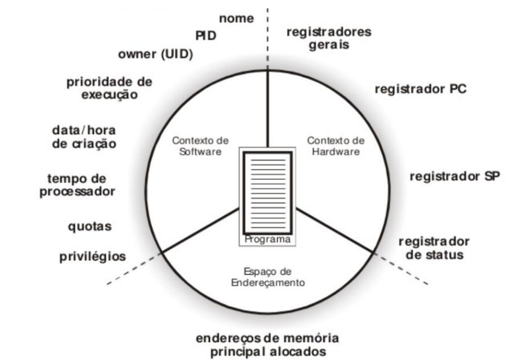
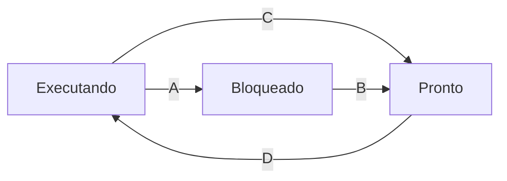

  

 

# Gerência de Processos

- [Introdução](#introdução)

## Introdução

A gerência de processos é uma das principais funções de um sistema operacional (SO). Ela envolve a criação, execução, suspensão e terminação de processos, além de gerenciar a alternância entre eles para garantir o uso eficiente da CPU.

Um processo é um programa em execução. É mais do que apenas o código do programa; inclui também o seu estado atual, variáveis, contador de programa, e outros recursos necessários para a sua execução. Por exemplo, quando você abre o Microsoft Word no seu computador, o SO cria um processo para o Word, que inclui o código do programa, a janela que você vê, e os dados que você está editando.

Para isso, o sistema utiliza uma CPU virtual, o que permite que o SO crie a ilusão de que cada processo tem uma CPU dedicada a ele, mesmo que a CPU física seja compartilhada entre múltiplos processos. Isso é conseguido através da técnica de multiprogramação, onde o SO alterna rapidamente entre processos, dando a cada um uma fatia de tempo da CPU.

Essa alternância entre processos, também conhecida como troca de contexto, é o mecanismo pelo qual o SO salva o estado de um processo atualmente em execução e carrega o estado de um novo processo a ser executado. O estado de um processo inclui o conteúdo dos registradores da CPU, o contador de programa, e outras informações essenciais para retomar a execução. Isso permite que vários processos pareçam estar sendo executados simultaneamente, mesmo em um sistema com uma única CPU.

Entende-se multiprogramação como a capacidade do SO de gerenciar múltiplos processos ao mesmo tempo. Ele mantém vários processos na memória principal e alterna entre eles para utilizar a CPU de forma mais eficiente. Por exemplo, enquanto você está escrevendo um documento no Word, o Excel pode estar recalculando uma planilha em segundo plano e o Outlook pode estar sincronizando emails.

Vamos considerar um cenário comum onde você está usando vários programas do Microsoft Office ao mesmo tempo: Word, Excel, e Outlook.

1. **Abertura do Word**: Quando você abre o Word, o SO cria um novo processo para ele. Este processo inclui o código do Word, a interface gráfica do usuário, e os dados do documento que você está editando.
2. **Abertura do Excel**: Em seguida, você abre o Excel. O SO cria um novo processo para o Excel, que é independente do processo do Word, mas ambos podem ser executados simultaneamente.
3. **Recebimento de Email no Outlook**: Enquanto você está trabalhando no Word e no Excel, o Outlook pode receber novos emails. O SO gerencia um processo separado para o Outlook, que sincroniza emails em segundo plano sem interferir com o Word ou o Excel.
4. **Multiprogramação e Alternância**: O SO utiliza a multiprogramação para alternar rapidamente entre o Word, Excel, e Outlook. Por exemplo, ele pode dar uma fatia de tempo da CPU ao Word para processar entradas do teclado, depois alternar para o Excel para recalcular uma planilha, e então mudar para o Outlook para sincronizar emails. Durante cada alternância, o SO realiza uma troca de contexto, salvando o estado atual do processo em execução e carregando o estado do próximo processo.
5. **Troca de Contexto**: Quando você alterna de volta para o Word, o SO restaura o estado do processo do Word, permitindo que você continue exatamente de onde parou. Este processo de salvar e restaurar estados é a troca de contexto.

## Criação, Término e Hierarquia de Processos

A criação de processos em um sistema operacional pode ocorrer por diversos motivos, e existem quatro eventos principais que desencadeiam a criação de novos processos:

 - **Inicialização do Sistema**: Quando o sistema operacional é iniciado, ele cria vários processos necessários para o funcionamento básico do sistema. Alguns desses processos interagem diretamente com o usuário (processos de primeiro plano ou foreground), enquanto outros operam em segundo plano (processos de background), conhecidos como daemons. Por exemplo, um daemon de impressão aguarda por pedidos de impressão.
- **Chamada de Sistema**: Um processo em execução pode solicitar a criação de um novo processo através de uma chamada de sistema. No Linux, por exemplo, a função `fork()` é usada para criar um processo filho que é uma cópia do processo pai.
- **Pedido do Usuário**: Um usuário pode iniciar a criação de um processo ao interagir com a interface do sistema, como clicar duas vezes em um ícone para abrir um documento do Word. Isso faz com que o SO crie um novo processo para executar o Word.
- **Início de Tarefa em Lote**: Em sistemas de grande porte, tarefas em lote podem ser iniciadas automaticamente pelo SO ou por administradores, resultando na criação de novos processos para cada tarefa.

Cada processo possui diversos componentes importantes, além do código do programa:

- **Contexto de Software**: Inclui informações como o nome do processo, identificador do processo (PID), identificador do processo pai (PPID), identificador do proprietário/usuário (UID), e prioridade de execução.
- **Contexto de Hardware**: Inclui os valores dos registradores da CPU quando o processo está em execução.
- **Espaço de Endereçamento**: Contém o código do programa, dados, e outras informações necessárias para a execução do processo.

Um esquema de um progeto poderia ser:

  

 

Essas informações são armazenadas em uma estrutura de dados conhecida como Bloco de Controle do Processo (PCB - Process Control Block). O PCB é mantido em uma área protegida da memória e contém detalhes críticos como:

- Identificador do processo (PID)
- Valores dos registradores da CPU
- Espaço de endereçamento do processo
- Prioridade do processo
- Outros dados necessários para a gestão do processo

Para gerenciar eficientemente esses PCBs, o SO utiliza uma Tabela de Processo, que permite localizar e acessar rapidamente o PCB de qualquer processo.

Os processos podem terminar por diversas razões, sendo as principais:

- **Término Normal (Voluntário)**: O processo conclui sua tarefa e realiza uma chamada de sistema para informar ao SO que terminou. Por exemplo, um programa que processa dados, exibe resultados e então termina sua execução.
- **Término por Erro (Voluntário)**: O processo encontra um erro durante sua execução, como uma divisão por zero, e decide terminar.
- **Erro Fatal (Involuntário)**: O processo encontra um erro não recuperável, como tentar acessar um arquivo inexistente, e é terminado pelo SO.
- **Eliminado por Outro Processo (Involuntário)**: Um processo pode ser terminado por outro processo, como quando um administrador usa o comando `kill` no Linux para terminar um processo problemático.

Por fim, os processos em um sistema operacional frequentemente possuem uma hierarquia. Cada processo pode ter um pai (o processo que o criou) e pode criar processos filhos. No Linux, o primeiro processo a ser executado após o carregamento do kernel é o `init` (PID = 1), que é responsável por iniciar outros processos.

Por exemplo, considere a seguinte hierarquia de processos:

- `init` (PID = 1)
  - `bash` (PID = 100)
    - `programa A` (PID = 200)
  - `bash` (PID = 101)
  - `bash` (PID = 102)

Neste cenário, `init` é o processo pai de três instâncias do shell `bash`, e uma dessas instâncias de `bash` é o pai do `programa A`. A hierarquia reflete a relação de criação e controle entre processos no sistema.

## Estados de um Processo

Os processos em um sistema operacional podem estar em diferentes estados, refletindo a sua situação atual em relação ao uso da CPU e a espera por eventos. Os três estados principais de um processo são:

- **Executando**: O processo está atualmente utilizando a CPU para executar suas instruções.
- **Pronto**: O processo está pronto para executar e aguarda uma oportunidade para usar a CPU. Ele está na fila de processos prontos, esperando sua vez.
- **Bloqueado (ou em Espera)**: O processo está esperando por algum evento externo para poder continuar a execução, como a conclusão de uma operação de entrada/saída (E/S).

Os processos transitam entre esses estados de acordo com a sua necessidade de recursos e a disponibilidade da CPU. As quatro transições possíveis entre os estados são:

<ol style="list-style-type: upper-alpha;">
  <li><b>Executando >> Bloqueado</b>: Ocorre quando um processo em execução precisa esperar por um evento externo, como a leitura de dados de um disco. Nesse momento, ele deixa de usar a CPU e entra no estado bloqueado.</li>
  <li><b>Bloqueado >> Pronto</b>: Ocorre quando o evento pelo qual o processo estava esperando é concluído. Por exemplo, após a leitura do arquivo do disco, o processo é notificado que os dados estão disponíveis e ele se move para o estado pronto.</li>
  <li><b>Executando >> Pronto</b>: Ocorre quando o processo em execução excede seu tempo de uso da CPU (fatia de tempo) ou é preemptado por um processo de maior prioridade. Nesse caso, ele deixa a CPU e volta para a fila de processos prontos.</li>
  <li><b>Pronto >> Executando</b>: Ocorre quando a CPU se torna disponível e é atribuída a um dos processos prontos, que então passa a executar.</li>
</ol>

Para exemplificar, considere um cenário onde um processo está executando e precisa ler dados de um arquivo:

<ol style="list-style-type: upper-alpha;">
  <li><b>Executando >> Bloqueado</b>: O processo Word está executando e solicita a leitura de dados do arquivo <code>teste.txt</code> no disco. Ele entra no estado bloqueado enquanto aguarda a conclusão da leitura.</li>
  <li><b>Bloqueado >> Pronto</b>: Após a leitura do arquivo ser concluída, o processo Word é notificado. Ele então transita para o estado pronto, aguardando a sua vez de utilizar a CPU novamente.</li>
  <li><b>Executando >> Pronto</b>: Se o Word excede seu tempo de uso da CPU antes de completar suas operações, ele é preemptado e volta ao estado pronto, enquanto a CPU é atribuída a outro processo.</li>
  <li><b>Pronto >> Executando</b>: Quando a CPU se torna disponível, o processo Word é selecionado da fila de prontos e volta a executar.</li>
</ol>

O tempo que um processo passa em cada estado depende do seu comportamento:

- **Processos CPU-bound**: Esses processos realizam operações intensivas de CPU e passam a maior parte do tempo em execução. Um exemplo é a reprodução de um filme, que exige constante processamento de dados de vídeo e áudio. Eles raramente entram no estado bloqueado, apenas retornando ao estado pronto quando a fatia de tempo se esgota.
- **Processos I/O-bound**: Esses processos realizam muitas operações de E/S e passam grande parte do tempo esperando por eventos externos. Um exemplo é um programa de chat, que frequentemente espera pela entrada do usuário. Eles frequentemente entram no estado bloqueado e, após a conclusão das operações de E/S, movem-se para o estado pronto.
