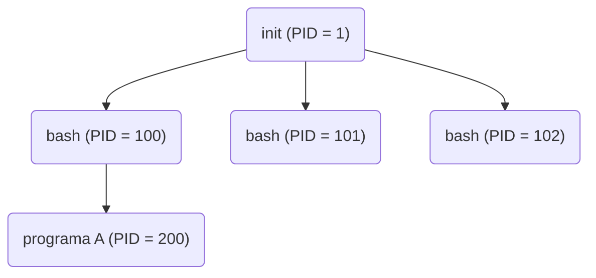
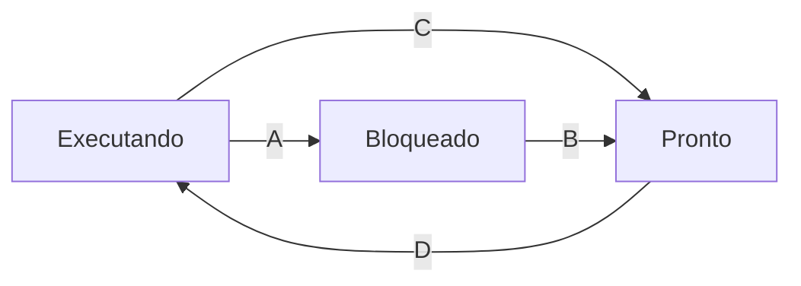
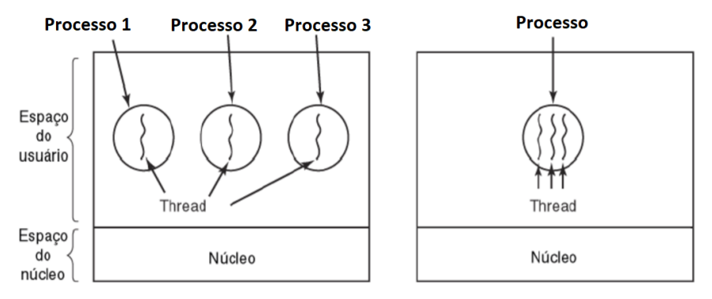
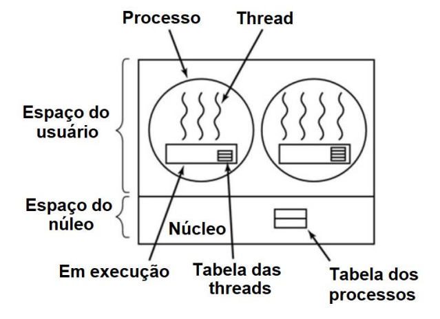
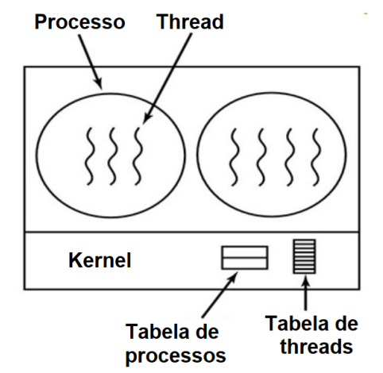
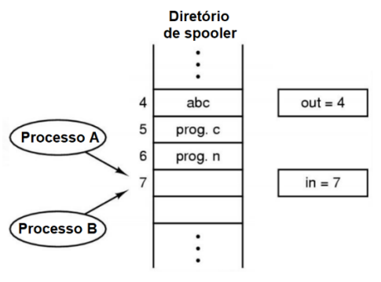
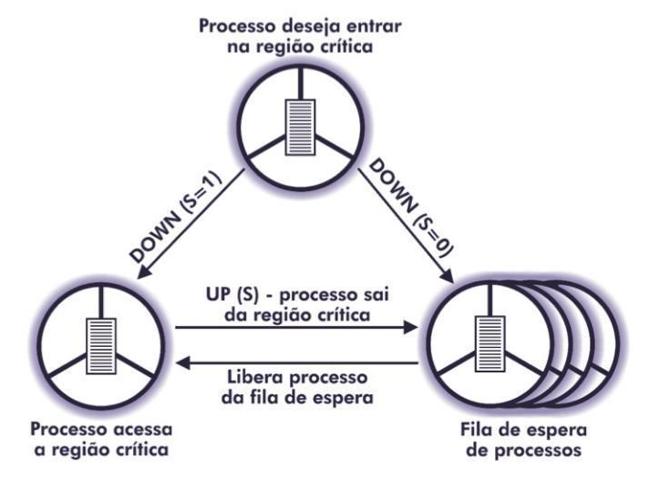

<div align="center">
  <a href="https://github.com/joseferreira-dev/my-study-notes/tree/main/sistemas-operacionais"></a>
</div>
<br>

# Gerência de Processos

- [Introdução](#introdução)
- [Criação, Término e Hierarquia de Processos](#criação-término-e-hierarquia-de-processos)
- [Estados de um Processo](#estados-de-um-processo)
- [Comunicação entre Processos](#comunicação-entre-processos)
- [Escalonamento de Processos](#escalonamento-de-processos)
- [Escalonamento em Sistemas de Lote](#escalonamento-em-sistemas-de-lote)
  - [First-Come, First-Served (FCFS)](#first-come-first-served-fcfs)
  - [Shortest-Job First (SJF)](#shortest-job-first-sjf)
  - [Shortest Remaining Time Next (SRT)](#shortest-remaining-time-next-srt)
- [Escalonamento em Sistemas Interativos](#escalonamento-em-sistemas-interativos)
  - [Round-robin](#round-robin)
  - [Escalonamento por Prioridade](#escalonamento-por-prioridade)
  - [Escalonamento por Múltiplas Filas](#escalonamento-por-múltiplas-filas)
  - [Escalonamento Garantido](#escalonamento-garantido)
  - [Escalonamento por Sorteio](#escalonamento-por-sorteio)

## Introdução

A gerência de processos é uma das principais funções de um sistema operacional (SO). Ela envolve a criação, execução, suspensão e terminação de processos, além de gerenciar a alternância entre eles para garantir o uso eficiente da CPU.

Um processo é um programa em execução. É mais do que apenas o código do programa; inclui também o seu estado atual, variáveis, contador de programa, e outros recursos necessários para a sua execução. Por exemplo, quando você abre o Microsoft Word no seu computador, o SO cria um processo para o Word, que inclui o código do programa, a janela que você vê, e os dados que você está editando.

Para isso, o sistema utiliza uma CPU virtual, o que permite que o SO crie a ilusão de que cada processo tem uma CPU dedicada a ele, mesmo que a CPU física seja compartilhada entre múltiplos processos. Isso é conseguido através da técnica de multiprogramação, onde o SO alterna rapidamente entre processos, dando a cada um uma fatia de tempo da CPU.

Essa alternância entre processos, também conhecida como troca de contexto, é o mecanismo pelo qual o SO salva o estado de um processo atualmente em execução e carrega o estado de um novo processo a ser executado. O estado de um processo inclui o conteúdo dos registradores da CPU, o contador de programa, e outras informações essenciais para retomar a execução. Isso permite que vários processos pareçam estar sendo executados simultaneamente, mesmo em um sistema com uma única CPU.

Entende-se multiprogramação como a capacidade do SO de gerenciar múltiplos processos ao mesmo tempo. Ele mantém vários processos na memória principal e alterna entre eles para utilizar a CPU de forma mais eficiente. Por exemplo, enquanto você está escrevendo um documento no Word, o Excel pode estar recalculando uma planilha em segundo plano e o Outlook pode estar sincronizando emails.

Vamos considerar um cenário comum onde você está usando vários programas do Microsoft Office ao mesmo tempo: Word, Excel, e Outlook.

1. **Abertura do Word**: Quando você abre o Word, o SO cria um novo processo para ele. Este processo inclui o código do Word, a interface gráfica do usuário, e os dados do documento que você está editando.
2. **Abertura do Excel**: Em seguida, você abre o Excel. O SO cria um novo processo para o Excel, que é independente do processo do Word, mas ambos podem ser executados simultaneamente.
3. **Recebimento de Email no Outlook**: Enquanto você está trabalhando no Word e no Excel, o Outlook pode receber novos emails. O SO gerencia um processo separado para o Outlook, que sincroniza emails em segundo plano sem interferir com o Word ou o Excel.
4. **Multiprogramação e Alternância**: O SO utiliza a multiprogramação para alternar rapidamente entre o Word, Excel, e Outlook. Por exemplo, ele pode dar uma fatia de tempo da CPU ao Word para processar entradas do teclado, depois alternar para o Excel para recalcular uma planilha, e então mudar para o Outlook para sincronizar emails. Durante cada alternância, o SO realiza uma troca de contexto, salvando o estado atual do processo em execução e carregando o estado do próximo processo.
5. **Troca de Contexto**: Quando você alterna de volta para o Word, o SO restaura o estado do processo do Word, permitindo que você continue exatamente de onde parou. Este processo de salvar e restaurar estados é a troca de contexto.

## Criação, Término e Hierarquia de Processos

A criação de processos em um sistema operacional pode ocorrer por diversos motivos, e existem quatro eventos principais que desencadeiam a criação de novos processos:

 - **Inicialização do Sistema**: Quando o sistema operacional é iniciado, ele cria vários processos necessários para o funcionamento básico do sistema. Alguns desses processos interagem diretamente com o usuário (processos de primeiro plano ou foreground), enquanto outros operam em segundo plano (processos de background), conhecidos como daemons. Por exemplo, um daemon de impressão aguarda por pedidos de impressão.
- **Chamada de Sistema**: Um processo em execução pode solicitar a criação de um novo processo através de uma chamada de sistema. No Linux, por exemplo, a função `fork()` é usada para criar um processo filho que é uma cópia do processo pai.
- **Pedido do Usuário**: Um usuário pode iniciar a criação de um processo ao interagir com a interface do sistema, como clicar duas vezes em um ícone para abrir um documento do Word. Isso faz com que o SO crie um novo processo para executar o Word.
- **Início de Tarefa em Lote**: Em sistemas de grande porte, tarefas em lote podem ser iniciadas automaticamente pelo SO ou por administradores, resultando na criação de novos processos para cada tarefa.

Cada processo possui diversos componentes importantes, além do código do programa:

- **Contexto de Software**: Inclui informações como o nome do processo, identificador do processo (PID), identificador do processo pai (PPID), identificador do proprietário/usuário (UID), e prioridade de execução.
- **Contexto de Hardware**: Inclui os valores dos registradores da CPU quando o processo está em execução.
- **Espaço de Endereçamento**: Contém o código do programa, dados, e outras informações necessárias para a execução do processo.

Um esquema de um progeto poderia ser:

<div align="center">
  
</div>
<br/>

Essas informações são armazenadas em uma estrutura de dados conhecida como Bloco de Controle do Processo (PCB - Process Control Block). O PCB é mantido em uma área protegida da memória e contém detalhes críticos como:

- Identificador do processo (PID)
- Valores dos registradores da CPU
- Espaço de endereçamento do processo
- Prioridade do processo
- Outros dados necessários para a gestão do processo

Para gerenciar eficientemente esses PCBs, o SO utiliza uma Tabela de Processo, que permite localizar e acessar rapidamente o PCB de qualquer processo.

Os processos podem terminar por diversas razões, sendo as principais:

- **Término Normal (Voluntário)**: O processo conclui sua tarefa e realiza uma chamada de sistema para informar ao SO que terminou. Por exemplo, um programa que processa dados, exibe resultados e então termina sua execução.
- **Término por Erro (Voluntário)**: O processo encontra um erro durante sua execução, como uma divisão por zero, e decide terminar.
- **Erro Fatal (Involuntário)**: O processo encontra um erro não recuperável, como tentar acessar um arquivo inexistente, e é terminado pelo SO.
- **Eliminado por Outro Processo (Involuntário)**: Um processo pode ser terminado por outro processo, como quando um administrador usa o comando `kill` no Linux para terminar um processo problemático.

Por fim, os processos em um sistema operacional frequentemente possuem uma hierarquia. Cada processo pode ter um pai (o processo que o criou) e pode criar processos filhos. No Linux, o primeiro processo a ser executado após o carregamento do kernel é o `init` (PID = 1), que é responsável por iniciar outros processos.

Por exemplo, considere a seguinte hierarquia de processos:



Neste cenário, `init` é o processo pai de três instâncias do shell `bash`, e uma dessas instâncias de `bash` é o pai do `programa A`. A hierarquia reflete a relação de criação e controle entre processos no sistema.

## Estados de um Processo

Os processos em um sistema operacional podem estar em diferentes estados, refletindo a sua situação atual em relação ao uso da CPU e a espera por eventos. Os três estados principais de um processo são:

- **Executando**: O processo está atualmente utilizando a CPU para executar suas instruções.
- **Pronto**: O processo está pronto para executar e aguarda uma oportunidade para usar a CPU. Ele está na fila de processos prontos, esperando sua vez.
- **Bloqueado (ou em Espera)**: O processo está esperando por algum evento externo para poder continuar a execução, como a conclusão de uma operação de entrada/saída (E/S).

Os processos transitam entre esses estados de acordo com a sua necessidade de recursos e a disponibilidade da CPU. As quatro transições possíveis entre os estados são:



- **Executando >> Bloqueado (A)**: Ocorre quando um processo em execução precisa esperar por um evento externo, como a leitura de dados de um disco. Nesse momento, ele deixa de usar a CPU e entra no estado bloqueado.
- **Bloqueado >> Pronto (B)**: Ocorre quando o evento pelo qual o processo estava esperando é concluído. Por exemplo, após a leitura do arquivo do disco, o processo é notificado que os dados estão disponíveis e ele se move para o estado pronto.
- **Executando >> Pronto (C)**: Ocorre quando o processo em execução excede seu tempo de uso da CPU (fatia de tempo) ou é preemptado por um processo de maior prioridade. Nesse caso, ele deixa a CPU e volta para a fila de processos prontos.
- **Pronto >> Executando (D)**: Ocorre quando a CPU se torna disponível e é atribuída a um dos processos prontos, que então passa a executar.

Para exemplificar, considere um cenário onde um processo está executando e precisa ler dados de um arquivo:

- **Executando >> Bloqueado (A)**: O processo Word está executando e solicita a leitura de dados do arquivo `teste.txt` no disco. Ele entra no estado bloqueado enquanto aguarda a conclusão da leitura.
- **Bloqueado >> Pronto (B)**: Após a leitura do arquivo ser concluída, o processo Word é notificado. Ele então transita para o estado pronto, aguardando a sua vez de utilizar a CPU novamente.
- **Executando >> Pronto (C)**: Se o Word excede seu tempo de uso da CPU antes de completar suas operações, ele é preemptado e volta ao estado pronto, enquanto a CPU é atribuída a outro processo.
- **Pronto >> Executando (D)**: Quando a CPU se torna disponível, o processo Word é selecionado da fila de prontos e volta a executar.

O tempo que um processo passa em cada estado depende do seu comportamento:

- **Processos CPU-bound**: Esses processos realizam operações intensivas de CPU e passam a maior parte do tempo em execução. Um exemplo é a reprodução de um filme, que exige constante processamento de dados de vídeo e áudio. Eles raramente entram no estado bloqueado, apenas retornando ao estado pronto quando a fatia de tempo se esgota.
- **Processos I/O-bound**: Esses processos realizam muitas operações de E/S e passam grande parte do tempo esperando por eventos externos. Um exemplo é um programa de chat, que frequentemente espera pela entrada do usuário. Eles frequentemente entram no estado bloqueado e, após a conclusão das operações de E/S, movem-se para o estado pronto.

## Threads

Um processo tradicional possui um espaço de endereçamento e um único fluxo de controle, que representa a execução do código do programa. No entanto, em certas situações, é vantajoso ter mais de um fluxo de controle e execução dentro do mesmo processo, operando quase em paralelo. Esses fluxos de controle são chamados **threads** (ou processos leves).

Threads permitem que diferentes partes de um programa sejam executadas simultaneamente. Dentro de um processo, todas as threads compartilham o mesmo espaço de endereçamento e a mesma seção de código na memória, mas cada thread tem seu próprio contador de programa, registradores e pilha.

Por exemplo, considere um editor de texto com várias funcionalidades: contador de palavras, contador de páginas, correção ortográfica instantânea, entre outras. Cada funcionalidade pode ser implementada em uma thread separada. Assim, a cada digitação, uma thread pode atualizar a contagem de palavras, outra pode verificar a quantidade de páginas, e outra pode corrigir a ortografia.

Sem threads, essas funcionalidades teriam que ser executadas sequencialmente, o que resultaria em um desempenho inferior. Alternativamente, cada funcionalidade poderia ser implementada como um processo separado, mas isso seria mais pesado em termos de recursos, pois cada processo teria seu próprio espaço de endereçamento e recursos associados.

<div align="center">
  
</div>
<br/>

Como pode ser visto na figura acima, à esquerda se tem três processos independentes, cada um com uma thread possuindo um fluxo de controle. Já à direita, está representado um único processo que contém várias threads, cada uma executando em paralelo.

As threads podem ser categorizadas em dois tipos principais: **threads ao nível do usuário** e **threads ao nível do kernel (núcleo)**.

Em **threads ao nível do usuário**, o gerenciamento das threads é feito no espaço do usuário, ou seja, a criação, sincronização e escalonamento das threads são tratados por uma biblioteca de threads no espaço do usuário, não pelo kernel. Sua principal vantagem é a menor sobrecarga, pois as operações de thread não envolvem chamadas de sistema ao kernel. Contudo, se uma thread realiza uma operação bloqueante, todo o processo pode ser bloqueado, já que o kernel não sabe sobre as threads individuais. Nessa situação, a tabela de processos é gerida pelo kernel e as tabelas de threads são geridas pelo próprio processo (conforme a figura abaixo).

<div align="center">
  
</div>
<br/>

Já nas **threads ao nível do kernel**, o gerenciamento das threads é feito pelo próprio kernel. O kernel é responsável pela criação, sincronização e escalonamento das threads. Isso resulta em um melhor suporte para multiprocessamento, pois o kernel pode gerenciar e escalonar threads em diferentes CPUs. Contudo, isso gera maior sobrecarga, pois as operações de thread envolvem chamadas ao kernel. Aqui, tanto a tabela de processos quanto a tabela de threads são geridas pelo kernel.

<div align="center">
  
</div>
<br/>

## Comunicação entre Processos

A comunicação entre processos (IPC, do inglês Inter-Process Communication) é fundamental para que processos independentes possam coordenar suas ações e compartilhar dados. Vamos explorar como isso funciona, utilizando exemplos e conceitos importantes como pipes, condições de corrida, seções críticas, semáforos e mutexes.

Um dos exemplos mais simples de IPC é o uso de pipes no shell Unix/Linux. Um pipe permite que a saída de um comando seja usada como entrada para outro. Por exemplo:

```shell
ls | grep x | sort -r | tee arquivo_saida
```

Aqui, o pipe (`|`) conecta a saída de um comando à entrada do próximo. No exemplo, a saída do comando `ls`, que é a lista de arquivos do diretório, é passada como entrada para `grep x`, onde os dados são filtrados mostrando apenas as linhas que contêm `"x"`, cujo resultado é enviado para `sort -r`, que realiza a sua ordenação em ordem decrescente, e, por fim, `tee arquivo_saida` envia a saída para um arquivo e para o console ao mesmo tempo. Isso permite que vários comandos processem dados em sequência, colaborando para um objetivo comum.

Essa interação entre os processo pode gerar **condições de corrida**, que ocorrem quando dois ou mais processos tentam acessar e modificar dados compartilhados simultaneamente, levando a resultados indeterminados e potenciais erros. Imagine dois processos, A e B, que enviam arquivos para um diretório de spooler de impressão quase ao mesmo tempo. Sem uma coordenação adequada, ambos podem tentar modificar o mesmo espaço de armazenamento, causando corrupção de dados ou outros problemas.

<div align="center">
  
</div>
<br/>

O problema mostrado na figura acima ocorreu porque o processo B começou a utilizar uma das variáveis compartilhadas antes que o processo A tivesse terminado de trabalhar com ela.

Para evitar condições de corrida ou outras situações que envolvem memória compartilhada deve-se encontrar uma maneira de proibir que mais de um processo leia e modifique dados compartilhados ao mesmo tempo. Uma **seção ou região crítica** é uma parte do código onde o recurso compartilhado é acessado. Para garantir a integridade dos dados em regiões críticas, quatro condições devem ser atendidas:

- **Exclusão Mútua**: Dois processos não podem estar simultaneamente dentro da seção crítica.
- **Progresso**: Nenhuma suposição deve ser feita sobre a velocidade ou número de processadores.
- **Espera Finita**: Nenhum processo fora da seção crítica deve bloquear outros processos.
- **Ausência de Inanição**: Nenhum processo deve esperar eternamente para entrar na seção crítica.

Para organizar esses processos usam-se **semáforos**, variáveis utilizadas para gerenciar o acesso a recursos compartilhados. Eles suportam operações atômicas **down** e **up** (ou sleep e wakeup), garantindo que os processos sejam bloqueados ou despertados de maneira segura. É uma variável do tipo inteiro que possui o valor `0` quando não tem nenhum sinal a despertar, ou um valor positivo quando um ou mais sinais para despertar estiverem pendentes.

A operação down verifica se o valor do semáforo é maior que `0`. Se sim, ele é decrementado e o processo continua. Se é `0`, o processo é bloqueado (entra em sleep). Já a operação up incrementa o valor do semáforo. Se havia processos bloqueados, um deles é despertado. É garantido que iniciada uma operação de semáforo, nenhum outro processo pode acessar o semáforo até que a operação tenha terminado ou sido bloqueada. Isso evita as condições de corrida.

<div align="center">
  
</div>
<br/>

Um exemplo de situação seria de um semáforo inicializado com `0` indicando que a região crítica está ocupada. Quatro processos tentam entrar na região crítica e são bloqueados. Quando um processo sai, executa a operação up, incrementando o semáforo para `1`, permitindo que um dos processos bloqueados entre na região crítica. Quando tal processo entrar é aplicada a operação down, passando o valor do semáforo para `1`. Ou seja, o valor do semáforo diz quantos processos podem entrar.

Uma forma mais simplificada de semáforo é um **mutex (mutual exclusion)**, usado quando apenas dois estados são necessários: **livre** ou **ocupado**. Um mutex é utilizado para garantir que somente um processo acesse a seção crítica por vez. Sempre que um processo precisa entrar na seção crítica ele chama `mutex_lock`. Se o mutex está livre, o processo entra e o mutex é marcado como ocupado. Caso contrário, o processo é bloqueado até que o mutex seja liberado. Após sair da seção crítica, o processo chama `mutex_unlock`, liberando o mutex e permitindo que outro processo entre.

## Escalonamento de Processos

O escalonamento de processos é uma atividade fundamental no gerenciamento da CPU em sistemas operacionais. Ele visa maximizar a eficiência do processamento e garantir que processos prioritários sejam executados de maneira adequada.

O escalonamento pode ocorrer em diversas situação, mas deve ocorrer sempre em duas situações principais:

- **Quando um processo termina**: Após a conclusão de um processo, ele não precisa mais da CPU. A CPU deve ser liberada para outro processo que esteja aguardando.
- **Quando um processo é bloqueado**: Um processo pode ser bloqueado durante operações de E/S (entrada/saída) ou ao aguardar um semáforo. Neste caso, ele não deve monopolizar a CPU enquanto espera. A CPU deve ser alocada a outro processo que esteja pronto para executar.

Um conceito importante quando se trata desse assunto é a **preempção**, que é o ato do sistema operacional de interromper um processo em execução e alocar a CPU a outro processo. Isso é realizado através de interrupções do relógio, garantindo que nenhum processo monopolize o processador. A preempção é crucial em sistemas interativos para assegurar que todos os processos tenham a oportunidade de executar.

Quando um sistema não é preemptivo, pode ocorrer uma situação chamada **starvation (inanição)**. Nesse cenário, processos de menor prioridade podem nunca chegar a ser executados, pois processos de maior prioridade sempre "furam a fila". Starvation ocorre quando um processo fica indefinidamente esperando para ser escalonado.

Existem vários algoritmos utilizados para realizar escalonamento, cada um com suas próprias características e vantagens. Eles podem ser categorizados de acordo com o tipo de sistema:

- **Lote (Batch)**: Utilizado em computadores de grande porte onde não há necessidade de resposta rápida aos usuários. Algoritmos não-preemptivos ou com longos períodos de tempo para cada processo são aceitáveis. Minimiza trocas de processos, melhorando o desempenho geral.
- **Interativo**: Em ambientes onde os usuários interagem constantemente com o sistema, a preempção é essencial. Prevê a distribuição justa da CPU entre os processos, impedindo a monopolização. Comum em PCs para jogos, edição de textos, navegação na internet, etc.
- **Tempo Real (Real-Time)**: Preempção pode ser desnecessária porque os processos são programados para não serem executados por longos períodos. Os processos realizam suas tarefas rapidamente e frequentemente entram em estado de bloqueio. Utilizado em sistemas críticos como radares de velocidade, onde a resposta imediata é essencial.

## Escalonamento em Sistemas de Lote

Nos sistemas de lote, o escalonamento de processos visa maximizar a eficiência do processamento, muitas vezes sem a necessidade de resposta imediata aos usuários. Aqui, os algoritmos são escolhidos para otimizar o uso da CPU e minimizar o tempo de espera total. Alguns dos principais algoritmos utilizados especificamente em sistemas de lote são: FCFS, SJF e SRT.

### First-Come, First-Served (FCFS)

O algoritmo **First-Come, First-Served (FCFS)** (Primeiro a Chegar, Primeiro a ser Atendido) é um dos mais simples e intuitivos. Conforme o nome sugere, os processos são atendidos na ordem em que chegam. Imagine uma fila única onde os processos entram e aguardam sua vez de serem executados. Assim que um processo é selecionado, ele monopoliza a CPU até ser concluído ou até precisar ser bloqueado por alguma operação de E/S. Se um processo bloqueado se torna pronto novamente, ele retorna ao final da fila.

Um ponto importante é que o FCFS é um algoritmo não-preemptivo. Isso significa que, uma vez que um processo começa a ser executado, ele não pode ser interrompido até finalizar ou ser bloqueado. Esse método é simples e justo, mas pode levar a problemas de monopolização da CPU. Por exemplo, se um processo com um tempo de execução longo for o primeiro a ser executado, ele poderá ocupar a CPU por um tempo considerável, causando um aumento significativo no tempo de espera para os processos subsequentes. Esse cenário é conhecido como o "problema do comboio".

### Shortest-Job First (SJF)

O algoritmo **Shortest-Job First (SJF)** busca minimizar o tempo médio de espera ao priorizar os processos com o menor tempo de execução. Nesse algoritmo, presume-se que os tempos de execução dos processos são conhecidos previamente. Assim, quando vários processos estão prontos para serem executados, o SJF seleciona o que possui o menor tempo de execução estimado.

Imagine uma empresa onde as tarefas são conhecidss por sua duração: tarefas do tipo A levam 2 minutos, do tipo B levam 6 minutos e do tipo C levam 4 minutos. Suponha que as tarefas B1, A1, C1, A2 e C2 são agendados para execução. De acordo com o SJF, a ordem de execução seria A1 (2 min), A2 (2 min), C1 (4 min), C2 (4 min) e B1 (6 min). Essa abordagem minimiza o tempo médio de espera porque as tarefas mais curtas são executadas primeiro, liberando rapidamente a CPU para outros processos.

O SJF é um algoritmo não-preemptivo, o que significa que uma vez iniciado, um processo não será interrompido até que seja concluído. No entanto, sua aplicação prática é limitada porque raramente se conhece de antemão o tempo de execução dos processos.

### Shortest Remaining Time Next (SRT)

O **Shortest Remaining Time Next (SRT)** é uma versão preemptiva do SJF. No SRT, o escalonador sempre seleciona o job com o menor tempo de execução restante. Quando um novo processo chega, seu tempo de execução é comparado com o tempo restante do processo atualmente em execução. Se o novo processo tiver um tempo de execução menor, o processo atual é suspenso e o novo processo é iniciado.

Essa abordagem permite uma alta prioridade para jobs curtos recém-chegados, garantindo que não fiquem esperando por longos períodos. Por exemplo, se um processo com um tempo restante de 10 minutos está em execução e um novo processo com um tempo estimado de 2 minutos chega, o processo atual será preemptado e o novo processo será executado imediatamente. Após a conclusão do novo processo, o processo preemptado retoma a execução.

O SRT oferece uma maneira eficiente de garantir que processos curtos sejam concluídos rapidamente, mas introduz a complexidade adicional da preempção e a necessidade de conhecer ou estimar os tempos de execução dos processos.

## Escalonamento em Sistemas Interativos

Nos sistemas interativos, o objetivo principal do escalonamento é garantir que os usuários recebam respostas rápidas e que a utilização do processador seja justa entre os processos. Diferentemente dos sistemas de lote, onde a resposta rápida não é crucial, em sistemas interativos a preempção é fundamental para evitar que um único processo monopolize a CPU. Alguns dos principais algoritmos de escalonamento utilizados em sistemas interativos são: Round-robin, Escalonamento por Prioridade, Escalonamento por Múltiplas Filas, Escalonamento Garantido e Escalonamento por Sorteio.

### Round-robin

O algoritmo **Round-robin** é um dos métodos mais simples e amplamente usados para escalonamento em sistemas interativos. Ele atribui um **quantum** de tempo fixo a cada processo na fila de prontos. Quando um processo começa a ser executado, ele tem até o fim do quantum para usar a CPU. Se o processo não terminar sua execução até o fim do quantum, ele é preemptado e colocado no final da fila, dando lugar ao próximo processo.

Por exemplo, suponha que o quantum seja de 9ms e a troca de contexto demore 1ms. Nesse caso, a cada 10ms, 1ms é gasto em operações administrativas (salvar e carregar registradores, atualizar tabelas, etc.), resultando em uma sobrecarga de 10%. Se um processo termina antes do quantum expirar ou é bloqueado por uma operação de E/S, a CPU é imediatamente atribuída ao próximo processo.

### Escalonamento por Prioridade

No escalonamento por prioridade, cada processo recebe uma prioridade. O processo com a maior prioridade entre os prontos é escolhido para execução. Este método é útil para garantir que processos críticos, como aqueles necessários para videoconferências ao vivo, recebam CPU antes de processos menos urgentes, como um daemon de envio de e-mails.

Para evitar a monopolização da CPU por processos de alta prioridade, o sistema pode diminuir gradualmente a prioridade do processo em execução a cada interrupção de relógio. Quando a prioridade de um processo em execução cai abaixo da prioridade do próximo processo mais prioritário, ocorre uma troca de processo. Outra abordagem é dar um quantum a cada processo; se esse quantum se esgota, a CPU é atribuída ao próximo processo de maior prioridade.

### Escalonamento por Múltiplas Filas

O escalonamento por múltiplas filas agrupa os processos em diferentes classes, cada uma com uma prioridade e um quantum diferente. Os processos começam na fila com a prioridade mais alta (e menor quantum). À medida que um processo utiliza todos os quanta (plural de quantum) destinados a ele em uma fila, ele é movido para a próxima fila, que possui um quantum maior.

Por exemplo, um processo que precisa de 50 quanta pode começar na fila com 1 quantum, depois mover-se para 2 quanta, 4 quanta, 8 quanta, 16 quanta, e finalmente 32 quanta. No total, esse processo teria utilizado 63 quanta, mas na última fila, ele apenas utilizaria 19 antes de terminar sua execução e liberar a CPU.

### Escalonamento Garantido

O escalonamento garantido visa cumprir promessas realistas de desempenho para os usuários. Se houver N usuários, cada um deve receber cerca de 1/N do poder da CPU. Para implementar isso, o sistema monitora o tempo de CPU recebido por cada processo e ajusta as alocações para equilibrar o uso ao longo do tempo. Se um usuário recebeu menos CPU, ele será compensado na próxima rodada, garantindo uma distribuição justa de recursos.

### Escalonamento por Sorteio

O escalonamento por sorteio é uma alternativa mais simples ao escalonamento garantido. Nesse método, cada processo recebe um número de "bilhetes de loteria". Quando a CPU precisa ser atribuída, um bilhete é sorteado, e o processo que possui esse bilhete ganha a CPU. Processos mais importantes podem receber mais bilhetes, aumentando suas chances de ganhar a loteria. Este método é fácil de implementar e garante uma distribuição probabilística justa da CPU.
