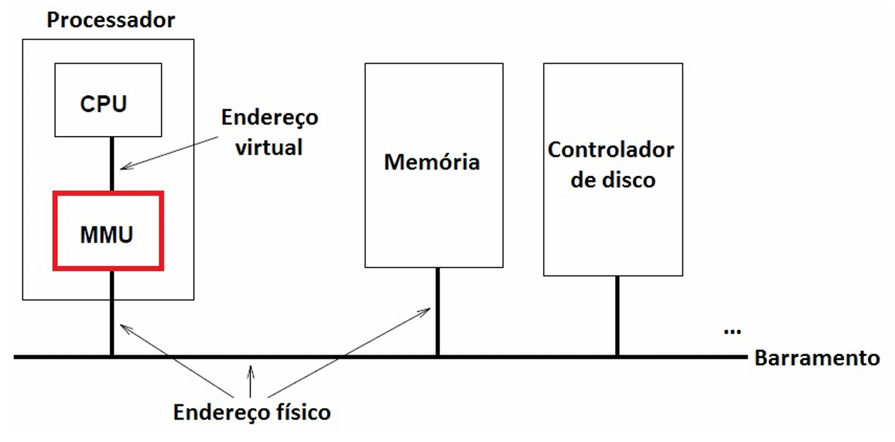

# Capítulo 3 – Gerenciamento de Memória

A memória principal (RAM) é um dos recursos mais cruciais e, frequentemente, um dos mais disputados em um sistema computacional. É nela que os programas e seus dados residem enquanto estão em execução. O componente central do Sistema Operacional responsável por orquestrar o uso deste recurso vital é o **gerenciador de memória**. Sua principal tarefa é determinar onde, na memória, o código de um novo processo (lido de um dispositivo de armazenamento como um HD ou SSD) deve ser alocado, além de controlar quais partes da memória estão em uso, por quem, e como otimizar esse uso para atender às demandas de múltiplos processos concorrentes.

Antes de nos aprofundarmos nas técnicas de gerenciamento, é importante compreendermos um problema comum que pode surgir da má gestão de memória, conhecido como **vazamento de memória (memory leak)**. Um vazamento de memória pode ocorrer em duas situações principais:

1. **Memória Alocada e Inacessível:** Blocos de memória são alocados dinamicamente por um programa para seu uso, mas, em algum momento, o programa perde todas as referências (ponteiros) para esses blocos sem tê-los liberado explicitamente. Como resultado, essa memória continua marcada como "em uso" pelo sistema operacional, mas não pode ser acessada nem reutilizada pelo programa que a alocou, nem por outros processos. Ela se torna um "lixo" que ocupa espaço desnecessariamente.
2. **Memória Referenciada, Mas Não Utilizada (e Não Liberada):** Blocos de memória contêm dados que não são mais necessários ou que se tornaram inacessíveis para a lógica principal do programa. No entanto, devido a um "esquecimento" no código ou a referências persistentes (talvez em estruturas de dados globais ou caches que não foram limpas), esses blocos não são liberados. Mesmo sem estarem sendo ativamente usados para um propósito útil, eles continuam alocados, impedindo sua reutilização.

Ambas as situações levam a um consumo progressivo e desnecessário de memória, podendo, em casos graves, esgotar a memória disponível e causar lentidão ou até mesmo a falha (crash) do programa ou do sistema como um todo.

Os gerenciadores de memória podem ser classificados, de forma ampla, em duas categorias principais, com base em como lidam com os processos e a memória principal:

- Aqueles que **alternam (movem) processos inteiros ou partes de processos entre a memória principal e o disco** durante a execução. Essa técnica é fundamental para permitir que mais processos possam ser executados do que caberiam fisicamente na RAM. As principais estratégias aqui são o **swapping** e a **memória virtual**.
- Aqueles que **não realizam essa alternância dinâmica** (ou o fazem de forma muito limitada). Estes são mais comuns em sistemas mais simples, antigos ou embarcados, onde os processos geralmente residem fixamente na memória uma vez carregados.

Nosso foco principal neste capítulo será na primeira categoria, pois é a abordagem predominante em sistemas operacionais modernos e o que é mais frequentemente abordado em contextos acadêmicos e profissionais.

## Alocação Contígua de Memória: Partições Fixas

Quando um sistema operacional suporta a execução de múltiplos processos concorrentemente (sistemas multitarefa), torna-se essencial estabelecer uma forma de organizar a memória principal para acomodar esses diversos processos. A abordagem mais simples e uma das primeiras a serem utilizadas para este fim é a **divisão da memória em N partições de tamanho fixo**.

Neste esquema, a memória disponível para os processos de usuário é dividida em um número predeterminado de blocos ou partições. O tamanho de cada partição é definido no momento da configuração do sistema operacional e permanece constante durante sua operação. Essas partições podem ter tamanhos diferentes entre si, permitindo, por exemplo, que haja partições menores para processos pequenos e partições maiores para processos que exigem mais memória.

Quando um novo processo precisa ser carregado na memória para execução, o sistema operacional o coloca em uma **fila de entrada**. A estratégia para selecionar em qual partição o processo será alocado pode variar:

- **Fila por Partição:** Pode-se manter uma fila separada para cada partição. Quando um processo chega, ele é direcionado para a fila da menor partição que seja grande o suficiente para contê-lo.
- **Fila Única:** Alternativamente, pode haver uma única fila de entrada para todos os processos. Quando uma partição fica livre, o S.O. seleciona um processo da fila que caiba naquela partição. A escolha pode ser baseada no primeiro processo da fila que caiba, ou buscando a partição que melhor se ajuste ao tamanho do processo (para minimizar o desperdício).

Uma característica fundamental e uma desvantagem significativa das partições fixas é que, como o tamanho da partição é fixo, qualquer espaço dentro de uma partição que não seja utilizado pelo processo alocado a ela é **desperdiçado**. Esse fenômeno é conhecido como **fragmentação interna**. Por exemplo, se uma partição tem 100 KB e um processo de 70 KB é carregado nela, os 30 KB restantes não podem ser usados por nenhum outro processo, pois apenas um processo pode ocupar uma determinada partição por vez.

A figura a seguir ilustra as duas abordagens de filas em um sistema com quatro partições de tamanhos diferentes: Partição 1 (100 KB), Partição 2 (200 KB), Partição 3 (300 KB) e Partição 4 (100 KB).

  

No cenário de "Fila por Partição", se um processo tiver um tamanho menor ou igual a 100 KB, ele poderia ser direcionado para a fila da Partição 1 ou da Partição 4. A estratégia de fila única é mais simples de implementar, mas a escolha da partição para alocar um processo da fila única pode impactar o nível de desperdício (fragmentação interna). Por exemplo, alocar um processo de 10 KB na partição de 300 KB seria um grande desperdício se houvesse uma partição de 100 KB livre.

Esta estratégia de gerenciamento de memória com partições fixas, definidas pelo operador do sistema, foi notavelmente utilizada pelo sistema operacional **OS/360** em mainframes da IBM, onde era conhecida como **MFT (Multiprogramming with a Fixed number of Tasks)**. Embora seja simples de entender e implementar, o MFT é considerado obsoleto para sistemas de propósito geral modernos devido à sua ineficiência no uso da memória e à falta de flexibilidade. No entanto, o conceito ainda é frequentemente abordado em estudos de sistemas operacionais devido à sua importância histórica e didática.

A principal limitação do particionamento fixo é o **grau de multiprogramação**, que é limitado pelo número de partições. Além disso, o tamanho da maior partição define o tamanho máximo de um processo que pode ser executado.

## Swapping: Movimentando Processos entre Memória e Disco

Em muitos cenários, a quantidade total de memória principal (RAM) disponível em um sistema não é suficiente para manter todos os processos ativos simultaneamente. Quando isso ocorre, os processos que não cabem na memória principal precisam ser mantidos em um dispositivo de armazenamento secundário (geralmente o disco rígido ou SSD) e trazidos para a memória dinamicamente quando precisam executar. Duas estratégias principais são usadas para gerenciar essa situação:

1. **Swapping:** Nesta técnica, um processo inteiro é carregado na memória principal, executa por um certo tempo (ou até ser bloqueado) e, se a memória for necessária para outro processo, ele é **totalmente copiado (swapped out)** de volta para o disco. Posteriormente, quando for sua vez de executar novamente e houver espaço, ele é **recarregado (swapped in)** do disco para a memória.
2. **Memória Virtual:** Uma técnica mais sofisticada onde os programas podem ser executados mesmo estando apenas **parcialmente carregados** na memória principal. Apenas as partes do processo que estão sendo ativamente usadas residem na RAM, enquanto o restante permanece no disco. Exploraremos a memória virtual em detalhes mais adiante.

Vamos nos concentrar agora no **swapping**. Analise a figura abaixo, que ilustra a dinâmica da memória em diferentes instantes de tempo sob um sistema que utiliza swapping:

  

Na figura , podemos observar a seguinte sequência de eventos:

- **(a) Instante Inicial:** A memória principal é mostrada com uma pequena porção ocupada pelo Sistema Operacional (geralmente na parte inferior ou superior do espaço de endereçamento). O restante da memória está disponível para processos de usuário. Inicialmente, apenas o Processo A foi carregado na memória.
- **(b) e (c) Carregamento de B e C:** Em seguida, os Processos B e C são carregados na memória, ocupando espaços contíguos após o Processo A.
- **(d) e (e) Swapping Out de A e Carregamento de D:** Suponha que o Processo D precise ser carregado, mas não há um bloco contíguo de memória livre grande o suficiente para ele. O sistema operacional decide fazer o **swap out** do Processo A (copiando-o para o disco) para liberar espaço. O Processo D é então carregado no espaço anteriormente ocupado por A. Note que, neste exemplo, o espaço deixado por A era maior que o necessário para D, resultando em um pequeno fragmento de memória livre entre D e B.
- **(f) e (g) Swapping Out de B e Swapping In de A:** Posteriormente, surge a necessidade de trazer o Processo A de volta para a memória (swap in). Para isso, o Processo B é retirado da memória (swap out) e copiado para o disco. O Processo A é então carregado no espaço deixado por B. Novamente, pode haver incompatibilidade de tamanhos, gerando mais fragmentos.

Como podemos observar na figura, a operação de carregar e retirar processos de tamanhos variáveis da memória principal leva à criação de múltiplos pequenos "buracos" ou **fragmentos de memória livre** espalhados entre os processos alocados. Esse fenômeno é conhecido como **fragmentação externa**. A fragmentação externa ocorre quando há memória livre total suficiente para satisfazer uma requisição de alocação, mas essa memória não está contígua, e sim dividida em muitos pedaços pequenos.

Para mitigar o problema da fragmentação externa, uma técnica que pode ser utilizada é a **compactação de memória**. A compactação consiste em mover todos os processos que estão atualmente na memória para uma extremidade (por exemplo, "para baixo", encostando na área do S.O.), de forma a agrupar todos os pequenos fragmentos livres em um único bloco grande de memória livre na outra extremidade. Por exemplo, na situação (d) da Figura 3.2, se B e C (supondo que C ainda estivesse lá antes de E) fossem deslocados para baixo, os espaços livres entre eles e entre eles e o S.O. seriam eliminados, criando uma área livre maior na parte "de cima".

No entanto, a compactação de memória é uma operação **extremamente custosa em termos de tempo de CPU**. Ela envolve copiar grandes quantidades de dados de uma área da memória para outra e atualizar todas as referências de endereço dos processos movidos. Por esse motivo, a compactação geralmente não é utilizada em sistemas de tempo real ou sistemas interativos onde longas pausas para compactação seriam inaceitáveis. Ela pode ser mais viável em sistemas onde paradas ocasionais para otimização são toleráveis.

### Gerenciamento de Memória Livre: Mapa de Bits e Listas Encadeadas

Para implementar o swapping (e outras formas de alocação dinâmica de memória), o gerenciador de memória precisa saber quais partes da memória estão livres e quais estão ocupadas. Duas estruturas de dados comuns para rastrear o uso da memória são o mapa de bits e as listas encadeadas.

#### Gerenciamento de Memória com Mapa de Bits

Nesta abordagem, a memória é dividida em **unidades de alocação** de tamanho fixo. Essas unidades podem variar de algumas poucas palavras de memória até vários kilobytes (por exemplo, 4 KB é um tamanho comum). Para cada unidade de alocação na memória, existe um bit correspondente em uma estrutura de dados chamada **mapa de bits**.

- Se o bit no mapa é **0**, a unidade de alocação correspondente na memória está **livre**.
- Se o bit no mapa é **1**, a unidade de alocação correspondente está **ocupada** por um processo (ou vice-versa, a convenção pode variar dependendo da implementação).

A figura ilustra esse conceito:

  

Analisando a figura:

- **(a) Segmento de Memória:** Mostra um pedaço da memória contendo quatro processos (A, B, C e D). Observamos também o número de unidades de alocação que cada processo ocupa: Processo A ocupa 5 unidades, Processo B ocupa 6 unidades, Processo C ocupa 3 unidades, e Processo D ocupa 6 unidades. Os espaços "pintados" representam unidades de alocação livres. Se, por exemplo, cada unidade de alocação tiver 4 KB:
    - O Processo A teria um tamanho entre 16 KB + 1 byte e 20 KB (pois ocupa 5 unidades de 4 KB). Não há garantia de que o processo ocupará integralmente a última unidade de alocação; seria uma grande "sorte" se o tamanho do processo fosse um múltiplo exato do tamanho da unidade de alocação. O espaço não utilizado dentro da última unidade alocada a um processo é um exemplo de **fragmentação interna**.
- **(b) Mapa de Bits Correspondente:** Para cada unidade de alocação ocupada na memória (a), há um bit `1` no mapa. Para cada unidade de alocação livre (os quadrados pintados em (a)), existe um bit `0` no mapa. Podemos contar cinco bits `0` no mapa, correspondentes às unidades livres nas posições (índices) 6, 7, 8, 18 e 19 (considerando o início como posição 0). Todas as outras unidades de alocação estão ocupadas (bit `1`).
- **(c) Lista Encadeada Equivalente:** Apresenta as mesmas informações de (b) na forma de uma lista encadeada de segmentos. Cada nó na lista representa um segmento contíguo de memória.
    - Um "P" no primeiro campo indica que o segmento está ocupado por um **Processo**. O campo seguinte informa a posição (índice da unidade) inicial do segmento, o terceiro informa o tamanho (número de unidades) do segmento, e o último campo é um ponteiro para o próximo nó da lista.
    - Um "L" no primeiro campo indica que o segmento está **Livre**.
    - Por exemplo, o primeiro nó `(P, 0, 5)` indica um processo começando na unidade 0 com 5 unidades de tamanho. O segundo nó `(L, 5, 3)` indica um segmento livre começando na unidade 5 com 3 unidades de tamanho (correspondendo aos bits 0 nas posições 5, 6, 7 do mapa de bits, se a figura (a) mostrasse o primeiro buraco com 3 unidades a partir da posição 5).

**Considerações sobre o Tamanho da Unidade de Alocação:**

- **Unidades de Alocação Menores:**
    - **Pró:** Menor desperdício de memória por fragmentação interna (o "finalzinho" não utilizado na última unidade alocada a um processo será menor).
    - **Contra:** O mapa de bits se torna maior, consumindo mais memória para ele próprio.
- **Unidades de Alocação Maiores:**
    - **Pró:** O mapa de bits será menor.
    - **Contra:** Maior potencial de desperdício por fragmentação interna.

Mesmo com unidades de alocação relativamente pequenas, como 4 bytes, a sobrecarga do mapa de bits é gerenciável. Por exemplo, 32 bits de memória (4 bytes) requereriam apenas 1 bit no mapa. A proporção de memória usada pelo mapa de bits seria de 1/32, ou cerca de 3,1%.

Desvantagem Principal do Mapa de Bits:

O principal problema com a abordagem de mapa de bits surge quando o sistema precisa alocar memória para um novo processo de tamanho N unidades. O gerenciador de memória deve pesquisar no mapa de bits uma sequência contígua de N bits 0 (ou 1, se a convenção for invertida). Encontrar essa sequência pode ser uma operação lenta, especialmente em mapas de bits grandes representando memórias extensas. Por esse motivo, embora conceitualmente simples, a estratégia de mapa de bits pura é frequentemente evitada na prática para alocação primária de memória, mas ainda é cobrada em contextos teóricos e de concurso.

#### Gerenciamento de Memória com Listas Encadeadas

Uma alternativa (ou complemento) ao mapa de bits para gerenciar a memória livre e ocupada é manter uma **lista encadeada de segmentos de memória**. Cada nó na lista descreve um segmento contíguo de memória, indicando:

- Se o segmento está ocupado por um processo (P) ou se é um espaço livre (L - "hole").
- O endereço inicial do segmento.
- O tamanho do segmento.
- Ponteiros para o nó anterior e/ou próximo na lista (para facilitar a navegação e a fusão de blocos adjacentes).

A lista é geralmente mantida ordenada por endereço de memória. Isso facilita a fusão de blocos livres adjacentes quando um processo é terminado ou removido da memória (swap out).

Quando um processo `X` termina e seus recursos são liberados, o segmento de memória que ele ocupava se torna livre. O gerenciador de memória então examina os vizinhos desse novo segmento livre (o segmento imediatamente anterior e o imediatamente posterior na lista ordenada por endereço). Quatro situações podem ocorrer, como ilustrado na Figura 3.4:

  

- **(a) Segmento X tem Processos Adjacentes em Ambos os Lados:** O processo X termina. Seus vizinhos anterior e posterior são outros processos. O segmento de X simplesmente se torna um novo bloco livre entre esses dois processos.
- **(b) Segmento X tem um Bloco Livre Acima (Anterior):** O processo X termina. Seu vizinho anterior é um bloco livre. O novo bloco livre de X é fundido com o bloco livre anterior, criando um bloco livre maior.
- **(c) Segmento X tem um Bloco Livre Abaixo (Posterior):** O processo X termina. Seu vizinho posterior é um bloco livre. O novo bloco livre de X é fundido com o bloco livre posterior, criando um bloco livre maior.
- **(d) Segmento X tem Blocos Livres em Ambos os Lados:** O processo X termina. Seus vizinhos anterior e posterior são ambos blocos livres. Todos os três segmentos (o livre anterior, o de X que se tornou livre, e o livre posterior) são fundidos em um único bloco livre ainda maior.

Essas operações de fusão são cruciais para combater a fragmentação externa, tentando manter os blocos livres os maiores possíveis.

Quando o gerenciador de memória precisa alocar um segmento de `N` bytes para um novo processo (ou para um processo que está sendo trazido de volta do disco – swap in), ele percorre a lista de segmentos procurando por um bloco livre (L) que seja grande o suficiente. Diversos algoritmos podem ser usados para selecionar qual bloco livre usar, como veremos na seção sobre algoritmos de substituição em segmentação.

## Memória Virtual: Executando Programas Maiores que a RAM

Um dos avanços mais significativos na história dos sistemas operacionais foi a introdução do conceito de **memória virtual**. A constatação notória na evolução da informática é que o tamanho e a complexidade dos programas frequentemente superam a quantidade de memória física (RAM) disponível para carregá-los integralmente. No passado, uma solução manual comum para esse problema era a técnica de **overlays**.

Com overlays, o programador era responsável por dividir o programa em partes logicamente independentes (os overlays). O overlay principal (overlay 0) era carregado e começava a executar. Quando ele terminava ou precisava de outra parte do programa, ele instruía o sistema operacional a carregar o próximo overlay necessário do disco para a memória, frequentemente sobrescrevendo o overlay anterior. Esse processo continuava sucessivamente. O grande problema dos overlays era a enorme carga de trabalho e a complexidade transferida para o programador, que precisava gerenciar manualmente essas trocas e dependências. A habilidade do profissional influenciava diretamente a eficiência do sistema.

Para superar essa limitação e automatizar o processo, surgiu o método da **memória virtual**. A ideia básica é permitir que um programa seja executado mesmo que apenas uma **parte** dele esteja fisicamente presente na memória principal em um dado momento. O restante do programa reside no dispositivo de armazenamento secundário (disco) e é trazido para a RAM sob demanda, conforme necessário. Isso cria a ilusão para cada processo de que ele possui um espaço de endereçamento muito maior (o **espaço de endereçamento virtual**) do que a memória física realmente disponível.

Por exemplo, você pode ter um computador com 8 GB de memória RAM, mas estar executando diversos processos (navegador com muitas abas, editor de código, player de música, máquina virtual, etc.) cujo tamanho total combinado (código + dados + pilha) poderia ser de 10 GB ou mais. Isso só é possível graças à memória virtual.

**Como funciona a "mágica"?** O Sistema Operacional, em conjunto com hardware especializado (a Unidade de Gerenciamento de Memória - MMU), mantém apenas as partes do programa que estão sendo ativamente usadas (ou foram usadas recentemente) na memória principal. As outras partes ficam armazenadas no disco. Quando o programa tenta acessar uma parte que não está na RAM, ocorre uma **falta (fault)**, e o S.O. se encarrega de buscar essa parte do disco, trazê-la para a RAM (possivelmente removendo outra parte menos usada da RAM para liberar espaço) e então permitir que o programa continue sua execução.

Digamos que um programa de 50 MB precise executar em uma máquina que só pode alocar, no máximo, 5 MB de RAM por vez para esse processo. Com a memória virtual, o S.O. escolheria cuidadosamente quais dos 5 MB do programa seriam mantidos na memória a cada instante. Segmentos do programa seriam permutados (trocados) entre o disco e a memória dinamicamente, conforme fossem necessários.

Existem duas técnicas principais para implementar a memória virtual: **segmentação** e **paginação**.

### Segmentação Pura (Memória Virtual com Segmentos)

Na abordagem de **segmentação pura** (quando usada para memória virtual), o programa não é visto como um bloco único, mas sim como uma coleção de **segmentos** logicamente distintos. Cada segmento corresponde a uma unidade lógica do programa, como:

- Um procedimento ou função (segmento de código).
- Um array ou estrutura de dados (segmento de dados).
- A pilha de execução (segmento de pilha).

Cada segmento possui seu próprio espaço de endereçamento e pode ter um **tamanho variável**, dependendo da unidade lógica que ele representa. A alocação de memória para os segmentos ocorre de maneira não fixa; o tamanho de um segmento é determinado pela lógica do programa (por exemplo, o tamanho de uma função ou de um array).

Mapeamento de Endereços:

Os endereços virtuais em um sistema segmentado são tipicamente compostos por duas partes:

1. **Número do Segmento (s):** Identifica qual segmento está sendo acessado.
2. **Deslocamento (d) (Offset):** Especifica a posição dentro do segmento `s`.

O Sistema Operacional mantém uma **Tabela de Segmentos (Segment Map Table - SMT)** para cada processo. Cada entrada nessa tabela corresponde a um segmento do processo e contém informações como:

- **Endereço Base na Memória Física:** O endereço onde o segmento está carregado na RAM (se estiver).
- **Tamanho do Segmento (Limite):** Para verificar se o deslocamento `d` está dentro dos limites válidos do segmento.
- **Bit de Presença/Ausência:** Indica se o segmento está atualmente na memória principal ou se está apenas no disco.
- **Bits de Proteção:** Permissões de acesso (leitura, escrita, execução).
- Outros bits de controle (como o bit de modificação, que veremos adiante).

Quando um processo tenta acessar um endereço virtual `(s, d)`:

1. A MMU usa o número `s` para encontrar a entrada correspondente na Tabela de Segmentos do processo.
2. Verifica se o segmento está presente na memória (bit de presença).
    - Se não estiver presente, ocorre uma **falta de segmento (segment fault)**. O S.O. precisa encontrar o segmento no disco, carregá-lo para a RAM (possivelmente removendo outro segmento para liberar espaço), atualizar a Tabela de Segmentos e reiniciar a instrução.
3. Se o segmento estiver presente, a MMU verifica se o deslocamento `d` é válido (ou seja, `0 <= d < limite_do_segmento`).
    - Se `d` for inválido, uma exceção de violação de acesso é gerada.
4. Se tudo estiver correto, o endereço físico é calculado somando o endereço base do segmento na memória física com o deslocamento `d`.

Alocação e Fragmentação:

O S.O. mantém uma lista das áreas livres e ocupadas da memória. Quando um segmento precisa ser carregado, o S.O. procura um espaço livre grande o suficiente. Como os segmentos têm tamanhos variáveis, essa alocação pode levar à fragmentação externa, similar ao que ocorre no swapping simples. Mesmo que internamente um segmento seja totalmente utilizado (ou o espaço não utilizado dentro dele seja pequeno e inerente à lógica do programa), os espaços livres entre os segmentos alocados podem se tornar numerosos e pequenos demais para serem úteis, desperdiçando memória.

Imagine a seguinte situação: o usuário executa diversos programas, encerra alguns, abre outros, e assim por diante. Em algum momento, os Processos 1, 2, 3 e 4 estão ativos no "espaço do usuário". Os três primeiros (P1, P2, P3) têm tamanhos semelhantes (digamos, 3.9 KB, 4.0 KB e 4.2 KB, respectivamente), e o quarto (P4) tem um tamanho de 6 KB. Suponha que, devido a outras atividades, existam espaços livres entre eles. Uma configuração possível da memória seria:

  

Na figura, é possível verificar que os processos (representados por seus segmentos) ocupam porções de memória de tamanhos variáveis. Entre eles, existem fragmentos de memória livre: um com cerca de 1 KB (entre os processos 4 e 2) e outro com cerca de 1.5 KB (entre os processos 2 e 3). Esses "buracos" constituem a fragmentação externa.

Como mencionado anteriormente, a técnica de **compactação** poderia ser usada para unir os segmentos ocupados e consolidar os espaços livres, eliminando a fragmentação externa. No entanto, o custo computacional da compactação é geralmente elevado, tornando-a impraticável para muitos sistemas.

### Paginação (Paging)

A **paginação** é a técnica de gerenciamento de memória virtual mais utilizada pela maioria dos sistemas operacionais modernos. Ela supera algumas das dificuldades da segmentação pura, especialmente a fragmentação externa.

**Conceitos Fundamentais:**

- **Espaço de Endereçamento Virtual:** Em qualquer computador, existe um conjunto de endereços de memória que os programas podem gerar ou referenciar. Estes são os **endereços virtuais**, e o conjunto de todos os endereços virtuais que um processo pode acessar forma o seu **espaço de endereçamento virtual**.
- **Páginas (Pages):** O espaço de endereçamento virtual de um processo é dividido em blocos de tamanho fixo chamados **páginas (pages)**. O tamanho da página é uma característica do hardware e do S.O., tipicamente variando de 4 KB a alguns megabytes.
- **Quadros de Página (Page Frames):** A memória física (RAM) também é dividida em blocos de tamanho fixo, chamados **quadros de página (page frames)** ou molduras. Crucialmente, o **tamanho de um quadro de página é sempre igual ao tamanho de uma página**.
- **Unidade de Transferência:** As transferências de dados entre a memória principal e o disco (quando uma página precisa ser carregada ou salva) sempre ocorrem em unidades de páginas inteiras.

Mapeamento de Endereços com a MMU:

Em computadores sem memória virtual, um endereço virtual gerado pelo programa é colocado diretamente no barramento de memória, e a palavra da memória física com esse mesmo endereço é lida ou escrita.

Com o uso da memória virtual paginada, os endereços virtuais gerados pelo programa não vão diretamente para o barramento de memória. Em vez disso, eles são enviados para um componente de hardware especializado chamado **Unidade de Gerenciamento de Memória (MMU - Memory Management Unit)**. A MMU é responsável por traduzir (mapear) os endereços virtuais em endereços da memória física.

  

A MMU utiliza uma estrutura de dados, mantida pelo Sistema Operacional para cada processo, chamada **Tabela de Páginas (Page Table)**. A Tabela de Páginas tem a função fundamental de mapear cada página virtual do processo para um quadro de página correspondente na memória física.

**Exemplo de Paginação:**

Vamos considerar um computador hipotético que pode gerar endereços virtuais de 16 bits. Isso significa que o espaço de endereçamento virtual total é de 216 bytes = 65.536 bytes = 64 KB. Agora, imagine que este computador tenha apenas 32 KB de memória física. Embora programas de até 64 KB possam ser escritos e compilados (pois o espaço virtual permite), eles não podem ser carregados inteiramente na memória física para serem executados. Uma cópia completa do programa (seu executável e dados iniciais) deve residir no disco, e o Sistema Operacional carregará segmentos (páginas) desse programa para a memória principal conforme eles se tornem necessários durante a execução.

Suponha que o tamanho da página (e, portanto, do quadro de página) seja de 4 KB (4096 bytes).

- Espaço de endereçamento virtual: 64 KB / 4 KB por página = **16 páginas virtuais** (numeradas de 0 a 15).
- Memória física: 32 KB / 4 KB por quadro = **8 quadros de página físicos** (numerados de 0 a 7).

A figura ilustra o mapeamento entre o espaço de endereçamento virtual (com sua tabela de páginas) e a memória física (com seus quadros de página) para este exemplo.

  

**Tradução de Endereço:**

Um endereço virtual em um sistema paginado é tipicamente dividido em duas partes:

1. **Número da Página Virtual (p):** Os bits mais significativos do endereço virtual.
2. **Deslocamento dentro da Página (d) (Offset):** Os bits menos significativos do endereço virtual. O número de bits para o deslocamento é determinado pelo tamanho da página (se a página tem 2&lt;sup>k&lt;/sup> bytes, são necessários `k` bits para o deslocamento).

Quando um programa tenta acessar um endereço virtual, por exemplo, o endereço `5000`:

1. A MMU recebe o endereço virtual `5000`.
2. Com páginas de 4 KB (4096 bytes), a MMU determina o número da página virtual e o deslocamento:
    - Página 0: endereços 0 - 4095
    - Página 1: endereços 4096 - 8191
    - Página 2: endereços 8192 - 12287
    - ... e assim por diante.
    - O endereço `5000` está dentro da faixa 4096-8191, portanto, pertence à **Página Virtual 1**.
    - O deslocamento dentro da Página 1 é `5000 - 4096 = 904`.
3. A MMU consulta a **Tabela de Páginas** do processo atual, usando o número da página virtual (Página 1) como índice, para encontrar a entrada correspondente.
4. Essa entrada na tabela de páginas contém:
    - O **número do quadro de página físico** onde a Página Virtual 1 está carregada (se estiver).
    - Um **bit de presença/ausência (valid/invalid bit)**, que indica se a página está atualmente na memória física ou não.
    - Outros bits de controle (proteção, modificação, referência).
    Suponha que a Tabela de Páginas (conforme a figura) indique que a Página Virtual 1 está mapeada para o **Quadro de Página Físico 4**.
5. A MMU então constrói o endereço físico combinando o número do quadro de página físico com o deslocamento original: `(Número do Quadro Físico * Tamanho da Página) + Deslocamento`.
    - No nosso exemplo: `(4 * 4096) + 904 = 16384 + 904 = 17288`.
6. O endereço físico `17288` é então colocado no barramento de memória para acessar o dado.

A memória física em si nem "sabe" da existência da MMU ou da tradução de endereços. Ela simplesmente recebe uma requisição para ler ou escrever no endereço físico calculado pela MMU. No exemplo da sua anotação, se um programa tenta acessar o endereço virtual `9000`:

- Com páginas de 4 KB, `9000` está na Página Virtual 2 (`9000` está entre `8192` e `12287`).
- Se a Tabela de Páginas (Figura 3.7) mapeia a Página Virtual 2 para o Quadro de Página Físico 6, então todos os endereços virtuais entre `8192` e `12287` serão mapeados para os endereços físicos entre `24576` (6 * 4096) e `28671` (24576 + 4095 - 1).
- O deslocamento dentro da Página 2 é `9000 - 8192 = 808`.
- O endereço físico será `(6 * 4096) + 808 = 24576 + 808 = 25384`.

**Falta de Página (Page Fault):**

Agora, o que acontece se o programa tenta acessar um endereço virtual cuja página não está atualmente na memória física? Por exemplo, na Figura 3.7, se o programa tenta acessar o endereço 24576 (que pertence à Página Virtual 6, pois 24576 = 6 * 4096). Olhando a tabela, vemos que a entrada para a Página Virtual 6 tem o bit de presença/ausência indicando "ausente" (marcado com "X" na figura, ou o bit seria 0).

1. A MMU detecta, pela Tabela de Páginas, que a página referenciada não está na memória (o bit de presença/ausência está desativado).
2. A MMU então força a CPU a gerar uma interrupção especial, chamada **trap de falta de página (page fault trap)**, transferindo o controle para o Sistema Operacional.
3. O S.O. assume e executa a seguinte sequência de ações (tratador de falta de página):
    - Verifica se o acesso ao endereço virtual era legal para aquele processo. Se não for (por exemplo, acesso fora dos limites do espaço virtual do processo), o processo pode ser terminado.
    - Se o acesso for legal, o S.O. precisa trazer a página ausente do disco para a memória física.
    - O S.O. localiza a página no disco (geralmente em uma área de swap ou a partir do arquivo executável do programa).
    - O S.O. precisa encontrar um quadro de página livre na memória física.
        - Se houver um quadro livre, ele é usado.
        - Se não houver quadros livres, o S.O. deve selecionar um quadro de página "vítima" (que contém uma página atualmente na memória) usando um **algoritmo de substituição de página** (veremos alguns adiante).
        - Se a página vítima foi modificada desde que foi carregada (o "dirty bit" estaria ativo), ela primeiro precisa ser escrita de volta no disco para salvar suas alterações.
    - A página desejada é lida do disco e carregada no quadro de página selecionado (ou agora livre).
    - A Tabela de Páginas do processo é atualizada para refletir que a página agora está na memória, mapeando-a para o quadro de página físico correto e ativando o bit de presença.
    - A instrução do programa que causou a falta de página é reiniciada, e agora o acesso à memória será bem-sucedido.

**Fragmentação Interna na Paginação:**

A paginação resolve o problema da fragmentação externa, pois todos os quadros de página têm o mesmo tamanho, e qualquer quadro livre pode ser usado para carregar qualquer página. No entanto, a paginação introduz o problema da fragmentação interna.

Como as páginas têm tamanho fixo (ex: 4 KB), é muito provável que a última página de um processo não seja totalmente preenchida pelo código ou dados do processo. Por exemplo, se um processo tem um tamanho total de 9 KB e o tamanho da página é 4 KB:

- Ele precisará de 3 páginas virtuais.
- As duas primeiras páginas (0 a 4095 e 4096 a 8191) serão totalmente preenchidas (8 KB).
- A terceira página (8192 a 12287) usará apenas 1 KB (de 8192 a 9215) para armazenar o restante do processo. Os 3 KB restantes dentro dessa terceira página (de 9216 a 12287) ficarão não utilizados pelo processo, mas a página inteira (e o quadro de página físico correspondente) será alocada. Esse espaço não utilizado _dentro_ de uma página alocada é a fragmentação interna. Como nenhum outro processo pode usar esse espaço remanescente dentro da página de outro processo, ele é efetivamente desperdiçado.

**TLB (Translation Lookaside Buffer): Acelerando a Tradução de Endereços**

Consultar a Tabela de Páginas na memória principal para cada referência de memória feita por um programa seria muito lento, pois exigiria um acesso adicional à memória para cada acesso original que o programa deseja fazer. Para acelerar esse processo de tradução de endereços, os processadores modernos incluem um pequeno cache de hardware, rápido e associativo, chamado Translation Lookaside Buffer (TLB).

- **Funcionamento:** A TLB armazena as traduções de endereços virtuais para físicos usadas mais recentemente. Quando um programa gera um endereço virtual:
    1. A MMU primeiro verifica se a tradução para essa página virtual está na TLB.
        - **TLB Hit (Acerto):** Se a entrada (página virtual -> quadro físico) for encontrada na TLB, o endereço físico correspondente é obtido rapidamente da TLB, e o acesso à memória principal pode prosseguir. Isso é muito rápido.
        - **TLB Miss (Falta):** Se a entrada não estiver na TLB, ocorre uma falta na TLB. A MMU (ou, em alguns sistemas, o S.O. via software) precisa então consultar a Tabela de Páginas completa que está na memória principal para encontrar a tradução.
    2. Uma vez que a tradução é encontrada na Tabela de Páginas, ela é carregada na TLB (possivelmente substituindo uma entrada antiga da TLB, usando um algoritmo como LRU).
    3. O endereço físico é então usado para acessar a memória.

A TLB explora o princípio da **localidade de referência** (programas tendem a acessar repetidamente as mesmas páginas ou páginas próximas em curtos intervalos de tempo). Se a taxa de acertos na TLB (TLB hit ratio) for alta (o que geralmente é, em torno de 98-99% ou mais), a sobrecarga da tradução de endereços é significativamente reduzida, e o desempenho do sistema de memória virtual se aproxima do de um sistema com acesso direto à memória física.

**Dirty Bit (Bit de Modificação ou "Bit de Sujeira")**

O dirty bit (ou bit de modificação, bit M) é um marcador de hardware associado a cada entrada da tabela de páginas (ou a cada quadro de página). Ele é crucial em ambientes de memória virtual para otimizar as operações de escrita em disco.

- **Funcionamento:**
    - Quando uma página é carregada do disco para a memória RAM, seu dirty bit é inicialmente desativado (geralmente `0`).
    - Se a CPU **escreve (modifica)** qualquer dado dentro dessa página enquanto ela está na RAM, o hardware automaticamente ativa (seta para `1`) o dirty bit correspondente àquela página.
    - Quando o Sistema Operacional precisa selecionar uma página para ser removida da RAM (para liberar um quadro de página para uma nova página), ele verifica o dirty bit da página vítima.
        - Se o dirty bit estiver **desativado (0)**, significa que a página não foi modificada desde que foi carregada da última vez. Portanto, a cópia da página na RAM é idêntica à cópia no disco. Nesse caso, o S.O. pode simplesmente sobrescrever o quadro de página com a nova página, sem precisar salvar a página vítima de volta no disco. Isso economiza uma operação de escrita em disco, que é lenta.
        - Se o dirty bit estiver **ativado (1)**, significa que a página foi modificada enquanto estava na RAM. A cópia na RAM é mais recente que a cópia no disco. Nesse caso, antes de o quadro de página poder ser reutilizado, o S.O. _deve_ escrever o conteúdo da página modificada de volta para sua localização no disco (na área de swap ou no arquivo original), para que as alterações não sejam perdidas. Somente após essa escrita (chamada de _page-out_ ou _swap-out_ com escrita) é que o quadro pode ser usado para a nova página.

O dirty bit, portanto, ajuda a evitar escritas desnecessárias no disco, melhorando o desempenho do sistema de memória virtual.

**Thrashing: A Sobrecarga Excessiva de Paginação**

O thrashing é um fenômeno de degradação severa de desempenho que pode ocorrer em um sistema de memória virtual. Ele acontece quando o sistema operacional passa a maior parte do seu tempo trocando páginas entre a memória RAM e o dispositivo de armazenamento secundário (disco), em vez de efetivamente executar as instruções dos programas.

- **Causa:** Geralmente ocorre quando o grau de multiprogramação é muito alto, ou seja, há muitos processos ativos competindo por uma quantidade de memória RAM que é insuficiente para manter seus conjuntos de trabalho (working sets - as páginas que cada processo precisa para executar eficientemente em um dado momento). Como resultado, os processos causam faltas de página com muita frequência. Cada falta de página exige uma operação de E/S no disco (para buscar a página ausente e, possivelmente, salvar uma página vítima), que é muito lenta.
- **Sintomas:** O sistema se torna extremamente lento, a utilização da CPU pode paradoxalmente cair (pois a CPU fica a maior parte do tempo ociosa esperando por E/S de disco), e o disco fica constantemente ativo.
- **Ciclo Vicioso:** Para tentar melhorar a utilização da CPU, o S.O. pode tentar aumentar ainda mais o grau de multiprogramação (trazendo mais processos para a memória), o que só piora a situação, pois reduz ainda mais a quantidade média de RAM disponível por processo, levando a ainda mais faltas de página.

**Prevenção do Thrashing:**

Para evitar o thrashing, os sistemas operacionais utilizam várias estratégias:

- **Algoritmos de Substituição de Página Eficientes:** Usar algoritmos que tentam manter na RAM as páginas que são mais relevantes para a execução futura dos processos (como variações do LRU, ou o algoritmo de segunda chance que veremos adiante).
- **Gerenciamento do Conjunto de Trabalho (Working Set Model):** Tentar estimar o conjunto de páginas que cada processo precisa para executar sem causar faltas excessivas e garantir que esse conjunto esteja na memória antes de permitir que o processo execute. Se a soma dos conjuntos de trabalho de todos os processos ativos exceder a RAM disponível, alguns processos podem ser suspensos (movidos completamente para o disco) para reduzir a competição por memória.
- **Controle do Grau de Multiprogramação:** Limitar o número de processos ativos com base na quantidade de memória livre ou na frequência de faltas de página.
- **Otimização do Tamanho da Carga de Trabalho:** Em alguns casos, pode ser necessário que os desenvolvedores otimizem seus programas para usar a memória de forma mais eficiente ou que os administradores do sistema ajustem a configuração da carga de trabalho.

**Armazenamento da Memória Virtual em Disco (Área de Swap):**

Quando o sistema de memória virtual está habilitado e a memória RAM fica totalmente ocupada, necessitando de mais espaço para carregar novas páginas, as páginas que são removidas da RAM (as páginas vítimas) precisam ser armazenadas em algum lugar no disco. Essa área do disco reservada para armazenar páginas que não cabem na RAM é comumente chamada de área de troca (swap space) ou arquivo de paginação (paging file).

Existem duas abordagens principais para o armazenamento da memória virtual no disco:

1. **Partição de Swap:** Muitos sistemas operacionais, especialmente no mundo Linux, utilizam uma **partição de disco dedicada** exclusivamente para o swap. Essa partição geralmente possui um sistema de arquivos próprio, otimizado para o acesso rápido a blocos de páginas, ou pode não ter um sistema de arquivos no sentido tradicional, sendo gerenciada diretamente pelo S.O. como uma extensão da RAM.
2. **Arquivo de Swap:** Outros sistemas operacionais, como o Windows (com seu arquivo `Pagefile.sys`), utilizam um **arquivo comum** dentro de um sistema de arquivos existente para armazenar as páginas trocadas. Essa abordagem pode ser mais flexível em termos de redimensionamento da área de swap, mas pode ter um desempenho ligeiramente inferior ao de uma partição dedicada, devido à sobrecarga do sistema de arquivos.

Em ambos os casos, essa área no disco é essencial para o funcionamento da memória virtual, permitindo que o sistema execute programas que, coletivamente, são muito maiores do que a RAM física disponível.

## Algoritmos de Alocação de Memória para Segmentação

Quando o gerenciador de memória utiliza uma lista encadeada para rastrear blocos livres e ocupados (como vimos na seção sobre swapping ou no contexto de segmentação pura), e precisa encontrar um segmento de memória livre de `N` bytes para alocar a um novo processo ou para trazer um processo do disco, ele precisa de um algoritmo para decidir qual bloco livre usar, caso haja mais de um que seja grande o suficiente. Esses algoritmos são chamados quando o gerenciador de memória precisa de um espaço contíguo de `N` bytes. Vamos analisar os algoritmos mais comuns:

### First-Fit (Primeiro Encaixe)

- **Funcionamento:** O algoritmo **First-Fit** percorre a lista de segmentos livres (geralmente ordenada por endereço) e seleciona o **primeiro bloco livre** que encontrar que seja de tamanho maior ou igual a `N`.
- **Divisão do Bloco:** Se o bloco livre encontrado for maior que `N`, ele é dividido em duas partes:
    - Uma parte de tamanho `N` é alocada ao processo.
    - A parte restante (tamanho_do_bloco - `N`) continua como um novo bloco livre menor na lista. Se o bloco for exatamente do tamanho `N`, ele é totalmente alocado.
- **Vantagem:** É um algoritmo rápido, pois a busca termina assim que um bloco adequado é encontrado. Não precisa percorrer a lista inteira.
- **Desvantagem:** Pode tender a criar muitos pequenos fragmentos livres no início da lista de memória, o que pode dificultar a alocação de processos maiores posteriormente, mesmo que haja memória total suficiente (fragmentação externa).

### Next-Fit (Próximo Encaixe)

- **Funcionamento:** O algoritmo **Next-Fit** funciona de maneira semelhante ao First-Fit, mas com uma modificação importante: ele **mantém um ponteiro para a posição na lista onde a última alocação bem-sucedida terminou**.
    - Quando uma nova requisição de alocação chega, a busca por um bloco livre começa a partir dessa posição memorizada (em vez de começar sempre do início da lista). A lista é percorrida de forma circular a partir desse ponto.
- **Objetivo:** A ideia é distribuir as alocações de forma mais uniforme pela memória, evitando a concentração de pequenos fragmentos no início da lista, como pode ocorrer com o First-Fit.
- **Vantagem:** Pode ter um desempenho de busca ligeiramente melhor que o First-Fit em média, pois não reexamina repetidamente o início da lista.
- **Desvantagem:** Pode ter um desempenho pior que o First-Fit em alguns casos, pois pode pular blocos livres adequados que estão antes do ponteiro de busca atual e que seriam encontrados rapidamente pelo First-Fit. A qualidade da alocação (em termos de fragmentação) não é necessariamente melhor.

### Best-Fit (Melhor Encaixe)

- **Funcionamento:** O algoritmo **Best-Fit** percorre **toda a lista de segmentos livres** e seleciona o bloco livre que seja grande o suficiente para a requisição `N` e que seja o **mais próximo possível do tamanho `N`**. Ou seja, ele escolhe o menor bloco livre que ainda consiga satisfazer a requisição.
- **Divisão do Bloco:** Assim como no First-Fit, se o bloco escolhido for maior que `N`, a diferença se torna um novo pequeno bloco livre.
- **Vantagem:** Tenta minimizar o tamanho dos fragmentos livres restantes após uma alocação. Para requisições de `N` grande, o Best-Fit pode aumentar as chances de encontrar um espaço adequado, pois preserva os blocos livres maiores, não os usando desnecessariamente para requisições pequenas.
- **Desvantagens:**
    - É mais lento que o First-Fit e o Next-Fit, pois sempre precisa examinar a lista inteira de blocos livres.
    - Tende a criar muitos fragmentos livres **muito pequenos** (as "sobras" após alocar o melhor encaixe). Esses fragmentos minúsculos podem ser inúteis para futuras alocações, aumentando a fragmentação externa.

A figura que usamos anteriormente para mapa de bits e lista encadeada pode ser adaptada para ilustrar a diferença. Suponha os seguintes blocos livres (L) e ocupados (P) na memória (os números indicam o início e o tamanho em unidades de alocação): L(5,3), P(8,5), L(13,2), P(15,3), L(18,2), P(20,6).

Se uma requisição de 2 unidades chegar:

- **First-Fit:** Encontraria L(6,8) primeiro.
- **Best-Fit:** Examinaria todos os livres e escolheria L(18,19). Não deixaria sobras nesse caso.

  

### Quick-Fit (Encaixe Rápido)

- **Funcionamento:** O algoritmo **Quick-Fit** tenta acelerar a busca por blocos livres mantendo **múltiplas listas separadas de blocos livres, uma para cada tamanho de bloco comumente solicitado**.
    - Por exemplo, pode haver uma lista para blocos de 4 KB, outra para blocos de 8 KB, outra para blocos de 16 KB, e assim por diante.
    - Quando uma requisição de tamanho `N` chega, o gerenciador de memória tenta encontrar uma lista para blocos de tamanho `N` (ou um pouco maior, se for permitido). Se encontrar, um bloco dessa lista é alocado muito rapidamente.
- **Vantagem:** A alocação para tamanhos populares pode ser extremamente rápida, pois não há necessidade de percorrer uma longa lista de blocos de tamanhos variados.
- **Desvantagens:**
    - **Complexidade de Gerenciamento de Listas:** Manter múltiplas listas adiciona complexidade.
    - **Problema da Fusão:** A principal desvantagem reside na dificuldade de realizar a **fusão de blocos livres adjacentes** quando um processo termina ou é permutado para o disco. Se um bloco de 8 KB é liberado, e seus vizinhos são de tamanhos diferentes (ou estão em listas diferentes), determinar como e onde colocar esse novo bloco livre (ou como fundi-lo para formar blocos maiores para outras listas) pode ser uma operação custosa e complexa.
    - **Fragmentação:** Se a fusão não for realizada eficientemente, a memória pode rapidamente se fragmentar em um grande número de pequenos espaços livres que, embora existam em listas específicas, não podem ser combinados para satisfazer requisições maiores, levando a uma forma de fragmentação.

### Circular-Fit (ou Buddy System em algumas variações)

O **Circular-Fit** é uma variação do Next-Fit que trata a lista de blocos de memória livres como uma estrutura circular.

- **Funcionamento:**
    1. A memória livre é organizada em uma lista circular.
    2. Quando uma solicitação de alocação de memória é recebida, a lista circular é percorrida a partir do ponto onde a última busca parou (ou de um ponto inicial, se for a primeira vez).
    3. A busca continua até encontrar o primeiro bloco de memória livre que atenda aos requisitos da solicitação (tamanho suficiente).
    4. Se um bloco adequado for encontrado, ele é alocado (e possivelmente dividido, com a sobra retornando à lista como um novo bloco livre).
    5. Se a lista completa for percorrida sem encontrar um bloco adequado, a alocação falha.

O termo "Circular-Fit" por si só é um pouco genérico. Frequentemente, quando se fala em listas circulares e alocação com foco em fusão e divisão eficiente de blocos, pode-se estar referindo a variações de algoritmos como o **Buddy System**. O Buddy System mantém listas de blocos livres de tamanhos específicos que são potências de 2 (ex: 1KB, 2KB, 4KB, 8KB...). Quando uma requisição chega, ele tenta alocar o menor bloco de potência de 2 que seja grande o suficiente. Se um bloco maior precisa ser usado, ele é dividido em dois "buddies" (parceiros) de metade do tamanho, e essa divisão continua até que um bloco do tamanho apropriado seja obtido. Quando um bloco é liberado, o sistema verifica se seu "buddy" também está livre; se estiver, eles são fundidos para formar um bloco maior, combatendo a fragmentação. O aspecto circular pode vir da forma como as listas de blocos de cada tamanho são gerenciadas.

A escolha do algoritmo de alocação para segmentação envolve um trade-off entre a velocidade da alocação, a eficiência no uso da memória (minimização da fragmentação) e a complexidade de implementação.

## Algoritmos de Substituição de Página

Quando ocorre uma **falta de página (page fault)** em um sistema de memória virtual paginada e não há quadros de página físicos livres na RAM, o Sistema Operacional precisa escolher uma página que está atualmente na memória para ser **removida (substituída)**, a fim de liberar um quadro para a página recém-solicitada que precisa ser trazida do disco. A decisão de qual página remover é crucial para o desempenho do sistema, pois remover uma página que será necessária novamente em breve levará a outra falta de página rapidamente, aumentando a sobrecarga. Os **algoritmos de substituição de página** são as políticas que o S.O. utiliza para tomar essa decisão.

### Algoritmo Ótimo (OPT ou MIN)

O algoritmo ótimo, frequentemente chamado de OPT ou MIN, é o algoritmo de substituição de página teoricamente perfeito. Sua regra é simples: **substituir a página que não será utilizada pelo maior período de tempo no futuro**. Ou seja, das páginas atualmente na memória, ele remove aquela cuja próxima referência ocorrerá o mais distante possível no futuro (ou que nunca mais será referenciada).

- **Funcionamento Teórico:** Para cada página na memória no momento da falta de página, o algoritmo "olharia para o futuro" na sequência de referências de memória do processo e determinaria quando cada uma dessas páginas seria acessada novamente. A página com a referência futura mais distante seria a escolhida para substituição.
- **Desvantagem:** O grande problema do algoritmo ótimo é que ele **não é realizável na prática**. No momento da falta de página, o Sistema Operacional **não tem como saber com certeza quais páginas serão referenciadas no futuro** e quando isso ocorrerá. O futuro comportamento de um programa não é previsível com exatidão.
- **Utilidade:** Apesar de não ser implementável, o algoritmo ótimo serve como um **padrão de referência (benchmark)**. Ele fornece o limite inferior para o número de faltas de página que qualquer algoritmo prático pode alcançar. Ao simular um algoritmo de substituição prático e compará-lo com o ótimo para uma mesma sequência de referências, pode-se medir a eficiência do algoritmo prático.

### Algoritmo NRU (Not Recently Used – Não Recentemente Usada)

O algoritmo **NRU** tenta aproximar o comportamento do algoritmo ótimo usando informações sobre o uso recente das páginas. Para isso, muitos computadores com memória virtual mantêm dois bits de hardware associados a cada página na tabela de páginas:

- **Bit R (Referência):** Este bit é ativado (setado para `1`) automaticamente pelo hardware sempre que a página é lida ou escrita (ou seja, referenciada).
- **Bit M (Modificação ou Dirty Bit):** Este bit é ativado (setado para `1`) automaticamente pelo hardware sempre que a página é escrita (modificada).

É importante que esses bits sejam atualizados pelo hardware em cada referência de memória. Uma vez que um bit é ativado, ele permanece ativado até que o Sistema Operacional o desative (zere) por software.

O algoritmo NRU utiliza esses bits da seguinte forma:

1. **Inicialização:** Quando um processo é iniciado, o S.O. define os bits R e M de todas as suas páginas (ou das páginas carregadas na memória) como `0`.
2. **Interrupção de Relógio:** Periodicamente (a cada interrupção de relógio, por exemplo), o S.O. **zera o bit R** de todas as páginas. Isso serve para distinguir páginas que não foram referenciadas desde a última interrupção de relógio (bit R permanecerá `0`) daquelas que foram referenciadas nesse intervalo (bit R será setado para `1` pelo hardware). O bit M _não_ é zerado pela interrupção de relógio, pois a informação de modificação é crucial para decidir se a página precisa ser salva no disco antes de ser substituída.
3. **Seleção da Vítima (em uma Falta de Página):** Quando ocorre uma falta de página, o S.O. examina todas as páginas atualmente na memória e as classifica em quatro categorias, com base nos valores correntes de seus bits R e M:
    - **Classe 0: (R=0, M=0)** – Não referenciada, não modificada. (Melhor candidata para remoção, pois não foi usada recentemente e não precisa ser salva no disco).
    - **Classe 1: (R=0, M=1)** – Não referenciada, modificada. (Candidata razoável; não foi usada recentemente, mas precisa ser salva no disco).
    - **Classe 2: (R=1, M=0)** – Referenciada, não modificada. (Provavelmente em uso, mas não precisa ser salva no disco).
    - **Classe 3: (R=1, M=1)** – Referenciada, modificada. (Pior candidata para remoção, pois foi usada recentemente e precisa ser salva no disco).
	O algoritmo NRU então **remove uma página aleatória da classe não vazia de numeração mais baixa**. Ou seja, ele primeiro tenta encontrar uma página da Classe 0. Se não houver, procura na Classe 1, e assim por diante.
- **Características:**
    - Fácil de entender e implementar.
    - Eficiente em termos de processamento.
    - Gera um desempenho que é geralmente considerado adequado, embora não seja tão bom quanto aproximações mais sofisticadas do LRU.

### Algoritmo LRU (Least Recently Used – Menos Recentemente Usada)

O algoritmo **LRU** é uma excelente aproximação do algoritmo ótimo e é muito popular conceitualmente. A ideia é que páginas que foram usadas intensamente no passado recente provavelmente serão usadas novamente em breve (princípio da localidade temporal). Portanto, quando ocorre uma falta de página, o LRU **substitui a página que não foi usada pelo maior período de tempo (a menos recentemente usada)**.

- **Funcionamento Teórico (Implementação Ideal):** Para implementar o LRU perfeitamente, o sistema precisaria manter uma lista encadeada de todas as páginas atualmente na memória.
    - Sempre que uma página é referenciada (lida ou escrita), ela é movida para o **início** da lista.
    - A página no **final** da lista é, portanto, sempre a menos recentemente usada.
    - Quando uma falta de página ocorre, a página no final da lista é escolhida para substituição.
- **Desvantagem (Custo da Implementação Ideal):** A principal dificuldade do LRU ideal é o **custo de implementação**. Atualizar a lista encadeada em _cada_ referência de memória (que pode ocorrer milhões de vezes por segundo) seria um enorme esforço computacional, exigindo buscas na lista, remoções e inserções, tornando o sistema impraticavelmente lento. Por isso, implementações puras de LRU baseadas em listas atualizadas a cada acesso não são comuns.
- **Aproximações do LRU:** Devido ao alto custo da implementação ideal, na prática, são usadas diversas aproximações do LRU que tentam emular seu comportamento com menor sobrecarga. O NRU pode ser visto como uma aproximação grosseira. Outras aproximações incluem o algoritmo do relógio (Clock) e o algoritmo da segunda chance (Second Chance), que veremos a seguir, além de técnicas baseadas em contadores de envelhecimento.

### Algoritmo FIFO (First-In, First-Out – Primeiro a Entrar, Primeiro a Sair)

O algoritmo **FIFO** é um dos mais simples de implementar.

- **Funcionamento:** O Sistema Operacional mantém uma lista (ou fila) de todas as páginas atualmente na memória, na ordem em que foram carregadas.
    - A página no **início** da lista é a mais antiga (a primeira que entrou).
    - A página no **final** da lista é a que foi carregada mais recentemente.
    - Quando ocorre uma falta de página, a página no **início da lista (a mais antiga)** é removida e substituída pela nova página, que é então adicionada ao **final** da lista.
- **Simplicidade:** É a tradicional estrutura de fila que estamos acostumados em diversas situações da vida. Fácil de entender e implementar.
- **Desvantagem:** O FIFO pode ter um desempenho ruim porque não leva em consideração o quão recentemente ou frequentemente uma página foi usada. Pode acontecer de uma página muito importante e frequentemente utilizada ser removida simplesmente porque ela foi uma das primeiras a ser carregada na memória há muito tempo. Isso pode levar à **Anomalia de Belady**, onde aumentar o número de quadros de página disponíveis na memória pode, paradoxalmente, aumentar o número de faltas de página para certas sequências de referência.

### Algoritmo da Segunda Chance (Second Chance)

O algoritmo da **Segunda Chance** é uma modificação do FIFO que tenta melhorar seu desempenho, evitando a remoção de páginas que ainda estão sendo ativamente usadas. Ele utiliza o **bit R (Referência)**.

- **Funcionamento:**
    1. Assim como no FIFO, as páginas são mantidas em uma lista ordenada pela chegada.
    2. Quando uma falta de página ocorre, o algoritmo examina a página no **início da lista (a mais antiga)** como candidata a ser removida.
    3. Ele verifica o bit R dessa página:
        - Se o bit R for **0** (significa que a página não foi referenciada desde a última vez que o bit R foi verificado/zerado, geralmente na última interrupção de relógio): A página é considerada "não recentemente usada" e é **substituída imediatamente**. A nova página entra no final da lista.
        - Se o bit R for **1** (significa que a página foi referenciada recentemente): A página recebe uma "segunda chance". Seu bit R é **zerado (setado para 0)**, e a página é movida para o **final da lista** (como se tivesse acabado de chegar). A busca então continua com a próxima página que estava no início da lista.
    4. Esse processo se repete até que uma página com R=0 seja encontrada. No pior caso, se todas as páginas tiverem R=1, o algoritmo circulará por toda a lista, zerando todos os bits R, e na segunda passagem, a página que estava originalmente no início (e agora teve seu R zerado) será substituída (comportando-se como FIFO puro nesse ciclo).
- **Resumo:** O algoritmo da Segunda Chance procura por uma página antiga que não tenha sido referenciada no intervalo de clock anterior. Se todas as páginas antigas foram referenciadas, ele acaba se comportando como FIFO, mas dando preferência para manter páginas ativas.

### Algoritmo do Relógio (Clock Algorithm)

O algoritmo do **Relógio** é uma implementação eficiente do algoritmo da Segunda Chance, que evita o custo de mover páginas na lista.

- **Funcionamento:**
    - Todas as páginas na memória são mantidas em uma **lista circular** (como o mostrador de um relógio).
    - Um "ponteiro" (semelhante ao ponteiro de um relógio) aponta para a última página examinada ou para a próxima candidata.
    - Quando ocorre uma falta de página:
        1. O algoritmo examina a página para a qual o ponteiro está apontando.
        2. Verifica o bit R dessa página:
            - Se o bit R for **0**: Esta página é escolhida para substituição. A nova página é colocada em seu lugar, e o ponteiro é avançado para a próxima página na lista circular.
            - Se o bit R for **1**: O bit R é **zerado (setado para 0)**, e o ponteiro do relógio é **avançado para a próxima página** na lista circular. O processo é então repetido com essa nova página apontada.
    - A busca continua em círculo até que uma página com R=0 seja encontrada.

A figura abaixo ilustra o algoritmo do Relógio.

  

Na figura, o ponteiro do relógio está atualmente apontando para a Página C.

- Se a Página C tiver R=0, então C será removida, a nova página será colocada em seu lugar, e o ponteiro avançará para apontar para a Página D.
- Se a Página C tiver R=1, seu bit R será zerado (R=0), e o ponteiro avançará para a Página D, que será então examinada da mesma forma. Se D tiver R=0, ela é substituída. Se D tiver R=1, seu R é zerado, o ponteiro avança para E, e assim por diante, até que uma página com R=0 seja encontrada.

O algoritmo do Relógio é uma boa aproximação do LRU, é relativamente eficiente de implementar e é usado em muitas variações em sistemas reais.

A escolha do algoritmo de substituição de página é um compromisso entre a complexidade de implementação, a sobrecarga de execução e a eficácia em reduzir o número de faltas de página.

## Outros Conceitos Importantes em Gerenciamento de Memória

Além das técnicas de alocação e dos algoritmos de substituição, há outros conceitos relevantes no contexto do gerenciamento de memória que merecem destaque.

### Garbage Collector (Coletor de Lixo)

O **Garbage Collector (GC)**, ou coletor de lixo, é um mecanismo de gerenciamento automático de memória. Sua principal função é **identificar e liberar (desalocar) blocos de memória que foram alocados dinamicamente por um programa, mas que não estão mais sendo utilizados ou referenciados por ele**. Essencialmente, ele "limpa a sujeira" deixada por objetos ou estruturas de dados que se tornaram inacessíveis.

- **Contexto Histórico e Linguagens:** Em linguagens de programação mais antigas e de baixo nível, como C ou C++, o programador é tradicionalmente responsável por gerenciar manualmente a alocação e, crucialmente, a desalocação da memória. O programador usa funções como `malloc()` ou o operador `new` para alocar memória e deve, explicitamente, usar `free()` ou `delete` para liberá-la quando não for mais necessária. Se essa liberação manual for esquecida ou feita incorretamente, podem ocorrer vazamentos de memória (memory leaks), onde a memória alocada nunca é devolvida ao sistema, ou erros mais graves como o uso de memória já liberada (dangling pointers).
- **Automação pelo GC:** Muitas linguagens de programação modernas, como Java, C#, Python, Ruby, JavaScript, Go, entre outras, incluem um garbage collector como parte de seu ambiente de execução (runtime). Nessas linguagens, o programador geralmente aloca objetos dinamicamente, mas **não precisa (e muitas vezes não pode) desalocá-los manualmente**. O GC opera em segundo plano, periodicamente (ou quando a memória fica escassa), examinando os objetos na memória para determinar quais deles ainda são "alcançáveis" (referenciados direta ou indiretamente a partir de variáveis ativas no programa, como variáveis na pilha, variáveis estáticas, etc.). Objetos que não são mais alcançáveis são considerados "lixo" e podem ser seguramente desalocados pelo GC, tornando sua memória disponível para futuras alocações.
- **Benefícios:**
    - **Redução de Erros:** Simplifica o trabalho do programador e reduz drasticamente a ocorrência de erros comuns de gerenciamento manual de memória, como vazamentos e ponteiros inválidos.
    - **Maior Produtividade:** O programador pode focar mais na lógica da aplicação e menos nos detalhes complexos da gestão de memória.
- **Desafios:**
    - **Sobrecarga de Desempenho:** A execução do garbage collector consome tempo de CPU e pode, em alguns casos, introduzir pausas perceptíveis na execução do programa (especialmente em coletores mais antigos ou menos sofisticados).
    - **Imprevisibilidade:** O momento exato em que o GC será executado pode ser imprevisível, o que pode ser um problema para aplicações com requisitos de tempo real estritos.
    - **Não Elimina Todos os Vazamentos:** Embora o GC lide com objetos inacessíveis, ele não pode resolver "vazamentos lógicos", onde objetos ainda são referenciados (e, portanto, não são lixo para o GC), mas não são mais funcionalmente necessários para a aplicação (como um objeto adicionado a uma coleção global que nunca é removido).
- **Relação com Sistemas Operacionais:** Embora o conceito de garbage collector seja mais proeminente no contexto de linguagens de programação e seus runtimes, alguns sistemas operacionais experimentais ou especializados podem incorporar formas de coleta de lixo em níveis mais baixos, ou fornecer suporte para que os runtimes das linguagens implementem GCs de forma mais eficiente. No entanto, o gerenciador de memória principal do S.O. (que lida com páginas, segmentos, etc.) geralmente não realiza garbage collector no sentido de rastrear referências de objetos dentro dos processos de usuário. Ele gerencia blocos de memória alocados aos processos, e cabe ao processo (ou ao seu runtime) gerenciar o conteúdo desses blocos.

O garbage collector é uma tecnologia complexa, com diversas abordagens e algoritmos (como Mark-and-Sweep, Copying Collectors, Generational Collectors, etc.), cada um com seus próprios trade-offs em termos de desempenho, pausas e eficiência.

## Considerações Finais

Neste capítulo, exploramos os intrincados mecanismos de **gerenciamento de memória**, uma das funções mais vitais e desafiadoras de um Sistema Operacional. Vimos como o S.O. atua como um intermediário, decidindo como e onde alocar a memória principal para os diversos processos que competem por esse recurso finito.

Começamos entendendo o problema dos **vazamentos de memória** e a distinção fundamental entre gerenciadores que alternam processos entre memória e disco e os que não o fazem. Aprofundamos na técnica de **multiprogramação com partições fixas**, uma abordagem histórica, mas didaticamente importante, com suas inerentes limitações de fragmentação interna.

Avançamos para o conceito de **swapping**, onde processos inteiros são movidos entre a RAM e o disco, e como isso pode levar à **fragmentação externa**, um problema que pode ser mitigado (com custo) pela **compactação de memória**. Discutimos duas formas de rastrear a memória livre: **mapas de bits** e **listas encadeadas**, analisando suas vantagens e desvantagens.

O cerne do capítulo foi dedicado à **memória virtual**, uma técnica revolucionária que permite a execução de programas maiores que a RAM física. Desvendamos suas duas principais implementações:

- **Segmentação Pura:** Com seus segmentos de tamanho variável e o desafio da fragmentação externa.
- **Paginação:** Com suas páginas e quadros de tamanho fixo, a crucial **Unidade de Gerenciamento de Memória (MMU)**, o tratamento de **faltas de página**, o problema da **fragmentação interna**, a aceleração via **TLB**, a otimização com o **dirty bit**, e o perigo do **thrashing**. Também abordamos como a área de **swap** no disco suporta essa técnica.

Analisamos diversos **algoritmos de alocação de memória para segmentação** (First-Fit, Next-Fit, Best-Fit, Quick-Fit, Circular-Fit), cada um buscando um equilíbrio entre velocidade e eficiência no uso da memória. Em seguida, exploramos os **algoritmos de substituição de página** (Ótimo, NRU, LRU, FIFO, Segunda Chance, Relógio), que são essenciais quando a memória está cheia e uma página precisa ser escolhida para dar lugar a outra.

Por fim, tocamos no conceito de **Garbage Collector**, um mecanismo de gerenciamento automático de memória mais comum em linguagens de programação, mas relevante para o entendimento geral da alocação e liberação de recursos.

O gerenciamento de memória é uma área onde a engenharia de software encontra a arquitetura de hardware de forma íntima. As decisões tomadas pelo S.O. nesta esfera têm um impacto direto e profundo no desempenho, na estabilidade e na capacidade geral do sistema computacional. Com os fundamentos aqui estabelecidos, estamos mais preparados para apreciar as complexidades e as soluções engenhosas que permitem aos nossos computadores realizar tantas tarefas de forma aparentemente fluida e eficiente.