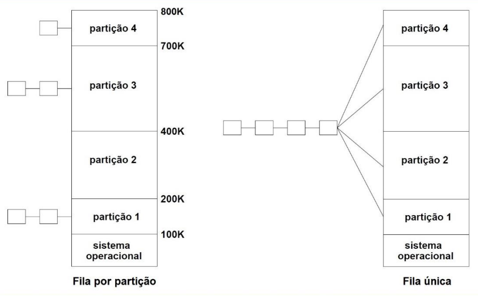

  

 

# Gerência de Memória

- [Introdução](#introdução)

## Introdução

A gerência de memória é uma das funções cruciais de um sistema operacional, responsável por decidir onde o código de um novo processo será colocado na memória. Essa decisão é feita pelo gerenciador de memória, que lê o código do processo de um arquivo armazenado em um dispositivo de entrada e saída, como um HD, e determina seu local na memória principal. O objetivo principal é otimizar o uso da memória, garantir a segurança e a eficiência do sistema, além de fornecer um ambiente estável para a execução dos processos.

Antes de explorar os detalhes da gerência de memória, é essencial entender o conceito de **memory leak**, ou **vazamento de memória**. Memory leaks são problemas que podem degradar o desempenho de um sistema ao longo do tempo e ocorrem em duas situações principais:

- **Blocos de memória alocados e inacessíveis**: Aqui, a memória foi alocada para o uso do programa, mas nenhum ponteiro aponta para ela. Esses blocos ficam fora do alcance tanto do programa quanto de outros processos, resultando em desperdício de memória.
- **Blocos de memória com dados inacessíveis**: Neste caso, os blocos de memória possuem dados que poderiam ser liberados, mas devido a alguma falha no código, ainda são referenciados, impedindo sua liberação e reutilização.

Os gerenciadores de memória podem ser classificados em duas categorias principais:

- **Gerenciadores que alternam processos entre memória e disco (swapping)**: Este método envolve a troca de processos entre a memória principal e o disco durante a execução. Quando a memória principal está cheia, alguns processos podem ser movidos para o disco para liberar espaço. Posteriormente, esses processos podem ser trazidos de volta à memória conforme necessário. Swapping é essencial para permitir a execução de múltiplos processos que, somados, exigem mais memória do que a disponível fisicamente.
- **Gerenciadores que não alternam processos**: Neste método, os processos permanecem na memória principal durante toda sua execução. Esse modelo é menos comum e menos eficiente, especialmente em sistemas modernos com múltiplos processos concorrentes.

## Multiprogramação com Partições Fixas

Multiprogramação com partições fixas é uma técnica de gerência de memória usada para organizar e alocar memória em sistemas com múltiplos processos executando simultaneamente. A ideia central é dividir a memória principal em um número fixo de partições, cada uma com um tamanho predefinido. Esses tamanhos podem variar, mas são determinados de antemão, geralmente durante a configuração do sistema operacional.

Quando o sistema operacional inicializa, ele divide a memória em N partições fixas. Cada partição pode acomodar exatamente um processo por vez. O tamanho das partições é crucial, pois determina a quantidade de memória que cada processo pode utilizar. Existem duas estratégias principais para alocar processos às partições:

- **Fila única**: Todos os processos aguardam em uma única fila e são alocados para a próxima partição disponível que seja grande o suficiente para acomodá-los. Embora seja mais simples de implementar, essa abordagem pode levar a um desperdício significativo de memória, pois não otimiza o uso das partições de acordo com o tamanho dos processos.
- **Filas múltiplas**: Cada partição tem sua própria fila. Os processos são alocados na fila da partição menor que pode acomodá-los. Isso pode reduzir o desperdício de memória, pois otimiza a alocação dos processos conforme o tamanho das partições.

Suponha um sistema com quatro partições de tamanhos variados, indo de 100 KB a 300 KB. No caso de múltiplas filas, quando um novo processo chega, ele é colocado na fila da partição menor que pode acomodar seu tamanho. Por exemplo, um processo de 100 KB seria colocado na fila da partição 1 ou 4, já um processo de 150 KB seria alocado na partição 2, já que uma partição de 100 KB é insuficiente.

  

Já uma estratégia de fila única, um processo de 80 KB poderia ser colocado em qualquer uma das quatro filas, dependendo da estratégia adotada. Uma estratégia mais eficiente o colocaria na fila da partição de 100 KB para minimizar o desperdício de memória.

A principal limitação da multiprogramação com partições fixas é o desperdício de memória. Como cada partição pode ser ocupada por apenas um processo, qualquer espaço não utilizado dentro da partição é desperdiçado. Este problema é conhecido como fragmentação interna. Além disso, se todos os processos forem menores do que a maior partição, a memória pode ser subutilizada.

Outra desvantagem é a inflexibilidade. Uma vez definidas, as partições não podem ser redimensionadas sem reinicializar o sistema. Isso pode ser problemático se a carga de trabalho mudar significativamente, exigindo diferentes tamanhos de partições para otimização.

A multiprogramação com partições fixas foi amplamente utilizada nos primeiros sistemas de computação. Um exemplo clássico é o sistema operacional OS/360 da IBM, que utilizava esta técnica e era conhecido como MFT (Multiprogramming with a Fixed number of Tasks). Embora considerado obsoleto nos sistemas modernos, este método é um ponto importante na evolução dos sistemas operacionais e ainda é relevante para entender os princípios básicos de gerência de memória.
