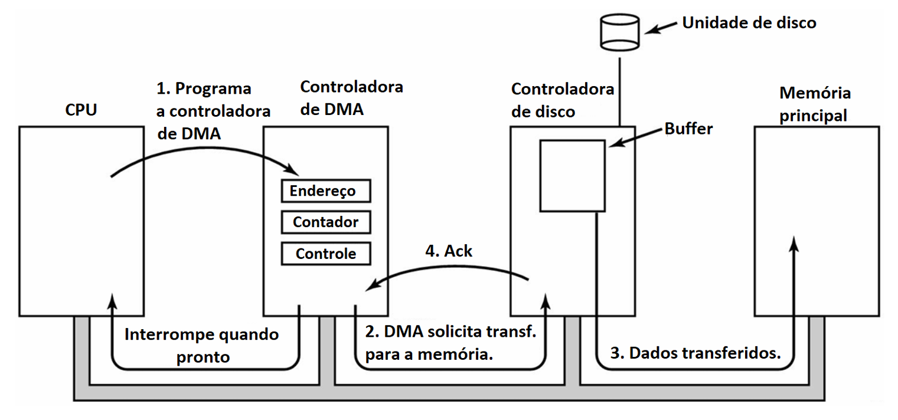

# Capítulo 4 – Gerenciamento de Entrada e Saída (E/S)

Uma das funções mais essenciais e onipresentes de um Sistema Operacional é o **gerenciamento de todos os dispositivos de Entrada e Saída (E/S)** conectados ao computador. Desde o teclado e o mouse que usamos para interagir, passando pelo monitor que exibe as informações, até os discos que armazenam nossos dados e as placas de rede que nos conectam ao mundo, todos esses periféricos são orquestrados pelo S.O. Esta orquestração envolve enviar comandos que os dispositivos "entendam", tratar as interrupções que eles geram para sinalizar eventos, lidar com os inevitáveis erros que podem ocorrer e, fundamentalmente, fornecer uma **interface simples, consistente e segura** para que os programas e usuários possam utilizar esses dispositivos sem precisar conhecer os detalhes complexos de seu funcionamento interno.

Neste capítulo, vamos mergulhar nos princípios, técnicas e mecanismos que os Sistemas Operacionais empregam para gerenciar o vasto e heterogêneo universo dos dispositivos de E/S, uma tarefa que é crucial para a funcionalidade e o desempenho de qualquer sistema computacional moderno.

## Princípios do Hardware e Software de E/S

Para gerenciar a E/S de forma eficaz, o Sistema Operacional interage com uma combinação de componentes de hardware e software. Compreender a estrutura e a relação entre esses componentes é o primeiro passo para desvendar o gerenciamento de E/S.

### A Estrutura dos Dispositivos de E/S: Controladoras e Componentes Mecânicos

De modo geral, as unidades de E/S consistem em duas partes distintas:

1. **Um componente mecânico:** É o dispositivo em si, a parte física com a qual interagimos ou que realiza a ação principal (o teclado com suas teclas, o disco com seus pratos magnéticos e braços de leitura, a impressora com seus cartuchos e rolos de papel).
2. **Um componente eletrônico:** É a parte "inteligente" do dispositivo, conhecida como **controladora** ou **adaptador**. A controladora pode ser uma placa de circuito dedicada (como uma placa de vídeo ou de rede), um chip integrado à placa-mãe, ou um circuito dentro do próprio dispositivo.

Essa separação é intencional e permite um projeto mais modular. A controladora atua como a interface entre o dispositivo e o barramento do sistema do computador (o caminho por onde os dados trafegam). Ela possui os circuitos necessários para receber comandos do S.O., controlar o componente mecânico para executar esses comandos e traduzir os sinais elétricos para um formato que o sistema possa entender. Geralmente, a controladora possui algum tipo de conector que permite a conexão física com o dispositivo em si.

### Categorizando os Dispositivos de E/S

Apesar da enorme variedade de dispositivos existentes, eles podem ser, de forma geral, classificados em duas grandes categorias com base em como manipulam os dados:

- **Dispositivos de Bloco (Block Devices):**
    - **Características:** Armazenam e transferem informações em unidades de tamanho fixo, chamadas **blocos**. Cada bloco possui um endereço único, o que permite que o S.O. leia ou escreva qualquer bloco de forma independente dos outros (acesso aleatório).
    - **Exemplos Típicos:** Discos rígidos (HDs), unidades de estado sólido (SSDs), pen drives, CD-ROMs, DVD-ROMs.
    - **Interação com o S.O.:** O **sistema de arquivos**, uma camada de software de alto nível do S.O., é responsável por organizar os dados em arquivos e diretórios e traduzir essas estruturas lógicas em operações sobre blocos abstratos. A interação de "baixo nível" com o hardware específico do disco, ou seja, traduzir o comando "leia o bloco 54321" para os sinais elétricos que a controladora do disco entende, fica a cargo do **driver de dispositivo**.
- **Dispositivos de Caractere (Character Devices):**
    - **Características:** Entregam ou aceitam um **fluxo (stream) de caracteres** (ou bytes), sem uma estrutura de blocos e sem o conceito de endereçamento. A informação é tratada como uma sequência contínua de dados. Operações de busca (como "vá para o byte X") geralmente não são possíveis ou não fazem sentido para esses dispositivos.
    - **Exemplos Típicos:** Impressoras (que aceitam um fluxo de dados de impressão), interfaces de rede (que enviam e recebem um fluxo de pacotes), teclados, mouses, portas seriais e a maioria dos terminais de texto.

Essa distinção é fundamental, pois o S.O. utiliza estratégias e interfaces diferentes para gerenciar cada tipo de dispositivo.

### Drivers de Dispositivo: A Ponte entre o S.O. e o Hardware

Como o Sistema Operacional pode lidar com a infinidade de modelos e fabricantes de discos, placas de vídeo, mouses, etc., cada um com suas particularidades? A solução para essa heterogeneidade é o **driver de dispositivo**.

Um driver de dispositivo é um software especializado, geralmente fornecido pelo fabricante do hardware e integrado ao kernel do S.O., que atua como uma **ponte de comunicação** ou um **tradutor**. Sua função é:

1. **Abstrair os Detalhes do Hardware:** O driver oculta os detalhes complexos e específicos do hardware da controladora do restante do Sistema Operacional.
2. **Traduzir Comandos:** Ele traduz os comandos genéricos e abstratos do S.O. (como "leia um bloco" ou "envie um caractere") para a sequência específica de instruções, escritas em registradores e operações que a controladora daquele hardware específico "entende".
3. **Traduzir Respostas:** Ele também faz o caminho inverso, traduzindo o estado e os dados retornados pela controladora para um formato padronizado que o S.O. possa utilizar.

Graças aos drivers, o S.O. pode interagir com uma "placa de rede genérica" ou um "disco genérico", e é o driver específico que se encarrega de fazer a comunicação com o hardware real da "Placa de Rede Modelo XYZ" ou do "SSD Marca ABC".

## Técnicas de Gerenciamento de E/S

A comunicação efetiva entre a CPU/S.O. e as controladoras de dispositivo é o cerne do gerenciamento de E/S. Ao longo do tempo, diversas técnicas foram desenvolvidas para realizar essa comunicação, cada uma representando um avanço em termos de eficiência e de como o tempo da CPU é utilizado.

### E/S Mapeada em Memória e E/S Programada (Polling)

Para que o Sistema Operacional possa se comunicar com uma controladora de dispositivo, ele precisa de um meio para enviar comandos e ler seu estado. Uma abordagem comum é a **E/S mapeada em memória (memory-mapped I/O)**.

Nesta técnica, cada controladora possui um conjunto de **registradores** (pequenas áreas de memória de alta velocidade) que são mapeados para o espaço de endereçamento de memória física do computador. Do ponto de vista da CPU, acessar esses registradores é como acessar uma posição normal da memória RAM. O Sistema Operacional pode, então, **escrever** nesses registradores para enviar comandos ao dispositivo (como "inicie uma leitura do disco", "envie estes dados para a impressora", "ligue o motor do dispositivo", etc.). Da mesma forma, ele pode **ler** desses registradores para obter o estado do dispositivo (como "operação concluída com sucesso", "dispositivo ocupado", "erro ocorrido", "novos dados de entrada disponíveis").

Geralmente, os registradores das controladoras contêm **bits de status** que indicam o estado atual da operação. Por exemplo, um bit de "pronto" pode ser `0` enquanto o dispositivo está ocupado e mudar para `1` quando a operação termina. A forma mais simples para a CPU descobrir se a operação foi concluída é verificar esse bit repetidamente.

Essa técnica de verificação contínua é chamada de **E/S Programada**, também conhecida como **consulta sequencial (polling)** ou, mais pejorativamente, **espera ativa (busy wait)**.

- **Funcionamento do Polling:** A CPU entra em um laço de repetição, lendo constantemente os bits de status da controladora e esperando que eles mudem para o valor desejado (por exemplo, indicando que a operação foi concluída). Enquanto está nesse laço, a CPU está totalmente dedicada a essa tarefa de verificação e não pode fazer nenhum outro trabalho útil.
- **Desvantagem:** É extremamente ineficiente. A CPU, o recurso mais rápido e valioso do sistema, fica "presa" em um laço de espera por um dispositivo de E/S, que é ordens de magnitude mais lento. É como se um chef de cozinha renomado ficasse parado em frente ao forno, olhando fixamente para um assado, por horas, sem fazer mais nada, apenas esperando que ele fique pronto.

Devido a essa ineficiência, a E/S Programada pura é raramente usada em sistemas modernos para operações longas, mas pode ser aceitável para transferências muito rápidas ou em sistemas embarcados muito simples. Para superar essa limitação, foi desenvolvido um mecanismo muito mais eficiente: as interrupções.

### E/S Orientada à Interrupção

Em vez de a CPU gastar seu tempo perguntando repetidamente ao dispositivo "Você já terminou?", a abordagem de **interrupções** inverte essa lógica: o dispositivo é quem avisa a CPU quando termina seu trabalho.

- **Funcionamento:**
    1. O S.O. inicia uma operação de E/S (por exemplo, escrevendo um comando nos registradores da controladora).
    2. Em vez de entrar em um laço de espera, o S.O. **suspende o processo que solicitou a E/S** (colocando-o no estado "Bloqueado") e **escala outro processo pronto para usar a CPU**. A CPU, portanto, continua a realizar trabalho útil.
    3. Quando o dispositivo de E/S conclui sua operação, a controladora envia um sinal elétrico para a CPU através de uma linha especial no barramento do sistema, chamada **linha de pedido de interrupção (IRQ – Interrupt ReQuest)**.
    4. Ao receber o sinal de interrupção, a CPU **interrompe imediatamente** o que quer que estivesse fazendo, salva seu contexto atual (o estado do processo que estava em execução) e desvia para executar um código especial do Sistema Operacional chamado **rotina de tratamento de interrupção (Interrupt Service Routine - ISR)**.
    5. A rotina de tratamento de interrupção determina qual dispositivo causou a interrupção, informa ao S.O. que a operação de E/S está concluída (verificando os bits de status da controladora para ver se tudo ocorreu bem ou se houve erro) e, crucialmente, **desbloqueia o processo original** que estava esperando pela E/S (movendo-o para o estado "Pronto").
    6. Após a conclusão da rotina de tratamento, a CPU restaura o contexto que havia salvo e continua a execução do processo que foi interrompido (ou de outro, se o escalonador decidir).

A maioria dos dispositivos de interface fornece uma saída lógica que corresponde ao bit de status "operação completa" ou "dados prontos" de um registrador. Essa saída é conectada a uma das linhas de IRQ do barramento do sistema, permitindo que o dispositivo "chame a atenção" da CPU. Em sistemas antigos, a atribuição de linhas de IRQ a dispositivos era frequentemente configurada manualmente por meio de chaves (jumpers) nas placas, o que era uma fonte comum de conflitos. Atualmente, a tecnologia **PnP (Plug and Play)** resolve isso de forma automática e dinâmica, evitando conflitos de IRQ.

É importante fazer uma observação sobre interrupções de software, também conhecidas como **traps**. Quando um processo rodando em **modo usuário** tenta executar uma **instrução privilegiada** (uma instrução que só o kernel do S.O. pode executar), o hardware detecta essa tentativa ilegal e automaticamente gera uma interrupção (um trap), transferindo o controle para o Sistema Operacional. O S.O. pode então lidar com a situação, geralmente terminando o processo que cometeu a violação. Isso mostra como o mecanismo de interrupção é fundamental não apenas para a E/S, mas também para a proteção e segurança do sistema.

### Acesso Direto à Memória (Direct Memory Access - DMA)

A E/S orientada à interrupção resolve o problema da espera ativa, liberando a CPU para fazer outro trabalho enquanto a operação de E/S está em andamento. No entanto, em operações que envolvem a transferência de grandes volumes de dados (como ler um arquivo grande do disco ou receber um vídeo pela rede), a CPU ainda estaria fortemente envolvida, pois, no modelo de interrupção simples, é ela quem move os dados, byte por byte ou palavra por palavra, entre a controladora de E/S e a memória principal.

Para liberar a CPU também dessa tarefa repetitiva de transferência de dados, foi desenvolvido o esquema de **Acesso Direto à Memória (DMA)**. Para que o DMA funcione, o sistema precisa de um hardware especial chamado **controladora de DMA (DMAC)**. Essa controladora, que pode estar integrada à controladora de disco, ser um chip separado na placa-mãe ou, como é mais comum, ser um componente central da placa-mãe para gerenciar transferências de diversos dispositivos, tem uma capacidade especial: ela pode acessar o barramento do sistema e transferir dados diretamente entre um dispositivo de E/S e a memória principal, **independentemente da CPU**.

A figura abaixo ilustra um sistema com uma controladora de DMA:

  

O processo de uma transferência de E/S usando DMA ocorre da seguinte forma:

1. **Programação do DMA pela CPU:** A CPU inicia a transferência programando a controladora de DMA. Ela informa ao DMA:
    - O endereço do dispositivo de E/S.
    - A operação a ser realizada (leitura ou escrita).
    - O endereço inicial na memória principal de onde os dados devem ser lidos ou para onde devem ser escritos.
    - O número de bytes a serem transferidos.
2. **CPU Livre para Outras Tarefas:** Uma vez que a controladora de DMA foi programada, a CPU está livre. Ela pode continuar a executar outros processos enquanto a transferência de dados ocorre em paralelo.
3. **Transferência Realizada pelo DMA:** A controladora de DMA assume o controle do barramento do sistema e transfere o bloco de dados diretamente do dispositivo para a memória (em uma operação de leitura) ou da memória para o dispositivo (em uma operação de escrita), sem qualquer intervenção da CPU.
4. **Interrupção de Conclusão:** Quando toda a transferência de dados está completa, a controladora de DMA envia uma **única interrupção** para a CPU, sinalizando que a operação terminou.
5. **Tratamento da Interrupção pela CPU:** A CPU trata a interrupção, e o S.O. pode então tomar as ações necessárias (como desbloquear o processo que solicitou a transferência).

Com o DMA, a CPU é interrompida apenas uma vez por bloco de dados transferido, em vez de uma vez por byte ou palavra. Isso reduz drasticamente a sobrecarga sobre a CPU para operações de E/S de grande volume, melhorando significativamente o desempenho geral do sistema.

### Spooling (Simultaneous Peripheral Operations On-line)

A técnica de **spooling** é uma forma de gerenciar a E/S que visa aumentar a eficiência do sistema ao desacoplar a velocidade da CPU da velocidade dos dispositivos periféricos, especialmente os lentos como impressoras. A ideia central é colocar jobs (trabalhos) que precisam de um dispositivo de E/S em uma área de armazenamento temporário, um **buffer**, que geralmente reside no disco. O dispositivo pode então acessar esses jobs a partir do buffer em seu próprio ritmo, quando estiver preparado.

O exemplo mais clássico e conhecido é o **spool de impressão**:

- **Funcionamento:** Quando um usuário ou uma aplicação envia um documento para impressão, o S.O. não envia os dados diretamente para a impressora. Em vez disso, ele salva o trabalho de impressão em uma área especial no disco, conhecida como **spool de impressão**.
- **Liberação Rápida:** Como a escrita no disco é muito mais rápida do que a impressão, a aplicação que solicitou a impressão é liberada quase que instantaneamente para continuar suas outras tarefas.
- **Gerenciamento da Fila:** Um processo do sistema, o **spooler de impressão** (um daemon ou serviço), monitora essa área no disco. Ele gerencia uma fila de todos os trabalhos de impressão pendentes.
- **Envio para a Impressora:** O spooler envia os trabalhos da fila para a impressora, um de cada vez, na ordem em que foram recebidos (ou de acordo com prioridades), assim que a impressora fica disponível.

**Vantagens do Spooling:**

- **Evita Conflitos:** Garante que os trabalhos de impressão de diferentes usuários ou aplicações não se misturem, pois são processados sequencialmente a partir da fila.
- **Eficiência para o Usuário:** O usuário não precisa esperar o término da impressão para voltar a usar o computador.
- **Gerenciamento Centralizado:** Permite que os trabalhos na fila sejam gerenciados (pausados, cancelados, reordenados) por um administrador ou pelo próprio usuário.

O spooling é um exemplo poderoso de como o S.O. pode usar o disco como um grande buffer para mediar a interação entre componentes de diferentes velocidades, otimizando a utilização dos recursos e melhorando a experiência do usuário.

## Considerações Finais

Neste capítulo, desvendamos o complexo e vital papel do Sistema Operacional no **gerenciamento de Entrada e Saída**. Vimos que o S.O. atua como um maestro, orquestrando a interação entre a CPU e uma vasta gama de dispositivos, desde os de **bloco**, como discos, até os de **caractere**, como teclados e impressoras. A comunicação é viabilizada por uma arquitetura que combina o hardware das **controladoras** com o software dos **drivers de dispositivo**, que traduzem comandos genéricos em instruções específicas para cada hardware.

Exploramos a evolução das técnicas de E/S, começando pela ineficiente **E/S Programada (Polling)**, onde a CPU gasta seu tempo em espera ativa. Avançamos para a **E/S orientada à interrupção**, um salto de eficiência que libera a CPU para realizar outras tarefas enquanto aguarda o dispositivo sinalizar a conclusão de seu trabalho via **IRQ**. Finalmente, analisamos o **Acesso Direto à Memória (DMA)**, a técnica mais avançada, que delega a tarefa de transferência de grandes volumes de dados a uma controladora especializada, minimizando a intervenção da CPU a apenas um comando inicial e uma interrupção final.

Além disso, discutimos conceitos complementares como o **spooling**, que utiliza o disco como um buffer intermediário para gerenciar o acesso a dispositivos lentos e compartilhados, como impressoras, aumentando a eficiência e a capacidade de gerenciamento do sistema.

Fica claro que o gerenciamento de E/S é uma área de compromissos: entre a simplicidade de implementação e a eficiência do uso da CPU, entre a abstração fornecida ao programador e o controle direto sobre o hardware. As técnicas que estudamos não são mutuamente exclusivas e, em um sistema operacional moderno, coexistem e são aplicadas de acordo com a natureza do dispositivo e da operação. A compreensão desses mecanismos é fundamental para entendermos como nossos computadores conseguem lidar com tantas tarefas de E/S simultâneas, mantendo-se responsivos e eficientes.