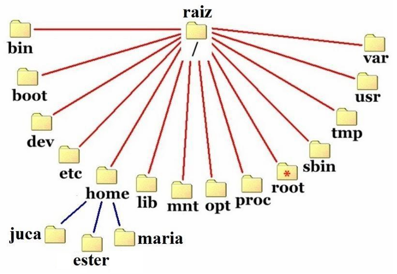

# Capítulo 5 – Gerenciamento de Armazenamento (Sistemas de Arquivos)

Após explorarmos como o Sistema Operacional gerencia os processos, a memória principal e os dispositivos de Entrada/Saída, chegamos a um pilar igualmente fundamental da computação moderna: o **armazenamento de informações a longo prazo**. Para que um sistema computacional seja verdadeiramente útil, ele precisa atender a três requisitos essenciais no que tange ao armazenamento de dados:

1. **Capacidade de Armazenar Grandes Volumes de Informações:** O sistema deve ser capaz de guardar uma quantidade de dados muito superior à capacidade da memória principal (RAM).
2. **Persistência da Informação:** As informações devem sobreviver ao término dos processos que as criaram ou utilizaram. Elas não podem desaparecer quando um programa é fechado ou quando o computador é desligado.
3. **Acesso Concorrente:** Múltiplos processos devem ser capazes de acessar as informações de forma controlada e, muitas vezes, simultânea. Pense, por exemplo, em vários programas ou usuários acessando o mesmo banco de dados.

A solução universalmente adotada para atender a esses requisitos é o armazenamento de informações em **mídias de armazenamento não volátil** (como Discos Rígidos – HDs, Unidades de Estado Sólido – SSDs, entre outras), organizadas em unidades lógicas que chamamos de **arquivos**. Os arquivos são o mecanismo de abstração que nos permite guardar dados de forma persistente. Idealmente, um arquivo só deve "sumir" do sistema se for explicitamente excluído por seu criador ou por um administrador com as devidas permissões.

A complexa tarefa de gerenciar os arquivos – sua estrutura, nomenclatura, localização, métodos de acesso, segurança e a organização do espaço físico na mídia de armazenamento – é realizada por um componente essencial do Sistema Operacional: o **sistema de arquivos**.

Enquanto o usuário final interage com os arquivos através de conceitos de alto nível (ícones, nomes, pastas, tamanhos, tipos, proprietários), os projetistas de sistemas de arquivos precisam se preocupar com aspectos técnicos muito mais profundos. Eles devem decidir, por exemplo, se utilizarão mapas de bits, listas encadeadas ou outras estruturas de dados complexas para monitorar o espaço livre no disco, como os dados serão fisicamente dispostos na mídia e como garantir a integridade e a recuperação desses dados em caso de falhas.

Nosso foco neste capítulo será nos conceitos gerais e fundamentais que regem os sistemas de arquivos, sem nos aprofundarmos excessivamente nos detalhes de implementação de sistemas específicos como FAT32, NTFS ou ext4, que são frequentemente objeto de estudo em cursos mais especializados. No entanto, é importante conhecer quais sistemas de arquivos são nativos dos sistemas operacionais mais conhecidos, pois esse conhecimento básico é frequentemente cobrado em avaliações e concursos.

- **Sistemas Microsoft Windows:**
    - **Legado (MS-DOS até Windows 98):** A família FAT (File Allocation Table), incluindo FAT12, FAT16 e FAT32.
    - **Modernos (a partir do Windows NT):** Embora reconheçam e suportem a família FAT (especialmente para dispositivos removíveis), o sistema de arquivos nativo e principal é o **NTFS (New Technology File System)**. Versões mais recentes também introduziram o **ReFS (Resilient File System)**, focado em servidores e na integridade de dados.

- **Sistemas Linux:**
    - Possuem uma vasta gama de sistemas de arquivos suportados, mas os mais conhecidos e comumente usados são da família **ext (Extended File System)**, como **ext2, ext3 e ext4**. Outros sistemas de arquivos nativos importantes incluem JFS, XFS e Btrfs.

## A Natureza dos Arquivos: Nomenclatura, Tipos e Atributos

Os arquivos são, em essência, um mecanismo de **abstração**. Para o usuário, um arquivo é um ícone em uma pasta com um nome como "Relatorio_Anual.docx". Para o sistema de arquivos, no entanto, esse mesmo arquivo é uma sequência de milhares ou milhões de bits, organizados em blocos que podem estar dispostos de forma contígua ou fragmentada em diferentes locais de uma mídia de armazenamento. O sistema de arquivos é o responsável por criar e manter essa abstração, permitindo-nos interagir com os dados de forma lógica e organizada.

### Nomenclatura e Extensões de Arquivos

A forma como identificamos e nos referimos a um arquivo é através de seu **nome**. A escolha de um nome de arquivo não é totalmente livre; ela é regida por regras impostas pelo sistema de arquivos em uso. Essas regras podem ditar o tamanho máximo do nome, os caracteres permitidos e se há distinção entre letras maiúsculas e minúsculas (case sensitivity).

- **Case Sensitivity:**

    - Em sistemas **UNIX e seus derivados (como o Linux)**, os nomes de arquivo são case-sensitive. Isso significa que `relatorio.txt`, `Relatorio.txt` e `RELATORIO.TXT` são considerados três arquivos completamente distintos e podem coexistir no mesmo diretório.
    - O antigo sistema **MS-DOS** era case-insensitive, tratando os três nomes acima como se fossem o mesmo arquivo.
    - O **Windows**, sucessor do MS-DOS, adota uma abordagem intermediária. Seu sistema de arquivos nativo, o **NTFS**, é tecnicamente case-sensitive em seu núcleo (preservando as maiúsculas e minúsculas como foram digitadas), mas o subsistema que interage com o usuário e a maioria das aplicações o trata como case-insensitive por padrão, para manter a compatibilidade com o comportamento legado. Portanto, no Windows Explorer, você não pode criar `relatorio.txt` e `Relatorio.txt` na mesma pasta.

**Estrutura do Nome e Extensões:** Muitos sistemas operacionais suportam nomes de arquivo compostos por duas partes, separadas por um ponto: o nome propriamente dito e a **extensão**. A extensão, geralmente com três ou quatro caracteres, serve como uma convenção para indicar o tipo ou o formato do conteúdo do arquivo (por exemplo, `.jpg` indica uma imagem no formato JPEG, `.mp3` um arquivo de áudio, e `.pdf` um documento portátil). É importante notar que um usuário pode alterar a extensão de um arquivo, o que pode levar a uma indicação incorreta de seu tipo.

- No **MS-DOS**, a regra era rígida: um nome de 1 a 8 caracteres, seguido por uma extensão opcional de 1 a 3 caracteres (o famoso "formato 8.3"). 
- No **UNIX/Linux**, as extensões são puramente uma **convenção**, não sendo impostas ou interpretadas de forma especial pelo sistema operacional em si. Um arquivo pode ter qualquer nome, não ter extensão, ou até mesmo ter múltiplas extensões (ex: `backup_completo.tar.gz`), que são apenas parte do nome do arquivo.
- No **Windows**, a extensão tem um significado mais forte e funcional. O sistema operacional utiliza as extensões para associar tipos de arquivo a programas específicos. Por exemplo, ao dar um duplo clique em um arquivo com a extensão `.xlsx`, o Windows sabe que deve chamar o Microsoft Excel para abrir esse arquivo. Por padrão, o Windows Explorer costuma ocultar as extensões de tipos de arquivo conhecidos, mas essa configuração pode ser alterada pelo usuário para visualizá-las. A imagem abaixo mostra um exemplo de um arquivo Word, cuja extensão `.docx` está visível.

  

### Tipos de Arquivos

Os sistemas operacionais geralmente suportam e reconhecem diferentes tipos de arquivos, cada um com uma finalidade específica. Vamos focar nos tipos mais comuns:

- **Arquivos Normais (ou Regulares):** São os arquivos que contêm informações do usuário. Podem ser arquivos de texto, planilhas, imagens, vídeos, músicas, programas executáveis, etc. Para o S.O., na maioria das vezes, o conteúdo de um arquivo normal é apenas uma sequência de bytes.
- **Diretórios (ou Pastas):** São arquivos especiais mantidos pelo sistema para organizar a estrutura do sistema de arquivos. Eles contêm uma lista de outros arquivos e/ou subdiretórios. O Windows prefere o termo "pasta", mas o conceito técnico é o mesmo. Veremos mais detalhes sobre diretórios adiante.
- **Arquivos Especiais de Caractere (Character Special Files):** Utilizados em sistemas como o UNIX para modelar dispositivos de E/S seriais, que lidam com um fluxo de caracteres, como terminais (teclado/monitor), impressoras e interfaces de rede.
- **Arquivos Especiais de Bloco (Block Special Files):** Também comuns em sistemas UNIX, são utilizados para modelar dispositivos de acesso a blocos, como discos rígidos e SSDs.

Outros sistemas podem ter tipos ainda mais específicos, como arquivos de metadados, links simbólicos, pipes nomeados, etc., cada um servindo a um propósito particular na arquitetura do S.O.

### Métodos de Acesso a Arquivos

A forma como os dados dentro de um arquivo são lidos também é uma característica importante gerenciada pelo S.O.

- **Acesso Sequencial:** Este é o método mais simples. Os dados no arquivo são processados em ordem, um registro ou byte após o outro, desde o início até o fim. É o modelo de acesso predominante e era especialmente conveniente quando fitas magnéticas eram o principal meio de armazenamento. Em um arquivo de acesso sequencial, a operação básica é `ler_próximo` ou `escrever_próximo`, e geralmente há uma operação para "rebobinar" (voltar ao início do arquivo).
- **Acesso Aleatório (ou Direto):** Com o advento dos discos, tornou-se possível acessar os dados de um arquivo fora de ordem. Um arquivo de acesso aleatório pode ser visto como uma sequência de blocos ou registros numerados. Um processo pode ler ou escrever em qualquer bloco diretamente, sem precisar passar pelos blocos anteriores. Isso é feito através de uma operação de **busca (seek)**, que posiciona um ponteiro de arquivo em um local específico antes da operação de leitura ou escrita. O acesso aleatório é fundamental para aplicações complexas, como sistemas gerenciadores de bancos de dados (SGBDs), que precisam acessar registros específicos rapidamente.

### Atributos de Arquivos (Metadados)

Além do nome e de seu conteúdo de dados, cada arquivo possui um conjunto de informações adicionais associadas a ele, conhecidas como **atributos do arquivo** ou **metadados** (dados sobre os dados). Esses atributos são mantidos pelo sistema de arquivos e fornecem informações de controle e gerenciamento.

Os atributos específicos podem variar de um sistema de arquivos para outro. Por isso, ao copiar um arquivo de uma partição NTFS (Windows) para uma FAT32 (pen drive), por exemplo, algumas informações de permissão podem ser perdidas. A tabela a seguir mostra alguns exemplos comuns de atributos de arquivo e seus significados:

|Atributo|Significado|
|---|---|
|**Proteção**|Define quem pode acessar o arquivo e de que maneira (leitura, escrita, execução).|
|**Senha**|Uma senha para acesso ao arquivo (menos comum em sistemas modernos, que preferem controle por permissões).|
|**Criador**|O ID (identificação) do usuário que criou o arquivo.|
|**Proprietário**|O ID do proprietário atual do arquivo (pode ser diferente do criador).|
|**Flag Somente Leitura**|Um bit que, se ativado (1), impede que o arquivo seja modificado. Se desativado (0), permite leitura/escrita.|
|**Flag Oculto**|Um bit que indica se o arquivo deve ser exibido em listagens de diretório normais.|
|**Flag de Sistema**|Um bit que marca o arquivo como sendo um arquivo crítico do sistema operacional.|
|**Flag de Arquivamento**|Usado por softwares de backup. O S.O. ativa este bit (1) sempre que o arquivo é modificado. O software de backup, ao salvar o arquivo, o desativa (0).|
|**Tamanho Atual**|O tamanho do arquivo em bytes.|
|**Tamanho Máximo**|O tamanho máximo que o arquivo pode atingir (usado em alguns sistemas).|
|**Tempo da Criação**|A data e a hora exatas em que o arquivo foi criado.|
|**Tempo do Último Acesso**|A data e a hora em que o arquivo foi lido pela última vez.|
|**Tempo da Última Alteração**|A data e a hora em que o conteúdo do arquivo foi modificado pela última vez.|

### Operações sobre Arquivos

Para que os programas possam manipular arquivos, o Sistema Operacional fornece um conjunto de **chamadas de sistema** específicas. Quando um programa precisa realizar uma operação em um arquivo, ele primeiro precisa "abrir" o arquivo. A chamada de sistema de abertura, se bem-sucedida, retorna um valor, geralmente um número inteiro, chamado **descritor de arquivo (file descriptor)** no mundo Unix/Linux, ou **handle** no mundo Windows.

Esse descritor de arquivo é um pequeno identificador que o processo usará em todas as chamadas de sistema subsequentes para se referir àquele arquivo específico já aberto. Para o sistema operacional, `arq` não significa nada; ele associa o descritor de arquivo (ex: o número `1386`) a uma entrada em uma tabela interna que contém todas as informações sobre o arquivo aberto (como sua localização no disco e a posição atual do ponteiro de leitura/escrita).

Algumas das chamadas de sistema mais comuns para operações sobre arquivos são:

- **`Create`:** Cria um novo arquivo, sem dados, e seus atributos iniciais.
- **`Delete`:** Remove um arquivo do sistema de arquivos, liberando o espaço em disco que ele ocupava.
- **`Open`:** Abre um arquivo existente para uso. Geralmente especifica o modo de abertura (leitura, escrita, ambos). Retorna um descritor de arquivo.
- **`Close`:** Fecha um arquivo previamente aberto. Isso é importante para que o S.O. possa liberar os recursos associados ao arquivo aberto (como a entrada na tabela de arquivos abertos) e garantir que quaisquer dados em buffers sejam escritos no disco.
- **`Read`:** Lê uma quantidade de dados de um arquivo, geralmente a partir da posição corrente do ponteiro de arquivo, e os coloca em um buffer na memória do processo.
- **`Write`:** Escreve dados de um buffer na memória do processo para o arquivo, geralmente a partir da posição corrente do ponteiro de arquivo.
- **`Append`:** Uma forma especial de escrita que adiciona dados sempre ao final do arquivo.
- **`Seek`:** Em arquivos de acesso aleatório, reposiciona o ponteiro de arquivo para um local específico, para que a próxima operação de `Read` ou `Write` ocorra a partir daquele ponto.
- **`Get/Set Attributes`:** Lê ou modifica os metadados (atributos) do arquivo.
- **`Rename`:** Altera o nome de um arquivo.

Essas operações formam a API (Interface de Programação de Aplicações) fundamental que o S.O. oferece para a manipulação de arquivos.

## A Organização Hierárquica: Diretórios

Para organizar os milhares ou milhões de arquivos que podem existir em um disco, os sistemas de arquivos utilizam uma estrutura de **diretórios** (ou **pastas**, no jargão popularizado pelo Windows). Um diretório, como vimos, é um tipo de arquivo especializado cujo propósito é agrupar outros arquivos e/ou outros diretórios (subdiretórios). Essa capacidade de aninhar diretórios dentro de outros cria uma estrutura de árvore hierárquica, que é a base da organização da maioria dos sistemas de arquivos modernos.

### Estrutura de uma Entrada de Diretório

Um diretório contém uma série de **entradas**, onde cada entrada corresponde a um arquivo ou subdiretório contido nele. A forma como as informações são armazenadas em uma entrada de diretório pode variar:

1. **Entrada Completa:** Uma abordagem é cada entrada de diretório conter todas as informações sobre o arquivo, incluindo seu nome, todos os seus atributos e, crucialmente, os endereços dos blocos de disco onde os dados do arquivo estão armazenados.
 

  

2. **Entrada com Ponteiro (Modelo I-node):** Outra abordagem, mais comum em sistemas como o UNIX/Linux, é a entrada de diretório ser mais simples, contendo apenas o nome do arquivo e um **ponteiro** (ou um número de índice) para outra estrutura de dados separada (como um **i-node**, que veremos adiante). Essa estrutura externa é que contém todos os atributos e os endereços de disco do arquivo.

  

A segunda abordagem (com ponteiros) oferece vantagens como permitir que vários nomes de arquivo em diferentes diretórios apontem para o mesmo arquivo físico (hard links) e simplificar a estrutura do diretório em si.

Quando um programa realiza uma chamada de sistema para abrir um arquivo (ex: `open("documento.txt")`), o Sistema Operacional percorre a estrutura de diretórios para encontrar a entrada correspondente ao nome do arquivo. Uma vez encontrada, ele extrai os atributos e os endereços de disco (seja diretamente da entrada ou da estrutura apontada por ela) e os carrega em uma tabela na memória principal. A partir desse momento, todas as operações subsequentes sobre o arquivo (como `read` e `write`) utilizarão essas informações que estão na memória para um acesso mais rápido.

### Hierarquia de Diretórios e Caminhos de Acesso

Com exceção de sistemas muito simples que poderiam ter um **sistema de diretório único** (apenas um diretório raiz onde todos os arquivos residem, o que é impraticável para qualquer uso moderno), a maioria dos sistemas de arquivos implementa uma **hierarquia de diretórios**, permitindo que diretórios contenham subdiretórios, formando uma estrutura de árvore.

Essa hierarquia é essencial para:

- **Organização:** Permitir que os usuários e o sistema organizem os arquivos de forma lógica (por projeto, por tipo, por usuário, etc.).
- **Segurança:** Separar arquivos de diferentes usuários, aplicando permissões de acesso distintas a diferentes ramos da árvore de diretórios.
- **Evitar Colisão de Nomes:** Como não é possível haver dois arquivos com o mesmo nome no **mesmo** diretório, a estrutura hierárquica permite que arquivos com nomes idênticos existam em diretórios diferentes.

A figura abaixo ilustra uma hierarquia de diretórios típica do sistema operacional Linux. O diretório no topo da hierarquia é o **diretório raiz**, representado pelo caractere **`/`**. Abaixo dele, encontramos outros diretórios do sistema (como `/home`, `/bin`, `/etc`). Dentro de `/home`, pode haver um diretório para cada usuário (como `/home/ester`).

Se um arquivo chamado `abc` for criado dentro do diretório `/home/estrategia`, um outro arquivo com o mesmo nome `abc` só poderá ser criado em outro diretório.

  

**Especificando Caminhos de Arquivo (Pathnames):**

Para localizar um arquivo dentro dessa hierarquia, utilizamos um **caminho (path)**. Existem duas formas de especificar um caminho:

1. **Caminho Absoluto (Absolute Path):** Descreve a localização do arquivo a partir do diretório raiz. Ele fornece a sequência completa de diretórios desde o topo da árvore até o arquivo.
    - **Exemplo em Linux/UNIX:** `/home/ester/abc`
    
2. **Caminho Relativo (Relative Path):** Descreve a localização do arquivo a partir do **diretório de trabalho atual (current working directory)**. O diretório de trabalho é o diretório "onde o usuário ou processo se encontra" no momento.
    - **Exemplo:** Se o diretório de trabalho atual for `/home/ester`, o mesmo arquivo `abc` pode ser referenciado simplesmente como `abc`, sem a necessidade de especificar o caminho completo desde a raiz.

**Diferenças de Sintaxe entre Windows e Linux:**

É extremamente importante conhecer as diferenças na sintaxe dos caminhos entre os sistemas operacionais Windows e os sistemas baseados em UNIX (como o Linux), pois isso é frequentemente tema de questões.

- **Separador de Diretórios:**
    - **Windows:** Usa a barra invertida (`\`). Exemplo: `C:\Users\Ester\Documentos\abc.txt`
    - **Linux/UNIX:** Usa a barra normal (`/`). Exemplo: `/home/ester/documentos/abc.txt`
- **Conceito de Raiz e Volumes:**
    - **Linux/UNIX:** Possui um único diretório raiz (`/`) e todos os dispositivos de armazenamento (partições, discos) são "montados" em pontos dentro dessa única árvore de diretórios.
    - **Windows:** Não possui uma única raiz para todo o sistema. Cada volume ou partição de disco é representado por uma **letra de unidade** seguida de dois pontos (ex: `C:`, `D:`), e cada um desses volumes tem seu próprio diretório raiz (`\`). Portanto, um caminho absoluto no Windows sempre começa com uma letra de unidade. O exemplo do caminho absoluto que vimos seria, de fato, algo como `C:\home\estrategia\abc` (supondo que o diretório `home` esteja no volume `C:`).

Saber essas diferenças é crucial para a correta interpretação e formulação de caminhos em diferentes ambientes operacionais.

## Implementação do Sistema de Arquivos: A Visão do Disco

Agora, vamos mergulhar na perspectiva do projetista do sistema de arquivos e entender como a estrutura lógica de arquivos e diretórios é implementada fisicamente nos dispositivos de armazenamento, como os discos.

Normalmente, os sistemas de arquivos são armazenados em discos, e a maioria dos discos pode ser dividida em uma ou mais **partições** (também chamadas de **volumes**). Cada partição pode conter seu próprio sistema de arquivos, e eles podem ser de tipos diferentes. Por exemplo, em um mesmo disco, você pode ter uma partição formatada com NTFS para o Windows e outra formatada com ext4 para o Linux.

### Layout Físico do Disco e o MBR

O primeiro setor de um disco (Setor 0) é um local especial chamado **MBR (Master Boot Record)**. Ele é crucial para a inicialização (boot) do computador. O MBR contém:

1. **Código de Inicialização:** Um pequeno programa que a BIOS (ou UEFI em modo de compatibilidade) do computador lê e executa ao ligar a máquina.
2. **Tabela de Partições:** Uma pequena tabela que descreve as partições primárias do disco, contendo informações como o endereço de início e o endereço final de cada partição, seu tipo e se uma delas está marcada como "ativa" (bootável).

A figura a seguir mostra uma representação hexadecimal do conteúdo de um MBR (512 bytes). Observe a assinatura `0x55AA` no final, que é uma marca padrão, e a área anterior a ela, onde a tabela de partições reside. Neste exemplo, podemos inferir a existência de duas partições configuradas, enquanto as outras duas entradas da tabela estão zeradas.

  

**Figura 5.5 – Conteúdo Hexadecimal de um Master Boot Record (MBR)**

Quando o computador é ligado, a BIOS executa o código do MBR. Este código, por sua vez, examina a tabela de partições, localiza a partição marcada como ativa, lê o primeiro bloco dessa partição – chamado **bloco de inicialização (boot block)** – e o executa. O programa contido no bloco de inicialização é o responsável por carregar o Sistema Operacional que reside naquela partição. É esse mecanismo que permite ter múltiplos sistemas operacionais instalados no mesmo disco (dual boot ou multi-boot), cada um em sua própria partição com seu respectivo sistema de arquivos.

A Figura 5.6, adaptada do livro de Tanenbaum, mostra um layout de disco possível, com o MBR e quatro slots de partição. Em destaque, a segunda partição contém um sistema de arquivos Linux, com seu próprio bloco de inicialização.

**Figura 5.6 – Layout de um Disco com MBR e Quatro Partições (destaque para partição Linux)**

Cada partição que contém um sistema de arquivos possui sua própria estrutura interna, que geralmente inclui:

- **Bloco de Inicialização (Boot Block):** Contém o código para carregar o S.O. daquela partição.
    
- **Superbloco (Superblock):** Contém parâmetros críticos sobre o sistema de arquivos, como o número de blocos, o tamanho do bloco, ponteiros para blocos de gerenciamento de espaço livre, etc.
    
- **Gerenciamento de Espaço Livre:** Estruturas de dados (como mapa de bits ou lista de blocos livres) para rastrear quais blocos da partição estão em uso.
    
- **I-nodes (ou estrutura equivalente):** Uma área para armazenar os metadados dos arquivos.
    
- **Diretório Raiz:** O ponto de partida da hierarquia de diretórios da partição.
    
- **Blocos de Dados:** A maior parte da partição, onde o conteúdo real dos arquivos e diretórios é armazenado.
    

## Métodos de Alocação de Espaço em Disco

Uma das questões mais importantes na implementação de um sistema de arquivos é determinar como os blocos de dados de um arquivo são alocados no disco. A escolha do método de alocação tem um impacto profundo no desempenho, na eficiência do uso do espaço e na complexidade do sistema de arquivos. Vamos analisar os métodos mais comuns.

### Alocação Contígua

Este é o método mais simples. Cada arquivo é armazenado como um **bloco contíguo de setores no disco**.

- **Funcionamento:** Para armazenar um arquivo, o sistema de arquivos precisa encontrar uma sequência de blocos livres consecutivos no disco que seja grande o suficiente para conter o arquivo inteiro. Por exemplo, em uma partição formatada com blocos de 4 KB, um arquivo de 40 KB precisaria de 10 blocos consecutivos. A entrada de diretório para o arquivo precisa armazenar apenas duas informações: o endereço do primeiro bloco e o tamanho do arquivo (em número de blocos).
    
- **Vantagens:**
    
    - **Simplicidade:** A implementação é muito simples.
        
    - **Desempenho de Leitura:** O desempenho para leitura sequencial é excelente. Como todos os blocos do arquivo estão fisicamente próximos, a cabeça de leitura/escrita do disco pode ler o arquivo inteiro em uma única operação, com movimento mínimo (baixo tempo de busca - seek time).
        
- **Desvantagens:**
    
    - **Fragmentação Externa:** Esta é a principal desvantagem. Com o tempo, à medida que os arquivos são criados, modificados e excluídos, o disco se torna fragmentado. Lacunas (espaços livres) de diferentes tamanhos aparecem entre os arquivos alocados. Pode chegar um ponto em que há espaço livre total suficiente para um novo arquivo, mas nenhum espaço livre _contíguo_ grande o suficiente para alocá-lo.
        
    - **Crescimento do Arquivo:** É difícil para um arquivo crescer após sua criação, pois o espaço contíguo após ele pode já estar ocupado por outro arquivo.
        
    - **Solução para Fragmentação:** A única solução é realizar uma **compactação do disco** (desfragmentação), que "empurra" todos os arquivos para uma extremidade do disco para consolidar os espaços livres. No entanto, como já vimos, esta é uma operação extremamente lenta e custosa.
        

A Figura 5.7 ilustra a alocação contígua, onde os arquivos A, B, C e D ocupam sequências de blocos consecutivos no disco.

**Figura 5.7 – Exemplo de Alocação Contígua de Arquivos no Disco**

### Alocação Encadeada (Linked Allocation)

Para superar o problema da fragmentação externa da alocação contígua, a alocação encadeada armazena cada arquivo como uma **lista encadeada de blocos de disco**.

- **Funcionamento:** Os blocos que compõem um arquivo podem estar espalhados por qualquer lugar no disco. Cada bloco contém, além dos dados do arquivo, um **ponteiro** para o próximo bloco da sequência. A entrada de diretório para o arquivo precisa armazenar apenas o endereço do primeiro bloco. O restante dos blocos é encontrado seguindo a cadeia de ponteiros de bloco em bloco, até que um ponteiro especial de fim de arquivo seja encontrado.
    
- **Vantagens:**
    
    - **Sem Fragmentação Externa:** Qualquer bloco livre no disco pode ser utilizado, eliminando completamente a fragmentação externa.
        
    - **Crescimento Fácil:** Um arquivo pode crescer facilmente, bastando alocar um novo bloco livre em qualquer lugar do disco e encadeá-lo ao final da lista.
        
- **Desvantagens:**
    
    - **Acesso Aleatório Lento:** O acesso aleatório (ir diretamente para o bloco `N` de um arquivo) é muito ineficiente. Para chegar ao bloco `N`, é preciso percorrer a lista encadeada desde o primeiro bloco, lendo os `N-1` blocos anteriores apenas para encontrar seus ponteiros.
        
    - **Sobrecarga de Ponteiros:** O ponteiro dentro de cada bloco ocupa espaço que poderia ser usado para dados. Isso faz com que o volume de armazenamento útil em um bloco não seja mais uma potência de 2 (ex: em um bloco de 512 bytes, talvez 4 bytes sejam para o ponteiro, deixando 508 bytes para dados), o que pode complicar o gerenciamento.
        
    - **Baixa Confiabilidade:** Se um ponteiro em um bloco for corrompido ou perdido, toda a parte restante do arquivo se torna inacessível.
        

A Figura 5.8 ilustra a alocação encadeada.

**Figura 5.8 – Exemplo de Alocação Encadeada de um Arquivo**

### Alocação Encadeada com Tabela na Memória (FAT)

Para resolver os principais problemas da alocação encadeada simples (acesso aleatório lento e sobrecarga de ponteiros nos blocos de dados), foi desenvolvida uma variação inteligente: mover a cadeia de ponteiros do disco para uma **tabela na memória**.

- **Funcionamento:** Em vez de cada bloco de dados conter um ponteiro para o próximo, o sistema de arquivos mantém uma tabela na memória principal, chamada **FAT (File Allocation Table – Tabela de Alocação de Arquivos)**. A FAT possui uma entrada para cada bloco de dados na partição. A entrada correspondente a um bloco contém o número do próximo bloco do arquivo. A entrada de diretório ainda aponta para o primeiro bloco, e a entrada na FAT para o último bloco do arquivo contém um marcador especial de fim de arquivo (ex: -1). Os blocos livres também são marcados na tabela.
    
- **Vantagens:**
    
    - Todo o bloco de dados pode ser usado para dados, pois os ponteiros estão na FAT. O tamanho do bloco pode ser uma potência de 2.
        
    - O acesso aleatório é significativamente melhorado. Para encontrar o bloco `N`, basta percorrer a FAT na memória (que é muito mais rápido do que ler blocos do disco) para encontrar o endereço do bloco `N`.
        
- **Desvantagem Principal:**
    
    - A tabela FAT inteira precisa estar na memória principal enquanto a partição está em uso. Para discos grandes, a FAT pode se tornar enorme.
        
        - **Exemplo de Cálculo:** Considere um disco de 500 GB com blocos de 1 KB. A tabela precisaria de 500 milhões de entradas (500 GB / 1 KB = 500 * 109 / 103 = 500 * 106). Se cada entrada da tabela (para apontar para o próximo bloco) precisar de 4 bytes para ser armazenada, o tamanho total da FAT seria: 500 milhões * 4 bytes = 2 bilhões de bytes = **2 GB de RAM**, apenas para a tabela FAT. Se o tamanho do bloco fosse de 4 KB, a FAT ainda ocuparia 500 MB.
            

A tabela a seguir mostra um exemplo de FAT equivalente à alocação da Figura 5.8, supondo que o arquivo comece no bloco 2. As entradas não utilizadas foram deixadas em branco para clareza.

|Bloco Físico|Aponta para|
|---|---|
|0||
|1||
|**2**|**4**|
|3||
|**4**|**8**|
|5||
|6||
|7||
|**8**|**-1 (FIM)**|

Os sistemas de arquivos da família FAT (FAT12, FAT16, FAT32), usados pelo MS-DOS e pelas versões mais antigas do Windows (95/98), são baseados neste método. Versões superiores do Windows ainda suportam FAT, principalmente para compatibilidade com dispositivos removíveis.

### Alocação Indexada (I-nodes)

A **alocação indexada** é uma abordagem poderosa que resolve os problemas de fragmentação externa da alocação contígua e o acesso aleatório lento da alocação encadeada. Ela é comumente encontrada em sistemas de arquivos modernos, como os da família ext no Linux e, de forma conceitual, no NTFS.

- **Funcionamento:** A ideia central é coletar todos os ponteiros para os blocos de dados de um arquivo em um único local: um bloco especial chamado **bloco de índice**. A entrada de diretório para o arquivo contém o endereço desse bloco de índice. O bloco de índice, por sua vez, contém uma lista de endereços de todos os blocos de dados que compõem o arquivo.
    
- **Vantagens:**
    
    - Suporta acesso aleatório de forma eficiente. Para encontrar o `N`-ésimo bloco de um arquivo, basta ler o bloco de índice, pegar o `N`-ésimo endereço da lista e ir diretamente para aquele bloco de dados.
        
    - Não sofre de fragmentação externa.
        
- **Desvantagem (Problema do Tamanho do Arquivo):** O que acontece se um arquivo for tão grande que todos os seus ponteiros de bloco de dados não caibam em um único bloco de índice?
    

**Solução para Arquivos Grandes: I-nodes e Blocos Indiretos**

Sistemas de arquivos baseados em UNIX resolveram esse problema de forma elegante com o conceito de **i-node (nó-índice)**.

- **I-node:** Cada arquivo (e diretório) é associado a uma estrutura de dados chamada i-node, que armazena todos os seus **atributos (metadados)** e os **endereços dos blocos de disco** onde seus dados estão armazenados. A entrada de diretório contém apenas o nome do arquivo e o número do i-node correspondente.
    
- **Vantagem Principal:** O i-node de um arquivo só precisa ser carregado para a memória quando o arquivo correspondente é aberto. Isso evita a necessidade de manter uma tabela gigante como a FAT na memória o tempo todo.
    

Para lidar com arquivos grandes, o i-node não armazena apenas ponteiros diretos para blocos de dados. Ele utiliza um esquema multinível:

- **Ponteiros Diretos:** Os primeiros ponteiros no i-node (ex: os 12 primeiros) apontam diretamente para os primeiros blocos de dados do arquivo. Isso cobre arquivos pequenos de forma muito eficiente.
    
- **Ponteiro Indireto Simples:** Se o arquivo for maior, o próximo ponteiro no i-node não aponta para um bloco de dados, mas sim para um **bloco indireto**. Este bloco indireto é, ele mesmo, um bloco de disco que contém uma lista de mais ponteiros para blocos de dados.
    
- **Ponteiro Indireto Duplo:** Para arquivos ainda maiores, o i-node pode ter um ponteiro para um bloco indireto duplo. Este bloco aponta para uma lista de blocos indiretos simples, cada um dos quais aponta para blocos de dados.
    
- **Ponteiro Indireto Triplo:** Para arquivos gigantescos, pode haver um ponteiro para um bloco indireto triplo, adicionando mais um nível de indireção.
    

A Figura 5.9 mostra a estrutura de um i-node com ponteiros diretos e indiretos, e a Figura 5.10 ilustra como o esquema multinível se expande para acomodar arquivos grandes.

**Figura 5.9 – Estrutura de um I-node com Atributos e Endereços de Bloco**

**Figura 5.10 – I-node com Blocos Indiretos Simples, Duplos e Triplos para Arquivos Grandes**

Este esquema de i-nodes é extremamente flexível, permitindo o gerenciamento eficiente tanto de arquivos muito pequenos (com acesso rápido através dos ponteiros diretos) quanto de arquivos extremamente grandes (com capacidade de endereçamento massiva através das indireções).

## Integridade e Segurança do Sistema de Arquivos

Além de organizar e alocar espaço para os dados, um sistema de arquivos moderno deve garantir a **integridade** dos dados em caso de falhas e a **segurança** contra acessos não autorizados.

### Journaling: Garantindo a Consistência

Como vimos brevemente no capítulo sobre gerenciamento de memória, o **journaling** é uma técnica crucial para garantir a integridade e a rápida recuperação de um sistema de arquivos após uma falha inesperada (como uma queda de energia ou um travamento do sistema).

- **Funcionamento:** A ideia é tratar as modificações no sistema de arquivos como **transações**. Antes de realizar uma série de operações complexas que alteram a estrutura do sistema de arquivos (como criar um novo arquivo, que envolve alocar um i-node, atualizar um diretório e alocar blocos de dados), o sistema de arquivos primeiro **registra a intenção** de fazer essas operações em uma área especial do disco chamada **jornal (ou log)**.
    
    - **Registro (Log):** A transação é escrita no jornal.
        
    - **Commit:** As mudanças são efetivamente aplicadas na estrutura principal do sistema de arquivos.
        
    - **Conclusão:** Após a aplicação bem-sucedida, a transação é marcada como concluída no jornal.
        
- **Recuperação:** Se o sistema falhar no meio desse processo, ao reiniciar, o S.O. pode ler o jornal para descobrir o que estava acontecendo. Se uma transação foi registrada, mas não concluída, ele pode **reproduzir (replay)** as operações do jornal para garantir que o sistema de arquivos chegue a um estado consistente, ou **desfazer (rollback)** a transação incompleta. Isso evita que o sistema de arquivos fique em um estado corrompido e inconsistente.
    
- **Importância:** O journaling não evita a perda de dados de usuário que ainda não foram escritos no disco, mas garante que a _estrutura_ do sistema de arquivos permaneça intacta e rapidamente recuperável, eliminando a necessidade de longas verificações de consistência (como o `fsck`) após uma falha.
    

É importante saber quais dos sistemas de arquivos mais conhecidos implementam journaling:

- **No Windows:**
    
    - Família **FAT** (FAT12, FAT16, FAT32, exFAT): **NÃO** possuem journaling.
        
    - **NTFS:** **Possui** journaling.
        
    - **ReFS (Resilient File System):** **Possui** journaling e outros mecanismos avançados de integridade. Introduzido no Windows Server 2012, foi projetado para oferecer maior resiliência e detecção/correção automática de erros.
        
- **No Linux:**
    
    - **ext2:** **NÃO** possui journaling.
        
    - **ext3, ext4:** **Possuem** journaling.
        
    - **ReiserFS, XFS, JFS, Btrfs:** Todos **possuem** journaling.
        

### Permissões de Acesso (UGO e rwx)

Aspectos de segurança eram secundários ou inexistentes em sistemas de arquivos mais antigos. Com o advento de sistemas multiusuário, tornou-se essencial controlar quem pode acessar quais arquivos e o que pode fazer com eles.

- **Modelo UGO:** A maioria dos sistemas de arquivos modernos, especialmente os de origem UNIX, utiliza um modelo de permissões baseado em três categorias de usuários:
    
    - **U (User):** O **usuário dono** do arquivo.
        
    - **G (Group):** O **grupo** ao qual o arquivo pertence. Todos os usuários membros desse grupo compartilham as permissões de grupo.
        
    - **O (Others):** **Outros** usuários, ou seja, qualquer um que não seja o dono e não pertença ao grupo.
        
- **Permissões rwx:** Para cada uma dessas três categorias (U, G, O), são definidas três permissões básicas:
    
    - **r (read):** Permissão de **leitura**. Permite visualizar o conteúdo de um arquivo ou listar o conteúdo de um diretório.
        
    - **w (write):** Permissão de **escrita**. Permite modificar o conteúdo de um arquivo ou criar/remover arquivos dentro de um diretório.
        
    - **x (execute):** Permissão de **execução**. Permite executar o arquivo (se for um programa ou script) ou entrar em um diretório (torná-lo o diretório de trabalho).
        
- **Suporte nos Sistemas de Arquivos:**
    
    - A maioria dos sistemas de arquivos usados no **Linux** (ext4, XFS, etc.) suporta nativamente esse modelo de permissões, que é parte fundamental da segurança do S.O.
        
    - Sistemas da família **FAT** (FAT12, FAT16, FAT32, exFAT), comumente usados em dispositivos removíveis como pen drives, **não possuem suporte nativo para permissões de acesso**. Quando um pen drive FAT é usado em um sistema Linux, por exemplo, o S.O. geralmente atribui permissões uniformes a todos os arquivos e diretórios no momento da montagem, tornando-os acessíveis a qualquer usuário, ou ignora completamente as permissões.
        
    - No **Windows**, os sistemas de arquivos **NTFS** e **ReFS** suportam um modelo de segurança muito mais granular e complexo, baseado em **Listas de Controle de Acesso (ACLs - Access Control Lists)**, que vai além do simples modelo UGO/rwx.
        

### Slack Space (Espaço Ocioso)

O termo **slack space** (ou **file slack**) refere-se ao espaço não utilizado dentro do último **cluster** de dados alocado a um arquivo. Um cluster (ou unidade de alocação) é o menor espaço em disco que um sistema de arquivos pode alocar para um arquivo.

- **Origem:** Ocorre em praticamente qualquer sistema de arquivos que aloca espaço em blocos/clusters de tamanho fixo. Quando a quantidade de dados de um arquivo não é um múltiplo exato do tamanho do cluster, o último cluster alocado não será completamente preenchido.
    
- **Exemplo:** Se o tamanho do cluster é de 4 KB (4096 bytes) e um arquivo tem um tamanho de 9 KB, o sistema de arquivos precisará alocar 3 clusters para ele.
    
    - Os dois primeiros clusters (8 KB) serão totalmente preenchidos.
        
    - O terceiro cluster conterá o 1 KB restante dos dados do arquivo.
        
    - Os 3 KB restantes dentro desse terceiro cluster (`4 KB - 1 KB = 3 KB`) constituem o **slack space**.
        
- **Implicações Forenses:** Esse espaço ocioso não é "zerado" pelo sistema operacional. Ele pode conter dados residuais de um arquivo que foi excluído anteriormente e que ocupava aquela mesma área do disco. Para a **perícia digital e a computação forense**, o slack space pode ser uma fonte valiosa de informação, potencialmente revelando fragmentos de dados que se acreditava terem sido apagados.
    

## Ferramentas de Particionamento de Disco

Para gerenciar as partições em um disco, criar novas, redimensioná-las, formatá-las com diferentes sistemas de arquivos ou realizar outras tarefas de manutenção, os usuários podem recorrer a softwares especializados.

- **GParted (GNOME Partition Editor):**
    
    - Uma ferramenta de código aberto extremamente poderosa e popular, com uma interface gráfica amigável.
        
    - Permite criar, excluir, redimensionar, mover, copiar e verificar partições em discos.
        
    - Suporta uma vasta gama de sistemas de arquivos (ext2/3/4, NTFS, FAT32, XFS, etc.).
        
    - Muitas distribuições Linux incluem o GParted em seus repositórios oficiais. Também está disponível como uma imagem "Live CD/USB", que permite inicializar o computador diretamente a partir dela para gerenciar as partições do disco sem que o S.O. principal esteja em execução.
        
    
    **Figura 5.11 – Interface Gráfica do Software de Particionamento GParted**
    
- **Partition Magic:**
    
    - Foi um software comercial muito popular para gerenciamento de partições em sistemas Windows.
        
    - Permitia aos usuários criar, redimensionar e mesclar partições em discos rígidos sem perder dados, uma capacidade revolucionária na época.
        
    - No entanto, o software foi **descontinuado** pela Symantec e **não recebe atualizações desde 2003**, não sendo compatível com versões modernas do Windows ou com tecnologias como SSDs e UEFI.
        
- **MiniTool Partition Wizard:**
    
    - É um software moderno de gerenciamento de partições para Windows, que pode ser visto como um sucessor espiritual do Partition Magic.
        
    - Desenvolvido pela MiniTool Solution Ltd., permite aos usuários criar, redimensionar, mover, copiar e mesclar partições.
        
    - Está disponível em versões gratuita e paga, com a versão paga oferecendo recursos mais avançados.
        
    
    **Figura 5.12 – Interface do MiniTool Partition Wizard com Opções de Partição**
    

Essas ferramentas fornecem aos usuários e administradores de sistema um controle granular sobre a organização física e lógica de seus dispositivos de armazenamento.

## Considerações Finais

Neste capítulo, desvendamos o complexo mundo do **gerenciamento de armazenamento**, focando no papel central do **sistema de arquivos** como a grande abstração que nos permite interagir com dados de forma persistente e organizada. Vimos que, por trás da simplicidade de um nome de arquivo, existe uma intrincada estrutura gerenciada pelo Sistema Operacional.

Exploramos os elementos fundamentais dos arquivos, incluindo suas regras de **nomenclatura e extensões**, os diferentes **tipos** (normais, de diretório, especiais) e os **métodos de acesso** (sequencial e aleatório). Discutimos a importância dos **atributos (metadados)**, que carregam informações vitais sobre cada arquivo, e das **operações sobre arquivos**, que formam a API que o S.O. oferece para sua manipulação.

Aprofundamos na **organização hierárquica de diretórios**, compreendendo como essa estrutura em árvore permite organizar milhões de arquivos e como os **caminhos de acesso** (absolutos e relativos) nos permitem localizá-los, destacando as diferenças cruciais de sintaxe entre Windows e Linux.

Mergulhamos na implementação do sistema de arquivos, desde o layout físico do disco com seu **MBR e partições**, até os diversos **métodos de alocação de espaço**, cada um com seus trade-offs:

- **Alocação Contígua:** Simples e rápida, mas sofre de fragmentação externa.
    
- **Alocação Encadeada:** Resolve a fragmentação externa, mas prejudica o acesso aleatório.
    
- **Alocação Encadeada com Tabela (FAT):** Melhora o acesso aleatório, mas pode consumir muita memória.
    
- **Alocação Indexada (I-nodes):** Uma solução robusta e flexível, usada em sistemas modernos, que equilibra bem o acesso a arquivos pequenos e grandes.
    

Finalmente, abordamos os aspectos de **integridade e segurança**, com a técnica de **journaling** garantindo a consistência do sistema de arquivos em caso de falhas e as **permissões de acesso** (como o modelo UGO/rwx) protegendo os dados contra uso indevido. Também entendemos o conceito de **slack space** e sua relevância para a computação forense.

O sistema de arquivos é a base sobre a qual toda a nossa vida digital é armazenada. Sua eficiência, robustez e segurança são determinantes para a confiabilidade de qualquer sistema computacional. Compreender seus princípios nos dá uma visão mais clara de como o Sistema Operacional transforma um disco bruto em um repositório de informações organizado e acessível.