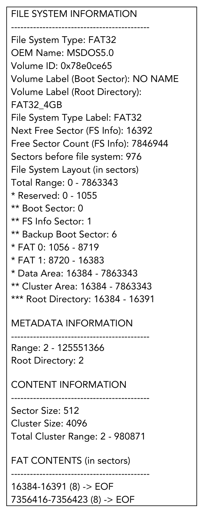
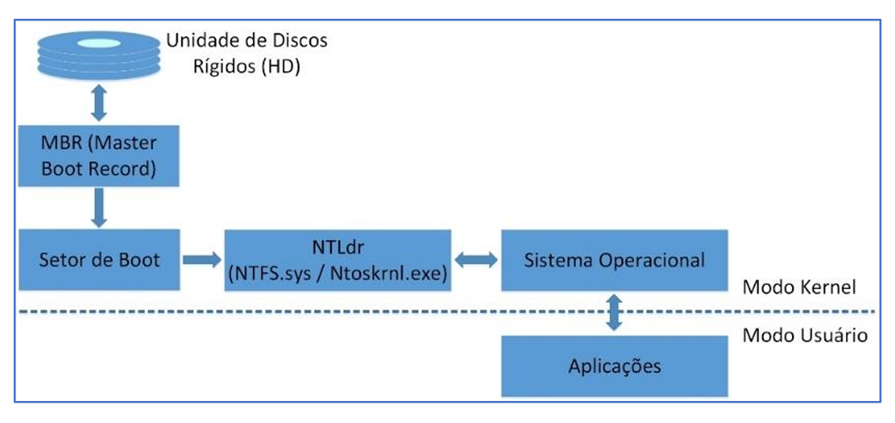
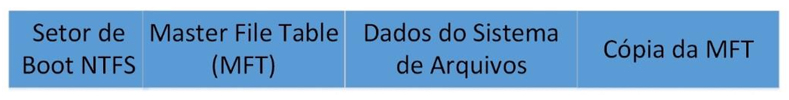
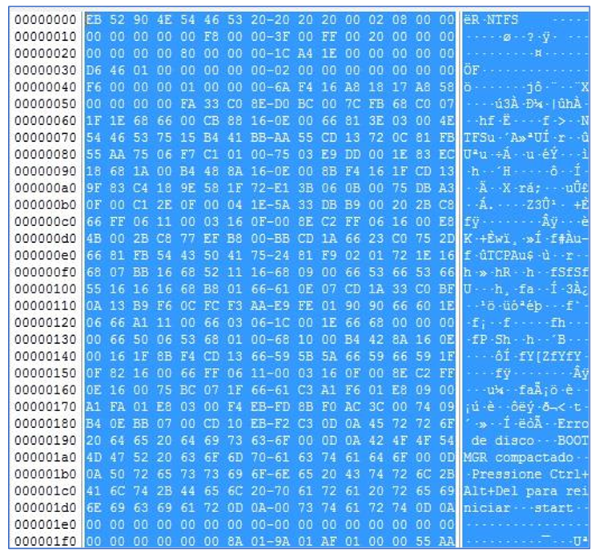
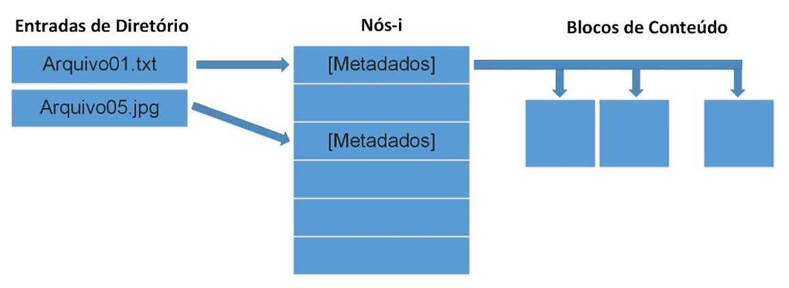
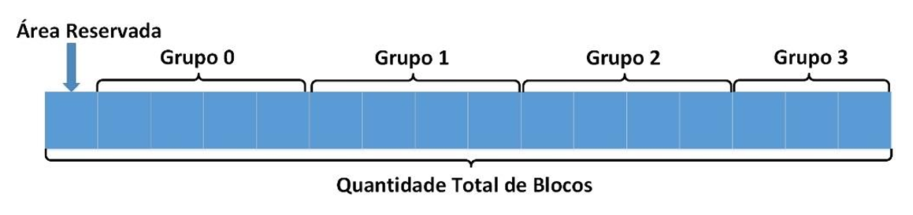

# Capítulo 6 – Sistemas de Arquivos: FAT, NTFS, EXT e Outros

Nos capítulos anteriores, estabelecemos os conceitos fundamentais do gerenciamento de armazenamento, compreendendo como os sistemas de arquivos abstraem a complexidade do hardware e organizam os dados de forma lógica. Agora, vamos mergulhar nas implementações específicas que dão vida a esses conceitos. Cada sistema operacional, ao longo de sua evolução, desenvolveu ou adotou sistemas de arquivos com características, vantagens e limitações distintas, projetados para atender a diferentes necessidades de desempenho, segurança e escalabilidade.

Neste capítulo, faremos uma análise detalhada de algumas das famílias de sistemas de arquivos mais influentes e amplamente utilizadas: a família **FAT**, pioneira e ainda relevante para compatibilidade; o **NTFS**, o robusto padrão do ecossistema Windows; e a família **EXT**, a espinha dorsal do mundo Linux. Além disso, exploraremos brevemente outros sistemas de arquivos importantes que você pode encontrar em diversos contextos, desde dispositivos Apple até mídias ópticas e redes. Compreender as particularidades de cada um é essencial para qualquer profissional de tecnologia.

## FAT (File Allocation Table): O Legado da Simplicidade e Compatibilidade

O sistema de arquivos **FAT (File Allocation Table)** é um dos mais antigos e, ao mesmo tempo, um dos mais duradouros da história da computação pessoal. Desenvolvido originalmente pela Microsoft para ser utilizado em mídias de baixa capacidade, como os disquetes de menos de 500 KB, sua principal característica é a simplicidade de sua estrutura de dados. Essa simplicidade o tornou extremamente leve e fácil de implementar, garantindo uma compatibilidade quase universal. Hoje, embora obsoleto para uso como sistema de arquivos principal em sistemas operacionais modernos, o FAT ainda é amplamente encontrado em dispositivos de armazenamento removíveis, como pen drives e cartões de memória, justamente por ser suportado por praticamente todas as versões do Microsoft Windows, pela maioria dos sistemas Linux, por sistemas macOS, câmeras digitais, smart TVs e muitos outros dispositivos.

A "família" FAT é composta por três versões principais: **FAT12**, **FAT16** e **FAT32**. A diferença fundamental entre elas reside na **quantidade de bits utilizados para endereçar cada entrada na tabela FAT** (12, 16 ou 32 bits, respectivamente). Esse número de bits determina diretamente o número máximo de clusters que o sistema de arquivos pode gerenciar, impactando o tamanho máximo da partição e a eficiência do uso do espaço.

O coração do sistema é a própria **Tabela de Alocação de Arquivos (FAT)**. Como vimos no capítulo anterior, trata-se de uma implementação do método de alocação encadeada, onde a tabela, mantida na memória, funciona como uma lista de ponteiros que indica, para cada cluster (a menor unidade de alocação de disco), qual é o próximo cluster na cadeia de um arquivo.

Neste sistema, as pastas (diretórios) são tratadas de forma muito semelhante aos arquivos, possuindo apenas um atributo especial que as identifica como tal. Se um arquivo ou pasta ocupa mais de um cluster, esses clusters podem não estar armazenados de forma adjacente no disco, um fenômeno conhecido como **fragmentação**. O sistema FAT não possui mecanismos intrínsecos para evitar a fragmentação; ele simplesmente grava os dados no primeiro local livre que encontra. Em dispositivos onde arquivos são constantemente criados, apagados ou têm seu tamanho alterado, o nível de fragmentação pode se tornar bastante elevado, afetando negativamente o desempenho (especialmente em discos rígidos mecânicos, onde a cabeça de leitura precisa se mover para diferentes regiões do disco para ler os clusters de um mesmo arquivo).

Para cada arquivo e pasta, o sistema FAT mantém uma **entrada de diretório**, uma estrutura de dados de 32 bytes que armazena informações essenciais como o nome do arquivo/pasta, seu tamanho, o endereço do cluster inicial de seu conteúdo, e outros atributos.

### Estrutura de um Volume FAT

Um volume (partição) formatado com o sistema de arquivos FAT é organizado em quatro regiões principais:

1. **Região Reservada (Reserved Region):** O primeiro setor do volume é sempre o **Setor de Boot (Boot Sector)**. Ele contém o código de inicialização necessário para carregar o sistema operacional e uma estrutura de dados fundamental chamada **BIOS Parameter Block (BPB)**. O BPB armazena informações vitais sobre o volume, como o tipo exato do sistema de arquivos (FAT12, FAT16 ou FAT32), o tamanho do setor, o número de setores por cluster e ponteiros para a localização das outras regiões do sistema de arquivos.
2. **Região da Tabela de Alocação de Arquivos (FAT Region):** Esta área armazena a própria tabela FAT. Para fins de redundância e recuperação em caso de danos, esta região normalmente contém **duas cópias idênticas da FAT**. A segunda cópia é (ou deveria ser) mantida sincronizada com a primeira e pode ser usada para substituir a tabela primária se for detectada alguma corrupção.
3. **Região do Diretório Raiz (Root Directory Region):** Esta é uma região especial que só existe de forma fixa nos sistemas **FAT12 e FAT16**. Ela funciona como uma tabela de tamanho pré-alocado que armazena as entradas de diretório para todos os arquivos e pastas localizados diretamente na raiz do volume. Por ter um tamanho fixo, isso impõe um limite estrito na quantidade de itens que podem ser criados no diretório raiz nesses sistemas. O **FAT32**, mais moderno, eliminou essa limitação ao tratar o diretório raiz como um cluster de dados comum, permitindo que ele cresça dinamicamente, assim como qualquer outro diretório. Suas informações são mantidas na Região de Dados.
4. **Região de Dados (Data Region):** Esta é a maior parte da partição, onde o conteúdo real dos arquivos e os dados dos diretórios (exceto o raiz em FAT12/16) são efetivamente armazenados.

### As Versões da FAT

As principais versões da FAT são:

- **FAT12:** A versão original, muito utilizada em disquetes (1.44 MB e 2.88 MB) e nas primeiras versões do MS-DOS (1.0 e 2.0). Com suas entradas de 12 bits, o tamanho máximo de um volume que utiliza FAT12 é muito pequeno para os padrões atuais, geralmente na casa dos megabytes (ex: 8 MB).
- **FAT16:** Introduzido com o MS-DOS 3.0, o FAT16 utiliza 16 bits para endereçar os clusters, permitindo gerenciar até 216 = 65.536 clusters. O tamanho do cluster podia variar (geralmente de 512 bytes a 32 KB), o que permitia que o FAT16 suportasse partições de, no máximo, **2 GB** (com clusters de 32 KB).
- **FAT32:** A evolução natural, que utiliza 28 dos 32 bits de cada entrada para endereçar clusters (os 4 bits mais significativos são reservados). Isso permite endereçar uma quantidade muito maior de clusters, suportando volumes significativamente maiores (até 2 TB em teoria, embora o Windows imponha um limite de criação de 32 GB). Uma vantagem adicional do FAT32 é o uso de **clusters menores** para um mesmo tamanho de partição em comparação com o FAT16. Isso resulta em um uso mais eficiente do espaço em disco, pois reduz a quantidade de espaço desperdiçado no último cluster de cada arquivo (o **slack space**).

### Limitações de Atributos e Nomes no FAT

O sistema de arquivos FAT é bastante limitado em relação aos metadados que pode armazenar. Ele suporta apenas alguns poucos atributos de arquivo: **somente leitura, oculto, de sistema e de arquivamento**. Notavelmente, **não há atributos relacionados à segurança**, como dono do arquivo ou listas de controle de acesso, o que o torna inadequado para sistemas operacionais multiusuário que requerem proteção de dados.

A implementação original da Microsoft também impunha limitações estritas nos nomes de arquivo (formato 8.3), não permitindo espaços ou caracteres especiais como `." / \ [ ] : ; | = , < > +`. Além disso, todas as letras eram convertidas para maiúsculas. Embora extensões posteriores (como VFAT, usado no Windows 95) tenham adicionado suporte a nomes de arquivo longos, a estrutura subjacente ainda mantém muitas dessas limitações legadas.

### Entradas na Tabela FAT

Cada entrada na tabela FAT pode conter um dos seguintes valores para indicar o status do cluster correspondente:

|Valor (Hexadecimal)|Significado|
|---|---|
|`0x0000`|O cluster não está sendo utilizado (está livre).|
|`0x0002` a `0xFFEF`|Endereço do próximo cluster na cadeia de um arquivo.|
|`0xFFF0` a `0xFFF6`|Valor especial que indica o fim da cadeia de clusters (EOC - End Of Cluster-chain).|
|`0xFFF7`|Valor especial que identifica um cluster defeituoso (_bad cluster_) para que não seja utilizado.|

### Exemplo de Análise Forense com `fsstat`

Ferramentas forenses, como o `fsstat` do The Sleuth Kit (TSK) em ambientes Linux, permitem obter informações detalhadas sobre a estrutura de um sistema de arquivos. A figura abaixo mostra um exemplo da saída do `fsstat` para um volume FAT32, revelando metadados como o tipo do sistema de arquivos, o identificador OEM, o tamanho do setor, o número de setores por cluster e a localização das regiões FAT e de dados. Para mais detalhes, o documento da Microsoft "FAT: General Overview of On-Disk Format" é uma referência técnica completa.

  

### exFAT (Extended File Allocation Table)

Também conhecido como **FAT64**, o **exFAT** é um sistema de arquivos moderno desenvolvido pela Microsoft, projetado para ser o sucessor da família FAT, especialmente para uso em mídias de memória flash como pen drives, cartões SD e SSDs externos.

O exFAT foi criado para ser uma solução intermediária, ideal para cenários onde:

- O sistema de arquivos **NTFS não é viável**, devido à sua maior sobrecarga de estruturas de dados, que pode ser indesejável em dispositivos simples ou pode aumentar o desgaste em memórias flash.
- O limite de tamanho de arquivo do **FAT32 (4 GB)** é um grande problema, impedindo o armazenamento de arquivos grandes, como vídeos em alta definição ou imagens de disco.

Sendo assim, o exFAT combina a simplicidade e a alta compatibilidade do FAT com a capacidade de lidar com arquivos e volumes muito maiores. Ele foi adotado pela SD Card Association como o sistema de arquivos padrão para cartões **SDXC** (e superiores) com capacidade maior que 32 GB.

## NTFS (New Technology File System): O Padrão do Windows

O **NTFS (New Technology File System)** é o sistema de arquivos padrão, moderno e robusto para todas as versões do sistema operacional Microsoft Windows a partir do Windows NT. Ele foi criado para superar as diversas limitações e a falta de recursos de segurança e confiabilidade da família FAT, fornecendo uma base sólida para um sistema operacional mais completo e confiável. Versões mais antigas como MS-DOS, Windows 95, 98 e ME não suportam NTFS.

Na tabela de partições de um disco (seja MBR ou GPT), o campo **"System ID"** é usado para identificar o tipo de sistema de arquivos de uma partição. Para NTFS, o identificador comum em uma tabela MBR é **`0x07`**.

### Arquitetura e Estrutura do NTFS

A arquitetura do NTFS é significativamente mais complexa e rica em recursos do que a do FAT. A figura abaixo mostra uma visão de alto nível dos componentes que interagem para que o NTFS funcione em um sistema Windows.

  

Vamos descrever os principais componentes mostrados na figura:

|Componente|Descrição|
|---|---|
|**HD**|O disco rígido (ou SSD) que contém uma ou mais partições.|
|**Setor de Boot**|A área inicial de uma partição inicializável. Armazena informações sobre o leiaute do volume, as estruturas do sistema de arquivos e o código que carrega o `NTLDR` (em versões mais antigas do Windows) ou o Gerenciador de Inicialização do Windows.|
|**MBR**|O Master Boot Record, localizado no início do disco, contém o código executável que o BIOS carrega na memória. Este código procura na tabela de partições para determinar qual partição é a ativa (inicializável) e transferir o controle para ela.|
|**NTLDR.dll**|O carregador do Windows NT (usado até o Windows XP/Server 2003). Ele lê o arquivo `boot.ini` para apresentar as opções de inicialização e carrega o kernel do sistema. Em versões modernas (Vista e posteriores), foi substituído pelo `bootmgr` e pelo BCD (Boot Configuration Data).|
|**NTFS.sys**|O **driver** principal do sistema de arquivos NTFS. É este componente de software que implementa toda a lógica para ler, escrever e gerenciar o sistema de arquivos NTFS.|
|**Ntoskrnl.exe**|O arquivo executável do **kernel** do Windows. Ele é o coração do sistema operacional, gerenciando processos, memória e, através de drivers como o `NTFS.sys`, os dispositivos. Ele extrai informações sobre quais drivers devem ser carregados e em que ordem.|
|**Modo Kernel**|O modo de processamento privilegiado onde o kernel (`Ntoskrnl.exe`) e os drivers (`NTFS.sys`) são executados, permitindo acesso direto a todo o hardware e memória.|
|**Modo Usuário**|O modo de processamento restrito no qual os aplicativos do usuário são executados.|

Em relação à estrutura física em disco, os clusters (a menor unidade de alocação) em uma partição NTFS são numerados sequencialmente desde o início do volume. A pedra angular do NTFS, que o diferencia fundamentalmente do FAT, é a **MFT (Master File Table)**. A MFT não é apenas uma tabela de alocação; ela é uma estrutura sofisticada, semelhante a um banco de dados relacional, que armazena informações sobre **todos** os objetos no volume, incluindo cada arquivo, cada diretório e até mesmo os metadados do próprio sistema de arquivos.

**Volumes e Limites de Tamanho:** Discos que utilizam o particionamento MBR tradicional têm uma limitação que impede a criação de partições com mais de 2 TB. Para superar isso em discos MBR, o Windows permite o uso de **volumes dinâmicos**. Para discos formatados com o padrão mais moderno **GPT (GUID Partition Table)**, essa limitação não existe, e o NTFS pode suportar volumes de até 256 TB (ou mais, dependendo da versão do Windows).

### Organização da Partição NTFS

A figura e a tabela a seguir descrevem a organização das estruturas de dados em uma partição NTFS.

  

|Componente|Descrição|
|---|---|
|**Setor de Boot NTFS**|Contém o Bloco de Parâmetros da BIOS (BPB), que descreve o leiaute físico do volume, e o código de bootstrap que inicializa o carregamento do sistema operacional.|
|**Master File Table (MFT)**|A estrutura central do NTFS. É um arquivo que contém pelo menos um registro (geralmente de 1 KB) para cada arquivo e diretório no volume, armazenando todos os seus atributos.|
|**Dados do Sistema de Arquivos**|Área do disco que armazena os dados que não cabem diretamente na MFT, como o conteúdo de arquivos grandes.|
|**Cópia da MFT ($MftMirr)**|Uma cópia de segurança dos primeiros registros essenciais da MFT, utilizada para recuperação do sistema de arquivos caso a MFT original seja danificada.|

Quando um volume NTFS é formatado, os primeiros 16 setores são tipicamente alocados para o setor de boot e o código de bootstrap. A figura abaixo mostra um exemplo do setor de boot de uma imagem de um pen drive de 1 GB formatado com NTFS.

  

A tabela a seguir detalha os campos mais importantes do setor de boot NTFS, com base no exemplo da figura:

|Posição (Hex)|Nome do Campo|Descrição|Valor do Exemplo (Pen Drive 1GB)|
|---|---|---|---|
|`0x00` a `0x02`|Instrução Jump|Instrução de salto (JUMP) para o código de bootstrap, típica de arquiteturas x86.|`0xEB5290`|
|`0x03` a `0x0A`|Identificador OEM|Identificador do fabricante ou sistema que formatou o volume.|`0x4E54465320202020` ("NTFS ")|
|`0x0B` a `0x53`|BPB e BPB Estendido|O Bloco de Parâmetros da BIOS, contendo o leiaute físico do volume (tamanho do setor, setores por cluster, etc.).|_Ver na figura para valores detalhados._|
|`0x54` a `0x1FD`|Código Bootstrap|O código executável responsável por iniciar o carregamento do sistema operacional.|_Código binário. Parte do texto visível na figura: "Erro de disco..."_|
|`0x1FE` a `0x1FF`|Marcador Fim do Setor|A assinatura padrão `0x55AA` (armazenada como `AA55` devido à ordem de bytes _little-endian_), que marca o fim de um setor de boot válido.|`0xAA55`|

### A Master File Table (MFT) e seus Metadados

A MFT é, essencialmente, um banco de dados relacional onde cada "linha" é um **registro de arquivo** e as "colunas" são os **atributos** desse arquivo. Tudo em um volume NTFS, incluindo a própria MFT, é tratado como um arquivo e, portanto, possui pelo menos uma entrada na MFT. Os primeiros 16 registros da MFT são reservados para **arquivos de metadados**, que são arquivos especiais usados pelo próprio NTFS para se descrever e se gerenciar. Seus nomes geralmente começam com o símbolo de cifrão (`$`).

|Nome do Arquivo de Metadados|Registro MFT|Descrição|
|---|---|---|
|**`$Mft`**|0|O próprio arquivo da MFT. Contém um registro para cada arquivo/pasta no volume. Se as informações de um arquivo forem muito grandes para um único registro, registros adicionais são alocados.|
|**`$MftMirr`**|1|O espelho da MFT. Garante acesso aos metadados críticos caso haja falha em um setor da MFT original. Tipicamente, espelha os primeiros quatro registros.|
|**`$LogFile`**|2|O arquivo de **journaling** do NTFS. Registra transações de metadados para permitir uma recuperação rápida e consistente do sistema de arquivos após uma falha. Seu tamanho depende do tamanho do volume.|
|**`$Volume`**|3|Contém informações sobre o volume, como o rótulo (nome) e a versão do NTFS.|
|**`$AttrDef`**|4|A definição dos atributos. Lista todos os nomes de atributos, seus números e descrições, definindo o "schema" da MFT.|
|**`.` (Ponto)**|5|O arquivo do diretório raiz.|
|**`$Bitmap`**|6|Um mapa de bits do volume, representando quais clusters estão alocados (bit 1) ou não alocados (bit 0).|
|**`$Boot`**|7|Uma cópia do setor de boot do volume.|
|**`$BadClus`**|8|Um arquivo que contém uma lista de todos os clusters defeituosos no volume para que não sejam utilizados.|
|**`$Secure`**|9|Contém os descritores de segurança únicos para todos os arquivos no volume, gerenciando as permissões de acesso (ACLs).|
|**`$Upcase`**|10|Uma tabela para converter caracteres minúsculos para seus equivalentes maiúsculos em Unicode, para garantir a consistência na comparação de nomes de arquivos.|
|**`$Extend`**|11|Um diretório que contém outros arquivos de metadados para extensões opcionais, como cotas de disco (`$Quota`), _reparse points_ e identificadores de objetos.|
|-|12 a 15|Reservado para uso futuro.|

### Recursos Avançados do NTFS

O NTFS foi projetado com recursos avançados que eram ausentes na família FAT:

- **Nomes de Arquivo Longos:** Permite nomes de arquivos com até 255 caracteres, suportando o conjunto de caracteres Unicode. Os caracteres `\ / : * ? " < > |` não são permitidos.
- **Segurança e Permissões:** O NTFS possui um modelo de segurança robusto baseado em **Listas de Controle de Acesso (ACLs)**. Para cada arquivo e pasta, é possível definir permissões detalhadas (ler, escrever, executar, apagar, etc.) para usuários e grupos específicos. As permissões são **cumulativas** (um usuário recebe a união de suas permissões e das permissões dos grupos a que pertence), mas a permissão **Negar (Deny) tem prioridade sobre qualquer outra permissão de Permitir (Allow)**.
- **Criptografia (EFS):** O **Encrypting File System (EFS)** é um componente integrado ao NTFS que permite a criptografia transparente de arquivos e pastas no nível do sistema de arquivos. Os dados são criptografados no disco e descriptografados automaticamente para o usuário autorizado quando acessados.
- **Auto-Recuperação (Self-Healing):** A partir do Windows Vista/Server 2008, o NTFS incorporou um recurso de auto-recuperação. Um trabalhador em segundo plano (`chkdsk`) pode detectar e corrigir danos na estrutura do sistema de arquivos de forma online, sem a necessidade de tirar o volume do ar para executar uma verificação completa.
- **Suporte ao Active Directory:** Em ambientes de rede Windows, o Active Directory (AD), o serviço de diretório da Microsoft, depende do NTFS para armazenar seu banco de dados (que contém informações sobre usuários, grupos, computadores, políticas, etc.).
- **Journaling (LFS):** Como mencionado, o NTFS utiliza o **Log File Service (LFS)**, implementado no arquivo `$LogFile`, para prover registros e serviços de recuperação rápida, garantindo a consistência dos metadados do sistema de arquivos.

## EXT (Extended File System): A Família Padrão do Linux

Os sistemas operacionais baseados em Linux suportam dezenas de sistemas de arquivos, cada um com suas peculiaridades e otimizações. No entanto, a família **EXT (Extended File System)** tem sido, historicamente, a espinha dorsal do armazenamento em Linux. Por muito tempo, o **Ext2** foi o sistema de arquivos padrão, herdando conceitos do **UFS (Unix File System)**, usado em sistemas como FreeBSD e Solaris, e compartilhando semelhanças com os sistemas HFS da Apple.

A menor unidade de alocação de disco no Ext é o **bloco**, que é o equivalente ao cluster em sistemas FAT e NTFS. O tamanho do bloco (tipicamente 1024, 2048 ou 4096 bytes) é escolhido no momento da formatação da partição.

### Layout Geral da Família Ext

Uma partição Ext começa com uma área reservada opcional, e o restante do espaço é dividido em uma série de **grupos de blocos (block groups)**. Com exceção do último grupo, que pode ser menor, todos os outros possuem o mesmo tamanho e estrutura. A ideia de agrupar blocos é uma estratégia para melhorar o desempenho, tentando manter os dados de um arquivo e seus metadados relacionados (como seu i-node) fisicamente próximos no disco, dentro do mesmo grupo de blocos, para reduzir o tempo de busca da cabeça de leitura do disco.

Cada grupo de blocos contém tanto os **blocos de dados** (onde o conteúdo dos arquivos é armazenado) quanto os **metadados** que descrevem o próprio grupo e os arquivos nele contidos.

As informações básicas e globais sobre a partição Ext são armazenadas em uma estrutura de dados fundamental chamada **superbloco (superblock)**, localizada no início do sistema de arquivos. O conteúdo real dos arquivos e diretórios é armazenado nos blocos de dados. Os metadados de cada arquivo ou diretório (como permissões, datas, tamanho e, crucialmente, os ponteiros para os blocos de dados) são armazenados em uma estrutura de tamanho fixo chamada **nó-índice (i-node)**. Os i-nodes de um grupo de blocos são organizados em uma **tabela de i-nodes**.

Finalmente, o nome de um arquivo não é armazenado no seu i-node. Ele é guardado em uma **estrutura de entrada de diretório**, localizada nos blocos de dados alocados para o diretório pai. Cada entrada de diretório é uma estrutura simples que associa um nome de arquivo a um ponteiro para o i-node correspondente. A figura abaixo ilustra essa relação.

  

**O Superbloco:** Localizado a 1024 bytes do início da partição, o superbloco (com 1024 bytes de tamanho) contém valores de configuração críticos para o sistema de arquivos, como:

- Tamanho do bloco.
- Número total de blocos e i-nodes na partição.
- Número de blocos e i-nodes por grupo.
- Nome do volume, versão do sistema de arquivos, etc.

Cópias de segurança do superbloco são geralmente armazenadas no primeiro bloco de cada grupo de blocos, permitindo a recuperação caso o superbloco primário seja corrompido.

**Estrutura dos Grupos de Blocos:** No bloco que sucede o superbloco, encontramos a **tabela de descritores de grupos**. Esta tabela contém uma estrutura para cada grupo de blocos, descrevendo seu leiaute. Um grupo de blocos típico contém os seguintes dados administrativos, além dos blocos de dados:

  

- **Superbloco (cópia):** Uma cópia de segurança do superbloco.
- **Descritores de Grupo (cópias):** Cópias da tabela de descritores de grupo.
- **Bitmap de Blocos:** Um mapa de bits que gerencia a alocação dos blocos de dados dentro do grupo (bit `1` para alocado, `0` para livre). O endereço de início deste bitmap é dado no descritor de grupo.
- **Bitmap de I-nodes:** Um mapa de bits que gerencia a alocação dos i-nodes na tabela de i-nodes do grupo.
- **Tabela de I-nodes:** A área que armazena as estruturas de i-node para os arquivos e diretórios do grupo.

  

**A Estrutura do I-node:** O i-node (geralmente com 128 bytes ou mais em versões recentes) é o coração do gerenciamento de arquivos no Ext. Ele armazena todos os metadados de um arquivo, exceto seu nome. A tabela a seguir mostra as flags de permissão clássicas do UNIX (bits 0 a 8) encontradas no campo "modo" de um i-node:

|Flag (Hex)|Permissão|Descrição|
|---|---|---|
|`0x0001`|Outro – Execução|Permissão de execução para "outros".|
|`0x0002`|Outro – Escrita|Permissão de escrita para "outros".|
|`0x0004`|Outro – Leitura|Permissão de leitura para "outros".|
|`0x0008`|Grupo – Execução|Permissão de execução para o grupo do arquivo.|
|`0x0010`|Grupo – Escrita|Permissão de escrita para o grupo.|
|`0x0020`|Grupo – Leitura|Permissão de leitura para o grupo.|
|`0x0040`|Usuário – Execução|Permissão de execução para o dono do arquivo.|
|`0x0080`|Usuário – Escrita|Permissão de escrita para o dono.|
|`0x0100`|Usuário – Leitura|Permissão de leitura para o dono.|

Existem muitos outros detalhes técnicos na implementação do Ext, especialmente em relação às estruturas de dados do superbloco e dos i-nodes. Em contextos de concursos muito específicos, a cobrança desses detalhes pode ocorrer.

### A Evolução: de Ext2 a Ext4

**Ext2:** Foi o padrão do Linux por muitos anos. É um sistema de arquivos robusto e rápido, mas com uma grande desvantagem: **não possui journaling**. Isso significa que, após uma falha de sistema, ele precisa passar por uma longa e demorada verificação de consistência (`fsck`).

**Ext3:** A principal característica introduzida no **Ext3** foi o **suporte a journaling**. Isso o tornou muito mais robusto contra falhas. O journal armazena uma lista das alterações de metadados antes de serem efetivadas, permitindo uma recuperação muito rápida após um desligamento incorreto. O Ext3 oferece três modos de journaling:

- **`ordered` (padrão):** Garante que os dados sejam escritos nos arquivos antes que seus metadados sejam marcados como concluídos no journal. É um bom equilíbrio entre desempenho e segurança. 
- **`writeback`:** Mais rápido, mas menos seguro. Apenas os metadados são registrados no journal, e não há garantia de que os dados foram escritos antes dos metadados. Pode levar à corrupção de dados em caso de falha.
- **`journal`:** O modo mais seguro, mas também o mais lento. Tanto os metadados quanto o conteúdo completo dos dados são escritos no journal antes de irem para o disco. A tabela abaixo mostra os limites de tamanho do Ext3, que dependem do tamanho de bloco escolhido na formatação.

| Tamanho do Bloco | Tamanho Máx. do Arquivo | Tamanho Máx. do Sistema de Arquivos (Volume) |
| --- | --- | --- | 
| 1 KB | 16 GB | 2 TB |
| 2 KB | 256 GB | 8 TB |
| 4 KB | 2 TB | 16 TB |
| 8 KB | 2 TB | 32 TB |

**Ext4:** É o padrão atual na maioria das distribuições Linux e representa uma evolução significativa sobre o Ext3. Embora o limite de 32 TB do Ext3 não fosse um problema imediato, o **Ext4** foi projetado para o futuro, incorporando o uso de **endereços de 48 bits**, o que permite endereçar volumes de até **1 exabyte (EB)**. O limite de tamanho por arquivo também foi drasticamente aumentado, virtualmente para o tamanho do volume. Outras melhorias importantes incluem:

- **Extents:** Em vez de mapear cada bloco individualmente (como no Ext3), o Ext4 pode usar extents, que são referências a intervalos de blocos físicos contíguos. Isso melhora drasticamente o desempenho para arquivos grandes e reduz a fragmentação.
- **Alocação Atrasada (Delayed Allocation):** O Ext4 pode adiar a alocação de blocos em disco até o último momento, quando os dados precisam ser efetivamente escritos. Isso permite que o sistema de arquivos tome decisões de alocação melhores, agrupando dados e reduzindo a fragmentação.
- **Maior Número de Subdiretórios:** O limite de 32.000 subdiretórios do Ext3 foi removido; no Ext4, não há um limite fixo.
- **Checksum do Journaling:** Adiciona somas de verificação (checksums) ao journal, tornando a recuperação ainda mais rápida e confiável.
- **Verificação Rápida (`fsck`):** A estrutura de organização em grupos de blocos permite que partes não utilizadas do disco sejam ignoradas durante a verificação, economizando muito tempo.
- **Undelete:** Embora não seja um recurso totalmente garantido, o Ext4 possui mecanismos que tornam a recuperação de arquivos deletados mais viável do que no Ext3.

## Outros Sistemas de Arquivos Relevantes

Além das famílias FAT, NTFS e Ext, existem muitos outros sistemas de arquivos, cada um com suas próprias características e casos de uso. Alguns já foram alvo de questões de concurso, geralmente sem a necessidade de um conhecimento muito aprofundado.

|Sistema de Arquivos|Descrição|
|---|---|
|**HFS+**|**(Hierarchical File System Plus)** Desenvolvido pela Apple, foi o sistema de arquivos primário em computadores **macOS** e dispositivos **iOS** por muitos anos. Também conhecido como _Mac OS Expandido_.|
|**APFS**|**(Apple File System)** O sucessor moderno do HFS+, projetado e otimizado pela Apple para **armazenamento de estado sólido (SSDs)**. É o padrão atual em todos os dispositivos Apple (macOS, iOS, iPadOS, etc.) e tem como foco principal a criptografia, snapshots e integridade de dados.|
|**Btrfs**|**(B-tree file system)** Um sistema de arquivos moderno para **Linux**, baseado no princípio de **cópia em gravação (copy-on-write - COW)**. Foi projetado para solucionar limitações de sistemas de arquivos mais antigos, oferecendo recursos integrados como gerenciamento de múltiplos volumes, snapshots, checksums de dados e RAID. Suporta volumes e arquivos de até 16 EB.|
|**XFS**|Um sistema de arquivos com journaling de alto desempenho, originalmente desenvolvido pela Silicon Graphics (SGI) para seu sistema operacional IRIX. Foi portado para o **Linux** e é conhecido por sua excelente performance com arquivos grandes e em sistemas com alto grau de paralelismo. Em plataformas de 64 bits, suporta volumes e arquivos de até 8 EB.|
|**ReiserFS**|Um dos primeiros sistemas de arquivos com **journaling** a ser incluído no kernel do Linux (versão 2.4). Ficou conhecido por seu bom desempenho com um grande número de arquivos pequenos. Seu desenvolvimento futuro tornou-se incerto após questões legais envolvendo seu criador, Hans Reiser, embora voluntários tenham continuado o projeto por um tempo.|
|**NFS**|**(Network File System)** Não é um sistema de arquivos de disco, mas sim um **protocolo de sistema de arquivos distribuído**. Desenvolvido pela Sun Microsystems, permite que um computador cliente acesse arquivos através de uma rede como se eles estivessem em seu disco local. Utiliza o sistema de Chamada de Procedimento Remoto (RPC) para funcionar.|
|**Swap**|Não é um sistema de arquivos no sentido tradicional, mas sim a área de **memória virtual** do Linux. Geralmente, é configurado em uma **partição específica** (diferente do Windows, que usa um arquivo de paginação). Essa partição tem uma organização própria e otimizada para a troca de páginas de memória, sem a sobrecarga de um sistema de arquivos completo.|
|**ISO 9660**|Também conhecido como **CDFS (Compact Disc File System)**, é o padrão universal para o armazenamento de dados em mídias ópticas como **CDs e DVDs**. Sua principal vantagem é a alta compatibilidade, permitindo que discos formatados com ISO 9660 sejam lidos por praticamente qualquer sistema operacional (Windows, macOS, Linux).|
|**Joliet**|Uma **extensão** do padrão ISO 9660, especificada pela Microsoft. Seu foco principal foi relaxar as restrições rígidas do ISO 9660 sobre os nomes de arquivos, permitindo nomes mais longos (até 64 caracteres Unicode) e uma hierarquia de diretórios mais profunda, mantendo a compatibilidade.|
|**CIFS/SMB**|**CIFS (Common Internet File System)** é um **protocolo de rede** da camada de aplicação, uma implementação do dialeto **SMB (Server Message Block)**. É usado principalmente para fornecer acesso compartilhado a arquivos e impressoras em redes locais, sendo o protocolo nativo de compartilhamento de arquivos em sistemas Windows.|

## Considerações Finais

Neste capítulo, fizemos um mergulho profundo nas implementações específicas que governam o armazenamento de dados em nossos computadores. Passamos da teoria geral do gerenciamento de armazenamento para a prática, analisando as arquiteturas, os recursos e as limitações das famílias de sistemas de arquivos mais proeminentes.

Exploramos a família **FAT**, compreendendo sua simplicidade e legado, que garantem sua onipresença em dispositivos removíveis, mas também suas limitações em segurança e escalabilidade. Em contraste, analisamos o **NTFS**, o sistema de arquivos robusto e rico em recursos do Windows, com sua estrutura baseada na MFT, journaling, segurança granular e suporte a grandes volumes.

Voltamo-nos então para o ecossistema Linux, dissecando a família **EXT**. Vimos a evolução do Ext2, sem journaling, para o Ext3, que introduziu essa camada de segurança, e finalmente para o **Ext4**, o padrão moderno, com suas otimizações de desempenho como _extents_ e alocação atrasada, e sua capacidade de gerenciar volumes e arquivos gigantescos.

Por fim, fizemos uma breve incursão por outros sistemas de arquivos importantes, como o **APFS** da Apple, otimizado para SSDs, o inovador **Btrfs** com sua abordagem _copy-on-write_, e protocolos de rede como **NFS** e **CIFS/SMB**, que estendem o conceito de sistema de arquivos através da rede.

A escolha de um sistema de arquivos não é uma decisão trivial; ela tem implicações diretas no desempenho, na confiabilidade, na segurança e na compatibilidade de um sistema. Conhecer as características de cada um capacita o profissional de tecnologia a tomar decisões mais informadas, seja ao configurar um servidor, formatar um pen drive ou planejar a infraestrutura de armazenamento para uma aplicação complexa. O mundo dos sistemas de arquivos está em constante evolução, respondendo às novas demandas de hardware e software, e os conceitos aqui abordados formam a base para compreender as tecnologias de hoje e as que virão amanhã.